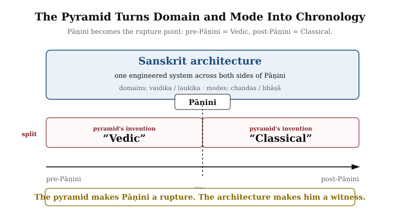

# Preface

*Draft v1 — for iteration*

---

::: epigraph

> उत त्वः पश्यन्न ददर्श वाचम् उत त्वः शृण्वन्न अशृणोत्येनाम् ।\
> उतो त्वस्मै तन्वं वि सस्रे जायेव पत्य उशती सुवासाः ॥
>
> *uta tvaḥ paśyan na dadarśa vācam uta tvaḥ śṛṇvann aśṛṇoty enām |*\
> *uto tvasmai tanvaṃ vi sasre jāyeva patya uśatī suvāsāḥ ||*
>
> `\hfill`{=latex}*— Ṛgveda 10.71.4*[NOTE: rigveda-10-71-4-vach]

:::

\bigskip

One may look and still not see Speech. One may listen and still not hear her.[NOTE: rigveda-10-71-4-vach]

That is the condition in which Sanskrit stands before the modern world today. The language has been visible, audible, recited, parsed, taught, and documented across thousands of years. Its name says what it is. Its grammar says what it is. Its recitation lineages say what it is. Its architecture says what it is. Sanskrit has been telling the world, in its very name and in every line of its grammar, that it was created — not grown. 

What modern philology calls Proto-Indo-European does not exist. **Mātṛ** *is* the etymon of **mother**. The cognates everywhere else are reflections — **प्रतिबिम्ब (*Pratibimba*)** — of the original engineered Sanskrit forms.

Sanskrit is not the daughter language of some imagined parent. It is a deliberately engineered linguistic system, designed to resist entropy. It remains the only such system known to have been built by any civilization: a language whose own architecture preserves the standard across both pre- and post-Pāṇini eras. While modern academia treats Greek, Latin, Tibetan, Arabic, and Hebrew as foundational pillars of grammatical discipline, this book argues that those traditions are downstream from the deeper Sanskrit architecture. Sanskrit retains primacy as **The Calibrant**.

These are conclusions the book will earn, not assumptions the reader has to grant at the threshold. Chapter 1 exposes the category-theft that made Sanskrit look botanical; Chapters 8-12 display the architecture from sonomer to sentence; Chapters 13-15 show the calibration matrix that holds Sanskrit’s standard inside sound, recitation, grammar, meter, and lineage; and Chapters 17-18 close the case against PIE and the cognate-direction story.

A wiser age would not need this book. It would look at Sanskrit and see the architecture. It would listen to the Vedas and hear the engineering. That this argument needs making at all directly contradicts the *dogma* that later means better, today is superior to yesterday, and the world is always evolving upward.

The pyramid has looked and not seen. It has listened and not heard.

The dṛṣṭāḥ (दृष्टाः, seers) *saw* the Vedas. This book follows one layer of what they saw: the linguistic architecture embedded in that revealed corpus. Pāṇini did not codify Sanskrit. He decoded it. Nor was he the first to decode its grammar. He was the finest of many. **Sanskrit was engineered. Encoded in the Vedas. Decoded by many. Pāṇini's decoding is the finest.**

This book also uses the word *fractal* in its architectural sense: the same organizing law recurring across scale. This volume's scale-chain is linguistic. It runs from the mouth to the sonomer, from the sonomer to the *akṣara*, from the *akṣara* to the *dhātuḥ*, from the *dhātuḥ* to the *kriyā*, *śabda*, and *vākya*, from those assemblies to the *sūtra*, and from the *sūtra* to Sanskrit as a calibrated language architecture. Chapter 10 develops the six-characteristic test explicitly through the *sūtra-lakṣaṇam*. This volume establishes the linguistic fractal. Later *Second Shanti* volumes carry the recurrence from language into polity, economy, and civilizational design.

The second half of the epigraph belongs here. The *dṛṣṭāḥ* are ***mantra-dṛṣṭāḥ*** (मन्त्रद्रष्टाः) because Speech reveals herself to the one capable of seeing: ***uto tvasmai tanvaṃ vi sasre***, to him she reveals her body, "as a willing, well-dressed wife to her husband." The image belongs to the verse's intimate grammar of revelation; it is not a rule that only men see. The same lineage remembers women seers too — ***ṛṣikāḥ*** (ऋषिकाः) and ***brahmavādinyaḥ*** (ब्रह्मवादिन्यः) such as Lopāmudrā (लोपामुद्रा), Apālā (अपाला), Viśvavārā (विश्ववारा), Ghoṣā (घोषा), and Vāk Ambhṛṇī (वाक् आम्भृणी).[NOTE: rigveda-10-125-vak-ambhrini] Speech reveals herself where the instrument is capable of seeing. The seers did not fabricate Speech. They saw what Speech revealed.

The same hymn preserves another anchor for this book's argument. Bṛhaspati describes Speech as sifted, formed by the wise with the mind, recognized among friends, and made radiant. Chapter 9 brings that *ṛc* forward at the moment where the sound-field becomes the *varṇamālā*. The book first shows the architecture; then the Vedic verse reveals the operation.

Nineteenth-century European philology built a perimeter around Sanskrit. Its institutional descendants have maintained that perimeter for a century and a half. The point was not to defeat the engineered-Sanskrit claim; the point was to keep any claim from forming at all. Chapters 2 and 3 name the framework and the machinery that kept the perimeter in place.

This book makes the claim the perimeter was built to prevent.

## The Engineering Claim

This book begins from a simple observation. The language itself bears a name — **संस्कृतम् (*saṃskṛtam*)** — built from the prefix *sam-* (totality, completeness, perfection) and the past participle *kṛta* (made, created, produced — from the semantic atom *kṛ*, which produces the action of creation itself). It translates as "perfectly synthesized" or "wholly created."[NOTE: samskrtam-morphology] The *paramparā* (परम्परा) that received and documented it is not "tradition" in the thin English sense. It is an unbroken lineage-chain and distributed transmission architecture. That architecture distinguished Sanskrit explicitly from *prākṛta*, the natural and changing speech of ordinary use. Built into the grammar is a vocabulary for recognizing decay (*apabhraṃśa*) and a vocabulary for refusing it (*siddha*, *nitya*). The grammarians wrote about all of this in foundational works that have been continuously read, recited, and commented upon across the Sanskrit lineage. And yet the dominant scholarly framework for Sanskrit, inherited from nineteenth-century European philology, still treats it as a botanical organism that grew, branched, and decayed from an imaginary ancestor — as if the language's own self-description were a quaint cultural detail rather than the central evidence about what the system actually is.

This book prosecutes that refusal. The evidence is not hidden. Pāṇini's grammar displays it. The Vedic recitation lineages preserve it. The question is why the engineering character of Sanskrit has been treated for so long as anything other than obvious.

Sanskrit behaves like speech because it is speech: recited, spoken, parsed, remembered, sung, taught, and used across poetry, mantra, śāstra, dialogue, ritual, drama, and philosophy. But the same speech also displays an architecture ordinary natural languages do not expose with this precision: the *varṇamālā* (the ordered inventory of sonomers, measured sound-particles; Chapters 8 and 9 move from the sound-field to the selected grid), the *dhātu* inventory, the physiological phonetic grid, the calibration matrix, and the multi-axis grammatical system. The architecture is observable in the Vedas. Sanskrit is the linguistic form the Vedas instantiate. Both display engineering. The origin is a separate question; the engineering is what shows.

**The similarities prove Sanskrit is usable speech. The differences prove it is engineered speech.**

## Chronology Refused

For Indic figures and texts, this book refuses the pyramid's clock. The reason is civilizational before it is methodological. *Sanātan* does not begin with a first day and does not terminate in a final end. Its time-sense is **कालचक्र (*kālacakra*)**, the wheel of time, held inside **अनादि (*anādi*)**, the beginningless, and **अनन्त (*ananta*)**, the endless.

**The beginningless and the endless deny the apex what it needs most: a first point it can own.**

A civilization oriented to the unbounded does not make chronological dating the judge of truth. The same *mantra* recited across ages is the same *mantra*. It does not gain authority by being older or lose authority by being recited again. Forcing precise dates onto Indic anchors imports a foreign teleology along with the dates. That teleology is the linear-progress story Chapter 2 prosecutes: reality arranged on a ladder from primitive to advanced, with the modern pyramid at the summit.

Appendix Part 0 sets out the inverse move: **chronology capture**. The asuric pyramid needs the unbounded forced into a finite clock. Once the pyramid owns the clock, it can call one layer early, another late, one primitive, another developed, one original, another borrowed. It can turn domain into period, mode into stage, architecture into evolution, and calibration into late correction. A date may help sequence events; it cannot decide the category of Sanskrit.

The practice follows from that principle. For Indic depth, this book uses *thousands of years*. Where the prose needs variation, it uses *long before [the relevant external reference point]*, *for as long as the civilization has remembered itself*, and *across thousands of years through guru-shishya lineage-chains*. The depth admits no honest counting; the prose marks depth without pretending precision. I have refused to date Pāṇini — not the “500 BCE” the textbooks keep repeating, not any century, not any range. This book places him only in the deep band: thousands of years ago. The same refusal applies to the *Vedas*, the *Prātiśākhya* discipline, the *Śikṣā* texts, Yāska, and every other Indic figure or text the book references.

The institutional reason is narrower. The dates assigned to Indic figures and events come from the same philological machinery this book is questioning. Pāṇini's “500 BCE,” “400 BCE,” or any other proposed date is not neutral evidence. The same nineteenth- and early-twentieth-century intellectual world that placed Sanskrit inside the racial Arya thesis was also measuring skulls, noses, faces, and bodies — sorting human beings into “Aryan,” “Dravidian,” broad-headed, narrow-headed, high-nosed, low-nosed types, and calling the exercise science. Its chronology and its race-typologies grew in the same soil. It arranged evidence inside its own assumptions, then called the arrangement chronology. The point is not that every assigned date is false. The point is simpler: a machinery that measured Sanskrit with the same confidence with which it measured skulls has no right to be treated as neutral.

The refusal is therefore precise. This book refuses the imposed chronology, and it refuses to manufacture a counter-chronology merely to occupy the same battlefield. When Sanskrit's light shines again as calibrated architecture, the hunger for the pyramid's calendar may itself fade. The point is not to win a pointless date-contest. The point is to make the architecture visible so chronology becomes servant, not sovereign. Where individual chapters use the pyramid's numbers (*Pāṇini at ~500 BCE* in Chapter 1 §1.1; named dates for non-Indic events throughout), the deployment is local and inside the pyramid's terms. Non-Indic dates are used normally where they are internal to the histories being discussed.[NOTE: chronology-asymmetry-rationale]

## Domains and Modes

This book uses two pairs of Indic terms where the dogma uses one chronological split.

**वैदिक (*vaidika*)** / **लौकिक (*laukika*)** are ***domains*** — Sanskrit of the Vedic domain and Sanskrit of the worldly learned domain. Patañjali's *Mahābhāṣya* uses this pair canonically. Concurrent civilizational fields, not stages on a timeline.

**छन्दस् (*chandas*)** / **भाषा (*bhāṣā*)** are ***modes*** — the metrical mode and the speech mode. Pāṇini marks the distinction directly in the *Aṣṭādhyāyī*: rules tagged *chandasi* (locative, *"in meter"*) apply in the *chandas* mode; rules tagged *bhāṣāyām* (locative, *"in speech"*) apply in the *bhāṣā* mode. *Chandas* and *bhāṣā* name the modes; *chandasi* and *bhāṣāyām* are Pāṇini's locative rule-markers.

{#fig:preface-domains-modes-matrix width=80%}

***The dogma turns domain and mode into chronology.*** It flattens the two-axis architecture into a one-line story called *"Vedic to Classical,"* with Pāṇini as the hinge. That is the category theft.

{#fig:preface-pyramid-flattening width=80%}

> *The dogma says:* *"Vedic Sanskrit evolved into Classical Sanskrit."*
>
> *The Hindu continuum says:* *"Sanskrit operates across vaidika and laukika domains, through chandas and bhāṣā modes."*

**The dogma makes Pāṇini a rupture. The architecture makes him a witness.**

**Domain is not chronology. Mode is not drift.**

Where the pyramid's *"Vedic / Classical"* naming appears in the book's own prose, it carries the assumption the reader arrives with, not the category the book accepts. Chapter 1 §1.1 Move 7 develops the empirical refutation; Chapter 5 §5.6 develops the calibration matrix that holds both domains and both modes against drift simultaneously.

## The Boy's Question

The botanical framing felt wrong to me before I had any way to argue against it. The encounter that set the question happened, of all places, in a school where it was officially not allowed. My school was government-funded, and post-independence India's anti-Hindu government had imposed funding rules that forbade "religious" instruction in publicly-funded classrooms — a colonial-framework hostility to *Sanātan*, inherited by the establishment that took power after 1947 and amplified by it. The principal of my school understood what the rules cost and found his loophole: he extended the lunch break by five minutes and permitted a student-led recitation of the *Bhagavad Gītā* — outside class time, not as instruction.

I was working through the second verse of the first chapter:[NOTE: bhagavad-gita-1-2-citation]

> दृष्ट्वा तु पाण्डवानीकं व्यूढं दुर्योधनस्तदा ।\
> आचार्यमुपसङ्गम्य राजा वचनमब्रवीत् ॥

— and I was mispronouncing the close. The *pāda* ends *rājā vacanam abravīt*: *the king spoke these words.* Written continuously as वचनमब्रवीत्, the *m* that closes *vacanam* meets the *a* that opens *abravīt*, and the two combine into a single syllable, *ma*. I was reading the *m* as a clean halant, often done in Marathi — a stopped consonant — and then dropping the initial *a* of *abravīt* entirely, so the line came out *vacanam-bravīt*: seven syllables where the meter wanted eight. My mother, when she heard, corrected me very gently. The *m* was not a stop. It was carrying the *a* from the next word. The two had fused. *This is sandhi,* she said, and gave me a primer on the spot. *अ + अ = आ.* *इ + अ = य.* *म् + अ = म.* The rules of how sounds combine when words meet.

I loved numbers, and the *sandhi* rules looked like arithmetic. *a plus a make ā. m plus a make ma.* The same shape. The same deterministic operation. I remember asking my mother, with the literal-mindedness of a child who has just spotted a structural pattern, *so you can do math with sanskrit?* She laughed and said yes, and went back to whatever she was doing. I never lost the question.

The book in your hands is the long answer. The architecture of Sanskrit — its *varṇamālā* as the engineered grid of sonomers, its *dhātu* inventory as the semantic atoms, its *Aṣṭādhyāyī* as the formal rule-system that operates on the rest — is what is on the page and in the mouth of a civilization that holds Sanskrit, very deliberately, as the language on which you can do math. The boy's question turned out to be the right question. What he could not yet have known is that the answer is not only poetic but also structural — that Sanskrit's free word order, its *sandhi* rules, its engineered meter all exist so the poetry can hold, and that the same engineering that makes the poetry possible is what makes the math possible. The chapters that follow are the long-running argument I have been having, ever since, with the pyramid that has insisted the boy was confused.

## The Lineage This Book Extends

This book stands inside a lineage. The *paramparā* itself — the lineage-chain and transmission architecture — has held the central position from the start. ***Vyākaraṇam*** — analysis, separation, unfolding apart — describes an operation performed on an already-formed object. Patañjali opens the *Mahābhāṣya* with **सिद्धे शब्दार्थसम्बन्धे (*siddhe śabdārthasambandhe*)**: the bond between word and meaning is established.[NOTE: parampara-vyakaranam-bhartrhari-position-1] Bhartṛhari's *Vākyapadīya* treats *śabda* as a reality deeper than ordinary speech. Every grammarian in the chain decodes; none claims to invent. The engineering position belongs to Sanskrit's own discipline before this book states it.

Modern Indian advocates carry this position under active institutional pressure. That pressure comes from the heirs of colonial Indology: a machinery that once measured skulls, noses, and bodies to classify Indians by race, and continues to carry the same racial assumptions into Sanskrit studies. Maharṣi Dayānanda Saraswatī treated Vedic Sanskrit as systematically ordered for the precise transmission of knowledge.[NOTE: dayananda-rgvedadi-bhashya] Sri Aurobindo read the Vedic hymns as a precise symbolic architecture; T. V. Kapali Sastry extended that work into detailed Vedic exegesis; Sampadananda Mishra carries that line forward through his life's work in Sanskrit, Veda, pedagogy, and speech. In the language of this book, he is a Wave 3 *ṛṣi*: a modern carrier of seeing whose work helps restore Sanskrit to itself.[NOTE: aurobindo-kapali-sastry-mishra-vedic-lineage] Pandit Madhusudan Ojha composed massive works in Sanskrit treating the Vedic architecture as engineered by *divya* intelligence.[NOTE: ojha-vedic-architecture-corpus] Subhash Kak has shown structural, numerical, astronomical, and information-theoretic organization across the Vedic corpus.[NOTE: kak-vedic-structural-architecture] Kapil Kapoor has developed Sanskrit's structural-philosophical depth from inside the Hindu continuum.[NOTE: kapoor-text-and-interpretation] Rajiv Malhotra has prosecuted the institutional battle over Sanskrit directly.[NOTE: malhotra-battle-for-sanskrit-pollock-prosecution]

The list is selective. Others have argued for Sanskrit's engineering in English, in Sanskrit itself, and in Indian languages I do not read. This book acknowledges the lineage as I have encountered it.

What this book adds is a complete architectural frame. It traces the chemistry of Sanskrit across scale: *varṇa* as sonomer, *dhātuḥ* as atom, *śabda* as molecule, *upasarga* and *pratyaya* as bonding chemistry, and sentence as assembly. It sets out the four preservation modes — *Auditure*, *Mnemoniture*, *Flexture*, and *Scripture*. It prosecutes the institutional formation descended from the racial Arya thesis. And it brings forward the Vedic keystone in Bṛhaspati's *ṛc*, where Speech is sifted, formed by the wise with the mind, recognized among friends, and made radiant. Chapter 9 returns to that verse when the sound-field becomes the *varṇamālā*.

Two consequences follow. The burden of proof shifts. No prior framework has put the engineering case formally on the table at every scale; critics must now engage the architecture on its own terms. And this book is necessarily a beginning rather than a culmination. The arguments here are an opening move. Other scholars, with deeper Sanskrit fluency, broader textual training, and more specialized expertise in computation, archaeology, recitation, and the history of science, will refine, contest, and extend what these pages set out.

## Three Readers

This book is written for three readers at once.

First, for those who inherited the pyramid's account of Sanskrit: PIE above it, roots before it, Pāṇini as codifier after it, and Sanskrit as a brilliant but secondary object inside someone else's history. The book restores the architecture that account was built to hide.

Second, for those who feel the call at the end of the book before they can yet name it. If Sanskrit is an engineered calibrant, then re-learning it is not nostalgia. It is civilizational work.

Third, for those ready to fight the *asuric pyramid*, whether they have been in that fight for years or are only now recognizing it. The book gives them evidence, vocabulary, figures, and a clean architecture of argument. It shows what the lie concealed, how the lie was built, and why the lie had to be maintained: Sanskrit's architecture threatened the pyramid because it proved that calibrated order can exist without an apex.

Whichever of these readers you are, the book keeps one rule about words. It restores Sanskrit's own categories — *varṇa*, *akṣara*, *dhātuḥ* — where the schoolroom trained readers to say *sound*, *letter*, *alphabet*, or *root*. Where English never held the precise bridge, the book builds one: sonomer, audiograph, atom. The point is not coinage. It is category restoration. The glossary says why.

## Method

The methodology of the book is straightforward. It begins with what Sanskrit's transmission architecture said about Sanskrit, in its own words. It takes the *Vedas* seriously as the corpus the architecture preserves — the implicit grammatical architecture operating in every recitation rule — and Pāṇini's *Aṣṭādhyāyī* as the explicit *sūtra*-level documentation of that architecture (***vyākaraṇam***, Sanskrit's own word, naming the activity as *analysis* rather than construction). It takes Patañjali's *siddhe śabdārthasambandhe*[NOTE: patanjali-siddhe-shabdarthasambandhe] seriously as a foundational axiom rather than dismissing it as theological flourish. It takes the *varṇamālā*'s organization by physiological articulation seriously as engineering rather than coincidence. It takes the eleven *pāṭhas* of Vedic recitation[NOTE: eleven-pathas] seriously as a redundancy system rather than cultural ornament. And then it asks, repeatedly, the same question: *what kind of system is this, when described from inside its own logic rather than from outside it?*

The answer, as the chapters that follow will show, is that Sanskrit is an architecture. Not a tree, not a fossil, not a relic. An architecture — built consciously by people whose clarity the modern world has not surpassed, maintained continuously, and standing today as the only ancient linguistic system that has done what it was designed to do.

## What This Book Claims

As a Hindu, I was not raised to claim perfect knowledge. I was raised to seek, to question, and to know where knowledge stops. The *Nāsadīya Sūkta* (*Ṛgveda* 10.129) includes that humility in the Vedic corpus itself: even at the origin of the cosmos, not-knowing is permitted.[NOTE: nasadiya-sukta]

The book operates from the same stance. The origin of Sanskrit is not the book's domain. ***Apauruṣeya*** (अपौरुषेय) is the answer carried by the lineage-chain; for the rationalist mind that cannot accept it, Chapter 17 §17.6 offers an honest speculation. What I claim, and what these pages argue, is narrower and observable: Sanskrit's engineering is on the page and in the mouth. The Vedas carry it. The decoding lineages unfold it. Pāṇini's unfolding is the finest surviving document of that work. The origin question itself — *where did Sanskrit come from?* — the book refuses to play, in the same spirit cosmology refuses to claim knowledge of what is upstream of the observable universe.

This book is also a foundation. **Sanskrit is engineering. The engineering succeeded. The engineering predates the documenters who described it.** A larger question opens from there. If a civilization built and preserved a linguistic system of this order, what else did it build and preserve? The architecture of dharma. The framework for शान्ति (shānti) across the three लोकाः. The structure of community life that has resisted, against extraordinary pressure from those who would replace it with their own ordering systems, every assault on its memory. Those questions lie beyond the scope of this book and are taken up in another. But they cast their shadow across every chapter that follows.
