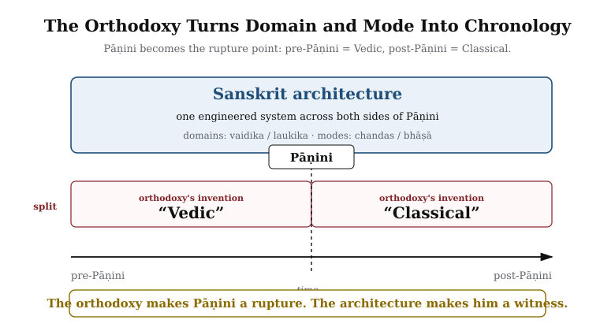

# Preface

*Draft v1 — for iteration*

---

> उत त्वः पश्यन्न ददर्श वाचम् उत त्वः शृण्वन्न अशृणोत्येनाम् ।
> उतो त्वस्मै तन्वं वि सस्रे जायेव पत्य उशती सुवासाः ॥
>
> *uta tvaḥ paśyan na dadarśa vācam uta tvaḥ śṛṇvan na śṛṇoty enām |*
> *uto tvasmai tanvaṃ vi sasre jāyeva patya uśatī suvāsāḥ ||*
>
> \episource{Ṛgveda 10.71.4}

\bigskip

One may look and still not see Speech. One may listen and still not hear her.[NOTE: rigveda-10-71-4-vach]

That is the condition in which Sanskrit has stood before the modern world. The language has been visible, audible, recited, parsed, taught, and documented across thousands of years. Its name says what it is. Its grammar says what it is. Its recitation lineages say what it is. Its architecture says what it is. Sanskrit has been telling the world, in its very name and in every line of its grammar, that it was created — not grown. The orthodoxy has looked and not seen. It has listened and not heard.

The dṛṣṭāḥ (दृष्टाः, seers) *saw* the Vedas. This book follows one layer of what they saw: the linguistic architecture embedded in that revealed corpus. Pāṇini did not codify Sanskrit. He decoded it. Nor was he the first to decode its grammar. He was the finest of many. **Sanskrit was engineered. Encoded in the Vedas. Decoded by many. Pāṇini's decoding is the finest.**

The second half of the epigraph belongs here. The *dṛṣṭāḥ* are ***mantra-dṛṣṭāḥ*** (मन्त्रद्रष्टाः) because Speech reveals herself to the one capable of seeing: ***uto tvasmai tanvaṃ vi sasre***, to him she reveals her body, "as a willing, well-dressed wife to her husband." The image belongs to the verse's intimate grammar of revelation; it is not a rule that only men see. The same *paramparā* remembers women seers too — ***ṛṣikāḥ*** (ऋषिकाः) and ***brahmavādinyaḥ*** (ब्रह्मवादिन्यः) such as Lopāmudrā (लोपामुद्रा), Apālā (अपाला), Viśvavārā (विश्ववारा), Ghoṣā (घोषा), and Vāk Ambhṛṇī (वाक् आम्भृणी).[NOTE: rigveda-10-125-vak-ambhrini] Speech reveals herself where the instrument is capable of seeing. The seers did not fabricate Speech. They saw what Speech revealed.

What modern philology calls Proto-Indo-European does not exist. **Mātṛ** *is* the etymon of **mother**. The cognates everywhere else are reflections — *Pratibimba* — of the original engineered Sanskrit forms.

Sanskrit is not a daughter language of an imagined parent. It is a deliberately engineered, anti-entropic linguistic system — the only one any civilization has ever built — that has been calibrating other languages, before Pāṇini and after, across the depth of time. It is the calibrant. Greek, Latin, Tibetan, Arabic, Hebrew — every grammatical discipline the modern academy treats as foundational is methodologically downstream of it.

A wiser age would not need this book. It would look at Sanskrit and see the architecture. It would listen to the Vedas and hear the engineering. That this argument needs making at all directly contradicts the *faith* that later means wiser, today is superior to yesterday, and the world is always evolving upward.

Nineteenth-century European philology built a perimeter around Sanskrit. Its institutional descendants have maintained that perimeter for a century and a half. The point was not to defeat the engineered-Sanskrit claim; the point was to keep any claim from forming at all. Chapters 2 and 3 name the framework and the machinery that kept the perimeter in place.

This book makes the claim the perimeter was built to prevent.

## The Engineering Claim

This book begins from a simple observation. The language itself bears a name — **संस्कृतम् (*saṃskṛtam*)** — built from the prefix *sam-* (totality, completeness, perfection) and the past participle *kṛta* (made, created, produced — from the semantic atom *kṛ*, which produces the action of creation itself). It translates as "perfectly synthesized" or "wholly created."[NOTE: samskrtam-morphology] The *paramparā* (परम्परा — *the unbroken chain*) that received and documented it distinguished it explicitly from *prākṛta*, the natural and changing speech of ordinary use. Built into the grammar is a vocabulary for recognizing decay (*apabhraṃśa*) and a vocabulary for refusing it (*siddha*, *nitya*). The grammarians wrote about all of this in foundational works that have been continuously read, recited, and commented upon across the Sanskrit *paramparā* or lineage. And yet the dominant scholarly framework for Sanskrit, inherited from nineteenth-century European philology, still treats it as a botanical organism that grew, branched, and decayed from a hypothetical ancestor — as if the language's own self-description were a quaint cultural detail rather than the central evidence about what the system actually is.

This book prosecutes that refusal. The evidence is not hidden. Pāṇini's grammar displays it. The Vedic recitation lineages preserve it. The question is why the engineering character of Sanskrit has been treated for so long as anything other than obvious.

When this book calls Sanskrit **engineered**, it is making an empirical description, not a historical claim about a dated act of construction. The evidence is on the page and in the mouth today: the varṇamālā, the dhātu inventory, the physiological phonetic grid, the calibration matrix, and the multi-axis grammatical system. The architecture is observable in the Vedas. Sanskrit is the linguistic form the Vedas instantiate. Both display engineering. The book claims the engineering is visible. It does not claim the origin is known.

## Chronology Refused

For Indic figures and texts, this book uses a different terminology. Its primary phrase is *thousands of years*. Where the prose needs variation, it uses *long before [the relevant external reference point]*, *for as long as the civilization has remembered itself*, and *across thousands of years through guru-shishya lineages*. The depth admits no honest counting; the prose marks depth without pretending precision. *I have refused to date Pāṇini* — not the “500 BCE” the textbooks keep repeating, not any century, not any range. This book places him only in the deep band: thousands of years ago. The same refusal applies to the *Vedas*, the *Prātiśākhya* discipline, the *Śikṣā* texts, Yāska, and every other Indic figure or text the book references. The asymmetry is deliberate. Two reasons.

First, Indic civilization does not organize truth around linear chronology the way the modern West does. *Kālacakra* (कालचक्र) — the wheel of time — is integral and cyclical, not linear and progressive. The fourth Abrahamic religion called progressivism organizes everything around dates because its teleology is linear: each event occupies a point on the timeline, and the timeline is made to move from darkness into enlightenment. Dates are central to that worldview. For *Sanātan*, the date is not the measure. The same *mantra* recited a thousand years ago and a thousand years from now is the same *mantra*; it does not gain authority by being older or lose authority by being recited again. Forcing precise dates onto Indic events imports the foreign teleology along with the dates.

Second, the dates assigned to Indic figures and events come from the same philological apparatus this book is questioning. Pāṇini's “500 BCE,” “400 BCE,” or any other proposed date is not neutral evidence. The apparatus did not operate in a zone of innocent measurement. The same nineteenth- and early-twentieth-century intellectual world that placed Sanskrit inside an external Aryan racial history was also measuring skulls, noses, faces, and bodies — sorting human beings into “Aryan,” “Dravidian,” broad-headed, narrow-headed, high-nosed, low-nosed types, and calling the exercise science. Its chronology and its race-typologies grew in the same soil. It arranged evidence inside its own assumptions, then called the arrangement chronology. The point is not that every assigned date is false. The point is simpler: a machinery that measured Sanskrit with the same confidence with which it measured skulls has no right to be treated as neutral. This book does not carry those dates forward.

I have not extended this mistrust to areas that are neither my interest nor my domain of expertise.[NOTE: chronology-asymmetry-rationale]

Beyond the two methodological reasons, there is a strategic one. The chronology the *church of progress* has established for Indic figures and texts may or may not be accurate — partly factual, partly agenda-driven, and currently inseparable from the institutional formation Chapter 3 §3.6 names as the *asuric pyramid*. The same applies to every dated Indic landmark inside the orthodoxy's apparatus — Pāṇini at 500 BCE, the *Vedas* at the dates the orthodoxy assigns, the Indus civilization at the end-date the orthodoxy posits. **I refuse this fight on the orthodoxy's terms. I refuse equally to build a counter-chronology.** India is not yet equipped to fight this battle. The technology exists; the scholarship exists. The *mindset* of the contemporary Indian academic machinery does not. Eighty years after political independence, the same institutions that served the colonial philological apparatus continue to preserve its categories — Deccan College Pune is the named exemplar the appendix prosecutes. Until Indian scholarship operates from the civilizational vision of *Sanātan*, this book refuses both moves: it refuses to accept the chronology the church of progress has imposed, and it refuses to manufacture an alternative chronology merely to occupy the same battlefield. This is the book's ***strategic refusal*** on chronology. **The book carries this twofold refusal across every chapter.** The next generation — those who will fight the chronology battle from inside the dharmic civilizational frame, after the re-learning the Epilogue calls for — will provide what the present generation cannot. Where individual chapters use the orthodoxy's numbers (*Pāṇini at ~500 BCE* in Chapter 1 §1.1; named dates for non-Indic events throughout), the deployment is local and inside the orthodoxy's terms; the position the book holds is the one this paragraph names.

## Domains and Modes

This book uses two pairs of Indic terms where the orthodoxy uses one chronological split.

**वैदिक (*vaidika*)** / **लौकिक (*laukika*)** are ***domains*** — Sanskrit of the Vedic domain and Sanskrit of the worldly learned domain. Patañjali's *Mahābhāṣya* uses this pair canonically. Concurrent civilizational fields, not stages on a timeline.

**छन्दस् (*chandas*)** / **भाषा (*bhāṣā*)** are ***modes*** — the metrical mode and the speech mode. Pāṇini marks the distinction directly in the *Aṣṭādhyāyī*: rules tagged *chandasi* (locative, *"in meter"*) apply in the *chandas* mode; rules tagged *bhāṣāyām* (locative, *"in speech"*) apply in the *bhāṣā* mode. The locative forms appear when Pāṇini's rule-markers are quoted; the stem forms appear when the book is naming the modes in its own prose.

{#fig:preface-domains-modes-matrix width=80%}

***The orthodoxy turns domain and mode into chronology.*** It flattens the two-axis architecture into a one-line story called *"Vedic to Classical,"* with Pāṇini as the hinge. That is the mistake.

{#fig:preface-orthodoxy-flattening width=80%}

> *Orthodoxy says:* *"Vedic Sanskrit evolved into Classical Sanskrit."*
>
> *The Hindu continuum says:* *"Sanskrit operates across vaidika and laukika domains, through chandas and bhāṣā modes."*

**The orthodoxy makes Pāṇini a rupture. The architecture makes him a witness.**

**Domain is not chronology. Mode is not drift.**

Where the orthodoxy's *"Vedic / Classical"* naming appears in the book's own prose, it is the position the reader arrives carrying, not the position the book holds. Chapter 1 §1.1 Move 7 develops the empirical refutation; Chapter 5 §5.6 develops the calibration matrix that holds both domains and both modes against drift simultaneously.

## The Boy's Question

The botanical framing felt wrong to me before I had any way to argue against it. The encounter that set the question happened, of all places, in a school where it was officially not allowed. My school was government-funded, and post-independence India's anti-Hindu government had imposed funding rules that forbade "religious" instruction in publicly-funded classrooms — a colonial-framework hostility to *Sanātan*, inherited by the establishment that took power after 1947 and amplified by it. The principal of my school understood what the rules cost and found his loophole: he extended the lunch break by five minutes and permitted a student-led recitation of the *Bhagavad Gītā* — outside class time, not as instruction.

I was working through the second verse of the first chapter:[NOTE: bhagavad-gita-1-2-citation]

> दृष्ट्वा तु पाण्डवानीकं व्यूढं दुर्योधनस्तदा ।
> आचार्यमुपसङ्गम्य राजा वचनमब्रवीत् ॥

— and I was mispronouncing the close. The *pāda* ends *rājā vacanam abravīt*: *the king spoke these words.* Written continuously as वचनमब्रवीत्, the *m* that closes *vacanam* meets the *a* that opens *abravīt*, and the two combine into a single syllable, *ma*. I was reading the *m* as a clean halant, often done in Marathi — a stopped consonant — and then dropping the initial *a* of *abravīt* entirely, so the line came out *vacanam-bravīt*: seven syllables where the meter wanted eight. My mother, when she heard, corrected me very gently. The *m* was not a stop. It was carrying the *a* from the next word. The two had fused. *This is sandhi,* she said, and gave me a primer on the spot. *अ + अ = आ.* *इ + अ = य.* *म् + अ = म.* The rules of how sounds combine when words meet.

I loved numbers, and the *sandhi* rules looked like arithmetic. *Two and two make four. a and a make ā. m and a make ma.* The same shape. The same deterministic operation. I remember asking my mother, with the literal-mindedness of a child who has just spotted a structural pattern, *so you can do math with sanskrit?* She laughed and said yes, and went back to whatever she was doing. I never lost the question.

The book in your hands is the long answer. The architecture of Sanskrit — its *varṇamālā* as the engineered phonetic grid, its *dhātu* inventory as the semantic atoms, its *Aṣṭādhyāyī* as the formal rule-system that operates on the rest — is what is on the page and in the mouth of a civilization that holds Sanskrit, very deliberately, as the language on which you can do math. The boy's question turned out to be the right question. What he could not yet have known is that the answer is not only poetic but also structural — that Sanskrit's free word order, its *sandhi* rules, its engineered meter all exist so the poetry can hold, and that the same engineering that makes the poetry possible is what makes the math possible. The chapters that follow are the long-running argument I have been having, ever since, with the orthodoxy that has insisted the boy was confused.

## Earlier Glimpses

A book like this does not appear in a vacuum, and it would be dishonest to pretend that the engineering view of Sanskrit was unimagined before now. Several scholars over the past half-century have approached the question from adjacent directions. In 1985, Rick Briggs published a paper in *AI Magazine* arguing that Pāṇini's grammar bore formal similarities to systems used in artificial intelligence and knowledge representation — a remarkable claim that received polite attention and was then, characteristically, largely ignored by mainstream Indology.[NOTE: briggs-1985-ai-magazine] Subhash Kak has written for decades about Pāṇinian grammar as an algorithmic system, and about Indic science more broadly.[NOTE: kak-paninian-algorithmic] Frits Staal, working from a different angle, treated Vedic ritual and grammar as formal systems with mathematical properties.[NOTE: staal-formal-systems]

Each of these contributions touched a part of what this book proposes. None of them, to my knowledge, articulated the full architecture: the *varṇamālā* as an engineered phonetic grid, the *dhātavaḥ* as semantic atoms, the *gaṇāḥ* as a periodic table of valencies, the *upasargāḥ* and *pratyayāḥ* as bonding chemistry, and the entire system as a multi-layered anti-entropy mechanism that has been in continuous operation for as long as the civilization that has held and preserved it has remembered itself. That full framework has, until now, not been put formally on the table.

This matters for two reasons. First, it means the burden of proof in the conversation shifts. Critics cannot point to a prior failed attempt at an engineering framework as evidence that the framework does not work, because no such attempt has been made. They will have to engage with the architecture on its own terms, for the first time. Second, it means this book is necessarily a beginning rather than a culmination. The arguments here are not the last word; they are an opening move. Other scholars, working with deeper Sanskrit fluency, broader philological machinery, and more specialized expertise in computational linguistics, archaeology, and the history of science, will refine, contest, and extend what is presented here.

## Method

The methodology of the book is straightforward. It begins with what Sanskrit's *paramparā* said about Sanskrit, in its own words. It takes the *Vedas* seriously as the corpus the architecture preserves — the implicit grammatical machinery operating in every recitation rule — and Pāṇini's *Aṣṭādhyāyī* as the explicit *sūtra*-level documentation of that machinery (***vyākaraṇam***, Sanskrit's own word, naming the activity as *analysis* rather than construction). It takes Patañjali's *siddhe śabdārthasambandhe*[NOTE: patanjali-siddhe-shabdarthasambandhe] seriously as a foundational axiom rather than dismissing it as theological flourish. It takes the *varṇamālā*'s organization by physiological articulation seriously as engineering rather than coincidence. It takes the eleven *pāṭhas* of Vedic recitation[NOTE: eleven-pathas] seriously as a redundancy system rather than cultural ornament. And then it asks, repeatedly, the same question: *what kind of system is this, when described from inside its own logic rather than from outside it?*

The answer, as the chapters that follow will show, is that Sanskrit is an architecture. Not a tree, not a fossil, not a relic. An architecture — built consciously by people whose clarity the modern world has not surpassed, maintained continuously, and standing today as the only ancient linguistic system that has done what it was designed to do.

## What This Book Claims

As a Hindu, I was not raised to claim perfect knowledge. I was raised to seek, to question, and to know where knowledge stops. The *Nāsadīya Sūkta* (*Ṛgveda* 10.129) includes that humility in the Vedic corpus itself: even at the origin of the cosmos, not-knowing is permitted.[NOTE: nasadiya-sukta]

The book operates from the same stance. I do not claim to know where Sanskrit came from. ***Apauruṣeya*** (अपौरुषेय) is the *paramparā*'s answer to that question; for the rationalist mind that cannot accept it, Chapter 17 §17.6 offers an honest speculation. What I claim, and what these pages argue, is that the architecture is on the page and in the mouth: ***Sanskrit was engineered. Encoded in the Vedas. Decoded by many. Pāṇini's decoding is the finest.*** The origin question itself — *where did Sanskrit come from?* — the book refuses to play, in the same spirit cosmology refuses to claim knowledge of what is upstream of the observable universe.

This book is also a foundation. **Sanskrit is engineering. The engineering succeeded. The engineering predates the documenters who described it.** A larger question opens from there. If a civilization built and preserved a linguistic system of this order, what else did it build and preserve? The architecture of dharma. The framework for शान्ति (shānti) across the three लोकाः. The structure of community life that has resisted, against extraordinary pressure from those who would replace it with their own ordering systems, every assault on its memory. Those questions lie beyond the scope of this book and are taken up in another. But they cast their shadow across every chapter that follows.
