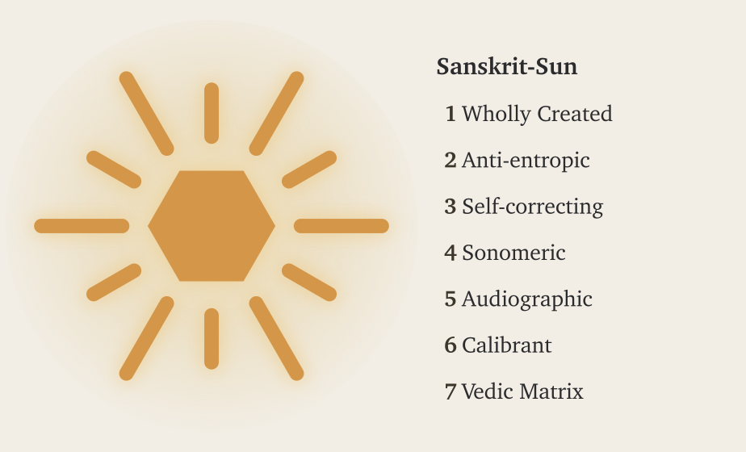

# Chapter 0 — Zero, Seekers, and the Infinite

*Draft v4. Setup chapter before Part I exposes how the shadow is cast. Eight sections; opens with the pūrṇam invocation, moves through seekers, the reader's existing Sanskrit, the saṃskṛta/prākṛta distinction, finite-input/unbounded-output systems, and the civilization that preserves the language. Current pass: tone and cross-reference cleanup. Voice: authoritative, not yet prosecutorial. Hands off to Chapter 1's finite-oppressor frame.*

---

::: epigraph

> ॐ पूर्णमदः पूर्णमिदं पूर्णात्पूर्णमुदच्यते ।\
> पूर्णस्य पूर्णमादाय पूर्णमेवावशिष्यते ॥\
> ॐ शान्तिः शान्तिः शान्तिः ॥
>
> *oṃ pūrṇam adaḥ pūrṇam idaṃ pūrṇāt pūrṇam udacyate |*\
> *pūrṇasya pūrṇam ādāya pūrṇam evāvaśiṣyate ||*\
> *oṃ śāntiḥ śāntiḥ śāntiḥ ||*
>
> `\hfill`{=latex}*— Īśopaniṣad invocation*[NOTE: ishopanishad-invocation]

:::

\bigskip

The image places Sanskrit as the Sun: a radiant *svastika* bearing *saṃskṛtam* संस्कृतम्, with *akṣaraḥ* अक्षरः, *varṇaḥ* वर्णः, *chandaḥ* छन्दः, and *dhātuḥ* धातुः set within its form. The ledger beside it lists the seven qualities the eclipse will later obscure.

{#fig:eclipse-ch0-sanskrit-sun width=100%}

## 0.1 The Puzzle of the Whole

The *Īśopaniṣad* ईशोपनिषद् opens from fullness:

***pūrṇam*** (पूर्णम्) — whole, full, complete.

Its operative sentence can be put as a puzzle:

That is *x*. This is *x*. From *x*, *x* emerges. Take *x* away from *x*, and *x* still remains.

What is *x*?

There are two answers: zero and infinity.

Take zero from zero, and zero remains. An infinite set can generate an infinite subset; after the taking-away, an infinite remainder can still remain.

The invocation gives its own answer:

*That is whole. This is whole. From the whole, the whole emerges. Take the whole from the whole, and the whole still remains.*[NOTE: ishopanishad-invocation]

The metaphysical meaning is primary. The invocation speaks of ब्रह्मन् (*Brahman*) and the relationship between the absolute and the manifest. The formal intuition is present too. Fullness is not reduced when manifestation emerges from it. Fullness is not exhausted when fullness is taken from it. Set theory is only the modern parallel; the verse shows a civilization already comfortable with the conceptual territory in which zero and infinity live.

That same cognitive leap shaped the place-value number system and Sanskrit's generative word-system. Ten digits span arithmetic, and a finite inventory of semantic atoms, prefixes, and suffixes spans vocabulary. Zero makes the numerical system unbounded; combinatorial architecture makes the linguistic system unbounded. Both begin from a finite visible surface and open into reach without apparent end — the first mark of the seekers.

---

## 0.2 A Culture of Seekers

A civilization that begins from *pūrṇam* approaches order through disciplined inquiry. A seeker examines what sustains the surrounding order, tests each conclusion against experience and inherited knowledge, and accepts the discipline required by that search.

The Sanskrit word is *jijñāsā* (जिज्ञासा): the desire to know. The civilization's classical disciplines are organized around it. The *Mīmāṃsā* discipline opens with *athāto dharmajijñāsā* — *now, therefore, the inquiry into dharma*. The *Brahmasūtra* discipline opens with *athāto brahmajijñāsā* — *now, therefore, the inquiry into Brahman*. The disciplines begin as inquiries: operations to be performed, questions to be placed into disciplined order.

The same disposition appears across domains. It built the place-value number system and the symbol *śūnya* शून्य for zero. It documented Ayurveda as a science of the body. It organized *Nyāya* into a formal discipline of inference. It established *Sāṃkhya* as an analysis of what exists. It maintained the continuous recitation of the *Vedas* across thousands of years.

These achievements share one source: a culture of *ṛṣis* ऋषि and *ṛṣikās* ऋषिका, *jijñāsus* जिज्ञासु and *muniśvaras* मुनीश्वर — seekers, inquirers, disciplined men and women whose work the civilization remembered without always remembering their names.

Within *Sanātan*, even a follower is first a seeker: someone who has chosen a path because that path fits their worldview, capacity, temperament, duties, and present state of life. The path may be inherited, taught, discovered, or deepened through lineage, but it remains a path entered by a living person, not a single corridor imposed on all.

The analytical decomposition of language and number both belong to that culture. The same civilization that asked *how many quantities can be expressed* answered with a place-value system in which ten symbols span arithmetic. The same civilization that asked *how many words can be generated* answered with *dhātu* धातु, *upasarga* उपसर्ग, and *pratyaya* प्रत्यय: semantic atoms, prefixes, and suffixes through which a finite inventory opens into a practically limitless vocabulary.

Sanskrit's engineering is the analytical decomposition of the audible world. The number system is the analytical decomposition of the countable world. Both are works of disciplined seeking.

Sanskrit's engineering begins with a civilization already capable of the act.

---

## 0.3 The Reader's Sanskrit

Most readers already know some Sanskrit, even if they have never studied the language.

The English word *guru* is Sanskrit *guru* गुरु, meaning *weighty* — a teacher whose authority comes from the weight of their knowledge. *Karma* is *karma* कर्म, *action* and what action produces. *Avatar* is *avatāra* अवतार, *that which has descended* — a form taken by a higher power for a particular purpose. *Mantra* is *mantra* मन्त्र, the engineered acoustic instrument of contemplation. *Yoga* is *yoga* योग — from the semantic atom ⟪युज्⟫ (*yuj*), *to join* — the discipline of joining the practitioner to that which is being practiced. *Pundit* is *paṇḍita* पण्डित, a learned man. *Jungle* is *jaṅgala* जङ्गल. *Nirvana* is *nirvāṇa* निर्वाण. *Aryan* is the corrupted reflection of *ārya* आर्य, which Sanskrit defines not as a race but as a phonetic-pedagogical achievement.[NOTE: english-sanskrit-loanwords]

The reader who has attended an Indian wedding has heard *mantras* in their Sanskrit form. The reader who has been to a yoga class has heard Sanskrit names of postures, *āsanas* आसन, that are precise compounds the language generates from its atomic inventory: *vṛkṣāsana* (tree-pose), *bhujaṅgāsana* (cobra-pose), *adho mukha śvānāsana* (downward-facing-dog-pose). The reader who has glanced at the names of Indian space missions has seen *Chandrayaan* चन्द्रयान — moon-vehicle, *Mangalyaan* मङ्गलयान — Mars-vehicle, and *Gaganyaan* गगनयान — sky-vehicle — all Sanskrit compounds engineered for the modern naming requirement. The reader who has watched the news has heard *Bhārat* भारत — the Sanskrit name India uses for itself.

Sanskrit continues to work. It still labels, blesses, measures, and composes. It remains audible in homes, temples, classrooms, weddings, yoga halls, space missions, and ordinary names. The light remains.

Sanskrit's other name is ***devabhāṣā*** (देवभाषा) — the language of the *devas*, the radiant ones. The phrase captures what the language does. It radiates light outward.

### Attribute, Not Label

Sanskrit's naming architecture is attributive rather than nominative. It describes an object through its actions, relations, qualities, lineage, and functions instead of fastening one arbitrary label to it.[NOTE: sanskrit-names-as-attributes] A proper name can therefore disclose something about the person or object it describes.

Yāska's formula **नामान्याख्यातजानि (*nāmāny ākhyātajāni*)** states a related principle at the level of word formation: nominal words arise from verbs. Sanskrit describes the world while keeping its actions and structure visible.

Yāska turned the same discipline on *deva* itself and derived the word from action: from *dā*, to give; from *dīp*, to kindle; from *dyut*, to shine.[NOTE: yaska-deva-derivation] The radiant ones of *devabhāṣā* are the giving, the kindling, the shining — the deed embedded in the word, not a label pinned on it.

Sanskrit can describe a single object through several words, each built from a different attribute. Water shows this plainly.[NOTE: sanskrit-names-as-attributes] जल (*jala*) comes from ⟪जल्⟫ (*jal*), to harden: water passing between its liquid and solid states. वारि (*vāri*) comes from ⟪वृ⟫ (*vṛ*), to surround: water as what encircles. आपः (*āpaḥ*) comes from ⟪आप्⟫ (*āp*), to pervade: water as what reaches everywhere. पयस् (*payas*) comes from ⟪पी⟫ (*pī*), to drink: water as the nourishing draught. सलिल (*salila*) comes from ⟪सल्⟫ (*sal*), to move: water as surge and current. उदक (*udaka*) comes from उद् (*ud*) and ⟪अञ्च्⟫ (*añc*), to go forth: water as what springs and flows. Six words, six attributes, one substance.

The same rule governs the contested words ahead. *Asura*, *ārya*, *saṃskṛta* — each arrives as a fixed label, and each yields something different once its action and function are weighed. The English word is not the authority. What the word does is.

---

## 0.4 *Saṃskṛtam* and *Prākṛtāni*

The first evidence of the engineering thesis is the language's own name: *saṃskṛtam* संस्कृतम्, *perfectly synthesized* or *wholly created*, distinct from *prākṛta* प्राकृत, the natural and the changing.

*Prākṛta* is what ordinary process produces: local idiom, songs, sayings, and everyday forms, all of it shifting as the conditions of life shift. *Saṃskṛta* is what conscious formation creates and disciplined preservation keeps exact. The civilization that built Sanskrit runs both and gives each its dignity through purpose. Everyday speech may change, because living speech must meet living circumstance. A *Vedic mantra* must stay exact, because its purpose is exact transmission. The *prākṛta* flows; the *saṃskṛta* remains invariant.

*Saṃskṛta* itself runs in two domains. Its architecture and calibrated language remain invariant in both. The **vaidika** वैदिक domain keeps language and content invariant: the Veda remains exact. The **laukika** लौकिक domain applies the same invariant language to a changing world. Sanskrit's generative architecture can produce millions of possible words from its standing atoms and bonds, giving each age vocabulary for new objects, practices, institutions, and ideas. Usage adapts and expands while the language remains invariant. Its corpus is a **curated transmission** — selected, accretive, and lossy, tended by **percipient selection**, the discerning community keeping what serves and letting the rest go. Beside both flows the **prākṛtika** प्राकृतिक, where language and content alike change: the natural speech of daily life.

These are three domains, each with its own duty. The *vaidika* preserves invariant language and content. The *laukika* preserves the language while extending its use and tending its corpus. The *prākṛtika* lets language and content change with daily life. Together they are a civilization keeping three promises at once.

Why does Sanskrit need two domains? If its architecture is complete and generative, why not preserve one body of rules and allow speakers to extend it as circumstances change? The comparison with Esperanto in Chapter 2 will show why rules alone cannot preserve a calibrant.

Exact Vedic preservation requires the *vaidika* domain to retain every articulation demanded by a mantra, including sounds produced only under a stated condition. The *laukika* domain, whose name means *worldly*, must provide vocabulary for changing human activity while keeping the language invariant. Sanskrit meets that second demand through a highly generative architecture capable of producing millions of words, and continuing generation requires a reusable sonomer inventory whose members combine consistently throughout the system. Chapter 9 will show how one sound architecture can satisfy both requirements.

{#fig:sanatana-triad width=100%}

---

## 0.5 Are the Vedas Archaic?

Are the Vedas archaic?

It depends on what *archaic* is being made to mean.

If *archaic* simply means ancient, then the description says very little. If it means outdated, superseded, or characteristic of an earlier evolutionary stage, the word has already committed category theft. The pyramid uses *archaic* to place Vedic Sanskrit inside its botanical chronology: an older form changed over time and eventually became the supposedly more modern language called *Classical Sanskrit*.

A better question is: are the Vedas old?

In their human reception and transmission, undoubtedly. *Sanātana* time is ***अनादि (anādi)***, but the Vedas are not. They have a beginning within Sanātana time. The *mantradṛṣṭāraḥ* and *mantradṛṣṭryaḥ* saw the mantras, but we do not know when each mantra was seen. Calling the Vedas old can therefore describe the depth of their human transmission; it cannot establish an evolutionary beginning for Sanskrit.

The ***लौकिक (laukika)*** domain is also old. Both *vaidika* and *laukika* belong to the same engineering. The two domains may have existed together from the beginning because they serve two different purposes.

Their contents, however, have aged differently.

The *vaidika* domain preserves received content exactly. Once a mantra was seen and entered its transmission lineage, its words, sounds, pitch, meter, and arrangement became read-only. Chapter 16 examines the read-only and read-write permissions in detail, while Appendix Part 8 documents the grammatical evidence. The architecture protects the mantra from alteration.

The *laukika* domain remains open to composition. People use it to tell stories, write poetry, analyze mathematics, record astronomy, debate philosophy, and describe circumstances that no earlier composition could have anticipated. By definition, its corpus contains material composed across different periods.

Some laukika material is certainly newer. Some may be extremely old. A story could have circulated before a particular mantra was seen, just as an author can write an epilogue before writing a preface. We do not possess the chronology required to place every laukika composition after every Vedic mantra. The naming of the two domains describes purpose and usage, not sequence.

Their different exposure to entropy follows from those purposes. The Vedic domain is guarded by exact transmission because the Vedas are the calibrant. Every recitation is measured against the received form.

The laukika domain faces greater entropic pressure because it remains generative. New speakers, new compositions, new circumstances, and ordinary usage create opportunities for pronunciation, forms, and meanings to vary. The ***वैयाकरणाः (vaiyākaraṇāḥ)*** documented both domains, but their calibrating activity belonged to the laukika domain. They did not calibrate the Vedas. The Vedas supplied the calibration.

Pāṇini inherited this arrangement and documented operations found across both domains. Some rules apply broadly in Vedic Sanskrit. Others apply only in mantra, outside mantra, in Brāhmaṇa usage, in a transmitted Vedic text, or in *laukika* use. Pāṇini names those limits through markers such as *chandasi, mantre, amantre, brāhmaṇe, nigame,* and *bhāṣāyām*. His documentation helps students read and understand Vedic forms and use Sanskrit for new *laukika* composition. It does not turn either domain into a chronological stage.

Nothing in the *Aṣṭādhyāyī* shows Pāṇini rewriting a Vedic passage, correcting a mantra, or converting a natural language into Sanskrit. He documented an architecture already operating in both domains. His decoding is the finest surviving account of that architecture.

Could some grammatical variation have entered laukika usage during the thousands of years before Pāṇini inherited and documented it?

That is likely. An open domain will face entropy in a way that read-only transmission does not. But this does not produce the pyramid's story of a drifting language finally *"codified"* by Pāṇini. Generations of *vaiyākaraṇāḥ* had already been analyzing usage and calibrating the laukika domain against Sanskrit's architecture. Pāṇini represents the surviving peak of that work, not its beginning.

The Vedas remained unchanged. Laukika usage may have varied under entropic pressure, while continuous calibration kept the language within Sanskrit's architecture.

The Vedas did not survive because Pāṇini stabilized them. Pāṇini could document Sanskrit because its architecture was already encoded and preserved within them.

### When *Anta* Becomes a Date

The pyramid applies the same chronological operation inside the Vedic corpus.

Ask an English-speaking Hindu what ***वेदान्त (*vedānta*)*** means, and many will give two answers at once. They will say that the Upaniṣads form the structural end or culmination of the Vedas. They will also say that the Upaniṣads were composed during a later *Vedāntic period*. The merger of those two answers is the problem.

The word ***अन्त (*anta*)*** can describe a position within an arrangement. It can also describe a culmination, purpose, or goal. Neither meaning establishes when the material was composed. A structural end and a chronological end belong to different categories, and chronology requires evidence of its own.

The pyramid merges them. Because the Upaniṣads are called *Vedānta*, their place at the culmination of Vedic knowledge becomes evidence that they were composed last. The resulting chronology then arranges Saṃhitā, Brāhmaṇa, Āraṇyaka, and Upaniṣad as successive historical stages. Their different functions and styles are made to tell a story in which Vedic thought moved from mantra, through *yajña*, and finally into philosophy.

The Hindu continuum does not describe a *Vedāntic period*. Its chronology describes yugas, manvantaras, dynasties, reigns, and lineages. *Vedānta* instead identifies the culmination and purpose of Vedic knowledge. It also identifies the interpretive tradition carried through the Upaniṣads, the Bhagavad Gītā, the Brahmasūtras, and the several Vedānta darśanas. These are textual, philosophical, and pedagogical relationships. None of them turns *Vedānta* into the name of an age.

Chronology capture has now entered institutions that should have protected this distinction. The Government of India's Vedic Heritage Portal defines *Vedānta* as the conclusion and goal of the Vedas, then immediately declares that the Upaniṣads came chronologically at the end of a *Vedic period*. The Vedanta Society's public explanation also preserves the internal meaning of *anta* as end or goal, while introductory scholarship hosted on its site restores the conventional dates and historical sequence. The structural meaning remains visible, but it is made to carry a chronology that it cannot establish.[NOTE: vedanta-anta-chronology-capture]

This is category theft through chronology capture. A structural end becomes a chronological end. Culmination becomes lateness. Purpose becomes period.

At the turn from the Dvāpara age to the Kali age — the age of the Mahābhārata — Vyāsa divided the one Veda into four: *Ṛgveda*, *Yajurveda*, *Sāmaveda*, and *Atharvaveda*, each with its *saṃhitā* and associated *vistāra* — Brāhmaṇa, Āraṇyaka, and Upaniṣad. Every Veda has Upaniṣadic material associated with it; together, these shared culminations form ***वेदान्त (*Vedānta*)***. The division added nothing and took nothing away. It arranged the one body for an age of shorter memory: preservation, not authorship.[NOTE: veda-vyasa-division] This is the *vaidika* domain, preserved in ***छन्दस् (*chandas*)***, the metrical mode.

At the same turn, the *itihāsa-purāṇa* — the fifth Veda — passed to the laukika keepers: the laukika domain, expressed in *bhāṣā* (भाषा), the mode of speech. Its corpus grows, its vocabulary meets each changing age through derivation, and the language remains invariant.

The continuum measures all of this in its own time — *Sanātana* time. Tretā turned before Dvāpara, Satya before that, and the yuga cycle had already repeated through earlier manvantaras. We do not know whether the Vedas came into being during Dvāpara, Tretā, Satya, or an earlier manvantara. But from its beginning, the Veda has kept watch over the laukika world, unchanged — the invariant calibrant against which the turning world is measured.

{#fig:sanatana-time width=100%}

---

## 0.6 A Language of Infinity

The opening puzzle has two answers: zero and infinity. The civilization that engineered Sanskrit made both operational — first in counting, then in language.

Ten symbols — *0* through *9* — span all of arithmetic. Position determines the value: the *2* in *246* is *two hundred*, the *2* in *26* is *twenty*, the *2* in *2* is *two*. The idea that makes it work is *śūnya* शून्य, the mark for absence at a position. Without zero, place value collapses; with zero, ten symbols reach every number there is. The world still counts this way — the Hindu-Arabic numerals of the reference works, which the Arabic mathematical discipline received and refined from the Indic one and took west across the medieval period.[NOTE: place-value-arabic-transmission] The Indic origin is documented and uncontested, even where the academy domesticates the engineering as a discovery rather than recognizing it as engineering.

A finite inventory, a rule for combining it, one enabling idea — and the output has no ceiling.

**Sanskrit does to language what zero does to counting.** A dictionary language stores its vocabulary as inventory: English accumulates words and lists them, on the order of 170,000 in current use. Sanskrit runs the other way. The grammatical continuum preserves the **धातुपाठ (*Dhātupāṭha*)**, a list of over two thousand semantic atoms. Pāṇini presupposes this inventory: *Aṣṭādhyāyī* 1.3.1 calls **⟪भू⟫ (*bhū*)** and the entries that follow it ***धातवः (*dhātavaḥ*)***, and his documentation uses them without claiming to have created the list. ***उपसर्गाः (*upasargāḥ*)*** and ***प्रत्ययाः (*pratyayāḥ*)*** attach to them; the verb-grids inflect them; ***समास (*samāsa*)*** composes them; and a compound can itself become a member of the next assembly. The system generates words rather than storing them. A conservative count of the first-pass grammatical space already runs past **twenty million words before a single compound is formed**, and compounding adds no ceiling.[NOTE: sanskrit-generative-wordspace] Sanskrit is a word-engine.

When India's space agency needed a name for its first lunar mission, the engine produced one: *Chandra* (moon) + *yāna* (vehicle) = *Chandrayāna* चन्द्रयान, moon-vehicle. The same engine turns whenever Sanskrit forms a technical term, a name, a mantra, or a verse. The dictionary catalogs the engine's output; it does not bound it.

Two systems, one pattern: ten digits span arithmetic, the *dhātupāṭha* spans vocabulary — finite inventory, infinite reach. The same seeker culture, working in two domains, built systems where a small set of atoms opens onto unbounded space. The opening word returns: *pūrṇam*.

---

## 0.7 Sat, Ṛta, and the Vedic Order

The Vedas act as a calibrant for both Sanskrit and *saṃskṛti*. At the linguistic level, they preserve Sanskrit’s sounds, grammatical range, and generative architecture. The grammatical continuum uses that invariant standard to calibrate Sanskrit in the changing *laukika* domain. Chapter 16 and Appendix Part 8 demonstrate how this relationship operates across the two Sanskrit domains.

At the civilizational level, the Vedas preserve **ऋत (*ṛta*)** as the invariant trajectory of created order. People can compare actions, institutions, and systems in the changing world with that trajectory.

*Ṛta* is often translated as “cosmic order,” as if the universe runs on one single order. If that were true, are *asuras* also part of that order? How can this “cosmic order” explain the clearly abhorrent actions and systems that human beings create?

The Vedas make that distinction clearly and unequivocally.

**Sat was born from asat.**

> **देवानां पूर्व्ये युगेऽसतः सदजायत**\
> *devānāṃ pūrvye yuge 'sataḥ sad ajāyata*\
> “In the earlier age of the *devāḥ*, *sat* was born from **असत् (*asat*)**.” (RV 10.72.2)[NOTE: rv-10-72-2-sat-born-from-asat]

Because *sat* had to be born from *asat*, the **ऋत (*ṛta*)** order aligned with *sat* cannot be the universe's default order.

This implies that the **ऋत (*ṛta*)** order is one possible set of paths that can exist in this universe, and it runs counter to the orders that can arise from *asat*. The *asuric pyramidal* order, this book argues, would belong to the opposite set of paths.

The question then becomes: was **ऋत (*ṛta*)** engineered by humans?

The Vedas state the sequence in two mantras from the same hymn:

> **ऋतं च सत्यं चाभीद्धात्तपसोऽध्यजायत**\
> **ऋतम्-च सत्यम्-च-अभि-इद्धात् तपसः-अधि-अजायत**\
> *ṛtaṃ ca satyaṃ cābhīddhāt tapaso 'dhy ajāyata*\
> “*Ṛta* and *satya* were born from intensely blazing *tapas*.” (RV 10.190.1)[NOTE: rv-10-190-1-rta-satya-cocreated]

> **सूर्याचन्द्रमसौ धाता यथापूर्वमकल्पयत् ।**\
> **दिवं च पृथिवीं चान्तरिक्षमथो स्वः ॥**\
> **सूर्याचन्द्रमसौ धाता यथापूर्वम् अकल्पयत् दिवम्-च पृथिवीम्-च-अन्तरिक्षम्-अथो स्वः**\
> *sūryācandramasau dhātā yathāpūrvam akalpayat | divaṃ ca pṛthivīṃ cāntarikṣam atho svaḥ*\
> “Dhātā then formed the Sun and the Moon, and formed the skies, the earth, the intermediate space, and the realms of light, as before.” (RV 10.190.3)

This means that there was *asat*, then *sat* and *ṛta*, and then the sun, moon and the earth were formed.[NOTE: sat-rta-cosmogonic-sequence-inference]

Therefore the *sat-asat* binary predates human existence. *Ṛta* was created, but human beings did not create it.

The straight movement along the **ऋत (*ṛta*)** thread is **ऋजु (*ṛju*)**, and the crooked movement is **वृजिन (*vṛjina*)** (RV 7.104.13).[NOTE: rv-7-104-12-13-sat-asat-vrjina-soma]

The **ऋच् (*ṛc*)** — voiced as **ऋग् (*ṛg*)** before a voiced sound — is the verse that renders that order as measured speech. The **ऋषि (*ṛṣi*)** sees **ऋत (*ṛta*)** and sets it into verse.

What makes humans unique is that they inherited the capacity for *asat*, and therefore for *sat* — a capacity that other animals do not possess. Animals act within *prakṛti*. Human beings can choose between *sat* and *asat* and build a civilizational order around that choice.

> **सदसद्विवेकबुद्धिः**\
> **सत्-असत्-विवेक-बुद्धिः**\
> *sat-asat-viveka-buddhiḥ*\
> “The intellect that discriminates between *sat* and *asat*.”

How does one tell *sat* and *asat* apart?

The mantra below says: look for **यतरदृजीयः (*yatarad ṛjīyaḥ*)** — whichever one is straighter.

> **सच्चासच्च वचसी पस्पृधाते । तयोर्यत्सत्यं यतरदृजीयः । तदित्सोमोऽवति हन्त्यासत्**\
> **सत्-च-असत्-च वचसी पस्पृधाते तयोः यत् सत्यम् यतरत् ऋजीयः तत्-इत् सोमः-अवति हन्ति-असत्**\
> *sac cāsac ca vacasī paspṛdhāte, tayor yat satyaṃ yatarad ṛjīyaḥ, tad it somo 'vati hanty āsat*\
> “*Sat* and *asat* contend, word against word; of the two, whichever is true and straight, *ṛjīyaḥ*, Soma protects, and the *asat* he destroys.” (RV 7.104.12)[NOTE: rv-7-104-12-13-sat-asat-vrjina-soma]

Before human choice shapes an order toward *sat* or *asat*, living beings act within **प्रकृति (*prakṛti*)**.

- **विकृति (*vikṛti*)** — representing *asat* — the **वृजिन (*vṛjina*)** movement.
- **संस्कृति (*saṃskṛti*)** — representing *sat* — the **ऋजु (*ṛju*)** movement.
- **प्रकृति (*prakṛti*)** — representing everything else.

The Vṛtra, Svarbhānu, and Paṇi narratives show what the conflict between *sat* and *asat* looks like in action. The protagonists bear **सत् (*sat*)** in their titles. Indra's is **सत्पति (*satpati*)**, the lord of *sat*.[NOTE: protagonist-sat-epithets]

The protagonists fight for **सत् (*sat*)** to restore the order of flow: circulation kept open and release along that path — the path of **स्वस्ति (*svasti*)**, well-being, followed as the Sun and Moon follow their orbits: **स्वस्ति पन्थामनु चरेम सूर्याचन्द्रमसाविव** (*svasti panthām anu carema sūryācandramasāv iva*) — “may we follow the path of *svasti*, as the Sun and Moon do.” (RV 5.51.15)[NOTE: rv-5-51-15-svasti-panthanam]

The *swastika* is the physical symbol that extends this path of well-being.

While **ऋत (*ṛta*)** is this order of flow, the book adds two descriptors: the **सनातन (*sanātana*) order** and, because it embodies **सत् (*sat*)**, the **सात्त्विक (*sāttvika*) order**, the order of *sat*-ness.[NOTE: sattvika-order-generative-coinage]

There's a fundamental asymmetry in the two orders. **असत् (*asat*)** aims for possession of power — who commands, who controls access, who monopolizes sovereignty. **सत् (*sat*)**, on the other hand, seeks distributed order — circulation that keeps the gates of containment open. *Sanātan* does not condemn power itself; Indra wields the *vajra*. It judges power by what the action serves — Indra releases what Vṛtra withholds, and it is the action of releasing, not the strength, that differentiates **सत् (*sat*)** from **असत् (*asat*)**.

The Vedas offer the abstracted idea of *sat* versus *asat* that remains timeless. The human experience in the *laukika* domain interprets it for the specific conditions of life. As an example, the Mahābhārata states: **यद्भूतहितमत्यन्तं तत्सत्यम्** (*yad bhūta-hitam atyantaṃ tat satyam*) — “that which fully and finally serves the welfare of living beings is **सत्य (*satya*)**.”[NOTE: satyam-bhutahitam-mahabharata]

The Veda preserves the invariant distinction; the *laukika* domain applies it to a changing world.  

This is the quintessence of the calibrant architecture for both *saṃskṛti* and Sanskrit.

Chapter 1 follows **असत् (*asat*)** from cosmic condition into specific action: concealment, blockade, isolation, enclosure — the architecture of containment, the pyramid.

---

## 0.8 The Civilization That Preserves It

Sanskrit survived because generations of people performed a repeatable set of actions: they listened, recited, corrected, memorized, taught, and checked one lineage against another. Together, those actions form an engineered transmission architecture.

The *guru-shishya* chain provides one visible example. A *guru* transmits to a *shishya*; the *shishya* becomes the *guru* of the next student; and the chain extends across thousands of years. The student hears, repeats, receives correction, repeats again, and takes the corrected form forward. The complete architecture extends beyond this relationship, but the relationship shows how trained continuity disciplines memory.

The hearing-repetition-correction cycle is the smallest visible unit of caretaking: correction without contempt, repetition without fatigue, memory with accountability. A mother correcting a child's Gītā recitation belongs to the same civilizational pattern as a Vedic teacher correcting a student's accent. Scale differs. The duty does not.

The transmission has operated continuously across the Sanskrit continuum. Nambūdiri Brahmins in Kerala recite the *Ṛgveda* today after learning it from teachers who received it through the same lineage. Recitation lineages in Maharashtra, Tamil Nadu, Banaras, Karnataka, Kashmir, Gujarat, and Rajasthan preserve comparable forms through their own teachers. Because these lineages remained geographically separated, they provide several independent points of comparison. No single lineage owns the measure; reciters can compare the preserved form across lineages and identify both shared features and *śākhā*-specific variation.

Performance, correction, and continuity preserve Sanskrit beyond the library. The detailed mapping appears in Chapter 15 as the *aural architecture* — the operational specification of the calibration matrix that keeps Sanskrit's phonetic constants stable across the depth of time.

The recitations continue audibly today in **गुरुकुलानि (*gurukulāni*)**, temples, homes, schools, and communities across the subcontinent and the global diaspora. Teachers and students still perform the transmission that the preceding paragraphs describe. Recordings allow people outside those lineages to hear that living practice for themselves, but the recordings document a practice that remains active without them.

The Hindu civilization preserves the language. Hindus inherit Sanskrit as caretakers. The old rule says: *dharmo rakṣati rakṣitaḥ* — dharma protects when protected.[NOTE: dharmo-rakshati-rakshitah] Sanskrit asks the same kind of protection. It has survived because teachers, students, mothers, reciters, *vaiyākaraṇāḥ*, poets, priests, scholars, and ordinary households protected it.

If Sanskrit is the calibrant, then returning to Sanskrit is civilizational work, and protection now turns active. The reader who learns to hear it, speak it, teach it, defend its categories, or refuse the pyramid's substitutions has entered the same chain of caretaking. The work begins as listening. It becomes protection.

---

## 0.9 The Fractal Test

Sanskrit's engineering, architecture, and civilizational transmission can be followed without prior Sanskrit study. Readers who have studied the language will recognize many of the features ahead, now placed in a category very different from the one the academy handed them — and familiar material reveals more once the category around it changes.

Sanskrit operates as a calibrant through a fractal architecture, in which the same organizing principle recurs across scale. The chapters test that recurrence from the ground up — mouth, sound-field, sonomeric grid, semantic atom, verbal molecule, sentence assembly, *sūtra*, and calibration matrix — because each level keeps the lower level visible.

The seekers and caretakers now stand against another fractal: the asuric pyramid. It is a finite order that repeats command, conquest, and enclosure at every scale. Sitting at the top of that pyramid is the apex. He is threatened by Sanskrit because Sanskrit preserves a distributed order beyond his reach. The battle that follows clears the shadow he casts across the civilization.

At the end of the volume, a Vedic mantra returns to those who find the Sun when darkness covers the field. Their name waits there. Their capacity appears here: a civilization trained to listen, correct, remember, and keep looking.
