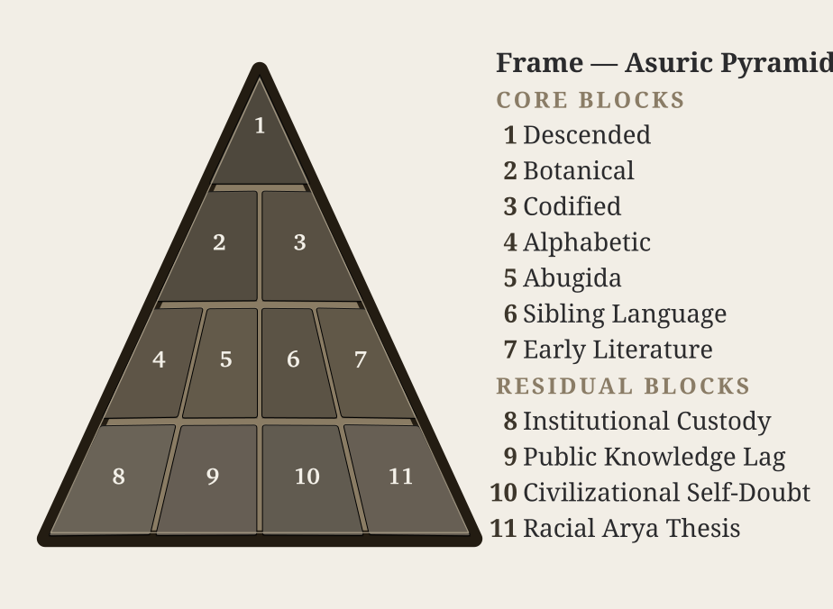

# Chapter 1 — One, ___, and the Finite

*Draft v1. Active antagonist chapter promoted from AP0. Introduces the finite apex-order before Part I exposes how the shadow is cast. Keeps the Atri payoff out of the body; Epilogue owns the recovery.*

---

::: epigraph

> द्वौ भूतसर्गौ लोकेऽस्मिन् दैव आसुर एव च ।\
> दैवो विस्तरशः प्रोक्त आसुरं पार्थ मे शृणु ॥
>
> *dvau bhūtasargau loke'smin daiva āsura eva ca |*\
> *daivo vistaraśaḥ prokta āsuraṃ pārtha me śṛṇu ||*
>
> Two are the created orders in this world: the divine and the asuric. The divine has been described at length; hear from me, Pārtha, the asuric.
>
> `\hfill`{=latex}*— Bhagavad Gītā 16.6*[NOTE: bhagavad-gita-16-6-daiva-asura]

:::

\bigskip

The number here is **one**: the asuric one, the apex-one.

One ruler. One doctrine. One permitted origin. One authorized text. One sanctioned interpretation. One gate through which reality must pass before it is allowed to be called True.

And the one is a Him — a blank each age fills with a new name. Hiraṇyakaśipu, who would suffer no worship but his own. Rāvaṇa, whose will was the law of three worlds. Vṛtra, who seized the waters and called the withholding order. The names change; the Him does not. A later age enthrones Him beyond the sky, capitalizes His name, puts His order past question, brooking no other before Him. New face. No Image. Same apex.[NOTE: devi-mahatmya-goddess-undoes-male-apex]

The finite order turns plurality into command.  A pyramid.

Its frame is not one of the removable plates. The frame is the asuric pyramid itself: the intact geometry of apex, enclosure, and control. The numbered plates are the obstructions this book exposes, cracks, and removes from the view of Sanskrit. The pyramid returns at the head of each part, one more plate gone each time, until the Sun stands clear.

{#fig:eclipse-ch1-pyramid-full width=100%}

## 1.1 The apex-one

The seeker approaches the unbounded through zero: humility before what exceeds the mind, openness before the infinite, inquiry disciplined by *jijñāsā*. The asuric pyramid moves in the opposite direction. It turns the field toward one apex and makes that apex the condition of recognition.

The architecture is apex, oppression, and finitism. The elite at the top of the asuric pyramid, threatened by the boundless nature of reality and the absolute freedom of the seeker, force their own measured ignorance onto the universe and then call that measurement truth.

The most celebrated models of modern cosmology, such as the Big Bang, train the modern mind into both temporal and spatial finitism. They represent the opposite of **पूर्णमदः (*pūrṇam adaḥ*)** — the infinite whole. Modern cosmology declares, for instance, that the observable universe spans some 93 billion light-years across. To the mortal ear, the number sounds unfathomably large. Yet ask any student of basic mathematics: what fraction is 93 — or 93 billion, or 93 quadrillion — of infinity?

The answer is always zero.

The finite is all they have seen. The finite is all they can model. The finite then becomes all they are permitted to admit. The modern Scientist sitting at the apex has *observed effectively zero,* yet presides as though the measurable fragment were the whole. This is structural finitism.

Genesis gives the same operation in scriptural key: one birth, one life, one death, one Heaven, one Hell. A single beginning, a single command, a single authorized account of origin, and a single final judgment at the end of the line. The pyramid needs that first point. Once the beginning is owned, the sequence can be owned. Once the sequence is owned, the field can be judged from outside itself. In philology, PIE performs the same work. In chronology, the date performs the same work. Control the first point, and the rest can be made to follow.

The forceful, top-down imposition of finite ignorance by authorities is the damage; the confusion of ordinary people is merely a symptom. Ordinary confusion can be corrected; imposed ignorance hardens into rule. The apex takes reductive ideas, dresses them in grand terminology, and cements them as unquestionable dogma. The result is not knowledge. It is obedience.

At the top of that geometry sits the apex-claimant. The boundless defeats his ownership. Distributed order lies beyond his command. Sanskrit threatens him because Sanskrit preserves order without needing him. The one exposed by light becomes an enemy of light. That is the Svarbhānu pattern: exposure does not humble the apex; it hardens him into retaliation.

That is the darkness of the asuras, and it is the darkness Sanskrit was engineered to fight.

## 1.2 The Fractal of Deformation

The pyramid is a created fractal of deformation: **विकृति (*vikṛti*)**. It has intelligence, design, memory, and method, but it bends those powers toward control. It takes the human capacity to organize and deforms it into apex command. It takes transmission and deforms it into authorized doctrine. It takes correction and deforms it into obedience.

The shape repeats across domains. In religion, it becomes one book, one prophet, one church, one priesthood, one permitted salvation. In empire, it becomes one crown, one law, one census, one tax, one map, one extracted people. In scholarship, it becomes one method, one peer circle, one credentialing ladder, one permitted origin story. In language, it becomes one ancestor, one chronology, one authorized grammar-story, one verdict on what the civilization is allowed to remember.

The pyramid demands finitism. A finite universe can be narrated from a first point. A finite timeline can be owned by whoever controls the origin story. A finite canon can be guarded by whoever controls the gate. A finite people can be counted, ranked, administered, converted, educated, and corrected. The apex wants a world with edges because edges make possession easier — and because the boundless, which he can neither bound nor rule, frightens him.

Sanskrit resists that shape. Its order descends through the distributed field rather than from a human apex. The standard is distributed through sound, measure, recitation, grammar, semantic atoms, lineage, and disciplined use. A wrong sound can be caught by the mouth. A wrong measure can be caught by meter. A wrong form can be caught by grammar. A wrong derivation can be caught by the *dhātuḥ*. A wrong recitation can be caught by the *pāṭha*. Sanskrit places correction inside the architecture.

Calibration is what the pyramid cannot conquer, because the standard lives in the system itself. Natural drift can be surveyed and ruled. Codification can be captured by authority. The pyramid can lord over drift and sanctify codification. Because it cannot conquer calibration, it must hide the category entirely.

> This distinction is critical because not everything outside formal Vedic calibration is asuric. A *nastika* discipline may refuse the Veda as calibrant and still live harmoniously beside it, beside other harmonious formations, and within the balance of the world. A *prakritika* culture may live through forest, clan, custom, ecology, craft, and local memory without being threatened by the Vedic measure. The asuric formation is different: it is threatened by the calibrant and by the balance the calibrant protects; it therefore works to destroy, displace, shame, capture, or distort it. Compatibility is not immunity; a formation can live harmoniously beside the calibrant and within the world's balance, and still be captured later by the pyramid.[NOTE: compatibility-is-not-immunity]

Preservation has to discriminate. Living forms can flow, grow, and change while the calibrant holds the measure by which balance is restored when darkness spreads. The pyramid targets that measure because capture becomes harder when correction remains distributed.

The same insecurity drives the asuric obsession with chronology capture. The pyramid is threatened by **अनादि (*anādi*)**, that which has no beginning, and **अनन्त (*ananta*)**, that which has no end. Chronology becomes dangerous when it stops tracking sequence and starts assigning category. Once the pyramid owns the clock, it can call one layer early, another late, one primitive, another developed, one original, another borrowed. It can turn domain into period, mode into stage, architecture into evolution, and calibration into late correction. In the pyramid's story, the *Veda* must therefore be dated, stratified, and sequenced: the calibrant has to be forced into a clock before it can be made to descend.

## 1.3 Svarbhānu's Operation

In the Vedic mantra, Svarbhānu pierces Sūrya with darkness, and the worlds become *mugdha*, bewildered, like one who does not know the field.

The asuric pyramid repeats that operation against Sanskrit. It leaves the word visible, the texts printed, the documenter praised, the dictionaries compiled, and the courses taught. Then it places darkness over the category. The civilization sees Sanskrit but is trained not to recognize what shines.

Svarbhānu obscures: the light remains, but the field goes dark. The worlds are still there, yet they become **मुग्ध (*mugdha*)**, bewildered. The same shape governs the attack on Sanskrit. The sound remains audible. The texts remain printed. Pāṇini remains praised. The dictionaries remain on the shelf. What is darkened is the category: Sanskrit as **संस्कृति (*saṃskṛti*)**, calibrated architecture.

Sanskrit is made to answer to PIE, codification, power, chronology, and finite origin. The visible language is forced under an invisible ancestor. The living architecture is made dependent on a later documenter. The distributed standard is translated into authority. The beginningless is forced into the pyramid's clock.

The result is field-loss. Sanskrit remains present, but the world becomes *akṣetravit*: unable to discern the terrain.

## 1.4 The Operations

The transmission architecture preserved this recognition for thousands of years as stories rather than abstract theory of power. Each story is a recipe. Each recipe teaches the next generation how to recognize the asuric operation when the costume changes.

The lineage-chain preserved the asura stories as recognition-forms. A story can carry memory, but it can also carry a diagnostic grammar. It can teach a child that Svarbhānu darkened the Sun, teach an elder that darkness can be used as a weapon against light, and teach a civilization that the first symptom of successful asuric attack is field-loss: **अक्षेत्रवित् (*akṣetravit*)**, not knowing the field.

At institutional scale, the recipes become repeatable operations. The asuric pyramid runs them all for a single purpose: finite control—narrowing the terrain, capturing the gate, training the civilization to answer inside the pyramid's category.

**Install the apex-one.** The hunger of the apex becomes the demand that every plural field answer to one gate. One origin. One doctrine. One permitted chronology. One authorized method. One human office that decides what counts as knowledge.

**Withhold the light.** Svarbhānu darkens Sūrya. Vṛtra withholds the waters. Kāliya poisons the river. The shared structure is obstruction of circulation: light, water, knowledge, speech, field-orientation. The source remains; access to what the source makes visible is blocked.

**Steal the foundation.** Madhu and Kaiṭabha carry away the Vedas. Hayagrīva-asura repeats the theft. The stolen thing is often unusable to the thief. Its value lies in removal. PIE performs that operation against Sanskrit: an imagined ancestor is placed above the visible calibrant.

**Wear false identity.** Pūtanā comes as nurse. Mārīca comes as deer. Kālanemi comes as ascetic. Pauṇḍraka comes as Vāsudeva. The costume is the entry mechanism. The modern form is polite: scholarship, translation, preservation, objectivity, public education. The category attached to the gift does the capture.

**Turn the gift against the giver.** Vṛkāsura and Bhasmāsura receive a boon and immediately turn it toward the source. A civilization preserves the texts; the pyramid receives access; the pyramid returns the texts as *"mythology"*, elite production, migration evidence, philological data, or cultural artifact.

**Multiply copies.** Raktabīja turns every wound into more Raktabīja. Repetition becomes authority. Peer review, credential ladders, schoolbooks, encyclopedia entries, museum labels, documentaries, and public essays repeat the same verdict until the copy feels like the world.

**Possess the uncontainable.** Śumbha, Andhaka, and Jalandhara treat the unownable as inventory. The apex repeats the move with speech, memory, lineage, civilization, and the authority to say what they are.

**Teach surface as depth.** Virocana hears the teaching of the Self and returns with the body. The surface is made to answer as substance. Courtly use becomes source. Social location becomes architecture. Power vocabulary replaces engineering vocabulary.

The attack on Sanskrit is a category attack. The pyramid leaves the word *Sanskrit* visible and decides what category the word is allowed to occupy. Once the category is stolen, every fact is read inside it.

The first move is ancestry theft. PIE is placed above Sanskrit, and Sanskrit is made downstream. The engineered calibrant becomes one branch among many. The real language must answer to an imaginary ancestor; the preserved system must answer to a reconstructed source; the visible architecture must answer to a starred form no known community ever spoke. Sūrya remains visible, but the sky has been darkened.

The public move is language capture. Words such as *root*, *branch*, *daughter*, *migration*, *reconstruction*, *codification*, *"mythology"*, *cosmopolis*, *elite*, *early*, *late*, *primitive*, and *interpolation* carry the concealment into ordinary speech. A reader can absorb the verdict before seeing the evidence because the vocabulary has already assigned the category.

These operations execute category theft. Sanskrit is made to answer inside categories built to hide what Sanskrit is.

At the summit sits the one who must own the field. He does not share authority with the distributed field. He converts the field into a base and calls his view the whole. Sanskrit threatens him because Sanskrit preserves an order with no apex at all.

The parties now stand against each other: the civilization of caretakers against the finite order. The next battle is the shadow itself.
