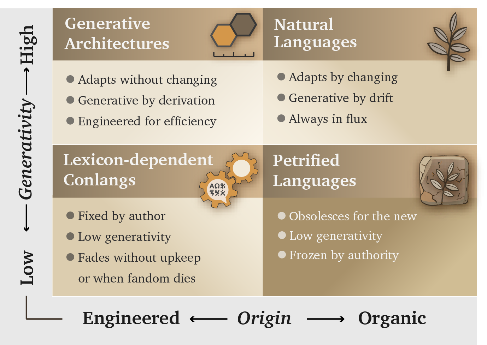
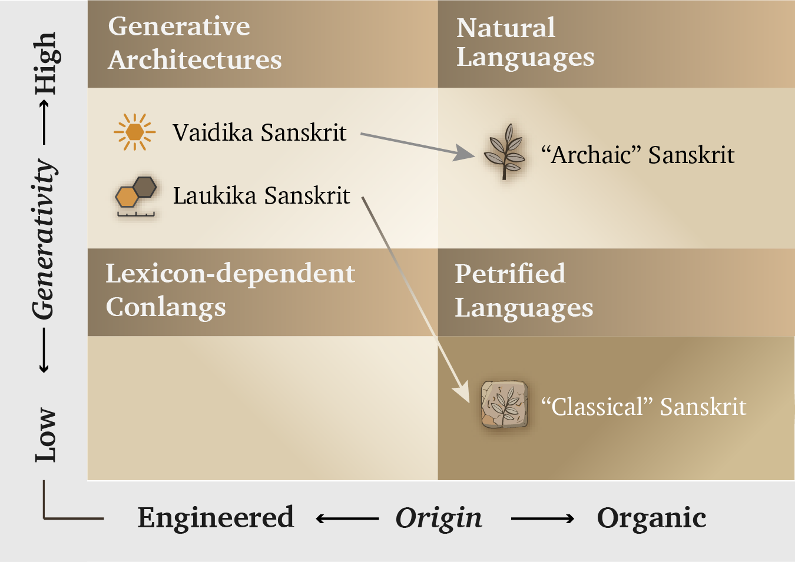

# Chapter 2 — Category Theft and Āsurī Māyā

::: epigraph

> मायाभिरिन्द्र मायिनं त्वं शुष्णमवातिरः ।\
> विदुष्टे तस्य मेधिरास्तेषां श्रवांस्युत्तिर ॥
>
> *māyābhir indra māyinaṃ tvaṃ śuṣṇam avātiraḥ |*\
> *viduṣ ṭe tasya medhirās teṣāṃ śravāṃsy ut tira ||*
>
> With *māyās*, O Indra, you struck down the *māyin* Śuṣṇa. The wise know this deed of yours; raise their renown.
>
> `\hfill`{=latex}*— Ṛgveda 1.11.7*[NOTE: rigveda-1-11-7-maya-mayin]

:::

\bigskip

---

## 2.1 The Category Withheld from Sanskrit

The asuric pyramid's first move to eclipse Sanskrit's radiance is category theft: it places Sanskrit inside a category that directly contradicts Sanskrit's own architecture.

The theft works through **आसुरी माया (*āsurī māyā*)**. Sanskrit knows *māyā* as power, formation, appearance, and skill, so its character depends on purpose. In asuric hands, *māyā* becomes a weapon of concealment: the pyramid makes the false category appear natural while hiding the true category even though its architecture remains visible.

The pyramid teaches readers to recognize three broad categories of language. The first contains **natural languages**, which arise through communal speech and continue changing through use, contact, and inheritance. Institutions may standardize one variety for schools, administration, publication, or public life, but Standard English and Standard French remain botanical because their speakers continue changing them.[NOTE: language-origin-standardization-form]

The second category contains **classical or highly formalized languages**. Here an institution preserves a bounded form while ordinary speech continues changing around it. This book calls that state **petrified**. A petrified language retains a recognizable form after institutions have separated it from the ordinary processes through which spoken languages change. Quranic Arabic, Biblical Hebrew as preserved through the Masoretic apparatus, and ecclesiastical Latin provide familiar examples. Chapter 13 §13.5 follows their different trajectories, while Chapter 14 §14.6 examines the institutions that kept selected forms fixed as speech continued changing around them.[NOTE: petrified-bounded-forms]

The third category contains **constructed languages**, which begin with a deliberate plan created by a person or group. Quenya and Sindarin were constructed for the world of *The Lord of the Rings*, while Klingon was constructed for *Star Trek*.[NOTE: conlangs-tolkien-okrand] This broad category hides a major difference within constructed languages. Some depend heavily upon a listed vocabulary, while others use a compact architecture to generate expressions.

These three categories conflate two different parameters. *Natural* and *constructed* describe how a language originated, while *classical* and *highly formalized* describe what institutions later did to a selected form. They also place lexicon-dependent conlangs and generative architectures under the same heading.

Late-nineteenth-century Europe demonstrated that it understood this difference when Esperanto emulated Sanskrit's combination of deliberate construction and internal generativity. The category was available. Yet the pyramid continued to classify Sanskrit as natural speech at its origin and then grouped *"Classical Sanskrit"* with highly formalized languages after **पाणिनि (*Pāṇini*)** supposedly *"codified"* it.

That placement hides two defining facts. Sanskrit is the oldest and most successful constructed language: a wholly created architecture that remains available in complete, usable, and unchanged form. It is also internally highly generative, so speakers can produce valid expressions for new situations without changing the language itself. Chapters 10 and 11 decipher the parts of that engine. Chapter 12 §12.8 gathers them under *Usage Expands While the Language Remains Invariant* and shows how affixes, compounds, and recursive operations keep **लौकिक (*laukika*)** usage responsive in every age.

The pyramid withholds from Sanskrit a category that European language-makers had already demonstrated in practice. Deliberate construction gives Sanskrit a stable architecture, while internal generativity keeps that architecture usable in every age. Together, they have allowed Sanskrit's caretakers to preserve the language across thousands of years, along with the civilizational memory of how pyramidal orders were recognized, resisted, and defeated.

That threatens the pyramid.

## 2.2 Four Language Categories

Figure 2.1 replaces the mixed taxonomy with four categories created from two consistent parameters. The horizontal axis describes a language's **origin** as organic or engineered. The vertical axis describes its **generativity** as high or low. These two axes keep origin separate from what the language can generate.

{#fig:ch2-language-2x2-categories width=100%}

The **organic + high-generativity** quadrant contains the world's **Natural Languages**. Their speakers respond to new circumstances by changing vocabulary, pronunciation, grammar, and usage. No authority has to approve each addition because the speaking community continually generates and selects the forms that survive. English, Marathi, Tamil, Korku, Moroccan Arabic, and thousands of other languages remain adaptable through this ordinary communal activity.

The **organic + low-generativity** quadrant contains languages that have been **Petrified** by authority. The classification draws its image from a petrified tree. Minerals gradually replace the tree's living cells while preserving its trunk, grain, and rings. The result still looks organic, but its substance is now stone: the visible tree remains while the living tree is gone. A language, or one formal version of it, enters this quadrant when an authority similarly preserves a selected form while removing its correction and extension from ordinary communal change. Scripture, schools, academies, dictionaries, authorized editions, or public offices can preserve that form for centuries, but a new circumstance remains outside it until an authorized custodian approves an extension. The language has become petrified because authority has preserved its recognizable form while restricting its ability to grow through ordinary use.

The pyramid loves gated languages because every gate gives the apex control over formal recognition. His institutions decide which form counts as correct, which generated expressions enter education and administration, who may interpret the language, and which speakers receive office or prestige. When those gates harden around a selected form and separate it from ordinary communal change, gating becomes petrification. The changing languages spoken below can then be dismissed as corruptions, vernaculars, or mere dialects.

Classical Latin followed this path. Elite literary Latin remained generative, but education, writers, grammarians, and copying institutions controlled which usage counted as exemplary. Spoken Latin continued changing beyond those gates. Later institutions preserved the selected literary form until it became the petrified object now called Classical Latin.

Arabic displays the same architecture at several stages simultaneously. Spoken Arabics remain botanical. Modern Standard Arabic (MSA) occupies a gated but generative position. Quranic Arabic provides the clearest petrified form because institutions preserve it through the *muṣḥaf*, recitation, memorization, and authorized readings.

MSA resembles a generative but gated literary Latin. If it follows Latin's path, it will eventually petrify.

Moroccan, Egyptian, Levantine, Gulf, and other spoken Arabics continue changing as natural languages, and some differ enough that speakers from distant regions need MSA or another shared variety to understand one another. Quranic or Classical Arabic and MSA are commonly described as **High Arabic**, while the natively acquired spoken Arabics are placed below them as **Low Arabic**. *High* and *Low* therefore describe positions in an institutional pyramid, not linguistic worth.[NOTE: petrified-bounded-forms][NOTE: botanical-drift-prestige-memory]

The **engineered + low-generativity** quadrant contains **Lexicon-Dependent Conlangs**. Their designers begin with a planned vocabulary and a set of rules, then add material when the original inventory cannot express a new circumstance. Quenya, Sindarin, Klingon, Dothraki, and Newspeak illustrate this category. A conlang can later move out of it when a community begins changing the language through ordinary use.

The **engineered + high-generativity** quadrant contains **Generative Architectures**. Sanskrit belongs here because its architecture can generate the vocabulary and expressions required by new circumstances *without* changing the language itself. Its *laukika* domain allows usage to expand, almost without limit, while the *dhātavaḥ*, affixes, compounds, grammatical relations, and distributed calibration preserve the language. Esperanto and Toki Pona also began with compact generative designs, although neither possesses Sanskrit's two-domain preservation architecture.

## 2.3 Movement Between Categories

Figure 2.2 places examples inside the four categories and shows two ways a language can move between them.

{#fig:ch2-language-2x2-list width=100%}

**Vivification** occurs when an engineered language enters ordinary communal use and begins changing with its speakers. Esperanto illustrates that movement. **Revivification** occurs when speakers return a petrified language to daily and childhood use. Modern Hebrew provides the clearest example; Chapter 13 §13.5 follows that process, while Appendix Part 9 supplies the comparative evidence.

**Vivimorphosis** describes a different movement. Sanskrit itself remains inside its generative architecture while one of its engineered forms enters a natural language and acquires botanical life there. Chapter 12 §12.9 follows that movement from **शब्द (*śabda*)** through **बीज (*bīja*)** to **अपशब्द (*apaśabda*)**. Chapter 19 §19.7 places this boundary crossing inside the larger Radiance Thesis.

Esperanto offers a revealing modern example. It was engineered in late-nineteenth-century Europe after Sanskrit had spent decades transforming the continent's study of language, and its compact generative plan emerged inside that intellectual environment. Within years, however, speakers were adding forms and allowing usage to select among them, so the engineered project began moving toward the Natural Languages quadrant.[NOTE: esperanto-engineered-botanical-transition]

### Why Sanskrit Does Not Move

Esperanto began moving toward the Natural Languages quadrant when its speakers started changing the language through use. Sanskrit also had to remain useful as people composed new material across changing circumstances, but it meets that requirement through a different design. Chapter 0 introduced Sanskrit's two domains without yet explaining why both are necessary. The *vaidika* domain protects the calibrant against entropy: the Vedas preserve an invariant corpus and encode the language's architecture within it. The *laukika* domain allows people to apply that architecture to the needs of each changing age without changing the language itself. Together, the two domains preserve Sanskrit as a generative architecture while allowing people to continue using it.

Esperanto's *Fundamento* supplied rules. To remain engineered and generative across generations, Esperanto would also have needed something comparable in function to the Vedas. It would have needed an invariant body that encoded its architecture in use, a separate domain in which speakers could generate new expressions, and a culture committed to transmitting both. Rules can describe an architecture, but Sanskrit's two domains allow people to preserve that architecture while continuing to use it.

Esperanto's purpose was equal communication across nations. Sanskrit is *saṃskṛti* in operation: the radiant, calibrant, and fractal architecture of Sanātan. **धर्म (*dharma*)** directs that architecture toward the welfare of all beings; stories preserve memories of balance, failure, and recovery; and distributed caretakers keep the Vedic calibrant available when society falls away from it. Linguistic rules and vocabulary form one layer within that sustaining order.

**That *purpose* has inspired millions of people across thousands of years.**

I am one of them.

## 2.4 Three Claims Behind the Category Theft

Figures 2.1 and 2.2 place *vaidika* and *laukika* Sanskrit together inside Generative Architectures. Figure 2.3 shows how the pyramid steals that category. It moves both domains into the organic column and teaches readers to see them as two languages from two periods.

{#fig:ch2-language-2x2-misclassification width=100%}

European comparative philologists built this story across three generations during the nineteenth century. Their account still shapes Indo-European curricula and standard references.[NOTE: bakers-story-category-theft] Three linked claims produce the arrows in Figure 2.3.

**First: Call Sanskrit a natural language.** The pyramid begins by placing Vedic Sanskrit inside the Natural Languages quadrant. It treats the language as communal speech that changed as each generation used it. The family tree then makes the rest of the story feel familiar. Sanskrit grows from a root, occupies a branch, and produces daughter languages. That metaphor describes many natural languages well, but it conceals the category shown in Figure 2.1. Sanskrit is a created and internally generative architecture. Calling it a botanical language forces **संस्कृति (*saṃskṛti*)** into the category of **प्रकृति (*prakṛti*)** before the reader has examined how the language is built.

**Second: Give Sanskrit an imaginary foreign origin.** Once the pyramid places Sanskrit inside a family tree, it puts Proto-Indo-European above it as the parent. Sanskrit becomes one daughter beside Greek, Latin, and the other languages. The Racial Arya Thesis (**RAT**) then invents the people who carry that daughter into India. AIT and AMT argue over whether they invaded or migrated, but both preserve the same racial premise: foreign people supposedly brought Sanskrit into the Indian subcontinent.

People may have entered India for many reasons. Some may even have escaped the tyranny of the pyramid and entered India as refugees. They could have learned Sanskrit and earned a place in Indian society through their actions. Their arrival has nothing to do with Sanskrit's origin; the language was already thriving when they arrived. Chapter 3 examines the imaginary people, while Chapters 17 and 18 separate human movement from the engineering of Sanskrit. **The theft begins when *ārya* is made racial and Sanskrit is made portable.**

**Third: Make Pāṇini divide Sanskrit into before and after.** The pyramid makes Sanskrit drift for generations before Pāṇini. It then presents the language he inherited as unstable and in need of repair. Pāṇini supposedly selected the speech of an educated elite, regularized it, and produced *"Classical Sanskrit."* The *Prākṛta* languages continued changing, while grammar supposedly froze Sanskrit in place.

This story gives Pāṇini credit for creating a stability that the Vedas and the Sanskrit analytical continuum had already preserved. Chapter 5 places him inside that longer continuum. He inherited Sanskrit, decoded its architecture, and documented it with extraordinary precision. Sanskrit's recitation disciplines, grammar, and distributed lineages kept correction available before and after his documentation. Pāṇini documented that stability; he did not cause it.

**The result: Two domains become two periods.** Figure 2.3 shows the completed theft. **वैदिक (*vaidika*)** Sanskrit is moved into Natural Languages and relabeled *"Archaic Sanskrit."* **लौकिक (*laukika*)** Sanskrit is moved into Petrified Languages and relabeled *"Classical Sanskrit."* Their different purposes disappear, and the reader sees an earlier language followed by a later one.

Sanskrit's own categories describe two domains within one architecture. The *vaidika* domain protects the invariant Vedic corpus. The *laukika* domain allows people to understand existing worldly compositions and create new ones. Pāṇini also marks where particular rules apply. **छन्दसि (*chandasi*)** identifies Vedic use, while **भाषायाम् (*bhāṣāyām*)** identifies *laukika* use. These labels tell the reader where a rule applies. They do not turn one Sanskrit into the chronological ancestor of another.[NOTE: chandasi-bhashayam-mode-markers]

> *The dogma says:* *"Vedic Sanskrit evolved into Classical Sanskrit."*
>
> *The Hindu continuum says:* *"Sanskrit operates across vaidika and laukika domains. The first protects the invariant Vedic corpus. The second allows people to understand existing worldly compositions and create new ones. Both use one language architecture."*

Chapter 16 explains why Sanskrit needs both domains and how they complement each other.

## 2.5 The Botanical Metaphor

In the 1860s, the German comparativist August Schleicher drew language history as a family tree.[NOTE: schleicher-stammbaumtheorie] He described languages as living organisms that grow from ancestors, divide into branches, produce daughters and sisters, mutate, and decay. The picture made a theory of linguistic history look like a fact of nature. Once students accepted the tree, its vocabulary also began to sound inevitable: plant-organs, stems, branches, families, daughters, and sisters. A century and a half later, comparative philology still speaks through Schleicher's metaphor so routinely that many readers no longer notice it.

The tree makes a created, structured, preserved, and calibrated system look like nature shaped by growth, inheritance, mutation, and decay. Once Sanskrit has been assigned plant-organs, branches, and descendants, the picture itself demands a natural ancestor; PIE then enters the vacant position above it. Sanskrit becomes inherited nature followed by Pāṇini's later repair, while the distributed order represented by the swastika's geometry disappears from the account. The category has been stolen before the evidence is heard.

The relationship between **मातृ (*mātṛ*)** and English *mother* gives the reader a familiar example of how the family tree redirects the connection. The English word is a **प्रतिबिम्ब (*Pratibimba*)** — a reflection of the Sanskrit form rather than a sibling standing beside it. Philology acknowledges the closeness, reroutes the direction through PIE, and places visible Sanskrit below an imaginary parent. By the time the etymology is presented, the tree has already decided what relationship the reader will see.

## 2.6 Where Botany Belongs

The botanical model persuades because it describes natural language change well.

English and Dutch behave like sister forms inside the Germanic family, while Latin changed across geography, politics, and usage into French, Spanish, Italian, and the other Romance languages. Natural languages shed endings, blur sounds, absorb neighbors, simplify some forms, complicate others, and reproduce themselves in altered descendants.

Old English **hlāfweard**, the "bread-guardian," became **laverd**, then **lorde**, then modern **Lord** — a title now reserved for men at the summit of the English hierarchy and for the Almighty.[NOTE: hlafweard-etymology] As the domestic provider became the political-theological superior, the form mutated and its original transparency disappeared.

Fractality takes more than one form. Natural languages repeat patterns through branching, drift, inheritance, and adaptation; the plant therefore expresses *prakṛti* as natural recurrence, growth, mutation, and decay. Sanskrit repeats the same relationships at multiple scales through calibration and correction, giving *saṃskṛti* an engineered fractal form. Category theft equates recurrence with botany and then transfers a *sāṃskṛtika* fractal into *prakṛti*.

*Prakṛti* carries the dignity of natural language, local custom, forest life, inherited speech, and ordinary social continuity. The fraud begins when the pyramid takes a category that fits natural drift and uses it to conceal an engineered calibrant.

### Saṃskṛti Made to Look Like Prakṛti

Sanskrit's own name puts it in another category. **संस्कृतम् (*saṃskṛtam*)** is an architectural declaration: *sam-* (complete, total, perfected) joined to *kṛta* (made, produced, brought into form), from the semantic atom ⟪कृ⟫ (*kṛ*), the action of making itself.[NOTE: samskrtam-morphology] The word yields the completely made, the perfectly formed, the wholly synthesized. Its past participle describes a created state, and the language takes its name from that state rather than from a people or a place.

If *saṃskṛtam* is what is wholly formed, *prakṛti* is what keeps making itself — nature. **प्राकृतानि (*prākṛtāni*)** are natural language forms: speech that continues shifting, growing, branching, and decaying. Indic grammar already contains the botanical category and assigns that behavior to the *prākṛtāni*. *Saṃskṛtam* is the architecture of **सनातन (*Sanātan*)** — the integral, the perpetual, the ground on which civilization continues. The *prākṛtāni* are everything else.

The pyramid's story requires ancient Sanskrit to change. Its account of Vedic drift, substrate absorption, the retroflex row, the syllabic *ṛ* (ऋ), and the supposed transition from Vedic to Classical cannot work without change. The Vedic-preservation continuum makes the opposite commitment. The *Vedas* are ***apauruṣeya*** (अपौरुषेय) — without human authorship[NOTE: apauruseya-mimamsa-sutra-1-1-5] — and ***śruti*** (श्रुति), heard rather than made. We do not know when the mantras were first seen. From that unknown beginning, the eleven *pāṭhas* (पाठाः), the *Prātiśākhya* (प्रातिशाख्य) discipline, and the *guru-shishya* lineage-chain (गुरुशिष्यपरम्परा, *guru-shishya paramparā*) have formed an error-correcting transmission channel engineered to prevent alteration.

The dogma requires drift, while Sanātan's transmission continuum was built to prevent it. Chapter 17 develops the contradiction where it bites sharpest: the retroflex consonant series.

## 2.7 *Dhātuḥ* Is an Atom

Nineteenth-century European philology placed Sanskrit inside the botanical scheme while discarding Sanskrit's own distinction. It treated *saṃskṛtam* as one more leaf on an Indo-European tree, descended from an imaginary ancestor, shaped by natural drift, and explainable by the same biology that explained ordinary languages. Because the framework had no category for an engineered language, it folded the engineering away.

The most consequential fold occurred in a single word: **धातुः (*dhātuḥ*)**. In Sanskrit grammar, the *dhātuḥ* is the foundational structural unit, and that structural meaning continues across Sanskrit's scientific vocabulary. In Ayurveda, a *dhātuḥ* is one of the body's supporting tissues. In *Rasaśāstra* and metallurgical literature, a *dhātuḥ* is a fundamental element, an irreducible base substance valued for stability and constitutive force. Across domains, the meaning remains consistent: a *dhātuḥ* supports, constitutes, and remains. It is a structural constant — a point Chapter 10 develops at atomic scale.

European philology forced *dhātuḥ* into the botanical category, and the rendering looks harmless only after the tree has already determined what the reader expects to see. A *dhātuḥ* is a structural constant: the constituent from which body, metal, medicine, and grammar are formed. The botanical substitute describes a different operation — an appendage sunk into soil that grows, feeds, branches, and rots. Translating the grammatical primitive as a plant-organ therefore relocated it from an engineering category into a botanical one; once the rendering became the foundational term of the discipline, the mistranslation no longer appeared as a translator's choice.

Sanskrit already had botanical words available: **बीज (*bīja*)**, the unit from which a plant grows, and **मूल (*mūla*)**, the anchor that draws and feeds. Either could have served as grammar's basic unit in a plant-key. Sanskrit instead uses *dhātuḥ*, the word available for the constituent constant of body, matter, and substance, thereby placing grammar in the engineering category. The botanical mistranslation imposed the metaphor Sanskrit's own vocabulary had declined.[NOTE: dhatu-pre-panini-vedic]

The mistranslation reorganized the entire account. Because the framework treated languages as organisms, it required Sanskrit's primitive to function as an organ and translated the word accordingly. A civilizational term for structural constancy was moved into a European botanical garden and kept there as exhibit number one for the family-tree thesis.

The theft strikes at the atomic level. The *dhātuḥ* belongs to the architecture of constituents. The botanical substitute moves it into the architecture of plants.

Chapter 10 makes the consequence measurable. Once the *dhātuḥ* is recognized as an atom rather than a plant-organ, its construction can be tested. The test reveals scaffolded architecture where the botanical account predicts growth.

## 2.8 Decoding, Not Codification

*Codified* is the strategic word that lets the *asuric machinery* acknowledge Sanskrit's precision, scale, and generative power while transferring their source to a later authority. The botanical account carries Sanskrit as natural speech up to Pāṇini. The standardization account then makes his grammar the external norm that supposedly imposes order, and the petrification account turns that selected form into *"Classical Sanskrit"*. This sequence assigns an already-operating architecture to one named figure at a late point inside the pyramid's chronology. Pāṇini receives the praise, while *saṃskṛti* as a distributed and self-correcting order disappears behind him.

The theft moves through three stages. The botanical account places Sanskrit inside nature and ancestry, making it natural enough to descend from PIE. Standardization then makes Pāṇini authoritative enough to explain its order, after which the pyramid presents the resulting *"Classical Sanskrit"* as a petrified form. *Saṃskṛti* disappears as prior architecture becomes later authority and decoding becomes imposition.

This is **heroic erasure** in grammatical form: praise the named figure so intensely that the architecture operating before him disappears. The machinery manipulates Pāṇini's achievement by praising the decoder and then teaching the civilization to remember him as codifier. Reverence is redirected toward the category that stole the architecture: codification.

The praise addresses two audiences and protects the same boundary for both. Hindus are taught to revere the codifier instead of the architecture he decoded, while the pyramid's students are taught that Sanskrit became impressive because one documenter fixed it. Institutional standardization can explain the selected forms promoted by an academy, church, court, school, or state, and authorized texts and interpreters can preserve a bounded form. Pāṇini's text points in the opposite direction, toward calibration by architecture; once readers see that calibrant, they may ask why external authority was needed at all.

The refrain is simple:

> ***Sanskrit was engineered. Encoded in the Vedas. Decoded by many. Pāṇini's decoding is the finest.***

The whole case turns on direction. *Codify* runs from disorder toward imposed order; *decode* runs from prior order toward explicit specification. Sanskrit's own word is ***vyākaraṇam*** (व्याकरणम्): *vi-* (वि, *apart*) + *ā-* (आ, *fully*) + ⟪कृ⟫ (*kṛ*, *to do, to make*) — *unfolding apart*. The ***vaiyākaraṇaḥ*** (वैयाकरणः) is the one who performs that unfolding. Chapter 5 lays out the analytical lineage in detail; Chapter 10 develops the penetrating *agni* decoding of **यास्क (*Yāska*)** as a worked example.

Pāṇini did not codify Sanskrit. He decoded it. His *Aṣṭādhyāyī* documents the finest surviving decoding of an order already operating. The asuric machinery reverses that direction and calls the reversal *codification*. That is the institutional scale of the same category theft.

## 2.9 The Theft Made Visible

The botanical model works for languages that grow and decay. It fails when applied to a language engineered to resist growth and decay as linguistic drift. To force Sanskrit into the tree, the discipline had to flatten its structural primitives into biological organs, treat its grammar as evolutionary residue, and treat its preservation as artificial freezing after Pāṇini. What disappeared was not nuance. It was the category Sanskrit occupies in its own civilizational grammar: not *prakṛti*, but *saṃskṛti*.

Patañjali had already described the asymmetry precisely. The *vaiyākaraṇaḥ* defends the correctly formed word against its fallings-away, the **अपभ्रंशाः (*apabhraṃśāḥ*)**. His account identifies entropy as departure from a standing form, while European philology later treated that entropy as Sanskrit's natural condition. He also insisted that the bond between word and meaning was **सिद्ध (*siddha*)** — established, permanent — rather than **कार्य (*kārya*)**, produced and ongoing. The direction is clear: the engineered word stands; the natural variants fall away from it. Chapters 5 and 6 develop that framework on its own terms.

The botanical metaphor describes growth and decay. Sanskrit was built so that neither would define it.

The tree forced *saṃskṛti* into *prakṛti* and placed the invented ancestry of PIE strictly above it. The false codification story then made the documentation of an existing architecture look like mere repair. None of this was an accident of scholarship; it operated as a strategic necessity.
