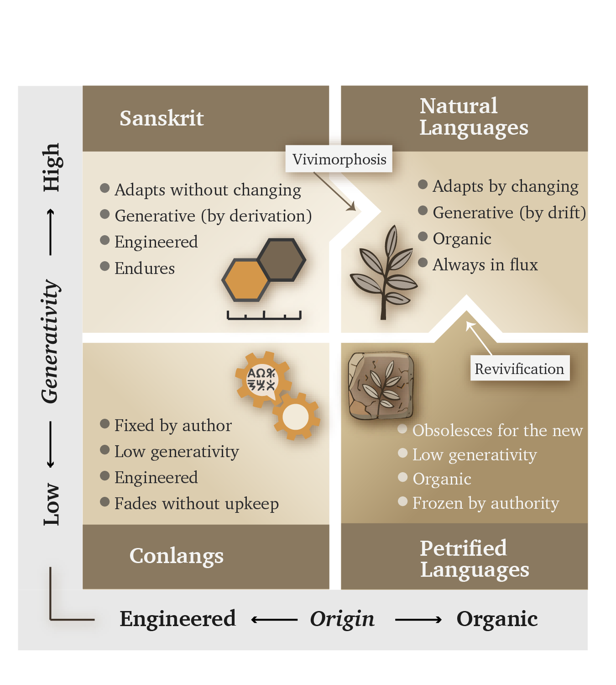

# Chapter 2 — Category Theft and Āsurī Māyā

::: epigraph

> मायाभिरिन्द्र मायिनं त्वं शुष्णमवातिरः ।\
> विदुष्टे तस्य मेधिरास्तेषां श्रवांस्युत्तिर ॥
>
> *māyābhir indra māyinaṃ tvaṃ śuṣṇam avātiraḥ |*\
> *viduṣ ṭe tasya medhirās teṣāṃ śravāṃsy ut tira ||*
>
> With *māyās*, O Indra, you struck down the *māyin* Śuṣṇa. The wise know this deed of yours; raise their renown.
>
> `\hfill`{=latex}*— Ṛgveda 1.11.7*[NOTE: rigveda-1-11-7-maya-mayin]

:::

\bigskip

---

## 2.1 The Category Move

The asuric pyramid's first move to eclipse Sanskrit's radiance is category theft: it places Sanskrit inside a category that directly contradicts Sanskrit's own architecture.

The theft works through **आसुरी माया (*āsurī māyā*)**. Sanskrit knows *māyā* as power, measure, formation, appearance, and skill, so its character depends on purpose. In asuric hands, *māyā* becomes a weapon of concealment: the pyramid makes the false category appear natural while hiding the true category even though its architecture remains visible.

### Three Categories Hide the Fourth

The pyramid teaches readers to recognize three broad categories of language. The first contains **natural languages**, which arise through communal speech and continue changing through use, contact, and inheritance. Institutions may standardize one variety for schools, administration, publication, or public life, but Standard English and Standard French remain botanical because their speakers continue changing them.[NOTE: language-origin-standardization-form]

The second category contains **classical or highly formalized languages**. Here an institution preserves a bounded form while ordinary speech continues changing around it. This book calls that state **petrified**. A petrified language retains a recognizable form after institutions have separated it from the ordinary processes through which spoken languages change. Quranic Arabic, Biblical Hebrew as preserved through the Masoretic apparatus, and ecclesiastical Latin provide familiar examples. Chapter 13 §13.5 follows their different trajectories, while Chapter 14 §14.6 examines the institutions that kept selected forms fixed as speech continued changing around them.[NOTE: petrified-bounded-forms]

The third category contains **constructed languages**, which begin with a deliberate plan created by a person or group. Quenya and Sindarin were constructed for the world of *The Lord of the Rings*, while Klingon was constructed for *Star Trek*.[NOTE: conlangs-tolkien-okrand] Their design may be ingenious and productive, but the pyramid treats them as finite projects that require their creators, later authorities, or speaking communities to add material when the original plan no longer meets a new circumstance.

These three categories mix two different questions. *Natural* and *constructed* describe how a language originated, while *classical* and *highly formalized* describe what institutions later did to a selected form. The mixture gives the pyramid a place to conceal Sanskrit. It classifies Sanskrit as natural speech at its origin and then groups *"Classical Sanskrit"* with other highly formalized languages after **पाणिनि (*Pāṇini*)** supposedly *"codified"* it.

That placement hides two defining facts. Sanskrit is the oldest and most successful *constructed language*: a wholly created architecture that remains available in complete, usable and unchanged form. It is also internally highly generative, so speakers can produce valid expressions for new situations without changing the language itself. Chapters 10 and 11 decipher the parts of that engine; Chapter 12 §12.8 gathers them under *Usage Expands While the Language Holds* and shows how affixes, compounds, and recursive operations keep **लौकिक (*laukika*)** usage responsive in every age while the language continues to hold.

The pyramid's three-category classification keeps these capacities apart because their combination is precisely what makes Sanskrit unique. Deliberate construction gives the language a stable architecture, while internal generativity keeps that architecture usable in every age. Together, they have allowed Sanskrit's caretakers to preserve the language across thousands of years, along with the civilizational memory of how pyramidal orders were recognized, resisted, and defeated.

That threatens the pyramid.

### Origin and Generativity

Figure 2.1 replaces that mixed taxonomy with a classification built from two consistent parameters. The horizontal axis classifies a language's **origin** as organic or engineered. The vertical axis classifies its **adaptive generativity** as high or low. Their intersection produces four quadrants.

{#fig:ch2-language-2x2 width=100%}

The **organic + high-generativity** quadrant contains the world's **Natural Languages**. Their speakers respond to new circumstances by changing vocabulary, pronunciation, grammar, and usage. No authority has to approve each addition because the speaking community continually generates and selects the forms that survive. English, Marathi, Tamil, Korku, Moroccan Arabic, and thousands of other languages remain adaptable through this ordinary communal activity.

The **organic + low-generativity** quadrant contains languages that have been **Petrified** by authority. The classification draws its image from a petrified tree. Minerals gradually replace the tree's living cells while preserving its trunk, grain, and rings. The result still looks organic, but its substance is now stone: the visible tree remains while the living tree is gone. A language, or one formal version of it, enters this quadrant when an authority similarly preserves a selected form while removing its correction and extension from ordinary communal change. Scripture, schools, academies, dictionaries, authorized editions, or public offices can hold that form for centuries, but a new circumstance remains outside it until an authorized custodian approves an extension. The language has become petrified because authority has preserved its recognizable form while restricting its ability to grow through ordinary use.

The pyramid loves Petrified Languages because they give the apex a linguistic object he can own. His institutions decide which form is correct, who may interpret it, which additions enter it, and which speakers receive education, office, or prestige. Once the pyramid establishes one form as the apex language, the changing languages spoken below it can be dismissed as corruptions, vernaculars, or mere dialects.

Arabic makes this hierarchy visible because its linguistic field occupies two quadrants. The familiar diglossic account calls Quranic or Classical Arabic and Modern Standard Arabic **High Arabic**, while it calls the natively acquired spoken Arabics **Low Arabic**. The Quranic form provides the clearest example of petrification; institutions preserve it through the *muṣḥaf*, recitation, memorization, and authorized readings. Modern Standard Arabic extends that High inheritance through schools, academies, publishing, broadcasting, and government. Meanwhile, Moroccan, Egyptian, Levantine, Gulf, and other spoken Arabics continue changing as Natural Languages. *High* and *Low* therefore describe their positions in an institutional pyramid rather than their linguistic worth.[NOTE: petrified-bounded-forms][NOTE: botanical-drift-prestige-memory]

The **engineered + low-generativity** quadrant contains **Conlangs**. Their designers begin with a planned vocabulary and a set of rules, then add material when the original inventory cannot express a new circumstance. Quenya, Sindarin, and Klingon fit this starting classification. A conlang can later move out of it when a community begins changing the language through ordinary use.

Esperanto offers a revealing modern example. It was engineered in late-nineteenth-century Europe, after Sanskrit had spent decades transforming the continent's study of language. Sanskrit grammars and the *Aṣṭādhyāyī* were already part of the intellectual environment in which Europeans imagined what a deliberately organized language might accomplish. Esperanto began with about forty productive affixes and 2,768 foundational lexical elements, both larger inventories than Sanskrit's twenty-two *upasargāḥ* and 2,168 listed *dhātavaḥ*, although the two systems do not classify these resources identically. Within years, speakers were adding forms and allowing usage to select among them, so the engineered project began moving toward the Natural Languages quadrant.[NOTE: esperanto-engineered-botanical-transition]

The **engineered + high-generativity** quadrant is where Sanskrit belongs. Sanskrit was engineered, yet its architecture can generate the vocabulary and expressions required by new circumstances *without* changing the language itself. Its *laukika* domain allows usage to expand, almost without limit, while the *dhātavaḥ*, affixes, compounds, grammatical relations, and distributed calibration continue to hold the language. Sanskrit therefore combines the deliberate architecture of an engineered language with the adaptability that natural languages obtain through change.

The figure also contains two arrows that show how a language or form can move between classifications. **Vivimorphosis** begins when an engineered Sanskrit form enters a natural language and acquires organic life within it. The full movement from **शब्द (*śabda*)** through **बीज (*bīja*)** to **अपशब्द (*apaśabda*)** appears in Chapter 12 §12.9. **Revivification** returns a petrified form to everyday speech, after which speakers can resume changing it botanically. Chapter 13 §13.5 examines Modern Hebrew as the clearest example, while Appendix Part 8 supplies the comparative evidence.

Esperanto's purpose was equal communication across nations, while Sanskrit is *saṃskṛti* in operation: the radiant, calibrant, and fractal architecture of Sanātan. **धर्म (*dharma*)** directs that architecture toward the welfare of all beings; stories preserve memories of balance, failure, and recovery; and distributed caretakers keep the measure available when society falls away from it. Linguistic rules and vocabulary form one layer within that sustaining order.

### How the Pyramid Reclassifies Sanskrit

The categories describe real processes, which allows the theft to hide inside familiar terminology. The pyramid arranges those processes into a false history of Sanskrit. Its account begins with Vedic Sanskrit as the natural speech of migrating *"Aryans"*, allows that speech to change through ordinary use, and then places Pāṇini at the transition to standardization. Pāṇini supposedly selected and *"codified"* an educated form that became *"Classical Sanskrit"*, while the *Prākṛta* languages continued changing botanically. The account eventually treats the selected Sanskrit form as fixed and classical.

That sequence forces **संस्कृति (*saṃskṛti*)** into the category of **प्रकृति (*prakṛti*)**. It turns domain and mode into successive periods, turns documentation into codification, and makes Sanskrit pass from botanical change into institutional arrest. Once the pyramid has imposed that sequence, it trains the reader to see growth, drift, ancestry, branches, plant-organs, and late standardization where Sanskrit's own categories show created order, calibration, and distributed correction.

The same taxonomy gives the apex several means of control when he owns the institutions that apply it. A standardized form can be selected, taught, rewarded, and enforced through schools, academies, courts, publishers, dictionaries, and government offices. Natural drift supplies a changing field that the same institutions can survey, rank, classify, and influence. Authorized texts and interpreters can place a fixed form under institutional custody.

The pyramid begins by surveying living speech. A survey shows officials which forms people use, where they use them, and what social value each form currently carries. When the same order controls schools, government offices, courts, publishers, broadcasters, and credentialing institutions, it can act on that map. The ruler's vocabulary enters textbooks, examinations, official records, and paid employment. Another vocabulary remains inside the home, where schools and offices can mark it as provincial or incorrect. Speakers continue changing the language through use, but the institutions above them have changed the rewards attached to their choices.[NOTE: botanical-drift-prestige-memory]

A child educated inside this hierarchy learns more than words. The child learns that one form of speech leads to examinations, employment, publication, and public respect, while the language of parents or grandparents belongs to private life. An authorized translation can also establish what an older word is now permitted to mean. Repetition through classrooms, official documents, and public media can then detach that word from a warning it once carried.

As this process continues across generations, older records become less directly accessible to ordinary readers. Translators, textbooks, and credentialed interpreters increasingly mediate the civilization's inherited memory. When those intermediaries belong to the institutions that also shaped the prestige language, they can soften, relabel, or omit the lessons that would expose their own methods.

Natural languages work well for communication, adaptation, and renewal, but they become vulnerable when asked to preserve long-term memory against rulers intent on erasing or hiding the past. Sanskrit and the Vedic preservation architecture keep older words, categories, and warnings available beyond the ruler's authority. The mere fact that this book can still be written is evidence that Sanskrit's engineering did its job despite millennia of assaults on Hindu culture and Sanskrit.

### The Seven Moves

The twoxtwo grid precisely identifies the category theft. The pyramid takes three real processes — natural change, institutional standardization, and the preservation of fixed forms — and arranges them as Sanskrit's history. It places Vedic Sanskrit in the natural-language quadrant, makes Pāṇini the agent of standardization, and pushes *"Classical Sanskrit"* toward the petrified quadrant. This manufactured sequence keeps Sanskrit inside the organic column and removes the engineered, internally generative category from view.

Through the nineteenth century, Western philology baked a story about Sanskrit that excluded the engineered, generative category. Bopp's comparative grammar in the 1810s, Schleicher's family tree in the 1860s, Müller's pedagogical machinery from the 1850s through the 1880s, and Brugmann's *Grundriss* in 1886 supplied the ingredients across three generations of European comparativists. Their recipe still governs authorized Indo-European curricula and reference works, where the imagined ancestor remains the controlling premise.[NOTE: bakers-story-seven-moves]

Centralized education extends this theft beyond specialist prose by teaching imaginary categories, imaginary chronology, imaginary historical actors, and imaginary languages. Students learn to picture language through roots and branches and to accept a chronology in which Vedic Sanskrit came *before* Classical Sanskrit, Pāṇini codified the language, and Sanskrit was PIE's offspring.

PIE is the eclipse-device in technical form: by placing an invented ancestor above Sanskrit, the pyramid demotes the calibrant to a cognate. It then places the real language, preserved in sound and use, below an imagined parent preserved nowhere, spoken by no known community, and recited by no lineage.

That is *āsurī māyā*: not illusion as such, not skill as such, but category-making used for concealment. The pyramid carries out the theft through seven coordinated moves.

**First.** Vedic Sanskrit was the naturally spoken language of the people the pyramid calls the *"Aryans"* — the racial category Chapter 3 calls the **Racial Arya Thesis (RAT)**. In the story, these itinerant pastoralists enter the subcontinent, become the founding event of Indic civilization, bring the language, use it, change it, and hand it to their descendants.

The familiar acronyms AIT and AMT hide this first move by arguing over mechanism: invasion or migration. **RAT** exposes the premise underneath both. PIE supplies the imaginary ancestor-language. *"Indo-Aryan"* fastens the invented people to a linguistic taxonomy. **The theft begins when *ārya* is made racial and Sanskrit is made portable.**

**Second.** Vedic Sanskrit drifted like any natural language. Sounds shifted, forms irregularized, and speech habits accumulated across generations. The same process that produced English from Old English and Italian from Latin supposedly operated on Sanskrit.

**Third.** By the time Pāṇini wrote the **अष्टाध्यायी (*Aṣṭādhyāyī*)**, the pyramid's story says the Sanskrit of the educated elite — the **शिष्टभाषा (*śiṣṭa-bhāṣā*)** — needed cleanup. Pāṇini selected its features, regularized its forms, and *codified* its grammar. This act of standardization supposedly produced *"Classical Sanskrit"*.

**Fourth.** With Pāṇini made the codifier, standardization can be turned into petrification. The *Prākṛta* languages continued changing into the modern Indian languages; *"Classical Sanskrit"* remained fixed as an artificial formal language. The dogma's softer wording puts the move directly: *Classical Sanskrit is artificially frozen and highly codified — arguably the most successful standardized formal language in human history*. The transition does the work: drift before Pāṇini, standardization through Pāṇini, and a fixed classical form after him.

**Fifth.** Because the pyramid classified Vedic Sanskrit as a natural language, it made it require natural ancestors. The Indo-European family tree supplied one: Proto-Indo-European, the imaginary ancestor from which Sanskrit, Greek, Latin, Iranian, Germanic, Slavic, Celtic, and the rest supposedly descend.

**Sixth.** The metaphor holding the story together is botanical. Languages are organisms. They are born, branch, mutate, decay, and produce descendants. PIE is the ancestor. Vedic Sanskrit is one branch. Classical Sanskrit is the branch the machinery says Pāṇini locked in place. The *"Indo-Aryan"* languages are the leaves that kept growing.

**Seventh, and most consequential outside the academy.** The account reaches ordinary readers as the two-versions claim: ***Vedic Sanskrit and Classical Sanskrit are two different languages***. Vedic is presented as the older, archaic natural language, while Classical is presented as the later Pāṇinian codification. By placing Pāṇini at the boundary, the pyramid teaches readers to imagine two languages on opposite sides of his work. This is the account most readers are familiar with.

By assigning linguistic drift to the period before Pāṇini, standardization to his work, and an absolute freeze to the period after him, the pyramid converts three categories into a chronology and hides the continuous, self-calibrating architecture that runs through them.

The seven claims fail move by move:

- **Move one is the portability fraud.** It recasts Vedic Sanskrit's engineered architecture as the naturally spoken tongue of migrating pastoralists. The *"Aryans"* of the racial Arya thesis are the assemblage Chapter 3 identifies, Chapter 16 tests at the level of mouth and mind, and Chapter 17 separates from authorship: movement is not creation.
- **Move two imposes drift.** Sanskrit's architecture was engineered against such drift, and the calibration matrix developed in Chapter 14 explains how the measure remained available across the span the pyramid converts into linguistic evolution.
- **Move three reverses decoding into standardization.** Pāṇini documented an already-operating architecture; he did not select a drifting natural variety and impose order upon it. Chapter 5 places his achievement inside the longer analytical lineage and explains why his decoding remains its finest surviving work.
- **Move four turns the invented standardization event into petrification.** The language held before and after Pāṇini's documentation because its resistance to drift belongs to the architecture rather than to a decree in the *Aṣṭādhyāyī*. Patañjali preserves the correct order that the codification story reverses: bond first, usage second, *śāstra* third. Pāṇini's *śāstra* can regulate usage because the bond already stands.
- **Move five supplies the imaginary ancestor required by the stolen category.** Once Sanskrit has been declared a natural language, the family tree demands an ancestral language from which it can descend. Chapter 18 tests that reconstruction and the direction of inheritance it assumes.
- **Move six transfers a useful botanical metaphor onto a different kind of architecture.** Growth, branching, and decay describe natural languages. Applying the same operations to Sanskrit turns its resistance to drift into an evolutionary anomaly and then uses that manufactured anomaly to justify late codification.
- **Move seven converts domain and mode into chronology.**[NOTE: chandasi-bhashayam-mode-markers] The dogma's *"Vedic Sanskrit / Classical Sanskrit"* pair makes *Classical*, a Greco-Latin classroom label borrowed from European philology, perform temporal work. Pāṇini's own text organizes the distinction on two categorical axes instead.

  **At the domain level**, the Indic pair is **वैदिक (*vaidika*)** / **लौकिक (*laukika*)** — Sanskrit of the Vedic domain and Sanskrit of the worldly learned domain. Patañjali's *Mahābhāṣya* uses the pair directly because the two are concurrent civilizational fields rather than stages on a timeline.

  **At the grammatical level**, the *Aṣṭādhyāyī* marks rules **छन्दसि (*chandasi*, "in meter")** for the **छन्दस् (*chandas*)** mode and **भाषायाम् (*bhāṣāyām*, "in speech")** for the **भाषा (*bhāṣā*)** mode. These locatives tell the reader where a rule operates. Both modes remain present inside the framework Pāṇini documents, so a difference in form indicates a difference of use rather than an evolutionary passage from one language into another. A temporal account would require temporal markers such as *pūrvam* or *prāk*; Pāṇini supplies categorical ones.

  ***The asuric machinery converts domain and mode into chronology.*** Once the pyramid owns the clock, it can rank every layer as early or late, original or derived. It flattens the two-axis architecture into the one-line story called *"Vedic to Classical"* and positions Pāṇini as the rupture between an evolved-before and a codified-after. Move four carries out this chronology capture by making Vedic Sanskrit drift into Pāṇini and making *"Classical Sanskrit"* freeze out of him.

  > *The dogma says:* *"Vedic Sanskrit evolved into Classical Sanskrit."*
  >
  > *The Hindu continuum says:* *"Sanskrit operates across vaidika and laukika domains, through chandas and bhāṣā modes — one calibrated language, a curated corpus."*

  **The asuric machinery makes Pāṇini a rupture. The architecture makes him a witness.**

  **Domain is not chronology. Mode is not drift.**

  Chapter 14 develops the two-modes framework and the calibration matrix that holds both domains and both modes against drift simultaneously.

Together, the seven moves make Sanskrit mobile, derivative, natural, drifting, late-regularized, and genealogically subordinate to an imaginary ancestor. The sequence begins by forcing *saṃskṛti* into the category of *prakṛti*; every later conclusion then follows from the stolen category rather than from Sanskrit's architecture.

## 2.2 The Metaphor Underneath

In the 1860s, the German comparativist August Schleicher fastened comparative philology to its governing botanical imagination.[NOTE: schleicher-stammbaumtheorie] He cast languages as living organisms with plant-organs, stems, branches, families, daughters, and sisters, all growing from ancestors, splitting across geography, mutating across time, and decaying into descendant forms. The metaphor looked innocent because it turned linguistic history into nature. Once the tree was accepted, the rest of the story followed almost automatically — and a century and a half later, the metaphor remains so naturalized that few of the discipline's practitioners notice they are speaking it.

The tree makes a created, measured, preserved, and calibrated system look like nature governed by growth, inheritance, mutation, and decay. Once Sanskrit has been assigned plant-organs, branches, and descendants, the picture itself demands a natural ancestor; PIE then enters the vacant position above it. Sanskrit becomes inherited nature followed by Pāṇini's later repair, while the distributed order represented by the swastika's geometry disappears from the account. The category has been stolen before the evidence is heard.

The **मातृ (*mātṛ*)** / *mother* relation brings the same transfer within reach of any reader. The English word is a **प्रतिबिम्ब (*Pratibimba*)** — a reflection of the Sanskrit form rather than a sibling standing beside it. Philology acknowledges the closeness, reroutes the direction through PIE, and places visible Sanskrit below an imaginary parent. By the time the etymology is presented, the tree has already decided what relationship the reader will see.

## 2.3 Where Botany Works

The botanical model persuades because it describes natural language change well.

English and Dutch behave like sister forms inside the Germanic family, while Latin changed across geography, politics, and usage into French, Spanish, Italian, and the other Romance languages. Natural languages shed endings, blur sounds, absorb neighbors, simplify some forms, complicate others, and reproduce themselves in altered descendants.

Old English **hlāfweard**, the "bread-guardian," became **laverd**, then **lorde**, then modern **Lord** — a title now reserved for men at the summit of the English hierarchy and for the Almighty.[NOTE: hlafweard-etymology] As the domestic provider became the political-theological superior, the form mutated and its original transparency disappeared.

This is botany at work. The metaphor fits its own object.

Fractality takes more than one form. Natural languages repeat patterns through branching, drift, inheritance, and adaptation; the plant therefore expresses *prakṛti* as natural recurrence, growth, mutation, and decay. Sanskrit repeats measured relationships through calibration and correction, giving *saṃskṛti* an engineered fractal form. Category theft equates recurrence with botany and then transfers a *sāṃskṛtika* fractal into *prakṛti*.

*Prakṛti* carries the dignity of natural language, local custom, forest life, inherited speech, and ordinary social continuity. The fraud begins when the pyramid takes a category that fits natural drift and uses it to conceal an engineered calibrant.

## 2.4 Saṃskṛti Made to Look Like Prakṛti

Sanskrit's own name puts it in another category. **संस्कृतम् (*saṃskṛtam*)** is an architectural declaration: *sam-* (complete, total, perfected) joined to *kṛta* (made, produced, brought into form), from the semantic atom ⟪कृ⟫ (*kṛ*), the action of making itself.[NOTE: samskrtam-morphology] The word yields the completely made, the perfectly formed, the wholly synthesized. Its past participle describes a created state, and the language takes its name from that state rather than from a people or a place.

If *saṃskṛtam* is what is wholly formed, *prakṛti* is what keeps making itself — nature. **प्राकृतानि (*prākṛtāni*)** are natural language forms: speech that continues shifting, growing, branching, and decaying. Indic grammar already holds the botanical category and assigns that behavior to the *prākṛtāni*. *Saṃskṛtam* is the architecture of **सनातन (*Sanātan*)** — the integral, the perpetual, the ground on which civilization continues. The *prākṛtāni* are everything else.

The pyramid's story requires ancient Sanskrit to change. Its account of Vedic drift, substrate absorption, the retroflex row, the syllabic *ṛ* (ऋ), and the supposed transition from Vedic to Classical cannot work without change. The Vedic-preservation continuum makes the opposite commitment. The *Vedas* are ***apauruṣeya*** (अपौरुषेय) — without human author, not composed in time[NOTE: apauruseya-mimamsa-sutra-1-1-5] — and ***śruti*** (श्रुति), heard rather than made. The eleven *pāṭhas* (पाठाः), the *Prātiśākhya* (प्रातिशाख्य) discipline, and the *guru-shishya* lineage-chain (गुरुशिष्यपरम्परा, *guru-shishya paramparā*) form an error-correcting transmission channel engineered to prevent change.

The dogma requires drift, while Sanātan's transmission continuum was built to prevent it. Chapter 16 develops the contradiction where it bites sharpest: the retroflex consonant series.

## 2.5 *Dhātuḥ* Is an Atom

Nineteenth-century European philology placed Sanskrit inside the botanical scheme while discarding Sanskrit's own distinction. It treated *saṃskṛtam* as one more leaf on an Indo-European tree, descended from an imaginary ancestor, governed by natural drift, and explainable by the same biology that explained ordinary languages. Because the framework had no category for an engineered language, it folded the engineering away.

The most consequential fold occurred in a single word: **धातुः (*dhātuḥ*)**. In Sanskrit grammar, the *dhātuḥ* is the foundational structural unit, and its semantic field extends across Sanskrit's scientific vocabulary. In Ayurveda, a *dhātuḥ* is one of the body's supporting tissues. In *Rasaśāstra* and metallurgical literature, a *dhātuḥ* is a fundamental element, an irreducible base substance valued for stability and constitutive force. Across domains, the meaning holds: a *dhātuḥ* supports, constitutes, and remains. It is a structural constant — a point Chapter 10 develops at atomic scale.

European philology forced *dhātuḥ* into the botanical category, and the rendering looks harmless only after the tree has already determined what the reader expects to see. A *dhātuḥ* is a structural constant: the constituent from which body, metal, medicine, and grammar are formed. The botanical substitute describes a different operation — an appendage sunk into soil that grows, feeds, branches, and rots. Translating the grammatical primitive as a plant-organ therefore relocated it from an engineering category into a botanical one; once the rendering became the foundational term of the discipline, the mistranslation no longer appeared as a translator's choice.

Sanskrit already had botanical words available: **बीज (*bīja*)**, the unit from which a plant grows, and **मूल (*mūla*)**, the anchor that draws and feeds. Either could have served as grammar's basic unit in a plant-key. Sanskrit instead uses *dhātuḥ*, the word available for the constituent constant of body, matter, and substance, thereby placing grammar in the engineering category. The botanical mistranslation imposed the metaphor Sanskrit's own vocabulary had declined.[NOTE: dhatu-pre-panini-vedic]

The mistranslation reorganized the field. Because the framework treated languages as organisms, it required Sanskrit's primitive to function as an organ and translated the word accordingly. A civilizational term for structural constancy was moved into a European botanical garden and kept there as exhibit number one for the family-tree thesis.

The theft strikes at the atomic level. The *dhātuḥ* belongs to the architecture of constituents. The botanical substitute moves it into the architecture of plants.

Chapter 10 makes the consequence measurable. Once the *dhātuḥ* is recognized as an atom rather than a plant-organ, its construction can be tested. The test reveals scaffolded architecture where the botanical account predicts growth.

## 2.6 Decoding, Not Codification

*Codified* is the strategic word that lets the *asuric machinery* acknowledge Sanskrit's precision, scale, and generative power while transferring their source to a later authority. The botanical account carries Sanskrit as natural speech up to Pāṇini. The standardization account then makes his grammar the external norm that supposedly imposes order, and the petrification account turns that selected form into *"Classical Sanskrit"*. This sequence assigns an already-operating architecture to one named figure at a late point inside the pyramid's chronology. Pāṇini receives the praise, while *saṃskṛti* as a distributed and self-correcting order disappears behind him.

The theft moves through three stages. The botanical account places Sanskrit inside nature and ancestry, making it natural enough to descend from PIE. Standardization then makes Pāṇini authoritative enough to explain its order, after which the pyramid presents the resulting *"Classical Sanskrit"* as a petrified form. *Saṃskṛti* disappears as prior architecture becomes later authority and decoding becomes imposition.

This is **heroic erasure** in grammatical form: praise the named figure so intensely that the architecture operating before him disappears. The machinery manipulates Pāṇini's achievement by praising the decoder and then teaching the civilization to remember him as codifier. Reverence is redirected toward the category that stole the architecture: codification.

The praise addresses two audiences and protects the same boundary for both. Hindus are taught to revere the codifier instead of the architecture he decoded, while the pyramid's students are taught that Sanskrit became impressive because one documenter fixed it. Institutional standardization can explain the selected forms promoted by an academy, church, court, school, or state, and authorized texts and interpreters can hold a bounded form. Pāṇini's text points in the opposite direction, toward calibration by architecture; once readers see that calibrant, they may ask why external authority was needed at all.

The refrain is simple:

> ***Sanskrit was engineered. Encoded in the Vedas. Decoded by many. Pāṇini's decoding is the finest.***

The whole case turns on direction. *Codify* runs from disorder toward imposed order; *decode* runs from prior order toward explicit specification. Sanskrit's own word is ***vyākaraṇam*** (व्याकरणम्): *vi-* (वि, *apart*) + *ā-* (आ, *fully*) + ⟪कृ⟫ (*kṛ*, *to do, to make*) — *unfolding apart*. The ***vaiyākaraṇaḥ*** (वैयाकरणः) is the one who performs that unfolding. Chapter 5 lays out the analytical lineage in detail; Chapter 10 develops the penetrating *agni* decoding of **यास्क (*Yāska*)** as a worked example.

Pāṇini did not codify Sanskrit. He decoded it. His *Aṣṭādhyāyī* documents the finest surviving decoding of an order already operating. The asuric machinery reverses that direction and calls the reversal *codification*. That is the institutional scale of the same category theft.

## 2.7 The Theft Made Visible

The botanical model works for languages that grow and decay. It fails when applied to a language engineered to resist growth and decay as linguistic drift. To force Sanskrit into the tree, the discipline had to flatten its structural primitives into biological organs, treat its grammar as evolutionary residue, and treat its preservation as artificial freezing after Pāṇini. What disappeared was not nuance. It was the category Sanskrit occupies in its own civilizational grammar: not *prakṛti*, but *saṃskṛti*.

Patañjali had already described the asymmetry precisely. The *vaiyākaraṇaḥ* defends the correctly formed word against its fallings-away, the **अपभ्रंशाः (*apabhraṃśāḥ*)**. His account identifies entropy as departure from a standing form, while European philology later treated that entropy as Sanskrit's natural condition. He also insisted that the bond between word and meaning was **सिद्ध (*siddha*)** — established, permanent — rather than **कार्य (*kārya*)**, produced and ongoing. The direction is clear: the engineered word stands; the natural variants fall away from it. Chapters 5 and 6 develop that framework on its own terms.

The botanical metaphor describes growth and decay. Sanskrit was built so that neither would define it.

The tree forced *saṃskṛti* into *prakṛti* and held the invented ancestry of PIE strictly above it. The false codification story then made the documentation of an existing architecture look like mere repair. None of this was an accident of scholarship; it operated as a strategic necessity.
