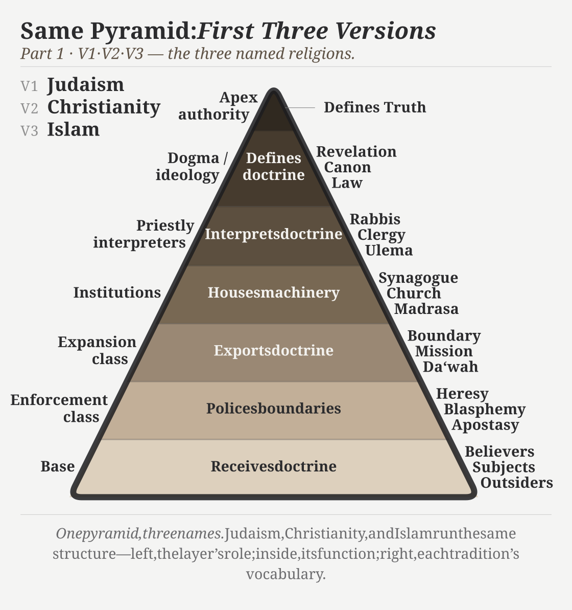
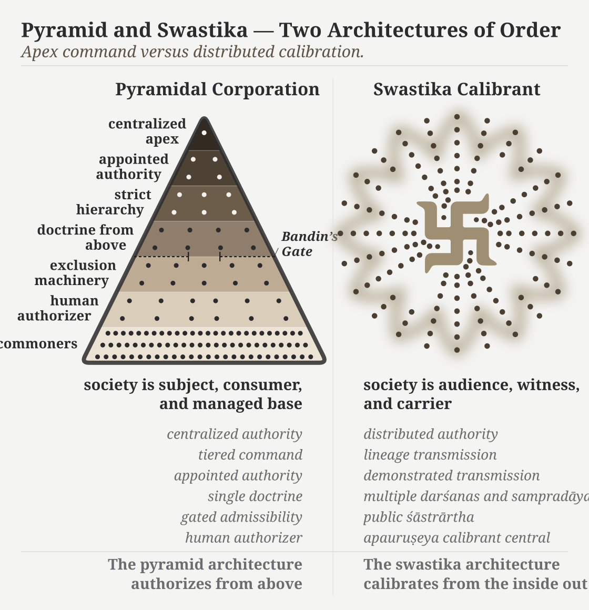

# Chapter 4 — The Fourth Abrahamic Religion

---

## 4.1 The Fourth Religion

The usual count gives three Abrahamic religions. The modern world has four, and the fourth succeeds because it does not call itself one.

Judaism drew the line; Christianity reformed it in Roman antiquity, and Islam reformed it again in late antiquity. Each preserved the structural template of the form before it — a chosen community, an authorized doctrine, a boundary between insider and outsider, a missionary or expansionary obligation, and a history moving toward a promised end. The doctrinal contents differ. The template holds.

Progressivism inherited the template wholesale: it discarded the religious vocabulary and kept the religious machinery.

The standing term here for the doctrinal formation is the **progressive dogma**: the cross-partisan, post-*"Enlightenment"* commitment to linear progress as the background against which every modern argument is staged. Its practitioners differ in politics, religion, discipline, and temperament. What they share is the assumption that humanity moves upward across time.[NOTE: heavenly-city-becker]

That doctrine has an institutional carrier: the **church of progress**. The academy gathers, credentials, publishes, reproduces, and sanctifies the doctrine across generations. The church operates through degrees, departments, journals, conferences, peer review, textbook canons, and reference works. The dogma is what the church believes. The church is how the dogma becomes durable.

The charge falls on the formation, not on the individual scholar, student, or salaried researcher who inherited the Western frame and works inside the machinery from training, habit, or honest confidence in authorized categories. The formation is what makes one kind of description profitable and another costly: the apex-and-layer structure that turns Sanskrit from living architecture into philological evidence, turns evidence into doctrine, subordinates doctrine to an imaginary ancestor, and uses the ancestor to conceal the civilization that preserved Sanskrit.

The church operates through three function-classes. **Missionaries of progress** carry the framework outward and naturalize it inside civilizations that already possess their own. **Jihadis of progress** attack and marginalize work that threatens the framework. **Priests of progress** maintain the ritual machinery of internal authorization: peer review, citation conventions, scholarly consensus, and disciplinary gatekeeping. Extend, defend, sanctify. The names are polemical because the functions are religious.

The older diagnostic vocabulary underneath these operations is precise: the *paṇi* hoards, the *vṛtra* blocks circulation, and the *rākṣasa* carries predation or disguise into the field.

The full structure has doctrine, institution, missionaries, defenders, and priests. Progressivism is the **fourth Abrahamic religion**.

The substitutions are exact. Heaven on earth became progress. Salvation became development. The elect became the enlightened. The damned became the backward. Mission became modernization. Heresy became anti-science, regressive, pseudo-scholarship, communalism. The end times became the end of history.[NOTE: end-of-history-fukuyama] Original sin survived as historical injustice, with the operative content changing by faction while the structure remained.

The genealogy runs deeper than metaphor. The *"Enlightenment"* did not abolish Abrahamic end-time structure; it secularized it into a beginning, a saving sequence, and an end toward which collective effort is bent. The end may be liberal democracy or technological transcendence. The vehicle changes. The end-time structure does not.[NOTE: voegelin-gnosticism]

The fourth Abrahamic religion succeeds because it thinks it is post-religious. A Christian missionary is visible as a missionary. A missionary of progress arrives under the cover of universal applicability: modernization, development, global standards, rights discourse, scientific consensus. The cover makes the doctrine portable into civilizations that have their own categories.[NOTE: black-mass-gray]

The apocalypse remains live. Climate catastrophe, AI extinction, demographic collapse, pandemic, nuclear annihilation — the named doom changes by decade. The structure does not: a coming catastrophe, a prescribed avoidance, an enlightened class authorized to administer the avoidance, and a recalcitrant out-group blamed for endangering it.[NOTE: fourth-abrahamic-eschatology-precedent]

The scriptural substrate is now in place: Abrahamic political formations sanctified master-slave categories and imposed them on India through Islamic and Christian rule. The fourth form secularizes the same substrate. What the earlier formations did through military and administrative language, the fourth does through academic, cultural, legal, and developmental language.

**B.R. Ambedkar**, in *Pakistan, or the Partition of India* (1940/1945), diagnosed the structural form when he turned his attention to Islam:

> *"Islam is a close corporation and the distinction that it makes between Muslims and non-Muslims is a very real, very positive and very alienating distinction. The brotherhood of Islam is not the universal brotherhood of man. It is brotherhood of Muslims for Muslims only. There is a fraternity, but its benefit is confined to those within that corporation."*[NOTE: ambedkar-pakistan-partition-1945]

He identified one corporation. The diagnosis extends to all four. Each operates through a boundary between members and non-members, a fraternity whose benefits are confined inside, and a machinery for disciplining those below.

Ambedkar provides the outline; the pyramid gives the interior.

The four Abrahamic religions are not merely closed corporations. They are pyramidal corporations: visible apex, visible layers, authorization flowing downward, compliance flowing upward, exclusion machinery pointed at heterodox argument from below. The closed boundary defines the corporation. The pyramid describes how the corporation governs. At the apex of the first three stands a Father — *jealous, by His own testimony*, who brooks no other before Him — and, as shepherd, He needs the flock that does not need Him. The fourth secularizes Him into consensus and keeps the singular peak.

{#fig:ch4-same-pyramid-v1-v3 width=100%}

{#fig:ch4-same-pyramid-v4 width=100%}

## 4.2 The Two Dogmas

At the doctrinal level, two coordinated dogmas operate.

The first is the **progressive dogma**. It defends the time-axis: recent means advanced; ancient means primitive or preliminary. Every surface disagreement inside the church of progress runs against this background. The progressive left says humanity advances through emancipation. The developmentalist right says humanity advances through markets and innovation. The institutional center says humanity advances through managed combinations of both. The disagreement is operational. The upward trajectory is shared.

The engineered Sanskrit thesis is unacceptable inside this frame. It claims that an ancient civilization possessed an architectural sophistication the present has not surpassed: a precision-engineered language, a calibration matrix encoded in the *Vedas*, and a preservation architecture that has held across thousands of years without observable drift. If that is true, the arrow of progress has at least one civilizational fact wrong. If it has one wrong, the rest of the sequence becomes available for re-examination.

The second is the **foundational dogma**. It defends the origin-axis: engineered writing, grammar, abstraction, and civilizational form must originate in the named Western corridor — Sumerian cuneiform, Egyptian hieroglyphs, Phoenician alphabet, Greek extension, Latin inheritance — while everything outside that corridor either descends from it or arrives too late to count.

The two dogmas cooperate. A deep ancient achievement threatens the progressive dogma. An engineered achievement outside the corridor threatens the foundational dogma. An achievement that is both ancient and engineered outside the corridor threatens both at once. The *varṇamālā* is exactly that case. Brāhmī is exactly that case. Sanskrit is exactly that case.

Erasure of the engineering carries the load. If Sanskrit is natural, the progress story survives. If Brāhmī is adapted from Aramaic, the corridor survives. If the pyramid can recast Pāṇini (पाणिनि) as codifier rather than decoder, the late figure absorbs the architecture. One vocabulary protects two doctrines.

Behind the linear-progress pillar stands the doctrinal formation that holds it. The main chapters prosecute the language-level case; Appendix Part 3 takes the script-level case. Both dogmas are surfaces of the same asuric pyramid.

## 4.3 The Church of Progress

The academy is the institutional carrier: the church of progress.

The PhD is ordination, structurally. The thesis defense is the ritual of conferral. The committee examines doctrinal fitness. Peer-reviewed journals are the publication machinery; anonymous review is the imprimatur process. Conferences are gathering rituals. Departments are institutional housing. Tenure is benefice. Reference works are catechism: the ordinary transmission of doctrine into the next generation. The church also has a pyramid.

| Religion | apex functions | Layers below |
|---|---|---|
| Judaism | great rabbinic authorities; academies; responsa machinery | rabbis → scholars → community leaders → laity |
| Christianity | papacy; curia; councils | cardinals → bishops → priests → laity |
| Islam | caliphal-political authority; juristic schools; fatwa machinery | *ulema* → imams → muftis → ordinary Muslims |
| Progressivism | elite universities; flagship journals; foundations; disciplinary associations; prize committees; state and international credentialing bodies | tenured full → tenured → tenure-track → postdoc → graduate student → outsider |

Grants, fellowships, endowed centers, foundation programs, university presses, hiring pipelines, and rankings are the church's material metabolism, not decoration. They move resources downward through the pyramid and move doctrinal compliance upward through the careers the pyramid sustains. The system is not only a hierarchy of titles. It is a resource machine.

The academy is the central church, but the church has arms. International bureaucracies propagate doctrine in policy language. NGOs and foundations propagate it in development language. Legacy media propagate it in cultural language. Courts and treaty regimes propagate it in legal language. Each arm uses credentialed personnel, approved vocabulary, institutional housing, and boundary policing. The vocabulary differs. The church remains one.

The church's catechism work is visible in the cementing of Proto-Indo-European into the routine reference machinery. Across recent decades — the very window during which India's dharmic-civilizational re-emergence has begun to threaten the pyramid's settled assumptions — the standard etymological references and Indo-European dictionaries have multiplied and hardened.[NOTE: pie-cementing-recent-decades] The dogma is being reinforced at exactly the moment an alternative is beginning to assemble itself, as Chapter 18 traces in detail.

## 4.4 The Three Classes

The fourth Abrahamic religion operates through three classes.

The **missionaries of progress** export the framework. They arrive as development consultants, education reformers, rights trainers, museum curators, NGO officers, global-governance experts, and curriculum designers. Their function is not merely to advise. It is to replace local categories with progress-categories and then declare the replacement universal. In India, they train civilizational self-description to pass through the categories of caste, communalism, development, modernization, minority rights, secularism, and backwardness before it can be heard. The lineage runs back to Rostow's stages-of-growth model and continues through development economics, World Bank conditionalities, and the Sustainable Development Goals.[NOTE: rostow-modernization-theory]

In the Sanskrit question, the same class now appears through popular synthesis. Ancient DNA, archaeology, and linguistic reconstruction are braided into a general-reader migration story in which PIE becomes a reconstructed people-and-language package, the steppe becomes the source-zone, and Sanskrit becomes one branch among many. The racial Arya thesis survives in softened vocabulary. The form is no longer crude invasion. It is public pedagogy, carried by the missionaries of progress.[NOTE: popular-pie-missionaries]

That pedagogy turns population movement into civilizational authorship; Chapter 17 returns to the trap in full.

The **jihadis of progress** defend the framework. They attack heterodox work through labels that end argument before argument begins: anti-science, regressive, extremist, pseudo-scholarship, communal, majoritarian. The point is not refutation. The point is contamination. Once the label attaches, the work need not be read. In the Indian context, *communalism* performs the work *heresy* performed in earlier Christian usage: it brands the challenger as morally outside the field of permissible speech.

The **priests of progress** sanctify the framework. Peer review is their rite. Citation is liturgy. The thesis defense is ordination. Tenure is benefice. The conference Q&A is controlled confession. The priestly class decides what becomes publishable, citable, reputable, and therefore real inside the church.

The priestly function operates inward and outward. The inward operation defends the doctrine against heterodox challenge through the machinery this section identifies. The outward operation is older. The church of progress absorbs civilization-internal scholars from civilizations its doctrine has already turned into objects of study — Sanskritists from the dharmic continuum, Confucian classicists from the Chinese tradition, Quranic scholars from the Islamic tradition, Talmudists from the Hebrew tradition — elevating them into the priesthood through formal honors, institutional appointments, and structural recognition. Once elevated, their internal authority is deployed as sanctifying imprimatur for the pyramid's account of that civilization: *the senior scholars from inside the civilization itself agree with us*. The elevation produces the agreement. The colonial honors system — knighthoods, fellowships, council seats, chair appointments, royal-society memberships — is the specific elevation-rite that converts internal authority into dogma-sanctifying imprimatur. Appendix Part 1 documents this outward-absorption mechanism in operation across the colonial Sanskrit-knowledge enterprise.

The mechanism did not retire with the colonial era. Its contemporary face is the Sanskrit-as-power frame: Sanskrit's premodern reach narrated through culture, polity, and cosmopolis — the sophistication conceded, then relocated into elite power and away from the engineered architecture beneath sound, grammar, and calibration.[NOTE: pollock-sanskrit-cosmopolis-position-3] The patronage that carries it keeps the same shape — a multimillion-dollar family gift from India seated inside a Harvard-published classical-Indian series: the gift reaches the gate, and the gate returns the inheritance with a category attached.[NOTE: murty-library-gift-gate]

The Wilson and Griffith translations of Rigveda 9.63.5 show the priestly function in miniature. Both nineteenth-century translators remove the civilizational object **विश्वम् आर्यम् (*viśvam āryam*)** and substitute away from **अराव्णः (*arāvṇaḥ*)** — the privative of *rā-* ("to give"), *the non-givers*. Wilson euphemizes to *"withholders (of oblations)"* following Sāyaṇa's narrow ritualist gloss; Griffith mistranslates to *"the godless ones"*, a Christian-theological category the Sanskrit verse does not contain.[NOTE: rigveda-9635-wilson-griffith] The structural motive is plain: acknowledging the call to *make the whole world ārya* would catastrophically undermine the racial Arya thesis the same translators were elsewhere defending. The call the Indic continuum preserved — *making the world ārya; defeating the non-givers* — is filtered out at the point where English readers would encounter it. That is sanctification by exclusion. At the level of operation, this is the *paṇi* move in translation: withhold the category that would let the reader recognize the verse. The primary source does not disappear. It is made unavailable through priestly handling. The Jamison–Brereton modern academic translation (*The Rigveda: The Earliest Religious Poetry of India*, Oxford 2014, vol. 3 p. 1287) restores both: *"making it all Ārya"* and *"smashing away the non-givers,"* with the hymn-introduction labeling the operation as *Ārya-ization* — vindicating in 2014 exactly the account the philological machinery had suppressed for a century and a quarter.

## 4.5 Bandin's Gate

The priestly rite now has a modern name: peer review.

Peer review answers a canonical question: ***Who guards the guards?*** — *quis custodiet ipsos custodes?* — asked in Rome two thousand years before any modern peer-review machinery existed.[NOTE: juvenal-quis-custodiet] The church's procedural answer is that the guards guard each other.

The official defense of peer review is quality control. The reality is more ambiguous. Quality control examines arguments. Priestly control examines authorization. Quality control asks whether evidence is sound. Priestly control asks whether the speaker belongs. Quality control can be defeated by better evidence. Priestly control hides behind reputation, journal hierarchy, citation networks, and institutional pedigree.

The mechanism has an Indic name: **बन्दिन् (*Bandin*)**.

In the *Vana Parva* of the *Mahābhārata*, Bandin holds King Janaka's court against challengers. He has defeated learned men before him. The young **अष्टावक्र (*Aṣṭāvakra*)**, twisted in body and young in years, comes to challenge him. Bandin's first move is procedural. The gate asks: Who are you? What standing do you have? Who recognized you as worthy to enter?

Aṣṭāvakra defeats the gate before he defeats Bandin. He exposes the fraud: a council that judges by age, appearance, and external standing before hearing the argument is not a council of the learned. It is a council of fools. The lineage's verdict is clear. The hero is Aṣṭāvakra. The villain is Bandin.[NOTE: ashtavakra-bandin-mahabharata]

The debate was not peer review. It was **शास्त्रार्थ (*śāstrārtha*)**: knowledge tested in public. The audience was not a hidden committee of credentialed insiders. The audience was the court itself — learners, citizens, visitors, retinue, witnesses. The verdict was rendered by demonstration, not by anonymous gatekeeping. *Śāstrārtha* democratizes knowledge because the audience is structurally present. Peer review concentrates verdict in a sub-class invisible to the audience and unanswerable to it.

The contemporary Bandin sits on an editorial board, grant panel, appointments committee, dissertation committee, or review desk. His language has changed. His structure has not. He says: this has not appeared in a reputable journal. This is outside scholarly consensus. This does not meet disciplinary standards. This is not how the field understands the question. The debate is decided by deciding who may enter the debate.

The engineered Sanskrit thesis has been pre-empted by Bandin's gate. The journals confer reputability. Reputability decides admissibility. Admissibility decides whether the argument can be heard. The circularity is the mechanism.

The verdict remains the same. The hero is the challenger denied standing. The villain is the gatekeeper who treats authorization as truth.

*Sanātan* has the answer. It has carried the answer for thousands of years. The mechanism does not know it has already been answered.

## 4.6 The Asuric Pyramid

The architecture of containment is now visible. The same formation appears in Indic-categorical idiom — its substrate, its agent-class, its operating mode, and the geometry it builds.

The substrate is **तमस् (*tamas*)**: inertia, darkness, the quality of operations that cannot accommodate light. The agent-class is **असुराः (*asurāḥ*)**: those who consolidate power through hierarchy, deception, and the withholding of light. The operating mode is ***asuratva*** (असुरत्व): the quality of being asuric.

**स्वर् (*svar*)** carries sun, heaven, light, the bright firmament — and the morphology built on it carries the diagnosis. **सुरः (*suraḥ*)** is the shining one. **असुरः (*asuraḥ*)** is the privative formation: not-light. An asuric formation operates by withholding light — the obscuration Chapter 1 §1.3 traces to **स्वर्भानु (*Svarbhānu*)**, whose name carries the very *svar* he eclipses: Sūrya darkened, not destroyed. Chapter 18 develops the contact-history consequences of this term; the polity-architectural implications belong to a forthcoming volume in the *Second Shanti* series.

*Asuratva* has a characteristic geometry: the pyramid. Authority concentrates at an apex — the apex-one of Chapter 1, now in Indic-categorical idiom. He is jealous of what he did not build and cannot bear an order above his own. A distributed order — one with no apex at all — threatens him more. Labor spreads across tiers. The base becomes voiceless. Every layer depends on authorization from above. The containment pillars are pyramids. The racial pillar maps to the pyramid of racial hierarchy: European apex, colonial administrators and certifiers in the middle, ranked populations at the base. The theological pillar maps to scriptural authority: canonical text at the apex, priestly interpreters in the middle, laity at the base. The progress pillar maps to academic credentialing: journals and chairs at the apex, the *priests of progress* of §4.4 as intermediaries, civilizational populations whose own knowledge systems the pyramid refuses to recognize as peer at the base. The integrated structure is the asuric pyramid.

> Modern language would call this civilizational envy, inferiority panic, and collective narcissism. The pyramid sees an architecture it did not create, cannot equal, and cannot control. It therefore cannot allow that architecture to stand in its own category. Collective narcissism requires the pyramid to remain ancestor, arbiter, or owner. If Sanskrit is too great to dismiss, it must be co-owned. If it cannot be co-owned, it must be demoted. That is the psychological engine underneath the philological machinery.

In the ternary introduced in the front matter, this is **विकृति (*vikṛti*)**: recurrence distorted into control. The pyramid is not hierarchy once. It is hierarchy reproducing itself as doctrine, institution, funding, credential, and inherited obedience.

The three pyramids converge on a single target. The racial pillar attacks *Sanātan* through the engineered language that carries it. The theological pillar attacks through the chronology that contains it. The progress pillar attacks through the linear-time framework that cannot accommodate the cyclical-time civilizational memory the Indic continuum holds. Three vectors; same target.

*Sanātan* is not silent about *asuratva*. The *Itihāsa* and *Purāṇa* corpus carries hundreds of cases of asuric formations becoming powerful and being defeated by characters aligned with the dharmic order. **Hiraṇyakaśipu** gives the *daitya* form of apex command: power consolidated through a boon engineered to be irrevocable; the boon's structural blind-spot becomes the defeat. **Mahiṣāsura** gives the disguise-and-shape-shift form: control accumulated through forms that Durgā's discriminating intelligence can pierce. **Rāvaṇa** embodies the institutionalized rākṣasa pyramid: absolute command at the apex, ministerial layers enforcing the hierarchy, and a population bound to the ruler’s grand project. His defeat comes through a suric coalition — an alliance that mobilizes the very populations the apex arrogantly assumed were too insignificant to coordinate against him. **Vṛtra** gives the obstruction form: waters withheld from circulation until Indra restores the flow. Each story is a recipe. Sanskrit's corpus carries the recipes; the civilization has carried them across thousands of years through recitation, temple, festival, theatre, household narration, regional performance, commentary, and teacher-student lineages.

*Asuratva* is not confined to the sacred narrative archive. The asuric machinery operates *asuratva* at the institutional level; its individual operators carry the same disposition into specific named cases. August Schleicher has already appeared as the founder of the comparative-philological enterprise; he is one such operator. By the 1860s, Schleicher had Sanskrit's engineered architecture on his shelf — Bopp's *Vergleichende Grammatik* had laid it out a generation earlier; the Pune-Calcutta-Oxford-Göttingen knowledge pipeline had supplied the *Aṣṭādhyāyī*, the *Dhātupāṭha*, the *Prātiśākhya* discipline, and the *varṇamālā* into the German philological community. He had the recipe — the engineered architecture the *Itihāsa*'s asura-defeat narratives are carriers of, the calibrant of *Sanātan* — and refused to use it. The operation is a *dānava* move: technical skill bent away from *sat* and toward concealment. He manufactured the botanical-tree metaphor that backwards-describes Sanskrit instead, because crediting the recipe as Indic would have served *lokakṣema* and undermined the asuric pyramid his employer had been built to defend. Appendix Part 5 §5.8 develops the case in full.

*Sanātan* is the structural opposite. Its authority is distributed across **शास्त्र (*śāstra*)**, **सम्प्रदाय (*sampradāya*)**, **दर्शन (*darśana*)**, the *guru-shishya* lineage-chain, lived practice, and public *śāstrārtha*. There is no Pope of *Sanātan*. There is no Khalīfah of *Sanātan*. There is no foundation president of *Sanātan*.

The shape is the swastika: the ancient Indic symbol of rotational, distributed authority, structurally distinct from any twentieth-century European appropriation of the form. The pyramid authorizes from a summit. The swastika transmits through rotation.

The pyramid cannot tolerate ***apauruṣeya*** (अपौरुषेय), texts without human authorship. Pyramidal machinery requires traceable authorization: who wrote it, who certified it, who interprets it, who controls it. The *Vedas* break the chain. The pyramid understands the *Vedas* perfectly. What it cannot control, it cannot accept.

The deeper implication is larger than scripture. The modern world assumes that order at scale requires pyramidal authority: command at the apex, enforcement through layers, compliance at the base. At that apex sits a single ruler; he requires submission and calls the requirement order. The Vedic preservation system is the empirical disproof. *Chandas* (छन्दस्), *śruti* (श्रुति), and the *guru-shishya* transmission architecture have preserved exact phonetic specifications across thousands of years without a central office, without an authorized priesthood holding interpretive monopoly, without a command structure issuing *thou-shalt* from above. Order at architectural scale can be maintained without pyramidal authority. The premise is false.

That makes the *Vedas* a weapon against **every pyramid.** Not because they command rebellion, but because they demonstrate that the pyramid's central claim is unnecessary. The pyramid says order requires an apex. The Vedas answer by existing.

The pyramid does not misclassify Sanskrit because it fails to understand calibration. It misclassifies Sanskrit because it understands calibration too well. Natural drift can be surveyed, ranked, managed, and ruled. Codification can be captured by authority — academy, committee, grammar, school, court, priesthood, state. Calibration is different. It places the standard inside the architecture and distributes correction through sound, memory, lineage, grammar, and disciplined use. No apex is required. That is why the pyramid splits Sanskrit in two: *prakṛti* before Pāṇini, codification after Pāṇini. It can lord over the first and sanctify the second. It cannot permit the third to stand.

A system that displays दिव्यता (*divyatā*) and preserves लोकक्षेम (*lokakṣema*) without apex command is intolerable to the asuric mind. It proves that the pyramid is not the source of order. It is only one formation that tries to capture order.

**सनातन (*Sanātan*)** is the name the civilization gives to the engineered Sanskrit architecture: integral, perpetual, the ground on which civilization continues. The *Vedas* preserve the system as a calibration matrix against entropy. The *pāṭha* discipline encodes the calibration with engineered redundancy. *Vyākaraṇam* makes the internal laws explicit. The architecture has always existed. Its continuous operation is the empirical fact at the center of this book.

The fourth Abrahamic religion is the institutional formation that has tried to absorb, contain, or overwrite that architecture. Earlier formations did it through military and administrative power. The fourth does it through academic, cultural, legal, and developmental power. The vocabulary has secularized. The structural project has not.

The dharmic continuum has its own primary-source diagnosis of the foreign binary the Abrahamic substrate imposed on India. In the *Assalāyana Sutta*, the Buddha observes that the *ārya/dāsa* binary is visible among foreign-bordering nations such as Yona and Kamboja, not as an Indic universal — the dharmic continuum itself documenting the binary as foreign to the dharmic frame.[NOTE: assalayana-sutta-fwd] The Epilogue lands the citation in full.

Two architectures contest, asymmetrically. The fourth Abrahamic religion tries to remake an integrated civilization in the image of an imported binary structure. The architecture of *Sanātan* holds beneath whichever political-administrative regime happens to operate at the surface. It has not survived by accident. It survived because it was built to.

{#fig:ch4-pyramid-swastika width=100%}

The sequence is compact:

**Ambedkar indicts the corporation. Peer review reveals the pyramid. Bandin guards the gate. Aṣṭāvakra breaks it. *Sanātan* preserves the alternative.**

With the containment established, the book now turns inward. Sanskrit's own grammar supplies the architecture the containment was built to hide.
