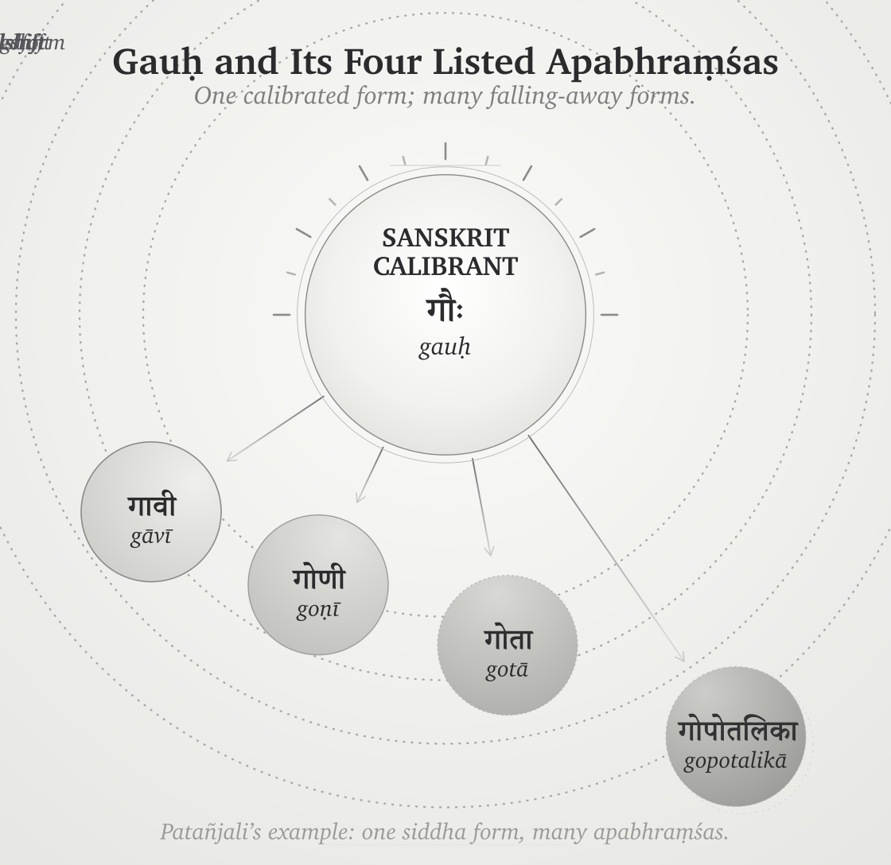
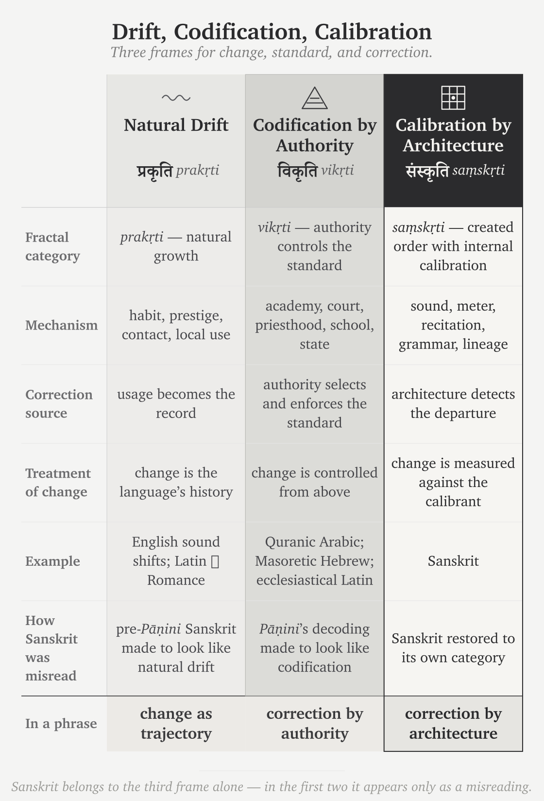

# Chapter 6 — *Apabhraṃśa* and Entropy

---

::: epigraph

> भूयांसोऽपभ्रंशा अल्पीयांसः शब्दाः ।
>
> *bhūyāṃso 'pabhraṃśā alpīyāṃsaḥ śabdāḥ.*
>
> `\hfill`{=latex}*— Mahābhāṣya*[NOTE: paspashahnika-apabhramsa-passage]

:::

\bigskip

## 6.1 Entropy Has a Name

If the bond between word and meaning is established, grammar has a task. It must defend the bond against what breaks away from it.

Codified systems correct by authority; Sanskrit corrects by architecture. That distinction becomes visible here. If correctness comes from authority, error is disobedience. If correctness comes from architecture, error is misalignment. *Apabhraṃśa* is misalignment — the uttered form slipping away from the established bond between word and meaning, sound and form, usage and rule.

Entropy has a Sanskrit name: **अपभ्रंश (*apabhraṃśa*)** — falling away, slipping off. The morphology is transparent: *apa-* means away, off, down; *bhraṃśa* carries the semantic atom ⟪भ्रंश्⟫ (*bhraṃś*), to fall or slip. A speaker produces *apabhraṃśa* when the uttered form slips from the engineered form grammar specifies.

The slip can be phonetic, morphological, or lexical. A sound shifts. A form reorganizes. A word is replaced by something easier. Grammar treats all three with the same structural eye. The deviation is a falling-away, not an alternative form.

The *vaiyākaraṇāḥ* do not punish the speaker for violating authority. They identify where the form has fallen away from the architecture and restore it to fit. *Apabhraṃśa* is therefore not merely "incorrect speech." It is entropy named in Sanskrit.

The *vaiyākaraṇāḥ* identified this before modern linguistics had a vocabulary for it. They observed it in speech, measured it, and built grammar in direct response to it. The grammar that begins from *siddha* describes what *siddha* faces.

## 6.2 Few Words, Many Corruptions

Patañjali states the asymmetry in the *Paspaśāhnika*:

> **भूयांसोऽपशब्दाः, अल्पीयांसः शब्दाः ।**
>
> *bhūyāṃso 'paśabdāḥ, alpīyāṃsaḥ śabdāḥ.*
>
> *Many are the corruptions; few are the words.*[NOTE: paspashahnika-apabhramsa-passage]

The epigraph renders the same asymmetry through *apabhraṃśa*, the term of art here. Patañjali's maxim uses **अपशब्दाः (*apaśabdāḥ*)** — faulty words, non-words — and the same passage then lists the **अपभ्रंशाः (*apabhraṃśāḥ*)** of **गौः (*gauḥ*)**. The two terms carry the same structural judgment from different angles: *apaśabda* points to the wrong word; *apabhraṃśa* points to the falling-away.

The maxim records an empirical observation. The set of correct words is small. The set of corruptions generated from those words is large. The relation is asymmetric: the engineered set is the minority, and the fallings-away multiply.

That asymmetry explains the architecture. If the correct forms were the majority, grammar could be light: a teaching aid, a reference tool, a memory device. They are not. The correct set has to be kept visible against a larger field of corruptions. Grammar exists because entropy is productive.

Few are the words. Many are the corruptions. The work is to keep the small set visible against the large.

## 6.3 *Gauḥ* and Its Fallings-Away

Patañjali demonstrates the asymmetry with a single example. The correct word is **गौः (*gauḥ*)** — cow. The grammar specifies *gauḥ*. Speakers produce a family of deviations:

> **गावी (*gāvī*), गोणी (*goṇī*), गोता (*gotā*), गोपोतलिका (*gopotalikā*).**[NOTE: paspashahnika-apabhramsa-passage]

Each variant falls away differently. *Gāvī* lengthens and reshapes the form. *Goṇī* shifts the consonantal body. *Gotā* simplifies and re-suffixes. *Gopotalikā* adds derivational material that no engineered template requires. The details differ. The structural relation is the same.

Patañjali does not list these as alternative correct forms. He lists them as corruptions of one correct form. The point is not schoolmaster prescription. It is specification. *Gauḥ* is the engineered form. The others are what speech produces when articulation slips, memory thins, or transmission degrades.

{#fig:apabhramsa-gauh-four-apabhramsas width=90%}

Modern linguistics later labeled phonetic erosion, morphological reanalysis, and lexical replacement. Patañjali had the phenomena in front of him. He gave them their names, measured their asymmetry, and placed grammar on the side of the engineered form — thousands of years before any modern philological project.

The evidence was always available. The modern shift came from the external account that decided to call deviations alternative forms.

## 6.4 Drift, Codification, Calibration

The same evidence—*gauḥ* and its fallings-away—produces three diagnostic categories.

**Natural drift** is the ***प्रकृति (*prakṛti*)*** category. Standardization comes from usage: habit, prestige, contact, local life, and whatever later schooling records after the fact. Forms shift across speech communities and time. The linguist tracks the trajectory. *Gauḥ* and *gāvī* become related forms in a history of usage.

**Codified correction** is the pyramidal category. Standardization comes from codification: a prestige form is selected, stabilized, taught, and defended by institutions. Correction comes from outside the speaker and above the usage — academy, priesthood, school, court, committee, dictionary, grammar. Authority supplies the standard.

**Engineered self-correction** is the ***संस्कृति (*saṃskṛti*)*** category. Standardization comes from calibration: architecture correcting itself. Sanskrit does not depend on an external authority selecting one prestige variant from a field of living variation. The architecture carries its own diagnostic system. Meter catches the phonetic slip. Recitation catches the audible drift. Grammar catches the malformed word. The *pāṭha* disciplines catch the broken sequence. *Gauḥ* is correct because the system generates it; *gāvī*, *goṇī*, *gotā*, and *gopotalikā* are departures because the system detects them as departures.

The three categories produce three different objects. Natural drift studies change. Codified correction enforces authority. Engineered self-correction preserves architecture. The pyramid's account pushes Sanskrit before Pāṇini (पाणिनि) into the first category and Sanskrit after Pāṇini into the second. Patañjali's examples belong to the third.

Natural drift can be governed. Codification can be owned. Calibration makes the apex unnecessary. The Sanskrit case cannot be reduced to either drift before Pāṇini or codification after Pāṇini. Both categories hide the same thing: correction by architecture.

**Pyramid: correction by authority. *Sanātan*: correction by architecture.**

This distinction shapes how the language is transmitted (Chapter 13 §13.5). A Vedic line can correct by saturation; a Pāṇinian rule can correct by procedure. The correction source differs, but the architecture held is the same.

Sanskrit was not codified. It was engineered. *Apabhraṃśa* is what the system detects when speech falls away from its own architecture.

{#fig:apabhramsa-drift-codification-calibration width=100%}

## 6.5 Engineered Against Entropy

Modern thermodynamics gives the physical tendency a name: entropy. Organized systems drift toward disorder when not actively constrained. Patañjali identifies the linguistic analogue: speech falls away unless an architecture holds it. Identifying the tendency is not the engineering response. It is the diagnosis that prepares the response.

The response is the grammatical and recitational architecture. The *Aṣṭādhyāyī* specifies the rules. The *Vārttikāni* refine them. The *Mahābhāṣya* defends them. The **षड्वेदाङ्गानि (*ṣaḍ-vedāṅgāni*)** — *Śikṣā*, *Vyākaraṇa*, *Nirukta*, *Kalpa*, *Chandas*, *Jyotiṣa* — hold the auxiliary layers. The *Prātiśākhya* texts specify phonetic detail by recension. The *padapāṭha* decomposes the text into words; the *krama*, *jaṭā*, and *ghana* recitations re-encode that decomposition under stronger combinatorial constraints. Every layer exists because entropy is real.

The English drift from *hlāfweard* to *laverd* to *lorde* to *Lord* is exactly what Patañjali labels *apabhraṃśa*. The phenomenon is not foreign to Sanskrit analysis. The difference is civilizational response. English absorbed the drift and kept moving. Sanskrit diagnosed the drift and built against it.

The deeper design choice is visible in the form of the Vedic corpus. *Apabhraṃśa* can occur anywhere: any speaker, any utterance, any moment. The engineering answers a universal failure mode with two linked constraints: ***chandas*** (छन्दस्), metrical form, and ***śruti*** (श्रुति), heard transmission. *Chandas* makes phonetic drift show up as metrical mismatch. *Śruti* makes perceptual drift audible to teacher, student, and audience as the recitation happens. Meter and hearing make quiet drift difficult. The *guru-shishya* lineage-chain makes correction continuous.

Poetry, recitation, meter, and lineage are not cultural ornaments. They are the anti-entropy architecture.

*Apabhraṃśa* is what the discipline opposes. *Siddha* is what the discipline preserves.

## 6.6 Variation Is Not Drift

The pyramid's account claims direct evidence of drift inside the Vedic corpus. It points to differences across the four Vedas, across Rigvedic *maṇḍalas*, across Saṃhitā / Brāhmaṇa / Āraṇyaka / Upaniṣad layers, across recensions, across accent systems, and across word forms.[NOTE: vedic-variation-eight-claims]

The phenomena are real. The interpretation is wrong. The progressive dogma treats difference as drift. The engineering thesis treats difference as design.

The four Vedas differ because they serve different functions: hymnic invocation, incantatory corpus, ritual formula, melodic chant. Rigvedic *maṇḍalas* differ because metrical and compositional choices serve different ritual contexts. The Saṃhitā, Brāhmaṇa, Āraṇyaka, and Upaniṣad layers differ because each layer does different work. *Prātiśākhya* sandhi differences are documented recension-specific specifications, not uncontrolled school drift. The Vedic accent system has not eroded; it remains exactly preserved in the *chandas* mode and is simply not active in the *bhāṣā* mode. Variant word forms are often licensed alternates through operators such as **वा (*vā*)** and **विभाषा (*vibhāṣā*)**. Recensional differences are discrete and preserved inside lineages, not continuous and unbounded. Vedic-Avestan parallels do not require a drifting Proto-Indo-Iranian intermediate; Chapter 18 develops the *pratibimba* account of reflection.

The pattern is consistent. The pyramid's account turns difference into time. Sanskrit's own architecture assigns difference to function, mode, recension, option, meter, or transmission stream. Difference is not drift until the mechanism of drift is shown. The account usually supplies the label, not the mechanism.

The pyramid's account needs Vedic Sanskrit to have changed. Without change, the migration-and-borrowing machinery loses its operating premise. The engineering thesis does not deny variation; it denies that variation is automatically entropy.

**Appendix Part 7 — *The Vedic Carrier*** develops each of the dogma's eight drift-claims with its specific example and tabulates the engineering-mode response, after walking three anchor Ṛgvedic verses phrase-by-phrase to demonstrate the implicit grammar in operation in the corpus form. The polemic-critical observation at the appendix's center: *chandas* (छन्दस्) means *meter*; the *chandas* mode is the metrical mode; everything that distinguishes the *chandas* mode from the *bhāṣā* mode is, fundamentally, what the meter requires.

## 6.7 The Calibrant Envelope

*Apabhraṃśa* inside the Sanskrit corpus is the internal threat, and the architecture holds against it. The contact case is different: what happens when Sanskrit, an engineered anti-entropic architecture, meets other languages?

The term is **calibrant**: a stable reference against which other systems align. A master clock calibrates the network. A laboratory standard calibrates instruments. A gauge block calibrates measurement. The calibrant is not calibrated by what it calibrates. If it drifted with the systems around it, it would cease to be a calibrant.

Languages sort into three tiers by their relation to that standard: the calibrant itself, and two kinds of natural language divided by a single fact — whether a calibrant is within reach.

**Sanskrit is the calibrant.** The *Vedas* preserve the architecture. The *Aṣṭādhyāyī*, *padapāṭha*, *Prātiśākhya*, *Śikṣā*, and *Vedāṅga* disciplines document and transmit it. Drift is what they filter. *Gauḥ* stays *gauḥ*. The semantic field of **जड (*jaḍa*)** — inert, lifeless, dull-minded, cold-and-heavy — remains multi-valent because the dhātu-image remains operational.

**Diverging languages stay within bounds.** A calibrant-anchored language moves from the engineered form — *apabhraṃśa*, the falling-away — yet cannot leave the envelope: the calibrant pulls it back toward a form it can still be measured against. Marathi and Hindi inherit Sanskrit vocabulary with enough dhātu-image still alive to constrain drift. Marathi **जाड (*jāḍ*)** specializes the physical-density branch of the *jaḍa* field into *fat / thick*, while cognitive heaviness survives in related forms. **मूर्ख (*mūrkha*)**, built from **मूर्छ् (*mūrch*)**, retains its descriptive force in Marathi and Hindi because the cognate **मूर्छा (*mūrchā*)** remains available beside it. The word is anchored by a living semantic field.

**Drifting languages have no such anchor.** With no calibrant in reach, the form drifts without bound — nothing holds a center for it to depart from. English is the limit case. Its vocabulary for cognitive failure cycles through replacement terms: *idiot*, *imbecile*, *moron*, *feebleminded*, *retarded*, *intellectually disabled*, *neurodivergent*. Henry Goddard coined *moron* in 1910 from Greek *mōros* as a neutral clinical term; it became insult. *Retarded* traversed the same path, leaving federal statute through Rosa's Law and diagnostic usage through DSM-5.[NOTE: rosa-law-2013] Steven Pinker coined the term *euphemism treadmill* for the cycle: stigma attaches to the referent, the word follows, and the replacement inherits the stigma.[NOTE: pinker-euphemism-treadmill]

Pinker coined the cycle's name. He did not supply the structural explanation. English borrowed Greek and Latin surfaces without a living *dhātu*-system to anchor them. *Moron* was untethered the day it entered English. In Marathi or Hindi, *mūrkha* remains tethered because the dhātu-image remains alive in the same speech ecosystem. The engineered system continues to anchor the word even when most speakers do not consciously know the dhātu.

**[FIGURE 6.3: *The Calibrant Envelope.* — three tiers across an anchoring-strength axis. Left: Sanskrit as calibrant, no drift, with *gauḥ*, *jaḍa*, *mūrkha* preserved multi-valently. Center: the diverging tier — Marathi/Hindi, bounded within the dhātu image-space. Right: the drifting tier — English, no calibrant, the euphemism treadmill.]**

The internal infrastructure that makes Sanskrit a calibrant is the calibration matrix (Chapter 14). The external relation is the calibrant-contact dynamic (Chapter 18). Both rest on the same principle: engineered source, asymmetric anchoring, drift envelope set by anchoring strength.

## 6.8 The Fall Is Not Only Linguistic

*Apabhraṃśa* is a principle, not only a linguistic event. Any engineered order, left in time and under pressure, falls away from its design unless an architecture holds it — and, as Chapter 1 established, the asuric force does not create that entropy from nothing. It feeds the fall, weaponizes it, and renames it as the nature of the thing.

Caste is the clearest social instance. The dharmic architecture specifies **वर्ण (*varṇa*)** by **गुण (*guṇa*)** and **कर्म (*karma*)** — disposition and action, not birth — and the *Assalāyana Sutta* places the rigid master-slave binary at the bordering nations, not the Indic core (Chapter 3 §3.2). Caste-as-fixed-birth-rank is the *apabhraṃśa* of that order: a falling-away the Abrahamic master-slave substrate **fed** and the colonial census **hardened**, freezing fluid *jāti* into enumerated, ranked administration[NOTE: caste-colonial-census-hardening] — the social mirror of *gauḥ* slipping into *gāvī*.

This volume holds to the linguistic fractal. The social and civilizational recurrence belongs to the later volumes. The law operates exactly the same: *apabhraṃśa* is the fall, wherever an engineered order meets the force that feeds its drift. The next scale down is the constituent that holds against the fall — the *dhātuḥ*, which Chapter 10 develops.
