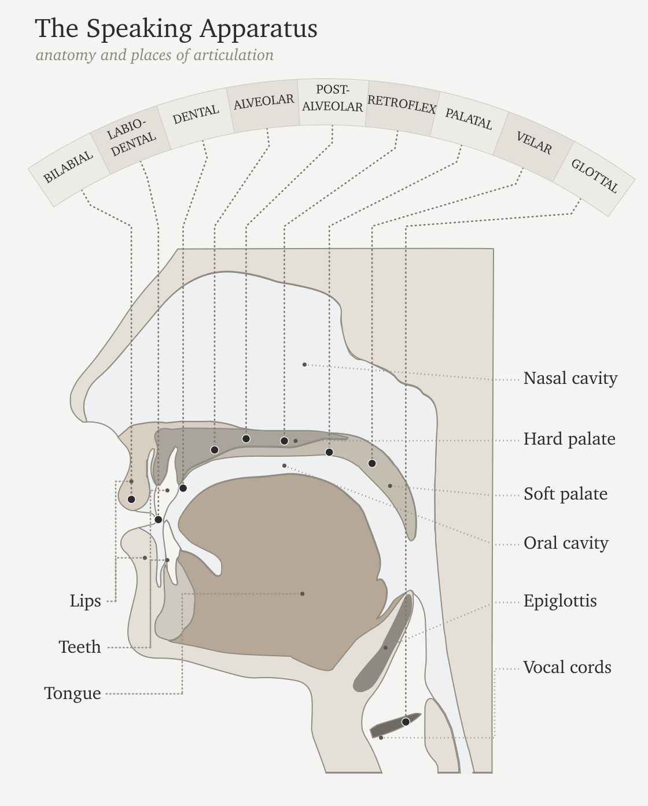
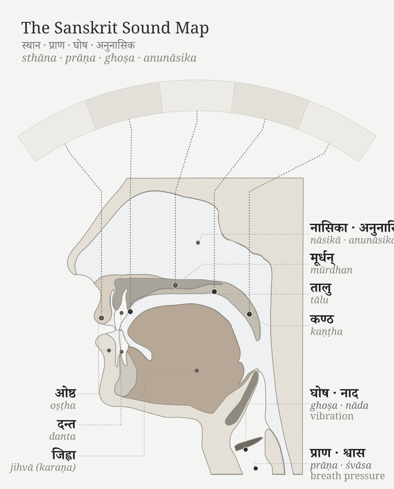

# Chapter 7 — ॐ (Oṃ): The Anatomy of Sound

::: epigraph

> ओमित्येतदक्षरमुद्गीथमुपासीत ।
>
> *om ity etad akṣaram udgītham upāsīta |*
>
> Contemplate this syllable Oṃ as the *udgītha*, the sung chant.
>
> `\hfill`{=latex}*— Chāndogya Upaniṣad 1.1.1*[NOTE: om-vocal-tract-macro-gesture]

:::

\bigskip

A single syllable, held on a single breath: **ॐ (*Oṃ*)**.

The lungs provide steady pressure. The vocal cords meet, vibrate, and hold a tone. The mouth opens; the tongue rests low; the soft palate seals the nasal passage. From glottis to lips, the vocal tract becomes one resonating chamber, and the sound that fills it is **अ (*a*)** — the **कण्ठ्य (*kaṇṭhya*)** vowel, open in the throat, the body's least obstructed tone.

Then the instrument begins to shape itself: the tongue lifts in small increments and the lips round while the same breath and voicing continue. Because the chamber changes around the tone, **अ (*a*)** moves toward **उ (*u*)** without a break. The closest musical analogy is a *meend*, but the glide here is in vowel color rather than pitch: the fundamental may hold steady while the resonance changes. In speech-science terms, the vocal cords supply the source and the vocal tract supplies the filter; as the filter changes shape, the heard vowel changes with it.

Then the lips close and the soft palate drops, shutting the oral passage and opening the nasal one. Breath and voicing continue, but the new path moves the resonance into the nasal cavity as **म् (*m*)**. The sound hums rather than bursts, then fades.

One breath. Three sonic spaces: throat-open, mouth-shaped, nose-coupled. Lungs, vocal cords, tongue, lips, soft palate, oral cavity, and nasal cavity all participate. **Oṃ is a compact acoustic sweep through the anatomy of sound.**

Concision by design leaves recognizable signs: small form, no waste, clear transitions, concentrated meaning, many-facing use, and stable identity across time. Oṃ contains all six in a single breath. **Oṃ is architecture in seed form.**

The śāstra makes the same compression explicit. The *Māṇḍūkya Upaniṣad* identifies this *akṣara* with "all this": past, present, future, and what stands beyond the three times.[NOTE: om-vocal-tract-macro-gesture] *Sanātan* captures what persists across time, not simple antiquity. Oṃ is the acoustic seed of *Sanātan*: one syllable, one breath, the whole instrument, and the whole span of time.

## 7.1 आदिवाद्य (*Ādivādya*): The World's First Instrument

The human mouth is the world's first musical instrument.

Every language uses the same physical apparatus. The lungs supply air. The vocal cords turn air into tone. The throat, mouth, and nose shape that tone into speech. English, Arabic, Mandarin, Hawaiian, Xhosa, Vietnamese, and Sanskrit all begin from the same instrument. The selections differ. The instrument is one.

The Indian classical disciplines describe the voice as the original instrument. The following analogies help explain how that instrument produces different kinds of sound. A tabla resembles the consonant-event: a hand strikes the drumhead as the tongue strikes an articulating surface. A bansuri makes the vowel easier to picture as breath moving through a shaped resonant tube. A sarangi recalls the vibrating source and sympathetic resonance of the voice. The voice unites striking, breath, vibration, and resonance within one human instrument.[NOTE: adi-vadya-voice-as-original-instrument]

A claim about Sanskrit's sound architecture must begin with the physical instrument that produces sound; only then can the chapter examine the Sanskrit vocabulary that maps that instrument.

## 7.2 The Vocal Apparatus

The vocal tract is a variable wind instrument built into the body. The lungs are the bellows. The larynx houses the vocal cords. The pharynx, oral cavity, and nasal cavity form the resonating chambers. The soft palate opens or closes the nasal resonator. The tongue, lips, and jaw reshape the oral cavity continuously.

The tongue is the most complex moving part: tip, blade, body, and base. Above it sit the upper teeth, the alveolar ridge, the hard palate, the soft palate, and the uvula. The lips stand at the front and the throat at the back. Vocal tracts vary with age and body, but the same parts and operations recur.[NOTE: vocal-tract-cm-modeling]

{#fig:adivadya-vocal-tract-anatomy width=100%}

The anatomy makes the instrument analogy concrete. A clarinet has one reed and a fixed bore. The voice has variable vocal cords, a continuously reshaped bore, and a valve that couples or decouples a parallel nasal resonator. The voice contains reed, bore, valves, resonators, and articulators in one living system — every constructed wind instrument approximates one of them.

## 7.3 Consonants Are Events

Think of a consonant as an event of contact or near-contact. Two articulatory axes describe that event:
 1. **Place:** *Where* does the mouth make contact?
 2. **Manner:** *How* is the breath managed?

The sound's values along these axes are its **articulatory coordinates**. They describe how the body produces the sound; they do not assign the sound a position in a language's inventory.
 
Words like *stop*, *fricative*, and *nasal* describe these different manners. When you make a "stop," you block the airflow completely. When you make a "fricative," you squeeze the air through a tight gap to create friction. When you make a "nasal," you route the breath entirely through the nose. These specific manners turn a physical touch into a spoken syllable.

Some part of the anatomy moves toward another part. The active articulator is usually the tongue or lower lip. The passive articulator may be the upper lip, teeth, alveolar ridge, hard palate, soft palate, uvula, pharynx, or glottis. Where the contact happens gives the sound its place: bilabial, dental, alveolar, retroflex, palatal, velar, uvular, pharyngeal, glottal.

How the contact happens gives the sound its manner. A stop closes the passage and releases it. A fricative narrows the passage until turbulence appears. A nasal closes the mouth while opening the nose. An approximant comes close without producing turbulence. An affricate begins as a stop and releases as a fricative. Voicing and aspiration complete the profile: do the vocal cords vibrate, and how forcefully is breath released? English *p* at the start of *pin* releases with an audible puff; the same *p* in *spin* releases less. Some languages use that difference systematically; English leaves it contextual.

Languages select differently from the instrument's range. English clusters many sounds toward the front and middle of the mouth. Arabic reaches into the pharynx. Mandarin uses retroflex sounds. French uses a uvular *r*. Southern African click languages add suction mechanisms no European language uses systematically.

Most consonants are controlled bursts — which is why the tabla analogy works. The hand striking the drumhead is an event of contact; the tongue striking the palate is the same. Tabla *bols* are spoken before they are played because the drum is taught from the mouth. The mouth is the source.[NOTE: tabla-bols-mouth-to-drum]

## 7.4 Vowels Are Sustained Tones

A vowel begins when the vocal cords supply a tone and the vocal tract stays open enough for that tone to continue. The tongue, lips, jaw, and nasal passage shape the resonance, and the sound lasts for as long as the speaker maintains that configuration. Unlike a stop consonant, the vowel does not depend on a complete closure and release.

Three parameters do most of the work: tongue height, tongue advancement, and lip rounding. High front unrounded gives the *ee* of *see*. High back rounded gives the *oo* of *moon*. Low open position gives the *ah* of *father*. Nasalization couples the nasal cavity. Length controls duration; Sanskrit makes that duration countable through **मात्रा (*mātrā*)**, the unit that records how long a sound occupies speech-time.[NOTE: hrasva-dirgha-pluta-matra] Tone adds pitch contour.

Languages select from this space differently. Spanish uses a clean five-vowel system. English uses a larger and messier vowel inventory. French adds nasal vowels. Mandarin layers tone on top of vowel quality.

The bansuri gives the clearest analogy: breath through a shaped resonant tube, with the effective geometry changing the tone. The sarangi gives another: a vibrating source with sympathetic resonance. The vocal cords vibrate; the oral and nasal cavities shape and amplify; the speaker holds the resonance in the mouth.[NOTE: sarangi-closest-to-human-voice]

The sitar sits between the two. Each pluck is a discrete attack — like a consonant event. The string then sustains and decays — like a vowel. Speech alternates between attacks and sustains the same way.

Because consonants are discrete events and vowels are sustained tones, human speech constantly alternates between attack and resonance.

## 7.5 Every Language Is a Selection

The human vocal apparatus has more capacity than any one language uses. It offers many contact points, many manners of contact, voicing, aspiration, nasalization, length, rounding, tone, and phonation types. No language selects every possible capacity of the instrument.

Every language is a selection.

English chooses one inventory. Arabic chooses another. Mandarin another. Hawaiian another. The click languages another. What makes a language sound like itself is its selection from the shared instrument. Each selection has internal coherence, even though no two languages select exactly the same way.

The inventory atlas identifies which sounds each language selects. The data source is a set of published consonant inventories coded onto one mouth-map. The atlas reduces each language to the consonants it keeps available as distinct sounds; then it assigns each consonant to its main place of articulation on a twelve-region axis running from lips to glottis: bilabial, labiodental, interdental, dental, alveolar, post-alveolar, retroflex, palatal, velar, uvular, pharyngeal, glottal.[NOTE: language-hotzones-inventory-method]

For this first view, the chart collapses four inventories into hotzones instead of showing every consonant as a separate point. The area of each cloud is proportional to how many consonants that language selects from that region. English, Arabic, Mandarin, and Zulu serve as four load cases for the same instrument: English clusters toward the front and middle of the mouth; Arabic reaches deep into the throat; Mandarin concentrates around coronal and palatal regions; Zulu shows a different southern African selection that includes click mechanisms.

To read the chart, connect the labels to sounds you know. The **f** in English *fall* is labiodental: the lower lip touches the upper teeth. The **sh** in *should* is post-alveolar: the tongue blade shapes the flow just behind the alveolar ridge. In the Arabic panel, look farther back. **ق (*qāf*)** sits in the uvular column; **ح (*ḥāʾ*)** and **ع (*ʿayn*)** sit in the pharyngeal column. Among these four panels, Arabic alone occupies that deep region of the throat.

Treat the figure as an inventory map, not a frequency chart. It shows what a language makes available in its sound-system, not how often speakers use each sound.

{#fig:adivadya-language-hotzones width=100%}

English scientific disciplines have built a rigorous vocabulary for this architecture: bilabial, dental, alveolar, voiced, voiceless, aspirated, nasal, oral. The Sanskrit disciplines built another. Same instrument. Different naming system.

## 7.6 The Sanskrit Map

The same Indic classificatory discipline that named constructed instruments — **तत (*tata*)** for string, **सुषिर (*suṣira*)** for wind, **अवनद्ध (*avanaddha*)** for membrane, **घन (*ghana*)** for solid — also mapped the original instrument. It mapped where sounds are made, what moves to make them, how breath behaves, whether the vocal cords vibrate, and whether the nasal cavity opens. The result is a multi-axis classification of the speaking apparatus documented in the *Prātiśākhya* and *Śikṣā* disciplines of the *Vedāṅga*.[NOTE: nadyashastra-four-instrument-taxonomy][NOTE: allen-1953-phonetics-ancient-india]

{#fig:adivadya-vocal-apparatus-sanskrit width=100%}

The Sanskrit account begins with **स्थान (*sthāna*)**—place—where each *sthāna* name derives from the anatomy via a single, consistent pattern. The lip, *oṣṭha* (ओष्ठ), gives **ओष्ठ्य (*oṣṭhya*)** (of the lips); the tooth, *danta* (दन्त), gives **दन्त्य (*dantya*)** (of the teeth); the crown of the palate, *mūrdhan* (मूर्धन्, *head*), gives **मूर्धन्य (*mūrdhanya*)** (of the crown); the palate, *tālu* (तालु), gives **तालव्य (*tālavya*)** (of the palate); and the throat, *kaṇṭha* (कण्ठ), gives **कण्ठ्य (*kaṇṭhya*)** (of the throat). Ultimately, these are five precise places named from anatomy by exactly one derivational pattern.

The five named *sthāna* are a specific selection from the possible places of contact. The interdental position between the upper and lower teeth, where English makes *th*, sits between *oṣṭhya* and *dantya* and receives no separate Sanskrit station. The deep pharyngeal region where Arabic makes ع and ح sits behind *kaṇṭhya* and remains outside the system. The question now passes to the subcontinental sound-field: are those five places already active before Sanskrit makes them exact?[NOTE: place-of-articulation-sanskrit-terms]

Alongside *sthāna* is **करण (*karaṇa*)** — the active articulator, the part that moves to make contact. The tongue is the principal *karaṇa*; the lower lip is the *karaṇa* for labial sounds. *Sthāna* is where contact occurs. *Karaṇa* is what moves to make it.[NOTE: karana-active-articulator]

Three further systems complete the sound, with each acting as a precise binary switch. **प्राण (*prāṇa*)** manages the breath-pressure from the lungs, toggling between light (*alpaprāṇa*) and heavy (*mahāprāṇa*); **घोष (*ghoṣa*)** controls the vocal cords, leaving them silent (*aghoṣa*) or vibrating (*ghoṣa*); and finally, **अनुनासिक (*anunāsika*)** manages nasal coupling, dropping the soft palate to open the nasal cavity or raising it to close it.

Each term designates a physical operation. The vocabulary maps directly onto physiology.

## 7.7 Categories of Sound

The Sanskrit system classifies sound through contact.

Every sound requires a specific degree of contact. The mouth might clamp shut entirely, touch lightly, constrict the airflow, or make no contact at all. The śāstric terms mark these levels with absolute precision. **स्पृष्ट (*spṛṣṭa*)** means fully touched. **ईषत्स्पृष्ट (*īṣat-spṛṣṭa*)** means lightly touched. **ईषत्संवृत (*īṣat-saṃvṛta*)** means lightly closed, constricting the air without full contact. Finally, **अस्पृष्ट (*aspṛṣṭa*)** means entirely untouched.[NOTE: sprista-isatsprista-isatsamvrta-vivrta-constriction]

From those contact-types arise four major sound classes.

**Sparśa** (स्पर्श) means contact. These are full-contact consonants: stops, or plosives. The tabla approximates *sparśa* because both are controlled contact-events.

**Swara** (स्वर) means sustained tone. These are open sounds: vowels. The bansuri approximates *swara* because both are breath through shaped resonance.

**Antaḥstha** (अन्तःस्थ) means in-between. These are semivowels or approximants: lighter contact, between consonant-event and vowel-tone.

**Ūṣman** (ऊष्मन्) means heat or hot breath. These are fricatives and sibilants: narrowed airflow producing turbulence.

The categories are physiology in Sanskrit vocabulary.

## 7.8 *Sthāna*, *Prayatna*, and *Mātrā*

The Sanskrit sound-system rests on three governing questions: **स्थान (*sthāna*)**, where the sound is made; **प्रयत्न (*prayatna*)**, how the body makes it; and **मात्रा (*mātrā*)**, how long the sound lasts.

*Sthāna* is geometry. It sets where the airflow is shaped. Moving the contact point from throat to palate to teeth changes the resonating cavity and therefore the acoustic signature.

In modern phonetics, *sthāna* corresponds closely to place of articulation. *Prayatna* corresponds broadly to manner and effort, but it encompasses more than the English word *manner*: contact-type, voicing, aspiration, breath-pressure, and nasal coupling all belong to what the body does at the chosen place.

*Prayatna* is the effort applied to the mouth's geometry. It splits into internal and external effort. **आभ्यन्तर प्रयत्न (*ābhyantara prayatna*)** is the internal effort: the specific degree of contact or constriction at the physical place. **बाह्य प्रयत्न (*bāhya prayatna*)** is the external effort — it manages the final output: voicing (***अनुप्रदान (*anupradāna*)***, which toggles between *śvāsa* breath and *nāda* resonance), aspiration, breath pressure, and nasal coupling.[NOTE: abhyantara-bahya-prayatna][NOTE: svasa-nada-vivrta-samvrta-phonation]

The full classification runs on multiple axes. It measures exactly where the sound is made, what moves to make it, and how the breath and vocal cords behave.

Consider the sound **घ (*gh*)** that is placed in the throat (*kaṇṭhya*). The root of the tongue moves to strike it (*karaṇa*). The vocal cords are buzzing (*ghoṣa*), and a heavy push of breath drives it (*mahāprāṇa*). The nose remains sealed during all of this.

Because flipping just one switch instantly changes the output, turning off the voicing makes *gh* become *kh*, turning down the breath makes it become *g*, and opening the nose makes it become *ṅ*. Therefore, since every sound sits at its own specific, engineered address, the *varṇamālā* serves as the comprehensive map of all those addresses.

Modern phonetics breaks down speech using its own labels: place, manner, voicing, aspiration, nasalization, and duration. The goal is to analyze the sounds that already exist in a language. Sanskrit maps the phonetic grid using *sthāna*, *karaṇa*, *prayatna*, *prāṇa*, *ghoṣa*, *anunāsika*, *anupradāna*, and *mātrā*. But Sanskrit's purpose is different. It is not merely engaged in anatomical analysis of what the mouth happens to do. It is describing the structural architecture the civilization engineered for the language.

The opening syllable can now be heard anatomically. **ॐ (*oṃ*)**, unfolded as **अ-उ-म् (*a-u-m*)**, uses the same bodily systems the *varṇamālā* organizes: breath from the lungs, vibration at the vocal cords, resonance in the oral cavity, shaping and closure at the lips, and nasal coupling at the end. *Oṃ* compresses the entire vocal instrument into one syllable.[NOTE: om-vocal-tract-macro-gesture]
 
