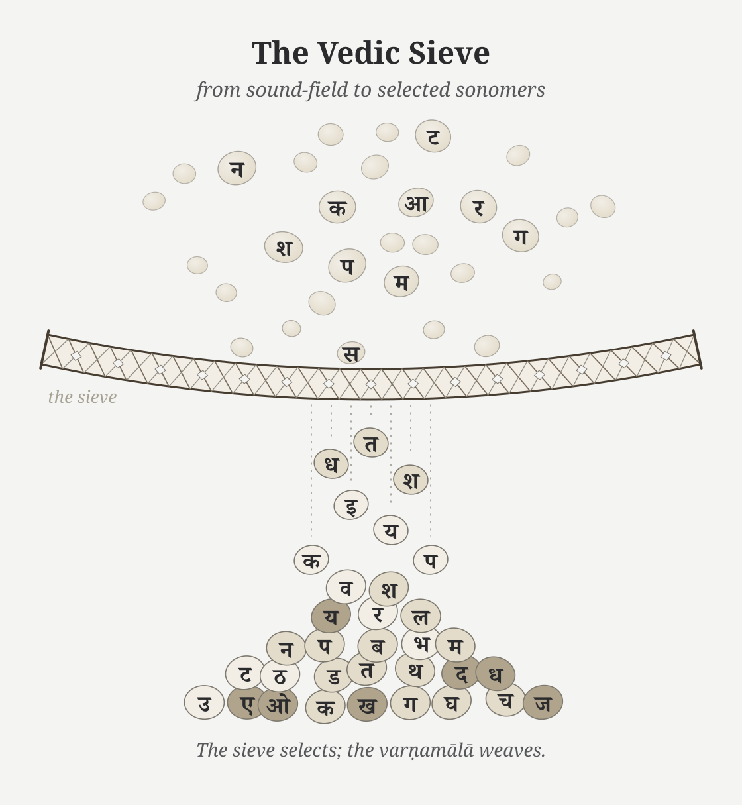
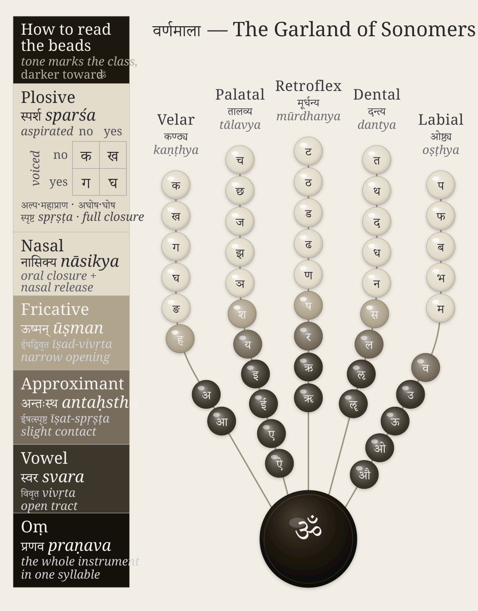
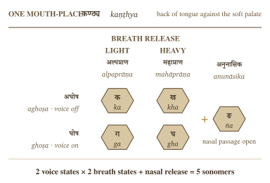

# Chapter 9 — The Varṇamālā: The Sonomeric Grid

::: epigraph

> सक्तुमिव तितउना पुनन्तो यत्र धीरा मनसा वाचमक्रत ।\
> अत्रा सखायः सख्यानि जानते भद्रैषां लक्ष्मीर्निहिताधि वाचि ॥
>
> *saktum iva titaunā punanto yatra dhīrā manasā vācam akrata |*\
> *atrā sakhāyaḥ sakhyāni jānate bhadraiṣāṃ lakṣmīr nihitādhi vāci ||*
>
> Like grain through a sieve, the wise refined Speech with the mind and formed her. There friends recognize friendship; auspicious radiance is placed in Speech.
>
> `\hfill`{=latex}*— Ṛgveda 10.71.2*[NOTE: rigveda-10-71-2-sieve-vak]

:::

\bigskip

---

## 9.1 The Garland Becomes a Grid

The previous chapter surveyed the subcontinental sound-field: mouth-zones, the retroflex band, contact sounds, nasals, sibilant neighborhoods, and breath possibilities. Sanskrit curates those sounds into an **inventory**: a selected set of sonomers the language treats as stable sound-units, gives addresses to, teaches, preserves, and uses in grammar.

The Vedic mantra provides the imagery of abundant sound and a sieve that curates. The wise refined raw sound, selected usable sound-particles, and formed **वाक् (*Vāk*)** with the mind. **अक्रत (*akrata*)** is a finite plural verb from the dhātu ⟪कृ⟫ (*kṛ*): the wise *formed* Speech. The movement is direct: sound-field becomes *varṇamālā*.

The second half adds radiance. Friends recognize friendship in that formed Speech. In separated form, the final pāda says **भद्रा एषां लक्ष्मीः (*bhadrā eṣāṃ lakṣmīḥ*)** is placed **अधि वाचि (*adhi vāci*)** — in Speech: auspicious radiance, the beauty that makes order visible. This is the **दिव्यता (*divyatā*)** layer. The verse moves from engineering to radiance.

{#fig:ch9-vedic-sieve-sonomer-garland width=100%}

Pyramids and hilltop cities announce power through height, mass, and command. Hindu sacred architecture often works through another instinct. Its aim is **दिव्यता (*divyatā*)** — radiance, presence, light — more than **भव्यता (*bhavyatā*)**, sheer grandness. The *garbhagṛha* is a perfect example: a small, concentrated chamber where darkness, lamp, threshold, axis, and मूर्ति (mūrti) create presence. The engineering becomes poetic force.

The curated heap then becomes ordered form. Sanskrit's own name for the selected sound-inventory is **वर्णमाला (*varṇamālā*)** — the garland of *varṇas*. 
{#fig:ch9-sonomer-garland width=100%}

The figure is my modern rendering. The arrangement by place and effort is ancient, and the name varṇamālā already calls the inventory a garland; what I have not found is an earlier rendering that draws that garland as an articulatory mouth-map, each bead set at its own grid address. I did not invent the order. I saw the visual form while meditating on the architecture itself, in a state of sustained hyperfocus where the sounds had become positions, weights, colors, and paths — where engineering collided with poetic beauty. That seeing was Vāk’s gift, as is the ability to write this book. When the sounds are visualized through Sanskrit’s own vocabulary, they arrange themselves as what the name already says: a garland of chosen beads, woven for Vāk herself to wear. I offer it to her, strung. The poetry of the माला (mālā) integrates the engineering into beauty.

The word is poetic and precise. A garland differs from a heap of sonomers that the sieve has filtered. Each bead is chosen, shaped, placed, and strung in an order that can be memorized. The *varṇamālā* does the same with sound. It is the quintessence of **दिव्यता (*divyatā*)**: engineering made radiant.

The word garland is meaningful because it preserves Sanskrit's own way of viewing this sound-inventory. These are measured sound-particles before they become "letters": **sonomers**. A sonomer is what Sanskrit calls a *varṇa*: a selected, measured, repeatable unit of sound.

Once Sanskrit has selected stable, teachable, body-mapped sound-units, its internal disciplines can ask whether each measured particle has **वर्णशक्ति (*varṇa-śakti*)** — semantic potency inside a calibrated system. The grid gives that question a physical and teachable basis instead of leaving *varṇa-śakti* as an unexplained claim about sound.

> **Sonomers: The Pre-Pāṇinian Sound-Units**
>
> Vedic phonetic disciplines already treat Speech as distinguishable sound-units measured through *svara*, *mātrā*, force, continuity, and recitational joining. The ordered inventory later called the *varṇamālā* operates within that system.
>
> The Hindu continuum remembers the Māheśvara-sūtras as the sounds of Śiva's drum, received by Pāṇini. Those sūtras arrange an already operating inventory into a compact grammatical index. Pāṇini did not create the *varṇāḥ*; his analysis depends on the sonomeric architecture that the sūtras index.[NOTE: pre-panini-pratisakhya-classification]

The figures in this book use grids and hexagons. That is a translation for readers trained by engineering drawings, chemistry diagrams, and coordinate systems. A wiser age would hear *varṇamālā* and understand that the "beads" are selected sounds. Because the architecture has been hidden for too long, a second visual language becomes necessary: grids for addresses, hexagons for stable units, and matrices for repeated structure.

The two views are the same object. In Sanskrit's own language, the sound-inventory is a garland. In engineering language, it is a grid or matrix.

## 9.2 The Four Divisions

The *varṇamālā* is organized into four working divisions. Each division is a role in assembly:

1. **स्वराः (*svarāḥ*)** — the vowels. Each supplies the resonant center of the *akṣara*, the nucleus.
2. **स्पर्शाः (*sparśāḥ*)** — the contact sounds, the stops and nasals of the five-by-five matrix. Stops build hard contact; nasals couple the oral and nasal cavities.
3. **अन्तःस्थाः (*antaḥsthāḥ*)** — the between-standing sounds य र ल व. Each moves between vowel and consonant behavior.
4. **ऊष्माणः (*ūṣmāṇaḥ*)** — the heat or friction sounds श ष स ह. Each sustains friction and breath.

The *ayogavāha* sounds sit at the boundary: **अनुस्वार (*anusvāra*)**, **विसर्ग (*visarga*)**, and related breath or nasal release forms recognized by the *Prātiśākhya* discipline.[NOTE: ayogavaha-category-pratisakhya] The *visarga* releases breath after the vowel; the *anusvāra* points nasal resonance into the next contact.[NOTE: visarga-anusvara-articulation]

Sanskrit already uses the language of the body. Five parameters specify a sound, and each puts one physical question to the mouth.

**स्थान (*sthāna*)** fixes the place — where along the vocal tract the constriction forms. **प्रयत्न (*prayatna*)** sets the effort — the manner of the constriction, full contact or partial. **घोष (*ghoṣa*)** switches the voice — whether the vocal cords vibrate during the sound. **प्राण (*prāṇa*)** controls the breath-pressure from the lungs, toggling between light and heavy release. **अनुनासिक (*anunāsika*)** opens the nasal passage — whether resonance couples into the nose.

Modern speech science uses different labels for the same five questions.[NOTE: place-of-articulation-sanskrit-terms]

Sanskrit's old terminology still feels modern because it captures the operating conditions that produce sounds rather than labeling them by alphabetic habit.

## 9.3 Every Sound Has an Address

The sounds first appear in zones. Tamil, Toda, and Kurukh together light 20 of the 23 Sanskrit base cells. Korku, Mundari, and Ho light 18 of 23.[NOTE: inventory-atlas-coverage-surveys] The remaining gaps are mostly near-neighbors: laterals, sibilants, and precise placements inside active mouth-zones.

The next step is the snap to grid. The mouth remains continuous; the inventory becomes discrete. A sound's articulatory coordinates describe where and how the body produces it. Sanskrit selects particular combinations and assigns each selected consonant a stable grid address. Together, these addresses form Sanskrit's ***व्यञ्जन (*vyañjana*) address grid*** and make the selected sounds teachable, repeatable, and stable.

{#fig:ch9-sanskrit-extracted-sonomer-grid width=100%}

The Sanskrit-only extraction lets the architecture reveal itself.[NOTE: varnamala-comparative-sound-inventories] The selected sounds occupy a disciplined pattern across the vocal tract.

> **The Aramaic-from-Brāhmī Thesis**
>
> The figure above is not a picture of Devanāgarī. It is the sound architecture that Indic scripts serve. A visible symbol may travel. A stroke may be borrowed. A script may absorb graphic influence. But line-shape resemblance cannot explain the sonomeric grid underneath the script. The proposed source must explain the architecture it supposedly produced.
>
> Appendix Part 3 §3.5 applies this burden test to Brāhmī and Aramaic. An earlier symbol can suggest contact; it cannot explain a sound-grid it does not contain. Shape is not structure. Chronology is not causation.

One axis of the address grid records the place of articulation: velar, palatal, retroflex, dental, and labial. Sanskrit labels them:

| Place | Sanskrit term | Body location |
|---|---|---|
| Velar / throat-back | **कण्ठ्य (*kaṇṭhya*)** | back of tongue against the soft-palate region |
| Palatal | **तालव्य (*tālavya*)** | tongue body toward the hard palate |
| Retroflex | **मूर्धन्य (*mūrdhanya*)** | curled tongue-tip toward the palate ridge |
| Dental | **दन्त्य (*dantya*)** | tongue against the teeth |
| Labial | **ओष्ठ्य (*oṣṭhya*)** | lips |

The order moves through the instrument. The back of the mouth opens the series. The lips close it. The retroflex band sits inside the subcontinental sound-field with unusual force.[NOTE: retroflex-global-distribution] That row later becomes a major piece of evidence against the racial Arya thesis.

Sanskrit turns these places into the horizontal axis of the grid.

## 9.4 The Control Panel

The *sparśa* matrix makes the grid visible.

Five places run horizontally. Five operating modes run vertically. Every cell is filled:

|  | Velar | Palatal | Retroflex | Dental | Labial |
|---|---|---|---|---|---|
| Voiceless, light breath | क | च | ट | त | प |
| Voiceless, heavy breath | ख | छ | ठ | थ | फ |
| Voiced, light breath | ग | ज | ड | द | ब |
| Voiced, heavy breath | घ | झ | ढ | ध | भ |
| Nasal | ङ | ञ | ण | न | म |

Students often learn this as a school table. Structurally, it functions as a control panel for the mouth.

{#fig:ch9-control-panel width=100%}

The columns show where contact happens. The rows show how the contact is operated. The first and second rows are voiceless: the vocal cords remain still during the stop. The third and fourth rows are voiced: the vocal cords vibrate. The light-breath rows release less breath. The heavy-breath rows release more. The fifth row opens the nasal passage.

That is a four-control design:

1. **Mouth-place** chooses the station.
2. **Vocal-cord vibration** chooses voiced or voiceless.
3. **Breath pressure** chooses light or heavy release.
4. **Nasal coupling** opens the nasal passage.

The design is compact. Five places become twenty-five contact sonomers without crowding the place-axis. Sanskrit gets twenty-five stops and nasals from five stations multiplied by independent physical controls.

This is sound engineering.

The control-panel view also explains why the grid is easier to preserve than a loose sound-list. Each sound has an address. If a child, student, reciter, or regional speaker drifts, the correction is architectural. The teacher can point to the place, the breath, the voice, or the nasal channel. The architecture tells the body what to do.

## 9.5 Breath as an Axis

The ten *mahāprāṇa* stop cells now return to the grid. They were set aside to test the base inventory; now they re-enter along a designed breath axis.

The ten heavy-breath stops are:

> ख छ ठ थ फ
> घ झ ढ ध भ

They are Sanskrit's vertical expansion of the contact grid. The base places were already available across the region. Sanskrit adds a breath-pressure layer and makes the contrast structural.

English gives an easy comparison. In **pin**, the **p** often releases a small puff of breath. In **spin**, that puff usually disappears. English speakers can produce the difference, but English leaves the breath contextual. Sanskrit makes breath an independent axis: **प (*pa*)** and **फ (*pha*)** receive different grid addresses and function as independent word-making sonomers.

The same is visible in everyday English compounds. Speakers can feel a burst of breath across **backhand**, **blockhead**, **crackhead**, **pighead**, **bighead**, **hitchhike**, **hedgehog**, **pothole**, **foghorn**, **like hell**, **hip-hop**, and **Grubhub**. The body can do it. Sanskrit builds a full grid from it.

Mahāprāṇa is a structural feature, and it displays the design requirement the whole grid serves: distinguishability. The new contrasts arrive on an independent axis — breath — instead of crowding the place axis. The system keeps five clean stations. The result is more range with less horizontal clutter.

Sanskrit's treatment of *visarga* also expresses its wider discipline of breath. Recitation trains *prāṇa*, sound gives that breath audible form, and grammatical rules specify how its release changes at a boundary.[NOTE: mishra-breath-pedagogy]

The breath-axis continues beyond the stop matrix into boundary sounds. The most familiar are **अनुस्वार (*anusvāra*)** and **विसर्ग (*visarga*)**. The *anusvāra* indicates nasal resonance that points toward the following sound. In careful analysis, it is a shorthand for nasal behavior specified by the next contact. The *visarga* is a release of breath after a vowel, often shaped by what follows.[NOTE: sandhi-anusvara-assimilation]

These sounds sit at the edge of ordinary combination. The old category name **अयोगवाह (*ayogavāha*)** captures the idea: that which bears without joining in the ordinary way.

A word such as **सिन्धुः (*sindhuḥ*)** ends with a breath-release sonomer. The sound is part of the architecture, and later language reflections have to account for its behavior.[NOTE: visarga-cognate-shadow]

The boundary sounds show the same discipline as the matrix. Sanskrit labels them, trains them, and gives them rules.

## 9.6 Nuclei, Contacts, and Timing

The selected sonomer becomes stable when it is formed as an **अक्षरम् (*akṣaram*)**.

Because the word *akṣara* actively means the imperishable and the non-decaying, it makes a substantial claim. Within the language system, this means it serves as the stable sound-unit that can be rigorously recited, written, counted, and recombined.[NOTE: aksara-imperishable-name]

A **sonomer** is the measured sound-particle, whereas an **audiograph** is the visible mark that records it. Sanskrit therefore remains sonomeric before it becomes audiographic: the sound architecture exists before a script gives its particles visible form.

An *akṣara* is vowel-centered. One vowel nucleus centers the unit. Consonants can open around it, close around it, or cluster at its edges, but the vowel supplies the acoustic center. Thus **पच् (*pac*)** is one *akṣara*, while **पचति (*pacati*)** has three.

The *varṇamālā* is spatial and temporal. The spatial grid tells the body where and how to make contact. The timing grid tells the reciter how long the sound lasts. The unit of duration is the **मात्रा (*mātrā*)**.

| Sonomer type | Sanskrit term | Duration | Role |
|---|---|---:|---|
| Consonant | **व्यञ्जनम् (*vyañjanam*)** | 1/2 *mātrā* | contact, edge, bond |
| Short vowel | **ह्रस्व स्वर (*hrasva svara*)** | 1 *mātrā* | ordinary nucleus |
| Long vowel | **दीर्घ स्वर (*dīrgha svara*)** | 2 *mātrās* | extended nucleus |
| Prolated vowel | **प्लुत स्वर (*pluta svara*)** | 3 *mātrās* | prolonged recitational form |

Sanskrit measures the duration of every sound through the *mātrā*, and Vedic recitation preserves that timing exactly.[NOTE: hrasva-dirgha-pluta-matra]

The Vedas also preserve an ingeniously mathematical, highly rigorous, and deterministic pitch system: **उदात्त (*udātta*)**, **अनुदात्त (*anudātta*)**, and **स्वरित (*svarita*)**.[NOTE: vedic-svara-system] Given the complete word formation, syntax, sentence position, and applicable Vedic rules, the required pitch pattern follows systematically. Duration measures how long a sound-particle lasts. Pitch adds an audible interpretive layer. Its placement follows grammatical rules involving words, affixes, verbal forms, sentence position, and syntax, so a listener can hear distinctions that disappear when the same passage is recited or printed without its *svara*.

The visible script belongs to *lipi*. The deeper structure belongs to sound. Appendix Part 3 develops the script argument in full: Indic writing is audiographic because it makes the sonomer visible. Sanskrit first selects the sonomer; then the script visually represents that sound.

## 9.7 The Svara Address Grid

The *vyañjana* address grid assigns consonants positions across place and manner. The ***स्वर (*svara*) address grid*** uses vowel family, duration, pitch, and nasality as its axes.

Most students first meet the Sanskrit vowels as a row of fourteen written forms:

> **अ आ इ ई उ ऊ ऋ ॠ ऌ ॡ ए ऐ ओ औ**

That row is useful for learning a script and building a *bārahkhaḍī*, but it does not reveal the complete sound architecture. Sanskrit's internal analysis begins with nine ***स्वर-वर्णाः (*svara-varṇāḥ*)***, or vowel families:

> **अ इ उ ऋ ऌ ए ऐ ओ औ**

Within the first four families, duration produces a regular relation. **अ/आ, इ/ई, उ/ऊ,** and **ऋ/ॠ** are the one-*mātrā* and two-*mātrā* members of their respective families. The **ऌ** family has a one-*mātrā* form and allows *pluta* under the wider analytical system, but it has no regularly used two-*mātrā* member. The written **ॡ** completes some teaching rows, yet no ordinary Vedic passage or *laukika* word using it has been found. The remaining four families, **ए, ऐ, ओ,** and **औ**, use two *mātrās* in the general Sanskrit inventory and can also be prolonged as *pluta*.

| Svara family | One *mātrā* | Two *mātrās* | Three *mātrās* |
|---|---:|---:|---:|
| **अ** | अ | आ | अ३ · Restricted |
| **इ** | इ | ई | इ३ · Restricted |
| **उ** | उ | ऊ | उ३ · Restricted |
| **ऋ** | ऋ | ॠ | ऋ३ · Restricted |
| **ऌ** | ऌ | ॡ · Excluded | ऌ३ · Restricted |
| **ए** | half-ए · Lineage-Bounded | ए | ए३ · Restricted |
| **ऐ** | Excluded | ऐ | ऐ३ · Restricted |
| **ओ** | half-ओ · Lineage-Bounded | ओ | ओ३ · Restricted |
| **औ** | Excluded | औ | औ३ · Restricted |

The numeral **३** tells the reciter to sustain the vowel for three *mātrās*. Thus **ओ३** is **ओ** extended to three counts. These *pluta* forms are Restricted because Sanskrit uses the additional duration only under stated conditions; the notation does not create another vowel family.

The Lineage-Bounded half-**ए** and half-**ओ** require a different explanation. The Mahābhāṣya records them in the Sātyamugri and Rāṇāyanīya lineages of the Sāmaveda. The sounds were therefore known and preserved where those lineages required them, but Sanskrit did not give them reusable vowel addresses for new *laukika* composition.[NOTE: vedic-half-e-half-o]

## 9.8 Duration, Pitch, and Nasality

The nine families describe vowel identity. Sanskrit then analyzes how long the vowel lasts, how its pitch moves, and whether the sound passes through the nose. A vowel can bear ***उदात्त (*udātta*), अनुदात्त (*anudātta*),*** or ***स्वरित (*svarita*)*** pitch, and it can be oral or ***अनुनासिक (*anunāsika*)***. Each available duration therefore has six analytical forms:

> **3 pitch relations × 2 nasal states = 6**

The **अ, इ, उ,** and **ऋ** families each have three durations, giving eighteen forms per family. The **ऌ** family lacks the regular two-*mātrā* member, while **ए, ऐ, ओ,** and **औ** lack a generally reusable one-*mātrā* member. Each of those five families therefore has twelve:

> **4 × 18 + 5 × 12 = 132**

*Atomic Sanskrit* derives this total by bringing the inherited components into one matrix. The total maps the forms that Sanskrit's analysis can distinguish. Sanskrit does not have 132 written vowels, and the count does not imply that every combination occurs in a received Vedic passage. It shows that vowel identity, duration, pitch, and nasality remain separate. A single vowel family can therefore carry several kinds of audible information without requiring a new written symbol for each combination.[NOTE: svara-nine-families-132]

Figure 9.5 makes the calculation visible. Each principal square divides into an oral and a nasal half. A check marks a form selected by the architecture, while a cross marks an Excluded position.

{#fig:ch9-svara-form-matrix width=100%}

Pitch does not create the excluded duration positions in the table. It operates across the durations that a family already permits. A short vowel can bear *svarita*; a *svarita* does not need two *mātrās*. Similarly, *pluta* extends duration without becoming another vowel family. Ṛgveda 10.129.5 makes the distinction audible through **आसी३त् (*āsī3t*)**, where the numeral marks the three-*mātrā* duration selected by the passage.[NOTE: vedic-pluta-rv-10-129-5]

## 9.9 The Sound Volume

Once the consonant grid and the vowel durations are visible, the inventory opens into a volume.

The sound plane crosses five mouth stations with seven consonant rows, creating thirty-five possible grid addresses. Sanskrit assigns thirty-three of them to independent consonants: twenty-five *sparśa*, four *antaḥstha*, and four *ūṣman*. The remaining two addresses allow us to ask what sounds the mouth could produce there, and why Sanskrit gives those sounds a different architectural role.

The familiar fourteen-form teaching row supplies the third dimension of the formal classroom grid:

> 5 × 7 × 14 = 490 possible consonant-vowel addresses

Two unassigned consonant addresses extend through those fourteen written positions, leaving 462 formal consonant-vowel addresses. A *bārahkhaḍī*-style teaching row is one fiber of this volume unrolled for the classroom: क, का, कि, की, कु, कू, कृ, कॄ, कॢ, कॣ, के, कै, को, कौ. This is a map of the complete teaching surface, not a claim that all fourteen forms occur equally often or have the same operational status.

{#fig:ch9-sound-volume width=98%}

The figure makes the multiplication visible without making the argument mathematical. Sanskrit gives each selected part a place, a role, and a timed path through combination.

## 9.10 What Earns a Grid Address

### The Two Excluded Positions

Figure 9.6 contains two grid addresses that Sanskrit leaves unassigned in the independent *varṇamālā*. Both positions correspond to sounds that a human mouth can make. Why does Sanskrit exclude them?

The first unassigned address lies at the back of the mouth in the *antaḥstha* row. Modern phonetics writes the sound as **[ɰ]**, the voiced velar approximant. To approach it, begin with the voiced friction of **ग़ [ɣ]**, loosen the contact until the friction disappears, and keep the voice running. The resulting sound comes from the throat region, without the lip movement of English *w*. Sanskrit does not promote this consonant to a sonomer.

The second lies at the lips in the *ūṣman* row. Start with the **[f]** that begins the English words *phone*, *front*, and *fast*, made by bringing the lower lip toward the upper teeth. Then remove the teeth from that operation and continue the friction between the two lips: the result approaches **[ɸ]**, the voiceless bilabial fricative. Sanskrit does not promote this consonant to a sonomer either.

### The PASS Test for a Sonomer

For a sound to be promoted to a sonomer and assigned a grid address in the *varṇamālā*, it must satisfy these four requirements:

1. The mouth must produce it reliably.
2. It must support the complete vowel teaching series as stable, pronounceable *akṣaras*.
3. It must distinguish forms independently rather than arise only under a stated condition.
4. It must complete a recurring operation within Sanskrit's architecture.

Both candidates are pronounceable, and the mouth can place each before the complete teaching series. Formal pronounceability is only the beginning. The remaining tests establish whether those combinations remain distinguishable in repeated use and whether the candidate completes a recurring operation within Sanskrit.

These four tests apply a principle that appears throughout Sanskrit's architecture: the ***Principle of Architectural Selection and Scope (PASS)***. The analysis begins with **contribution**: what would the proposed sound, form, or operation add? It then examines **load**: what duplication, collision, or instability would accompany that addition? A fixed passage, a stated junction, pitch, or another part of the architecture may provide **bounding support** that contains the load. The final step identifies the appropriate **scope**. A resource may belong to the reusable architecture, operate only under a stated condition, belong to a stated Vedic scope, remain within a named Vedic lineage, or remain excluded from an independent grid address.[NOTE: pass-selection-scope-principle]

{#fig:ch9-pass-selection-and-scope width=100%}

### Why [ɰ] Stays Outside

Begin with **[ɰ]**. The four occupied grid addresses in the *antaḥstha* row arise from four visible relationships:

> **इ + अ → य — *i + a → ya***\
> **उ + अ → व — *u + a → va***\
> **ऋ + अ → र — *ṛ + a → ra***\
> **ऌ + अ → ल — *ḷ + a → la***

Approximate IPA equivalents make the movement easier to see:

> **[i] + [a] → [ja]**\
> **[u] + [a] → [ʋa]**\
> **[r̩] + [a] → [ra]**\
> **[l̩] + [a] → [la]**

In each pair, the first vowel moves from the center of a syllable into the consonantal gesture of the same articulatory family. A speaker can pronounce **इ + अ (*i + a*)** separately as **[i.a]**, but an eligible Sanskrit junction draws the sounds together as **य [ja]**. Ṛgveda 10.71.4 provides a familiar example: **अशृणोति + एनाम् (*aśṛṇoti + enām*)** becomes **अशृणोत्येनाम् (*aśṛṇoty enām*)**. Pāṇini later documented all four relationships in ***इको यणचि (*iko yaṇ aci*)***. Other rules preserve the separation where the transmitted form requires it, so the architecture controls both joining and hiatus.[NOTE: snap-to-grid-pragrihya-exception]

Modern phonetics associates **[ɰ]** with the close back unrounded vowel **[ɯ]**. Extending the four Sanskrit relationships would therefore require a fifth vowel and a fifth operation:

> **[ɯ] + [a] → [ɰa]**

Sanskrit has no **[ɯ]** vowel from which that movement could begin. Its *kaṇṭhya* vowel is **अ (*a*)**, and Sanskrit gives **अ** a distinctive treatment. In ordinary pronunciation, short **अ** is described as **संवृत (*saṃvṛta*)**, contracted, while **आ (*ā*)** is **विवृत (*vivṛta*)**, open. The inventory contains no separate long *saṃvṛta* vowel.

Neither excluded sound is imaginary. In ordinary Marathi pronunciation of **पोळपाट लाटणं**, the written **आ** in **पाट** and **लाट** lasts roughly one *mātrā*, producing the short open **[a]**. Hold the contracted **अ** for two *mātrās* — written here only as **अऽ** — and the other excluded sound, **[ɐː]**, becomes equally easy to hear. Sanskrit's architecture deliberately excludes both from its reusable vowel grid.

When two eligible instances of **अ** meet, the operation produces **आ**:

> **अ + अ → आ — *a + a → ā***

The Pāṇinian explanatory lineage makes the coordination explicit. For grammatical operations, short **अ** is treated as *vivṛta* so that it can combine with **आ** as a corresponding vowel; the final rule of the *Aṣṭādhyāyī*, **अ अ**, restores the *saṃvṛta* short vowel in finished pronunciation.[NOTE: sound-volume-two-open-coordinates] The treatment is already active in Vedic Sanskrit; Pāṇini documents it. The result is tightly controlled: Sanskrit uses the open **आ** for the two-*mātrā* outcome, while the theoretical **[ɯ] → [ɰ]** relationship never arises. The sound **[ɰ]** is pronounceable, but it neither completes Sanskrit's vowel operation nor establishes an independent contrast that would justify another reusable grid address.

### Why [ɸ] Stays at the Boundary

The labial opening reaches the same decision by another route. **फ [pʰ]** and **[ɸ]** can sound close because both release breath at the lips, although the mouth produces them differently. **फ** closes the lips for **प [p]** and releases *mahāprāṇa* when they open; **[ɸ]** keeps the lips slightly apart and sustains friction between them. The complete stop series requires **फ**, which can combine with the vowels and build atoms and words.

The Vedic transmission also preserves the [ɸ]-like articulation. At the opening of Ṛgveda 1.1.2, **अग्निः पूर्वेभिर् (*agniḥ pūrvebhir*)**, the breath of the *visarga* moves into the following **प** and may be shaped at the lips into the sound written **ᳶ**: **अग्निᳶ पूर्वेभिर्**. The Vedic phonetic disciplines call this ***उपध्मानीय (*upadhmānīya*)***, and Pāṇini later documented its occurrence in *Aṣṭādhyāyī* 8.3.37. Sanskrit therefore preserves [ɸ]-like articulation when a stated junction produces it, while the reusable grid snaps the labial breath-zone to **फ** rather than establishing another nearly adjacent consonant.

The checked inventories of Korku, Mundari, Ho, Tamil, Telugu, and Kannada strengthen both findings. These languages contain neither **[ɰ]** nor **[ɸ]** as an independent consonant, even though their speakers can learn such sounds. Chapter 8 surveyed these central and southern languages in greater detail. The comparison cannot tell us who selected the Sanskrit inventory or when, but it shows that the two unassigned grid addresses do not correspond to recurring independent sounds across the region from which Sanskrit's architecture draws.

### What the Vowel Row Excludes

The same principle explains why the familiar vowel row contains several apparent gaps.

Short **ए** and **ओ** are physically possible. Tamil, Telugu, Kannada, Korku, Mundari, and Ho use short *e* or *o*, and the Mahābhāṣya records bounded half-*e* and half-*o* in two Sāmavedic lineages. Sanskrit therefore knew the sounds.

In the general inventory, Sanskrit already uses **इ** or **उ** whenever an operation requires a short substitute for **ए/ऐ** or **ओ/औ**. Adding short **ए/ओ** would have given every speaker two more distinctions to learn and preserve without adding a new operation. The Sāmavedic readings serve an exact recitational purpose inside their inherited passages. That contribution, together with the fixed support of their named lineages, gives the sounds Lineage-Bounded scope.

The **ऌ** family presents a different case. Sanskrit analyzes short **ऌ** and permits *pluta* where duration must be prolonged, but ordinary Sanskrit does not use a two-*mātrā* member. The teaching symbol **ॡ** displays the formal position in a complete written row. Its presence in that row does not give it a reusable vowel address in Vedic or *laukika* composition.

The **अ/आ** family shows the most distinctive selection. Short **अ** is described as ***संवृत (*saṃvṛta*)***, contracted, while **आ** is ***विवृत (*vivṛta*)***, open. Sanskrit nevertheless treats them as members of one operational family. Ṛgveda 10.129.1 makes that operation visible: the separated **न । असत् (*na | asat*)** of the *padapāṭha* becomes **नासद् (*nāsad*)** in the connected recitation.

> **अ + अ → आ — *a + a → ā***

Sanskrit selects one-*mātrā saṃvṛta* **अ** and two-*mātrā vivṛta* **आ**. That selection excludes two inverse possibilities: a two-*mātrā saṃvṛta avarṇa* that sustains the contracted quality of **अ**, and a one-*mātrā vivṛta avarṇa* that preserves the open quality associated with **आ**. The second possibility should not be called "short **आ**," because **आ** names the selected two-*mātrā* member. Both are physically possible vowel qualities; neither receives an independent reusable Sanskrit address.

Figure 9.8 brings these decisions together. Sanskrit selects a particular pairing of vowel quality and duration for **अ/आ, ए,** and **ओ**. It excludes the inverse **अ/आ** pair and the generally reusable one-*mātrā* **ए/ओ** forms.

{#fig:ch9-svara-selected-excluded-forms width=100%}

The analytical disciplines preserve the actual difference between spoken **अ** and **आ** while treating them as one family where an operation requires that relationship. The commentarial lineage later explains that short **अ** is treated as *vivṛta* while the operation runs and restored to *saṃvṛta* in finished pronunciation.[NOTE: svara-avarna-operation]

These cases reveal five scope judgments. **Included** forms belong to Sanskrit's reusable architecture. **Restricted** forms appear only under stated conditions. **Vaidika** forms are restricted to a stated Vedic scope, while **Lineage-Bounded** forms belong to named Vedic lineages. **Excluded** sounds or durations receive no independent grid address. Ordinary two-*mātrā* **ए/ओ** are Included; half-**ए/ओ** are Lineage-Bounded; *pluta* is Restricted; and a sustained contracted **अ**, a one-*mātrā vivṛta avarṇa*, and an ordinary two-*mātrā* **ऌ** are Excluded.

### The Vaidika and Laukika Division of Work

Ṛgvedic **ळ [ɭ]** supplies the control. Sanskrit unquestionably uses the sound: the first mantra begins **अग्निमीळे (*agnim īḷe*)**. The *Ṛgveda-Prātiśākhya* explains that intervocalic **ड** becomes **ळ**, and that the corresponding **ढ** becomes **ळ्ह**. Vedic transmission preserves the resulting sound exactly, while the *varṇamālā* grid neither promotes it to a sonomer nor assigns it an independent grid address.[NOTE: agnimile-rigveda-opening] Other Indian languages can use **ळ** as an independent sound that distinguishes one word from another; the anatomy is available, but the architecture determines whether the sound participates as a sonomer.

By preserving Ṛgvedic **ळ** and *upadhmānīya* under the conditions that produce them, the *vaidika* domain keeps every sound-form required by the mantra. The *laukika* domain must also keep the language generative, so its grid is built from sonomers that remain independently reusable across new formations. The shared architecture therefore gives each sound a defined role, placing it inside the reusable grid or preserving it at a restricted boundary.

The pyramid recasts this division of work as linguistic drift from *"Vedic"* to *"Classical."* The sound architecture shows *vaidika* and *laukika* operating concurrently as two engineering domains.

Appendix Part 8 follows the same division through case forms, verbal forms, *upasarga* placement, pitch, meter, and composition.

This is engineering by exclusion.

## 9.11 Engineered Margin

The human mouth can produce many sounds beyond the Sanskrit sonomer grid. Tamil uses an alveolar contact between the dental and retroflex stations. Sindhi uses implosives. Korku, Mundari, and Ho preserve checked or glottalized articulations in parts of their sound-systems, while contact has brought labiodental **[f]** into many modern Indian vocabularies. Human languages elsewhere use uvulars, pharyngeals, ejectives, clicks, and lateral fricatives.[NOTE: tamil-alveolar-trill][NOTE: sindhi-implosives-inventory][NOTE: ho-mundari-checked-consonants][NOTE: urdu-persian-arabic-loan-phonemes]

Each additional independent consonant would extend through the vowel axis and create another series of *akṣaras*. It would then have to remain distinguishable in recitation, available for combination, and stable enough to survive transmission. The cost of a grid address therefore reaches far beyond one extra sound.

Sanskrit assigns some articulations to stated environments, as it does with *upadhmānīya* and Ṛgvedic **ळ**. Other articulations remain available to the surrounding natural languages, whose sound inventories can change with use and contact. Borrowed words may bring a new sound into everyday speech without retroactively adding that sound to the Sanskrit grid.

The *varṇamālā* is a selected inventory with a protected margin. Its restraint keeps every grid address audible, teachable, and reusable.

## 9.12 Varṇa Is Not Letter

Readers often call the members of the *varṇamālā* letters because they are first introduced on a page. A written letter, however, is a visible mark or glyph. A *varṇa* is an action of the body with a defined *sthāna*, *prayatna*, voice, breath, nasal setting, and duration in *mātrā*. The measured sound exists before any script represents it with a glyph.

The *varṇamālā* orders those sounds by the way the mouth produces them. It moves from throat to lip, distinguishes full contact from open tone and turbulent breath, and records short and long duration. Alphabetical order such as *a, b, c* does not display a comparable physical map.

The sound-grid therefore comes first. The sound is the cause. A script gives that grid a visible interface, just as written digits give the place-value system a visible form. The mark can change without changing the architecture it represents. The infinity glyph `∞` likewise makes the unbounded easier to write; the symbol did not invent the idea of infinity.

When the pyramid files the architecture under its interface and calls it an alphabet, *varṇa* becomes “letter,” *akṣara* becomes “syllable-sign,” and the sonomeric grid becomes an ABC. The written marks remain visible while the physical order beneath disappears from view. The interface eclipses the architecture.

## 9.13 The Grid Orders the Garland

The *varṇamālā* selects the sonomers, the *akṣara* stabilizes them, and the *mātrā* measures them. The sound volume shows how those axes multiply, preparing the system to build atoms.

The *varṇamālā* comes before the rule-system that indexes it. The **माहेश्वरसूत्राणि (*Māheśvara-sūtrāṇi*)** rearrange an inventory already standing into an operating index for grammar.[NOTE: pre-panini-pratisakhya-classification] The pyramid later reverses that order by presenting Pāṇini as the origin of the architecture he decoded and indexed.

The next step depends on the consonant's half-*mātrā*.[NOTE: vyanjana-duration-shiksha] A *dhātuḥ* such as **⟪गम्⟫ (*gam*)** is more precise than "CVC": it is 1/2 + 1 + 1/2. **⟪भू⟫ (*bhū*)** is 1/2 + 2. **⟪दृश्⟫ (*dṛś*)** is 1/2 + 1 + 1/2. Before the atom has semantic behavior, it already has a timing envelope.

The next scale uses that envelope. The notation — C, V1, V2 — is a modern shorthand for Sanskrit's older timing discipline. C is a half-*mātrā*. V1 is one *mātrā*. V2 is two *mātrās*. The scaffold is timed before it is filled.

At this scale, the *varṇamālā* is the first visible Sanskritic specification: compact, ordered, body-mapped, timed, teachable, and stable. The six-part test later receives its formal name through the **सूत्रलक्षणम् (*sūtra-lakṣaṇam*)**, but the same qualities are already visible here.

1. **Compact.** The selected set is small enough to learn and teach.
2. **Without waste.** Every class and position has a role.
3. **Unambiguous.** Each sonomer has a place, manner, breath, voice, nasal, and timing profile.
4. **Essence-bearing.** The classes themselves encode operational meaning: vowel, contact, nasal, between-standing, friction, breath-release.
5. **Many-facing.** The same selected set serves recitation, grammar, poetry, mantra, śāstra, and ordinary speech.
6. **Stable.** The same architecture remains available across transmission, notation, teaching, and rule-making.

The *varṇamālā* is the sonomeric sūtra. Pāṇini's Māheśvara-sūtras make that fact explicit for grammar, but the selected sound-inventory already displays the discipline. It is small, ordered, recoverable, and powerful.

The Vedic mantra describes the operation: Speech is sifted like grain. Sound is abundant; the sieve selects usable sonomers from that abundance. The *varṇamālā* arranges the selected sounds into a compact, ordered, body-mapped, timed, teachable, and stable architecture.

The next mantra goes on from selection to transmission:

> यज्ञेन वाचः पदवीयमायन्तामन्वविन्दन्नृषिषु प्रविष्टाम् ।\
> तामाभृत्या व्यदधुः पुरुत्रा तां सप्त रेभा अभि सं नवन्ते ॥
>
> *yajñena vācaḥ padavīyam āyan tām anv avindann ṛṣiṣu praviṣṭām |*\
> *tām ābhṛtyā vy adadhuḥ purutrā tāṃ sapta rebhā abhi saṃ navante ||*
>
> Through yajña they followed the path of Speech; they found her entered into the ṛṣis. Bringing her forth, they distributed her widely; the seven singers resounded toward her.[NOTE: rigveda-10-71-3-path-vak]

The verse preserves the order: path, discovery, embodiment in the ṛṣis, and distribution. The *varṇamālā* is the first visible grid in that distribution: selected sound, placed sound, teachable sound.

This is the first major scale in the fractal sequence. Oṃ compressed the whole instrument into one syllable. The *varṇamālā* selects from the sound-field and presents the first visible Sanskritic grid. The next recurrence is the *dhātuḥ*: the semantic atom displays the same discipline at a higher scale.

The scale-chain:

> instrument → sound-field → Vedic sieve → *varṇamālā* → atom

So far, the book has mapped the instrument and surveyed the available sounds. The Vedic sieve has selected measured sonomers and placed them in a grid. Sanskrit next builds the **धातुः (*dhātuḥ*)**, the semantic atom using those sonomers.
