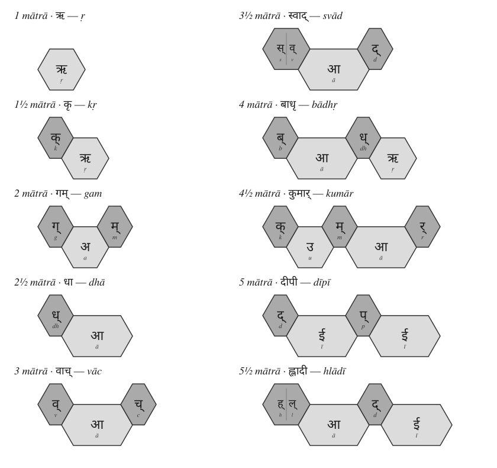
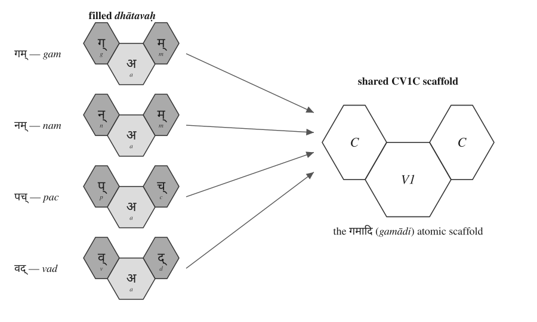
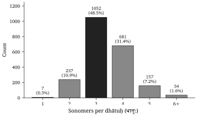
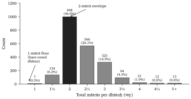
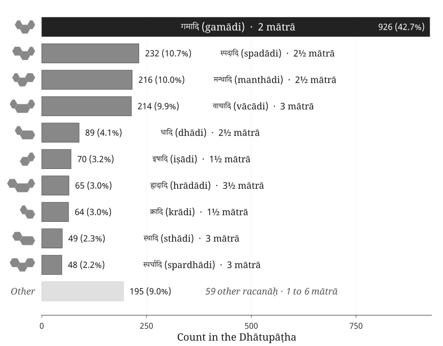
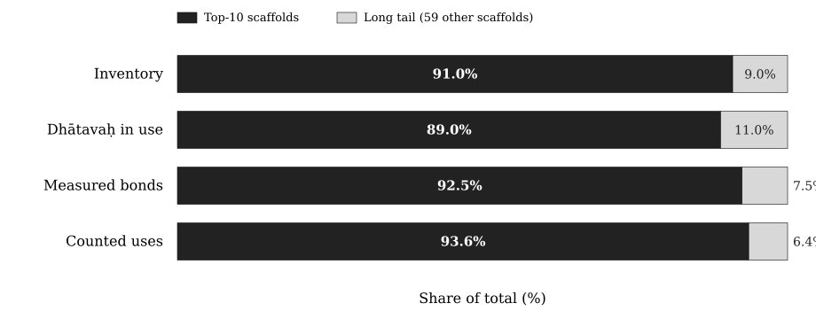
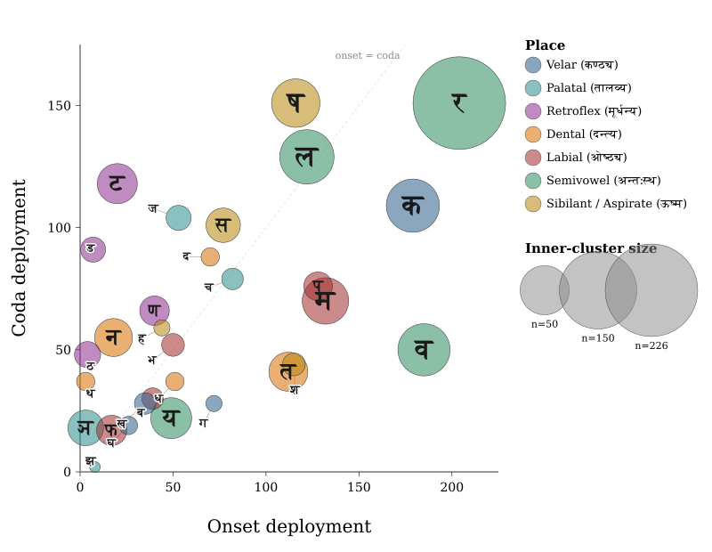

# Chapter 10 — Building the *Dhātuḥ* (धातुः): Sanskrit's Atom

---

::: epigraph

> अल्पाक्षरमसंदिग्धं सारवद्विश्वतोमुखम् ।\
> अस्तोभमनवद्यं च सूत्रं सूत्रविदो विदुः ॥
>
> *alpākṣaram asaṃdigdhaṃ sāravad viśvatomukham |*\
> *astobham anavadyaṃ ca sūtraṃ sūtravido viduḥ ||*
>
> `\hfill`{=latex}*— sūtra-lakṣaṇa*[NOTE: sutra-laksana-six-criteria]

:::

\bigskip

The previous chapters selected and measured Sanskrit's sound-particles. This chapter shows how those particles form a stable unit of meaning. Sanskrit calls that unit the **धातुः (*dhātuḥ*)**.

The botanical metaphor translates *dhātuḥ* as root. Sanskrit's architecture treats it as a constituent: a semantic atom that keeps its identity while larger forms assemble around it. With sonomers, **अक्षराणि (*akṣarāṇi*)**, and **मात्रा (*mātrā*)** already in view, the chapter can trace the construction of a semantic atom from measured sound.

## 10.1 The Design Test — From Sūtra to Dhātuḥ

Sanskrit already contains a design specification for compact engineered form. The epigraph gives the classical **सूत्रलक्षणम् (*sūtra-lakṣaṇam*)** — the defining characteristics by which a true *sūtra* is known. A *sūtra* should be:

1. **अल्पाक्षरम् (*alpākṣaram*)** — few-syllabled: compression.
2. **असंदिग्धम् (*asaṃdigdham*)** — unambiguous: distinguishability.
3. **सारवत् (*sāravat*)** — essence-bearing: semantic force.
4. **विश्वतोमुखम् (*viśvatomukham*)** — facing in every direction: usable range.
5. **अस्तोभम् (*astobham*)** — without padding: economy.
6. **अनवद्यम् (*anavadyam*)** — faultless: stable form.

A *sūtra* is deliberately composed. Its maker removes excess, protects clarity, and gives a short form enough structure to work in many settings. Those visible actions supply a design test for the smaller *dhātuḥ*. If the same six qualities recur in the semantic atom, the organizing principle has repeated across scale.

The verse gives the six characteristics in its own order. The tests proceed in engineering order:

> Make it small. Remove waste. Prevent ambiguity. Give it meaning. Let it face many directions. Preserve identity through use.

That sequence begins with construction because the *dhātuḥ* must first be visible as an assembled unit. Only then can the analysis test the six criteria at the atomic scale.

## 10.2 From Sonomers to Semantic Atoms

With selected sonomers as the starting point, the next question is how *varṇāḥ* become the atomic units of Sanskrit's word-engine.

The *varṇamālā* (वर्णमाला) is the sonomeric inventory. A small cluster of these sonomers creates the **धातुः (*dhātuḥ*)**.

In Chapter 2, the category-theft charge prosecuted the botanical metaphor and reclaimed *dhātuḥ* from the philological mistranslation that forces it into a plant-category. The positive replacement is direct. Sanskrit does not build vocabulary from botanical organs. It has atoms — and the atom is the *dhātuḥ*.

The analogy is physical rather than botanical, and Indic disciplines use *dhātuḥ* for a constituent that persists through a larger process. In *Loha-śāstra* (लोहशास्त्र), it can indicate metal obtained through extraction. *Rasaśāstra* (रसशास्त्र) and *Rasāyana-śāstra* (रसायनशास्त्र) use it for constituents that enter combinations. In *Āyurveda* (आयुर्वेद), the *dhātavaḥ* are structural tissues of the body.[NOTE: rasashastra-chemistry-anticipation][NOTE: saptadhatu-standard] The grammatical *dhātuḥ* belongs to this family as the constituent that remains recoverable inside larger linguistic forms.

Particles, atoms, bonds, and molecules will help the chapter describe levels of assembly and combining range. The analogy does not claim that sound is matter or that Sanskrit obeys chemical laws.

The *Dhātupāṭha* (धातुपाठ) is the inventory of semantic atoms. The working inventory here is **2,168 *dhātavaḥ*** from that source.[NOTE: dhatupatha-count-and-ganas] The examples can now be completely plain: **⟪कृ⟫ (*kṛ*)**, to do or make; **⟪गम्⟫ (*gam*)**, to go; **⟪भू⟫ (*bhū*)**, to be or become; **⟪दृश्⟫ (*dṛś*)**, to see; **⟪ज्ञा⟫ (*jñā*)**, to know. Crucially, these are explicitly not words; rather, they are the foundational semantic atoms from which all words are later assembled.

Comparative perspective sharpens the category: Semitic languages use consonantal semantic bases, and Tamil grammar recognizes verbal bases.[NOTE: dhatu-cross-linguistic-analogues] What distinguishes the Sanskrit *dhātuḥ* is the full architecture around it: sonomeric inventory, timing, scaffold, bonding, and rule-system.

The atom has three architectural layers:

- **वर्णाः (*varṇāḥ*)** — sonomers.
- **धातवः (*dhātavaḥ*)** — stable semantic atoms built from those sonomers.
- **शब्दाः (*śabdāḥ*)** — lexical molecules built from atoms through affixal bonding.

The central map is the pipeline:

> ***varṇāḥ → dhātavaḥ → śabdāḥ***  
> वर्णाः → धातवः → शब्दाः  
> sonomers → atoms → molecules

The physical analogy gives that map its working vocabulary. **Particles** are the smaller constituents from which atoms are built. **Atoms** are the smallest units that retain identity. **Bonds** are the mechanisms by which atoms combine into larger stable forms. **Valency** is combining capacity: the number and kind of bonds an atom can form. **Molecules** are stable structures built from bonded atoms.

Chemistry operates on matter, and Sanskrit operates on measured sound. The material is different, but the architecture is the same: small stable units combine into larger forms.

*Varṇāḥ* enter as sonomers and fill a measured *dhāturacanā*, forming the *dhātuḥ* that will later bond into *śabda*.

Before the inventory is measured, the construction itself has to be clear. Sanskrit assigns *svarāḥ* and *vyañjanāni* different work inside the atom; the difference is measured in *mātrā*.

## 10.3 *Svarāḥ*, *Vyañjanāni*, and the *Mātrā* Envelope

The *varṇamālā* gives Sanskrit two kinds of sonomers. They do different work inside the atom.

**स्वराः (*svarāḥ*) are nuclei.** The word encodes the structural fact: a *svaraḥ* shines by itself. A vowel can stand alone as a syllable. आ, ई, ऊ — each is pronounceable without help. The vowel provides the acoustic center, timing, and syllabic identity. Remove the consonants and the vowel remains. Remove the vowel and the consonant collapses into an unutterable glyph.

This is precisely what a nucleus does within the atomic metaphor: because it preserves identity and anchors the entire structure, it remains perfectly stable and central.

**व्यञ्जनानि (*vyañjanāni*) are electrons.** A consonant manifests the vowel. क, ख, ग, घ, ङ differ not because the vowel changes — the inherent अ remains — but because each consonant gives the vowel a different sonic surface. The consonant reveals, sharpens, colors, and positions the vowel.

A consonant cannot stand alone as a stable spoken unit. The script tells the truth: क is pronounceable as *ka* because it contains inherent अ. Strip the vowel and क् becomes a suspended consonant, a sign waiting for a host.

This exhibits classic electron behavior: while electrons do not define the atom's core identity the way the nucleus does, they actively make bonding possible precisely because they are mobile, peripheral, and chemically decisive.

The Sanskrit system then calls the stable result **अक्षरम् (*akṣaram*)** — the imperishable. A *svaraḥ* can stand alone, or one or more *vyañjanāni* can bond around it into a stable sound-unit, and the script captures that unit as an audiograph. The *akṣaram* is the stable sound-bond made visible.

Each step in the following sequence preserves the measured structure of the atom:

> *svaraḥ* as nucleus.  
> *vyañjanam* as electron.  
> *akṣaram* as stable bonded sound-unit.  
> *dhātuḥ* as semantic atom.

The atom is therefore not only spatially assembled. It is temporally measured.

At atomic scale, the same timing shorthand applies: **C** is the consonantal event, **V1** is the short-vowel nucleus, and **V2** is the long-vowel nucleus. The notation is not typographic. It is temporal.

That means a *dhātuḥ* is never merely a sequence of sounds, but rather a strictly measured construction: while ⟪कृ⟫ is C + V1 and ⟪गम्⟫ is C + V1 + C, ⟪भू⟫ is C + V2, constantly demonstrating that the precise timing is engineered directly inside the label.

The hexagon visualization displays the measure. Consonant slots are narrow, short-vowel slots are medium, long-vowel slots are wide.

{#fig:building-dhatuh-matra-envelope width=100%}

The figure begins with ⟪ऋ⟫ (*ṛ*), the minimum atom: a bare short vowel from which ऋषि (*ṛṣi*) and ऋत (*ṛta*) descend. ⟪कृ⟫ (*kṛ*) adds one consonant; ⟪गम्⟫ (*gam*) shows the modal 2-*mātrā* envelope; ⟪धा⟫ (*dhā*) and ⟪वाच्⟫ (*vāc*) show the productive middle; ⟪स्वाद्⟫ (*svād*), ⟪बाधृ⟫ (*bādhṛ*), ⟪कुमार्⟫ (*kumār*), ⟪दीपी⟫ (*dīpī*), and ⟪ह्लादी⟫ (*hlādī*) show the upper slope toward the cliff.

A *dhātuḥ* is built from timed sonomers. The shape of the atom is its *mātrā* envelope. That envelope is the timing boundary inside which construction must happen.

## 10.4 धातुरचना — *Dhāturacanā* — The Atomic Scaffold

When the *dhātavaḥ* are laid out sonomer by sonomer, a pattern reveals itself. Many different atoms share the same measured shape. The specific sonomers change; the underlying slot-pattern remains.

That recurring measured pattern is **धातुरचना (*dhāturacanā*)** — the atomic scaffold. Across the 2,168 *dhātavaḥ* of the *Dhātupāṭha*, many atoms inhabit the same scaffold.

{#fig:building-dhatuh-racana-scaffold width=100%}

For example, **⟪गम्⟫ (*gam*), ⟪नम्⟫ (*nam*), ⟪पच्⟫ (*pac*), and ⟪वद्⟫ (*vad*)** are four distinct atoms, all inhabiting the same shape: consonantal contact, short-vowel nucleus, consonantal contact . Using Sanskrit's *-ādi* naming habit (*gam*-and-following), this is the **गमादि रचना (*gamādi racanā*)** — the *gamādi* scaffold.[NOTE: panini-adi-naming-convention] The timing is already inside the scaffold.

The filled hexagons differ in sonomer or *varṇa*; the scaffold remains identical. The *dhāturacanā* specifies the slots, the sonomers fill them, and the filled scaffold becomes the *dhātuḥ*: a semantic atom built from sonomers.

Three layers structure the atom:

- **Scaffold / *dhāturacanā*** — the measured arrangement: **गमादि (*gamādi*)** , **स्पदादि (*spadādi*)** , **मन्थादि (*manthādi*)** , **वाचादि (*vācādi*)** .
- **Filling** — the specific *varṇāḥ* placed into the scaffold: *g-a-m*, *n-a-m*, *p-a-c*.
- **Atom / *dhātuḥ*** — the stable semantic unit produced by the filled scaffold.

Bṛhaspati's **वाचमक्रत (*vācam akrata*)** named formed Speech at the scale of Speech. The same operation now appears at atomic scale: selected sonomers enter measured scaffolds, and the filled scaffold becomes a semantic atom. The verse presents formed Speech; the *dhātuḥ* shows the first semantic layer of that formation.

Now the tests can begin.

## 10.5 The Six Atomic Tests

The construction is now clear: sonomers enter timed scaffolds, the filled scaffold becomes a semantic atom, and the atom later bonds into *śabda*. This is the construction tested against the *sūtra* specification.

The verse gave the six defining characteristics in its own order. The engineering sequence from §10.2 now becomes six atomic criteria:

1. **अल्पाक्षरम् (*alpākṣaram*)** — compact form.
2. **अस्तोभम् (*astobham*)** — no padding.
3. **असंदिग्धम् (*asaṃdigdham*)** — distinct form.
4. **सारवत् (*sāravat*)** — essence-bearing form.
5. **विश्वतोमुखम् (*viśvatomukham*)** — many-facing form.
6. **अनवद्यम् (*anavadyam*)** — stable form.

If the *dhātuḥ* satisfies these criteria, the comparison to the *sūtra* is not decorative. The same design signature has reappeared one scale lower.

## 10.6 अल्पाक्षरम् (*Alpākṣaram*) — Make It Small

The first test is size. If the semantic atom is engineered for compactness, the inventory should peak near the smallest forms that can still express distinct meanings, with a sharp cliff beyond.

{#fig:building-dhatuh-particle-count width=100%}

The sonomer-count peak sits at three: **58.2%** of the inventory. Four-sonomer atoms remain heavy at **25.7%**. Five-sonomer atoms drop to **3.6%**. Six-and-above is the cliff at **0.5%**. The inventory is not drifting toward length. It concentrates identity into compact forms.

The same question now moves from sonomer count to timing. If the atom is compact by design, the *mātrā* distribution should show the same signature: a narrow band, a peak near the minimum, a cliff past it.

{#fig:building-dhatuh-matra-distribution width=100%}

The timing distribution repeats the same signal. The 2-*mātrā* envelope alone contains almost half the inventory: **998 entries, or 46.0%**. Add the 2½-*mātrā* atoms and the coverage rises past **78%**. By 3 *mātrās*, it reaches **94%**.

Then the cliff appears. Every value from 4 *mātrās* onward together accounts for under **3%** of the inventory. The architecture commits to a narrow band of measured time.

Sonomer count and *mātrā* count agree: the inventory concentrates identity into compact atoms. The *dhātuḥ* passes the first test. It is *alpākṣaram* at the atomic scale.

## 10.7 अस्तोभम् (*Astobham*) — Remove Waste

Smallness alone is not enough. A system can be short and still wasteful if its shapes are arbitrary, bloated, or ungoverned. **अस्तोभम् (*astobham*)** means without padding — no filler, no unnecessary bulk, no sonomer added merely to fill space.

The scaffold level is where this test becomes visible. If the architecture has no padding, a small number of measured shapes should account for most of the inventory, while the rest should remain bounded and purposeful.

The **धातुपाठ (*Dhātupāṭha*)** lists 2,168 *dhātavaḥ* across ten **गणाः (*gaṇāḥ*)**. After **अनुबन्ध (*anubandha*)** stripping — removing Pāṇini's metadata tags from the pronounced form — the inventory inhabits 47 observed *racanā* scaffolds. The distribution is not flat. Ten scaffolds account for **91.0%** of the inventory.[NOTE: dhatupatha-empirical-distribution]

This measures the architecture before *prayoga*, before any speaker deploys the atoms. The *Dhātupāṭha* inventory already concentrates into a small family of measured scaffolds. A Zipf-like usage pattern can explain why a few forms become common in speech, but the inventory of semantic atoms is already scaffolded this tightly before use begins.[NOTE: zipf-rank-frequency]

{#fig:building-dhatuh-top-ten-racanas width=100%}

The chart shows the distribution shape. The roster below lists each scaffold by the *-ādi* convention and gives its *mātrā* budget, count, share, and sample *dhātavaḥ*. The icon is the scaffold's visual signature; the *-ādi* name is the reader-facing name.

| Scaffold | *Mātrā* | *Dhātavaḥ* | Example *dhātavaḥ* |
|:-:|:-:|---:|---|
|  **गमादि (*gamādi*)** | 2 | 926 (42.7%) | गम्, पच्, वद्, यज्, हन् |
|  **स्पदादि (*spadādi*)** | 2½ | 232 (10.7%) | स्पद्, क्लम्, स्कुद्, क्लिद्, श्विद् |
|  **मन्थादि (*manthādi*)** | 2½ | 216 (10.0%) | मन्थ्, कुन्थ्, कत्थ्, कर्द्, पर्द् |
|  **वाचादि (*vācādi*)** | 3 | 214 (9.9%) | वाच्, बाध्, गाध्, नाथ्, शास् |
|  **धादि (*dhādi*)** | 2½ | 89 (4.1%) | धा, भू, दा, या, पा |
|  **इषादि (*iṣādi*)** | 1½ | 70 (3.2%) | इष्, अत्, अद्, अश्, अक् |
|  **ह्रादादि (*hrādādi*)** | 3½ | 65 (3.0%) | ह्राद्, ह्लाद्, स्वाद्, श्लोक्, स्रोक् |
|  **क्रादि (*krādi*)** | 1½ | 64 (3.0%) | कृ, भृ, हृ, धृ, सृ |
|  **स्थादि (*sthādi*)** | 3 | 49 (2.3%) | ज्ञा, श्रा, ग्ला, स्ना, घ्रा |
|  **स्पर्धादि (*spardhādi*)** | 3 | 48 (2.2%) | स्पर्ध्, स्वर्द्, स्यन्द्, क्रुञ्च्, त्वञ्च् |

The *gamādi*  alone accounts for **42.7%** of the inventory; ten scaffolds together cover **91.0%**. The conclusion is not that Sanskrit has short words. The conclusion is that Sanskrit uses a small number of measured scaffolds to organize the overwhelming majority of its semantic atoms. The architecture is not merely compact. It is selective.

The *Dhātupāṭha* operates not merely as a list of semantic atoms, but as a measured inventory whose atoms fall precisely into a small number of construction patterns. Ten scaffolds account for the overwhelming majority, while forty-seven cover the whole measured inventory, establishing the scaffold discovery.

Sonomer count showed compactness. *Racanā* count now shows economy.

The long tail is the other side of the same test. The remaining 37 scaffolds are not residue. They are ***वैचित्र्य (*vaicitrya*)*** — engineered range, the system's preserved reach into specialized shapes where the modal scaffolds do not suffice.[NOTE: vaicitrya-racana-tail]

The count itself is striking. The *varṇamālā* contains forty-seven core *varṇāḥ* — twenty-five *sparśa* stops, fourteen *svaras*, four semivowels, four sibilants. The *Dhātupāṭha* inhabits forty-seven observed *racanā* scaffolds. The same number appears at two layers of the architecture: sonomer inventory below, construction inventory above.

No mathematical rule requires the two counts to match. The *varṇa* total comes from the engineered phonetic grid; the scaffold total emerges from the *Dhātupāṭha* inventory. But the picture the match draws is real: **forty-seven sonomers flow through forty-seven scaffolds, and the architecture selects 2,168 stable atoms from the combinatorial space they together span.**

The skeptic's question presses here: *if the system is so compact, why have a tail at all?* Engineered systems are not mechanically minimized. They concentrate around modal forms and preserve range where range does work. Rare meanings can take rare shapes. Dense clusters can stage iconic force. Disyllabic envelopes can serve metrical contexts that demand a longer signature.

The modal scaffolds are tight. The tail is small. The range is structured. The *dhātuḥ* passes the second test. It is *astobham*: compact without padding, varied without waste.

## 10.8 असंदिग्धम् (*Asaṃdigdham*) — Prevent Ambiguity

Compression and economy create the next danger. If the atoms become too small, they can begin to blur. A language cannot preserve meaning if its smallest forms collapse into one another.

That is the work of **असंदिग्धम् (*asaṃdigdham*)**: unambiguous, free of doubt. The atom must be compact, but it must remain acoustically distinct.

The cleanest test compares scaffolds inside the same timing budget. If duration alone explained the inventory, then two shapes with the same *mātrā* value should behave roughly alike. They do not.[NOTE: scaffold-distinguishability-by-matra]

When Sanskrit has the same amount of pronunciation time available, it favors a more defined scaffold over a bare vowel and spends that time creating acoustic edges.

| *Mātrā* budget | Inventory entries | Dominant scaffold | Share inside the bucket | Distinguishability signal |
|---:|---:|---|---:|---|
| 2 | 886 | **गमादि (*gamādi*)**  | 819 / 886 = **92.4%** | Same time-budget permits a bare long-vowel form; the system overwhelmingly chooses a short vowel bracketed by two consonantal contacts. |
| 2½ | 520 | **स्पदादि (*spadādi*)**  + **मन्थादि (*manthādi*)**  | 412 / 520 = **79.2%** | The system spends the extra half-*mātrā* on another consonantal edge rather than collapsing into simpler long-vowel scaffolds. |
| 3 | 231 | **वाचादि (*vācādi*)**  + **स्थादि (*sthādi*)**  + **स्पर्धादि (*spardhādi*)**  | 193 / 231 = **83.5%** | The bucket does not smear into arbitrary length; three scaffolds perform the work through either long-vowel signature or dense consonantal framing. |

The 2-*mātrā* row is decisive. *Gamādi*  and the bare long-vowel form occupy the same timing budget. The system chooses *gamādi* at **92.4%** — three sonomers, two consonantal contacts — over the simpler one-vowel form. If the only goal were duration-minimization, this preference would make no sense. Sanskrit is optimizing for contrast, not mere length.

> *The dominant atom is not merely short. It is short and acoustically edged.*

The 2½-*mātrā* row repeats the verdict. *Spadādi*  and *manthādi*  together account for nearly four-fifths of the bucket. The system adds consonantal definition around the short vowel instead of letting duration do the work.

Compactness creates the envelope. Economy removes waste. Distinguishability chooses the scaffold inside the envelope. The *dhātuḥ* passes the third test. It is *asaṃdigdham*: small without becoming blurry.

## 10.9 सारवत् (*Sāravat*) — Give It Meaning

A compact and distinguishable form is still not enough. It has to preserve essence. That is **सारवत् (*sāravat*)**: substance-bearing, essence-bearing, not empty shape.

The *dhātuḥ* is where Sanskrit places semantic force. It is not a sonomeric ornament waiting to be filled later. It is the atom from which larger meanings assemble.

| *Dhātuḥ* | Core force | Sample forms that express the force |
|---|---|---|
| ⟪कृ⟫ (*kṛ*) | do, make, act | करोति (*karoti*), कर्म (*karma*), कर्तृ (*kartṛ*), कार्य (*kārya*), संस्कार (*saṃskāra*) |
| ⟪भू⟫ (*bhū*) | be, become | भवति (*bhavati*), भूत (*bhūta*), भाव (*bhāva*), सम्भव (*saṃbhava*) |
| ⟪गम्⟫ (*gam*) | go, move | गच्छति (*gacchati*), गमन (*gamana*), गति (*gati*), आगम (*āgama*), सङ्गम (*saṅgama*) |
| ⟪धा⟫ (*dhā*) | place, hold, put | दधाति (*dadhāti*), धातु (*dhātu*), विधान (*vidhāna*), निधान (*nidhāna*) |
| ⟪ज्ञा⟫ (*jñā*) | know | जानाति (*jānāti*), ज्ञान (*jñāna*), अज्ञान (*ajñāna*), विज्ञान (*vijñāna*), प्रज्ञा (*prajñā*) |

The table shows what *sāravat* means at the atomic scale: tiny forms express immense semantic force. ⟪कृ⟫ (*kṛ*) alone generates action, actor, object, obligation, refinement, and transformation. ⟪भू⟫ (*bhū*) expresses being and becoming. ⟪गम्⟫ (*gam*) extends motion into travel, arrival, the arrived teaching (*āgama*), and joining.

Sanskrit does not treat sonomers as interchangeable filler, injecting engineering-poetry directly into the roots. Flow-actions naturally cluster around liquids and continuants — *sar* (सर्), *cal* (चल्), *car* (चर्), *dru* (द्रु), *plu* (प्लु), *sru* (स्रु), *kṣar* (क्षर्). Abrasion, diminishment, and cutting cluster around harsher sound-shapes — *kṣay* (क्षय), *kṣat* (क्षत), *kṣaṇ* (क्षण्), *kṣam* (क्षम्), *klam* (क्लम्), *kṣud* (क्षुद्), *kṣap* (क्षप्).

The architecture assigns meaning with acoustic intelligence. It creates compact, distinguishable forms, and liquids fit flow because they sound like flow. *Kṣa* fits abrasion because it sounds like abrasion. Form comes first; assignment gives that form semantic force.

This concept is called **वर्णशक्ति (*varṇa-śakti*)**: the semantic potency of a measured sound-particle operating inside a calibrated field. This position — **वर्णवाद (*varṇa-vāda*)** — proposes that each sonomer carries an intrinsic meaning-force resident in the sound itself. This entire framework and the debate rest directly on the foundation of an engineered language. To sustain a stable *varṇa-śakti* across a living record, the sounds must remain discrete, stable, composable, and analyzable. The architecture of the *varṇamālā* guarantees this consistency. The rigid stability of the grid provides the necessary environment for the theory to remain valid.[NOTE: varnavada-presupposes-engineering]

The Vedic context grounds the claim because the *Vedas* are poems. Sound-meaning alignment is part of the verse's effect, its mantric power, its sanctity. *Mantra* (मन्त्र) itself — from the *dhātuḥ* ⟪मन्⟫ (*man*), to think — is the acoustic instrument that aligns sound with contemplation. Poetry is built form-first: meter, alliteration, and sonic flow drive the assembly; meaning enters that architecture as the poet works.

Engineering is not the enemy of poetry. Engineering is what lets the poetry strike home. The *dhātuḥ* passes the fourth test. It is *sāravat*: compact form with semantic force.

## 10.10 विश्वतोमुखम् (*Viśvatomukham*) — Let It Face Many Directions

A *sūtra* must be **विश्वतोमुखम् (*viśvatomukham*)** — facing in every direction. It must apply beyond one narrow case. The atomic equivalent is not universal application in the grammatical sense. It is generative reach: one tiny atom must face many grammatical and semantic directions.

⟪कृ⟫ (*kṛ*) is the flagship example. It appears as action in **करोति (*karoti*)**, deed in **कर्म (*karma*)**, agent in **कर्तृ (*kartṛ*)**, what is to be done in **कार्यम् (*kāryam*)**, refinement in **संस्कार (*saṃskāra*)**, nature in **प्रकृति (*prakṛti*)**, cultivated order in **संस्कृति (*saṃskṛti*)**, and distortion in **विकृति (*vikṛti*)**. One atom faces action, object, agent, obligation, refinement, nature, culture, and deformation.

The spread demonstrates directional reach through bonding. The *dhātuḥ* remains the identifiable center while *upasargāḥ* and *pratyayāḥ* turn it toward different functions — a chemistry that operates directly through *prakṛti*, *saṃskṛti*, *vikṛti*, and *saṃskāra*.

The scaffold evidence shows the same reach at the inventory level. A pattern that only crowds a list could still be a cataloguing convenience. The stronger test leaves the list and looks at Sanskrit in use. When the atoms actually bond, generate forms, take *upasargāḥ*, take *pratyayāḥ*, and enter *prayoga* (प्रयोग, actual use), do the same scaffolds still organize the forms?

The test uses the **Digital Corpus of Sanskrit** (DCS), a digitized and grammatically tagged Sanskrit record. The dataset used here contains **15,900 parsed Sanskrit files** and **1,007,361 counted verb-form uses** across **271 named source groups**. It is not one book and not a hand-picked sample. It includes Vedic, epic, grammatical, *śāstric*, purāṇic, kāvya, Buddhist, medical, ritual, and philosophical material.

DCS identifies verbal forms and links them back to the *dhātuḥ* behind the form. Where the record permits, it also records the *upasarga* and broad *pratyaya* class involved. That permits a concrete question: when a *dhātuḥ* from the *Dhātupāṭha* enters actual Sanskrit use, which *racanā* scaffold describes it? The analysis joins that usage record to the scaffold data developed here.[NOTE: scaffold-deployment-join]

The figure separates four measures:

- **Inventory** — the share of the *Dhātupāṭha* accounted for by the top-10 scaffolds.
- ***Dhātavaḥ* in use** — the share of distinct atoms visible in Sanskrit use.
- **Measured bonds** — the share of distinct (*upasarga*, *pratyaya*) bonds those atoms form.
- **Counted uses** — the share of all parsed verb-form uses in the DCS record.

If the top ten dominate only the inventory and dissolve in actual use, the architecture is only a list-pattern. If they dominate all four, the architecture is real.

{#fig:building-dhatuh-scaffold-deployment width=100%}

Living speech normally produces rank-frequency concentration where a few forms account for much of actual use while a long tail remains available. The test here is sharper: the same scaffolds that dominate the *Dhātupāṭha* inventory still account for almost nine-tenths of the *dhātavaḥ* visible in use, more than nine-tenths of the measured bonds, and more than nine-tenths of the counted uses. The inventory pattern survives deployment.

| Measure | Top ten *racanāḥ* | Tail |
|---|---:|---:|
| Inventory | **91.0%** | 9.0% |
| *Dhātavaḥ* visible in use | **89.0%** | 11.0% |
| Measured bonds | **92.5%** | 7.5% |
| Counted uses | **93.6%** | 6.4% |

The central corridor remains *gamādi* . Roughly two-fifths of the inventory, visible *dhātavaḥ*, measured bonds, and counted uses all pass through that same scaffold.

The compact *krādi*  and *dhādi*  scaffolds show the other side of the pattern. They are small in inventory share, but heavy in use because they include atoms such as ⟪कृ⟫ (*kṛ*), ⟪हृ⟫ (*hṛ*), ⟪भू⟫ (*bhū*), ⟪धा⟫ (*dhā*), ⟪नी⟫ (*nī*), ⟪या⟫ (*yā*), and ⟪दा⟫ (*dā*). Compact does not mean marginal.

The same scaffolds that compress the inventory also organize Sanskrit in use. The *racanā* is not a naming convenience. It is part of the architecture.

The measured scaffold persists when the analysis moves from the *Dhātupāṭha* inventory into Sanskrit in use. Chapter 11 can therefore ask how Sanskrit activates a scaffolded atom as a *kriyāpada* without losing sonomeric precision.

The *dhātuḥ* passes the fifth test. It is *viśvatomukham*: one compact atom can face many directions without losing the center from which those directions unfold.

## 10.11 अनवद्यम् (*Anavadyam*) — Preserve Identity Through Use

The final test is stability. **अनवद्यम् (*anavadyam*)** means faultless, without defect. At the atomic scale, the defect to test for is loss of identity. If the atom disappears when it bonds, then it was never an atom. If the atom survives bonding and transformation, the architecture has preserved its unit.

The *dhātuḥ* survives. ⟪कृ⟫ (*kṛ*) remains visible in *karoti*, *karma*, *kartṛ*, *kārya*, *saṃskāra*, *prakṛti*, and *vikṛti*. ⟪भू⟫ (*bhū*) remains visible in *bhavati*, *bhūta*, *bhāva*, and *saṃbhava*. ⟪गम्⟫ (*gam*) remains visible in *gacchati*, *gamana*, *gati*, *āgama*, and *saṅgama*. The forms change because bonding changes their grammatical and semantic direction. The atom does not become vague.

That stability makes the next scale necessary. When the *dhātuḥ* becomes *kriyā*, the rule-system still operates at the sonomeric level. The atom does not enter an undifferentiated word mass. It enters a procedure. The sonomers remain visible enough for operations to act on them.

The *dhātuḥ* passes the final test. It is *anavadyam*: stable through use, visible through bonding, preserved through transformation.

The six tests now stand together. The *dhātuḥ* — the atom — is compact, economical, distinct, essence-bearing, many-facing, and stable. These are the same defining characteristics the *sūtra-lakṣaṇam* specifies for the *sūtra*, now visible at the atomic scale.

The burden now shifts. Anyone who wants to call this ordinary natural-language behavior must produce another natural-language inventory of semantic atoms with this level of compact scaffold coverage, timing discipline, structured long-tail range, and grammatical behavior after bonding. Until then, the *dhāturacanā* result remains evidence for engineering, not ordinary rank-frequency concentration.

## 10.12 Engineering Was Common Knowledge

The engineering thesis is not a modern invention. The Sanskrit-literate continuum operated as if Sanskrit could be analyzed at every level: sound, meter, grammar, word-formation, and preservation. That operating premise appears in the disciplines themselves.

These disciplines are complementary applications of one premise: Sanskrit is built well enough to support exact analysis at every level.

- ***Vyākaraṇam*** (व्याकरणम्) — grammar — presupposes engineered combinatorial rules.
- ***Nirukta*** (निरुक्त) — etymology — presupposes an engineered decomposable lexicon.
- ***Śikṣā*** (शिक्षा) — phonetics — presupposes engineered sound-production parameters.
- ***Chandas*** (छन्दस्) — meter — presupposes engineered timing and syllable weight.
- ***Prātiśākhya*** (प्रातिशाख्य) — recension-specific phonetic discipline — presupposes engineered preservation of exact sound.

No ordinary drifting language generates that disciplinary constellation by accident. The disciplines exist because the language can bear them.

Yaska's decoding of **अग्नि (*agni*)** at *Nirukta* 7.14 makes the point concrete. Predating Pāṇini and foundational to the etymological decoding discipline, Yaska treats one word with four independent *dhātu*-level decodings, two attributed to earlier named pre-Pāṇinian decoders:[NOTE: yaska-agni-nirukta-7-14]

> ***agra-nī*** (अग्रनी) — *that which leads at the front*, from *agra* (अग्र, front) + the *dhātu* ⟪नी⟫ (*nī*), to lead. Fire leads the sacrificial procession; it is brought forward at the front of every rite.
>
> ***aṅga-nī*** (अङ्गनी) — *that which leads the limbs*, from *aṅga* (अङ्ग, limb) + ⟪नी⟫. Fire animates the body; warmth activates the limbs.
>
> ***aknopana*** (अक्नोपन) — *that which does not moisten*, from negative *a-* (अ-) + the *dhātu* ⟪क्नोप्⟫ (*knop*, to moisten). **Per Sthaulāṣṭhīvi** (स्थौलाष्ठीवि), a pre-Pāṇinian decoder Yaska cites by name. Fire dries; it does not anoint with oil.
>
> ***i + añj + dah → agni*** — *the one born from three dhātavaḥ*: ⟪इ⟫ (*i*, to go) + ⟪अञ्ज्⟫ (*añj*, to anoint / illuminate) + ⟪दह्⟫ (*dah*, to burn). **Per Śakapūṇi** (शकपूणि), a second pre-Pāṇinian decoder Yaska cites by name. The three-*dhātu* derivation combines motion, illumination, and burning into one word.

To the philological eye, four derivations of one word look like uncertainty — competing guesses about a single "true" etymology. Inside the Sanskrit analytical frame they are functional decompositions. Yaska is performing a precise functional analysis, isolating the properties the word expresses in use: fire leads, animates, dries, illuminates, and burns.

The decompositions expose different stresses inside one assembled word, which is exactly what stable constituents make possible. *Agni* can be decoded because *varṇāḥ*, *dhātavaḥ*, and bonding rules are discrete enough to support decoding. A drifting, botanical language generates guesses; Sanskrit generated analysis, and that analysis was already running through named decoders before any formal grammar text described the system.

Because the Sanskrit-literate world never debated whether Sanskrit was engineered, it instead vigorously debated exactly *how* that engineering produces meaning: *varṇa-vāda* versus *sphoṭa-vāda*, intrinsic charge versus assignment freedom, *dhātu*-prior versus *śabda*-prior. While these were always rigorous internal debates operating entirely within the engineering thesis, the progressive dogma's "natural language like any other" account is decidedly not one of these internal schools; rather, it is merely an outsider's outright denial of the very room in which the debate originally happened.

The Sanskrit lineage is right. The progressive dogma is the anomaly.

## 10.13 Sonomers Already Have Roles

The *Dhātupāṭha* reveals one more signal before the chapter closes: the sonomers themselves have roles.

While a mere list gives the analyst basic frequencies, Sanskrit specifically gives the analyst structural valency. Because the very same consonant does not merely occur often or rarely, but rather precisely occupies a defined position, actively performs a specific function, and clearly reveals a measurable bonding profile inside the *dhātuḥ*, this proves we are observing atomic behavior rather than a simple alphabetic accident.

{#fig:building-dhatuh-role-map width=100%}

Each bubble is one consonant. The horizontal axis tracks onset deployment; the vertical axis tracks coda deployment; bubble size encodes inner-cluster activity. The dashed line shows the onset = coda diagonal. The edge specialists are visible too: **क**, **व**, **प**, **श** lean toward onset work; **ष**, **ज**, **स**, **ट**, **ड** lean toward coda work.

Three examples demonstrate the pattern.

First, *ra* (र) operates as the universal bonder. It covers all four position-roles at meaningful magnitude and performs inner-cluster work no other consonant matches.

Second, *la* (ल) operates as a structural neutralizer. It sits near the diagonal because its profile is unusually balanced across initial and final deployment, broad vowel compatibility, and multi-role use.

Third, the *ṛ* (ऋ) / *ra* (र) bridge exposes the engineering at the vowel-consonant boundary. ऋ is the *r*-principle as vowel-core. र is the same principle as consonantal bonder. Sanskrit places both in the *mūrdhanya* field, then makes both disproportionately active. Under *yaṇ-sandhi*, vocalic ऋ resolves into र before a following vowel — the same articulatory principle crossing the vowel/consonant boundary, taking nuclear form in the *svara* table and bonding form in the *vyañjana* table.

Activation sonomers arrive, the *dhātuḥ* changes through specified operations, and the finished *kriyāpada* molecule remains traceable back to the atom. The atom is assembled from sonomers whose behavior is already patterned, rather than from inert letters.

## 10.14 The Atomic Corollary

The central architectural claim is the ***Atomic Corollary***:

> The *dhātuḥ* (धातुः) is the unit of stable identity in Sanskrit's engineering, holding its structure through bonding without losing its constitutive form. It is a physical constant of the system, not a mutating organic form.

Each clause states the argument.

***Unit of stable identity.*** The *dhātuḥ* (धातुः) is what the *vyākaraṇa* discipline treats as the fundamental semantic atom. Every Sanskrit verb form, every nominal derivative of a verb, every *kṛdanta* (कृदन्त, primary derivative) and every *taddhita* (तद्धित, secondary derivative) formation traces back to a *dhātuḥ*. The *dhātuḥ* is the place where derivation begins and to which morphological analysis returns. It is the unit of identity in the system's combinatorial chemistry.

***Holding its structure through bonding.*** A *dhātuḥ* combines with *upasargāḥ* (उपसर्गाः) and *pratyayāḥ* (प्रत्ययाः) — the bonding chemistry developed at the assembly scale — without losing its identity. Take ⟪कृ⟫ (*kṛ*). It appears in *karoti* (करोति, does), *kāryam* (कार्यम्, that which is to be done), *kartṛ* (कर्तृ, the doer), *karma* (कर्म, the deed), *saṃskāra* (संस्कार, the consecration), *prakṛti* (प्रकृति, original nature), and *vikṛti* (विकृति, modification). Across these forms, ⟪कृ⟫ persists as the recognizable atomic unit. The *upasargāḥ* and *pratyayāḥ* attach to it and modify the molecular meaning, but they do not consume the atom. The atom is what comes through every bond intact.

***Without losing its constitutive form.*** The *dhātuḥ* (धातुः) does not mutate. The *dhātuḥ* in *karoti* (करोति) is the same *dhātuḥ* in *karma* (कर्म), in *saṃskāra* (संस्कार), in the *Vedas*, in the *Bhagavad Gītā*, in the *Rāmāyaṇa*. The form is the constant; what varies is what bonds to it.

***Physical constant of the system, not a mutating organic form.*** The *vyākaraṇa* discipline's term *dhātu* (धातु) — the same term operating in metallurgy, in *Rasaśāstra*, in *Āyurveda* — places the unit in the engineering category by terminological choice. The botanical mistranslation imposes decay-and-growth onto a unit the Sanskrit lineage placed in the engineering category. That is the dogma's category theft.

The convergence of names at two adjacent levels is itself the signal. The Sanskrit continuum calls the form-level unit ***akṣara*** (अक्षर) — the imperishable, that which does not flow away, the visible capture of a stable sound-bond, the audiograph of Appendix Part 3 — and the semantic-level unit ***dhātuḥ*** (धातुः) — the constituent constant that persists through bonding. Both names assert the same architectural property: persistence of identity through transformation. The convergence is not coincidence; it is the architecture labeling what is engineered.

The corollary's consequences run forward. The next levels are *kriyā*, bonding chemistry, *śabdāḥ*, *vākyāni*, and the preservation problem the architecture must solve once the system is in use.

The corollary's consequences run backward as well. The diagnoses of the philological dogma — Chapter 2 on the botanical fallacy, Chapter 18 on the wrong question, and Chapter 19 on PIE in the sky — are now anchored by the Atomic Corollary's positive content. The pyramid's account fails fundamentally because the architecture is atomic, and atomic architectures do not behave the way the dogma's botanical model assumes.

Because the *dhātuḥ* serves as the fundamental unit of stable identity—exactly as the Sanskrit continuum explicitly called it—its proper name must absolutely be restored.

Sanskrit is not a plant. It is an atomic system.

## 10.15 The Fractal Signature

*Sūtra-lakṣaṇam* set the specification. The six atomic tests return the verdict.

Consequently, the *Dhātupāṭha* definitively passes this test: **अल्पाक्षरम् (*alpākṣaram*)** clearly appears in its exquisitely compact sonomer and *mātrā* distributions; **अस्तोभम् (*astobham*)** reveals itself strictly in the scaffold concentration and fiercely structured range; **असंदिग्धम् (*asaṃdigdham*)** emerges directly in the exact, acoustic-edged choices constrained inside strict timing budgets; **सारवत् (*sāravat*)** continuously appears in the immense semantic force encoded by such tiny atoms; **विश्वतोमुखम् (*viśvatomukham*)** is proven through their limitless reach via bonding and use; and finally, **अनवद्यम् (*anavadyam*)** is visibly proven by their enduring stability across rigorous transformation.

The principle stated at the level of the *sūtra* reaches the atom.

A *sūtra* is composed. No one claims a *sūtra* botanically morphed into its precise form. Take **योगश्चित्तवृत्तिनिरोधः (*yogaś citta-vṛtti-nirodhaḥ*)**:[NOTE: yoga-sutra-1-2] Yoga is the stilling of the movements of the mind. The sentence is tiny, but it contains an entire discipline: the field of mind, the movements that disturb it, and the discipline that stills them.

The same principle appears in **प्रत्यक्षानुमानोपमानशब्दाः प्रमाणानि (*pratyakṣānumānopamānaśabdāḥ pramāṇāni*)**:[NOTE: nyaya-sutra-pramana-1-1-3] perception, inference, comparison, and testimony are the means of knowledge. That sūtra also describes the method used here. The architecture is seen, its engineering is inferred, its behavior is compared, and the lineage is heard through *śabda*. The form is short because it was made short. It contains more structure than its length suggests.

The *dhātuḥ* displays the same **लक्षणानि (*lakṣaṇāni*)** — defining characteristics — specified by the *sūtra-lakṣaṇam*: compact form, no padding, clear distinction, semantic force, usable range, and stable shape. That is the strongest procedural evidence developed here. The *sūtra* is thoughtfully assembled language. The *dhātuḥ* is thoughtfully assembled sonomeric form.

The *dhātuḥ* behaves like a *sūtra* at atomic scale.

First came **ॐ (*oṃ*)** as the shortest audible compression of Sanskrit's sound-anatomy. Then came the sound-field and the selected field shaped into the *varṇamālā*. The same discipline is now visible inside the *dhātuḥ*, making the fractal recurrence undeniable.

The śāstra does not treat Oṃ as a casual sacred sound. The Chāndogya calls it the essence of essences. The Māṇḍūkya gives the fractal formula: **ॐ इत्येतदक्षरमिदं सर्वम् (*oṃ ity etad akṣaram idaṃ sarvam*)** — this *akṣara* Oṃ is all this — and extends the claim across what was, what is, what will be, and what stands beyond the three times. It then unfolds the single syllable as **अ-उ-म् (*a-u-m*)** and the unmeasured fourth. The Taittirīya says, "Oṃ is Brahman; Oṃ is all this." The Kaṭha condenses what all the Vedas declare into Oṃ. In this vocabulary, Oṃ is the acoustic seed of *Sanātan*: the time-transcending claim made audible in one *akṣara*.[NOTE: om-vocal-tract-macro-gesture]

Oṃ therefore passes the same test at the point of maximum compression. It is **अल्पाक्षरम् (*alpākṣaram*)** because it is one *akṣara*. It is **अस्तोभम् (*astobham*)** because nothing in it is padding. It is **असंदिग्धम् (*asaṃdigdham*)** because the lineage calls it precisely *praṇava*. It is **सारवत् (*sāravat*)** because the śāstra treats it as essence-bearing. It is **विश्वतोमुखम् (*viśvatomukham*)** because the Upaniṣads make it face the whole field of time, world, recitation, and realization. It is **अनवद्यम् (*anavadyam*)** because it remains stable across recitation, ritual, yoga, and Vedānta. Oṃ is not the *varṇamālā*. It is the single-syllable compression of the instrument and the shortest audible sign of the Sanātan claim.

The *varṇamālā* already displayed the same six characteristics at the sound-inventory level: compact inventory, no wasted slot, unambiguous placement, essence-bearing classes, many-facing use, and stability across operations. Seen anatomically, the *varṇamālā* is the mouth-map. Seen operationally, the **माहेश्वरसूत्राणि (*Māheśvara-sūtrāṇi*)** cast that same inventory into sūtra-form for grammar.

The first scale is the specified sound inventory. The *varṇamālā* already has the six characteristics of a *sūtra*. Pāṇini saw that sonomeric architecture, rearranged the inventory into an operating index for his meta-rules, and built the *Aṣṭādhyāyī* on it. The grammatical lineage remembers that rearranged index as the Māheśvara-sūtras. In that operational form, the sound inventory is the sonomeric sūtra; one scale up, the *dhātuḥ* embodies the same discipline at atomic scale; the *sūtra* captures it at rule scale.

Because Oṃ serves as the single-syllable sūtra, the *varṇamālā* serves as the sonomeric sūtra, and the *dhātuḥ* serves as the atomic sūtra, the grammatical *sūtra* is ultimately the rule-scale expression of that exact same discipline. By seamlessly connecting these four visible scales with exactly one structural signature, the architecture proves itself to be remarkably fractal.

What else in Sanskrit follows the same discipline? Calibration extends it across the whole language.

The next chapters follow that discipline outward. As atoms become action, word, and sentence, Sanskrit preserves the sonomer. With the atom now built, the next scale asks how the *dhātuḥ* becomes a *kriyāpada* molecule.
