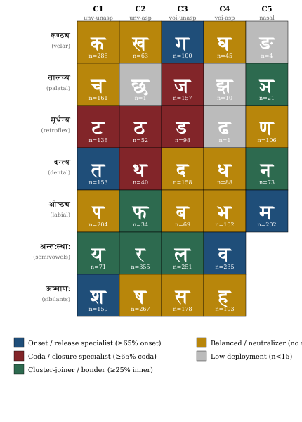
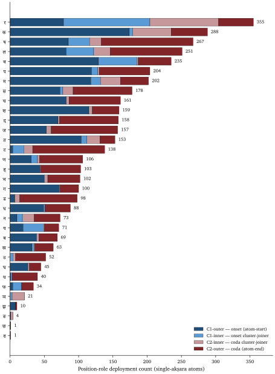
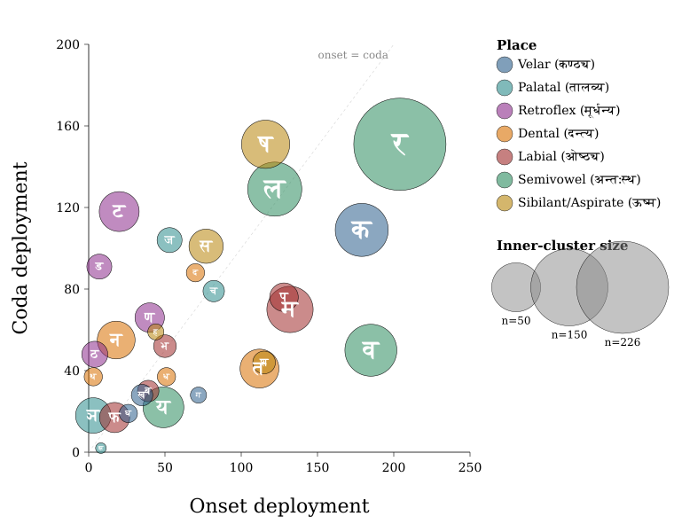
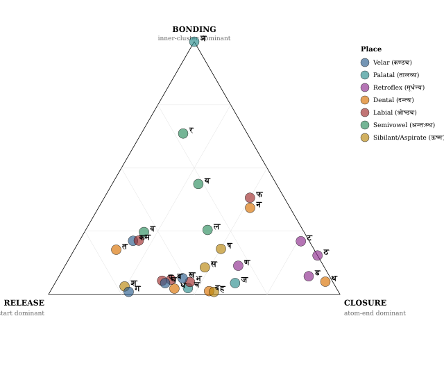

# Chapter 10 — Building the *Dhātuḥ* (धातुः)

*Draft v2 (2026-05-20). Codex compression of the previous draft with Tier 1 + Tier 2 restorations: the four-decoding Yaska *agni* example with Sthaulāṣṭhīvi + Śakapūṇi attributions in §10.9; selected empirical numbers in §10.6/§10.7 (C2/C4 inversion, OCP suppression, productivity correlation, *ṛ* deployment, cell-level allocation); the Vedic mantra-context paragraph at §10.8; the progressive-orthodoxy orthogonal-third-frame setup at §10.8; the water-droplets / honeybees / suspension-bridges compression-principle examples at §10.2. CLAUDE.md sharpening: *"the orthodoxy is the anomaly"* → *"the progressive orthodoxy is the anomaly"*.*

---

## 10.1 From Sound-Particles to Atoms

Chapters 7 through 9 established the *varṇamālā* (वर्णमाला) as an engineered phonetic grid and the subcontinental sound-field as its substrate. That still leaves the next question: what is the grid for?

The *varṇamālā* is the particle inventory. The system built from those particles is the **धातुः (*dhātuḥ*)**.

Chapter 1 prosecuted the botanical metaphor. Chapter 6 reclaimed *dhātuḥ* from the philological mistranslation that calls it a "root." This chapter builds the positive replacement. Sanskrit does not have roots. It has atoms.

The metaphor is physical, not biological. The same word *dhātuḥ* operates in metallurgy, *Rasaśāstra*, and *Āyurveda*: foundational constituent, underlying element, stable bearer. The grammatical *dhātuḥ* belongs in that family. It is the stable semantic constituent of the linguistic system.

The architecture is three-layered:

- **वर्णाः (*varṇāḥ*)** — engineered phonetic particles.
- **धातवः (*dhātavaḥ*)** — stable semantic atoms built from those particles.
- **शब्दाः (*śabdāḥ*)** — lexical molecules built from atoms through affixal bonding.

The pipeline is the chapter's central map:

> ***varṇāḥ → dhātavaḥ → śabdāḥ***  
> वर्णाः → धातवः → शब्दाः  
> particles → atoms → molecules

Chemistry operates on matter. Sanskrit operates on sound. The substrate differs. The combinatorial architecture is the same.

## 10.2 The Physics Needed Here

Only a small part of physics is needed.

**Particles** are the smaller constituents from which atoms are built. For this chapter's purposes, the relevant distinction is between the stable identity-bearing center and the mobile bond-forming periphery.

**Atoms** are the smallest units that retain identity. Hydrogen is hydrogen because of its internal structure. Carbon is carbon because of its internal structure. Atoms are not heaps of particles. They are governed assemblies.

**Bonds** are the mechanisms by which atoms combine into larger stable forms.

**Valency** is combining capacity: the number and kind of bonds an atom can form. Carbon's valency gives organic chemistry its reach. Hydrogen's valency is smaller. Noble gases barely bond. Behavior follows structure.

**Molecules** are stable structures built from bonded atoms. A small inventory of atoms generates an enormous molecular world because combination multiplies.

The governing principle is compression:

> ***Nature, and engineered systems modeled on it, favor compact forms that preserve identity while generating larger structures.***

Compression is not reduction. It is disciplined recoverability. Water droplets form spheres because the sphere is the most compact shape for a given volume. Honeybees build hexagonal cells because hexagons tile space with the smallest wall-per-cell ratio. Suspension bridges hang in catenary curves because that curve minimizes per-segment stress. DNA does this biologically. A formula does this intellectually. A blueprint does this architecturally. Musical notation does this. The compressed form is not less than the structure it generates. It is the structure's engineered minimum.

That is exactly what the *dhātuḥ* is.

## 10.3 *Svarāḥ* as Nuclei, *Vyañjanāni* as Electrons

The *varṇamālā* gives Sanskrit two kinds of phonetic particles. They do different work.

**स्वराः (*svarāḥ*) are nuclei.** The word names the structural fact: a *svaraḥ* shines by itself. A vowel can stand alone as a syllable. आ, ई, ऊ — each is pronounceable without help. The vowel carries acoustic center, timing, and syllabic identity. Remove the consonants and the vowel remains. Remove the vowel and the consonant collapses into an unutterable mark.

That is what a nucleus does in the atomic metaphor. It carries identity. It anchors the structure. It is stable and central.

**व्यञ्जनानि (*vyañjanāni*) are electrons.** A consonant manifests the vowel. क, ख, ग, घ, ङ differ not because the vowel changes — the inherent अ remains — but because each consonant gives the vowel a different sonic surface. The consonant reveals, sharpens, colors, and positions the vowel.

A consonant cannot stand alone as a stable spoken unit. The script tells the truth: क is pronounceable as *ka* because it carries inherent अ. Strip the vowel and क् becomes a suspended consonant, a sign waiting for a host.

That is electron behavior. Electrons do not carry the atom's identity the way the nucleus does, but they make bonding possible. They are mobile, peripheral, and chemically decisive.

The Sanskrit system then names the bonded result **अक्षरम् (*akṣaram*)** — the imperishable. A *svaraḥ* and one or more *vyañjanāni* bond into a stable sound-unit, and the script captures it as an audiograph. The *akṣaram* is the stable sound-bond made visible.

The sequence is exact:

> *svaraḥ* as nucleus.  
> *vyañjanam* as electron.  
> *akṣaram* as stable bonded sound-unit.  
> *dhātuḥ* as semantic atom.

## 10.4 Building the *Dhātuḥ*

A *dhātuḥ* is built from *varṇāḥ* in governed combinations.

*Kṛ* (कृ) is not a loose sound. It is one consonantal particle and one vocalic particle, arranged as a stable semantic unit: to do, to make. *Gam* (गम्) is consonant-vowel-consonant: to go. *Bhū* (भू) is consonant-vowel: to be. The order matters. The particles matter. The stability matters.

The dominant assembly patterns are compact.

**CV** forms place one consonant around one vowel: *kṛ* कृ, *bhū* भू, *dhā* धा, *dā* दा, *pā* पा, *ji* जि, *hu* हु. These are two-particle atoms. A few vowel-only atoms — √i इ, √ī ई, √u उ, √ṛ ऋ, √ṝ ॠ — form the structural floor. They are Sanskrit's hydrogen class: minimum particle count, maximum flexibility.

**CVC** forms place a vowel between two consonants: *gam* गम्, *pat* पत्, *vac* वच्, *yam* यम्, *labh* लभ्, *tap* तप्. These are three-particle atoms: one nucleus, two electrons, identity held in compact form.

The empirical distribution confirms the architecture. The *Dhātupāṭha* lists 2,168 *dhātavaḥ* across ten *gaṇāḥ*. Of these, 1,795 — 82.8% — occupy exactly one *akṣara*. CVC alone accounts for 919 entries, 42.4% of the corpus. Three-particle atoms peak at 48.5%; four-particle at 31.2%; five-particle drops to 7.2%; six-and-above is the cliff at 1.9%.[NOTE: dhatupatha-empirical-distribution]

{#fig:building-dhatuh-particle-count width=80%}

The point is not that Sanskrit has short words. The point is that Sanskrit packs stable semantic identity into compact atomic forms. *Kṛ* anchors *karoti*, *karma*, *kāryam*, *kartṛ*, *kāraṇa*, *saṃskāra*, *prakṛti*, *vikṛti*, *ākāra*, *upakāra*, *parikāra*, and hundreds more. The atom persists. The bonds vary.

The *dhātuḥ* in *karoti* is the same *dhātuḥ* in *karma*, the same *dhātuḥ* in *saṃskāra*, the same *dhātuḥ* in the *Vedas*, the same *dhātuḥ* in the *Bhagavad Gītā*, the same *dhātuḥ* in the *Rāmāyaṇa*. The form is the constant; what varies is what bonds to it.

## 10.5 Three Principles

Three principles explain the architecture. No one principle is enough.

**Compression.** Compact forms persist and generate. The *Dhātupāṭha* should peak near the minimum particle count compatible with semantic distinction. It does.

**Distinguishability.** Stable transmission requires acoustic distance. The system should avoid crowded phonemes, suppress same-place CVC structures, and pay articulatory cost only when the cost buys difference. It does.

**Engineering-poetry.** Once the inventory is compact and distinguishable, the architecture can choose forms whose sound resonates with meaning. Liquids can carry flow. Harsh clusters can carry abrasion. Empty slots can remain empty because the system is assigning forms, not mechanically filling a table.

The architecture is the joint signature of all three. Compression sizes the atom. Distinguishability protects the atom. Engineering-poetry gives the atom acoustic fitness for meaning.

## 10.6 Compression and Its Limit

Compression succeeds immediately.

The particle-count distribution peaks at three. Four remains heavy. Five begins the cliff. Six and above nearly disappear. Single-*akṣara* atoms dominate the corpus. This is exactly what compression predicts: the system favors compact identity-bearing units.

Compression also predicts generativity. The most productive *dhātavaḥ* are structurally small. Across a curated sample of 138 representative *dhātavaḥ*, productivity rank correlates strongly negatively with particle count (Spearman ρ = −0.485). CV-pattern atoms generate a mean of 32.6 primary derivatives apiece; CCVCC-pattern atoms generate 11.4 — a **2.9× ratio**. *Kṛ* alone anchors 75+ primary derivatives; *bhū*, *dā*, *dhā*, *jñā*, *hṛ*, *nī* each generate 40–55 derivatives apiece.[NOTE: productivity-inversion-natural-language]

This reverses the natural-language expectation. In English, Latin, and Greek, the most frequent forms often become irregular, broken, or suppletive (English *be / have / do*; Latin *esse / ire / ferre*). Sanskrit's high-productivity atoms remain compact and regular. The engineering keeps the generative center clean.

But compression alone fails. It cannot explain why C2 is rarer than C4, even though C4 is more articulatorily expensive. It cannot explain why the typologically rare vowel ऋ (*ṛ*) becomes load-bearing. It cannot explain why some grid cells are heavily deployed and others remain almost empty. Compression tells the system to be small. It does not tell the system which particles to choose.

That work belongs to distinguishability.

## 10.7 Distinguishability and Its Limit

Distinguishability explains the pattern compression cannot.

The C2 / C4 inversion is the clean test. C2 (unvoiced aspirated stops) deploys at 9.2% of *varga* consonants in primary-class *dhātavaḥ*. C4 (voiced aspirated stops) deploys at 10.8%. The *most expensive* column is *more deployed* than a column one step cheaper. The engineering does not minimize cost. It optimizes cost against acoustic return. Voiceless aspirates cost breath but yield only a modest acoustic gain. Voiced aspirates cost more but produce a much more distinctive *mahāprāṇa-ghoṣavat* signature. C4 buys difference; C2 does not.

The same principle appears in the CVC frame. For 271 single-syllable primary *dhātavaḥ* with both initial and final *varga* consonants, only 28 (10.3%) share the same place of articulation at both ends. Independence would predict 75 (27.7%). The observed share is **~62% below chance**. The system suppresses *kak*, *pap*, *tat* style repetition because those atoms blur the grid.

The vowel system makes the point sharper. The inherent /a/ dominates at 36.6% of vowel occurrences in primary *dhātavaḥ* — the lowest-cost default carrier. The second most common vowel is the syllabic /ṛ/ (ऋ) at **15.3%**, with 214 distinct primary-class *dhātavaḥ* deploying it (*kṛ*, *vṛ*, *dṛś*, *mṛ*, *hṛ*, *tṛp* and the hundreds of derivatives — *karma*, *mṛtyu*, *prakṛti*, *sṛṣṭi*). Cross-linguistically rare, articulatorily difficult, marginal elsewhere; in Sanskrit it is load-bearing.

Cell-level allocation confirms distinguishability at the (row × column) level. *K* (velar C1) at 13.3% of all *varga* consonants; *m* (labial C5) at 8.8%; *d* (dental C3) at 7.4%; *p* (labial C1) at 6.8%. Some cells are essentially empty: ***ch* (palatal C2) at 0.0%** — completely absent from the primary class; *ḍh* (retroflex C4) at 0.1%; *ṅ* (velar C5) at 0.1%; *jh* (palatal C4) at 0.3%. Within the C5 nasal row alone, *m* at 131 occurrences and *ṅ* at 2 — a **65× variation at "identical column cost."** Each cell carries a specific allocation the engineering calibrates.

But distinguishability alone also fails. A system could be distinguishable with longer atoms — five, six, or seven particles, each acoustically separated. Distinguishability does not explain why the corpus peaks at three, why the cliff begins at five, or why short atoms are the most generative.

Compression explains that.

## 10.8 Engineering Enables Poetry

The third principle is the most Sanskritic: engineering enables poetry.

The *varṇa-vāda* (वर्णवाद) tradition saw that sound and meaning were not indifferent to one another. The data bears out the intuition. Flow-actions cluster around liquids and continuants: *sar*, *cal*, *car*, *dru*, *plu*, *sru*, *kṣar*. Abrasion, diminishment, and cutting cluster around harsher sound-shapes: *kṣay*, *kṣat*, *kṣaṇ*, *kṣam*, *klam*, *kṣud*, *kṣap*.

The pattern is real. The mechanism is the question.

This chapter's synthesis favors *assignment-freedom* over intrinsic semantic charge. The sounds do not mechanically contain meanings. The architecture first creates compact, distinguishable, flow-capable forms. Then the system assigns meaning with acoustic intelligence. Liquids fit flow because they sound like flow. *Kṣa* fits abrasion because it sounds like abrasion. Form precedes meaning; assignment is the engineering power.

That does not weaken *varṇa-vāda*. It strengthens it. The debate only makes sense inside an engineered language. A drifting natural language cannot sustain stable *varṇa-śakti* claims across a corpus; its sounds shift, merge, and lose their structural force. Sanskrit's sounds remain discrete, stable, composable, and analyzable. That is why the debate could exist at all.[NOTE: varnavada-presupposes-engineering]

The Vedic context grounds why this matters. The *Vedas* are poems. They are not arbitrary sequences of phonetic atoms; they are works in which sound-meaning alignment is constitutive of the verse's effect, its mantric power, its sanctity. *Mantra* (मन्त्र) itself — from the *dhātu* *man* (मन्, to think) — names the engineered acoustic instrument that aligns sound with contemplation. Poetry, in every culture, is built form-first: meter, alliteration, sonic flow drive the assembly, and meaning gets layered into the architecture as the poet works. The Vedas as poems require this sequence. The engineered phonetic substrate is the prior condition that makes the poetic deployment possible. Distinguishability is not engineered for its own sake. It is engineered so that the poetry could land.

The ***progressive orthodoxy*** reads Sanskrit either as raw-natural-poetic (the Romantic-linguistic frame: every language is a poetic-iconic substrate, Sanskrit is one among many) or as raw-grammatical-formal (the Pāṇinian-formal frame: the *dhātu* is an atomic semantic primitive, internally unanalyzable). A third position lands here: ***engineering enables poetry***. The engineering layer makes the poetic layer possible. The three principles are the three faces of one architecture — compression sizing the inventory, distinguishability calibrating the inventory, engineering-poetry deploying the inventory with form-meaning resonance.

Appendix Part 5 supplies the full empirical work that supports the synthesis: eleven separate analyses, each with its own prediction → data → verdict cycle, including the falsifications that revealed the engineering depth. The fact that single-principle predictions sometimes fail is the evidence: a one-principle architecture would not produce the *Dhātupāṭha*'s structure; only the three-principle synthesis does.

Engineering is not the enemy of poetry. Engineering is what lets the poetry land.

## 10.9 Engineering Was Common Knowledge

The engineering thesis is not a modern invention. It is the operating premise of the Sanskrit-literate continuum.

*Vyākaraṇam* presupposes engineered combinatorial rules. *Nirukta* presupposes a decomposable lexicon. *Chandas* presupposes exact metrical units. *Śikṣā* presupposes articulatory specification. *Mīmāṃsā* presupposes stable word-to-meaning bonds reliable enough to carry Vedic interpretation.

None of these disciplines can operate on a language drifting in the way the orthodoxy describes Sanskrit. Their joint existence is the evidence.

Yaska's decoding of **अग्नि (*agni*)** at *Nirukta* 7.14 makes the point concrete. One word admits multiple *dhātu*-level decodings, two of them attributed by Yaska to earlier named pre-Pāṇinian decoders:[NOTE: yaska-agni-nirukta-7-14]

> ***agra-nī*** (अग्रनी) — *that which leads at the front*, from *agra* (अग्र, front) + the *dhātu* *nī* (नी, to lead). Fire leads the sacrificial procession.
>
> ***aṅga-nī*** (अङ्गनी) — *that which leads the limbs*, from *aṅga* (अङ्ग, limb) + *nī*. Fire animates the body; warmth activates the limbs.
>
> ***aknopana*** (अक्नोपन) — *that which does not moisten*, from negative *a-* (अ-) + the *dhātu* *knop* (क्नोप्, to moisten). **Per Sthaulāṣṭhīvi** (स्थौलाष्ठीवि), a pre-Pāṇinian grammarian Yaska cites by name. Fire dries; it does not anoint with oil.
>
> A three-*dhātu* derivation attributed to **Śakapūṇi** (शकपूणि), another named pre-Pāṇinian decoder.

The method requires stable constituents. *Agni* can be decoded because *varṇāḥ*, *dhātavaḥ*, and bonding rules are discrete enough to support decoding. A fuzzy, drifting, botanical language would not generate a discipline like *Nirukta*. It would generate guesses. Sanskrit generated analysis.

The Sanskrit-literate world did not debate whether Sanskrit was engineered. It debated how the engineering produces meaning: *varṇa-vāda* versus *sphoṭa-vāda*, intrinsic charge versus assignment freedom, *dhātu*-prior versus *śabda*-prior. These are internal debates within the engineering thesis. The progressive orthodoxy's "natural language like any other" account is not one of the internal schools. It is an outsider's denial of the room in which the debate happened.

The *paramparā* is right. The *progressive orthodoxy* is the anomaly.

## 10.10 Subatomic Periodicity

The *Dhātupāṭha* reveals one more signal: the particles themselves have roles.

A random language gives the analyst frequencies. Sanskrit gives the analyst valency. The same consonant does not merely occur often or rarely. It tends toward a position, performs a function, and reveals a role-profile inside the *dhātuḥ*.

The position-role data sorts consonants into classes:

- **Outer-position specialists** — consonants engineered for atom-boundaries.
- **Cluster-joiner specialists** — especially *ra*, with *ya*, *pha*, *na*, *la*, and *va* participating in inner-cluster work.
- **Universal multi-role particles** — *ra* as universal bonder; *la* as structural neutralizer.

The vowels show the same design. Of the available vowels, four — *a*, *u*, *i*, *ṛ* — carry most CVC deployment. The full vowel inventory is engineered for completeness. The *Dhātupāṭha* shows which nuclei the atom-builder actually uses.

The *ṛ* / *ra* bridge is the key. ऋ is the *r*-principle as vowel-core. र is the same principle as consonantal bonder. Under *yaṇ-sandhi*, vocalic ऋ resolves into र before a following vowel. Sanskrit places both in the retroflex field and makes both load-bearing. Same articulatory energy, two engineered forms: one nuclear, one bonding.

The *kṣa* cluster confirms the point from the other side. Despite its articulatory cost, क्ष dominates important cluster positions. Ease would have removed it. Engineering holds it.

{#fig:building-dhatuh-subatomic-periodicity width=65%}

The pattern is periodic. Mendeleev found periodicity at the atomic level. Sanskrit shows periodicity one level lower: at the level of the *varṇaḥ*. The *dhātuḥ* is not assembled from inert letters. It is assembled from particles whose behavior is already patterned.

The empirical face of structural **वर्णशक्ति (*varṇa-śakti*)** is role-valency. Whether *varṇas* carry semantic force remains a deeper debate. That they carry structural force is now visible. Some release. Some close. Some bond. Some neutralize.

{#fig:building-dhatuh-position-roles width=70%}

{#fig:building-dhatuh-valency-scatter width=85%}

{#fig:building-dhatuh-role-ternary width=85%}

Subatomic periodicity is the bridge to the next chapter. Chapter 11 asks whether the atoms themselves — the *dhātavaḥ* arranged by *gaṇa* — reveal a periodic table of their own.

## 10.11 The Atomic Corollary

The book's central architectural claim can now be named:

> The *dhātuḥ* (धातुः) is the unit of stable identity in Sanskrit's engineering, holding its structure through bonding without losing its constitutive form. It is a physical constant of the system, not a mutating organic root.

Each clause matters.

**Unit of stable identity.** The *dhātuḥ* is where derivation begins and where analysis returns. Verb forms, primary derivatives, secondary derivatives, compounds, and semantic families trace back to it.

**Holding its structure through bonding.** *Kṛ* in *karoti*, *kāryam*, *kartṛ*, *karma*, *saṃskāra*, *prakṛti*, *vikṛti*, *ākāra*, *upakāra*, and *parikāra* remains recognizable. Prefixes and suffixes modify the molecule. They do not consume the atom.

**Without losing its constitutive form.** A botanical root grows, branches, absorbs, and changes. A *dhātuḥ* does not. The same atom persists across compositions, genres, and corpora. The form is the constant; what varies is what bonds to it.

**Physical constant, not organic root.** The Sanskrit continuum named this unit *dhātuḥ*. The orthodoxy renamed it "root." That mistranslation drags the unit into botany and then pretends Sanskrit behaves botanically. It does not.

The naming convergence is the signal. Sanskrit names the sound-bond *akṣaram*, the imperishable. It names the semantic atom *dhātuḥ*, the constituent that holds through bonding. Two adjacent layers carry the same architectural claim: identity persists through transformation.

The Atomic Corollary is the hinge. It anchors the backward polemic against the botanical fallacy and the forward architecture of the next chapters.

Sanskrit is not a plant. It is an atomic system.

## 10.12 Forward to the Periodic Table

The chapter has built the synthesis layer. *Varṇāḥ* combine into *dhātavaḥ*. Compression sizes the atoms. Distinguishability protects them. Engineering-poetry assigns them with acoustic intelligence. Subatomic periodicity shows that even the particles carry roles.

The next chapter asks what happens when the atoms themselves are arranged.

The *Dhātupāṭha* gives approximately two thousand *dhātavaḥ* organized into ten *gaṇāḥ*. If the atomic metaphor is correct, those *gaṇāḥ* should not be arbitrary lists. They should behave like columns: atoms in the same class sharing combining behavior.

That is the next test.

The architecture is engineered, atomic, and combinatorial. The *varṇāḥ* are the particles. The *dhātavaḥ* are the atoms. The *śabdāḥ* are the molecules. The *gaṇāḥ* are the columns. The *upasargāḥ* and *pratyayāḥ* are the bonding chemistry. The *Aṣṭādhyāyī* is the rule-system.

The next chapter places the atomic inventory on the periodic-table grid.

---

## Draft notes

**Restoration log (Codex base → merged v2):**

- §10.2 — restored the compression-principle examples (**water droplets** sphere / **honeybees** hexagonal cells / **suspension bridges** catenary curve) alongside the DNA / formula / blueprint / musical-notation cluster. Voice-load-bearing engineer-mind anchors.
- §10.6 — restored selected empirical numbers: productivity correlation **Spearman ρ = −0.485**; CV-vs-CCVCC **2.9× ratio** (mean 32.6 vs 11.4 derivatives); the *kṛ* 75+ / *bhū* / *dā* / *dhā* / *jñā* / *hṛ* / *nī* 40–55 derivatives anchor; the English / Latin / Greek natural-language reverse comparison.
- §10.7 — restored the empirical anchoring throughout: **C2 9.2% vs C4 10.8%** for the inversion; **OCP suppression** at 271 / 28 / 10.3% observed vs 75 / 27.7% predicted = **~62% below chance**; **/ṛ/ at 15.3% with 214 distinct *dhātavaḥ***; cell-level numbers (*k* 13.3%, *m* 8.8%, *d* 7.4%, *p* 6.8%; *ch* 0.0%, *ḍh* 0.1%, *ṅ* 0.1%, *jh* 0.3%); the **65× variation** within the C5 nasal row.
- §10.8 — restored the **Vedic mantra-context paragraph**: the *Vedas* are poems; *mantra* from the *dhātu* *man* (मन्, to think) names the engineered acoustic instrument; poetry is built form-first; the engineered phonetic substrate is the prior condition that makes the poetic deployment possible.
- §10.8 — restored the ***progressive orthodoxy*** orthogonal-third-frame setup: the orthodoxy reads Sanskrit either as raw-natural-poetic (Romantic-linguistic) or as raw-grammatical-formal (Pāṇinian-formal); the engineering-enables-poetry position is the third frame.
- §10.9 — restored the **Yaska *agni* four-decoding worked example** with full Devanagari + glosses for *agra-nī*, *aṅga-nī*, *aknopana* (per **Sthaulāṣṭhīvi**), and the three-*dhātu* derivation per **Śakapūṇi**.

**CLAUDE.md sharpening:**
- §10.9 close: *"The orthodoxy is the anomaly"* → ***"The progressive orthodoxy is the anomaly"*** (same linear-progress doctrine sharpening applied at Ch 5 §5.6 and Ch 9 §9.2/§9.4 earlier in the session).
- §10.9 ¶6: *"The orthodoxy's 'natural language like any other' account"* → ***"The progressive orthodoxy's 'natural language like any other' account"***.

**Codex compressions retained:**

- 12-section structure (vs current's 13) — Codex's collapse of current §10.5 + §10.9 *The Synthesis* into a unified three-principle arc (§10.5 introduction; §§10.6–10.8 each-principle-and-its-limit) tightens the argument without losing content.
- §10.1 title sharpening: *From Sound-Particles to Atoms*.
- §10.5 *Three Principles* — clean introduction of the three (compression / distinguishability / engineering-poetry).
- §10.6 *Compression and Its Limit*, §10.7 *Distinguishability and Its Limit* — paired-title structure makes the "where it holds / where it fails" arc symmetric.
- §10.8 title: *Engineering Enables Poetry* — the chapter's hammer-claim made explicit at section level.
- All figures preserved (particle-count distribution; subatomic periodicity heat-map; position-roles; valency scatter; role ternary).
- The Atomic Corollary statement preserved verbatim at §10.11.
- The Chapter 11 forward-pointer at §10.12 preserved.

**Endnote stubs in this chapter:** `dhatupatha-empirical-distribution`, `productivity-inversion-natural-language`, `varnavada-presupposes-engineering`, `yaska-agni-nirukta-7-14`.

**Cross-references:**
- Backward to **Ch 1** (botanical fallacy prosecuted), **Ch 6** (*dhātuḥ* reclaimed from "root"), **Ch 7 / Ch 8** (the *varṇamālā* as engineered phonetic grid), **Ch 9** (the subcontinental superset and snap-to-grid).
- Forward to **Ch 11** (the periodic table of *gaṇāḥ*).
- Forward to **Ch 12** (the bonding chemistry of *upasargāḥ* and *pratyayāḥ*).
- Forward to **Appendix Part 5** — the full eleven-analysis empirical bundle supporting the three-principle synthesis.
