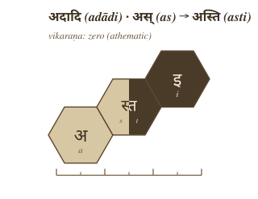
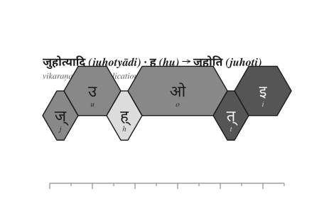
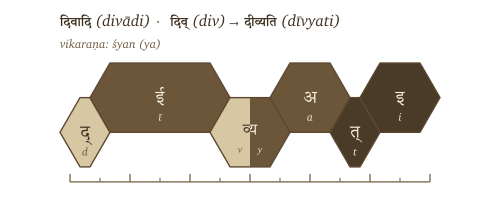
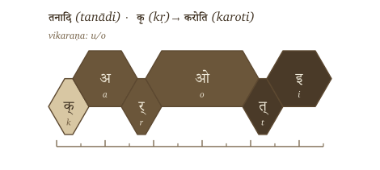
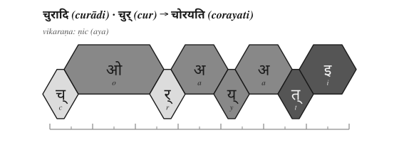

# Chapter 11 — Building the *Kriyā* (क्रिया): Sanskrit's Molecule

## 11.1 From Atom to Operation

Chapter 10 closed with the atom. The *Dhātupāṭha* (धातुपाठ) gives 2,168 filled scaffolds, each one a measured *dhātuḥ* (धातुः), each one built from *varṇāḥ* (वर्णाः) inside a *mātrā* (मात्रा) envelope. The chapter's final question was simple: if Sanskrit is atomic, how does the atom react?

This chapter answers that question.

The *dhātuḥ* is not a "verbal root." That phrase belongs to the botanical metaphor Chapter 1 prosecuted and Chapter 6 discarded. A *dhātuḥ* is also not a word. It cannot simply be lifted from the inventory and used as a finished sentence-form. It is the atom: a sound-bearing semantic unit, compact, timed, scaffolded, and capable of bonding. Chapter 10 showed how that atom is built. Chapter 11 shows how the atom becomes the first molecule.

That first molecule is the ***kriyā*** (क्रिया) — the verbal action-form. A *kriyā* is not a loose word grown from a root. It is an assembled form. The *dhātuḥ* enters an operational class, receives the class-signature, takes the verbal ending, and becomes usable speech while keeping the atom recoverable inside it. The *varṇāḥ* do not become vague. The *mātrā* discipline does not disappear. The molecule remains accountable to the particle-level precision that built the atom in the first place.

The *dhātuḥ* is built from audiomeres. The *kriyā* is built by applying further audiomere-level operations to that atom. The atom does not become a vague "word." It enters a rule-system that still sees its particles.

The basic procedure is:

> ***dhātuḥ + gaṇa-operation / vikaraṇa + tiṅ-pratyaya → kriyā***
>
> धातुः + गण-क्रिया / विकरण + तिङ्-प्रत्ययः → क्रिया

The *Dhātupāṭha* lists the atoms. The **गणाः (*gaṇāḥ*)** are the operational classes. The **विकरणानि (*vikaraṇāni*)** are the class-signatures that put those atoms into motion. The **तिङ्-प्रत्ययाः (*tiṅ-pratyayāḥ*)** are the verbal endings that complete the action-form.

The chapter therefore proceeds by procedure first, statistical audit second — the order §0.11 names as the book's spine. First it shows the operation: how a filled *dhātuḥ* scaffold passes through a *gaṇa*, takes a *vikaraṇa*, and becomes a *kriyā*. Only after that procedure is visible does the chapter count the distribution. The matrix, the tiers, and the reactivity numbers are not the argument's foundation. They are the audit of the procedure.

Pāṇini did not impose this operating table. He decoded it.

## 11.2 The *Vikaraṇa* Procedure

A *gaṇaḥ* (गणः) is an operational class. A *vikaraṇa* (विकरण) is the class-signature that activates a *dhātuḥ* inside that class.[NOTE: vikarana-as-column-signature] It is not decoration. It is the operation that prepares the atom for verbal use.

The first thing to show is not the statistical table. The first thing to show is the procedure itself. A filled scaffold enters a *gaṇa* operation, receives the relevant *vikaraṇa* or class-process, takes the *tiṅ-pratyaya* (तिङ्-प्रत्ययः), and becomes a *kriyā* — a verbal molecule.

> ***filled dhātuḥ → gaṇa / vikaraṇa operation → verbal stem → kriyā***
>
> धातुः → गण / विकरण-क्रिया → धात्वङ्गम् → क्रिया

The simple case is *bhvādi*. The atom is पच् (*pac*). The class-signature is *śap*, whose visible vowel is अ (*a*). The ending supplies ति (*ti*). The output is पचति (*pacati*).

{#fig:building-kriya-pacati-assembly width=80%}

The diagram carries forward the hexagonal vocabulary from Chapter 10, but adds provenance. Light gray is inherited *dhātuḥ* material. Medium gray is *vikaraṇa* material, or a change produced by the *vikaraṇa* operation. Dark gray is the *tiṅ* ending. The lower rail holds the original *dhātuḥ* vowel when it survives unchanged. The upper rail holds introduced or transformed vowels. Consonants stay on the consonantal rail. Adjacent consonants in the assembled form merge into a single hexagon with per-cell provenance colors and a two-pass conjunct render. The *mātrā* line below the per-gaṇa diagrams that follow keeps the timing visible.

That convention matters. It prevents the reader from seeing a finished form as a blur. In पचति (*pacati*), the atom पच् (*pac*) remains recoverable. The *bhvādi* operation adds its class-signature. The ending completes the verbal molecule. The atom has not dissolved into a word. It has reacted.

The same graphic grammar handles more than the default case.

अदादि (*adādi*) can operate with zero visible class-material: अस् (*as*) becomes अस्ति (*asti*) by direct bonding with the ending.

{#fig:building-kriya-vikarana-adadi width=65%}

जुहोत्यादि (*juhotyādi*) uses reduplication: हु (*hu*) becomes जुहोति (*juhoti*).

{#fig:building-kriya-vikarana-juhotyadi width=70%}

दिवादि (*divādi*) uses the *śyan* / य (*ya*) operation: दिव् (*div*) becomes दीव्यति (*dīvyati*).

{#fig:building-kriya-vikarana-divadi width=70%}

तनादि (*tanādi*) shows the compact high-reactivity atom कृ (*kṛ*) entering the *u/o* operation and becoming करोति (*karoti*).

{#fig:building-kriya-vikarana-tanadi width=70%}

चुरादि (*curādi*) uses the productive *ṇic* / अय (*aya*) operation: चुर् (*cur*) becomes चोरयति (*corayati*).

{#fig:building-kriya-vikarana-curadi width=75%}

The operations differ, but the principle does not. A *dhātuḥ* enters an operational class. The class marks how the atom may be activated. The ending completes the verbal form. Sometimes the operation adds visible material. Sometimes the operation is zero. Sometimes it reduplicates. Sometimes it conditions the atom itself through guṇa, lengthening, or another surface change. In every case the finished *kriyā* remains an analyzable assembly.

The proof is Pāṇini's own machinery. The *Aṣṭādhyāyī* does not merely manipulate words. It manipulates *varṇāḥ* — audiomeres — through classes such as *ac*, *hal*, *ik*, *yaṇ*, *jhal*, and *khar*. Sanskrit's atom is built at the audiomere level; its molecule is activated at the same level.

This is why the matrix later in the chapter cannot be treated as a mere count-table. Each cell names a procedure: this kind of atom can pass through this kind of operation. The statistics will audit the procedure. They do not replace it.

## 11.3 The Ten *Gaṇāḥ* as Operations

The full operating roster is ten.

| No. | Gaṇa | Signature | Procedural effect | Example |
|---:|---|---|---|---|
| 1 | *bhvādi* | *śap* / *a* | default thematic activation | *pac* → *pacati* |
| 2 | *adādi* | zero / athematic | direct activation | *ad* → *atti* |
| 3 | *juhotyādi* | reduplication | echo/duplication before activation | *dhā* → *dadhāti* |
| 4 | *divādi* | *śyan* / *ya* | *ya*-extension | *div* → *dīvyati* |
| 5 | *svādi* | *śnu* / *nu/no* | *nu/no* insertion | *su* → *sunoti* |
| 6 | *tudādi* | *śa* / *a* | thematic activation with class behavior | *tud* → *tudati* |
| 7 | *rudhādi* | *śnam* / nasal infix | nasal insertion into atom | *rudh* → *ruṇaddhi* |
| 8 | *tanādi* | *u/o* | *u/o* activation | *kṛ* → *karoti* |
| 9 | *kryādi* | *śnā* / *nā* | *nā*-extension | *krī* → *krīṇāti* |
| 10 | *curādi* | *ṇic* / *aya* | *aya* activation | *cur* → *corayati* |

The *gaṇaḥ* names the operational class. The *vikaraṇa* performs the operation.[VERIFY: present-stem derivations — verify each example against standard present-stem derivation, especially *cur → corayati*, *div → dīvyati*, *rudh → ruṇaddhi*, *krī → krīṇāti*]

## 11.4 The Cell Is a Procedure

A matrix cell is not only a count. It names procedural compatibility.

> ***This scaffold can pass through this gaṇa operation.***

That is why the cell matters. A heavy cell marks a preferred corridor. An empty cell marks an operation the architecture does not use for that scaffold. The matrix is not a spreadsheet imposed on Sanskrit from outside. It is the visible map of which constructed atoms can enter which operations.

## 11.5 *Racanā* and *Gaṇa* Are Two Axes

Now the matrix can land.

*Racanā* describes construction: CV1C, CCV1C, CV1CC, CV2C, and the rest. *Gaṇaḥ* describes operation: how the atom behaves when the grammar puts it to work. Construction and operation are different axes. The matrix is where the two meet.

After *anubandha* stripping, the 2,168-entry *Dhātupāṭha* inhabits 47 observed *racanā* scaffolds. The top ten scaffolds carry 1,973 entries — **91.01%** of the inventory. Those ten scaffolds do not distribute randomly across the ten *gaṇāḥ*.[NOTE: racana-gana-matrix]

{#fig:ganah-racana-gana-matrix width=100%}

The central corridor is visible immediately. The **गमादि (*gamādi*)** scaffold, CV1C, appears in all ten *gaṇāḥ* and carries 926 atoms by itself. It is the dominant construction corridor. The *bhvādi* class is the largest operational landing zone, with 1,134 atoms overall and 452 *gamādi* atoms alone. The *curādi* class is the systematic runner-up for many closed scaffolds. The *kryādi* class attracts long-vowel open shapes. The smaller *gaṇāḥ* are not random leftovers; they concentrate in shapes suited to their operation.

The *gaṇaḥ* is not the scaffold. The scaffold is not the *gaṇaḥ*. One measures construction. The other measures operation. Their intersection shows where the architecture allows a *dhātuḥ* to stand.

## 11.6 Heavy Cells, Empty Cells

The matrix is not just a count-table. It is an operational map.

Heavy cells show preferred corridors. **CV1C × *bhvādi*** is the default highway. **CV1C × *curādi*** is the productive *aya* corridor. Long-vowel open shapes lean toward *kryādi*. Reduplication avoids heavy cluster shapes.

Empty cells matter as much as the filled ones. Only 140 of the possible 470 scaffold × *gaṇa* cells are populated. Sanskrit is not merely allowing every shape to enter every operation. The system permits some pairings and refuses others.

A table is not only a map of where atoms go. It is a map of where they cannot go. The architecture permits some shape-operation pairings and refuses the rest.

## 11.7 Reactivity Audit

After the procedure is visible, the statistics enter as audit.

**Valency**, for a Sanskrit atom, is the count of distinct bonding configurations a *dhātuḥ* produces in actual Sanskrit use. The head-bond is the **उपसर्गः (*upasargaḥ*)**: *pra-*, *vi-*, *sam-*, *abhi-*, *anu-*, and the rest of the preverb set. The tail-bond is the **प्रत्ययः (*pratyayaḥ*)**: the suffix class that activates the atom into finite, participial, infinitival, or derivative form. A distinct (*upasarga*, *pratyaya*-class) pairing that appears in the parsed Sanskrit record counts as one valency unit.

The reference record here is the Digital Corpus of Sanskrit: 15,900 parsed Sanskrit files, more than a million verb-form occurrences, and 3,839 distinct verbal atoms in use.[NOTE: path-c-corpus-attested-valency] The analysis does not ask whether a *dhātuḥ* is important in theory. It asks how many ways Sanskrit actually uses it.

**कृ (*kṛ*)** carries valency 1,062. **भू (*bhū*)** carries 504. **धा (*dhā*)** carries 386. **हृ (*hṛ*)** carries 368. **गम् (*gam*)** carries 291. These are not prestige rankings. They are measured bonding counts.

Three measurement paths frame the result. Path A counts dictionary derivatives in Monier-Williams and Apte for a curated sample. Path B would count the full *Aṣṭādhyāyī* affix-licensing space; that remains future work. Path C, used here, counts what appears in the parsed corpus. On the matched Monier-Williams subset, Path A and Path C correlate at **Spearman ρ = +0.6647**. Two different instruments see the same signal.

The atoms arrange into three empirical tiers.

**Polyvalent — the carbon class.** Valency 50 and above. One hundred forty-seven atoms qualify: **3.8%** of the verbal atoms visible in the corpus.[NOTE: dcs-vs-dhatupatha-count] This small tier produces **67.6%** of all verb-token occurrences. The canonical exemplars are **कृ (*kṛ*)**, **भू (*bhū*)**, **स्था (*sthā*)**, **गम् (*gam*)**, **ज्ञा (*jñā*)**, **दा (*dā*)**, **धा (*dhā*)**, **नी (*nī*)**, and **हृ (*hṛ*)**. These nine alone produce 26.5% of the verb-token record.

**Bivalent — the stable middle.** Valency 5 to 49. One thousand fifty-nine atoms qualify: **27.6%** of the verbal atoms visible in the corpus, producing **30.5%** of the verb-token record. They combine productively, but not with carbon-class reach.

**Monovalent — the closed-valency specialists.** Valency 1 to 4. Two thousand six hundred thirty-three atoms qualify: **68.6%** of the verbal atoms visible in the corpus, producing only **1.9%** of the verb-token record. This is the long tail: specialized, rare, technical, recension-bound, or context-specific atoms. The *Dhātupāṭha* preserves them. Sanskrit barely deploys many of them.

The distribution is the signal. The top 9 atoms produce 26.5% of the verb-token record. The top 20 produce 38.3%. The top 100 produce 67.5%. The top 500 — only about 13% of the verbal atoms visible in the corpus — produce 94%.

The similarity with natural languages must be admitted first. Natural languages also concentrate use. English leans heavily on *be*, *have*, *do*, *go*, and *make*; every living speech-field develops a small high-frequency core and a long tail. Frequency concentration by itself proves nothing.

Sanskrit is different because the concentration is coupled to architecture.[NOTE: productivity-inversion-natural-language]

| Natural-language pattern | Sanskrit pattern |
|---|---|
| A few whole words or forms become very frequent. | A few *dhātavaḥ* become highly reactive atoms. |
| High-frequency forms often erode, supplete, or become idiosyncratic: English *be*, *have*, *do*; Latin *esse*, *ire*, *ferre*; Greek *eimi*, *oida*, *phēmi*. | The highest-reactivity atoms remain compact and grammatically usable: *kṛ*, *bhū*, *dhā*, *hṛ*, *gam*, *nī*, *jñā*, *dā*, *sthā*. |
| Frequency often protects irregularity because speakers master common forms as wholes. | Reactivity preserves decomposability because the atom keeps bonding through *upasargāḥ* and *pratyayāḥ*. |
| The surface list shifts by genre, region, and era. | The same high-reactivity core remains visible across the tested Sanskrit use-domains (§11.10). |

The difference is therefore not concentration alone. It is concentration plus compactness, concentration plus regular bonding, concentration plus scaffold order, concentration plus cross-domain stability. Path C gives Spearman ρ = **-0.4334** between valency and particle count; the matched dictionary subset gives **-0.490**.

The higher the yield, the smaller the atom.

That is not drift. That is design.

**The similarity proves Sanskrit is usable speech. The difference proves it is engineered speech.**

## 11.8 Hyper-Reactive Atoms

The carbon-class metaphor is not decorative. Carbon matters in chemistry because it bonds widely and builds large molecular space from a small structural center. Sanskrit's polyvalent atoms do the same work in the word-engine.

**कृ (*kṛ*)** is the cleanest case. It is a compact *krādi* atom and the most reactive item in the corpus record. It bonds across the full preverb and suffix space. It generates ordinary words, technical words, philosophical words, compounds, participles, abstract nouns, ritual forms, and everyday forms. Its smallness is part of its power. Its power is not frequency alone. Its power is procedural availability.

The same pattern holds across the canonical core. *Bhū* (भू), *dhā* (धा), *hṛ* (हृ), *gam* (गम्), *nī* (नी), *jñā* (ज्ञा), *dā* (दा), and *sthā* (स्था) are not large, unstable, expressive forms that became frequent by accident. They are compact atoms with enormous bonding range.

Chapter 10 established atomic concision: maximum recoverable structure in minimum form. Chapter 11 shows why the principle matters. The compact atom can bond. The compact atom can travel. The compact atom can generate.

The *Dhātupāṭha* is therefore not a vocabulary list. It is an inventory of reactive atoms.

## 11.9 The Procedure's Shadow

Procedure and structure are coupled. The figure makes the coupling visible as a 2D arrangement — but the arrangement is the visual shadow of the procedure, not an independent periodicity claim.

The arrangement carries more than one visible axis. One axis is the *gaṇaḥ*: the operational class Pāṇini documented. Another is the *racanā*: the measured scaffold Chapter 10 surfaced. A third is the consonantal structure of the atom itself: the *varga* column of the first consonant. A fourth is the inherent vowel.

The current periodic-axes figure places corpus-visible *dhātavaḥ* by initial *varga* column and inherent vowel. Marker size and color encode Path C reactivity tier; the canonical nine are labeled.[NOTE: varga-column-as-engineering-axis]

{#fig:ganah-periodic-axes width=100%}

The figure should not be read as the only possible table. The analysis tested multiple axes. Inherent vowel produces the sharpest split in the valency distribution; vowel-ऋ atoms generate 13.6% of corpus tokens from 3.3% of the verbal atoms visible in the corpus, with mean valency 34.35.[NOTE: inherent-vowel-secondary-axis] The *varga* column remains structurally decisive because it ties the *dhātuḥ* back to the *varṇamālā*'s articulatory grid. These are not competing facts. They are orthogonal dimensions of the same architecture.

The structure shows because the operation requires it. *Kṛ*, *hṛ*, and *vṛt* carry ऋ. *Dhā*, *dā*, *sthā*, *jñā*, and *yā* carry आ. *Gam*, *kram*, *han*, and *pad* carry अ. The C4 voiced-aspirate column is enriched in *juhotyādi*: 33.3% in the inventory and 42.9% in the corpus-attested subset.[NOTE: cross-gana-column-distribution] The engineering does not distribute sounds evenly. It distributes them functionally.

Position is not decoration. Position carries behavior. The figure is not the chapter's center. It is the statistical shadow cast by the procedure.

## 11.10 Stability Across Use

A reactive core could still be a genre accident. The corpus test says it is not.

The analysis compares four Sanskrit use-domains inside the Digital Corpus of Sanskrit: **ऋग्वेद (*Ṛgveda*)**, **अथर्ववेद (*Atharvaveda*) Śaunaka**, **महाभारत (*Mahābhārata*)**, and **रामायण (*Rāmāyaṇa*)**. The first two are *śruti* corpora. The second two are *smṛti* / *itihāsa* corpora. They serve different purposes, carry different materials, and deploy different registers.

The canonical nine polyvalent atoms — *kṛ, bhū, sthā, gam, jñā, dā, dhā, nī, hṛ* — are **9/9 attested** in every sub-corpus.[NOTE: cross-corpus-invariance] The *smṛti* corpora carry all nine in their top-20 lists. The *śruti* corpora carry six of nine in their top-20 lists, with ritual-specific atoms such as *vah* (वह्), *yam* (यम्), *bhṛ* (भृ), and *cakṣ* (चक्ष्) entering the top tier.

{#fig:ganah-canonical-rank-trajectory width=90%}

The deployments vary. The core remains.

That is exactly what an engineered inventory predicts. The architecture provides a stable set of high-reactivity atoms; different domains apply them to different work. The Vedic corpus, the epic corpus, the philosophical corpus, and the later learned corpus do not need identical surface usage. They need the same engine.

They have it.

## 11.11 Pāṇini Decoded Operations

The *Dhātupāṭha* is not a list of botanical roots. It is not a schoolbook appendix. It is not a codified vocabulary. It is an inventory of reactive atoms.

The *gaṇāḥ* are not arbitrary conjugation bins. They are operational classes. The *vikaraṇāni* are not decorative insertions. They are the signatures of those operations. The *racanāḥ* are not naming conveniences. They are construction scaffolds. Valency is not metaphor. It is measured bonding behavior.

Together they form a table.

Pāṇini did not freeze a drifting language. He decoded an operating table.

**Sanskrit was engineered. Encoded in the Vedas. Decoded by many. Pāṇini's decoding is the finest.** The *Dhātupāṭha* he decoded is Sanskrit's table of reactive atoms. Mendeleev gave chemistry its periodic table in 1869.[NOTE: mendeleev-1869-table] Sanskrit's has been operating for thousands of years.

Chapter 12 turns from operational class to bonding chemistry: how *dhātavaḥ* combine with *upasargāḥ* and *pratyayāḥ* to produce the *śabdāḥ* Sanskrit deploys.
