# Chapter 11 — Building the *Kriyā* (क्रिया): Sanskrit's Molecule

## 11.1 From Atomic Sūtra to Verbal Molecule

Chapter 10 closed with the *dhātuḥ* as an atomic *sūtra*. The **धातुपाठ (*Dhātupāṭha*)** gives 2,168 filled scaffolds. Each one is a measured **धातुः (*dhātuḥ*)** built from **वर्णाः (*varṇāḥ*)** — sonomers — inside a **मात्रा (*mātrā*)** envelope.

The atom is not yet action. A *dhātuḥ* cannot simply be lifted from the inventory and used as a finished sentence-form. It is not a "verbal root," and it is not a word. It is a compact sonomeric semantic unit capable of bonding.

This chapter follows that atom into action. The first major product is the **क्रिया (*kriyā*)**, or **क्रियापदम् (*kriyāpadam*)** — the verbal word. In this book's corollary, it is a *kriyāpada* molecule: an assembled action-form produced when the *dhātuḥ* passes through operation.

The question is whether the engineering survives that move. Does the atom dissolve into a vague word, or does Sanskrit continue to see the sonomers inside it? Sanskrit's answer is visible in the procedure. The *varṇamālā* selects the measured sound-particles; the *dhātuḥ* binds them into a semantic atom; the *kriyāpada* activates that atom without blurring the layer underneath. Sanskrit remains sonomeric from inventory to atom to molecule.

The chapter begins with five mantra-lines from the Vedic corpus. Each line already contains a finished *kriyāpada* in use. The examples vary by sonomeric length: the underlying *dhātavaḥ* occupy five timing envelopes, from 1 to 3 *mātrās*. The figures make the synthesis visible: sonomers already present inside the atom combine with added sonomers supplied by the verbal procedure, and the compact atom remains recoverable inside the larger form.

These forms, and thousands like them, existed before Pāṇini named the operations.[NOTE: vedic-kriyapadas-before-panini]

## 11.2 The Vedic Procedure Before Pāṇini

The five examples below are all Rigvedic. The quoted lines are *padapāṭha* excerpts, so the inspected *kriyāpada* remains visible before *saṃhitā* sandhi recombines it.[NOTE: rigvedic-kriya-examples] The point is not to teach five conjugations. The point is to show the procedure already working: semantic atoms receive further sonomers and become *kriyāpada* molecules.

### 1 *mātrā*: इ (*i*) → एति (*eti*)

> तन्यतुः । मरुताम् । **एति** । धृष्णुया ।
>
> *tanyatuḥ | marutām |* ***eti*** *| dhṛṣṇuyā* |
>
> RV 1.23.11b

The atom is इ (*i*), a one-*mātrā* vowel atom. In **एति (*eti*)**, the atom appears as ए (*e*) and receives ति (*ti*).

> इ (*i*) → ए (*e*) + ति (*ti*) → एति (*eti*)

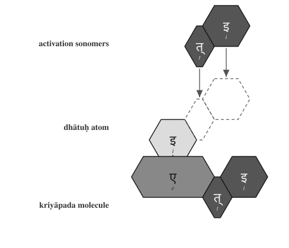{#fig:building-kriya-vedic-eti width=75%}

### 1.5 *mātrās*: अस् (*as*) → अस्ति (*asti*)

> नहि । वाम् । **अस्ति** । दूरके ।
>
> *nahi | vām |* ***asti*** *| dūrake* |
>
> RV 1.22.4a

The atom is अस् (*as*), a one-and-a-half-*mātrā* form: short vowel plus consonant. In **अस्ति (*asti*)**, the atom remains visible and ति (*ti*) bonds directly to it.

> अस् (*as*) + ति (*ti*) → अस्ति (*asti*)

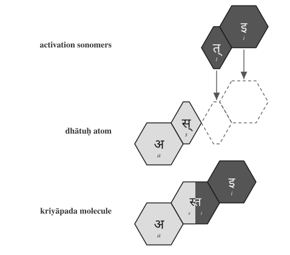{#fig:building-kriya-vedic-asti width=75%}

### 2 *mātrās*: यज् (*yaj*) → यजति (*yajati*)

> पिता । आपिः । **यजति** । आपये ।
>
> *pitā | āpiḥ |* ***yajati*** *| āpaye* |
>
> RV 1.26.3b

The atom is यज् (*yaj*), a two-*mātrā* consonant-framed short-vowel atom. In **यजति (*yajati*)**, the atom receives an added अ (*a*) before ति (*ti*).

> यज् (*yaj*) + अ (*a*) + ति (*ti*) → यजति (*yajati*)

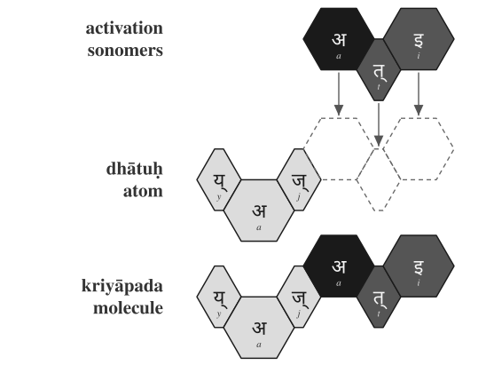{#fig:building-kriya-vedic-yajati width=75%}

### 2.5 *mātrās*: भू (*bhū*) → भवति (*bhavati*)

> क्रतुः । **भवति** । उक्थ्यः ।
>
> *kratuḥ |* ***bhavati*** *| ukthyaḥ* |
>
> RV 1.17.5c

The atom is भू (*bhū*), a two-and-a-half-*mātrā* form: consonant plus long vowel. In **भवति (*bhavati*)**, the long vowel material changes into भव् (*bhav*), and अ (*a*) + ति (*ti*) complete the molecule.

> भू (*bhū*) → भव् (*bhav*) + अ (*a*) + ति (*ti*) → भवति (*bhavati*)

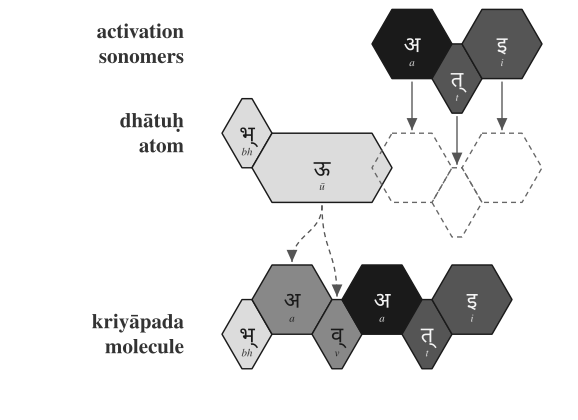{#fig:building-kriya-vedic-bhavati width=75%}

### 3 *mātrās*: राज् (*rāj*) → राजति (*rājati*)

> अग्निः । देवेषु । **राजति** ।
>
> *agniḥ | deveṣu |* ***rājati*** |
>
> RV 5.25.4a

The atom is राज् (*rāj*), a three-*mātrā* scaffold: consonant, long vowel, consonant. In **राजति (*rājati*)**, the atom receives अ (*a*) and ति (*ti*).

> राज् (*rāj*) + अ (*a*) + ति (*ti*) → राजति (*rājati*)

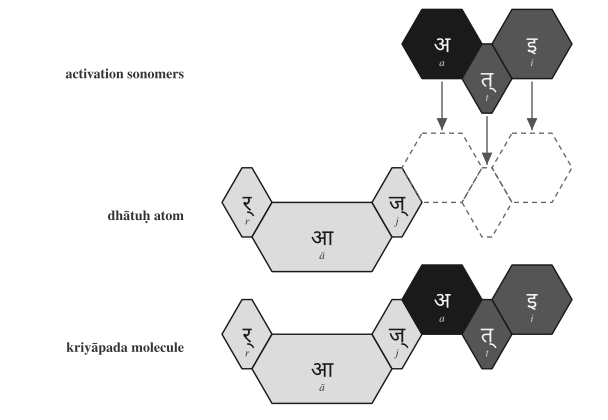{#fig:building-kriya-vedic-rajati width=75%}

The figures use one visual convention. The first row shows activation sonomers. The second row shows the *dhātuḥ* atom and the dashed destination slots where new sonomers will enter. The third row shows the finished *kriyāpada* molecule. Light gray marks original *dhātuḥ* material. Medium gray marks *dhātuḥ* material that changes shape. Very dark cells mark activation sonomers such as the added अ (*a*). Dark cells mark the ति (*ti*) ending.

The color scheme is a reading aid. The argument is recoverability. इ becomes एति. अस् becomes अस्ति. यज् becomes यजति. भू becomes भवति. राज् becomes राजति. Sometimes the atom's sonomers remain unchanged; sometimes they transform. In each case, the atom remains visible enough for the procedure to be read.

The Vedic corpus already displays these operations. The figures only make the implicit procedure visible. The atomic *sūtra* survives activation: compact, traceable, and available inside the verbal molecule.

These are the operations Pāṇini later documented. He gives them names: गणः (*gaṇaḥ*), विकरणम् (*vikaraṇam*), तिङ्-प्रत्ययः (*tiṅ-pratyayaḥ*), अनुबन्धः (*anubandhaḥ*). The next section repeats the same process using Pāṇini's terminology.

Chapter 13 §13.5 develops the larger calibration principle. Here the procedural point is enough: the Vedic corpus already carries working *kriyāpadāni* before Pāṇini names the operations. The Veda preserves the form as performed. Pāṇini preserves the form as derivable.

## 11.3 Pāṇini's Notation Layer

The previous section showed the implicit procedure at work. The Vedic corpus already contains finished *kriyāpadāni*: sonomers inside the *dhātuḥ* atom combine with additional sonomers, and the result is a stable verbal molecule.

This section names the same process in Pāṇini's notation. Pāṇini did not create the activation layer. He documented it, compressed it, and made it teachable. The same five examples now return with the labels Pāṇini gave the process.

In that explicit notation, a *dhātuḥ* must do three things before it becomes a *kriyāpada* molecule:

1. It must belong to an operating class.
2. It must receive the operation appropriate to that class.
3. It must take the verbal ending that completes the action-form.

Sanskrit's operating classes are the **गणाः (*gaṇāḥ*)**. The class-operation is marked by a **विकरणम् (*vikaraṇam*)**, or by another class process such as zero operation, transformation, or reduplication. The verbal endings are the **तिङ्-प्रत्ययाः (*tiṅ-pratyayāḥ*)**.

In Pāṇini's notation, that gives the basic procedure:

> ***dhātuḥ + gaṇa-operation / vikaraṇa + tiṅ-pratyayaḥ → kriyāpada***
>
> धातुः + गण-क्रिया / विकरण + तिङ्-प्रत्ययः → क्रियापदम्

The formula compresses the procedure. It does not replace the procedure.

A *gaṇaḥ* (गणः) is not a drawer in a schoolbook. It is an operational class. It tells the grammar how a *dhātuḥ* behaves when it is being prepared for verbal use.

A *vikaraṇa* (विकरण) is the class-signature or class-operation that activates the *dhātuḥ* inside that class.[NOTE: vikarana-as-column-signature] It is not decoration. It is the operation between the atom and the ending.

The **अङ्गम् (*aṅgam*)** is the activated intermediate: the *dhātuḥ* atom after the operation has prepared it to receive the ending. It is still not the finished molecule.

The sequence is straightforward:

1. Start with the *dhātuḥ*.
2. Identify its *gaṇaḥ*.
3. Apply the *gaṇa* operation or *vikaraṇa*.
4. Form the **अङ्गम् (*aṅgam*)**, the activated intermediate that can receive the ending.
5. Add the *tiṅ-pratyayaḥ* (तिङ्-प्रत्ययः).
6. The result is the *kriyāpada* (क्रियापदम्), the *kriyāpada* molecule.

> ***filled dhātuḥ → gaṇa / vikaraṇa operation → aṅgam → kriyāpada***
>
> धातुः → गण / विकरण-क्रिया → अङ्गम् → क्रियापदम्

The five Vedic examples can now be read in Pāṇini's notation layer.

**इ (*i*) → एति (*eti*).** In Pāṇini's naming, this belongs in the *adādi* class. The visible operation is transformation: इ (*i*) appears as ए (*e*). The *tiṅ* ending तिप् (*tip*) contributes ति (*ti*). The molecule is एति (*eti*).

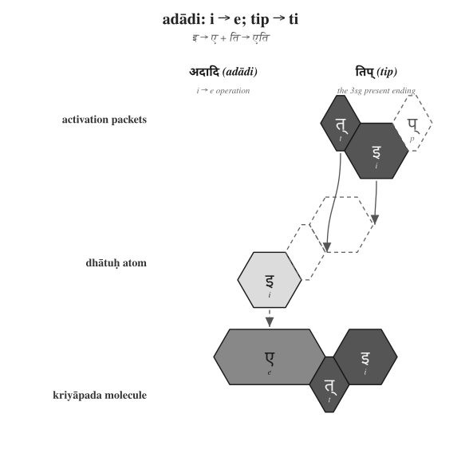{#fig:building-kriya-panini-eti width=75%}

**अस् (*as*) → अस्ति (*asti*).** This also belongs in the *adādi* class. No visible class vowel is inserted. The *dhātuḥ* bonds directly with ति (*ti*), and the स् + त् contact becomes the visible स्त् cluster. The molecule is अस्ति (*asti*).

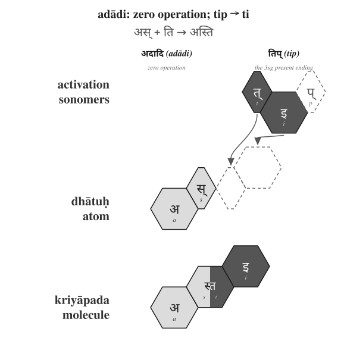{#fig:building-kriya-panini-asti width=75%}

**यज् (*yaj*) → यजति (*yajati*).** This belongs in the *bhvādi* class. The class-signature is शप् (*śap*): the anubandhas disappear, and the visible survivor is अ (*a*). The *tiṅ* ending contributes ति (*ti*). The molecule is यजति (*yajati*).

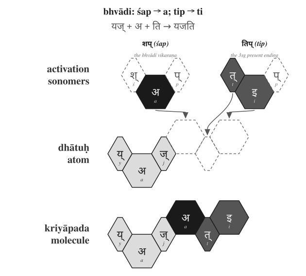{#fig:building-kriya-panini-yajati width=75%}

**भू (*bhū*) → भवति (*bhavati*).** This also belongs in the *bhvādi* class. The operation changes भू (*bhū*) into भव् (*bhav*), the शप् (*śap*) operation contributes अ (*a*), and तिप् (*tip*) contributes ति (*ti*). The molecule is भवति (*bhavati*).

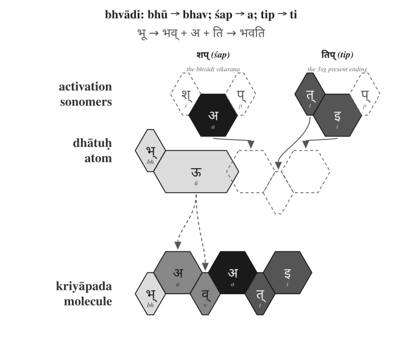{#fig:building-kriya-panini-bhavati width=75%}

**राज् (*rāj*) → राजति (*rājati*).** This belongs in the *bhvādi* class. The शप् (*śap*) operation contributes अ (*a*), and तिप् (*tip*) contributes ति (*ti*). The molecule is राजति (*rājati*).

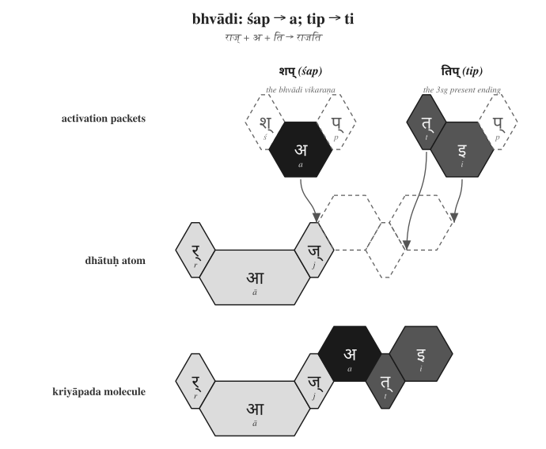{#fig:building-kriya-panini-rajati width=75%}

The figures use the same hexagonal vocabulary as §11.2, but the top row now shows Pāṇini's notation layer. शप् (*śap*) and तिप् (*tip*) appear as technical source forms. The dashed cells mark अनुबन्धाः (*anubandhāḥ*) — metadata markers that disappear. The surviving sonomers enter the *dhātuḥ* atom. The action has not changed. The labels have changed. What was implicit in the Vedic examples is now named in Pāṇini's notation: *gaṇaḥ*, *vikaraṇam*, *aṅgam*, *tiṅ-pratyayaḥ*, *anubandhaḥ*.

That distinction matters. The operation existed before the notation. Pāṇini gave the process handles. He did not make Sanskrit molecular by naming the bonds.

The operations differ, but the principle does not. A *dhātuḥ* enters an operational class. The class marks how the atom may be activated. The ending completes the *kriyāpada* molecule.

Sometimes the operation adds visible material. Sometimes the operation is zero. Sometimes it changes the atom itself through guṇa, lengthening, or another surface effect. In every case, the finished *kriyāpada* remains an analyzable assembly.

The proof is Pāṇini's own machinery. The *Aṣṭādhyāyī* does not merely manipulate words. It manipulates *varṇāḥ* — sonomers — through classes such as *ac*, *hal*, *ik*, *yaṇ*, *jhal*, and *khar*. Sanskrit's atom is built at the sonomeric level; its molecule is activated at the same level.

The procedure is therefore still sonomer-level. The *dhātuḥ* is a sonomeric construction. The *kriyā* remains sonomeric. The fractal recurrence has now crossed from atom to molecule: the same measured particles remain visible inside the next scale of assembly.

This is why the matrix later in the chapter cannot be treated as a mere count-table. Each cell names a procedure: this kind of atom can pass through this kind of operation.

The statistics audit the procedure. They do not replace it.

## 11.4 The Ten *Gaṇāḥ* as Operations

The full operating roster has ten classes.

| No. | Gaṇa | Signature | Procedural effect | Example |
|---:|---|---|---|---|
| 1 | भ्वादि (*bhvādi*) | शप् (*śap*) / अ (*a*) | default thematic activation | पच् (*pac*) → पचति (*pacati*) |
| 2 | अदादि (*adādi*) | शून्य (*śūnya*) / athematic | direct activation | अद् (*ad*) → अत्ति (*atti*) |
| 3 | जुहोत्यादि (*juhotyādi*) | अभ्यास (*abhyāsa*) | echo/duplication before activation | धा (*dhā*) → दधाति (*dadhāti*) |
| 4 | दिवादि (*divādi*) | श्यन् (*śyan*) / य (*ya*) | *ya*-extension | दिव् (*div*) → दीव्यति (*dīvyati*) |
| 5 | स्वादि (*svādi*) | श्नु (*śnu*) / नु-नो (*nu-no*) | *nu/no* insertion | सु (*su*) → सुनोति (*sunoti*) |
| 6 | तुदादि (*tudādi*) | श (*śa*) / अ (*a*) | thematic activation with class behavior | तुद् (*tud*) → तुदति (*tudati*) |
| 7 | रुधादि (*rudhādi*) | श्नम् (*śnam*) / nasal infix | nasal insertion into atom | रुध् (*rudh*) → रुणद्धि (*ruṇaddhi*) |
| 8 | तनादि (*tanādi*) | उ-ओ (*u-o*) | *u/o* activation | कृ (*kṛ*) → करोति (*karoti*) |
| 9 | क्र्यादि (*kryādi*) | श्ना (*śnā*) / ना (*nā*) | *nā*-extension | क्री (*krī*) → क्रीणाति (*krīṇāti*) |
| 10 | चुरादि (*curādi*) | णिच् (*ṇic*) / अय (*aya*) | *aya* activation | चुर् (*cur*) → चोरयति (*corayati*) |

The *gaṇaḥ* names the operational class. The *vikaraṇa* performs the operation. The examples in the last column are anchors: they show one familiar visible output of each operation, not a full derivation lesson.

One pattern matters before the matrix appears. The visible consonant-bearing class operations do not choose arbitrary consonants. *Divādi* and *curādi* use य (*ya*). *Svādi*, *rudhādi*, and *kryādi* use न (*na*). Chapter 10 and Appendix 5 identify both as cluster-joining specialists inside the atom. The same bonding sonomers that help hold dense atoms together are reused when the atom is activated into a molecule. The architecture is not changing vocabulary at the next scale. It is reusing its specialists.

## 11.5 The *Racanā-Gaṇa* Matrix

The ten *gaṇāḥ* describe operations. The *racanāḥ* describe construction. The matrix is where the two axes meet.

*Racanā* describes the measured scaffold: **गमादि (*gamādi*)** , **स्पदादि (*spadādi*)** , **मन्थादि (*manthādi*)** , **वाचादि (*vācādi*)** , and the rest. *Gaṇaḥ* describes how the atom behaves when grammar puts it to work. A matrix cell is therefore not only a count. It names a permitted procedure:

> ***This scaffold can pass through this gaṇa operation.***

After *anubandha* stripping, the 2,168-entry *Dhātupāṭha* inhabits 47 observed *racanā* scaffolds. The top ten scaffolds carry 1,973 entries — **91.01%** of the inventory. Those ten scaffolds do not distribute randomly across the ten *gaṇāḥ*.[NOTE: racana-gana-matrix]

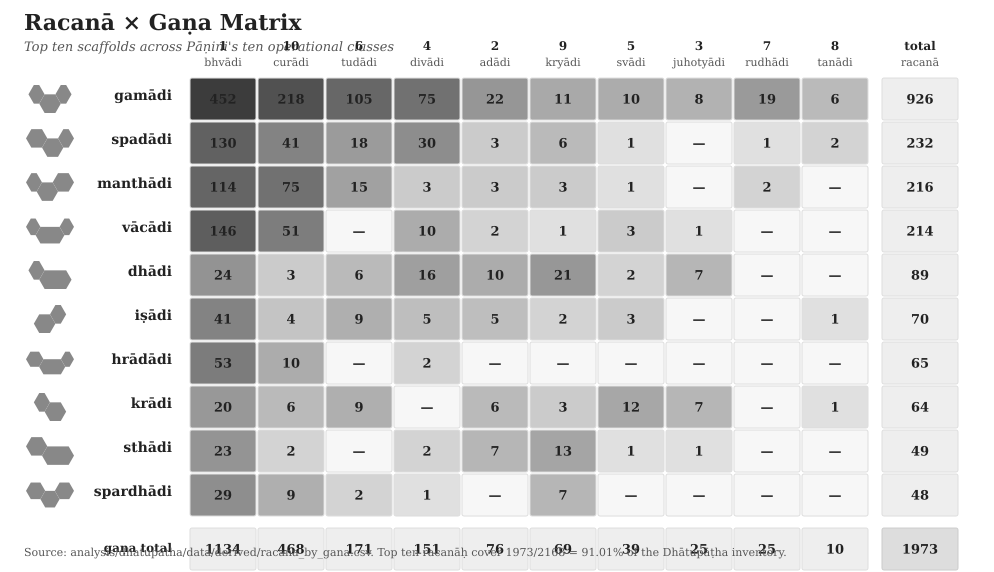{#fig:ganah-racana-gana-matrix width=100%}

The central corridor is visible immediately. The **गमादि (*gamādi*)**  scaffold appears in all ten *gaṇāḥ* and carries 926 atoms by itself. It is the dominant construction corridor. The *bhvādi* class is the largest operational landing zone, with 1,134 atoms overall and 452 *gamādi* atoms alone.

The other concentrations are also patterned. The *curādi* class is the systematic runner-up for many closed scaffolds. The *kryādi* class attracts long-vowel open shapes. The smaller *gaṇāḥ* are not random leftovers. They concentrate in shapes suited to their operation.

The *gaṇaḥ* is not the scaffold. The scaffold is not the *gaṇaḥ*. One measures construction. The other measures operation. Their intersection shows where the architecture allows a *dhātuḥ* to stand.

Heavy cells show preferred corridors. **गमादि (*gamādi*)**  × *bhvādi* is the default highway. **गमादि (*gamādi*)**  × *curādi* is the productive *aya* corridor. Long-vowel open scaffolds lean toward *kryādi*. Reduplication avoids heavy cluster shapes.

Empty cells matter as much as filled cells. Only 140 of the possible 470 scaffold × *gaṇa* cells are populated. Sanskrit does not allow every shape to enter every operation. The system permits some pairings and refuses others.

A table is not only a map of where atoms go. It is a map of where they cannot go. Engineering is visible not only in what the system permits, but in what it refuses.

## 11.6 Reactivity Audit

The procedure is now visible: a *dhātuḥ* enters an operation and becomes a *kriyāpada* molecule. The next question is whether that procedure leaves a measurable trace in Sanskrit use. If the atoms are real engineering units, the corpus should not behave like a flat word-list. Some atoms should show a wide bonding range. Others should remain narrow specialists. The distribution should reveal an operating engine.

Two audits are used in this section.

| Audit type | Purpose | Source | Details |
|---|---|---|---|
| **Dictionary audit** | Test how much vocabulary a *dhātuḥ* can generate | Monier-Williams and Apte | Curated sample of *dhātavaḥ*; counts derivative spread in the dictionaries |
| **प्रयोग (*prayoga*) audit** | Test how *dhātavaḥ* actually work in Sanskrit use | Digital Corpus of Sanskrit | Parsed corpus; counts actual verb-form occurrences and distinct bonding patterns |

The dictionary audit asks a dictionary question: when a *dhātuḥ* is listed in Monier-Williams or Apte, how many derivative forms does the dictionary show it generating? The *prayoga* audit asks a use-question: when Sanskrit texts are parsed, which *dhātavaḥ* actually appear, how often do they appear, and how many different bonding patterns do they enter?

The working record for the *prayoga* audit is the Digital Corpus of Sanskrit: 15,900 parsed Sanskrit files and more than a million verb-form occurrences.[NOTE: prayoga-audit-valency] The corpus includes familiar materials such as the *Ṛgveda*, the *Atharvaveda* Śaunaka, the *Mahābhārata*, and the *Rāmāyaṇa*, along with a much wider parsed Sanskrit record. The corpus is useful here because its files do more than preserve surface words. Where the parsing permits it, a verbal form is linked back to the *dhātuḥ* label behind the form and marked for the *upasargaḥ* (उपसर्गः) and broad *pratyayaḥ* (प्रत्ययः) class involved.

That gives the chapter a concrete measurement. For each *dhātuḥ* visible in the corpus, the audit counts two things: how often forms from that atom appear, and how many different bonding patterns the atom enters. The head-bond is the *upasargaḥ*: *pra-*, *vi-*, *sam-*, *abhi-*, *anu-*, and the rest of the preverb set. The tail-bond is the *pratyayaḥ*: the suffix class that activates the atom into finite, participial, infinitival, or derivative form. Every distinct (*upasarga*, *pratyaya*-class) pairing visible in the parsed record counts as one unit of **valency**.

Valency therefore means bonding range. A low-valency atom appears in only a few configurations. A high-valency atom bonds across many configurations. This is the verbal equivalent of chemical reactivity.

The *prayoga* audit then proceeds in three steps. It identifies every *dhātuḥ* label the corpus makes visible. It counts the atom's actual uses and distinct bonding patterns. It then compares that bonding range against the atom's sonomeric size and against the dictionary audit.

The first result is that the corpus is not flat. A small set of atoms carries very wide bonding range.

| Dhātuḥ | Valency |
|---|---:|
| **कृ (*kṛ*)** | 1,062 |
| **भू (*bhū*)** | 504 |
| **धा (*dhā*)** | 386 |
| **हृ (*hṛ*)** | 368 |
| **गम् (*gam*)** | 291 |

These are not prestige rankings. They are measured bonding counts.

The second result is that the two independent instruments agree. On the matched Monier-Williams subset, the dictionary audit and the *prayoga* audit have a correlation value of **+0.66**. That means the two audits move together strongly: atoms that generate widely in the dictionaries also tend to bond widely in actual Sanskrit use. They are not measuring exactly the same thing, but they see the same signal: the same compact atoms keep generating, bonding, and appearing.

The third result is the tier structure. The corpus-visible *dhātuḥ* labels arrange into three empirical groups. The chart makes the skew visible: a small polyvalent tier carries most actual use, while the long tail remains preserved as specialist material.

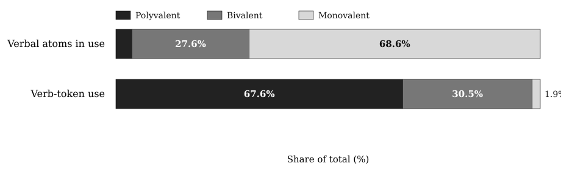{#fig:ganah-reactivity-tiers width=88%}

| Tier | Valency range | Corpus-visible *dhātuḥ* labels | Share of verb-token use | Role |
|---|---:|---:|---:|---|
| Polyvalent — the carbon class | 50+ | 147 (**3.8%**) | **67.6%** | high-bonding core |
| Bivalent — the stable middle | 5–49 | 1,059 (**27.6%**) | **30.5%** | productive middle |
| Monovalent — closed-valency specialists | 1–4 | 2,633 (**68.6%**) | **1.9%** | preserved long tail |

The canonical polyvalent exemplars are **कृ (*kṛ*)**, **भू (*bhū*)**, **स्था (*sthā*)**, **गम् (*gam*)**, **ज्ञा (*jñā*)**, **दा (*dā*)**, **धा (*dhā*)**, **नी (*nī*)**, and **हृ (*hṛ*)**.[NOTE: dcs-vs-dhatupatha-count] These nine alone produce 26.5% of the verb-token record.

The distribution is the signal.

| Corpus-visible set | Share of verb-token record |
|---|---:|
| Top 9 | **26.5%** |
| Top 20 | **38.3%** |
| Top 100 | **67.5%** |
| Top 500 | **94.0%** |

The similarity with natural languages must be admitted first. Natural languages also concentrate use. English leans heavily on *be*, *have*, *do*, *go*, and *make*. Every living speech-field develops a small high-frequency core and a long tail.

Frequency concentration by itself proves nothing.

Sanskrit is different because its concentration is coupled to architecture.[NOTE: productivity-inversion-natural-language]

| Natural-language pattern | Sanskrit pattern |
|---|---|
| A few whole words or forms become very frequent. | A few *dhātavaḥ* become highly reactive atoms. |
| High-frequency forms often erode, supplete, or become idiosyncratic: English *be*, *have*, *do*; Latin *esse*, *ire*, *ferre*; Greek *eimi*, *oida*, *phēmi*. | The highest-reactivity atoms remain compact and grammatically usable: *kṛ*, *bhū*, *dhā*, *hṛ*, *gam*, *nī*, *jñā*, *dā*, *sthā*. |
| Frequency often protects irregularity because speakers master common forms as wholes. | Reactivity preserves decomposability because the atom keeps bonding through *upasargāḥ* and *pratyayāḥ*. |
| The surface list shifts by genre, region, and era. | The same high-reactivity core remains visible across the tested Sanskrit use-domains (§11.9). |

The difference is not concentration alone. It is concentration plus compactness, concentration plus regular bonding, concentration plus scaffold order, concentration plus cross-domain stability. The *prayoga* audit gives a correlation value of **-0.43** between valency and sonomer count; the matched dictionary subset gives **-0.49**. The negative value means the direction runs downward: as the atom gets larger, its measured bonding range tends to fall.

The higher the yield, the smaller the atom.

That is not drift. That is design.

**The similarity proves Sanskrit is usable speech. The difference proves it is engineered speech.**

## 11.7 Hyper-Reactive Atoms

The carbon-class metaphor is not decorative. Carbon matters in chemistry because it bonds widely. It builds a large molecular space from a small structural center. Sanskrit's polyvalent atoms do the same work in the word-engine.

**कृ (*kṛ*)** is the cleanest case. It is a compact *krādi* atom and the most reactive item in the corpus record. It bonds across the full preverb and suffix space. It generates ordinary words, technical words, philosophical words, compounds, participles, abstract nouns, ritual forms, and everyday forms.

Its smallness is part of its power. Its power is not frequency alone. Its power is procedural availability.

The same pattern holds across the canonical core. *Bhū* (भू), *dhā* (धा), *hṛ* (हृ), *gam* (गम्), *nī* (नी), *jñā* (ज्ञा), *dā* (दा), and *sthā* (स्था) are not large expressive forms that became frequent by accident. They are compact atoms with enormous bonding range.

Chapter 10 established the *dhātuḥ* as an atomic *sūtra*: maximum recoverable structure in minimum form. Chapter 11 shows why the principle matters.

The compact atom can bond. The compact atom can travel. The compact atom can generate.

The *Dhātupāṭha* is therefore not a vocabulary list. It is an inventory of reactive atoms.

## 11.8 The Procedure's Shadow

Procedure and structure are coupled. The figure makes that coupling visible as a two-dimensional arrangement. But the arrangement is the visual shadow of the procedure, not an independent periodicity claim.

The arrangement carries more than one visible axis. One axis is the *gaṇaḥ*: the operational class Pāṇini documented. Another is the *racanā*: the measured scaffold Chapter 10 surfaced. A third is the consonantal structure of the atom itself: the *varga* column of the first consonant. A fourth is the inherent vowel.

The current periodic-axes figure places *dhātavaḥ* visible in the corpus by initial *varga* column and inherent vowel. Marker size and color encode the *prayoga* audit's reactivity tier; the canonical nine are labeled.[NOTE: varga-column-as-engineering-axis]

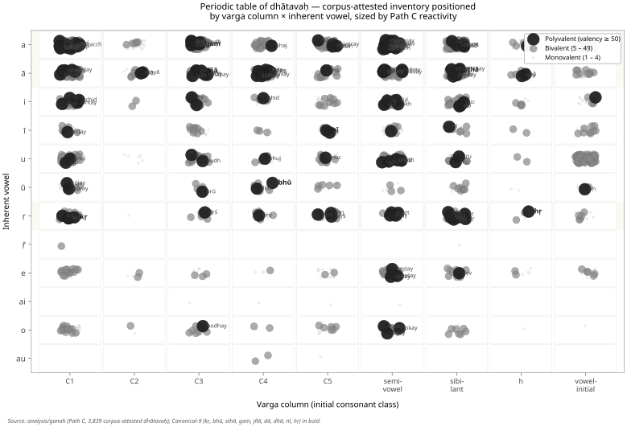{#fig:ganah-periodic-axes width=100%}

The figure should not be read as the only possible table. The analysis tested multiple axes. Inherent vowel produces the sharpest split in the valency distribution: vowel-ऋ atoms generate 13.6% of corpus tokens from 3.3% of the verbal atoms visible in the corpus, with mean valency 34.35.[NOTE: inherent-vowel-secondary-axis] The *varga* column remains structurally decisive because it ties the *dhātuḥ* back to the *varṇamālā*'s articulatory grid.

These are not competing facts. They are orthogonal dimensions of the same architecture.

The structure shows because the operation requires it. *Kṛ*, *hṛ*, and *vṛt* carry ऋ. *Dhā*, *dā*, *sthā*, *jñā*, and *yā* carry आ. *Gam*, *kram*, *han*, and *pad* carry अ. The C4 voiced-aspirate column is enriched in *juhotyādi*: 33.3% in the inventory and 42.9% in the subset visible in the corpus.[NOTE: cross-gana-column-distribution]

That number is not only a distribution fact. It is a procedural fit. *Juhotyādi* is the reduplicating class; reduplication doubles the initial signal, so the doubled consonant must remain recognizable across the syllable boundary. C4 is the acoustically robust column — voiced, aspirated, breathy. The architecture places the most distinctive consonantal material where the operation needs distinction most.

The engineering does not distribute sounds evenly. It distributes them functionally.

Position is not decoration. Position carries behavior. The figure is not the chapter's center. It is the statistical shadow cast by the procedure.

## 11.9 Stability Across Use

A reactive core could still be a genre accident. The corpus test says it is not.

The analysis compares four Sanskrit use-domains inside the Digital Corpus of Sanskrit: **ऋग्वेद (*Ṛgveda*)**, **अथर्ववेद (*Atharvaveda*) Śaunaka**, **महाभारत (*Mahābhārata*)**, and **रामायण (*Rāmāyaṇa*)**. The first two are *śruti* corpora. The second two are *smṛti* / *itihāsa* corpora. They serve different purposes, carry different materials, and deploy different registers.

The canonical nine polyvalent atoms — *kṛ, bhū, sthā, gam, jñā, dā, dhā, nī, hṛ* — are present in every sub-corpus: **9/9**.[NOTE: cross-corpus-invariance] The *smṛti* corpora carry all nine in their top-20 lists. The *śruti* corpora carry six of nine in their top-20 lists, with ritual-specific atoms such as *vah* (वह्), *yam* (यम्), *bhṛ* (भृ), and *cakṣ* (चक्ष्) entering the top tier.

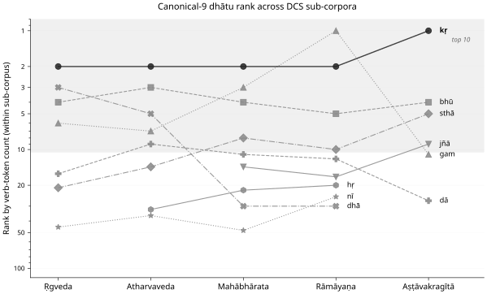{#fig:ganah-canonical-rank-trajectory width=90%}

The deployments vary. The core remains.

That is exactly what an engineered inventory predicts. The architecture provides a stable set of high-reactivity atoms. Different domains apply them to different work. The Vedic corpus, the epic corpus, the philosophical corpus, and the later learned corpus do not need identical surface usage. They need the same engine.

They have it.

## 11.10 Pāṇini Decoded Operations

The *Dhātupāṭha* is not a botanical inventory. It is not a schoolbook appendix. It is not a codified vocabulary. It is an inventory of reactive atoms.

The *gaṇāḥ* are not arbitrary conjugation bins. They are operational classes. The *vikaraṇāni* are not decorative insertions. They are the signatures of those operations. The *racanāḥ* are not naming conveniences. They are construction scaffolds. Valency is not metaphor. It is measured bonding behavior.

Together they form a table.

Pāṇini did not freeze a drifting language. He decoded an operating table.

**Sanskrit was engineered. Encoded in the Vedas. Decoded by many. Pāṇini's decoding is the finest.** The *Dhātupāṭha* he decoded is Sanskrit's table of reactive atoms. Mendeleev gave chemistry its periodic table in 1869.[NOTE: mendeleev-1869-table] Sanskrit's has been operating for thousands of years.

The scale-chain has now reached the molecule. Chapter 8 named the sonomer. Chapter 9 stabilized it as *akṣara*. Chapter 10 built the *dhātuḥ* as an atomic *sūtra*. This chapter showed that Sanskrit does not dissolve that atomic *sūtra* when action begins. It activates it. The same law persists: measured units, recoverable assembly, stable identity, usable range.

Chapter 12 turns from operational class to bonding chemistry: how *dhātavaḥ* combine with *upasargāḥ* and *pratyayāḥ* to produce the *śabdāḥ* Sanskrit deploys.
