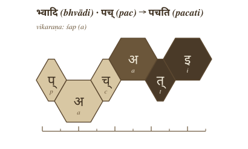
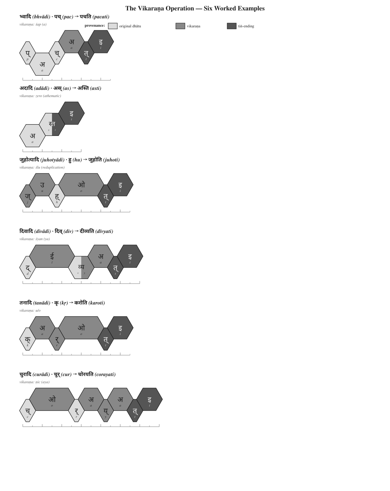

# Chapter 11 — Building the *Kriyā* (क्रिया): Sanskrit's Molecule

## 11.1 From Atom to Operation

Chapter 10 closed with the atom. The *Dhātupāṭha* (धातुपाठ) gives 2,168 filled scaffolds, each one a measured *dhātuḥ* (धातुः), each one built from *varṇāḥ* (वर्णाः) inside a *mātrā* (मात्रा) envelope. The chapter's final question was simple: if Sanskrit is atomic, how does the atom react?

This chapter answers that question.

The *dhātuḥ* is not a "verbal root." That phrase belongs to the botanical metaphor Chapter 1 prosecuted and Chapter 6 discarded. A *dhātuḥ* is also not a word. It cannot simply be lifted from the inventory and used as a finished sentence-form. It is the atom: a sound-bearing semantic unit, compact, timed, scaffolded, and capable of bonding. Chapter 10 showed how that atom is built. Chapter 11 shows how the atom becomes the first molecule.

That first molecule is the ***kriyā*** (क्रिया) — the verbal action-form. A *kriyā* is not a loose word grown from a root. It is an assembled form. The *dhātuḥ* enters an operational class, receives the class-signature, takes the verbal ending, and becomes usable speech while keeping the atom recoverable inside it. The *varṇāḥ* do not become vague. The *mātrā* discipline does not disappear. The molecule remains accountable to the particle-level precision that built the atom in the first place.

The *dhātuḥ* is built from audiomeres. The *kriyā* is built by applying further audiomere-level operations to that atom. The atom does not become a vague "word." It enters a rule-system that still sees its particles.

The basic procedure is:

> ***dhātuḥ + gaṇa-operation / vikaraṇa + tiṅ-pratyaya → kriyā***
>
> धातुः + गण-क्रिया / विकरण + तिङ्-प्रत्ययः → क्रिया

The *Dhātupāṭha* lists the atoms. The **गणाः (*gaṇāḥ*)** are the operational classes. The **विकरणानि (*vikaraṇāni*)** are the class-signatures that put those atoms into motion. The **तिङ्-प्रत्ययाः (*tiṅ-pratyayāḥ*)** are the verbal endings that complete the action-form.

The chapter therefore proceeds by procedure first, statistical audit second — the order §0.11 names as the book's spine. First it shows the operation: how a filled *dhātuḥ* scaffold passes through a *gaṇa*, takes a *vikaraṇa*, and becomes a *kriyā*. Only after that procedure is visible does the chapter count the distribution. The matrix, the tiers, and the reactivity numbers are not the argument's foundation. They are the audit of the procedure.

Pāṇini did not impose this operating table. He decoded it.

## 11.2 The *Vikaraṇa* Procedure

A *gaṇaḥ* (गणः) is an operational class. A *vikaraṇa* (विकरण) is the class-signature that activates a *dhātuḥ* inside that class. It is not decoration. It is the operation that prepares the atom for verbal use.

The first thing to show is not the statistical table. The first thing to show is the procedure itself. A filled scaffold enters a *gaṇa* operation, receives the relevant *vikaraṇa* or class-process, takes the *tiṅ-pratyaya* (तिङ्-प्रत्ययः), and becomes a *kriyā* — a verbal molecule.

> ***filled dhātuḥ → gaṇa / vikaraṇa operation → verbal stem → kriyā***
>
> धातुः → गण / विकरण-क्रिया → धात्वङ्गम् → क्रिया

The simple case is *bhvādi*. The atom is पच् (*pac*). The class-signature is *śap*, whose visible vowel is अ (*a*). The ending supplies ति (*ti*). The output is पचति (*pacati*).

{#fig:building-kriya-vikarana-bhvadi width=70%}

The diagram carries forward the hexagonal vocabulary from Chapter 10, but adds provenance. Light gray is inherited *dhātuḥ* material. Medium gray is *vikaraṇa* material, or a change produced by the *vikaraṇa* operation. Dark gray is the *tiṅ* ending. The lower rail holds the original *dhātuḥ* vowel when it survives unchanged. The upper rail holds introduced or transformed vowels. Consonants stay on the consonantal rail. The *mātrā* line below keeps the timing visible.

That convention matters. It prevents the reader from seeing a finished form as a blur. In पचति (*pacati*), the atom पच् (*pac*) remains recoverable. The *bhvādi* operation adds its class-signature. The ending completes the verbal molecule. The atom has not dissolved into a word. It has reacted.

The same graphic grammar handles more than the default case.

{#fig:building-kriya-vikarana-examples width=95%}

The six panels show the range of operation. अदादि (*adādi*) can operate with zero visible class-material: अस् (*as*) becomes अस्ति (*asti*) by direct bonding with the ending. जुहोत्यादि (*juhotyādi*) uses reduplication: हु (*hu*) becomes जुहोति (*juhoti*). दिवादि (*divādi*) uses the *śyan* / य (*ya*) operation: दिव् (*div*) becomes दीव्यति (*dīvyati*). तनादि (*tanādi*) shows the compact high-reactivity atom कृ (*kṛ*) entering the *u/o* operation and becoming करोति (*karoti*). चुरादि (*curādi*) uses the productive *ṇic* / अय (*aya*) operation: चुर् (*cur*) becomes चोरयति (*corayati*).

The operations differ, but the principle does not. A *dhātuḥ* enters an operational class. The class marks how the atom may be activated. The ending completes the verbal form. Sometimes the operation adds visible material. Sometimes the operation is zero. Sometimes it reduplicates. Sometimes it conditions the atom itself through guṇa, lengthening, or another surface change. In every case the finished *kriyā* remains an analyzable assembly.

The proof is Pāṇini's own machinery. The *Aṣṭādhyāyī* does not merely manipulate words. It manipulates *varṇāḥ* — audiomeres — through classes such as *ac*, *hal*, *ik*, *yaṇ*, *jhal*, and *khar*. Sanskrit's atom is built at the audiomere level; its molecule is activated at the same level.

This is why the matrix later in the chapter cannot be treated as a mere count-table. Each cell names a procedure: this kind of atom can pass through this kind of operation. The statistics will audit the procedure. They do not replace it.

## 11.3 The Ten *Gaṇāḥ* as Operations

After the visual procedures, give the reader the full operating roster.

| No. | Gaṇa | Signature | Procedural effect | Example |
|---:|---|---|---|---|
| 1 | *bhvādi* | *śap* / *a* | default thematic activation | *pac* → *pacati* |
| 2 | *adādi* | zero / athematic | direct activation | *ad* → *atti* |
| 3 | *juhotyādi* | reduplication | echo/duplication before activation | *dhā* → *dadhāti* |
| 4 | *divādi* | *śyan* / *ya* | *ya*-extension | *div* → *dīvyati* |
| 5 | *svādi* | *śnu* / *nu/no* | *nu/no* insertion | *su* → *sunoti* |
| 6 | *tudādi* | *śa* / *a* | thematic activation with class behavior | *tud* → *tudati* |
| 7 | *rudhādi* | *śnam* / nasal infix | nasal insertion into atom | *rudh* → *ruṇaddhi* |
| 8 | *tanādi* | *u/o* | *u/o* activation | *kṛ* → *karoti* |
| 9 | *kryādi* | *śnā* / *nā* | *nā*-extension | *krī* → *krīṇāti* |
| 10 | *curādi* | *ṇic* / *aya* | *aya* activation | *cur* → *corayati* |

The *gaṇaḥ* names the operational class. The *vikaraṇa* performs the operation.

**Note for drafting:** verify each example against standard present-stem derivation before final prose. Especially check *cur → corayati*, *div → dīvyati*, *rudh → ruṇaddhi*, and *krī → krīṇāti*.

## 11.4 The Cell Is a Procedure

A matrix cell is not only a count. It names procedural compatibility.

> ***This scaffold can pass through this gaṇa operation.***

That is why the cell matters. A heavy cell marks a preferred corridor. An empty cell marks an operation the architecture does not use for that scaffold. The matrix is not a spreadsheet imposed on Sanskrit from outside. It is the visible map of which constructed atoms can enter which operations.

## 11.5 *Racanā* and *Gaṇa* Are Two Axes

Now the matrix can land.

*Racanā* describes construction: CV1C, CCV1C, CV1CC, CV2C, and the rest.

*Gaṇaḥ* describes operation: how the atom behaves when the grammar puts it to work.

Construction and operation are different axes.

The matrix is where the two meet.

Insert current 10×10 *racanā* × *gaṇa* figure here.

Data source discipline:

- Use current numbers from `analysis/dhatupatha/data/derived/racana_by_gana.csv`.
- Use the current audit in `working/ch11_analysis_audit_2026-05-25.md`.
- Do **not** use the stale numerical tables in `working/ch11_racana_gana_cross_findings.md` without recalculation.

## 11.6 Heavy Cells, Empty Cells

The matrix is not just a count-table. It is an operational map.

Heavy cells show preferred corridors:

- CV1C × *bhvādi* is the default highway.
- CV1C × *curādi* is the productive *aya* corridor.
- Long-vowel open shapes lean toward *kryādi*.
- Reduplication avoids heavy cluster shapes.

Empty cells matter too.

A table is not only a map of where atoms go. It is a map of where they cannot go.

The architecture permits some shape-operation pairings and refuses others.

## 11.7 Reactivity Audit

After the procedure is visible, the statistics enter as audit.

Valency measures how many distinct bonding configurations a *dhātuḥ* produces in actual Sanskrit use.

Retain from the current draft:

- **The three reactivity tiers** with their percentages: polyvalent (3.8% of corpus-visible atoms, 67.6% of verb-token record); bivalent (27.6% / 30.5%); monovalent (68.6% / 1.9%).
- **The canonical nine**: कृ (*kṛ*), भू (*bhū*), स्था (*sthā*), गम् (*gam*), ज्ञा (*jñā*), दा (*dā*), धा (*dhā*), नी (*nī*), हृ (*hṛ*) — these nine alone produce 26.5% of the verb-token record.
- **The compactness-reactivity coupling**: Spearman ρ = **-0.4334** between valency and particle count; matched-dictionary subset gives **-0.490**. *The higher the yield, the smaller the atom.*
- **Footnote on the 3,839-vs-2,168 atom count**: percentages compute against DCS's 3,839 corpus-visible verbal atoms; the *Dhātupāṭha* canonical inventory is 2,168. The DCS surplus comes from variant readings, recension-specific entries, and atoms not registered in the canonical *Dhātupāṭha*. Endnote stub: `[NOTE: dcs-vs-dhatupatha-count]`.

Admit the natural-language parallel first:

Natural languages also concentrate use. English leans heavily on *be*, *have*, *do*, *go*, and *make*. Frequency concentration by itself proves nothing.

Then state the difference:

Sanskrit is different because the concentration is coupled to architecture: compact atoms, regular bonding, scaffold order, and cross-domain stability. Natural-language top-tier forms erode into irregularity (English *be / am / is / are / was*; Latin *esse / sum / fui*). Sanskrit's top-tier atoms remain compositionally regular and decompose into atom + bond.

Close with the standing line:

**The similarity proves Sanskrit is usable speech. The difference proves it is engineered speech.**

## 11.8 Hyper-Reactive Atoms

The carbon-class metaphor belongs here.

कृ (*kṛ*) is the cleanest case. It is compact, enters its *gaṇa* operation, accepts preverbs, accepts suffixes, and generates ordinary, ritual, philosophical, and technical forms.

Its power is not frequency alone. Its power is procedural availability.

The same pattern holds across the canonical core:

- कृ (*kṛ*)
- भू (*bhū*)
- धा (*dhā*)
- हृ (*hṛ*)
- गम् (*gam*)
- नी (*nī*)
- ज्ञा (*jñā*)
- दा (*dā*)
- स्था (*sthā*)

The compact atom can bond. The compact atom can travel. The compact atom can generate.

## 11.9 The Procedure's Shadow

Only now bring in the table-view figure.

Procedure and structure are coupled. The figure makes the coupling visible as a 2D arrangement — but the arrangement is the visual shadow of the procedure, not an independent periodicity claim.

One axis is the *gaṇaḥ*: operational class.

Another is the *racanā*: construction scaffold.

Other visible axes include first-consonant structure, *varga* column, and inherent vowel.

Insert current periodic-table figure here (re-caption to match the shadow framing, not the periodicity claim).

The figure is not the chapter's center. It is the statistical shadow cast by the procedure.

## 11.10 Stability Across Use

A reactive core could still be a genre accident. The corpus test says it is not.

Keep the cross-domain result, but shorten:

- Ṛgveda
- Atharvaveda Śaunaka
- Mahābhārata
- Rāmāyaṇa

The canonical polyvalent atoms are visible across the tested domains. The deployments vary. The core remains.

Different domains apply the same engine to different work.

They have the same engine.

## 11.11 Pāṇini Decoded Operations

Close with the procedural verdict.

The *Dhātupāṭha* is not a list of botanical roots. It is not a schoolbook appendix. It is not a codified vocabulary.

It is an inventory of reactive atoms.

The *gaṇāḥ* are not arbitrary conjugation bins. They are operational classes.

The *vikaraṇāni* are not decorative insertions. They are the signatures of those operations.

The *racanāḥ* are not naming conveniences. They are construction scaffolds.

Together they form a table.

Pāṇini did not freeze a drifting language. He decoded an operating table.

**Sanskrit was engineered. Encoded in the Vedas. Decoded by many. Pāṇini's decoding is the finest.**

Chapter 12 turns from operational class to bonding chemistry: how *dhātavaḥ* combine with *upasargāḥ* and *pratyayāḥ* to produce the *śabdāḥ* Sanskrit deploys.
