# Chapter 11 — Building the *Kriyā* (क्रिया): Sanskrit's Molecule

## 11.1 From Atomic Sūtra to Verbal Molecule

Every finished Sanskrit verb is an atom that has been put to work. The **धातुः (*dhātuḥ*)** sits in the **धातुपाठ (*Dhātupāṭha*)** — 2,168 of them, each a measured cluster of **वर्णाः (*varṇāḥ*)**, sonomers, inside a **मात्रा (*mātrā*)** envelope — but it is not yet a word and cannot be spoken as one. To act, it has to be built up: bonded, activated, closed with an ending. What comes out is the **क्रिया (*kriyā*)**, or **क्रियापदम् (*kriyāpadam*)**, the verbal word; under the Atomic Corollary, a *kriyāpada* molecule.

The worry is that the engineering dissolves in the assembly — that once the atom is wrapped inside a finished verb, the sonomers blur into an ordinary word. They survive, and the procedure is why. The *varṇamālā* hands over the measured particles, the *dhātuḥ* binds them, and the *kriyāpada* activates that atom without smearing the layer beneath. The atom stays legible the whole way up.

Five Rigvedic lines show it happening, each already carrying a finished verb, the underlying *dhātavaḥ* running from one *mātrā* to three. None of it waited for Pāṇini. The verbs were already in the corpus, working — thousands of them — long before the rules were ever written down.[NOTE: vedic-kriyapadas-before-panini]

## 11.2 The Vedic Procedure Before Pāṇini

All five examples come from the Rigveda, quoted as **पदपाठ (*padapāṭha*)** excerpts so the *kriyāpada* stays visible before **संहिता (*saṃhitā*)** sandhi recombines it.[NOTE: rigvedic-kriya-examples] Each one shows the procedure already at work: a semantic atom takes on further sonomers and becomes a *kriyāpada* molecule. The conjugation lesson can stay in the grammar handbook; what matters here is the assembly.

### 1 *mātrā*: इ (*i*) → एति (*eti*)

> तन्यतुः । मरुताम् । **एति** । धृष्णुया ।
>
> *tanyatuḥ | marutām |* ***eti*** *| dhṛṣṇuyā* |
>
> RV 1.23.11b

The atom is इ (*i*), a one-*mātrā* vowel atom. In **एति (*eti*)**, the atom appears as ए (*e*) and receives ति (*ti*).

> इ (*i*) → ए (*e*) + ति (*ti*) → एति (*eti*)

{#fig:building-kriya-vedic-eti width=100%}

### 1.5 *mātrās*: अस् (*as*) → अस्ति (*asti*)

> नहि । वाम् । **अस्ति** । दूरके ।
>
> *nahi | vām |* ***asti*** *| dūrake* |
>
> RV 1.22.4a

The atom is अस् (*as*), a one-and-a-half-*mātrā* form: short vowel plus consonant. In **अस्ति (*asti*)**, the atom remains visible and ति (*ti*) bonds directly to it.

> अस् (*as*) + ति (*ti*) → अस्ति (*asti*)

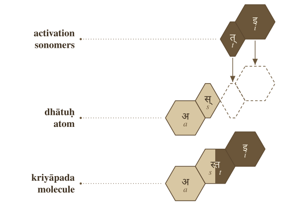{#fig:building-kriya-vedic-asti width=100%}

### 2 *mātrās*: यज् (*yaj*) → यजति (*yajati*)

> पिता । आपिः । **यजति** । आपये ।
>
> *pitā | āpiḥ |* ***yajati*** *| āpaye* |
>
> RV 1.26.3b

The atom is यज् (*yaj*), a two-*mātrā* consonant-framed short-vowel atom. In **यजति (*yajati*)**, the atom receives an added अ (*a*) before ति (*ti*).

> यज् (*yaj*) + अ (*a*) + ति (*ti*) → यजति (*yajati*)

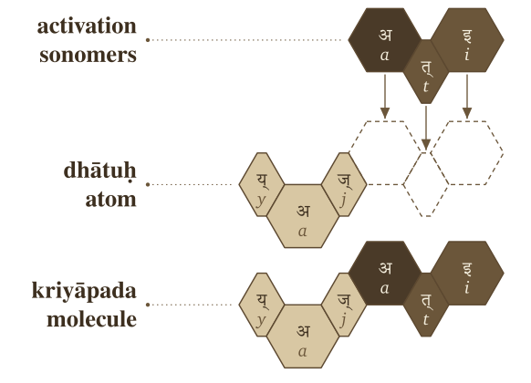{#fig:building-kriya-vedic-yajati width=100%}

### 2.5 *mātrās*: भू (*bhū*) → भवति (*bhavati*)

> क्रतुः । **भवति** । उक्थ्यः ।
>
> *kratuḥ |* ***bhavati*** *| ukthyaḥ* |
>
> RV 1.17.5c

The atom is भू (*bhū*), a two-and-a-half-*mātrā* form: consonant plus long vowel. In **भवति (*bhavati*)**, the long vowel material changes into भव् (*bhav*), and अ (*a*) + ति (*ti*) complete the molecule.

> भू (*bhū*) → भव् (*bhav*) + अ (*a*) + ति (*ti*) → भवति (*bhavati*)

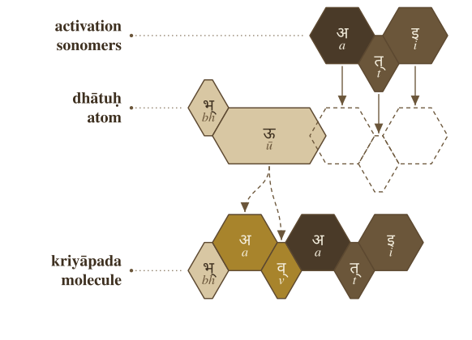{#fig:building-kriya-vedic-bhavati width=100%}

### 3 *mātrās*: राज् (*rāj*) → राजति (*rājati*)

> अग्निः । देवेषु । **राजति** ।
>
> *agniḥ | deveṣu |* ***rājati*** |
>
> RV 5.25.4a

The atom is राज् (*rāj*), a three-*mātrā* scaffold: consonant, long vowel, consonant. In **राजति (*rājati*)**, the atom receives अ (*a*) and ति (*ti*).

> राज् (*rāj*) + अ (*a*) + ति (*ti*) → राजति (*rājati*)

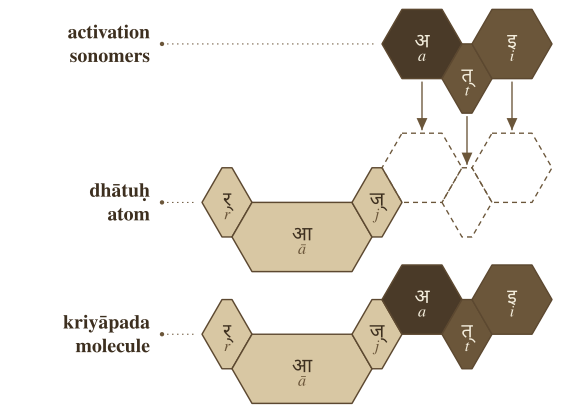{#fig:building-kriya-vedic-rajati width=100%}

The figures use one visual convention. The first row shows activation sonomers. The second row shows the *dhātuḥ* atom and the dashed destination slots where new sonomers will enter. The third row shows the finished *kriyāpada* molecule. Light gray is original *dhātuḥ* material. Medium gray is *dhātuḥ* material that changes shape. Very dark cells are activation sonomers such as the added अ (*a*). Dark cells are the ति (*ti*) ending.

The color scheme is only a reading aid; the argument is recoverability. इ becomes एति, अस् becomes अस्ति, यज् becomes यजति, भू becomes भवति, राज् becomes राजति — sometimes the atom's sonomers ride through unchanged, sometimes they transform, but in every case the atom stays visible enough to read the procedure back off the result.

The Vedic corpus already runs these operations; the figures only make the implicit procedure visible. The atomic *sūtra* survives activation, still compact and still traceable inside the verbal molecule. When Pāṇini comes to it, he gives the moves names — गणः (*gaṇaḥ*), विकरणम् (*vikaraṇam*), तिङ्-प्रत्ययः (*tiṅ-pratyayaḥ*), अनुबन्धः (*anubandhaḥ*) — and the same process can be restated in his terminology.

The larger calibration principle waits for Chapter 13 §13.5. Here the procedural point is enough: working *kriyāpadāni* are already in the corpus before Pāṇini documents how they are built. The Veda keeps the form as it is performed; Pāṇini keeps it as something derivable on demand.

## 11.3 Pāṇini's Notation Layer

Pāṇini's notation takes those same finished *kriyāpadāni* and restates the assembly explicitly. He did not invent the activation layer; he documented it, compressed it, and made it teachable. The five examples return now, wearing the labels he gave the process.

In that explicit notation, a *dhātuḥ* must do three things before it becomes a *kriyāpada* molecule:

1. It must belong to an operating class.
2. It must receive the operation appropriate to that class.
3. It must take the verbal ending that completes the action-form.

Sanskrit's operating classes are the **गणाः (*gaṇāḥ*)**. The class-operation is signaled by a **विकरणम् (*vikaraṇam*)**, or by another class process such as zero operation, transformation, or reduplication. The verbal endings are the **तिङ्-प्रत्ययाः (*tiṅ-pratyayāḥ*)**.

In Pāṇini's notation, that gives the basic procedure:

> ***dhātuḥ + gaṇa-operation / vikaraṇa + tiṅ-pratyayaḥ → kriyāpada***
>
> धातुः + गण-क्रिया / विकरण + तिङ्-प्रत्ययः → क्रियापदम्

The formula compresses the procedure without standing in for it.

A **गणः (*gaṇaḥ*)** is an operational class — it tells the grammar how a *dhātuḥ* behaves once grammar puts it to work, not a drawer in a schoolbook where verbs are filed by shape. The **विकरणम् (*vikaraṇam*)** is the operation itself, the class-signature that activates the *dhātuḥ* inside its *gaṇaḥ*.[NOTE: vikarana-as-column-signature] And the **अङ्गम् (*aṅgam*)** is what stands between the two and the ending: the atom after the operation has prepared it, one step short of the finished molecule.

The sequence is straightforward:

1. Start with the *dhātuḥ*.
2. Identify its *gaṇaḥ*.
3. Apply the *gaṇa* operation or *vikaraṇa*.
4. Form the **अङ्गम् (*aṅgam*)**, the activated intermediate that can receive the ending.
5. Add the *tiṅ-pratyayaḥ* (तिङ्-प्रत्ययः).
6. The result is the *kriyāpada* (क्रियापदम्), the *kriyāpada* molecule.

> ***filled dhātuḥ → gaṇa / vikaraṇa operation → aṅgam → kriyāpada***
>
> धातुः → गण / विकरण-क्रिया → अङ्गम् → क्रियापदम्

The five Vedic examples can now be read in Pāṇini's notation layer.

**इ (*i*) → एति (*eti*).** In Pāṇini's terminology, this belongs in the *adādi* class. The visible operation is transformation: इ (*i*) appears as ए (*e*). The *tiṅ* ending तिप् (*tip*) contributes ति (*ti*). The molecule is एति (*eti*).

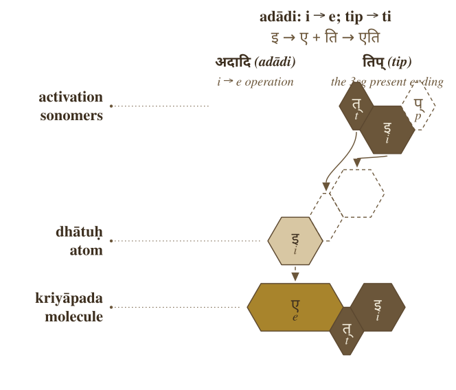{#fig:building-kriya-panini-eti width=100%}

**अस् (*as*) → अस्ति (*asti*).** This also belongs in the *adādi* class. No visible class vowel is inserted. The *dhātuḥ* bonds directly with ति (*ti*), and the स् + त् contact becomes the visible स्त् cluster. The molecule is अस्ति (*asti*).

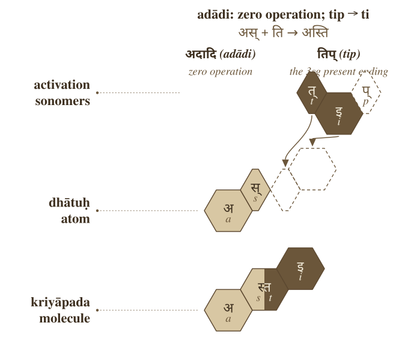{#fig:building-kriya-panini-asti width=100%}

**यज् (*yaj*) → यजति (*yajati*).** This belongs in the *bhvādi* class. The class-signature is शप् (*śap*): the anubandhas disappear, and the visible survivor is अ (*a*). The *tiṅ* ending contributes ति (*ti*). The molecule is यजति (*yajati*).

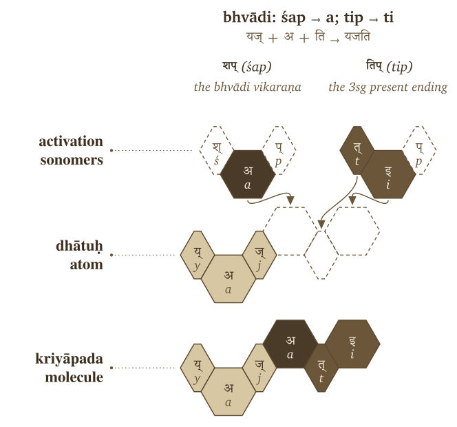{#fig:building-kriya-panini-yajati width=100%}

**भू (*bhū*) → भवति (*bhavati*).** This also belongs in the *bhvādi* class. The operation changes भू (*bhū*) into भव् (*bhav*), the शप् (*śap*) operation contributes अ (*a*), and तिप् (*tip*) contributes ति (*ti*). The molecule is भवति (*bhavati*).

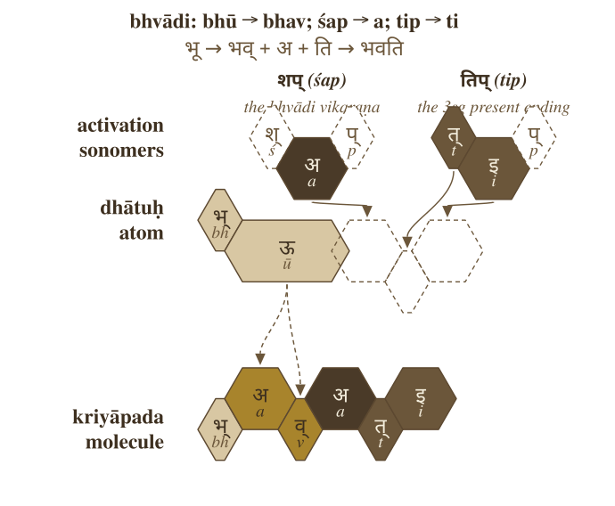{#fig:building-kriya-panini-bhavati width=100%}

**राज् (*rāj*) → राजति (*rājati*).** This belongs in the *bhvādi* class. The शप् (*śap*) operation contributes अ (*a*), and तिप् (*tip*) contributes ति (*ti*). The molecule is राजति (*rājati*).

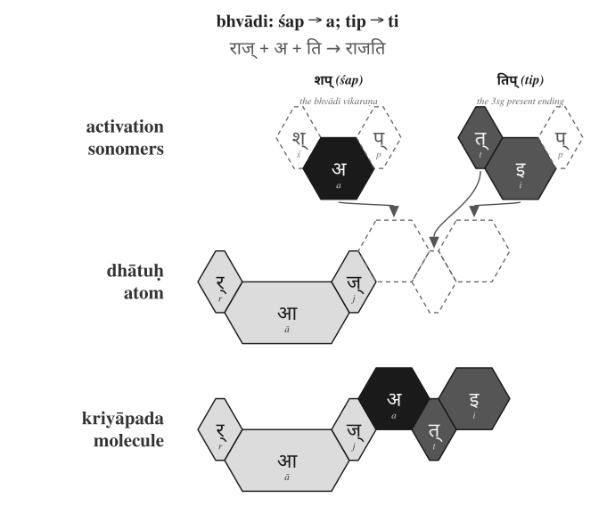{#fig:building-kriya-panini-rajati width=100%}

The figures reuse the hexagonal vocabulary of §11.2, with one addition: the top row now carries Pāṇini's notation layer, where शप् (*śap*) and तिप् (*tip*) appear as technical source forms and the dashed cells are अनुबन्धाः (*anubandhāḥ*), the metadata tags that drop out once the surviving sonomers enter the atom. The action is exactly what it was in the Vedic examples; only the labels are new. What was implicit there now carries Pāṇini's vocabulary — *gaṇaḥ*, *vikaraṇam*, *aṅgam*, *tiṅ-pratyayaḥ*, *anubandhaḥ*.

That is the distinction worth holding onto: the operation existed before the notation did. Pāṇini gave the process handles; he did not make Sanskrit molecular by labeling the bonds.

The operations vary, but the principle underneath them holds steady. A *dhātuḥ* enters its class, the class sets how the atom may be activated, and the ending closes the *kriyāpada* molecule. The operation might add visible material, do nothing at all, or reshape the atom itself through guṇa or lengthening — and through all of it the finished verb stays an analyzable assembly.

Pāṇini's own machinery proves the point. The *Aṣṭādhyāyī* operates not on whole words but on *varṇāḥ* — sonomers — through classes like *ac*, *hal*, *ik*, *yaṇ*, *jhal*, and *khar*. The atom was built at the sonomeric level, and the molecule is activated at the same level, which means the *kriyā* is not a second *sūtra* but the next scale of the same assembly: the measured particles stay visible when the atom becomes a verb.

This is why the matrix that follows is more than a count-table. Each cell records a permitted procedure — this kind of atom passing through this kind of operation — and the statistics that fill it audit the procedure rather than replace it.

## 11.4 The Ten *Gaṇāḥ* as Operations

The full operating roster has ten classes.

| No. | Gaṇa | Signature | Procedural effect | Example |
|---:|---|---|---|---|
| 1 | भ्वादि (*bhvādi*) | शप् (*śap*) / अ (*a*) | default thematic activation | पच् (*pac*) → पचति (*pacati*) |
| 2 | अदादि (*adādi*) | शून्य (*śūnya*) / athematic | direct activation | अद् (*ad*) → अत्ति (*atti*) |
| 3 | जुहोत्यादि (*juhotyādi*) | अभ्यास (*abhyāsa*) | echo/duplication before activation | धा (*dhā*) → दधाति (*dadhāti*) |
| 4 | दिवादि (*divādi*) | श्यन् (*śyan*) / य (*ya*) | *ya*-extension | दिव् (*div*) → दीव्यति (*dīvyati*) |
| 5 | स्वादि (*svādi*) | श्नु (*śnu*) / नु-नो (*nu-no*) | *nu/no* insertion | सु (*su*) → सुनोति (*sunoti*) |
| 6 | तुदादि (*tudādi*) | श (*śa*) / अ (*a*) | thematic activation with class behavior | तुद् (*tud*) → तुदति (*tudati*) |
| 7 | रुधादि (*rudhādi*) | श्नम् (*śnam*) / nasal infix | nasal insertion into atom | रुध् (*rudh*) → रुणद्धि (*ruṇaddhi*) |
| 8 | तनादि (*tanādi*) | उ-ओ (*u-o*) | *u/o* activation | कृ (*kṛ*) → करोति (*karoti*) |
| 9 | क्र्यादि (*kryādi*) | श्ना (*śnā*) / ना (*nā*) | *nā*-extension | क्री (*krī*) → क्रीणाति (*krīṇāti*) |
| 10 | चुरादि (*curādi*) | णिच् (*ṇic*) / अय (*aya*) | *aya* activation | चुर् (*cur*) → चोरयति (*corayati*) |

The *gaṇaḥ* is the operational class. The *vikaraṇa* performs the operation. The examples in the last column are anchors: they show one familiar visible output of each operation, not a full derivation lesson.

One pattern is worth catching before the matrix arrives: the consonant-bearing class operations reach for the same few consonants every time. *Divādi* and *curādi* use य (*ya*); *svādi*, *rudhādi*, and *kryādi* use न (*na*) — the very cluster-joining specialists Chapter 10 and Appendix 5 found holding dense atoms together. The architecture activates the molecule with the same bonding sonomers it used to build the atom; rather than inventing new vocabulary at the next scale, it reuses its specialists.

## 11.5 The *Racanā-Gaṇa* Matrix

The ten *gaṇāḥ* and the *racanāḥ* measure two different things — operation and construction — and the matrix is where the two axes cross.

*Racanā* describes the measured scaffold: **गमादि (*gamādi*)** , **स्पदादि (*spadādi*)** , **मन्थादि (*manthādi*)** , **वाचादि (*vācādi*)** , and the rest. *Gaṇaḥ* describes how the atom behaves when grammar puts it to work. A matrix cell is therefore not only a count. It specifies a permitted procedure:

> ***This scaffold can pass through this gaṇa operation.***

After *anubandha* stripping, the 2,168-entry *Dhātupāṭha* inhabits 47 observed *racanā* scaffolds. The top ten scaffolds carry 1,973 entries — **91.01%** of the inventory. Those ten scaffolds do not distribute randomly across the ten *gaṇāḥ*.[NOTE: racana-gana-matrix]

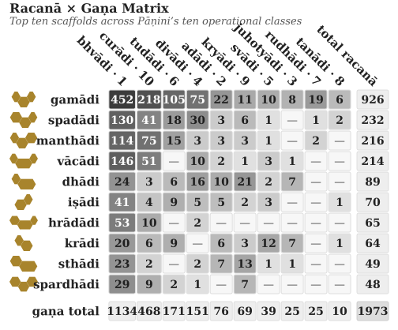{#fig:ganah-racana-gana-matrix width=100%}

The central corridor is visible immediately. The **गमादि (*gamādi*)**  scaffold appears in all ten *gaṇāḥ* and carries 926 atoms by itself. It is the dominant construction corridor. The *bhvādi* class is the largest operational landing zone, with 1,134 atoms overall and 452 *gamādi* atoms alone.

The other concentrations are patterned too: *curādi* is the systematic runner-up for many closed scaffolds, *kryādi* draws the long-vowel open shapes, and even the smallest *gaṇāḥ* run to type, each gathering in the shapes its operation suits.

Construction and operation are two separate measurements — one for how the atom is built, one for how it behaves — and their intersection shows where the architecture lets a *dhātuḥ* stand.

Heavy cells show preferred corridors. **गमादि (*gamādi*)**  × *bhvādi* is the default highway. **गमादि (*gamādi*)**  × *curādi* is the productive *aya* corridor. Long-vowel open scaffolds lean toward *kryādi*. Reduplication avoids heavy cluster shapes.

The empty cells carry as much information as the filled ones. Only 140 of the 470 possible scaffold × *gaṇa* pairings are populated: the architecture lets some shapes enter some operations and quietly forbids the rest. A table like this maps where atoms go and, just as tellingly, where they cannot — the engineering shows in the refusals as much as in the permissions.

## 11.6 Reactivity Audit

The procedure is now visible: a *dhātuḥ* enters an operation and comes out a *kriyāpada* molecule. The open question is whether it leaves a measurable trace in actual Sanskrit. If these atoms are real engineering units, the corpus should not read like a flat word-list — some atoms should bond widely, others should stay narrow specialists, and the distribution should give away an operating engine underneath.

Two audits are needed.

| Audit type | Purpose | Source | Details |
|---|---|---|---|
| **Dictionary audit** | Test how much vocabulary a *dhātuḥ* can generate | Monier-Williams and Apte | Curated sample of *dhātavaḥ*; counts derivative spread in the dictionaries |
| **प्रयोग (*prayoga*) audit** | Test how *dhātavaḥ* actually work in Sanskrit use | Digital Corpus of Sanskrit | Parsed corpus; counts actual verb-form occurrences and distinct bonding patterns |

The dictionary audit asks a dictionary question: when a *dhātuḥ* is listed in Monier-Williams or Apte, how many derivative forms does the dictionary show it generating? The *prayoga* audit asks a use-question: when Sanskrit texts are parsed, which *dhātavaḥ* actually appear, how often do they appear, and how many different bonding patterns do they enter?

The working record for the *prayoga* audit is the Digital Corpus of Sanskrit: 15,900 parsed Sanskrit files and more than a million verb-form occurrences.[NOTE: prayoga-audit-valency] The corpus includes familiar materials such as the *Ṛgveda*, the *Atharvaveda* Śaunaka, the *Mahābhārata*, and the *Rāmāyaṇa*, along with a much wider parsed Sanskrit record. The corpus is useful here because its files do more than preserve surface words. Where the parsing permits it, a verbal form is linked back to the *dhātuḥ* label behind the form and tagged for the *upasargaḥ* (उपसर्गः) and broad *pratyayaḥ* (प्रत्ययः) class involved.

That gives the audit a concrete measurement. For each *dhātuḥ* visible in the corpus, the audit counts two things: how often forms from that atom appear, and how many different bonding patterns the atom enters. The head-bond is the *upasargaḥ*: *pra-*, *vi-*, *sam-*, *abhi-*, *anu-*, and the rest of the preverb set. The tail-bond is the *pratyayaḥ*: the suffix class that activates the atom into finite, participial, infinitival, or derivative form. Every distinct (*upasarga*, *pratyaya*-class) pairing visible in the parsed record counts as one unit of **valency**.

Valency therefore means bonding range. A low-valency atom appears in only a few configurations. A high-valency atom bonds across many configurations. The chemical analogy is disciplined by this measured grammatical behavior: reactivity means range of permissible bonding, not chemical substance.

The *prayoga* audit then proceeds in three steps. It identifies every *dhātuḥ* label the corpus makes visible. It counts the atom's actual uses and distinct bonding patterns. It then compares that bonding range against the atom's sonomeric size and against the dictionary audit.

The first result is that the corpus is not flat. A small set of atoms carries very wide bonding range.

| Dhātuḥ | Valency |
|---|---:|
| **कृ (*kṛ*)** | 1,062 |
| **भू (*bhū*)** | 504 |
| **धा (*dhā*)** | 386 |
| **हृ (*hṛ*)** | 368 |
| **गम् (*gam*)** | 291 |

These are not prestige rankings. They are measured bonding counts.

The second result is that the two independent instruments agree. On the matched Monier-Williams subset, the dictionary audit and the *prayoga* audit have a correlation value of **+0.66**. That means the two audits move together strongly: atoms that generate widely in the dictionaries also tend to bond widely in actual Sanskrit use. They are not measuring exactly the same thing, but they see the same signal: the same compact atoms keep generating, bonding, and appearing.

The third result is the tier structure. The corpus-visible *dhātuḥ* labels arrange into three empirical groups. The chart makes the skew visible: a small polyvalent tier carries most actual use, while the long tail remains preserved as specialist material.

{#fig:ganah-reactivity-tiers width=100%}

| Tier | Valency range | Corpus-visible *dhātuḥ* labels | Share of verb-token use | Role |
|---|---:|---:|---:|---|
| Polyvalent — carbon-class analogy | 50+ | 147 (**3.8%**) | **67.6%** | high-bonding core |
| Bivalent — the stable middle | 5–49 | 1,059 (**27.6%**) | **30.5%** | productive middle |
| Monovalent — closed-valency specialists | 1–4 | 2,633 (**68.6%**) | **1.9%** | preserved long tail |

The canonical polyvalent exemplars are **कृ (*kṛ*)**, **भू (*bhū*)**, **स्था (*sthā*)**, **गम् (*gam*)**, **ज्ञा (*jñā*)**, **दा (*dā*)**, **धा (*dhā*)**, **नी (*nī*)**, and **हृ (*hṛ*)**.[NOTE: dcs-vs-dhatupatha-count] These nine alone produce 26.5% of the verb-token record.

The distribution matters because the procedure is already visible.

| Corpus-visible set | Share of verb-token record |
|---|---:|
| Top 9 | **26.5%** |
| Top 20 | **38.3%** |
| Top 100 | **67.5%** |
| Top 500 | **94.0%** |

Sanskrit's similarity with natural languages is evident in this distribution. Natural languages also show rank-frequency concentration, often called Zipf-like behavior: a small high-use core carries much of actual speech, while a long tail remains available for rare or specialized use. English leans heavily on *be*, *have*, *do*, *go*, and *make*. Sanskrit shows the same surface behavior in *prayoga*, and that is expected. The *dhātavaḥ* are fixed as calibrated atoms, but their deployment was never frozen.

On its own, that concentration is exactly what any natural language shows, so the resemblance is expected. What sets Sanskrit apart is that the concentration is coupled to the architecture.[NOTE: productivity-inversion-natural-language]

| Natural-language pattern | Sanskrit pattern |
|---|---|
| A few whole words or forms become very frequent. | A few *dhātavaḥ* become highly reactive atoms. |
| High-frequency forms often erode, supplete, or become idiosyncratic: English *be*, *have*, *do*; Latin *esse*, *ire*, *ferre*; Greek *eimi*, *oida*, *phēmi*. | The highest-reactivity atoms remain compact and grammatically usable: *kṛ*, *bhū*, *dhā*, *hṛ*, *gam*, *nī*, *jñā*, *dā*, *sthā*. |
| Frequency often protects irregularity because speakers master common forms as wholes. | Reactivity preserves decomposability because the atom keeps bonding through *upasargāḥ* and *pratyayāḥ*. |
| The surface list shifts by genre, region, and era. | The same high-reactivity core remains visible across the tested Sanskrit use-domains (§11.9). |

Concentration is only the start of it. What Sanskrit adds is compactness, regular bonding, scaffold order, and cross-domain stability stacked on top of the concentration — and the numbers show it directly. The *prayoga* audit gives a correlation of **-0.43** between valency and sonomer count; the matched dictionary subset gives **-0.49**. The sign runs downward: the larger the atom, the narrower its measured bonding range. The higher the yield, the smaller the atom.

So the resemblance and the engineering sit side by side. The frequency pattern makes Sanskrit look like any natural language; the sonomeric procedure underneath it does not behave like one.

## 11.7 Hyper-Reactive Atoms

Carbon earns its place in chemistry by bonding promiscuously — a small center that throws off an enormous molecular space. Sanskrit's polyvalent atoms do the same grammatical work, and **कृ (*kṛ*)** is the clearest case: a three-letter *krādi* atom, the single most reactive item in the corpus. From it you get *karma* and *kāryam*, *kṛti* and *kartṛ*, *saṃskṛti* and *prakṛti* — the deed, the thing-to-be-done, the composition, the doer, refined order, raw nature. Everyday speech and the densest philosophy both run on it.

The smallness is the point. *Kṛ* is powerful not because it is common but because it is *available* — short enough to enter anywhere, stable enough to survive the entry. *Bhū*, *dhā*, *hṛ*, *gam*, *nī*, *jñā*, *dā*, and *sthā* work the same way: compact atoms with enormous range, not bloated words that happened to catch on.

The principle is the *sūtra* principle one scale down — maximum recoverable structure in minimum form. Read that way, the *Dhātupāṭha* turns into an inventory of reactive atoms: Sanskrit's working set, not a vocabulary list to memorize.

## 11.8 The Procedure's Shadow

Procedure and structure are coupled, and the figure makes the coupling visible as a two-dimensional arrangement — the visual shadow of the procedure, not a claim that Sanskrit has chemical periodicity.

The arrangement carries several axes at once: the *gaṇaḥ* (the operational class Pāṇini documented), the *racanā* (the measured scaffold inside the atom), the *varga* column of the atom's first consonant, and the inherent vowel it carries.

The periodic-axes figure places *dhātavaḥ* visible in the corpus by initial *varga* column and inherent vowel. Marker size and color encode the *prayoga* audit's reactivity tier; the canonical nine are labeled.[NOTE: varga-column-as-engineering-axis]

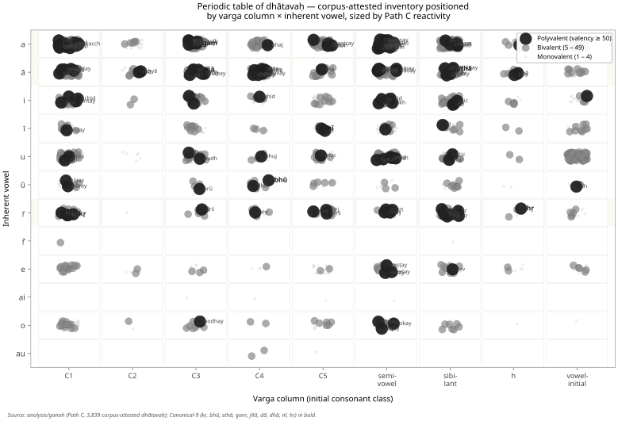{#fig:ganah-periodic-axes width=100%}

The figure is one possible table, not the table. The analysis tested multiple axes. Inherent vowel produces the sharpest split in the valency distribution: vowel-ऋ atoms generate 13.6% of corpus tokens from 3.3% of the verbal atoms visible in the corpus, with mean valency 34.35.[NOTE: inherent-vowel-secondary-axis] The *varga* column remains structurally decisive because it ties the *dhātuḥ* back to the *varṇamālā*'s articulatory grid.

They are orthogonal dimensions of one architecture, not competing accounts of it.

The structure shows because the operation requires it. *Kṛ*, *hṛ*, and *vṛt* carry ऋ. *Dhā*, *dā*, *sthā*, *jñā*, and *yā* carry आ. *Gam*, *kram*, *han*, and *pad* carry अ. The C4 voiced-aspirate column is enriched in *juhotyādi*: 33.3% in the inventory and 42.9% in the subset visible in the corpus.[NOTE: cross-gana-column-distribution]

That number is a procedural fit, not just a distribution fact. *Juhotyādi* is the reduplicating class, and reduplication doubles the initial signal, so the doubled consonant has to stay recognizable across the syllable boundary; C4 — voiced, aspirated, breathy — is the acoustically robust column, and the architecture parks its most distinctive consonants exactly where the operation needs the most distinction. The sounds are distributed by function, not by an even hand.

So position carries behavior, and the figure is the statistical shadow the procedure casts — never the center of the argument, only its trace.

## 11.9 Stability Across Use

A reactive core could still be an artifact of genre — a quirk of which texts happen to sit in the corpus. The corpus test rules that out.

The analysis compares four Sanskrit use-domains inside the Digital Corpus of Sanskrit: **ऋग्वेद (*Ṛgveda*)**, **अथर्ववेद (*Atharvaveda*) Śaunaka**, **महाभारत (*Mahābhārata*)**, and **रामायण (*Rāmāyaṇa*)**. The first two are *śruti* corpora. The second two are *smṛti* / *itihāsa* corpora. They serve different purposes, carry different materials, and use different styles.

The canonical nine polyvalent atoms — *kṛ, bhū, sthā, gam, jñā, dā, dhā, nī, hṛ* — are present in every sub-corpus: **9/9**.[NOTE: cross-corpus-invariance] The *smṛti* corpora carry all nine in their top-20 lists. The *śruti* corpora carry six of nine in their top-20 lists, with ritual-specific atoms such as *vah* (वह्), *yam* (यम्), *bhṛ* (भृ), and *cakṣ* (चक्ष्) entering the top tier.

{#fig:ganah-canonical-rank-trajectory width=100%}

The deployments vary. The core remains.

That is exactly what the procedural model predicts. The architecture supplies a fixed set of high-reactivity atoms, and each domain spends them on its own work — Veda, epic, philosophy, and the later learned literature have no reason to use identical surface forms. What they share is the engine, and the corpus record confirms they all run it.

## 11.10 Pāṇini Decoded Operations

Everything in this chapter points to one reading of the *Dhātupāṭha* — an operating table of reactive atoms, not the word-list the schoolbooks file it as. The *gaṇāḥ* sort atoms by how they activate; the *vikaraṇāni* are the operations that do the activating; the *racanāḥ* give the shapes the atoms are built in; valency measures how widely each one bonds. Cross those axes and a table appears, and it behaves like one — corridors, runners-up, and forbidden cells.

Pāṇini did not freeze a drifting language into that table. He read it off a language already running it, which is the whole of the standing claim: Sanskrit was engineered, encoded in the Vedas, decoded by many, and Pāṇini's decoding is the finest. Mendeleev gave chemistry its periodic table in 1869;[NOTE: mendeleev-1869-table] the comparison is modern, the grammatical table ancient.

The scale-chain has now reached the molecule. The sonomer became the *akṣara*, the *akṣara* fed the *dhātuḥ*, and the *dhātuḥ* — far from dissolving when speech begins — activates without ever losing the particles inside it, the same law holding the whole way up: measured units, recoverable assembly, stable identity.

Chapter 12 turns from operational class to bonding chemistry: how *dhātavaḥ* combine with *upasargāḥ* and *pratyayāḥ*, become *śabdāḥ* and *padāni*, and enter the *vākya* without losing the sonomeric layer underneath.
