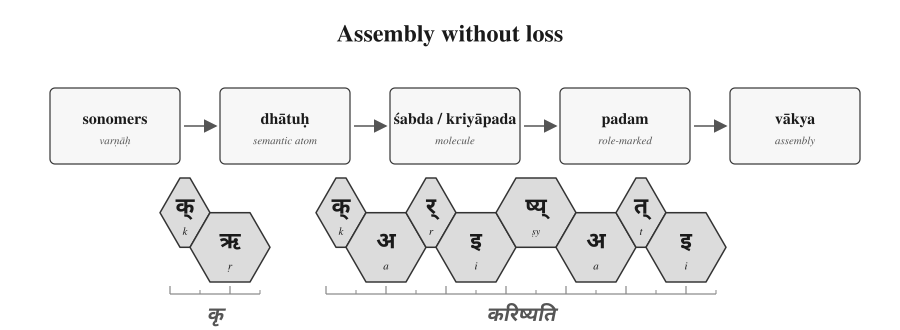
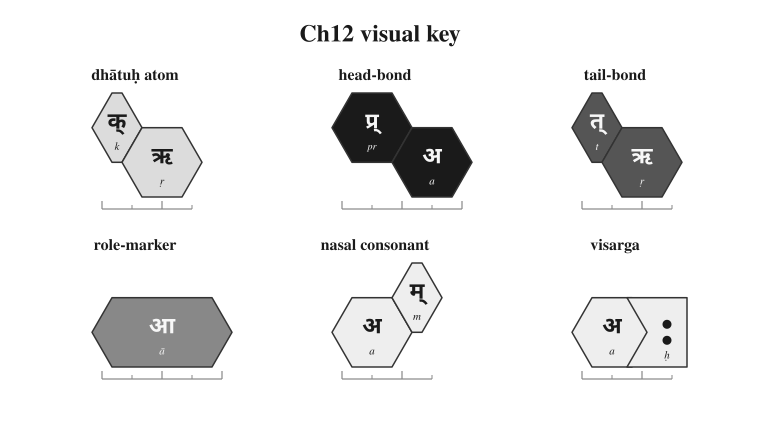
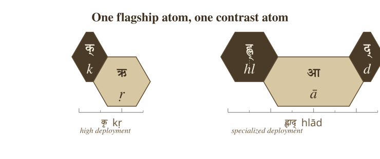
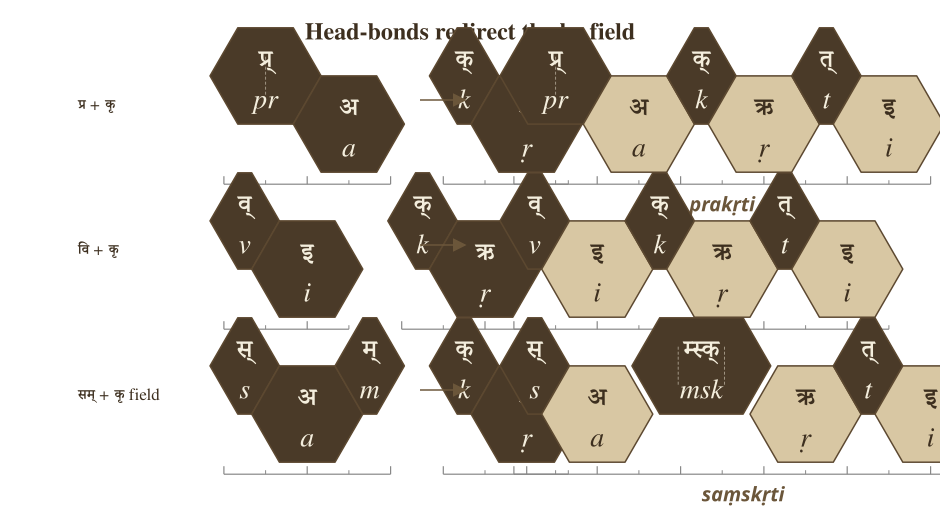
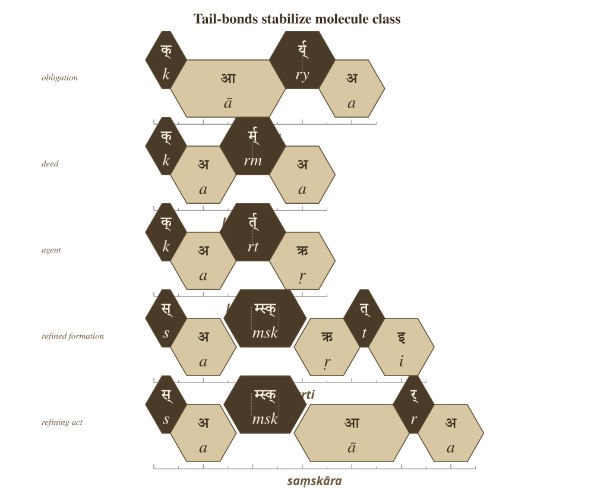
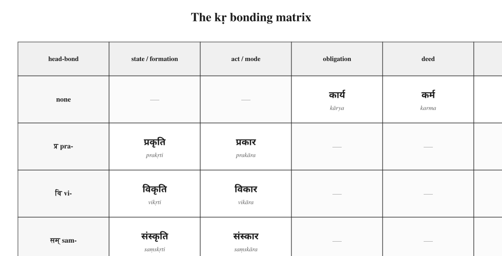
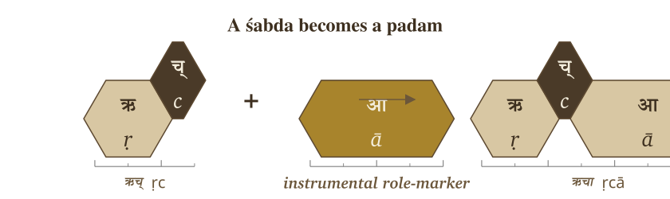
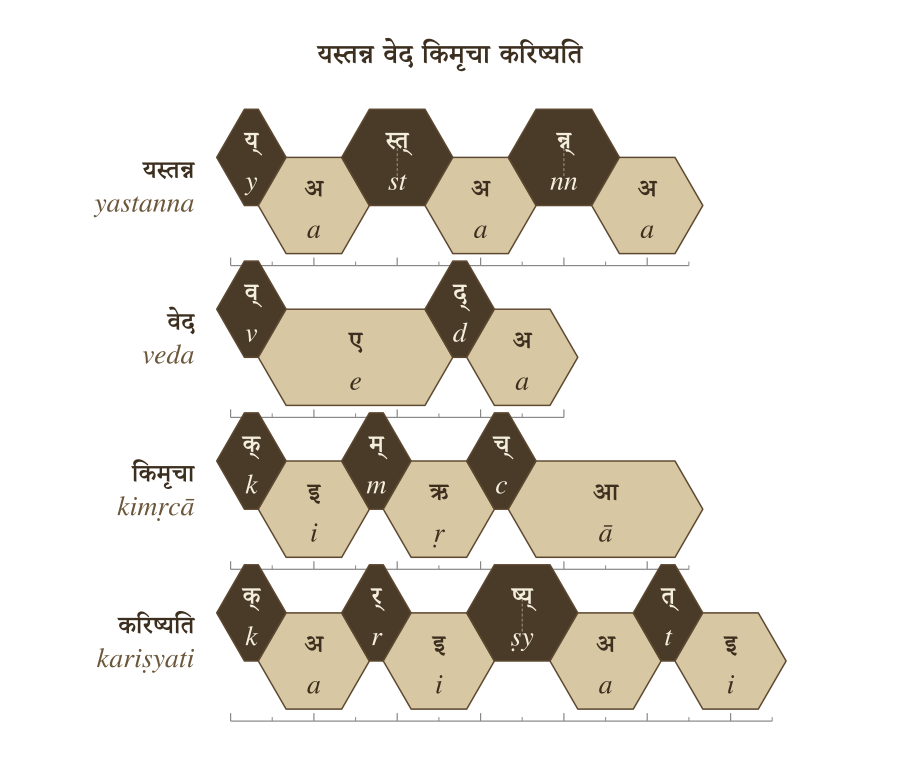
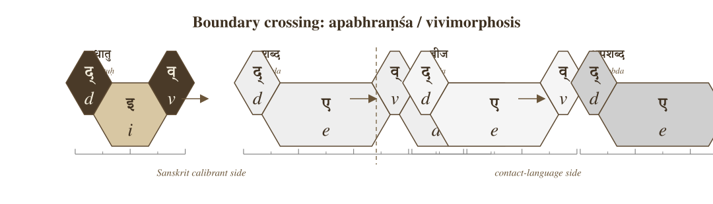

# Chapter 12 — Building the *Vākya* (वाक्य): Sanskrit's Molecular Assembly

## 12.1 From Verbal Molecule to Sentence Assembly

Chapter 11 ended with action. The *dhātuḥ* had entered operation and become a **क्रियापदम् (*kriyāpadam*)** — a verbal molecule. A language must then build names, role-marked words, and sentences. It must let the action enter speech.

Chapter 12 follows that upward movement. The test is simple: can Sanskrit build larger forms without blurring the lower levels? Can the sonomer remain visible inside the atom, the atom inside the molecule, the molecule inside the **पदम् (*padam*)**, and the *padam* inside the **वाक्यम् (*vākyam*)**?

That is the chapter's phrase: **assembly without blur**.

The epigraph gives the problem in Vedic form:

> ऋचो अक्षरे परमे व्योमन्\
> यस्मिन्देवा अधि विश्वे निषेदुः ।\
> यस्तन्न वेद किमृचा करिष्यति\
> य इत्तद्विदुस्त इमे समासते ॥
>
> *ṛco akṣare parame vyoman*\
> *yasmin devā adhi viśve niṣeduḥ |*\
> *yas tan na veda kim ṛcā kariṣyati*\
> *ya it tad vidus ta ime sam āsate ||*

The working sense is direct: the *ṛks* stand in the imperishable highest space, where the devas are seated. What will one who does not know that do with the *ṛc*? Those who know it gather here.[NOTE: rigveda-1-164-39-akshara-assembly]

The verse does more than a grammar manual could do. It places the reader inside the same relation this chapter will develop: a completed utterance depends on the recoverable structure beneath it. The *ṛc* is the assembled utterance. The one who does not know what holds it cannot use it properly.

The verse itself already shows sentence assembly. It carries a locative field — **अक्षरे परमे व्योमन् (*akṣare parame vyoman*)**. It carries a relative enclosure — **यस्मिन् (*yasmin*)**. It carries knowledge and non-knowledge — **वेद (*veda*)**, **न (*na*)**. It carries an instrumental relation — **ऋचा (*ṛcā*)**. It carries future action — **करिष्यति (*kariṣyati*)**, from the same कृ (*kṛ*) atom this chapter will use as its flagship.

The Vedic sentence is already doing what the chapter is about to show. The parts hold their roles. The action is visible. The assembly can be walked.

Yāska gives the chapter its hinge: **नामान्याख्यातजानि (*nāmāny ākhyātajāni*)** — names arise from actions.[NOTE: nirukta-namany-akhyatajani] Treat it as a direction of vision rather than as a slogan that flattens every noun into one mechanical derivation. Sanskrit names are often built from action. The atom acts first; the name crystallizes after.

Chapter 12 therefore begins where Chapter 11 ended. The verbal molecule becomes the source of names. Names receive bonds. Bonds produce *padāni*. *Padāni* enter the *vākya*. The sentence is an assembly that preserves the levels underneath it.

{#fig:building-vakya-pipeline width=90%}

## 12.2 The Bonding Chemistry

The *dhātuḥ* is a semantic atom. To enter speech, it must bond into a sentence-ready form.

Sanskrit bonds the atom in two main directions. A head-bond enters before the atom. A tail-bond enters after it. The traditional names are **उपसर्गः (*upasargaḥ*)** and **प्रत्ययः (*pratyayaḥ*)**.

An *upasargaḥ* redirects the atom's field of action. A *pratyayaḥ* stabilizes the molecule's class: action, agent, deed, instrument, state, obligation, and so on. A **विभक्तिः (*vibhaktiḥ*)** or **तिङ्-प्रत्ययः (*tiṅ-pratyayaḥ*)** then prepares the form for sentence use by marking role, number, person, and relation.

The governing issue is recoverability. The bond remains visible enough for the form to be analyzed, taught, corrected, recited, and recalibrated.

This matters because the philological dogma treats the *upasargaḥ* as a preverb: a spatial particle that gradually fused with the verb through ordinary linguistic evolution. That may be a useful description for some natural-language histories. Sanskrit shows a different operation.

In English, a preposition usually stands outside the action: *from*, *toward*, *over*, *under*. It points from outside. In Sanskrit, the *upasargaḥ* enters the word-body and redirects the action from within the derivation. It bonds with the atom.

A *pratyayaḥ* performs the other side of the chemistry. It completes the molecule into a usable class. One suffix can make an action-name. Another can make an agent. Another can make something-to-be-done. The same atom remains visible, and the molecule's outer shell changes what the form can do in a sentence.

This is why the chemical metaphor is useful. Sanskrit bonds semantic atoms into usable molecules. The bond changes behavior while preserving identity.

The figures keep the timing layer visible. The ruler below each strip marks the *mātrā* scale in half-*mātrā* steps, so the reader can see that sentence assembly still preserves measured sound.

{#fig:building-vakya-visual-key width=85%}

## 12.3 The *Kṛ* Atom as Flagship

The chapter needs one atom that can carry the whole demonstration. The cleanest choice is **कृ (*kṛ*)**.

It is small: a compact sonomeric atom. It is also enormously reactive. In the usage audit, *kṛ* carries the highest measured bonding range among the corpus-linked *dhātavaḥ*: 1,062 measured bonds and 50,155 counted uses.[NOTE: kr-bonding-examples] The number supports the choice. The proof is procedural. The reader can watch *kṛ* bond.

The atom means *do*, *make*, *act*. From that small semantic center Sanskrit builds some of the book's most important words:

| Form | Assembly signal | Function |
|---|---|---|
| **कर्म (*karma*)** | *kṛ* with a tail-bond | deed, action, object of action |
| **कर्तृ (*kartṛ*)** | *kṛ* with an agent-forming tail-bond | doer, maker, agent |
| **कार्य (*kārya*)** | *kṛ* with an obligation-forming tail-bond | that which is to be done |
| **प्रकृति (*prakṛti*)** | *pra-* bonded to *kṛ* | prior condition, nature, original formation |
| **विकृति (*vikṛti*)** | *vi-* bonded to *kṛ* | alteration, deformation, modification |
| **संस्कृति (*saṃskṛti*)** | *sam-* bonded into the *kṛ* field | cultivated order, refined formation |
| **संस्कार (*saṃskāra*)** | *sam-* bonded into the *kṛ* field with a different tail-bond | refining act, consecration, formative impression |

These are lawful molecules built from one semantic atom through different bonds.

The head-bonds alone show the range. **प्र (*pra-*)** directs *kṛ* toward the prior condition: **प्रकृति (*prakṛti*)**. **वि (*vi-*)** directs it toward separation, alteration, and differentiation: **विकृति (*vikṛti*)**. **सम् (*sam-*)** directs it toward gathering, integration, and refinement: **संस्कृति (*saṃskṛti*)** and **संस्कार (*saṃskāra*)**.

The tail-bonds show the same principle from the other side. Bare *kṛ* can become **कर्म (*karma*)**, the deed; **कर्तृ (*kartṛ*)**, the doer; and **कार्य (*kārya*)**, what is to be done. The atom remains visible. The bond determines what the molecule can do.

This is the reason *kṛ* carries Chapter 12. It connects the technical demonstration to the book's highest categories: *prakṛti*, *vikṛti*, and *saṃskṛti*. The words that name the creation triad are themselves products of the bonding chemistry the chapter is demonstrating.

The contrast matters too. Not every atom behaves like *kṛ*. **ह्लाद् (*hlād*)** is a higher-*mātrā*, lower-reactivity atom in the joined analysis.[NOTE: hlad-contrast-atom] It can still bond and generate, but it does not open the same vast molecular field. That difference is useful. Sanskrit's bonding chemistry handles both classes: the hyper-reactive atoms that build large conceptual territories, and the specialized atoms that carry narrower semantic work.

Chapter 12 follows *kṛ* because it makes the procedure visible. Once the reader sees the procedure on the most reactive atom, the same logic can be recognized elsewhere.

{#fig:building-vakya-kr-hlad width=80%}

## 12.4 Head-Bonds: How *Upasargāḥ* Redirect the Atom

The first bonding direction is the head-bond. Sanskrit calls it **उपसर्गः (*upasargaḥ*)**.

An *upasargaḥ* redirects the field in which the atom acts. With *kṛ*, the operation is easy to see because the atom is small and the resulting molecules are familiar.

**प्र (*pra-*)** faces forward, prior, forth. When *pra-* enters the *kṛ* field, the result is **प्रकृति (*prakṛti*)**: the prior condition, nature, original formation. The molecule settles the direction into a precise conceptual place.

**वि (*vi-*)** faces apart, differentiated, separated, modified. When *vi-* enters the same field, the result is **विकृति (*vikṛti*)**: alteration, deformation, modification. The atom remains; the direction of action changes.

**सम् (*sam-*)** faces together, integrated, completed, refined. When *sam-* enters the *kṛ* field, it yields the family of integrated and refined forms: **संस्कृति (*saṃskṛti*)**, **संस्कार (*saṃskāra*)**, and **संस्कृत (*saṃskṛta*)**. In prose, **sam + kṛ** is useful shorthand for the semantic operation. In the actual sonomeric form, the visible **स्** in **संस्कृति** and **संस्कार** must be accounted for by the rules that build the surface molecule.[NOTE: kr-bonding-examples]

The important point is the direction of the bond. The *upasargaḥ* turns *kṛ* toward a field. *Pra-* turns it toward prior formation. *Vi-* turns it toward alteration. *Sam-* turns it toward integrated refinement.

The atom remains visible through the redirection. That is why the molecule can be interpreted. The head-bond changes the field while preserving the atom.

{#fig:building-vakya-head-bonds width=95%}

## 12.5 Tail-Bonds: How *Pratyayāḥ* Stabilize the Molecule

The second bonding direction is the tail-bond. Sanskrit calls it **प्रत्ययः (*pratyayaḥ*)**.

A *pratyayaḥ* completes the molecule into a usable class. The same atom can become a deed, a doer, an obligation, a state, a process, or a form ready for sentence use. The tail-bond determines what the molecule can do.

Start with bare *kṛ*. With one tail-bond, it becomes **कार्य (*kārya*)**: that which is to be done. With another, it becomes **कर्म (*karma*)**: the deed, the action, the object of action. With another, it becomes **कर्तृ (*kartṛ*)**: the doer, the agent.

One atom. Three tail-bonds. Three molecular classes.

Now keep the head-bond the same and change the tail-bond. The **sam-** field gives the clearest contrast:

- **संस्कृति (*saṃskṛti*)** denotes a cultivated order, refined formation, or state.
- **संस्कार (*saṃskāra*)** denotes the refining act, consecration, or formative impression.

The head-bond places the atom in the *sam-* field. The tail-bond decides whether the molecule designates the state, the act, or the result. The difference is grammatical and semantic. *Saṃskṛti* and *saṃskāra* are related because the atom and the head-bond are related. They are distinct because the tail-bond differs.

This is why the chapter calls *pratyayāḥ* valence-shell stabilizers. They complete the outer shell of the molecule. Once the tail-bond lands, the molecule can take a role in a sentence.

The tail-bond gives the atom a job.

{#fig:building-vakya-tail-bonds width=95%}

## 12.6 The *Kṛ* Bonding Matrix

The head-bond and tail-bond can now be placed on one matrix. The matrix is a conservative demonstration of the procedure: one atom, different head-bonds, different tail-bonds, different molecules.

The blanks are intentional. They mark cells this chapter is not using. The test is recoverability, not square-filling: each real molecule in the visible cells has a recoverable construction.

| Head-bond | State / formation | Act / mode | Obligation | Deed | Agent |
|---|---|---|---|---|---|
| none | — | — | कार्य (*kārya*) | कर्म (*karma*) | कर्तृ (*kartṛ*) |
| प्र (*pra-*) | प्रकृति (*prakṛti*) | प्रकार (*prakāra*) | — | — | — |
| वि (*vi-*) | विकृति (*vikṛti*) | विकार (*vikāra*) | — | — | — |
| सम् (*sam-*) | संस्कृति (*saṃskṛti*) | संस्कार (*saṃskāra*) | — | — | — |

Read the table procedurally. Down the rows, the head-bond changes the field: none, *pra-*, *vi-*, *sam-*. Across the columns, the tail-bond changes the molecule's class: state-name, act-name, obligation, deed, agent. At every filled cell, the *kṛ* atom remains the center.

This is molecular construction, not a list of unrelated words later collected by a dictionary.

The matrix also protects the argument from overstatement. Sanskrit's generativity is governed. Productive axes permit a large field of construction because the bonds are lawful; they do not make every possible-looking form equally real.

Chapter 11 made the same point through the *racanā* × *gaṇa* matrix. Some cells were heavy. Some were light. Some were empty. Chapter 12 repeats the point at the molecular level. The cell records a procedure.

{#fig:building-vakya-kr-bonding-matrix width=95%}

## 12.7 From *Śabda* to *Padam*

A **शब्दः (*śabdaḥ*)** carries meaning. A **पदम् (*padam*)** is ready for use inside a sentence because its role has been marked.

This distinction matters. A molecule can name an object, action, quality, agent, or state. A sentence needs relations: who acts, what is known, by what instrument, in what place, toward what object. Sanskrit marks those relations inside the *padam*.

The primary nominal marker is **विभक्तिः (*vibhaktiḥ*)**. A *vibhaktiḥ* saturates the molecule for use by marking role, number, and relation. The verbal side has its own role-marking through **तिङ्-प्रत्ययाः (*tiṅ-pratyayāḥ*)**, which carry person, number, and verbal relation.

Return to the epigraph line:

> यस्तन्न वेद किमृचा करिष्यति
>
> *yas tan na veda kim ṛcā kariṣyati*

The line contains a compact sentence assembly. In **ऋचा (*ṛcā*)**, the **-ā** marks the instrumental relation: *by the ṛc*, *with the ṛc*, *through the ṛc*. The relation is carried inside the *padam*.

The same is true of **किम् (*kim*)**, **तत् (*tat*)**, and **यः (*yaḥ*)**. Each form has entered sentence use with its role marked by form. The parts carry their own relational signatures.

This is why Sanskrit can support freer word order while remaining clear. The order of words can serve emphasis, meter, sound, and poetic architecture because the relations are marked in the *padāni*.

The *śabda* becomes a *padam* when it is prepared for relation. The molecule becomes sentence-ready.

{#fig:building-vakya-rca-role-marker width=85%}

## 12.8 From *Padam* to *Vākya*

Once the *padāni* are saturated, the **वाक्यम् (*vākyam*)** can assemble.

A *vākya* is an assembly of role-marked molecules. The relations are marked in the parts.

Use the same line:

> यस्तन्न वेद किमृचा करिष्यति
>
> *yas tan na veda kim ṛcā kariṣyati*

Break the assembly:

| Padam | Role in the assembly |
|---|---|
| **यः (*yaḥ*)** | the one who |
| **तत् (*tat*)** | that |
| **न (*na*)** | not |
| **वेद (*veda*)** | knows |
| **किम् (*kim*)** | what |
| **ऋचा (*ṛcā*)** | with / by the ṛc |
| **करिष्यति (*kariṣyati*)** | will do |

The English sense is: *What will one who does not know that do with the ṛc?*

The line is short, and every layer remains visible. **करिष्यति (*kariṣyati*)** carries the future action and returns the reader to **कृ (*kṛ*)**, the chapter's flagship atom. **ऋचा (*ṛcā*)** carries the instrumental relation. **यः (*yaḥ*)** and **तत् (*tat*)** set up the relative field. **न (*na*)** negates the knowing. The relations inside the parts hold the sentence together.

By the time the *vākya* is formed, the lower levels remain recoverable. The sonomers remain recoverable because sound-change operates by rule. The *dhātuḥ* remains recoverable because the molecule preserves its atomic identity through affixation. The *upasargaḥ* and *pratyayaḥ* remain recoverable because the bond leaves grammatical and semantic signatures. The *padam* remains recoverable because *vibhaktiḥ* and *tiṅ-pratyayaḥ* mark relation, number, person, and role.

The sentence is the larger assembly. The smaller engineering remains visible inside it.

That is Chapter 12's answer to Chapter 10. The *dhātuḥ* displayed atomic recoverability. The *vākya* displays assembly-scale recoverability. Sanskrit builds upward without losing the levels underneath. Formed Speech keeps her lower levels visible: sonomers, atoms, molecules, bonds, and roles remain traceable inside the assembly.

{#fig:building-vakya-sentence-full-hex width=100%}

## 12.9 Boundary Crossing: अपभ्रंश (*Apabhraṃśa*) = Vivimorphosis

The chapter has now built the Sanskrit side of the story. Sonomers enter atoms. Atoms enter molecules. Molecules become *padāni*. *Padāni* assemble into *vākyāni*. Inside Sanskrit, the levels remain recoverable because the calibrant architecture is still operating.

Now the molecule crosses the boundary.

The *śabda* is an engineered molecule. Its bonds are held by grammar, recitation, *padapāṭha*, *Prātiśākhya*, *Śikṣā*, and the calibration matrix Chapter 14 establishes in full. Inside that architecture, speaker-slip can be detected and corrected. The molecule remains specified.

A contact language carries a different architecture: its own sound system, habits, grammar, and pressures. When a Sanskrit *śabda* enters that medium, Sanskrit's internal correction no longer governs the form. The molecule acquires life in another linguistic ecology.

That process needs two names because it has two faces.

From the Sanskrit side, the process is **अपभ्रंश (*apabhraṃśa*)**: falling away from the engineered form. Chapter 5 developed that term through Patañjali. From the contact-language side, the same process is **vivimorphosis**: the engineered molecule acquiring organic life.[NOTE: apabhramsa-vivimorphosis-boundary]

The transformation happens in stages. A Sanskrit speaker utters the engineered *śabda*. A non-Sanskrit listener receives it. In the listener's cognition, the form becomes a **बीज (*bīja*)**, a seed: latent, carried, not yet expressed. When a later speaker uses that received form inside the receiving language's own sound and grammar, the *bīja* sprouts into an organic root.

The botanical metaphor finally has a proper target. Not the *dhātuḥ*. The *apaśabda*.

What the philological dogma calls roots across its reconstructed daughter-language families are better understood here as expressed *bījas*: forms that crossed the calibrant boundary and then took life in contact languages.

{#fig:building-vakya-vivimorphosis width=95%}

|  | Sanskrit foundation | Sanskrit calibrant side | Listener's cognition | Contact-language side |
|---|---|---|---|---|
| **Form** | **धातु (*dhātu*)** | **शब्द (*śabda*)** | **बीज (*bīja*)** | **अपशब्द (*apaśabda*)** |
| **English** | Atom | Inorganic molecule | Seed | Organic root |
| **State** | Constituent, irreducible | Engineered, crystalline, anti-entropic | Latent, dormant, not-yet-expressed | Alive, growing, drift-prone |
| **Role** | Building block of the *śabda* | Sanskrit speaker utters it | Listener internalizes it | Speaker (often generations later) expresses it in their own language |

**Process across all four stages:** *apabhraṃśa* / vivimorphosis. **Punch line:** *atom → molecule → seed → root — life begins.*

**Worked example (Ch17 §17.2 develops it):** दिव् (*div*, dhātuḥ) → देवः (*devaḥ*, śabda) → *bīja* in proto-Italic listener → Latin *deus* (apaśabda).

**Inverse:** petrification turns organic → mineral; vivimorphosis turns mineral → organic, via the seed.

The form that sprouts from the *bīja* — the expressed organic root — is what Patañjali names in the *Mahābhāṣya* (1.1.1) as **अपशब्द (*apaśabda*)**: the slipped form, the canonical opposite of *śabda*. *Śabda* and *apaśabda* are different in kind, not just in form. One is an engineered molecule held by the calibrant architecture. The other is an organic root expressed from a *bīja*, with its own life in the contact language. The molecule is held by specification. The root takes nourishment from its new linguistic soil. The molecule has no history of its own; the root has descendants, mutations, branches, and a line of evolution within the receiving language.

A clarification matters here, because Chapter 6 has already rejected the word *root* for *dhātavaḥ*. The philological dogma has long called Sanskrit's *dhātavaḥ* "roots" — the central translation Chapter 6 dismantles, because *dhātavaḥ* are engineered constituents in Sanskrit's atomic architecture, not organic origins from which something grew. The botanical-root metaphor was the right word applied to the wrong target. The right target is the *apaśabda*. The *apaśabda* is an organic root — a form that grows, branches, mutates, and dies in the soil of a natural language. The pyramid took a correct linguistic term and aimed it at the wrong object. The right placement is simple: roots are what *apaśabdas* are, not what *dhātavaḥ* are.

The transformation from *śabda* to *apaśabda* has two names. ***Apabhraṃśa*** is Sanskrit's name — the falling-away, the slip from the engineered form, the term Patañjali deploys for what the grammarian must defend against. **Vivimorphosis** is this book's English coining for the same event viewed from the inverse angle: the engineered molecule acquiring organic life. *Apabhraṃśa* foregrounds the loss. *Vivimorphosis* foregrounds the gain. They are the same arrow, seen from the calibrant's side and from the contact language's side.

Petrification turns a living tree into stone. The form is preserved across geological time, but the life is gone. **Vivimorphosis is the inverse.** The engineered *śabda*, preserved for as long as the calibrant architecture holds it, crosses into a contact language and acquires life. It becomes biological. It has descendants of its own in the receiving language. It can mutate. It can die.

The cost of organic life is mortality. The cost of engineered permanence is the absence of ordinary drift. Sanskrit chose engineering. Contact languages receive what Sanskrit engineered and let it come alive.

Chapter 18 §18.6 develops the worked examples: *devaḥ* becoming Latin *deus*; *asuraḥ* becoming Avestan *ahura*; *Sindhuḥ* (Chapter 9 §9.5) becoming Old Persian *Hinduš* and then Greek *Indós* and Latin *Indus*. Each is one *śabda* that crossed the calibrant boundary and vivimorphosed into an organic root with its own life in a contact language. The root carries the molecule's atomic signature; it no longer carries the molecule's engineered bonds. The form is alive; the engineering is gone.

**The pressures of language explain the similarities. They cannot explain the architecture.**

---

## 12.10 Close — Assembly Without Loss

Chapter 10 showed the *dhātuḥ* as an atomic construction. Chapter 11 showed the atom entering operation and becoming action. Chapter 12 has now followed the next scale: the atom becomes *śabda*, the molecule becomes *padam*, and the *padam* enters the *vākya*.

The governing principle is assembly without loss. The sentence is larger than the atom, but the atom remains recoverable inside it. The sonomers remain recoverable because Sanskrit's operations continue to work at the sonomeric level. The head-bond and tail-bond remain recoverable because they leave grammatical and semantic signatures. The role-marker remains recoverable because *vibhaktiḥ* and *tiṅ-pratyayaḥ* carry relation, number, person, and role.

That recoverability is what lets the sentence be interpreted, recited, corrected, and calibrated. Sanskrit generates larger forms while keeping the path back to their construction visible. The *vākya* is therefore not a loose string of words. It is an assembly whose lower layers remain available.

The boundary clarifies the point. Inside Sanskrit, the calibrant architecture holds the molecule in specification. When the *śabda* crosses into a contact language, Chapter 12 has established the process: *apabhraṃśa* from the Sanskrit side, vivimorphosis from the receiving side. The engineered molecule becomes a seed and then an organic root. Life begins, and with life come drift, mutation, and mortality.

The chapter has therefore reached the operating language. Sonomers have become atoms. Atoms have become molecules. Molecules have become role-marked *padāni*. *Padāni* have become *vākyāni*. The lower levels remain visible enough for the whole structure to be preserved.

Chapter 13 asks how such an operating language can survive across time. Chapter 14 introduces the answer: the calibration matrix.
