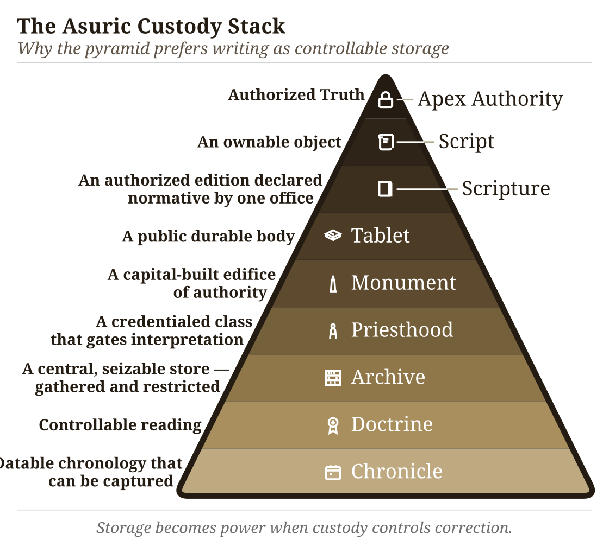

# Chapter 13 — Why Preservation Needs Engineering

## 13.1 What Sanskrit Has to Hold

Sanskrit's architecture was built to last. Its visible components now include the **वर्णमाला (*varṇamālā*)** as the engineered phonetic grid, the **धातवः (*dhātavaḥ*)** as an inventory of reactive atoms, the **गणाः (*gaṇāḥ*)** as Pāṇini's operating classes, the **उपसर्गाः (*upasargāḥ*)** and **प्रत्ययाः (*pratyayāḥ*)** as the bonding procedure, and the **अष्टाध्यायी (*Aṣṭādhyāyī*)** as the formal specification. The system is integrated and complete.

A specification that drifts is no longer a specification. A calibrant calibrated by what it calibrates is no longer a calibrant.

Sanskrit's own vocabulary has a name for the danger: **अपभ्रंशः (*apabhraṃśa*)** — falling away, slippage, the unmaking of an engineered form into fallen-away variants. Patañjali lists the case (Chapter 6 §6.2): **गौः (*gauḥ*)** (the engineered Sanskrit word for *cow*) against the four *apabhraṃśas* the **महाभाष्य (*Mahābhāṣya*)** documents — **गावी (*gāvī*)**, **गोणी (*goṇī*)**, **गोता (*gotā*)**, **गोपोतलिका (*gopotalikā*)**. The source is one. The fallings-away are many. *Apabhraṃśa* is the default trajectory of any linguistic form left to uncalibrated speech.

Left alone, language drifts, or *falls away.*

What Sanskrit has to hold is concrete: sound, meaning, grammar, meter, recitation, and usage, all of it under the ordinary pressure of human speech. The Vedas make the problem visible at full scale. They hold cosmological inquiry, metaphysical vision, ethical order, mathematical proportion, astronomical observation, healing knowledge, and the rules of precise, performative action. Embedded within that breadth is the linguistic architecture this volume isolates: the sound-body, the metrical body, the grammatical body, and the recitational body.

The Vedas function as sacred corpus and primary calibration matrix at once. If that matrix drifts, the calibrant drifts with it.

What belongs to ordinary flow, and what must be held? Sanskrit has the distinction ready-made: *prākṛta*, *saṃskṛta*, and *sanātan*.

## 13.2 *Prākṛta*, *Saṃskṛta*, *Sanātan*

The civilization that engineered Sanskrit organized its world through a functional distinction.

**प्राकृत (*prākṛta*)** is the natural and changing. It is what arises through ordinary social process: everyday speech, stories, customs, local usages, technologies, memories that adapt as they pass through tellers and listeners. *Prākṛta* is allowed to flow.

**संस्कृत (*saṃskṛta*)** is the made-precise. It is what has been worked, refined, and held against drift. *Saṃskṛta* is the name of the language itself, because the language belongs to this category. The *Vedas*, the phonetic specification, the formal grammar, the *dhātu* inventory, the metrical system — these are not left to ordinary flow. They are held.

The distinction maps directly to **सनातन (*sanātan*)** — the perpetual, the ground that does not move. *Saṃskṛta* forms are built to be *sanātan*. *Prākṛta* forms are allowed to change. This is not a hierarchy. It is engineering classification.

The Sanskrit grammatical literature calls the two modes directly: **प्राकृतिक (*prākṛtika*)** for the flowing category, **सांस्कृतिक (*sāṃskṛtika*)** for the held-against-drift category. The categories are functional, not hierarchical.

A local story is *prākṛtika* by purpose, meeting the listener where the listener lives, where change acts as renewal. A Vedic phonetic form is *sāṃskṛtika* by purpose, demanding identical transmission across generations, where change is degradation.

The question is therefore not how a civilization preserves everything, but something narrower:

> What technology preserves the *sāṃskṛtika* bucket without drift?

Writing did not meet that test.

## 13.3 Why Writing Was Insufficient

**लीपि (*lipi*)** is writing: linguistic content fixed in visible glyphs.

The civilization knew writing. It used writing. Brāhmī, Devanagari, the southern scripts, the regional descendants and adaptations — all are *lipi*. The decision not to entrust the *Vedas* to writing was not ignorance of writing. It was engineering judgment.

Writing has one structural feature that disqualifies it from preserving immutable content: it depends on a physical medium. The glyphs must be inscribed on stone, palm leaves, bark, cloth, paper. Every physical medium has two failure modes.

**The first is decay.** Stone weathers; palm leaves rot; cloth fades; paper crumbles. Modern digital media are no exception — magnetic tape demagnetizes, optical disks delaminate, flash storage suffers bit-rot, cloud storage depends on institutional continuity that itself has a lifetime. Every medium has a lifetime; the preservation interval for *sāṃskṛtika* content exceeds it.

**The second is destruction.** Manuscripts burn. Libraries are smashed. Tablets are confiscated and pulped. The subcontinent's record documents cases of all three across the Islamic and colonial periods that followed the architecture's establishment. The engineering decision the civilization made about *lipi* was made long before those particular destructions; it reflects the general observation that any medium dependent on physical storage is destroyable, and that centralized storage concentrates the vulnerability at a single point.

The Indic engineering refused that dependency for the content that could not be risked.

*Lipi* remained appropriate for the *prākṛta* bucket: administration, commentary, education, plays, contemporary stories, regional literature, practical communication. But for the *sāṃskṛtika* bucket — the *Vedas*, the phonetic specification, the recitational system, the architecture's calibrants — writing was insufficient.

The Abrahamic-substrate civilizations made the opposite engineering choice. Their revelatory cores are anchored in the *written word*: the Hebrew Bible, the Christian New Testament, the Qur'an. The capitalization of *Scripture* in English — the elevated capital-S of the religious text, distinct from the lower-case *scripture* of merely-written matter — signals the structural elevation the Abrahamic-substrate framework gives to the perishable-medium technology. The medium has been made theological. The institutional carrier (the church, the synagogue, the mosque; later the academy as the *church of progress*) controls the production, distribution, and interpretation of the medium. The medium's destructibility becomes the institution's lever. Who can copy the manuscript can copy it differently; who can burn the manuscript can erase what it held.

The Indic engineering refused the lever. The architecture did not place its *sāṃskṛtika* content on a destructible medium that an institutional intermediary could control.

{#fig:ch13-asuric-custody-stack width=100%}

That refusal also exposes the foundational dogma's script obsession. The **Western philological machinery** spends enormous energy on script chronology: when Brāhmī appears, whether it derives from Aramaic, what the earliest inscription is, which ruler's edict can be dated. It foregrounds the interface because the interface can be externally dated. Then it treats the interface as if it dates the architecture.

That is the category theft.

What survives from writing cultures is overwhelmingly pyramid media — royal edicts, stone inscriptions, cave donations, coins, seals, potsherds, institutional markings, public assertions of authority — and the archaeological record deepens the fraud accordingly. These are not neutral witnesses to the birth of writing. They are the durable debris of power. They show what the apex chose to carve, stamp, issue, and preserve. The apex does not leave an equally durable record of distributed writing on perishable media.

A non-pyramidal or distributed use of writing would leave a thinner record. If Brāhmī or a precursor was used for notes, accounts, teaching aids, correspondence, working drafts, or mnemonic prompts, the medium would have been perishable. Palm leaf, birch bark, cloth, wood, and temporary writing surfaces do not survive Indian climate and history the way stone survives. The absence of such material is not evidence of absence. It is the predictable silence of perishable media.

The category theft is therefore doubled. The pyramid's account dates the surviving interface and treats that date as the date of the script. Then it dates the script and treats that date as the date of the sound-system. Neither move follows. Glyph chronology is not *varṇamālā* chronology. Stone dates what stone preserved. It does not date the engineering the stone renders. Appendix Part 3 §3.6 develops the survival-archive argument in full, with named exemplars across the Indic and Mediterranean record. The pyramid's label *abugida* describes a surface mechanism; it does not capture the audiographic engineering the script holds.

The ***foundational dogma***'s softer version is more revealing: Brāhmī was adapted brilliantly from a Western source by an unnamed Indic genius. The praise sounds generous. It performs erasure. The brilliance is assigned to the adapter of an interface; the engineering of the sound-system disappears. Appendix Part 3, *The Sonomer and the Audiograph*, develops the argument in full and coins ***audiography*** for the engineered visual capture of articulated sound the script implements. Calling Brāhmī an *abugida* — or filing it under any other surface category of script — is like calling the decimal place-value system "numeral notation." It catalogs the visible symbols and misses the architecture that lets a handful of them generate everything. The glyphs are secondary; the *varṇamālā* is the grid that *audiography* renders into script.

The same interface theft could treat the infinity glyph as the origin of infinity. The glyph made infinity easier to write; it did not make infinity thinkable. *Pūrṇam*, *anādi*, and *ananta* already hold the civilizational grammar of the unbounded.

This is the **heroic erasure** move (Chapter 1 §1.6) applied at the script level. The pattern generalizes. *Heroic erasure* is the asuric machinery's standing move against the **engineering thesis**. Every move has the same shape. A named Indic figure or lineage is celebrated for some surface or secondary contribution — so-called *codification*, documentation, transmission, adaptation — and the celebration is structured *not* to acknowledge that the architecture the figure was operating within is itself engineered. The machinery elevates Pāṇini as the *brilliant documenter* and erases the *varṇamālā* and *dhātupāṭha* he was operating within. It praises the **प्रातिशाख्य (*Prātiśākhya*)** authors as careful phoneticians and erases the engineered phonology they were documenting. It praises the **शिक्षा (*Śikṣā*)** discipline as devoted teachers and erases the engineered specification they were transmitting. Here, it elevates the *brilliant adapter* of Aramaic and erases the *varṇamālā* the script renders. Naming a brilliant Indian *operator* is how the pyramid denies Indian engineering. The *"brilliant adapter"* of Aramaic is the *"clever improver"* of Roman numerals — a figure no historian of mathematics has ever needed. Appendix Part 3 §3.5 reverses the burden in full.

The rebuttal follows the same sequence: Sanskrit's sound-system was engineered, the Vedas held the engineering, and the later disciplines decoded what the architecture already held.

Brāhmī is not a consonantal-alphabetic script of the Aramaic family with a brilliantly-organized Indic surface bolted on top. Brāhmī is the *varṇamālā* made visible. Each consonant glyph maps to a specific *sthāna* and *prayatna* in the engineered phonology Chapter 9 lays out; each vowel glyph holds the temporal specification of its *swara*; the script's own pedagogical ordering reflects the *varga* matrix the *Prātiśākhya* discipline transmits. Devanagari encodes the same *varṇamālā* with different surface glyphs — the structural identity of the two scripts as *varṇamālā* renderings is what makes Devanagari fully readable to anyone who knows the *varṇamālā*. There is no adaptation of an Aramaic template that produces the *varga* matrix, the *sthāna* / *prayatna* organization, or the vowel-diacritic system mapping to the *swara* inventory; those features are not in the Aramaic source and could not be derived from it by any adaptation, brilliant or otherwise. They are in the *varṇamālā*. A few glyph-shapes may show contact influence; the *encoding system* is purely the *varṇamālā*'s.

The architecture's hard work is the *varṇamālā* itself — mapping the mouth, identifying the *sthāna* and *prayatna*, building the multi-axis matrix the *Prātiśākhya* discipline documents. Once that engineering exists, creating visible glyphs for each *varṇa* is a derivative move. The script is the architecture's interface, not its content. The ***church of progress***'s chronology obsession dates the interface and treats the dating as if it dates the architecture. The architecture predates any visible interface and operates independently of whether glyphs have been engraved on stone.

## 13.4 *Aural*, Not *Oral*

India has an oral tradition. So does every civilization.

Every culture holds stories, songs, genealogies, rituals, epics, family memories, and moral instruction through the mouth. African griots, Irish bards, Homeric performers, Norse saga transmitters, Hebrew oral teaching, Arabic poetry, Indigenous American story lineages, Aboriginal Australian narrative memory — oral transmission is universal. There is nothing uniquely Indic about having it; nor is there anything distinctively advanced about having a written one.

What is uniquely Indic is not oral tradition. It is **aural engineering**.

*Oral* is the mouth. *Aural* is the ear. Oral tradition preserves content approximately: the story remains, the wording shifts; the song remains, the regional form varies; the meaning survives, the surface changes. Aural engineering preserves phonetic form exactly: vowel length, accent, breath gesture, place of articulation, sequence, rhythm, and error-correction.

The mouth produces. The ear preserves. The engineering is in what the ear catches that the mouth cannot be trusted to remember alone.

The ***progressive dogma*** collapses both into "oral tradition" because both happen without writing. The collapse serves the linear-progress teleology (Chapter 2 §2.4): writing is taken to be advanced, oral transmission to be primitive residue. The dogma's framing has the engineering backwards.

Writing is easier. It asks one sense to read, one hand to write, one medium to store. Once the glyph exists, the medium holds the burden.

Aural preservation is harder. It requires trained vocal production, trained discriminating hearing, social continuity, *guru-shishya* lineage-discipline, and multi-channel recitation redundancy strong enough to detect and correct error before it becomes inheritance. It uses the body as instrument and the ear as validator. That is not primitive. It is higher engineering.

The label "oral tradition" also flattens the architecture. Indic preservation runs four engineered modes — memory-based retelling, embodied practice, precise speech-hearing transmission, and written documentation where writing is appropriate — and only some are oral at all. The Vedic preservation system is the aural one.

Chapter 14 introduces the full taxonomy and develops the aural mode under the term **Auditure** — preservation through hearing.

The label *oral tradition* tells the reader nothing about the architecture. It tells the reader only that the standard narrative has decided not to look.

## 13.5 *Calibrated*, Not *Codified*

Codification does not stop drift. It only creates an authority against which drift can be judged.

Greek was codified. Latin was codified. Arabic was codified. Hebrew was codified. Tibetan was codified. In each case, the codified standard survived as an authoritative form, but ordinary speech kept moving. Greek moved from Classical to Koine to Byzantine to Modern forms. Latin became the Romance languages. Arabic developed a wide diglossic field between Classical / MSA and the spoken regional varieties. Hebrew preserved scriptural and learned styles, then returned as Modern Hebrew with major phonological and syntactic change. Tibetan preserved a literary standard while spoken Tibetan varieties diverged.

Codification preserves a standard by authority, not a language by architecture.

The grammatical principle is: bond first, usage second, *śāstra* third (Chapter 5). The calibration matrix is that principle scaled to civilization. The standard already stands; the system trains bodies, ears, memory, grammar, and community to hold usage against it.

Sanskrit has displayed **ध्रौव्यता (*dhrauvyatā*)** — constancy across transmission, resistance to drift, the quality of remaining fixed while ordinary speech moves. Its function as **ध्रुवमानभाषा (*dhruva-māna-bhāṣā*)** follows from that constancy: the fixed-measure language, the calibrant against which sound, form, memory, grammar, and usage are held.

Codification also draws a line. The codified standard becomes correct; what falls outside it becomes wrong. Sanskrit did not operate this way. It was not an imperial language imposed from an apex. The living languages of the people were not declared deviant because they were not Sanskrit. They were allowed to flow as *prākṛtika* speech. The calibrant model draws no such line. The calibrant is held; ordinary speech is allowed to flow.

Sanātan did not require every person to speak the calibrant language. Society spoke its living languages, its prākṛtika forms, its regional speech-fields, its household speech, its songs, its market idioms. These were not treated as sinful deviations from an authorized tongue. They were allowed to flourish.

Sanskrit stood elsewhere. Like ध्रुव (dhruva), the fixed star, it served as the calibrant language: the disciplined, preserved, architected standard against which knowledge, ritual, grammar, memory, and civilizational continuity could be held. Its preservation did not rest on a declared standard alone. The Vedic corpus, the Prātiśākhya discipline, Śikṣā, Chandas, the pāṭha systems, Vyākaraṇam, the Dhātupāṭha, and the *guru-shishya* lineage-chains formed a calibration architecture. The burden of that preservation fell on those who chose the path of rigor. The system did not merely announce correctness. It detected drift, corrected drift, and trained the human instrument that held the form.

That architecture rested on *paramparā*, but *paramparā* is not merely "tradition." It is distributed transmission architecture. It has vertical custody and horizontal circulation. The *guru-shishya* lineage-chain holds exact form across generations; the wider transmission-network moves learned people across villages, towns, assemblies, ritual settings, *pāṭhaśālās*, *maṭhas*, and scholarly circuits. Society did not only respect Brahmins, reciters, teachers, and scholars; society funded the network: lodging, food, patronage, *dakṣiṇā*, travel support, public debate, ritual invitations, and scholarly exchange. Knowledge became mobile without becoming centralized.

## 13.6 Two Minds, Two Layers

Minds learn language two ways. Some learn by **saturation**. They hear enough correct speech, read enough correct sentences, recite enough stable forms, and the valid pattern enters them. They cannot necessarily state the rule, but they know when a form has gone wrong. Other minds learn by explicit structure. They want the category, the operation, the named rule. For them, correctness becomes stable when the procedure is visible.

Sanskrit has its own names for both paths. **श्रवण (*śravaṇa*)** — hearing-based reception — serves the saturation-trained mind. **व्याकरणम् (*vyākaraṇam*)** — analytical decomposition — serves the rule-trained mind. Most learners use both pathways and shift between them as mastery deepens. But the weighting differs across individuals, and the difference is real enough that the same language, taught the same way, can produce different kinds of mature speakers.

The two learning-paths also sort out Pāṇini's role. Whether a Pāṇini-style work existed when Sanskrit's architecture was first laid down is not known. The *Aṣṭādhyāyī* itself cites pre-Pāṇinian *vaiyākaraṇāḥ* — Śākalya, Gārgya, Āpiśali, Kāśyapa, Sphoṭāyana, and others — whose works did not survive transmission. There may have been earlier sūtra-level documentation that has been lost; there may not have been. No such claim is necessary.

What survived on the rule-extraction side is one matter. What survived on the saturation side is observable. The Vedic corpus survived, together with its recitation lineages, and the Vedas function as a calibrant matrix: a preserved body of language that holds form against drift across thousands of years. Where a form is in doubt, the Veda settles it. Where pronunciation is in doubt, the *Prātiśākhya* settles it. Where transmission risks decay, the eleven *pāṭhas* of recitation restore it.

Pāṇini's *Aṣṭādhyāyī* added a second redundancy layer on top of that calibrant matrix. The sūtra-level rule-system made the language's structure explicit, compact, portable, recoverable, and teachable. This second layer is especially powerful for rule-trained minds — the *vyākaraṇa*-type readers for whom the rule clicks before the pattern settles. Where the Veda preserves the form as performed, the *Aṣṭādhyāyī* preserves the form as derivable. Pāṇini did not replace the Veda. He added a path suited to another kind of mind.

The same distinction operates in ordinary teaching today. A student writes, "I goed to the store yesterday." The form is wrong. One teacher corrects by rule: "Go is irregular. Its past tense is *went*." Another teacher corrects by sentence: "No — we say, **I went to the store yesterday**." The first correction states the rule. The second restores the form through living use. Two paths; one correction.

The same operation runs in Sanskrit. Suppose a student sees the *dhātuḥ* **⟪धा⟫ (*dhā*)** and, by false analogy with **भवति (*bhavati*)**, writes **धाति (*dhāti*)**. The form is wrong. A *vyākaraṇa*-trained reader corrects by rule: **⟪धा⟫ (*dhā*)** belongs to the third **गणः (*gaṇaḥ*)**, the **जुहोत्यादि (*juhotyādi*)** class. Pāṇini specifies the operation in *Aṣṭādhyāyī* 2.4.75: **जुहोत्यादिभ्यः श्लुः (*juhotyādibhyaḥ śluḥ*)**.[NOTE: juhotyadibhyah-shluh-dadhati] The rule suppresses the regular *vikaraṇa*, reduplicates the *dhātuḥ*, and attaches the personal ending: ⟪धा⟫ → *da-dhā* → **दधाति (*dadhāti*)**. The wrong form **धाति (*dhāti*)** drops out.

A *śravaṇa*-trained reader can correct by mantra. The wrong form registers as deviant against the internalized record, and the corrector quotes the Vedic line:

> वाजी । न । प्रीतः । वयः । दधाति ।
>
> *vājī | na | prītaḥ | vayaḥ | dadhāti* |
>
> *Like a contented stallion, he bestows vital strength.*
>
> *Ṛgveda* 1.66.2

The student hears **दधाति (*dadhāti*)** inside the line, and the wrong form drops away. The mantra cites itself. No rule is needed.

Both readers arrive at the same form. They do not depend on each other. The Veda would correct the error if the *Aṣṭādhyāyī* had never been compiled. The *Aṣṭādhyāyī* corrects the error even where the relevant Vedic line is not at hand. Two independent layers of redundancy hold the same form in place, and two independent layers accommodate two kinds of mind.

If the corpus is lost, the sūtra survives; if the sūtra is lost, the corpus survives. Only the loss of both degrades the language. Sanskrit holds both paths simultaneously.

This is **संस्कृति (*saṃskṛti*)** as preservation system: distributed self-correction without apex command. A pyramid can announce a standard and punish deviation. It cannot, by authority alone, make every participant an instrument of detection. Sanskrit's preservation architecture does that. The threat is not only that the language survived. The threat is that it survived without needing the pyramid.

Natural speech standardizes by usage.

Pyramidal systems standardize by codification.

Sanskrit standardizes by calibration.

Chapter 14 establishes the matrix that makes that calibration possible.
