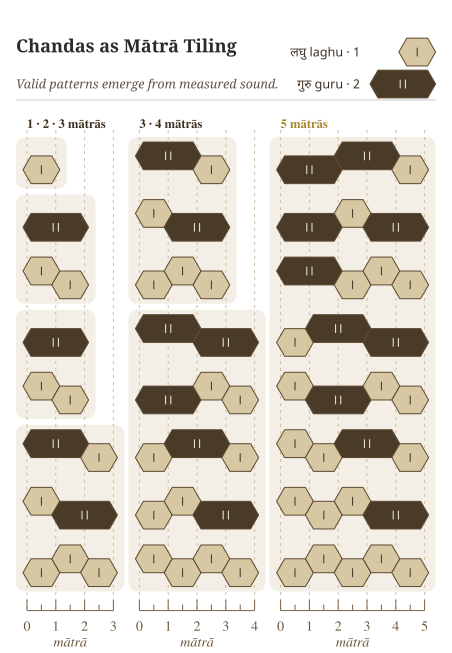

# Chapter 14 — The Calibration Matrix

Sanskrit is the **ध्रुवमानभाषा (*dhruva-māna-bhāṣā*)** — the fixed-measure language, the calibrant whose radiance and consistency hold language and civilizational ethos across thousands of years. This chapter describes the calibration matrix, the architecture that makes that holding possible.

The matrix is **दिव्य (*divya*)** in the precise sense: radiant, brilliant, bearing the order of the *devas*. A system that preserves sound, meter, grammar, memory, and lineage without apex command is radiant because its order gives light without needing a pyramid to issue it.

This is the radiant matrix.

The Vedic form of the same claim is (Chapter 9): भद्रा एषाम् लक्ष्मीः निहिता अधि वाचि (*bhadrā eṣām lakṣmīḥ nihitā adhi vāci*) — auspicious radiance is placed in Speech. The sieve and the garland showed how the sound-field becomes ordered Speech. Sound, meter, grammar, memory, and lineage then act together as the calibration matrix that holds its radiance.

**Central claim.** This is what the pyramid cannot conquer or co-opt: a calibrant that lives within society and rejects the need for apex authority. The pyramid can survey natural drift, codify it, create apex languages (prestige languages placed above living speech), centralize education, and capture transmission through credential, curriculum, and school. It can lord over drift and sanctify codification because both provide an apex-handle. Calibration gives it none. Sound, meter, grammar, memory, lineage, distributed transmission, and architecture hold the measure together; no single gate owns it. So the pyramid hides the category.

Under the pyramid's clock, the *Vedas* shrink to early literature: old texts, "scripture," "ritual" material, and chronological evidence, valued mainly for dating *"Vedic Sanskrit."* The matrix exposes that reduction because the *Vedas* are encoded perfection, held across thousands of years by sound, meter, recitation, lineage, and calibration. What the clock files as early is the most precisely preserved.

The calibration matrix rests on three principles. First: the next generation is the archive. Content survives only when one generation receives it and transmits it to the next. Second: preservation must fit the human instrument. Human beings remember, recite, gesture, hear, discriminate, and correct. Third: the deepest systems use complementary pairs. The practitioner performs while the audience detects drift. The audience are more than passive listeners; they are active participants in an error-correction system.

The motive is visible in the design. Ordinary life can keep moving: stories can be retold, customs can localize, crafts can adapt, speech can flow into regional forms. The matrix holds the measure. It preserves what must remain recoverable when memory weakens, darkness spreads, or authority tries to seize the gate.

The third principle appears everywhere in *Sanātan*. It is structurally central to the **शास्त्रार्थ (*śāstrārtha*)** setting (Chapter 3 §3.5): truth is tested in front of listeners, not certified behind a closed institutional door. The same complementary structure operates in preservation, where the performer holds the content while the listener guards it. Their shared participation distributes the chain across the civilization.

## 14.1 The Four Preservation Modes

The Indic preservation ecology assigns different material to four different methods: writing, memory and retelling, trained bodily performance, and exact speech-hearing transmission. English has ordinary words for the first two but no concise names for the last two as preservation systems. This book therefore proposes three English terms: *Mnemoniture*, *Flexture*, and *Auditure*.

| Mode | Mechanism | Human pair | Preserves | Indic counterpart |
|---|---|---|---|---|
| ***Writing*** | writing on a physical medium | sight + hand | documents, records, commentary, administrative content | **लिपि (*lipi*)** |
| ***Mnemoniture*** *(book coinage)* | memory and retelling | hearing + recall | stories, civilizational frameworks, ethical narratives | **स्मृति (*smṛti*)** |
| ***Flexture*** *(book coinage)* | trained gesture and posture | sight + motor coordination | embodied narrative, ceremonial and performative gesture, performance knowledge | **मुद्रा (*mudrā*)**, **हस्त (*hasta*)**, **नाट्यशास्त्र (*nāṭyaśāstra*)** |
| ***Auditure*** *(book coinage)* | exact speech-hearing transmission | hearing + vocal articulation | phonetic form itself | **श्रुति (*śruti*)** |

The table separates the four preservation modes. The first row shows why writing cannot be allowed to become sovereign. Sanskritic preservation treats writing as *lipi*: useful support, not the source of calibration. The pyramid treats writing as custody: a stored object that can be owned, authorized, gated, and seized.

***Writing*** preserves through *lipi* when writing remains inside its proper scope. It serves records, teaching, commentary, administration, correspondence, and ordinary communication. In the Sanskritic architecture, writing supports the calibrant without becoming the calibrant.

***Mnemoniture*** is preservation by memory and retelling. The coinage combines Greek *mnēmē*, memory, with the English-forming *-ture*. Its Indic counterpart is स्मृति (*smṛti*) — that which is remembered. The *Itihāsas*, *Purāṇas*, *Dharmaśāstras*, *kāvya*, regional retellings, and *Bhakti* compositions preserve civilizational content through memory, recitation, song, story, translation, and retelling.[NOTE: smrti-as-mnemoniture] Mnemoniture does not preserve exact verbal form as its primary object. It preserves the civilizational pattern. The story can move across languages because the story is the carrier.

***Flexture*** is preservation by trained bodily form. The coinage comes from Latin *flexus*, bending or flexing. Its Indic vocabulary includes मुद्रा (*mudrā*), हस्त (*hasta*), and the specification-world of नाट्यशास्त्र (*nāṭyaśāstra*). Classical dance forms preserve knowledge through gesture, posture, rhythm, facial expression, and repeated performance before a trained audience.[NOTE: flexture-natyashastra-dance] The body becomes the medium. The audience becomes the check. A wrong gesture, a weak line, a misplaced expression, a broken rhythm — the discerning viewer sees the drift.

***Auditure*** is preservation by exact speech-hearing transmission. The coinage comes from Latin *audīre*, to hear. Its Indic counterpart is श्रुति (*śruti*) — that which is heard. Auditure preserves not merely meaning, not merely narrative, not merely doctrine, but phonetic form itself: vowel length, accent, consonantal placement, breath gesture, pause, sequence, and metrical fit.[NOTE: shruti-as-auditure] The Vedas belong to Auditure. The **प्रातिशाख्य (*Prātiśākhya*)** and **शिक्षा (*Śikṣā*)** disciplines document and teach the specification. The operational machinery relies on the eleven **पाठाः (*pāṭhāḥ*)** (Chapter 15).

The four modes expose the civilizational contrast. In the Sanskritic ecology, writing remains one support among several: useful for records, teaching, commentary, administration, correspondence, and ordinary communication, but not sovereign over the calibrant.

***Scripture*** is what happens when writing is elevated from support into sovereign preservation. A visible glyph holds the content, and the institution that controls the copy controls the transmission. The medium can be stone, palm leaf, paper, print, or digital storage; the custody logic is the same. The edition can be authorized, restricted, and seized.

The Abrahamic tradition elevates Scripture because the pyramid needs a controlled text. Whoever controls the written corpus controls the doctrine; whoever controls the doctrine controls the people. The same custody logic also explains progressive chronology capture, including the refusal to permit the more logical explanation that Aramaic evolved from Brāhmī (Appendix Part 3 §3.8).

*Sanātan* built a distributed preservation ecology — writing for what writing can hold, memory for what story must hold, gesture for what the body must hold, and hearing for what only exact sound can hold. The preservation engineering mirrors the polity engineering developed earlier (Chapter 3 §3.7): single-medium maps to single-apex pyramid; four-mode distributed maps to non-pyramidal *Sanātan*.

Single medium, single apex. Four modes, distributed civilization.

The same contrast can be stated as a custody stack. Sanskrit distributes correction through lineage, practice, training, community, and the absence of a single chokepoint. The pyramid centralizes custody through archive, office, credential, doctrine, administration, and controlled access.

{#fig:ch14-sanskritic-calibration-vs-asuric-custody width=100%}

## 14.2 Auditure and Speech-Hearing Engineering

Auditure is the deepest of the four modes because the Vedas demand exact phonetic preservation. A story can tolerate retelling. A gesture can tolerate regional style within a discipline. A document can tolerate copying and correction. The Vedic sound-sequence cannot tolerate drift. Its object is the heard form.

The ear is the right instrument for that task. It detects temporal variation with a precision the eye does not match. The eye cannot distinguish consecutive frames at rates higher than approximately twenty-five per second — the basis on which modern video compression operates. The ear distinguishes features from approximately twenty cycles per second up to roughly twenty thousand. It hears pitch, rhythm, stress, resonance, interval, and rupture inside a stream of sound. Vedic recitation is not merely a word-sequence; it is a multi-channel phonetic object — which is exactly what the ear is built to track.

The second engineering fact scales because hearing is easier to distribute than perfect reproduction. A reciter needs years of discipline to reproduce the full sequence, while repeated exposure allows a listening community to detect a broken pattern much earlier. The practitioner therefore holds the skill while the audience holds the check.

Auditure distributes the first layer of guarding among the audience and thereby resolves the old institutional problem: who guards the guards? In a pyramid, the guards sit above the audience, which has no standing. In Auditure, the audience guards by listening. No institutional credential is required for the first layer of detection because the architecture distributes recognition before it distributes mastery.

Because the Vedic form requires absolute precision, it builds in multiple layers of redundancy: meter catches syllabic drift, accent checks pitch drift (through उदात्त (*udātta*), अनुदात्त (*anudātta*), and स्वरित (*svarita*)), and breath gestures correct phonetic drift (via the **अयोगवाह (*ayogavāha*)** sounds **अनुस्वार (*anusvāra*)** and **विसर्ग (*visarga*)** (Chapter 9 §9.5)). Because a broken word breaks the meter, a misplaced accent breaks the chant, and a wrong breath breaks the line, these channels constantly cross-check one another.

This is not "oral tradition" in the loose anthropological sense. It is engineered Auditure. Speech is the medium. Hearing is the verification layer. The audience is the checksum. The *guru-shishya* lineage-chain is the human carrier; the wider transmission-network is the social carrier. No institutional intermediary is required; no perishable medium stands between practitioner and audience. The full machinery (Chapter 15) relies on the eleven *pāṭha* recitation forms that re-encode the Vedic corpus so that drift has almost nowhere to hide.

## 14.3 The Six Preservation Layers

Auditure preserves the Vedic corpus as sound. The full calibration matrix contains six layers. Each layer catches failure modes the other layers may miss.

[FIGURE 14.2: The six-layer calibration matrix — Vedas, Prātiśākhya, Vyākaraṇam, Dhātupāṭha, Varṇamālā, Chandas — with Śikṣā operating as pedagogy across the layers.]

***Layer 1 — The Vedas.*** The Vedas are the preserved corpus. They are the primary calibrant, the sound-body the system protects. Every other layer exists to keep that body from drifting.

***Layer 2 — The *Prātiśākhya* discipline.*** Each *Prātiśākhya* text fixes the phonetic rules of one Vedic recension: how a sound is articulated, where the accent falls, how two sounds join at a junction, where the reciter pauses. It is the written specification a teacher checks a recitation against.

***Layer 3 — *Vyākaraṇam*.*** व्याकरणम् (*vyākaraṇam*) is the grammatical specification, not "grammar" in the schoolbook sense and not "codification" in the dogma's sense. It describes the generative architecture by which valid forms are produced and invalid forms are rejected.

***Layer 4 — The *Dhātupāṭha*.*** The धातवः (*dhātavaḥ*) are the semantic atoms — approximately two thousand of them, organized into ten *gaṇāḥ* (Ch 10–12). The *Dhātupāṭha* preserves the inventory. It tells the architecture which semantic atoms can bond and generate. Without that inventory, the system has no stable atomic stock.

***Layer 5 — The *Varṇamālā*.*** The वर्णमाला (*varṇamālā*) preserves the sound inventory as an articulatory grid. It is not an alphabetic list. It is the mouth mapped into ordered sound. It catches sounds that do not belong to the grid and protects the articulatory specification the rest of the system assumes.

***Layer 6 — *Chandas*.*** छन्दस् (*chandas*) preserves metrical structure. Each Vedic hymn is composed in a specified meter — **गायत्री (*Gāyatrī*)** (24 syllables per stanza in three lines of eight), **अनुष्टुभ् (*Anuṣṭubh*)** (32 syllables in four lines of eight), **त्रिष्टुभ् (*Triṣṭubh*)** (44 syllables in four lines of eleven), **जगती (*Jagatī*)** (48 syllables in four lines of twelve), and many others, each with a precise syllable count, accent pattern, and pause structure per line. Layer 6 operates like a cryptographic hash on the recitation. The engineering chain runs through earlier chapters: molecular saturation in the bonding procedure (Ch 12) produces syntactic fluidity at the phrasal level; syntactic fluidity lets the composer order words by acoustic weight rather than by syntactic necessity; the acoustic-weight ordering produces the metrical structure *Chandas* formalizes. The metrical signature of each hymn is the integrated acoustic fingerprint of the entire hymn — and any drift in the recitation's content shifts the fingerprint. A vowel that has changed length shifts the syllable count of its line; a misplaced accent shifts the accent pattern of its position; a substituted consonant cluster shifts the acoustic weight of its syllable. Meter is not just an aesthetic feature; it is the integrated checksum that catches drift the layer-by-layer specifications might individually miss.

शिक्षा (*Śikṣā*) is not a seventh layer. It is the pedagogy that trains the practitioner across all six. It teaches articulation, tone, duration, accent, breath, and sequence. It makes the matrix transmissible.

The result is not one preservation device but a multi-axis calibration system: the Vedas hold the corpus, the *Prātiśākhya* the phonetic specification, *Vyākaraṇam* the generative rule, the *Dhātupāṭha* the semantic-atomic inventory, the *Varṇamālā* the sound grid, and *Chandas* the metrical integrity — with *Śikṣā* training the human instrument that has to hold all six.

The six layers operate at six different timescales of correction. Layer 1 corrects within a single performance — the audience hears, the practitioner adjusts. Layer 2 corrects within a single teaching career — the teacher trains the student against the *Prātiśākhya* specification. Layer 3 corrects across many teacher-generations — the *Vyākaraṇam* specification is consulted across the entire teacher-student lineage. Layers 4–5 correct across the architectural span — the *Dhātupāṭha* and *Varṇamālā* specifications operate as the deepest constituent-inventory anchors, consulted when any layer above them has recorded drift. Layer 6 corrects at the integrated-fingerprint level. The matrix is hierarchically nested and temporally graded.

## 14.4 Chandas Counts What Poetry Can Hold

*Chandas* treats meter as measured possibility. A poem is not only a sequence of meanings. It is a timed structure that has to be filled without breaking sound, duration, pause, accent, or memory.

A composer working inside a measured line has to know what the line can hold — the necessity is poetic before it is mathematical. A **लघु (*laghu*)** syllable occupies one *mātrā*. A **गुरु (*guru*)** syllable occupies two. The poet fills a timed architecture with syllables of different weights. Once the line is timed, the counting question appears on its own: how many valid patterns can fill this measure exactly?

{#fig:ch14-chandas-matra-tiling width=100%}

Figure 14.3 lays the count out. Three *mātrās* fill three ways, four *mātrās* five, five *mātrās* eight — and the figure shows why those numbers and no others. Each filling is a shorter filling with one syllable set in front: a *guru* before a pattern two *mātrās* shorter, or a *laghu* before one a single *mātrā* shorter. So the eight fillings of five *mātrās* are exactly the three fillings of three *mātrās*, each opened by a *guru*, together with the five fillings of four *mātrās*, each opened by a *laghu*. The fillings of a measure are the fillings of the two measures before it, combined.

The counts add accordingly: one plus two is three, two plus three is five, three plus five is eight. Continue and the run is 1, 2, 3, 5, 8, 13 — the sequence the modern world calls Fibonacci.[NOTE: chandas-laghu-guru-virahanka-sequence] The figure makes it a structure to read off the page rather than a formula to take on trust: each measure's fillings are visibly built from the two before it. Sanskrit prosody reaches the sequence through sound, duration, and poetic necessity.

*Chandas* treats meter as discovered architecture, meaning the discipline reveals valid forms, charts their patterns, and trains poets to hold them. Just as grammar is decoded and the mouth is mapped, meter is measured and discovered—proving that in every case, Sanskrit's disciplines begin from an underlying architecture rather than a top-down authority.

*Chandas* belongs inside the calibration matrix because meter does more than beautify a verse. It defines what a valid timed form can be, gives the poet a design space, gives the reciter a checksum, and gives the listener a way to hear drift. Poetry, mathematics, and preservation meet in the same measured line.

## 14.5 The Whole Language Holds the Sūtra-Discipline

A language holds its standard in one of three ways, and the way decides whether the standard can drift. In a natural language, usage holds it: the standard is whatever the community of speakers happens to do — the ***प्रकृति (*prakṛti*)*** category. In a codified language, authority holds it: a court, academy, or committee selects a standard and enforces it. In Sanskrit, calibration holds it: the architecture corrects itself against a fixed measure — the ***संस्कृति (*saṃskṛti*)*** category. The natural category then splits again, not by mechanism but by anchor. A language with a calibrant to check against stays in orbit — it moves, but Sanskrit's gravity holds it within bounds. A language with none drifts — it moves without limit (Chapter 6 §6.7).

The same discipline operates at the atomic scale (Chapter 10), and the language itself displays it at system scale. These are relative characteristics. A *sūtra* is compact when measured against a longer exposition; unambiguous when measured against a statement that can be misunderstood; essence-bearing when measured against speech that holds less recoverable meaning. At the system scale, the comparison is between Sanskrit as a calibrated language and ordinary uncalibrated speech preserved by habit, local drift, historical residue, and external standardization. Against that comparator, Sanskrit displays the same six characteristics the *sūtra-lakṣaṇam* specifies at the rule scale and seen earlier at the atomic scale.[NOTE: whole-language-sutra-discipline-comparator]

1. It is compact: where ordinary languages accumulate vocabulary and exception by historical layering, Sanskrit uses a finite sonomer inventory, a finite semantic-atom inventory, and compressed rules to generate vast expression.
2. It has no wasted layer: where ordinary language holds residues whose function may no longer be recoverable, every part of the calibration matrix has a task.
3. It is unambiguous: where ordinary speech depends on habit and context to resolve form, Sanskrit specifies sound, timing, accent, meter, and grammar.
4. It is essence-bearing: where ordinary exposition often expands an idea to make it recoverable, Sanskrit can hold distilled knowledge as stable form — mantra, definition, procedure, argument, and philosophical insight.
5. It is many-facing: where specialized language-forms often split apart, the same Sanskrit architecture serves mantra, poetry, śāstra, dialogue, ritual, and philosophy.
6. It is stable through use: where ordinary language changes because people use it, Sanskrit uses performance, hearing, grammar, meter, and lineage to detect drift and restore form.

The whole language holds the sūtra-discipline.

Exact Vedic preservation and continuing *laukika* generation draw differently on one sound architecture. The *chandas* mode serves the primary calibrant by preserving the *udātta-anudātta-svarita* accent system, *pluta* duration, contextual *upadhmānīya*, and the **ड → ळ** realization specified by the *Ṛgveda-Prātiśākhya*. The *bhāṣā* mode applies the generative manual through a reusable *laukika* grid, which remains capable of producing new words without assigning every governed Vedic realization an independent coordinate. Chapter 9 showed how the same architecture performs both tasks.

Western philology converts these operating differences into organic mutation across time. That conversion commits category theft. Pāṇini's **अष्टाध्यायी (*Aṣṭādhyāyī*)** documents *chandasi* rules for the *chandas* mode and *bhāṣāyām* rules for the *bhāṣā* mode within one system; the direct phonetic account of **ळ** comes from the *Ṛgveda-Prātiśākhya*. The corpus is a separate axis: the *laukika* library grows and is winnowed — new *śāstra*, new *kāvya*, works kept and works lost — while the calibrant remains fixed. The language is calibrated; the content is curated.

Other civilizations know mode-splits and codified standards — Classical and Vulgar Latin, Quranic/Classical and modern Arabic, Classical Chinese and modern Sinitic speech. Those comparisons show that one language-field can operate in more than one mode. They do not make Sanskrit one more codified language. Sanskrit's two-mode architecture is uniquely engineered for non-decay. The *"Vedic-to-Classical transition"* that looks like drift to the ***progressive dogma*** is the engineered system functioning exactly as designed.

The two-mode architecture has a name. ***वैचित्र्य (*vaicitrya*)*** — engineered range — at the *racanā* level means the system preserves reach into specialized scaffolds where the modal forms cannot hold (Chapter 10 §10.7). The same signature operates here, one level up. Multiple infinitive endings and pronoun alternates give *chandas* different syllable counts for metrical placement. *Pluta* governs extended duration; accent governs pitch; the *leṭ-lakāra* and injunctive govern verbal range; contextual **ळ** and *upadhmānīya* preserve exact articulation at stated environments. Each feature performs its own work inside the Vedic specification. *Vaicitrya* at the *racanā* level and at the morphological level displays one engineering signature across the architecture's vertical span (Appendix Part 7).

## 14.6 Control Cases: Codification by Authority

Western philology already recognizes deliberate preservation machinery in other traditions.

Masoretic Hebrew combines a consonantal text with vowel points, cantillation marks, and marginal annotations developed and transmitted by scribal schools. Manuscripts such as the Aleppo and Leningrad codices provide visible historical anchors.[NOTE: masoretic-engineered-preservation]

Quranic Arabic combines the *muṣḥaf* with rules of recitation, authorized readings, chains of transmission, and memorization. Named institutions and datable interventions make its custody structure easy for the academy to describe.[NOTE: quranic-engineered-preservation]

Ecclesiastical Latin combines copying against exemplars, correction within scriptoria, reconstruction from manuscript families, and later church authorization of editions.[NOTE: latin-vulgate-engineered-preservation]

These are the control cases. They prove that the machinery already knows how to recognize engineered preservation when the system fits categories it can manage: fixed text, named custodians, dated interventions, visible machinery, and authority-controlled transmission.

### Why Petrification Appeals to the Pyramid

Chapter 2 calls the resulting condition **petrification** when an institution holds a bounded linguistic form apart from ordinary change and makes its accepted form and interpretation depend upon custodians. The term applies to the guarded form, rather than to every language spoken around it. A fixed corpus can remain beside living speech for centuries while the two undergo very different histories.[NOTE: petrified-bounded-forms]

Arabic makes the arrangement easy to see. The Quranic form remains bounded through the *muṣḥaf*, memorization, authorized readings, and recitational disciplines. Modern Standard Arabic extends that inheritance through academies, schools, publishing, broadcasting, and government, while Moroccan, Egyptian, Levantine, Gulf, and other spoken Arabics continue changing through daily use. The familiar labels *High* and *Low* describe their places in an institutional hierarchy; they do not measure the linguistic worth of the people speaking them.[NOTE: petrified-bounded-forms]

Petrification appeals to the pyramid because each preservation function acquires an institutional owner. An authorized edition defines the bounded object, an office governs interpretation, credentials determine who may speak with authority, and centralized education teaches everyone else which form deserves prestige. The form may be preserved with great rigor, while the power to define correctness and authorize interpretation stands above it.

The Masoretic apparatus has layered textual and vocalic control. Quranic preservation has layered recitational and chain-of-transmission control. The Latin canon has institutional copying and correction. Sanskrit has a six-layer calibration matrix plus combinatorial recitation forms — the ***jaṭā*** and ***ghana pāṭhas*** (Chapter 15) — that re-encode the Vedic corpus in multiple transformations precisely so that any drift in one form is detectable by mismatch with the others. On technical depth, Sanskrit matches or exceeds the benchmark cases. On continuity, Sanskrit runs across thousands of years. On redundancy, Sanskrit is more layered than any of the three.

The systems all seek preservation, but corrective authority occupies a different place in each. Authority-bound systems place it around a bounded text, whereas Sanskrit continuously calibrates a living architecture that includes the sound-system, grammar, atom-inventory, and generative engine together.

### How the Pyramid Steers Living Speech

The same institutions can steer a botanical language without freezing it. A survey first shows the pyramid which forms people use and which meanings circulate among them. Schools, examinations, government offices, publishers, broadcasters, translators, and employers then attach material reward and public prestige to selected forms. A favored vocabulary enters textbooks, official records, and paid work, while another vocabulary is pushed toward the home and marked as provincial, obsolete, vulgar, or incorrect. Speakers continue shaping their language through ordinary use, but institutional power has changed the pressures surrounding their choices.[NOTE: botanical-drift-prestige-memory]

Those pressures accumulate across generations. When older words, idioms, and grammatical forms recede from ordinary speech, later readers depend more heavily upon translators, teachers, and institutions to explain the inherited record. An institution that controls both the prestigious language and the authorized account of the past can soften an older warning, replace its category, or remove it from instruction. Natural speech remains indispensable for communication, adaptation, and renewal; the vulnerability appears when a civilization asks changing speech to bear its entire long-term memory without an independent calibrant beside it.

The pyramid therefore benefits from both arrangements. Petrification gives it custody over a bounded form, while institutional pressure lets it influence the direction of botanical change. Sanskrit keeps the fixed measure inside a distributed and generative architecture, beyond either form of institutional custody.

The asymmetry is what exposes the pyramid's insecurity or perhaps jealousy.

The control cases are safe for the pyramid because each keeps authority visible. The Masoretic schools, the Quranic authorities, the church canon, the academies, the courts, the committees — each gives the machinery a custodian to identify. Sanskrit breaks that pattern. Pāṇini can be cited, but he does not exhaust the system. His grammar points backward to the matrix and outward to the living architecture. The machinery therefore praises Pāṇini as so-called codifier while refusing Sanskrit the recognition it gives smaller authority-bound systems. The praise is not a concession; it disguises deliberate concealment.

The pyramid admires authority to the point of forgery: it stamps "engineering" on petrification. The Masoretic apparatus, Quranic recitation, Latin manuscript preservation — frozen texts with visible custodians, exactly the preservation an apex understands — receive the word. Sanskrit is engineered and generative — the attributes the petrified systems do not possess — and the machinery files it under "oral tradition," "cultural conservatism," "pre-modern habit." The label goes where the apex is visible.

This is *heroic erasure* at the preservation-system level — the same move exposed at the script level (Chapter 13 §13.3), now operating one layer up. What can be dated and bounded by external evidence is recognized as engineering; what predates available external evidence is naturalized as cultural-historical drift. The classification flips by selection, not by evidence. The same asymmetry appears at the institutional level (Appendix Part 2), as the Deccan College Encyclopaedic Dictionary project applies historical-principles methodology to Sanskrit while the same machinery recognizes engineered preservation in the parallel traditions.

Because there is a further structural distinction, the difference goes beyond text: while the Masoretic apparatus, Quranic preservation, and the Vulgate tradition each preserve a fixed text, Sanskrit preserves both the Vedic corpus and the generative engine that operates beyond the corpus—the *dhātavaḥ* / *gaṇāḥ* / *upasargāḥ* / *pratyayāḥ* architecture (Chapters 10–12). Therefore, while other traditions preserve only content, the Sanskrit calibration matrix protects the text alongside the architecture that continues producing valid forms, preserving both the content and the machine.

Because a line of transmission can preserve a text while a matrix is required to preserve a system, the word "matrix" earns its place here. Since the Vedas serve as the primary calibrant while *vyākaraṇam*, *dhātavaḥ*, *gaṇāḥ*, *upasargāḥ*, *pratyayāḥ*, *varṇāḥ*, and *chandas* function as the operating architecture, the corpus remains fixed while the engine remains alive.

The three benchmark traditions are not Sanskrit's independent peers. They are Sanskrit's ***प्रतिबिम्ब (Pratibimba)*** in the preservation domain, refracted through the calibrant-contact transmission identified as Wave 2 propagation. The parallel begins here; the propagation mechanics are established later (Chapter 19 §19.2).

## 14.7 The Engineering Precedes Pāṇini

No single named author assembled the calibration matrix. The Vedic corpus is अपौरुषेय (*apauruṣeya*) in the lineage's own account — without human authorship. The *Prātiśākhya* discipline is distributed across recensions. The *Śikṣā* texts teach an already established phonetic specification. The *Dhātupāṭha* and *Varṇamālā* preserve inventories the system already depends on. *Chandas* operates a metrical architecture older than any individual treatise that documents it.

Pāṇini documented a matrix that was already in operation. He did not originate it.

**Pāṇini's praise is selective and therefore dangerously seductive.** The machinery can safely admire the named documenter if admiration makes him look like origin. But Pāṇini is a threat to the pyramid when read correctly. He is not evidence that authority created Sanskrit's order. He is evidence that order already existed deeply enough to be decoded, compressed, and held as rule. The pyramid praises him only by turning him into what he was not.

The Western philological account calls him a codifier because that word lets the asuric machinery relocate the engineering into a later named figure and erase the anonymous architecture underneath him. The dogma's ***"centuries of analysis"*** hypothesis projects the same fabrication onto the phonological framework: gradual assembly by anonymous *Prātiśākhya* and *Śikṣā* authors, built up from observations across many generations. The hypothesis fails the same test. The texts do not show gradual assembly. They do not preserve failed prototypes, provisional sound grids, experimental recitation systems, or incremental discovery notes. They present the matrix as an operating reality.

This constitutes *heroic erasure* at the matrix level: praising the named documenter in order to deny the civilization that made his work possible. By celebrating the documenter, the machinery hides the architecture being documented; it ignores that the *Prātiśākhya* preserves rather than invents speech, that *Śikṣā* trains rather than invents the mouth, and that Pāṇini compresses rather than invents Sanskrit.

The Pāṇini-as-rupture move is heroic erasure in its sharpest form: praise the so-called codifier, then weaponize the praise to convert *vaidika* and *laukika* from domains into chronology. Pāṇini cannot move Sanskrit out of one domain and into another. Domains are not periods. Pāṇini documents both. That is not analysis. It is a grammatical sleight of hand with civilizational consequences (Chapter 2 §2.1).

The standing sequence holds at matrix scale: engineered architecture, Vedic encoding, many decoding disciplines, and Pāṇini's compressed rule-system as the finest surviving documentation of that architecture.

Within this framework, the calibration matrix serves as the engineered architecture, the Vedas operate as the encoding, and the *Prātiśākhya*, *Śikṣā*, *Chandas*, and *Vyākaraṇam* function as the decoding disciplines. Because Pāṇini's decoding is the most compressed and generative, it remains the finest expression of the system, though it is not the origin of the architecture itself.

The teaching-level form of the same claim (Chapter 13 §13.5): the Veda preserves the form as performed; the *Aṣṭādhyāyī* preserves the form as derivable. Pāṇini added redundancy, not origin.

Because heroic erasure works by treating the second redundancy layer as the first, it praises Pāṇini as a codifier in order to erase the Vedic calibrant that was correcting the language before his rules documented its procedure. Consequently, while the named document survives in the foreground, the older operating matrix is pushed behind it, resulting in a redirection of memory rather than its preservation.

The matrix in operation relies on the eleven *pāṭhas*, the aural architecture, the combinatorial recitation forms, and the working machinery by which the Vedic sound-body has been held without observable drift across thousands of years (Chapter 15).

The radiant matrix kept the architecture present. Manuscripts burn, institutions fall, libraries close, and centralized authority recedes. A linguistic architecture engineered into speech, transmitted through the *guru-shishya* lineage-chain, and verified by the listening audience has no single institution to bring down.

The deeper implication is civilizational. The calibration matrix proves materially what Chapter 3 established structurally:
1. Order can exist without a pyramid and without apex authority.
2. Order derived from a calibrant is far more sustainable than order derived from codification.

Sanskrit preserves through sound, meter, lineage, grammar, discipline, and self-correction — not through decree, monopoly, committee, or institutional apex. The standard lives inside the architecture. The asuric machinery cannot merely disagree with Sanskrit; it has to misdescribe it. Natural drift can be governed and codification can be owned, but calibration makes the apex unnecessary because he has no role inside the architecture.

Its architecture displays दिव्यता (*divyatā*) and serves लोकक्षेम (*lokakṣema*) without requiring a pyramid to command it. Sanskrit is evidence that the pyramid is unnecessary.

Later volumes extend this premise into *saṃskṛti*: Sanskrit's fractal of order without centralized authority becomes a way to understand civilization itself.

The matrix operates in its most important medium: sound preserved by disciplined hearing (Chapter 15).

The radiant matrix outlasted the pyramids built over it. It will outlast the pyramids built against it.
