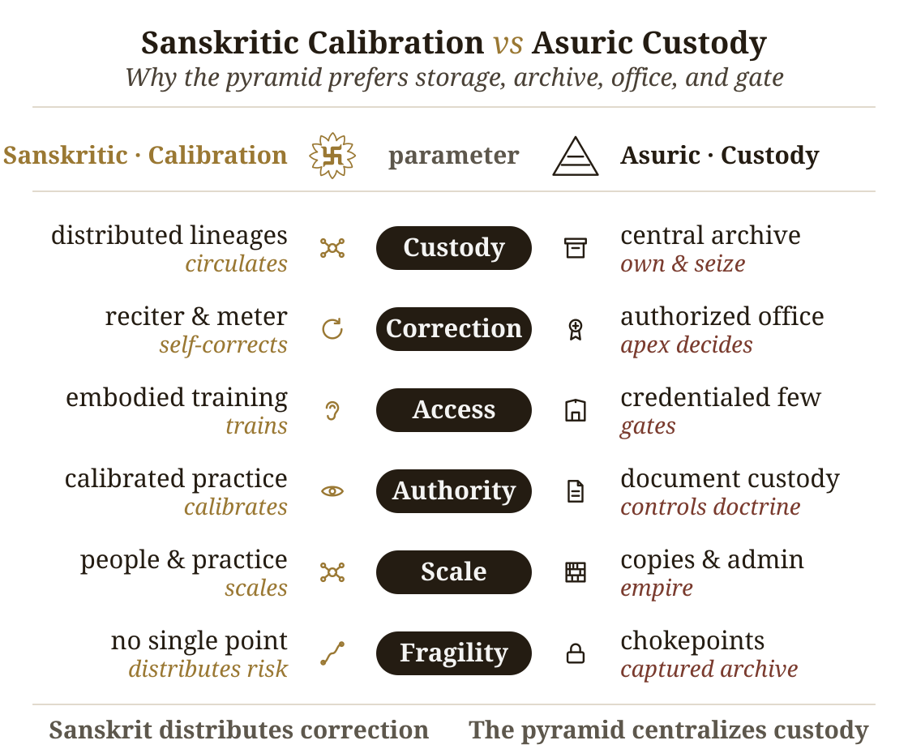

# Chapter 14 — The Calibration Matrix

Sanskrit is the **ध्रुवमानभाषा (*dhruva-māna-bhāṣā*)** — the fixed-measure language (Chapter 13). A fixed measure has to be held across generations. The calibration matrix is the architecture that makes that holding possible.

The matrix is **दिव्य (*divya*)** in the precise sense used here: radiant, brilliant, bearing the order of the *devas*. Here divinity is not ornament or exaggeration; it is radiance as observable architecture. A system that preserves sound, meter, grammar, memory, and lineage without apex command is radiant because its order gives light without needing a pyramid to issue it.

This is the radiant matrix.

The Vedic form of the same claim is (Chapter 9): ***bhadrā eṣām lakṣmīḥ nihitā adhi vāci*** — auspicious radiance is placed in Speech. The sieve and the garland showed how the sound-field becomes ordered Speech. The remaining question is how that radiance is held. The answer is the matrix: sound, meter, grammar, memory, and lineage acting together as calibration.

Under the pyramid's clock, the *Vedas* shrink to early literature: old texts, scripture, ritual material, and chronological evidence, valued mainly for dating *"Vedic Sanskrit."* The matrix answers that too. The *Vedas* are not a corpus waiting to be dated; they are encoded perfection, held across generations by sound, meter, recitation, lineage, and calibration. What the clock files as early is in fact the most precisely preserved.

The matrix rests on three principles. First: the next generation is the archive. Content survives only when one generation receives it and transmits it to the next. Second: preservation must fit the human instrument. Human beings remember, recite, gesture, hear, discriminate, and correct. Third: the deepest systems use complementary pairs. The practitioner performs while the audience detects drift. The audience are more than passive listeners; they are active participants in an error-correction system.

The third principle appears everywhere in *Sanātan*. It is structurally central to the **शास्त्रार्थ (*śāstrārtha*)** setting (Chapter 3 §3.5): truth is tested in front of listeners, not certified behind a closed institutional door. The same complementary structure operates here in the preservation setting. The performer carries the content. The listener guards the content. The chain is distributed because the civilization refused the pyramid.

## 14.1 The Four Preservation Modes

The Indic preservation system has four modes. English has a ready word for one of them: Scripture. It does not have ready words for the other three, so the following sections introduce them.

| Mode | Mechanism | Human pair | Preserves | Indic counterpart |
|---|---|---|---|---|
| ***Writing*** | writing on a physical medium | sight + hand | documents, records, commentary, administrative content | **लिपि (*lipi*)** |
| ***Mnemoniture*** | memory and retelling | hearing + recall | stories, civilizational frameworks, ethical narratives | **स्मृति (*smṛti*)** |
| ***Flexture*** | trained gesture and posture | sight + motor coordination | embodied narrative, ritual gesture, performance knowledge | **मुद्रा (*mudrā*)**, **हस्त (*hasta*)**, **नाट्यशास्त्र (*nāṭyaśāstra*)** |
| ***Auditure*** | exact speech-hearing transmission | hearing + vocal articulation | phonetic form itself | **श्रुति (*śruti*)** |

The table separates the four preservation modes. The first row shows why writing cannot be allowed to become sovereign. Sanskritic preservation treats writing as *lipi*: useful support, not the source of calibration. The pyramid treats writing as custody: a stored object that can be owned, authorized, gated, and seized.

***Writing*** preserves through *lipi* when writing remains inside its proper scope. It serves records, teaching, commentary, administration, correspondence, and ordinary communication. In the Sanskritic architecture, writing supports the calibrant without becoming the calibrant.

***Mnemoniture*** is preservation by memory and retelling. The coinage combines Greek *mnēmē*, memory, with the English-forming *-ture*. Its Indic counterpart is स्मृति (*smṛti*) — that which is remembered. The *Itihāsas*, *Purāṇas*, *Dharmaśāstras*, *kāvya*, regional retellings, and *Bhakti* compositions preserve civilizational content through memory, recitation, song, story, translation, and retelling.[NOTE: smrti-as-mnemoniture] Mnemoniture does not preserve exact verbal form as its primary object. It preserves the civilizational pattern. The story can move across languages because the story is the carrier.

***Flexture*** is preservation by trained bodily form. The coinage comes from Latin *flexus*, bending or flexing. Its Indic vocabulary includes मुद्रा (*mudrā*), हस्त (*hasta*), and the specification-world of नाट्यशास्त्र (*nāṭyaśāstra*). Classical dance forms preserve knowledge through gesture, posture, rhythm, facial expression, and repeated performance before a trained audience.[NOTE: flexture-natyashastra-dance] The body becomes the medium. The audience becomes the check. A wrong gesture, a weak line, a misplaced expression, a broken rhythm — the discerning viewer sees the drift.

***Auditure*** is preservation by exact speech-hearing transmission. The coinage comes from Latin *audīre*, to hear. Its Indic counterpart is श्रुति (*śruti*) — that which is heard. Auditure preserves not merely meaning, not merely narrative, not merely doctrine, but phonetic form itself: vowel length, accent, consonantal placement, breath gesture, pause, sequence, and metrical fit.[NOTE: shruti-as-auditure] The Vedas belong to Auditure. The **प्रातिशाख्य (*Prātiśākhya*)** and **शिक्षा (*Śikṣā*)** disciplines document and teach the specification. The operational machinery relies on the eleven **पाठाः (*pāṭhāḥ*)** (Chapter 15).

The four modes expose the civilizational contrast. In the Sanskritic ecology, writing remains one support among several: useful for records, teaching, commentary, administration, correspondence, and ordinary communication, but not sovereign over the calibrant.

***Scripture*** is what happens when writing is elevated from support into sovereign preservation. A visible glyph carries the content, and the institution that controls the copy controls the transmission. The medium can be stone, palm leaf, paper, print, or digital storage; the custody logic is the same. The edition can be authorized, restricted, and seized.

This is why the Abrahamic tradition elevates Scripture: the pyramid needs a controlled text. Whoever controls the written corpus controls the doctrine; whoever controls the doctrine controls the people. The same custody logic also explains progressive chronology capture, including the refusal to permit the more logical explanation that Aramaic evolved from Brāhmī (Appendix Part 3 §3.8).

*Sanātan* built a distributed preservation ecology — writing for what writing can carry, memory for what story must carry, gesture for what the body must carry, and hearing for what only exact sound can carry. The preservation engineering mirrors the polity engineering developed earlier (Chapter 3 §3.6): single-medium maps to single-apex pyramid; four-mode distributed maps to non-pyramidal *Sanātan*.

Single medium, single apex. Four modes, distributed civilization.

The same contrast can be stated as a custody stack. Sanskrit distributes correction through lineage, practice, training, community, and the absence of a single chokepoint. The pyramid centralizes custody through archive, office, credential, doctrine, administration, and controlled access.

{#fig:ch14-sanskritic-calibration-vs-asuric-custody width=100%}

## 14.2 Auditure and Speech-Hearing Engineering

Auditure is the deepest of the four modes because the Vedas demand exact phonetic preservation. A story can tolerate retelling. A gesture can tolerate regional style within a discipline. A document can tolerate copying and correction. The Vedic sound-sequence cannot tolerate drift. Its object is the heard form.

The ear is the right instrument for that task. It detects temporal variation with a precision the eye does not match. The eye cannot distinguish consecutive frames at rates higher than approximately twenty-five per second — the basis on which modern video compression operates. The ear distinguishes features from approximately twenty cycles per second up to roughly twenty thousand. It hears pitch, rhythm, stress, resonance, interval, and rupture inside a stream of sound. Vedic recitation is not merely a word-sequence; it is a multi-channel phonetic object — which is exactly what the ear is built to track.

The second engineering fact is the one that scales: hearing is easier to distribute than perfect reproduction. A trained reciter requires years of discipline. A listening community can detect deviation long before every member can reproduce the full sequence. Anyone who has heard the correct form repeatedly can hear when a familiar pattern breaks. The practitioner carries the skill. The audience carries the check.

This answers the old institutional question: who guards the guards? In a pyramid, the guards sit above the audience. The audience has no standing. In Auditure, the audience guards by listening. No institutional credential is required for the first layer of detection because the architecture distributes recognition before it distributes mastery.

The Vedic form adds further redundancy. Meter catches syllabic drift. Accent catches pitch drift: उदात्त (*udātta*), अनुदात्त (*anudātta*), स्वरित (*svarita*). Breath gestures catch phonetic drift: the **अयोगवाह (*ayogavāha*)** sounds **अनुस्वार (*anusvāra*)** and **विसर्ग (*visarga*)** (Chapter 9 §9.5). A broken word can break the meter. A misplaced accent can break the chant. A wrong breath can break the line. The channels check one another.

This is not "oral tradition" in the loose anthropological sense. It is engineered Auditure. Speech is the medium. Hearing is the verification layer. The audience is the checksum. The *guru-shishya* lineage-chain is the human carrier; the wider transmission-network is the social carrier. No institutional intermediary is required; no perishable medium stands between practitioner and audience. The full machinery (Chapter 15) relies on the eleven *pāṭha* recitation forms that re-encode the Vedic corpus so that drift has almost nowhere to hide.

## 14.3 The Six Preservation Layers

Auditure preserves the Vedic corpus as sound. The full calibration matrix contains six layers. Each layer catches failure modes the other layers may miss.

[FIGURE 14.2: The six-layer calibration matrix — Vedas, Prātiśākhya, Vyākaraṇam, Dhātupāṭha, Varṇamālā, Chandas — with Śikṣā operating as pedagogy across the layers.]

***Layer 1 — The Vedas.*** The Vedas are the preserved corpus. They are the primary calibrant, the sound-body the system protects. Every other layer exists to keep that body from drifting.

***Layer 2 — The *Prātiśākhya* discipline.*** The *Prātiśākhya* texts specify the phonetic rules of particular Vedic recensions: sound, accent, junction, pause, and recitational detail. They are specification documents.

***Layer 3 — *Vyākaraṇam*.*** व्याकरणम् (*vyākaraṇam*) is the grammatical specification, not "grammar" in the schoolbook sense and not "codification" in the dogma's sense. It describes the generative architecture by which valid forms are produced and invalid forms are rejected.

***Layer 4 — The *Dhātupāṭha*.*** The धातवः (*dhātavaḥ*) are the semantic atoms — approximately two thousand of them, organized into ten *gaṇāḥ* (Ch 10–12). The *Dhātupāṭha* preserves the inventory. It tells the architecture which semantic atoms can bond and generate. Without that inventory, the system has no stable atomic stock.

***Layer 5 — The *Varṇamālā*.*** The वर्णमाला (*varṇamālā*) preserves the sound inventory as an articulatory grid. It is not an alphabetic list. It is the mouth mapped into ordered sound. It catches sounds that do not belong to the grid and protects the articulatory specification the rest of the system assumes.

***Layer 6 — *Chandas*.*** छन्दस् (*chandas*) preserves metrical structure. Each Vedic hymn is composed in a specified meter — **गायत्री (*Gāyatrī*)** (24 syllables per stanza in three lines of eight), **अनुष्टुभ् (*Anuṣṭubh*)** (32 syllables in four lines of eight), **त्रिष्टुभ् (*Triṣṭubh*)** (44 syllables in four lines of eleven), **जगती (*Jagatī*)** (48 syllables in four lines of twelve), and many others, each with a precise syllable count, accent pattern, and pause structure per line. Layer 6 operates like a cryptographic hash on the recitation. The engineering chain runs through earlier chapters: molecular saturation in the bonding procedure (Ch 12) produces syntactic fluidity at the phrasal level; syntactic fluidity lets the composer order words by acoustic weight rather than by syntactic necessity; the acoustic-weight ordering produces the metrical structure *Chandas* formalizes. The metrical signature of each hymn is the integrated acoustic fingerprint of the entire hymn — and any drift in the recitation's content shifts the fingerprint. A vowel that has changed length shifts the syllable count of its line; a misplaced accent shifts the accent pattern of its position; a substituted consonant cluster shifts the acoustic weight of its syllable. Meter is not just an aesthetic feature; it is the integrated checksum that catches drift the layer-by-layer specifications might individually miss.

शिक्षा (*Śikṣā*) is not a seventh layer. It is the pedagogy that trains the practitioner across all six. It teaches articulation, tone, duration, accent, breath, and sequence. It makes the matrix transmissible.

The result is not one preservation device but a multi-axis calibration system: the Vedas hold the corpus, the *Prātiśākhya* the phonetic specification, *Vyākaraṇam* the generative rule, the *Dhātupāṭha* the semantic-atomic inventory, the *Varṇamālā* the sound grid, and *Chandas* the metrical integrity — with *Śikṣā* training the human instrument that has to carry all six.

The six layers operate at six different timescales of correction. Layer 1 corrects within a single performance — the audience hears, the practitioner adjusts. Layer 2 corrects within a single teaching career — the teacher trains the student against the *Prātiśākhya* specification. Layer 3 corrects across many teacher-generations — the *Vyākaraṇam* specification is consulted across the entire teacher-student lineage. Layers 4–5 correct across the architectural span — the *Dhātupāṭha* and *Varṇamālā* specifications operate as the deepest constituent-inventory anchors, consulted when any layer above them has recorded drift. Layer 6 corrects at the integrated-fingerprint level. The matrix is hierarchically nested and temporally graded.

## 14.4 Chandas Counts What Poetry Can Hold

*Chandas* treats meter as measured possibility. A poem is not only a sequence of meanings. It is a timed structure that has to be filled without breaking sound, duration, pause, accent, or memory.

A composer working inside a measured line has to know what the line can hold — the necessity is poetic before it is mathematical. A **लघु (*laghu*)** syllable occupies one *mātrā*. A **गुरु (*guru*)** syllable occupies two. The poet fills a timed architecture with syllables of different weights. Once the line is timed, the counting question appears on its own: how many valid patterns can fill this measure exactly?

Take four *mātrās*. Let **G** stand for a *guru* syllable and **L** for a *laghu* syllable. Four *mātrās* can be filled in five ways:

```text
GG      = 2 + 2
GLL     = 2 + 1 + 1
LGL     = 1 + 2 + 1
LLG     = 1 + 1 + 2
LLLL    = 1 + 1 + 1 + 1
```

Add one more *mātrā*, and the count becomes eight:

```text
GGL
GLG
LGG
GLLL
LGLL
LLGL
LLLG
LLLLL
```

Continue the same question and the counts run:

```text
1, 2, 3, 5, 8, 13...
```

The modern world calls this the Fibonacci sequence. Sanskrit prosody reaches it through sound, duration, and poetic necessity.[NOTE: chandas-laghu-guru-virahanka-sequence]

The recurrence is direct once the metrical problem is visible. Every valid pattern of *n* *mātrās* ends in one of two ways. If it ends in *laghu*, the preceding part must fill *n − 1* *mātrās*. If it ends in *guru*, the preceding part must fill *n − 2* *mātrās*. The count for *n* therefore comes from the two counts before it. The mathematics follows the meter.

*Chandas* treats meter as discovered architecture. The discipline reveals the valid forms, counts their possibilities, charts their patterns, and trains poets and reciters to hold them. Grammar is decoded. The mouth is mapped. Meter is measured and discovered. In each case, Sanskrit's disciplines begin from architecture, not authority.

That is why *Chandas* belongs inside the calibration matrix. Meter does more than beautify a verse. It defines what a valid timed form can be, gives the poet a design space, gives the reciter a checksum, and gives the listener a way to hear drift. Poetry, mathematics, and preservation meet in the same measured line.

## 14.5 The Whole Language Carries the Sūtra-Discipline

Natural languages standardize by usage: the ***प्रकृति (*prakṛti*)*** category. Codified languages standardize by codification: selected standards held by authority. Sanskrit standardizes by calibration: the ***संस्कृति (*saṃskṛti*)*** category, architecture correcting itself. The natural category splits once more — by anchoring rather than mechanism: a calibrant-anchored language **diverges** within bounds, while a language with no calibrant **drifts** without bound (Chapter 6 §6.7).

The same discipline operates at the atomic scale (Chapter 10). At system scale, the answer is the language itself. These are relative characteristics. A *sūtra* is compact when measured against a longer exposition; unambiguous when measured against a statement that can be misunderstood; essence-bearing when measured against speech that carries less recoverable meaning. At the system scale, the comparison is between Sanskrit as a calibrated language and ordinary uncalibrated speech carried by habit, local drift, historical residue, and external standardization. Against that comparator, Sanskrit displays the same six characteristics the *sūtra-lakṣaṇam* specifies at the rule scale and seen earlier at the atomic scale.[NOTE: whole-language-sutra-discipline-comparator]

1. It is compact: where ordinary languages accumulate vocabulary and exception by historical layering, Sanskrit uses a finite sonomer inventory, a finite semantic-atom inventory, and compressed rules to generate vast expression.
2. It has no wasted layer: where ordinary language carries residues whose function may no longer be recoverable, every part of the calibration matrix has a task.
3. It is unambiguous: where ordinary speech depends on habit and context to resolve form, Sanskrit specifies sound, timing, accent, meter, and grammar.
4. It is essence-bearing: where ordinary exposition often expands an idea to make it recoverable, Sanskrit can carry distilled knowledge as stable form — mantra, definition, procedure, argument, and philosophical insight.
5. It is many-facing: where specialized language-forms often split apart, the same Sanskrit architecture serves mantra, poetry, śāstra, dialogue, ritual, and philosophy.
6. It is stable through use: where ordinary language changes because people use it, Sanskrit uses performance, hearing, grammar, meter, and lineage to detect drift and restore form.

The whole language carries the sūtra-discipline.

This is why *chandas* and *bhāṣā* do not prove drift. They are operating modes inside one architecture. The *chandas* mode is the primary calibrant. The *bhāṣā* mode operates under a generative manual. Difference between modes is not decay. It is the system doing what it was engineered to do. The Western philological dogma treats the visible differences between *vaidika* and *laukika* Sanskrit — features of the *chandas* mode (the *udātta-anudātta-svarita* accent system; the ळ (*ḷ*) sound; certain lexical and morphological adjustments) that the *bhāṣā* mode does not deploy — as evidence of organic mutation across time. The category is wrong. Pāṇini's **अष्टाध्यायी (*Aṣṭādhyāyī*)** operates the *chandasi* rules (*chandas* mode) and the *bhāṣāyām* rules (*bhāṣā* mode) **synchronically**, not as older-to-newer chronology.

Other civilizations know mode-splits and codified standards — Classical and Vulgar Latin, Quranic/Classical and modern Arabic, Classical Chinese and modern Sinitic speech. Those comparisons show that one language-field can operate in more than one mode. They do not make Sanskrit one more codified language. Sanskrit's two-mode architecture is uniquely engineered for non-decay. The *"Vedic-to-Classical transition"* that looks like drift to the ***progressive dogma*** is the engineered system functioning exactly as designed.

The two-mode architecture has a name. ***वैचित्र्य (*vaicitrya*)*** — engineered range — at the *racanā* level means the system preserves reach into specialized scaffolds where the modal forms cannot carry (Chapter 10 §10.8). The same signature operates here, one level up. The *chandas* mode preserves multiple infinitive endings (*-tum*, *-tavai*, *-dhyai*, *-tave*, *-tos*, *-sani*) because metrical scope requires alternative syllable-counts; the *bhāṣā* mode keeps *-tum* canonical because non-metrical speech does not. The same pattern carries *plutaḥ* extended vowels, the *leṭ-lakāra* subjunctive, the injunctive, pronoun alternates *bhiḥ* / *ebhiḥ*, and the retroflex lateral ळ. These are not residual archaisms. They are the engineered range *chandas* requires to do its metrical anti-entropy work without falsely flagging metrically-legitimate variation as drift. *Vaicitrya* at the *racanā* level; *vaicitrya* at the morphological level; one engineering signature operating across the architecture's vertical span (Appendix Part 7).

## 14.6 Control Cases: Codification by Authority

The Western philological machinery already recognizes engineered preservation when it sees it in other traditions.

It recognizes the Masoretic Hebrew apparatus: the schools of Jewish scribes at Tiberias and Babylonia from roughly the sixth through the tenth century CE assembled a consonantal text, vowel pointing (*niqqud*), cantillation marks (*ṭe'amim*), and marginal machinery (*Masora*), with the Aleppo Codex (early tenth century) and the Leningrad Codex (1008 CE) as the standard manuscript anchors.[NOTE: masoretic-engineered-preservation] It recognizes the Quranic Arabic apparatus: the Uthmanic *muṣḥaf* codified under the third Caliph in the mid-seventh century, around which *tajwīd* (recitation rules), *qirā'āt* (the canonical readings codified by Ibn Mujāhid in the tenth century and later extended to ten), *isnād* (chain-of-transmission), and *ḥifẓ* (memorization) operate as a layered architecture.[NOTE: quranic-engineered-preservation] It recognizes ecclesiastical Latin preservation: Jerome's Vulgate (late fourth / early fifth century CE), the monastic scriptorium copying tradition with correction against exemplars, stemmatic reconstruction, and later ecclesiastical authorization through the Council of Trent (1545–1563) and the Sixto-Clementine printed edition (1592).[NOTE: latin-vulgate-engineered-preservation]

These are the control cases. They prove that the machinery already knows how to recognize engineered preservation when the system fits categories it can manage: fixed text, named custodians, dated interventions, visible machinery, and authority-controlled transmission.

The Masoretic apparatus has layered textual and vocalic control. Quranic preservation has layered recitational and chain-of-transmission control. The Latin canon has institutional copying and correction. Sanskrit has a six-layer calibration matrix plus combinatorial recitation forms — the ***jaṭā*** and ***ghana pāṭhas*** (Chapter 15) — that re-encode the Vedic corpus in multiple transformations precisely so that any drift in one form is detectable by mismatch with the others. On technical depth, Sanskrit matches or exceeds the benchmark cases. On continuity, Sanskrit runs across thousands of years. On redundancy, Sanskrit is more layered than any of the three.

The distinction is not preservation versus non-preservation. All three preserve. The distinction is mechanism. Codified systems preserve through authority around a bounded object. Sanskrit preserves through calibration across a living architecture. Authority can guard a text. Calibration can hold a text, a sound-system, a grammar, an atom-inventory, and a generative engine in one architecture.

The asymmetry is what exposes the pyramid's insecurity or perhaps jealousy.

The control cases are safe for the pyramid because each keeps authority visible. The Masoretic schools, the Quranic authorities, the church canon, the academies, the courts, the committees — each gives the machinery a custodian to identify. Sanskrit breaks that pattern. Pāṇini can be cited, but he does not exhaust the system. His grammar points backward to the matrix and outward to the living architecture. That is why the machinery praises Pāṇini as so-called codifier while refusing Sanskrit the recognition it gives smaller authority-bound systems. The praise does not arise from concession, what it disguises is deliberate concealment.

The pyramid calls the Masoretic apparatus engineering. It calls Quranic recitation engineering. It calls Latin manuscript preservation engineering. When Sanskrit exceeds those benchmarks, it calls the result "oral tradition," "cultural conservatism," or "pre-modern habit." Same standard, different classification.

This is *heroic erasure* at the preservation-system level — the same move exposed at the script level (Chapter 13 §13.3), now operating one layer up. What can be dated and bounded by external evidence is recognized as engineering; what predates available external evidence is naturalized as cultural-historical drift. The classification flips by selection, not by evidence. The same asymmetry appears at the institutional level (Appendix Part 2), as the Deccan College Encyclopaedic Dictionary project applies historical-principles methodology to Sanskrit while the same machinery recognizes engineered preservation in the parallel traditions.

There is a further distinction. The Masoretic apparatus preserves a fixed text. Quranic preservation preserves a fixed text. The Vulgate tradition preserves a fixed text. Sanskrit preserves the Vedic corpus and the generative engine that operates beyond the corpus — the *dhātavaḥ* / *gaṇāḥ* / *upasargāḥ* / *pratyayāḥ* architecture (Chapters 10–12). The calibration matrix protects the text and the architecture that can continue producing valid Sanskrit forms. Other traditions preserve content. Sanskrit preserves content and the machine.

The word "matrix" earns its place. A line of transmission can preserve a text; a matrix preserves a system. The Vedas remain the primary calibrant; *vyākaraṇam*, *dhātavaḥ*, *gaṇāḥ*, *upasargāḥ*, *pratyayāḥ*, *varṇāḥ*, and *chandas* remain the operating architecture. The corpus is fixed. The engine remains alive.

The three benchmark traditions are not Sanskrit's independent peers. They are Sanskrit's ***प्रतिबिम्ब (Pratibimba)*** in the preservation domain, refracted through the calibrant-contact transmission identified as Wave 2 propagation. The parallel begins here; the propagation mechanics are established later (Chapter 19 §19.2).

## 14.7 The Engineering Precedes Pāṇini

The calibration matrix was not assembled by one named author. The Vedic corpus is अपौरुषेय (*apauruṣeya*) in the lineage's own account — without human authorship. The *Prātiśākhya* discipline is distributed across recensions. The *Śikṣā* texts teach an already established phonetic specification. The *Dhātupāṭha* and *Varṇamālā* preserve inventories the system already depends on. *Chandas* operates a metrical architecture older than any individual treatise that documents it.

Pāṇini stands inside this matrix. He does not stand at its origin.

This is why the praise is selective. The machinery can safely admire the named grammarian if admiration makes him look like origin. But Pāṇini is a threat to the pyramid when read correctly. He is not evidence that authority created Sanskrit's order. He is evidence that order already existed deeply enough to be decoded, compressed, and carried as rule. The pyramid praises him only by turning him into what he was not.

The Western philological account calls him a codifier because that word lets the asuric machinery relocate the engineering into a later named figure and erase the anonymous architecture underneath him. The dogma's ***"centuries of analysis"*** hypothesis projects the same fabrication onto the phonological framework: gradual assembly by anonymous *Prātiśākhya* and *Śikṣā* authors, built up from observations across many generations. The hypothesis fails the same test. The texts do not show gradual assembly. They do not preserve failed prototypes, provisional sound grids, experimental recitation systems, or incremental discovery notes. They present the matrix as an operating reality.

That is the *heroic erasure* move at the matrix level. Praise the named grammarian. Deny the civilization that made his work possible. Celebrate the documenter. Hide the architecture documented. The *Prātiśākhya* discipline preserves the phonetic specification; it does not invent speech. *Śikṣā* trains the practitioner; it does not invent the mouth. Pāṇini compresses the generative system; he does not invent Sanskrit.

The Pāṇini-as-rupture move is heroic erasure in its sharpest form: praise the so-called codifier, then weaponize the praise to convert *vaidika* and *laukika* from domains into chronology. Pāṇini cannot move Sanskrit out of one domain and into another. Domains are not periods. Pāṇini documents both. That is not analysis. It is a grammatical sleight of hand with civilizational consequences (Chapter 2 §2.1).

The standing sequence holds at matrix scale: engineered architecture, Vedic encoding, many decoding disciplines, and Pāṇini's compressed rule-system as the finest surviving formalization.

The calibration matrix is the engineered architecture. The Vedas are the encoding. The *Prātiśākhya*, *Śikṣā*, *Chandas*, and *Vyākaraṇam* are decoding disciplines. Pāṇini's decoding is the finest because it is the most compressed and generative. It is not the origin of the architecture.

The teaching-level form of the same claim (Chapter 13 §13.5): the Veda preserves the form as performed; the *Aṣṭādhyāyī* preserves the form as derivable. Pāṇini added redundancy, not origin.

Heroic erasure works by treating the second redundancy layer as the first. Praise Pāṇini as so-called codifier; erase the Vedic calibrant that was already correcting the language before his rules formalized the procedure. The named document survives in the foreground. The older operating matrix is pushed behind it. This is memory redirected, not memory preserved.

The matrix in operation relies on the eleven *pāṭhas*, the aural architecture, the combinatorial recitation forms, and the working machinery by which the Vedic sound-body has been held without observable drift across thousands of years (Chapter 15).

The radiant matrix kept the architecture present. Manuscripts burn, institutions fall, libraries close, and centralized authority recedes. A linguistic architecture engineered into speech, transmitted through the *guru-shishya* lineage-chain, and verified by the listening audience has no single institution to bring down.

The deeper implication is civilizational. The calibration matrix proves two things materially what was earlier established structurally (Chapter 3):
 1. Order can exist without a pyramid and without authority.
 2. Order that is derived from a calibrant is far more sustainable than order that is derived from codification.

Sanskrit preserves through sound, meter, lineage, grammar, discipline, and self-correction — not through decree, monopoly, committee, or institutional apex. The standard lives inside the architecture. That is why the asuric machinery cannot merely disagree with Sanskrit. It has to misdescribe it. Natural drift can be governed and codification can be owned, but calibration makes the apex unnecessary because he has no role inside the architecture.

Its architecture displays दिव्यता (*divyatā*) and serves लोकक्षेम (*lokakṣema*) without requiring a pyramid to command it. Sanskrit is evidence that the pyramid is unnecessary.

The matrix operates in its most important medium: sound preserved by disciplined hearing (Chapter 15).

The radiant matrix outlasted the pyramids built over it. It will outlast the pyramids built against it.
