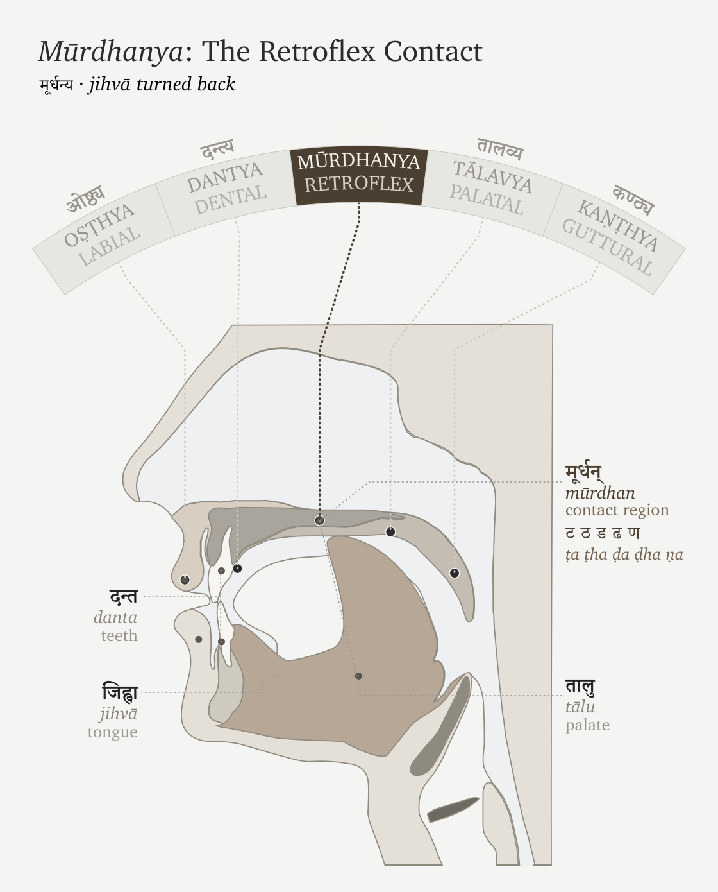

# Chapter 16 — The Subcontinental Mouth and Mind

::: epigraph

> ऋटुरषाणां मूर्धा ।
>
> *ṛṭuraṣāṇāṃ mūrdhā.*
>
> `\hfill`{=latex}*— Pāṇinīya Śikṣā discipline*[NOTE: rturasanam-murdha-shiksha]

:::

\bigskip

Across the Indian subcontinent, language holds a shared signature of mouth and mind. In the mouth, the anatomy holds two habits: the tongue curls backward, and the voice repeats and doubles its words. In the mind, the grammar holds three postures: it receives rather than commands, allows the sovereign doer to slip from the center of the clause, and folds a chain of actions into a single continuous thread.

These five signatures form the subcontinental baseline: the curled tongue, the doubled sound, the receiver grammar, the de-centered doer, and the folded action. With this ground established, the pyramid's portability thesis is forced to walk its own claimed route. The theory must trace the northwest corridors, track the mobile pastoralists, pass through Old Iranian, and scan the broader Indo-European field. If the pyramid insists Sanskrit was imported along that path, the path itself must explain exactly where the language acquired the mouth it sounds with and the mind it encodes.

The first evidence is in the mouth.

The opening word of the *Ṛgveda* is *agnimīḷe* (अग्निमीळे). The Veda's first sentence already holds the subcontinental mouth: the tongue curls, the sound is made, and the verse becomes audible through the anatomy this chapter studies.[NOTE: agnimile-rigveda-opening]

The name *Ṛgveda* itself holds a second signal. Its first sound, ऋ (*ṛ*), is placed at the मूर्धन्य (*mūrdhanya*) site. The text's name and its first sentence both enter through the curled tongue.

## PART A — The Field Before the Argument

## 16.1 The Mouth: *Mūrdhanya*

To articulate the core retroflex consonants of Sanskrit's engineered sound-system — ट (*ṭa*), ड (*ḍa*), and ण (*ṇa*) — the speaker has to isolate and contract the superior longitudinal muscle, curl the apex of the tongue backward, and strike it cleanly against the hard palate at roughly the midpoint of the vocal tract.

The tongue curls back on itself — a flex. That flex is the retroflex.

Across the subcontinent, the flex is everywhere. Tamil, Kannada, Malayalam, and Telugu operate it. Mundari, Ho, and Korku operate it. Marathi, Gujarati, Konkani, Sindhi, Bengali, Odia, Assamese, Hindi, Punjabi, and the related northern languages operate it. The feature crosses the family labels used in modern classification; the mouth-field is older and wider than the taxonomy.

The figure below marks the anatomy: the curled tongue, the *mūrdhanya* site, and the physical act behind the sound.

{#fig:ch16-murdhanya-flex width=100%}

The *Pāṇinīya Śikṣā* epigraph points to the location in the mouth: मूर्धा (*mūrdhā*) — the head / roof of the mouth — is the articulatory site for ऋ (*ṛ*), the टु (*ṭu*) class, र (*ra*), and ष (*ṣa*).[NOTE: rturasanam-murdha-shiksha] Its own sound-body performs the rule. In ऋटुरषाणां (*ṛṭuraṣāṇāṃ*), the first vowel is ऋ (*ṛ*); the consonantal spine is ट-र-ष-ण (*ṭ-r-ṣ-ṇ*) — retroflex, semi-retroflex, retroflex, retroflex. The mouth must enter the site to state the site.

ऋ (*ṛ*) stands at the *mūrdhanya* site and reaches down to the minimum layer of the architecture. The धातुपाठ (*Dhātupāṭha*) preserves ⟪ऋ⟫ (*ṛ*) as a semantic atom of one मात्रा (*mātrā*) — the bare vowel-core, the smallest possible धातुः (*dhātuḥ*). The Vedic corpus takes its name from the same sound: ऋच् (*ṛc*), the verse of praise; ऋग्वेद (*Ṛgveda*), the Veda of the *ṛcaḥ*. The cosmological vocabulary holds it too: ऋत (*ṛta*), the order by which reality holds. One sonomer appears as mouth-position, semantic atom, textual name, and civilizational category.

The *ṛ* (ऋ) / *ra* (र) bridge deepens that placement. Sanskrit gives the *r*-principle nuclear form in the स्वर (*svara*) table and bonding form in the व्यञ्जन (*vyañjana*) table. Under **यण्-सन्धि (*yaṇ-sandhi*)**, vocalic *ṛ* resolves into *ra* before a following vowel. The same articulatory principle crosses the vowel/consonant boundary, taking nuclear form in one table and bonding form in the other.

The *Dhātupāṭha* turns that placement into measurable architecture. Of the fourteen vowels of the वर्णमाला (*varṇamālā*), *ṛ* holds 15.3% of CVC deployment across the *Dhātupāṭha* — second only to *a* (अ). *Ra* covers all four position-roles at meaningful magnitude, and the *mūrdhanya* class as a whole shows the dual profile the reference appendix measures in detail: closure at atom-boundaries and joining inside clusters. Chapter 10 §10.14 and Appendix Part 6 hold the full statistical audit; here the point is placement. The retroflex is structural.

Korku keeps the central forest belt visible inside the same mouth-field. It holds native retroflex contrasts such as *gaTa* "mire" / *gaTha* "broken grain" (Devanagari aid: गट / गठ), words such as *Donga* "boat" and *DanDa* "stick" (Devanagari aid: डोङ्ग, डण्ड), and laterals in *kaLLa* "become stiff," *naLLa* "bamboo tube," and *seLLa* "meet" (Devanagari aid: कळ्ळ, नळ्ळ, सेळ्ळ).[NOTE: korku-nagaraja-mouth-mind-evidence]

## 16.2 The Mouth Doubles: Reduplication

Across the subcontinent, repetition of sounds or words holds meaning. Tamil can intensify sensation through forms such as பளபள (*paḷa-paḷa*; Devanagari aid: पळ-पळ) and can make echo pairings such as புலி-கிலி (*puli-kili*; Devanagari aid: पुलि-किलि). Telugu uses echo and expressive forms such as పుస్తకం-గిస్తకం (*pustakam-gistakam*; Devanagari aid: पुस्तकम्-गिस्तकम्) and గమగమ (*gama-gama*; Devanagari aid: गम-गम). Mundari belongs in the same central forest-belt pattern: its mimetic reduplication runs across sound, movement, texture, taste, temperature, feeling, and sensation.[NOTE: phillips-harrison-mundari-mimetic-reduplication] Korku gives exact forms in another geography — repeated forms such as *DoDo-DoDo* "seeing-seeing" (Devanagari aid: डोडो-डोडो) and partial forms such as *bo-boco* "to fall" (Devanagari aid: बो-बोचो).[NOTE: korku-nagaraja-mouth-mind-evidence] The examples differ by language, but the bodily habit is shared. A sound can be repeated to thicken perception, extend action, distribute reference, or make movement audible.

Sanskrit holds this distinctive field-habit and gives it architectural place.

The Ṛgveda preserves word-level repetition directly: *dive-dive* — day by day; *gṛhe-gṛhe* — house after house, in every house; *vane-vane* — forest after forest, in every forest. Korku gives the same living habit in forms such as *DoDo-DoDo* — seeing-seeing. Mundari belongs to the same central forest-belt pattern through mimetic reduplication, though the exact live example should stay pending until verified. Sanskrit uses this word-level repetition for compact distributive force; Pāṇini later documents it as **आम्रेडित (*āmreḍita*)**.

Repetition can look wasteful from the outside, but it often compresses information. English needs an added descriptor — “in forests everywhere” — to do what *vane-vane* does by repeating the unit itself. The repeated word holds plurality, distribution, continuity, and emphasis without importing another explanatory word. That sūtra-like compression makes reduplication a natural candidate for Sanskrit’s architecture.

Sanskrit then goes further. Its architecture takes the power of repetition, abstracts it, disciplines it, compresses it at a sonomeric level, and distributes it across लकार (*lakāras*), गण (*gaṇas*), and derived verb forms.

For example, at the consonant and syllable scale, the Veda takes the *d* consonant from the atom ⟪दृश्⟫ (*dṛś*) — to see — adds the *a* svara, and places it in front, as in *da-darśa* in Ṛgveda 1.164.4: *ko dadarśa prathamaṃ jāyamānam* — “who saw the first-born as he was being born?” Another example: the atom ⟪दा⟫ (*dā*) — to give — becomes *da-dāti* in Ṛgveda 10.107.7: *dakṣiṇāśvaṃ dakṣiṇā gāṃ dadāti*. The *holding* atom ⟪भृ⟫ (*bhṛ*) becomes *bi-bharti* in Ṛgveda 7.87.4. The repeated piece changes with the atom and functions as a small grammatical switch.[NOTE: vedic-reduplication-abhyasa-examples] Pāṇini later documented and named this operation **अभ्यास (*abhyāsa*)**. The perfect, **लिट् (*liṭ*)**, can hold it, as in *dadarśa*. The reduplicating class, **जुहोत्यादि गणः (*juhotyādi-gaṇaḥ*)**, can hold it, as in *dadāti*. The desiderative, **सन् (*san*)**, can hold it, as in *jighāṃsati*. The **चङ् लुङ् (*caṅ luṅ*)** aorist gives the same switch another home.

Sanskrit holds the subcontinent's core concept — repetition as meaning — and distributes it across the language, from word to syllable. What the subcontinental field does as a habit, the architecture does as a system.

## 16.3 The Mind Receives: *Sampradāna*

Hindu thought treats the ego — अहंकार (*ahaṃkāra*), the "I-making" faculty — as something to be understood and held in check, never the master of the self.[NOTE: ahamkara-ego-management] A civilization that insists on understanding the ego builds a language to manage it: a grammar that refuses to seat the "I" at the center of every act. The self becomes a receiver — the place a state arrives — not the sovereign that seizes it. This is the grammar of *experience*.

The subcontinent holds the same discipline as a habit of everyday speech. English keeps the "I" in command — I am hungry. The subcontinent moves the other way. Tamil says எனக்கு பசி (*eṉakku pasi*; Devanagari aid: एनक्कु पसि): to me, hunger. Telugu says నాకు ఆకలిగా ఉంది (*nāku ākaḷigā undi*; Devanagari aid: नाकु आकलिगा उन्दि): to me, hunger is. Mundari uses *reṅgej-iñ-a* (Devanagari aid: रेङ्गेज्-इञ्-अ), literally "hunger-me-is." In these forms the person is the locus where the state arrives, not the ego that commands it.

Korku marks the experiencer with forms such as *-en* / *-n*: *in-en kenDe-khija Do-ken* (Devanagari aid: इन-एन केन्डे-खिजा डो-केन) means "to me something appeared blackish."[NOTE: korku-nagaraja-mouth-mind-evidence]

Sanskrit holds the same receiver-stance and runs it through the deepest states. Trust is placed *to him* (*śrad asmai dhatta*). Peace is asked *for biped and quadruped* (*śaṃ ... dvipade catuṣpade*). Safety comes *to us* (*svasti naḥ*). Grace is asked of Indra *for me* (*indra mṛḷa mahyam*). Reverence bends toward its object, never asserting the self — *namas* turns to the receiver. In every case the state moves toward the human; the human does not seize it.[NOTE: vedic-receiver-sampradana-examples]

Then Sanskrit builds the discipline into the grammar itself. The receiver becomes a defined role — **सम्प्रदान (*sampradāna*)**, one of the six **कारकाः (*kārakāḥ*)** — preserved by its own case, the dative (*caturthī vibhakti* चतुर्थी विभक्ति), with a family of rules holding reverence, safety, trust, and grace to that receiver. Pāṇini later documented the role; he decoded a structure, he did not invent a way to think. What the subcontinental field manages by habit, Sanskrit manages by architecture.

RV 10.71.4 gives the section its keystone. Vāk is the agent. She reveals herself *tvasmai*, to him, like a well-adorned wife to her husband. Even knowledge is not seized by the ego; it discloses itself to the prepared receiver.

The receiver-self is not one language's idiom. Korku, Mundari, Tamil, Telugu, and Sanskrit all seat the self as a receiver rather than a sovereign. This is what the subcontinent learned and kept: to understand the ego, and to hold a language built to manage it.

## 16.4 The Mind De-centers: *Karmaṇi* and *Bhāve*

The doer can leave the center of a sentence. The agent — the **कर्तृ (*kartṛ*)** — recedes, and the clause settles on the thing acted on, or on the action itself. The English label "passive voice" misses the operation: this is not turning a sentence around, it is demoting the doer — making it oblique, optional, or gone.

The Indian subcontinental mind reduces the sovereign doer by several routes. Tamil demotes the agent through படு (*paṭu*) constructions — "the letter was written," leaving the doer optional. Korku separates an intransitive, agentless form from a transitive, agentive one, and its *-khe* marks not only transitivity and past sense but intention and purpose: the grammar itself distinguishes an event that merely happens from an act a doer drives. Ho explicitly groups intransitive and passive forms, and can mark action-stressing rather than object-stressing use. Mundari weakens the independent doer differently: pronominal subject marking belongs inside the predicate-field rather than letting a noun-subject stand as the sole sovereign anchor. The mechanisms differ; the direction is shared — the doer need not be the fixed center of the clause.[NOTE: karmani-bhave-karta-demotion]

Sanskrit gives that shared direction an architecture: the three **प्रयोग (*prayoga*)**. In **कर्तरि (*kartari*)**, the doer is central. In **कर्मणि प्रयोग (*karmaṇi prayoga*)** the **कर्मन् (*karman*)**, the thing acted on, becomes the center: *Rāmeṇa pustakaṃ paṭhyate* — "by Rāma, the book is read." The *karman* (*pustakam*) takes the प्रथमा (*prathamā*, nominative); the *kartṛ* (*Rāmeṇa*) drops to the तृतीया (*tṛtīyā*, instrumental); the verb agrees with the thing done, not the doer. In **भावे प्रयोग (*bhāve prayoga*)** the de-centering goes all the way: the action stands forward with no *karman* at all, the agent in the instrumental and the verb in the third person singular — *tena supyate*, "by him, there is sleeping."

English can demote the doer too — "the book was read," the agent trailing in an optional "by Rāma" — but it stays subject-hungry: it empties the doer's seat only by sliding the patient into it. Someone must still sit there. *Bhāve* needs no one in the seat; the action stands alone. Not a doer replaced, but a doer no longer required.

Placed beside *sampradāna*, the concept becomes clearer: one makes the person the receiver of experience; *karmaṇi* and *bhāve* make the doer incidental. The subcontinental mind does not only ask "who did it?" It can ask what was affected, what occurred, how the action entered the field — and it built a grammar that need not seat the ego at the center of the sentence.

## 16.5 The Mind Sequences: The Folded Action

Human action often arrives as sequence: eating, rising, going; seeing, deciding, speaking. A person can rise, wash, and step out the door — one continuous motion preserved by one doer, not a list of separate events. The subcontinent's languages fold that flow into grammar: the act just finished is pressed into a specific form and tucked beneath the act that follows, so a chain of doing stays a single sentence with one thread running through it.

Tamil says சாப்பிட்டு வந்தான் (*sāppiṭṭu vandān*; Devanagari aid: साप्पिट्टु वन्दान्): having eaten, he came — one verb folded under the next. Telugu chains a whole errand into a single breath: వెళ్లి (*veḷḷi*; Devanagari aid: वेळ्ळि), కొని (*koni*; Devanagari aid: कोनि), వచ్చాను (*vaccānu*; Devanagari aid: वच्चानु) — having gone, having bought, I came. Mundari folds the same way through its serial and converb structures. Across the field the prior act never stands alone; it bends into the act it leads to.

Korku keeps the richest record: the converb *-Done* "while / by" and *-Ten* "after" — *pa:rku saRup-Done hen* (Devanagari aid: पार्कु सड़ुप-डोने हेन), "all came running"; *inkiñj ja:m-Done … ura-n ol-en*, "the two went home weeping." Korku even braids the two faculties into one word — *inkiñj higra-higra-Done … ol-en*, "the two went … in fear" — a doubled sound (the mouth) riding a folded converb (the mind), the field's two signatures in a single form.[NOTE: korku-nagaraja-mouth-mind-evidence]

Sanskrit's architecture folds action the same way. Ṛgveda 1.4.8 has *pītvā* — "having drunk." Atharvaveda 4.10.2 sets *hatvā* — "having slain" — inside *śaṅkhena hatvā rakṣāṃsy attriṇo vi ṣahāmahe*, "with the conch, having slain the rakṣas, we overcome the devourers": the conch of the Overture sounding within the grammar. A whole prior clause enters the line as one indeclinable, and the verse moves on without breaking the action into separate steps.[NOTE: vedic-folded-action-ktva-lyap-examples]

Sanskrit then builds the fold into rule. On a bare dhātuḥ — an atom holding no preverb — the form is **क्त्वा (*ktvā*)**: *kṛtvā*, "having done." Add an **उपसर्ग (*upasarga*, preverb)** and it shifts to **ल्यप् (*lyap*)**: *upagamya*, "having approached"; *praṇamya*, "having bowed." The preverb decides the shape — Pāṇini observed and documented the conditioning. His rule names the relation directly: **समानकर्तृकयोः पूर्वकाले (*samānakartṛkayoḥ pūrvakāle*)** — the affix marks the **पूर्वकाल (*pūrvakāla*)**, the prior act, of two actions that share one agent. One indeclinable folds an entire clause into itself: the same **अल्पाक्षरम् (*alpākṣaram*, minimal-syllable)** economy the architecture runs at every scale (Chapter 10).

One doer usually threads the whole chain — eat, then come, the same person throughout. And Pāṇini is exact about which thread: **समानकर्तृक (*samānakartṛka*)**, the same **agent (कर्तृ, *kartṛ*)** — not the same grammatical subject. A passive that keeps the agent — *tena bhuktvā gamyate*, "by him, having eaten, it is gone" — satisfies the rule rather than breaking it; the "same-subject gate" is the looser Western approximation.[NOTE: gerund-coreference-default-not-gate] The thread is the agent, held through, and the field's converbs run the same way. Incorporation, not a mechanical same-subject law.

A complete act becomes one frozen form, leaning into the act that follows, and the sentence flows the way the doing flowed. This is a mind that takes action as a single connected motion — and a grammar built to speak it that way.

## 16.6 One Field, Encoded

The cluster has five visible faces.

The tongue curls in *agnimīḷe*. Repetition becomes grammatical in *dadarśa*, *dadāti*, and *bibharti*. The self receives in *mahyam* and *tvasmai*. The doer recedes in *karmaṇi* and *bhāve*. The act folds into the next act in *pītvā* and *hatvā*. Five faces — in sound, in morphology, in syntax — open into one field.

Later grammar documents what the Veda already holds. The mouth becomes the *varṇamālā*. The mind enters the *kāraka* matrix. Repetition receives the name *abhyāsa*. The receiver becomes *sampradāna*. The doer steps back in *karmaṇi* and *bhāve prayoga*. Prior action receives compact forms such as *ktvā* and *lyap*.

Sanskrit is built from the subcontinental field: the mouth gives the sound, the mind gives the relations, and the Veda preserves both in calibrated form.

## PART B — The Portability Thesis Collapses

## 16.7 The Notices

Read the notices the pyramid has issued over two centuries.

The pyramid's first notice was simple. The year is **1600 BCE**, **748 years after the Flood**. Noah's descendants have prospered; Babel has scattered language into manageable peoples. Somewhere along that ordained road a people turns toward India, holding speech, ritual, gods, and order. India receives. **Sanskrit arrives.** The Veda becomes old, but not too old. Sacred, but not source. Impressive, but downstream.

*Correction: the management regrets the Biblical packaging. Please delete Noah, Babel, the divine scattering, and the confidence with which the whole world was fitted inside Genesis.* The date may now be expressed with scholarly flexibility — 1500, 1600, perhaps 1200 BCE for some layers. **The northwest remains. The moving people remain. The pastoral carrier remains. Sanskrit remains something brought into India.**

The revised notice introduced the Aryan — an improved secular instrument: measurable, classifiable, portable, conveniently northwestern. His skull could be measured, his nose straightened into evidence; his face became an argument before his language was examined. Sanskrit rode with him. *Correction: the management regrets the racial packaging. Please delete the skull, the nose, the face, and the word race.* The date becomes an academic horizon (c. 1500 BCE; 1700–1200 BCE; "late second millennium"). **The northwest remains… Sanskrit remains something brought into India.**

The next notice preferred migration. Movement replaced conquest. Language spread replaced domination. Cultural transmission replaced rule. *Correction: the management regrets the invasion tone. Replace with elite dominance, language shift, cultural transmission, mobility* — phrases that sound softer while doing the same work. The date may now breathe (2000–1500; 1700–1300). Always adjustable. Never released. **The northwest remains. The pastoral carrier remains. The horse remains close enough to the argument. Sanskrit remains something brought into India.**

Forced to be careful, the latest notice shifts the story to steppe ancestry, mobile pastoralists, Indo-Iranian corridors, contact zones, and substrate effects. Consequently, the date becomes a window, the claim becomes a model, and the dogma becomes a consensus. Yet the window still securely opens from outside India and the pastoralists continue moving inward, ensuring that Sanskrit inevitably arrives with a custody tag already tied around its neck.

While the pyramid keeps changing the story, it never loosens the custody tag. By dropping the last embarrassment—Noah, the skull, the invasion—each subsequent correction guards the single claim it will not surrender: that Sanskrit came from outside. Ultimately, two centuries of continuously walking the narrative back have made the retreat itself the defining feature of the argument.

A much simpler explanation needs none of it. 

Sanskrit was built in the Indian subcontinent, not brought into it. The mouth is the field's mouth; the mind is the field's mind. The Veda preserves both from its very first word.

## 16.8 The Borrowing Model Cannot Hold

If the pyramid says Sanskrit arrived through the northwest, the claimed route becomes the test — Indo-Iranian corridors, Avestan / Old Iranian, and the wider non-Indic Indo-European field. That carrier field must show the same cluster Sanskrit holds structurally: the curled tongue, the doubled mouth, the receiver grammar, the demoted doer, and the folded action.

The subcontinent supplies the cluster densely rather than through one witness alone. Tamil and Telugu show the southern field; Mundari, Ho, and Korku keep the central forest belt in view. The pyramid itself separates these languages into unrelated families, so the shared cluster cannot be dismissed as simple inheritance inside one family tree. Sanskrit holds the whole cluster structurally, from the curl of *agnimīḷe* to the fold of *pītvā*.

The borrowing story performs the same maneuver each time. First it removes Sanskrit from the field. Then it returns the field's features as later acquisitions: retroflexion as substrate borrowing, the gerund or absolutive as areal feature, receiver grammar as local contact, doer-demotion as passive-like areal habit.[NOTE: borrowing-model-substrate-areal-claims] Each feature is allowed to be Indian only after Sanskrit has been made non-Indian in origin.

The receiver grammar detailed in §16.3—where the self functions as the *sampradāna* (the locus where an experience arrives) rather than an active doer—provides the sharpest test against this maneuver. By demonstrating that while Tamil, Telugu, Korku, and Mundari let hunger, knowing, perception, and inward states arrive to a person, the Veda performs exactly the same work through forms such as *asmai*, *naḥ*, *mahyam*, and *tvasmai*, the structure itself demands an answer. The imagined carrier route must therefore explain how an external language arrived already able to encode that specific mind, or how the massive Vedic corpus was later systematically reworked to hold it.

The custody trick stands exposed. The pyramid grants the subcontinent its fragments while denying the field its architecture.

Now set the two fields side by side. The claimed source — Avestan and Old Iranian — does not run the cluster: the retroflex series is absent, and the syntax must be weighed with care before more is claimed.[NOTE: avestan-retroflex-absence] What the carrier was supposed to bring lives densely in the subcontinent instead. Sanskrit holds structurally what the field holds densely.

## 16.9 The Corpus Cannot Be Rewritten

The corpus presses from another side. Contact can move habits through a speech community; the burden changes when the portability story has to alter a preserved corpus whose purpose is exact recurrence. If Sanskrit arrived without the field's features and acquired them by contact, then the Vedic corpus has to be silently reworked after each contact event: retroflex, reduplication, receiver grammar, absolutive.

Acquiring these features would demand a continuous return to the workshop, requiring the hymns to receive the curled tongue, the mantras to receive the doubled syllable, the receiver to enter the case-system, and the folded action to enter the sentence. The pyramid's hypothesis therefore asks an engineered preservation culture to behave like an absent-minded editing office.

Inside the pyramid's own clock, the problem sharpens. The text it treats as its first major witness already opens with *agnimīḷe*: the curled tongue at the threshold, the Vedic corpus entering through the mouth-field. By this point the receiver matrix and folded-action pattern are standing inside the corpus as well. The witness the pyramid needs as clean evidence of external arrival is already saturated with the subcontinental mouth and mind.

The preservation architecture works toward exact recurrence. The *Vedas* are **अपौरुषेय (*apauruṣeya*)** — without human author, not composed in time.[NOTE: apauruseya-mimamsa-sutra-1-1-5] They are **श्रुति (*śruti*)** — heard. The eleven **पाठाः (*pāṭhāḥ*)**, the **प्रातिशाख्य (*Prātiśākhya*)** discipline, and the **गुरुशिष्यपरम्परा (*guru-shishya paramparā*)** — the teacher-student lineage-chain — keep recurrence exact.

The same principle applies inside the corpus. Different Vedas and different textual forms have different styles because they serve different functions. Hymn, chant, liturgical formula, prose explanation, branch arrangement, and recensional discipline need distinct modes of operation. Style is not clock. Function is not chronology.

The छन्दस् (*chandas*) / भाषा (*bhāṣā*) distinction belongs here. The *progressive dogma* presents ळ as "lost between Vedic Sanskrit and Classical Sanskrit," but that move imports chronology into a mode distinction. Pāṇini's **अष्टाध्यायी (*Aṣṭādhyāyī*)** distinguishes the *chandas* mode (*chandasi*, "in meter") from the *bhāṣā* mode (*bhāṣāyām*, "in speech"). The *chandas* mode preserves ळ. The *bhāṣā* mode bounds it out of its productive inventory. Pāṇini documented a mode-distinction: preservation in one mode, bounded productivity in another.[NOTE: chandasi-bhasayam-astadhyayi]

The branch evidence sharpens the category further. A शाखा (*śākhā*) is a specified transmission line with its own branch-shape. The **माध्यन्दिन (*Mādhyandina*)** and **काण्व (*Kāṇva*)** recensions of the **शतपथब्राह्मण (*Śatapatha Brāhmaṇa*)** preserve related material through different branch-shapes, divisions, and arrangements. The correct axis is mode and branch rather than a single temporal slope from "Vedic" to "Classical."[NOTE: madhyandina-kanva-branch-shapes]

## 16.10 Engineering, Not Contact

Contact can move forms; engineering assigns place, role, and scale.

Retroflexion anchors by place: *agnimīḷe* makes the mouth curl at the Veda's threshold, and ⟪ऋ⟫ (*ṛ*) links the *mūrdhanya* site to the *Dhātupāṭha* and the name *Ṛgveda*. Reduplication operates by concision: *dadarśa*, *dadāti*, and *bibharti* make a field habit of doubling into a disciplined syllabic switch. The concept of the receiver—the one to whom an action is directed—surfaces through forms such as *asmai*, *mahyam*, and *tvasmai*. The doer steps back through *karmaṇi* and *bhāve*. Action chaining is executed through forms such as *pītvā* and *hatvā*. Pāṇini later documents the operations as *abhyāsa*, *sampradāna*, *karmaṇi*, *bhāve*, *ktvā*, and *lyap*.

The same pattern repeats across the cluster. A borrowed feature can sit at the surface, accrete in marginal positions, or remain a local habit. Sanskrit takes these field-patterns into the grammar that holds the system. The curled mouth becomes a sound-grid. Repetition becomes *dadarśa* and *dadāti*. Experience moves through *mahyam* and *tvasmai*. The doer steps aside in *paṭhyate*. Sequence becomes *pītvā* and *hatvā*.

Sanskrit is built from the subcontinental field, and then preserves that field in calibrated form.

## 16.11 What the Grammar Keeps

Through *īḷe* curling the tongue to the dome and *dadarśa* turning repetition into a disciplined syllabic switch, the subcontinental field is explicitly made audible. As *mahyam* and *tvasmai* let grace and revelation arrive at a receiver, *paṭhyate* lets the deed stand while the doer steps back, and *pītvā* lets one action pass into the next, the entire architecture structurally aligns: the tongue curls, the sound doubles, the self receives, the doer recedes, and the act folds.

Śruti holds the same refusal to crown the ego. Knowledge discloses itself rather than yielding to a seizer — Vāk reveals her body to the prepared (*tanvaṃ vi sasre*, RV 10.71.4), and the Self reveals its own form to the one it chooses, never won by discourse or intellect or much hearing (*vivṛṇute tanūṃ svām*, Kaṭha Upaniṣad 1.2.23 / Muṇḍaka 3.2.3). The apparatus that would seize is itself demoted: in the Kaṭha chariot (1.3.3–4) the body is the chariot, the senses the horses, the mind the reins, the intellect the charioteer — instruments all, while the Self rides as lord, not as any one of them.[NOTE: nimitta-chariot]

What the Veda enacts and the Upaniṣad pictures, the case-system holds: the receiver as *sampradāna*, the doer demoted in *karmaṇi* and *bhāve* — the structure Pāṇini decoded, not built. The Gītā states it outright: **निमित्तमात्रं भव सव्यसाचिन्** (*nimittamātraṃ bhava savyasācin*, 11.33) — "be a mere instrument." The grammar that will not seat the ego at the center of the sentence is the same civilization that will not seat the ego at the center of the self: the *ahaṃkāra* held in its place, agency distributed across the *kāraka* field rather than gathered to a single apex.

That is संस्कृति (*saṃskṛti*) inside grammar: calibrated preservation that leaves ordinary life room to move. The same civilization can keep the Veda exact, allow *prākṛtika* life to speak, flow, grow, and change, and still hold a grammar that remembers how balance is kept when darkness presses on the field.

The next chapter can now ask the formation question more honestly. If the mouth is local, the mind is local, the cluster is dense, and the Veda already encodes the architecture, then the older speculation becomes available: Sanskrit was built by those who knew what had to be preserved, and the Veda became the preservation matrix through which that architecture could endure.
