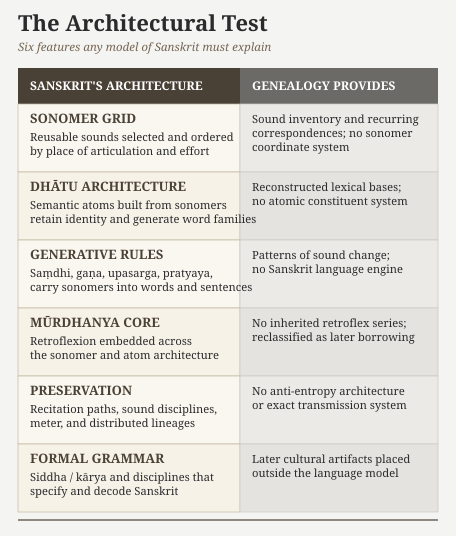
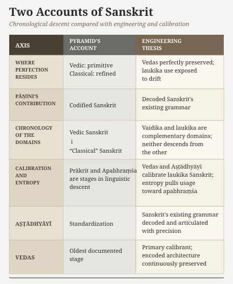

# Chapter 18 — The Wrong Question

::: epigraph

> यो मायातुं यातुधानेत्याह यो वा रक्षाः शुचिरस्मीत्याह ।
>
> *yo māyātuṃ yātudhānety āha yo vā rakṣāḥ śucir asmīty āha*
>
> *Who calls me a yātudhāna though I am no yātu,*
>
> *or who, being a rakṣas, declares, “I am pure.”*
>
> `\hfill`{=latex}*— Ṛgveda 7.104.16*[NOTE: mayin-concealment-cluster]

:::

\bigskip

*What came before Sanskrit?*

The entire Proto-Indo-European framework is built to answer this single question. But the theory collapses because the question itself is fundamentally flawed. It assumes Sanskrit is an evolutionary accident, rather than an engineered architecture.

The preceding chapters have established an engineered sonomer coordinate system, the *dhātavaḥ*, generative rules, a retroflex core, a calibration matrix, a living recitation system, and the analytical disciplines that preserved and decoded the whole. Together, these features describe an engineered linguistic architecture rather than a natural speech-form drifting from an earlier natural speech-form.

Part VI turns to the account that has continued to treat this object as something else. The next two chapters divide that work. Ch18 establishes the structural argument: the genealogical project fundamentally misrepresents the physical construction of Sanskrit, and any precursor model framed inside that project will fail the same structural test for the same structural reason. Chapter 19 tests the specific construct — PIE — directly. Together the two chapters close the loop opened in Chapter 1: the botanical metaphor fails on a language engineered against the behavior the metaphor describes; Ch18 develops the structural reason no genealogical reconstruction can recover what the metaphor has prevented from being seen.

A genealogical approach searches for organic ancestry; an architectural approach analyzes deliberate construction. The Hindu continuum explicitly treats Sanskrit as an engineered architecture. In Bṛhaspati’s mantra (RV 10.71.2), the text records exactly how the language was built: the wise ***मनसा वाचमक्रत (*manasā vācam akrata*)** — they engineered Speech with the mind, refining and sifting it exactly as grain is sifted through a sieve.

Stand before the Kailasa temple at Ellora and ask who designed it. No one knows with modern biographical precision. Does the temple therefore evolve from the basalt? The geology is real. It is not the explanation. The question asked for the structure carved from the stone, the specifications, the method, the trained hands, the inherited discipline.

Sanskrit is that kind of object. Asking only what came before it is asking the geological pedigree of the stone while refusing to account for the temple.

Proto-Indo-European theory starts with the wrong question.

## 18.1 The Architectural Test

Any valid model of Sanskrit must explain six structural features.

First: the ***varṇamālā*** as an engineered sonomer coordinate system (Chapter 7). A list of sounds is not enough. The model must explain which sounds Sanskrit promotes to reusable sonomers, which sounds it excludes, and how it arranges the selected sonomers within an ordered map of the mouth.

Second: the ***dhātu*** architecture (Chapters 2 and 10). Sanskrit does not merely have a loose inventory of verbal bases. It builds semantic atoms from those sonomers. Each atom preserves its identity through bonding and generates vocabulary through rule-defined combination.

Third: the rules that carry sonomers into meaningful words and sentences (Chapters 11 and 12): *saṃdhi*, *gaṇa* organization, affixation, metrical constraint, and the generative architecture the *Aṣṭādhyāyī* articulates.

Fourth: the ***mūrdhanya*** core (Chapter 17). The retroflex row is not peripheral. It sits inside the architecture: vowel-core, bonder, closure class, acoustic signature.

Fifth: the preservation architecture (Chapters 13, 14, and 15): *padapāṭha*, *kramapāṭha*, *jaṭāpāṭha*, *ghanapāṭha*, *Prātiśākhya*, *Śikṣā*, *chandas*, and the living *guru-shishya* lineage-chain.

Sixth: the formal grammatical order (Chapter 5): *siddha* / *kārya*, *vyākaraṇam*, *Nirukta*, *Prātiśākhya*, *Trimuni Vyākaraṇam*, and the analytical mode that treats Sanskrit as specified rather than merely described.

{#fig:ch18-architectural-test width=100%}

Any model of Sanskrit has to explain all six. A model that explains none of these features explains some other language; it does not explain Sanskrit.

## 18.2 What Genealogy Cannot Provide

Historical linguists call this procedure the **comparative method**. They compare recorded languages, identify recurring sound correspondences, group languages by features they consider inherited, and use those patterns to reconstruct hypothetical earlier forms. The method can explain how Latin developed into the Romance languages, how Germanic sounds changed, and how Iranian and Sanskrit forms correspond.

It cannot recover engineering specifications from a surface inventory. That is not its job. It was not built for that object.

The method assumes ordinary linguistic friction: drift, sound change, analogy, semantic shift, simplification, innovation, and inheritance. It therefore reconstructs an ordinary natural language. It cannot produce an engineered sonomer coordinate system because that category does not exist inside its procedure. It cannot produce a calibration matrix because preservation architecture is not a feature it looks for. It cannot explain why a language would be built to resist the drift the method assumes.

Engineering presupposes engineers. Specifications presuppose specifiers. Preservation architecture presupposes designers of the infrastructure. None of these presuppositions is available inside the comparative method, because the method explicitly excludes them as not part of how natural languages work.

This is the category theft. The genealogical project looks at Sanskrit after the engineering is already visible and asks which precursor could have produced the surface. The architectural test examines how the engineering was specified, built, preserved, and decoded. The two inquiries belong to different categories.

No improved dataset fixes this. No larger cognate set fixes this. No more refined reconstruction fixes this. A better genealogy still does not become an architecture.

## 18.3 The Test Applied

We can now compare each of the six requirements with what the genealogical project actually reconstructs.

The ***varṇamālā***: PIE reconstruction can propose a sound inventory and identify recurring correspondences among languages. It cannot explain which sounds Sanskrit promotes to sonomers, why other pronounceable sounds remain outside the system, or why the selected sonomers occupy precise coordinates based on place of articulation and effort. A reconstructed inventory of sounds does not explain the engineering of the sonomer system.

The ***dhātu*** architecture: PIE reconstruction can propose earlier word-forms. It cannot explain why Sanskrit builds semantic atoms from sonomers, preserves their identity as *upasargāḥ* and *pratyayāḥ* attach, and generates extensive families of words from them.

The generative rules: PIE reconstruction can describe how sounds correspond and change across languages. Sanskrit also requires an explanation for the operations that generate its words and sentences: *saṃdhi*, *gaṇa* organization, *upasargāḥ*, *pratyayāḥ*, and the wider derivational architecture. The comparative method does not reconstruct that language engine.

The retroflex core: PIE does not reconstruct a *mūrdhanya* set. The pyramid therefore claims that Sanskrit borrowed retroflexion after entering the Indian subcontinent.[NOTE: retroflex-substrate-standard-account] Sanskrit does not carry these sounds as a peripheral addition. The *varṇamālā* gives them a complete row, **ऋ (*ṛ*)** belongs to the vowel system, **र (*ra*)** acts as a bonder, and retroflex closure recurs throughout the atom inventory. The borrowing account must explain how a supposedly later acquisition became embedded at all these levels. It does not.

The preservation mechanisms: comparative reconstruction studies changes among recorded languages. Its procedure does not reconstruct the *pāṭha* recitations, *Prātiśākhya* specifications, *Śikṣā* training, or the distributed lineages documented across Chapters 13, 14, and 15. It therefore cannot explain how the Vedas resisted the changes that the method expects every language to undergo.

The formal grammar: PIE reconstruction does not produce an *Aṣṭādhyāyī*, a *Nirukta*, a *Prātiśākhya*, or a *siddha* / *kārya* distinction. The pyramid classifies these disciplines as later cultural artifacts. Yet they preserve the continuum's own analysis of Sanskrit as a specified architecture. Any model of Sanskrit must explain why these disciplines exist and why their analyses converge.

Six requirements. The genealogical project satisfies none of them.

Adding more cognates or refining the sound laws will not close this gap. The genealogical project was built to reconstruct ancestry among natural languages. Sanskrit requires an account of how an engineered language was built, used, preserved, and decoded.

## 18.4 Gaslighting with Footnotes

The progressive dogma presents the genealogical model as established fact before comparing it with Sanskrit's architecture. It then demands evidence from the engineered Sanskrit thesis while excusing genealogy from explaining the six features tested in §18.3.

This preference rests on one assumption: Sanskrit must be the same kind of drifting natural language that the comparative method places elsewhere in a descent tree. The preceding chapters establish a different account. Sanskrit is engineered speech, preserved speech, decoded speech, and rule-defined speech.

The precursor model may propose relationships among recorded words and sounds. It does not explain Sanskrit's sonomer-to-atom architecture, preservation system, retroflex core, or formal grammar. It therefore cannot serve as the default explanation of Sanskrit.

To preserve that status, the pyramid must dismiss Sanskrit's own analytical disciplines. It must claim that *Nirukta*, *Prātiśākhya*, *Śikṣā*, *Chandas*, and *Mīmāṃsā* misunderstood the language they studied. It must also claim that generations of *guru-shishya* lineages preserved and transmitted the same civilizational delusion for thousands of years.

Earlier chapters established why the Vedas serve as a calibrant for Sanskriti: they preserve the contest between सत् (sat) and असत् (asat) in forms that people can recognize whenever the same actions return in another age. Civilizational gaslighting is one present-day expression of that ancient pattern.

The chapter's epigraph presents an epistemic inversion: the framework for recognizing truth is reversed. A person who is not a **यातु (*yātu*)** is accused of being a **यातुधान (*yātudhāna*)**, while an actual **रक्षस् (*rakṣas*)** declares, "I am pure." ***Gaslighting is the psychological weaponization of epistemic inversion.***

The Ṛgveda describes the wider operation through hostile **माया (*māyā*)**. Vṛtra and Namuci are **मायिन् (*māyin*)**, figures who use concealment and deception, while Svarbhānu's *māyā* hides the Sun. These figures conceal what remains present and demand that others accept the concealment as reality.[NOTE: mayin-concealment-cluster]

Gaslighting can redirect memory without erasing it. The pyramid teaches India to remember Pāṇini incorrectly. It turns the decoder into a codifier and turns his documentation into the origin of the language. This redirects the civilization's reverence for one of its finest decoders toward codification itself.

Praise becomes a weapon here. The pyramid does not need to insult Pāṇini. It can praise him for the wrong act. By miscasting him as the codifier who created order, the pyramid trains the civilization to honor centralized authority instead of recognizing calibration. The memory remains reverent, but the pyramid has altered the object of reverence. That is gaslighting at civilizational scale.

When the Hindu continuum recognizes its own architecture and the academic establishment calls that recognition a delusion, that is not scholarship.

**It is civilizational gaslighting with footnotes.**

## 18.5 How the Story Got Built

The origin question still admits two speculations. Both begin from the same epistemic position: nobody knows what came before Sanskrit. One speculation admits this. The other hides it.[NOTE: calibration-hierarchy]

The problem begins when the pyramid gives the two speculations different names. It calls its own conjecture a *theory*. It calls what the Hindu continuum says about its own language a *belief*. Through those labels, the pyramid presents its reconstruction as established knowledge while treating the continuum's understanding of Sanskrit as something that requires the pyramid's approval.

This is how the pyramid launders speculation into certainty. Every human mind speculates when the evidence ends. The asuric move claims perfect knowledge precisely where perfect knowledge is unavailable.[NOTE: speculation-theory-asuric-certainty]

Where observation and measurement can decide between competing explanations, a theory earns its name. No measurement can recover words that no one recorded or establish who first created Sanskrit. At that boundary, honesty requires a clear account of what is known, what has been inferred, and what remains unknown. Humility is the only honest posture.

### The Pyramid's Speculation

The pyramid does not know Sanskrit's origin. It has no inscription of PIE, no speaker of PIE, no community that called its language PIE, no Vedic witness to migration into India, no archaeological layer that says Sanskrit entered here. It has a chain.

1. A reconstruction method was built in nineteenth-century Europe from comparison among Sanskrit, Greek, Latin, Germanic, Iranian, and related languages.
2. The method inferred an imaginary ancestor: ***Proto-Indo-European***.
3. The imaginary ancestor was treated as historically prior to Sanskrit, even though Sanskrit is real, recited, taught, and operating while PIE is not.
4. The ancestor had to sit outside India, because a calibrant engineered within India proves order can stand without an apex — the pyramid's founding threat (Chapter 3 §3.8). He can dominate that civilization, but he cannot claim the world's most precise language if the calibrant stands inside it.
5. A mechanism was then needed by which Sanskrit entered India. That mechanism became the racial Arya thesis: invasion first, migration later, the same racialized premise underneath both.
6. When Sanskrit displayed subcontinental features, especially the retroflex row, the pyramid's account called them substrate borrowings instead of evidence that Sanskrit's engineering operates from inside the subcontinental sound-field.
7. When Vedic preservation showed extraordinary stability, the pyramid's account called it late conservatism rather than engineered anti-entropy.
8. When Pāṇini documented an already functioning architecture, the pyramid's account called it codification: praise the named documenter, redirect the memory, deny the architecture documented.
9. When the Sanskrit continuum preserved its own categories — *saṃskṛtam*, *śruti*, *apauruṣeya*, *vyākaraṇam*, *vaidika*, and *laukika* — the pyramid's account treated them as belief, not evidence.
10. Every link in the chain is required because the first link must be preserved: Sanskrit cannot be the engineered calibrant at the center. It must be one member of the manufactured family of co-descended languages.
11. The chain remained secure because few readers tested its assumptions against Sanskrit's complete architecture. The preceding chapters have now tested every link against the evidence assembled across sonomers, atoms, grammar, recitation, and transmission. The comparison exposes where each link depends upon the one before it rather than upon Sanskrit's architecture.

The pyramid links each speculation to the next: imaginary PIE requires an external homeland and a racial Arya thesis; the incoming language then borrows retroflexes from a substrate, evolves as *"Vedic Sanskrit,"* and finally becomes standardized as *"Classical Sanskrit"* through Pāṇinian codification.

The chain is the recipe. PIE is the bake.

The pyramid's speculation is not neutral reason correcting the Hindu continuum. It is a nineteenth-century European reconstruction promoted into an ancestor, the ancestor into a homeland, the homeland into a migration, the migration into a civilizational story, and the story into the default frame through which Sanskrit is now taught back to Hindus. The Hindu continuum is told that its own categories are faith while the pyramid's imaginary ancestor is science.

The same machinery that calls Hindu civilizational memory "mythology" asks the world to treat its own constructed ancestor as science. Sanskrit, preserved in sound and use, is declared dead. PIE, preserved nowhere, recited nowhere, spoken by no known community, is granted ancestral life.

That is the inversion. The speculation is not absent. It is wearing the robes of the ***priests of progress***, defended by its ***jihadis of progress***, exported by its ***missionaries of progress*** — the ***church of progress*** operating in *asuric* mode (Chapter 4 §§4.3–4.6).

## 18.6 The Migration Trap

The Racial Arya Thesis survives by changing its instruments. The pyramid has crossed out ~~Caucasian~~, ~~Aryan race~~, ~~Nordic race~~, ~~cranial index~~, ~~nasal index~~, ~~conquest~~, and ~~invasion~~. It now says population, steppe ancestry, DNA, mobility, elite dominance, and migration. The vocabulary retreats. One qualification remains: Sanskrit's origin could never be Indian. Every revision still makes Sanskrit arrive from outside India.

AIT was the crude form. AMT is the laundered form. **RAT is the thesis. PIE is the ancestor-device. *"Indo-Aryan"* is the external-origin label.**

That is the migration trap.

The early colonial formulation was explicit in its design: a conquering *ārya* race subjugating an indigenous *dāsa* population, a historical script that conveniently prefigured British rule. The modern iteration discards the discredited racial anthropology and the violent invasion narrative, yet fiercely guards the conclusion it inherited: Sanskrit still arrives in India as the property of an outside people.[NOTE: muller-eic-rigveda]

> The theft was never only historical. It was semantic first. Ārya was taken from discipline, learning, restraint, generosity, and achieved conduct, then remade as race, peoplehood, ancestry, and movement. Once that semantic theft was accepted, the historical theft could follow: Sanskrit became the speech-cargo of the invented people. The modern migration vocabulary softens the surface, but the two thefts remain joined.

The trap asks the wrong question first and then forces every explanation to remain inside it. Did people move into India? Did people move out of India? Which population moved first? Which genetic signature appears where? Which steppe component enters which region? Once the debate accepts those terms, the deeper question has already been displaced. Sanskrit is no longer being examined as an architecture. It is being treated as cargo.

Bodies move. Knowledge moves. Specialists move. Traders move. Students move. Refugees move. None of that proves authorship.

India was never a sealed chamber. People entered India, left India, traded with India, studied in India, fled to India, married into India, and took Indian knowledge outward. Population movement can explain ancestry, contact, admixture, settlement, trade, patronage, war, refuge, or migration. It does not by itself explain the *varṇamālā*, the Vedic archive, the recitation disciplines, the *dhātu* architecture, the grammatical sciences, or the calibration matrix.

### The Migration Story the Pyramid Will Never Admit

Every pyramid extracts food and wealth from the people below. It fortifies territory and builds an administrative hierarchy to keep that extraction flowing. It then turns the accumulated wealth and labor into physical displays of apex power. Fortified cities control the living, while burial monuments extend the ruler's presence after death. These structures overwhelm the pyramid's subjects and intimidate its enemies.

Across Central Asia and the adjoining steppe corridor during roughly 2300–1500 BCE, the Bronze Age interval that the pyramid associates with movement toward India, rulers forced oppressed and enslaved people to carry out these projects. The fortified centers of Bactria–Margiana and Sintashta concentrated labor behind walls throughout that period. The system continued for another fourteen centuries. In Khorezm, laborers dug and maintained irrigation canals. At Afrasiab, they raised walls and citadels; at Kalaly-gyr, they built an enormous royal enclosure. At Arzhan, Pazyryk, and Issyk, they piled earth, stone, and timber into monumental burial mounds for rulers.[NOTE: migration-trap-displacement-routes]

The pyramid used many legal labels for the men beneath it. A slave belonged to a master. A captive belonged to the victor. A conscript belonged to the army, while debt and poverty could bind a nominally free worker almost as tightly. Their position inside the pyramid remained the same. They quarried stone for palaces, extracted ore from mines, rowed warships, cultivated estates, dug canals, and raised walls around cities that they did not control. For many of these men, the only path out was escape.

The pyramid displayed ***भव्यता (*bhavyatā*)***, grandiosity created by concentrating wealth, labor, and power toward the apex. The palace, acropolis, fortress, and monument made the master's power visible. The oppressed laborer who built that grandeur for someone else had every reason to search for a life beyond it.

India offered ***दिव्यता (*divyatā*)***, radiance that a person could approach through action, learning, discipline, devotion, and participation. A newcomer did not need to become the apex or remain trapped beneath one. He could enter a civilization that gave him a place to build a life. For a man imprisoned below another person's *bhavyatā*, India's *divyatā* supplied a powerful reason to escape and travel toward it.

Pyramidal societies also manufactured uprooted men through war. Military defeat scattered soldiers after their commanders and territories had disappeared. Dynastic conflict expelled political rivals, while retreating armies abandoned mercenaries and captives far from home. The steppes and the Greco-Roman world subjected men to these pressures for centuries.[NOTE: migration-trap-displacement-routes]

The pattern repeated itself more than a millennium later, when written histories begin identifying some of the displaced peoples. The Yuezhi moved west after the Xiongnu defeated them during the second century BCE, and their movement displaced Saka groups toward the south. Centuries later, Huna formations emerged from the same violent world, where confederacies repeatedly expanded and fractured. These events belong to later periods than the Bronze Age movement used in the genetic account. They demonstrate that the same corridor continued to produce displaced men long after 1500 BCE.

Each upheaval stripped men of the people and institutions around which they had built their lives. The armies and war-bands that broke apart were overwhelmingly male. Some survivors later became conquerors themselves. Others entered another army or made a living through trade. Marriage and new land allowed them to begin again.[NOTE: migration-trap-displacement-routes]

The Hellenistic and Roman pyramids produced another stream of uprooted men. Their wars moved armies across enormous distances and supplied captives to slave markets. Soldiers deserted, captives escaped, and political exiles fled. Mercenaries also had to find another place when the ruler who paid them fell.

The Seleucid, Bactrian, and Indo-Greek corridors connected that world directly with India. Men fleeing western and Central Asian pyramids did not need to invent India as a destination. The roads already led there.[NOTE: migration-trap-displacement-routes]

India supplied reasons to complete that journey. Its markets and armies could give a newcomer a livelihood. Its courts and teachers offered patronage and learning, while its ascetic traditions allowed a person to leave an earlier identity behind. A man escaping a defeated army or an imperial state could therefore enter India to survive and rebuild his life. The same possibility was available to someone fleeing debt, captivity, or slavery.

A Greek account preserved by Arrian records the contrast in language that would have startled the slave societies of the Mediterranean: *"all Indians are free, and no Indian at all is a slave."* The contrast was unmistakable to a Greek observer comparing India with the social order he knew.[NOTE: migration-trap-india-absorption]

India could receive a newcomer through ***क्रिया (*kriyā*)***. His actions could give him a place in society. He might learn a craft and join its guild, defend the community through military service, or become a teacher after years of study. Marriage and children could bind his family to the place that had received him. His ancestry remained part of his history without becoming a permanent prison.

The Heliodorus pillar makes that absorptive capacity visible in stone. Heliodorus came from Taxila as a Yavana ambassador. The inscription identifies him as a ***भागवत (*bhāgavata*)*** and records his dedication of a Garuḍa pillar to Vāsudeva. His Yavana origin did not prevent him from entering the civilization through commitment and chosen action. Over longer periods, incoming men of military backgrounds could enter Kṣatriya formations.[NOTE: migration-trap-india-absorption]

Movement out of India is equally unsurprising. Indian knowledge served almost every part of life. Physicians and astronomers could take their disciplines to another court. Metallurgists, weavers, shipwrights, and masons could travel wherever patrons needed their skills. Traders carried stories and vocabulary with their goods, while teachers and renunciants moved through monasteries and learning lineages. Buddhist history makes that outward movement visible in a later period.

Sanskrit can leave traces because trained specialists, preserved sound-systems, and disciplined textual lineages entered other language-worlds and changed them. The pyramid sees the resulting similarities and invents an imaginary ancestor. The Radiance Thesis examines whether a preserved calibrant reached changing speech communities at different depths.

Human movement therefore belongs in the account. It explains contact, exchange, intermarriage, refuge, conquest, settlement, and transmission. The authorship of Sanskrit rests on different evidence: the sonomer coordinate system, atoms, molecules, sentences, recitation disciplines, grammar, and calibration architecture.

### The Paternal Signal

The genetic evidence contains one more fact. The pyramid places the relevant movement from Central Asia and the adjoining steppe corridor between roughly 2300 BCE and 1500 BCE. Studies of present-day ancestry in the Indian subcontinent have found a male bias in some of the ancestry associated with those Bronze Age populations. The Y chromosome passes from father to son, while mitochondrial DNA follows the maternal line. Taken together, the paternal, maternal, and genome-wide evidence describes incoming men who fathered children with women already living in the subcontinent.[NOTE: migration-trap-movement-not-authorship]

The conditions surrounding India explain why that signal could be male. War-bands and army detachments consisted largely of men, including the deserters and defeated soldiers who escaped them. Slave markets separated male captives from their families. Imperial campaigns carried them across borders, and political purges gave them reasons to keep moving. When those men entered India and married locally, their sons carried the incoming Y chromosomes while their children grew inside the civilization that had received their fathers.

How many Sakas entered India after being displaced rather than as triumphant conquerors? How many Yavana soldiers deserted campaigns, escaped captivity, or remained after their commanders disappeared? How many men from broken steppe confederacies entered Indian armies, trading communities, guilds, and Kṣatriya lineages? How much of the paternal ancestry now called *foreign* records sanctuary and absorption?

These are research programs waiting to be pursued. Geneticists, historians, and archaeologists can compare paternal lineages with movement corridors, settlements, inscriptions, military service, marriage networks, and the formation of later communities. The pyramid closes those routes by labeling the paternal signal *elite dominance*. Indian universities can reopen them.

Foreign genetic material in India therefore proves movement, contact, or ancestry. It does not prove that Sanskrit was imported. It does not prove that the *varṇamālā* was designed on the steppe. It does not prove that the Vedic recitation systems arrived with a moving population. It does not prove that Pāṇini decoded an external inheritance. The pyramid wants one conclusion from many possible facts: movement means authorship. That conclusion has to be demonstrated. It cannot be smuggled in through DNA vocabulary.[NOTE: migration-trap-movement-not-authorship]

Appendix Part 3 §3.5 exposes the same move in another domain. Even if every resemblance between a Brāhmī glyph and an Aramaic glyph is granted, resemblance cannot encode the sonomeric grid that Brāhmī renders. DNA supplies evidence about bodies rather than scripts, but the same distinction applies. **Shape is not structure. Movement is not authorship.**

Foreign Y-DNA can be the trace of men whom India absorbed. It cannot make Sanskrit foreign, and it cannot turn the absorbed father into the author of the architecture.

## 18.7 An Honest Speculation for the Rationalist Mind

Bṛhaspati’s mantra (RV 10.71.2), describes how Sanskrit was language was built: the wise ***मनसा वाचमक्रत (*manasā vācam akrata*)**  they engineered Speech with the mind, refining and sifting it exactly as grain is sifted through a sieve.[NOTE: rigveda-10-71-2-sieve-vak]

Sanskrit is treated here as the calibrated architecture in which that Vedic *vāc* becomes visible.

Acting as **मन्त्रद्रष्टारः (*mantra-draṣṭāraḥ*)**—seers of the mantras—the *ṛṣis* saw, leaving everyone after them to hear. Consequently, the corpus is recognized as **श्रुति (*śruti*)**—that which is heard—and **अपौरुषेय (*apauruṣeya*)**—not of human authorship.

The honest limit remains: we do not know the historical identities of the wise, when Sanskrit's specification occurred, or how the architecture entered the human world.

The pyramid converts conjecture into chronology and teaches it as settled fact. This book will not do that. It speculates openly and calls the speculation by its name.

The motive is preservation with discrimination. Let what can flow, flow. Let what grows, grow. Let what changes, change. Preserve what is worthy of preservation for eternity: wisdom, measure, mantra, and the stories of how balance is kept even when darkness is everywhere.

1. Sanskrit appears before history already engineered. The record gives the object: an architecture already functioning.
2. The Vedic memory gives the first clue about agency: the wise formed *vāc* with the mind. That clue does not settle every modern question, but it rules out the weakest account — that order of this kind arose from ordinary drift.
3. What can be examined is the architecture that survived: sonomers, meter, atoms, rules, recitation, correction, and lineage.
4. Entropy is real. Ordinary speech drifts; memory weakens; pronunciation loosens; usage spreads outward into **अपभ्रंश (*apabhraṃśa*)**. A language as precise as Sanskrit could not have been left to habit alone.
5. The Vedas stand as the primary calibrant: encoded perfection, perfect when seen, perfect when heard, perfect today.
6. This argument treats one layer of what the Vedas preserve: the engineered linguistic system Sanskrit instantiates. The corpus preserves other architectures also — ritual, cosmology, metaphysics, measure, healing, transmission, and more — but the linguistic layer is measurable, testable, and sufficient to overturn the pyramid's account.
7. The four Vedas need not be treated as four rungs on a historical ladder. Difference of function is not proof of difference in date.
8. A more honest speculation is that the four Vedas were four functions of one preservation architecture. Across generations, mantras may have been seen, heard, arranged, and stabilized within those functional corpora.
9. For a long time, implicit calibration worked. Those responsible for hearing and preserving the Vedic corpus preserved the primary calibrant. Those responsible for Sanskrit returned to it when laukika use needed correction.
10. Many **वैयाकरणाः (*vaiyākaraṇāḥ*)** decoded what the Vedas encoded: Yāska, Sthaulāṣṭhīvi, Śakapūṇi, Śākalya, the **प्रातिशाख्य (*Prātiśākhya*)** and **शिक्षा (*Śikṣā*)** disciplines, and the wider pre-Pāṇinian grammatical line. Pāṇini did not create the architecture. He documented and compressed it into a working calibrant for laukika Sanskrit.

11. As the age darkened further, the Vedas remained protected and Sanskrit remained protected, but the recognition of engineering was obscured. The asuric machinery could not destroy the architecture, so it misnamed it: drift became development, decoding became codification, calibration became standardization, and Sanskrit became one branch on a tree grown from an imaginary ancestor.

The rationalist demand for a historical mechanism meets an honest answer: ***we do not know.***[NOTE: nasadiya-sukta] What we do know is the architecture on the page and in the mouth.

> ***The wise formed *vāc*. The seers saw. The lineage heard. The vaiyākaraṇāḥ decoded. Pāṇini documented and compressed. The Vedas remain the measure.***

## 18.8 Pāṇini Praised, Architecture Erased

The two speculations are mirror inversions.

{#fig:ch18-two-accounts width=100%}

At every point in the Sanskrit continuum, two facts operate together: the Vedas remain preserved, and laukika use remains exposed to *apabhraṃśa*. Worldly use faces entropy. The recitational lineages do not.

Before Pāṇini, the Vedic corpus served as the primary calibrant for correcting *laukika* use toward the architecture the Vedas encoded. Generations of earlier *vaiyākaraṇāḥ* had already analyzed Sanskrit and taught its operations through inherited grammatical disciplines. Pāṇini inherited that analytical tradition and compressed Sanskrit's grammar into the *Aṣṭādhyāyī*, a precise rule-system that students and teachers could apply directly to *laukika* Sanskrit. Chapter 13 §13.5 explains this teaching function in detail.

The Vedas preserved the architecture. Pāṇini articulated its operations with unmatched precision.

By imposing a chronology on the two domains, the *progressive dogma* treats Vedic as primitive, Classical as refined, Pāṇini as inventor, laukika Sanskrit as a descendant, and *apabhraṃśa* as a stage in descent rather than the tendency the calibrant corrects. This inversion operates as a doctrinal requirement rather than a stylistic choice. As structural opposites, a descent thesis and an engineering thesis cannot both serve as the correct account of the same object.

Enforcing this inversion, the *heroic-erasure* move (Chapter 1 §1.6, Chapter 13 §13.3) executes a precise script: celebrate Pāṇini as codifier to deny the engineering that preceded him, and praise the named operator to hide the architecture he decoded. By using Pāṇini rather than fighting him, the machinery turns civilizational memory toward codification and away from calibration.

That exact maneuver forms the target here. The battle lies not with Pāṇini or the past, but with the present machinery telling Hindus to remember Pāṇini as a codifier rather than a decoder.

The machinery does not deny reverence. It redirects reverence.

While the civilization keeps the memory active, the machinery changes its object, training the reader to bow before codification where the evidence points to calibration. By changing what the hero means rather than insulting him, heroic erasure works more effectively than direct denial.

The asuric pyramid persists only as long as that move remains effective.

Sanskrit's calibration architecture rules out that forced choice because it cannot be reduced to drift before Pāṇini or codification after him.

Chapter 19 tests PIE itself.
