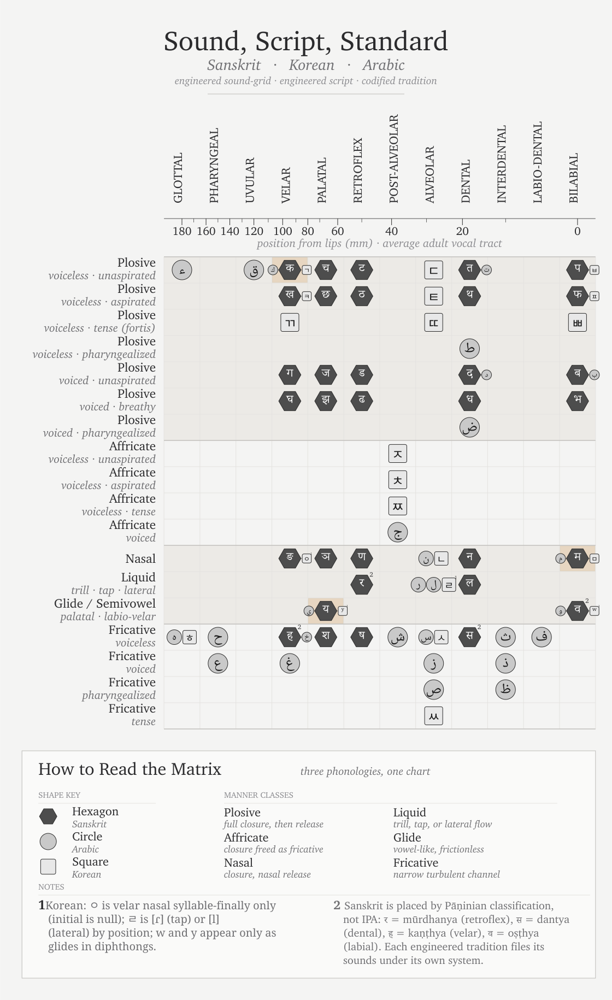
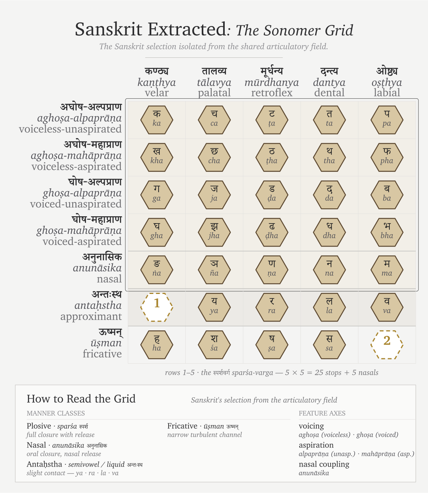
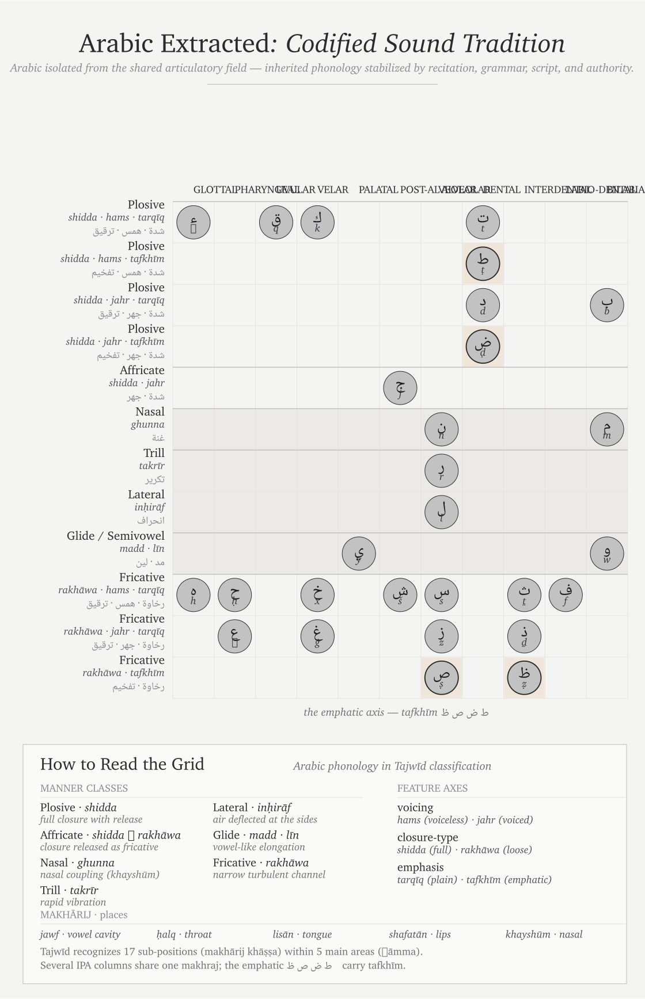
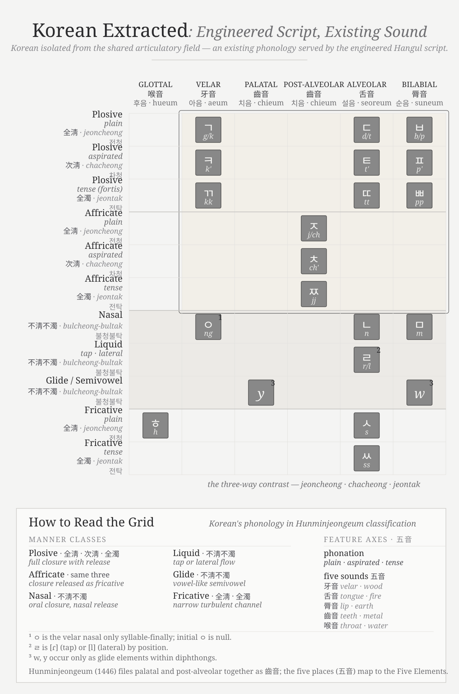

# Appendix Part 3 — The Sonomer and the Audiograph: Sound Engineering, Pun Intended

---

This appendix traces a sequence the foundational orthodoxy never identified.

The sonomer comes first. The audiograph comes second.

The deeper invention is not the visible mark. The deeper invention is the **sonomer** — the measured sound-particle Sanskrit calls **वर्ण (*varṇa*)**. Sanskrit is sonomeric before it is audiographic. The language is built from sonomers before any script makes those sonomers visible.

The visible unit is the **अक्षर (*akṣara*)** — the imperishable sound-unit made visible. The script is **लिपि (*lipi*)**. *Lipi* renders. It does not found. **श्रुति (*Śruti*)** stands above *lipi*. Sound is the calibrant; writing is the interface.

**ब्राह्मी (*Brāhmī*)** and **देवनागरी (*Devanāgarī*)** did not create the architecture. They rendered it.

Chapter 8 §8.5 introduced the *akṣara* as the audiograph. Chapter 13 §13.3 exposed the Brāhmī-from-Aramaic claim as heroic erasure at the script level. This appendix develops the prosecution.

## 3.1 Sonomer First, Audiograph Second

The order is simple.

The **sonomer** is the measured sound-particle. It is articulated by place, shaped by effort, timed by **मात्रा (*mātrā*)**, classified inside the **वर्णमाला (*varṇamālā*)**, and made available to grammar.

The sonomer is not only a spatial unit. It is also temporal. Chapter 8 mapped the mouth: five places of articulation, five manners of contact, the perfect 5×5 *sparśa* matrix. Chapter 9 added timing: a consonant carries the half-*mātrā* interval; a short vowel carries one *mātrā*; a long vowel carries two; a pluta vowel carries three. Chapter 10 then built the *dhātuḥ* from those timed sonomers. The sonomer therefore carries two coordinates at once: where the sound is made and how long the sound is held.

That is why the term is stronger than "phoneme." A phoneme is a contrastive unit in modern linguistics. A sonomer is a measured unit of speech production. It classifies speech by the same physical questions a modern speech-language pathologist would ask: where is the tongue, what is the contact, how is the breath released, how long does the sound last, and what changes when the speaker moves from one sound to the next? Sanskrit answered those questions inside the architecture.

The *varṇamālā* is the ordered inventory of those sonomers. It is not a pile of sounds. It is a map of the mouth and a timing grid: back to front, place by place, effort by effort, duration by duration.

The **akṣara** is the stable sound-unit. It bonds one or more sonomers into a unit the system can hold, teach, chant, write, and recombine.

The **audiograph** is the visible rendering of that *akṣara*. It is not a letter in the ordinary alphabetic sense. It is articulated sound made visible.

The hierarchy is therefore:

> **sonomer → varṇamālā → akṣara → audiograph → lipi**

The sonomer is the unit. The *varṇamālā* orders the units. The *akṣara* stabilizes the unit. The audiograph makes it visible. *Lipi* is the interface, not the foundation.

This matters because the foundational orthodoxy starts at the wrong end. It sees the visible mark first. It compares glyphs. It asks whether Brāhmī looks like Aramaic. It classifies Indic scripts as *abugidas*. It treats the visible interface as the primary object.

That misses the architecture. The real question is not whether a few glyphs show contact influence. The real question is whether Aramaic could have supplied the sonomeric system Brāhmī renders. It could not.

The sonomer comes first. The audiograph comes second. The entire appendix follows from that order.

## 3.2 The Interface Trap

The Brāhmī-from-Aramaic story is the script-level version of the Sanskrit-from-PIE story.

The two claims operate in parallel. One says Sanskrit descends from Proto-Indo-European. The other says Brāhmī descends from Aramaic. Both identify an Indic engineered system. Both place its origin outside India. Both allow India refinement, elegance, and adaptation. Both deny India the architecture.

The Indic civilization is allowed to decorate what someone else built. It is not allowed to build.

Aramaic is real and PIE is not. That difference matters, but it does not save the move. PIE has no inscription, no speaker, no community, no text. It is a reconstructed projection. Aramaic is a real historical script with surviving inscriptions and historical communities. The Aramaic case is therefore harder to prosecute than the PIE case. But the operation is the same: foreground the alleged source, push the Indic engineering into the background, and call the result adaptation.

This appendix prosecutes the ***foundational orthodoxy*** — the doctrinal stratum Chapter 3 §3.2 identifies alongside the *progressive orthodoxy*. The foundational orthodoxy defends a corridor story: engineered writing begins in the Near-Eastern-to-European corridor. Sumerian cuneiform, Egyptian hieroglyphs, Phoenician alphabet, Greek extension, Latin script. The book's main chapters prosecute the progressive orthodoxy that obscures the engineered Sanskrit thesis in the deep past. This appendix prosecutes the foundational orthodoxy that obscures the *varṇamālā*'s engineering outside the privileged corridor.

The two orthodoxies coordinate. The progressive orthodoxy protects the story that later means better. The foundational orthodoxy protects the story that writing begins in the corridor. The engineering of the *varṇamālā* — the sonomer inventory before it is ever written — threatens both.

The interface trap is the first defense. Treat the visible glyph as the object. Ignore the sonomeric system underneath it. Classify the interface. Refuse the architecture.

## 3.3 The "Brilliantly Adapted" Move

The standard account does not usually say Brāhmī was crudely copied from Aramaic. It says something more careful. Brāhmī, the account claims, was adapted from Aramaic *brilliantly*.

An unnamed Indian adapter supposedly took an Aramaic consonantal alphabet — twenty-two consonants, right-to-left writing, no systematic encoding of place of articulation — and transformed it into the Indic *abugida*: roughly forty-eight characters arranged by **स्थान (*sthāna*)** and **प्रयत्न (*prayatna*)**, vowels as diacritic modifications, left-to-right writing, and a *varga* matrix laid out by phonetic principle.

The adapter receives praise. The architecture disappears.

That is the trick. The orthodox account praises an unnamed Indian figure for adapting a borrowed template. It grants India cleverness while anchoring the source outside India. The brilliance gets to belong to India; the architecture does not.

The unnamed adapter is celebrated for adaptation. He is not celebrated for what he would have to be celebrated for if the architecture were original to India: the isolation of the sonomers, the design of the *varṇamālā*, the mapping of the mouth, the construction of the multi-axis phonetic specification.

This is **heroic erasure**, the move Chapter 13 §13.3 exposed and Chapter 8 §8.6 established as a standing convention. The *church of progress* elevates a downstream operator and erases the engineering the operator was supposedly using. Pāṇini becomes the brilliant codifier; the engineered language disappears. The *Prātiśākhya* authors become careful phoneticians; the engineered sound-system disappears. The imagined Brāhmī adapter becomes brilliant; the *varṇamālā* disappears.

The brilliance the orthodox account locates in the adapter is the architecture the adapter was rendering.

## 3.4 What Aramaic Cannot Carry

The structural claim can be tested.

Aramaic is a consonantal alphabet. Like its Phoenician parent, it represents consonants. Its letter order — *alep*, *bet*, *gimel*, *dalet* — carries accumulated scribal habit. It does not carry a mouth-map. It does not order sounds by place of articulation. It does not order sounds by effort. It does not mark the vowel-center of the syllable as an engineered principle. Vowels are supplied by the reader from knowledge of the language.

Aramaic is a writing technology. It is not a phonetic specification.

Brāhmī implements the same engineered architecture as Devanāgarī: the same *varṇamālā*, the same precise encoding of sonomers, with different glyph shapes.[NOTE: brahmi-devanagari-structural-identity] The *varga* matrix gives five rows by place of articulation: velar, palatal, retroflex, dental, labial. Each row carries five manners of articulation: unvoiced unaspirated, unvoiced aspirated, voiced unaspirated, voiced aspirated, nasal. The vowel system modifies the consonant glyph by vowel value: *ā*, *i*, *ī*, *u*, *ū*, *e*, *ai*, *o*, *au*. The **अयोगवाह (*ayogavāha*)** — **अनुस्वार (*anusvāra*)** and **विसर्ग (*visarga*)** — mark breath and nasal gestures distinct from both consonants and vowels.

None of this is in Aramaic.

The architecture Brāhmī encodes — the *varga* matrix, the *sthāna* / *prayatna* system, the vowel-diacritic system, the *ayogavāha* category — has no source in Aramaic. Aramaic does not isolate the full sonomer system by place, effort, time, vowel-center, and breath-gesture. The encoding system could not be borrowed from a source that does not have it.

Aramaic could plausibly influence the shape of a few glyphs. Some Brāhmī letters may resemble some Aramaic letters. Even if granted, that proves only possible glyph contact. It does not prove system transmission.

The encoding system could not be borrowed from a source that does not have it.

The system is in the sonomers and their *varṇamālā*. Aramaic has no equivalent.

The foundational orthodoxy's claim therefore shrinks. At most, it can claim that some glyph-shapes may show contact influence. That is much smaller than the claim that *Brāhmī derives from Aramaic*.

Aramaic can carry glyph influence. It cannot carry sonomeric architecture.

## 3.5 Stone Preserves the Pyramid

The chronology objection does less work than the foundational orthodoxy wants.

The secure archaeological record shows Brāhmī in durable public form: royal edicts, stone inscriptions, cave records, coins, seals, potsherds, institutional markings. Aśoka's Mauryan edicts. Samudragupta's **प्रशस्ति (*prashasti*)** carved into the Allahabad pillar. Rudradāman's Junagadh rock inscription. Khāravela's Hāthīgumphā record. Each apex preserves itself. Each apex commanded the resources to make its writing survive.

That is the archive of survival, not the archive of invention.

Stone preserves what authority wanted preserved. The surviving inscriptions are apex speech carved into durable matter. They do not prove that writing began with the apex. They prove that the apex had the resources to make writing survive.

The same pattern appears elsewhere. Hammurabi's stele. Darius's Behistun inscription. Egyptian pyramids and tomb inscriptions. Monumental authority survives because stone survives. The pyramid preserves itself in the material best suited to preservation. The ***asuric pyramid*** Chapter 3 §3.6 defines is not only a metaphor here. It is the literal shape stone preserves best.

A distributed civilization leaves a different archive. Notes, teaching aids, accounts, letters, mnemonic prompts, working drafts, student exercises, household records, market communication — these live on palm leaf, birch bark, wood, cloth, temporary tablets. In the Indian climate, that archive dies. The absence of surviving notebooks is not evidence that no one wrote notes. It is evidence that stone survives and palm leaf rots.

This matters because *lipi* was not the civilizational calibrant. Chapter 13 §13.3 disqualified writing for the *sāṃskṛtika* bucket. The calibrant was sound: the *varṇamālā*, the eleven **पाठाः (*pāṭhāḥ*)**, the **प्रातिशाख्य (*Prātiśākhya*)** discipline, **शिक्षा (*Śikṣā*)**, **छन्दस् (*Chandas*)**, **व्याकरणम् (*Vyākaraṇam*)**, and the **गुरुशिष्यपरम्परा (*guru-shishya paramparā*)**. Writing could serve the system without carrying the system. A civilization that placed preservation in the mouth and ear had no need to make writing its primary archive.

The first durable Brāhmī inscription dates the surviving interface. It does not date the *varṇamālā*. It does not date the mapping of the mouth. It does not date the isolation of the *varṇa* as sonomer. It does not date the invention of the *akṣara* as the imperishable sound-unit made visible.

Stone preserves the pyramid. It does not preserve the notebook.

## 3.6 Audiography — The Name Withheld

Orthodox typology lists six categories: *logographic*, *syllabary*, *alphabet*, *abjad*, *abugida*, *featural*. The categories classify scripts by surface behavior: what the signs represent on the page. They do not classify scripts by what they are engineered to do.

**Peter T. Daniels** coined *abjad* and *abugida* in 1990 by taking the first letters of the systems being named. *Abjad* is the first four letters of the Arabic order (ا ب ج د — *alif-bā'-jīm-dāl*). *Abugida* is the first four letters of the Ge'ez script (*a-bu-gi-da*). The naming convention is precisely the Indic *varṇamālā* convention. Sanskrit names its consonant rows after their first letters: *ka-varga*, *ca-varga*, *ṭa-varga*, *ta-varga*, *pa-varga*. Letters name themselves by themselves. The whole system is *the garland of varṇas* — *varṇamālā*.

Yet when the church of progress classified the Indic scripts, it did not coin *varṇography*, *akṣaragraphy*, or any Sanskrit-rooted technical term. It borrowed *abugida* — an Ethiopian Semitic name — and applied it to the Indic family. The naming convention that worked for Arabic in its own letters and Ge'ez in its own letters was withheld from Sanskrit. The Indic system was classified using somebody else's vocabulary.

The label *abugida* is not false at the surface. It is false as the final category. It captures how the script behaves on the page. It does not capture what the script encodes.

Brāhmī, Devanāgarī, and the Indic script family are audiographic. They render articulated sound as visible architecture. But audiography is already downstream. The deeper engineering is sonomeric: Sanskrit first isolates the sonomers, arranges them in the *varṇamālā*, and builds with them. The glyph is the interface.

To admit *audiography* as a category would force the foundational orthodoxy to acknowledge an Indic invention at the level it guards most closely: the engineering of writing. To admit *sonomer* would go deeper still. It would acknowledge that India first engineered the unit the script renders. That is why the asuric pyramid prefers a borrowed typological label. *Abugida* keeps the Indic system inside someone else's taxonomy. *Audiography* lets it stand in its own category.

There is a precise parallel in another domain. In 1839, **John Herschel** coined *photography* — from Greek *phōs* (light) and *graphē* (writing) — for the engineered capture of visible reality as a stable visual artifact. Niépce's heliograph, Daguerre's daguerreotype, and Talbot's calotype were the engineering achievements. *Photography* named them. The church of progress treats photography as a foundational accomplishment of the nineteenth-century West. It celebrates the named inventors. It traces the engineering. It teaches the achievement in every art school.

The *varṇamālā*, rendered as Brāhmī and its descendants, is the engineered capture of audible reality as a stable visual artifact. It is the same operation as photography, applied to a different physical phenomenon, many thousands of years earlier, at far higher fidelity than any later writing system has matched. Photography captures three rough channels of visible light. The *varṇamālā* first isolates the sonomers and then captures their full articulation matrix: five places of articulation, five manners of articulation, vowel modification, and the *ayogavāha* breath-gestures.

The church of progress did not coin the parallel term. There is no standard reference entry for *audiography* in this sense. The achievement was not given a name in its own vocabulary.

The coinage lands here. ***Audiography*** — Latin *audi-* (hear) + Greek *-graphia* (writing), the same hybrid pattern as *television* or *automobile* — denotes the engineered visual rendering of articulated sound that the *varṇamālā* specifies and that Brāhmī, Devanāgarī, and the other Indic scripts implement. The prior coinage is ***sonomer***: the measured sound-particle, Sanskrit's *varṇa*, isolated before writing begins. An ***audiograph*** is one *akṣara* — one engineered sound-unit made visible, with the sonomer-classification encoded in the glyph's position within the *varga* matrix. ***Audiography*** is the system. An ***audiographer*** is its practitioner: the *Śikṣā* and *Prātiśākhya* *ācāryas* who carry the audiographic specification across generations.

*Akṣara* literally means *that which does not decay* — *a-* (privative) + √kṣar (to flow, to perish). Sanskrit did not call the unit a letter, a mark, or a written scratch. It called it the imperishable. Photography captures visible reality into media that decay: silver halide breaks down, paper yellows, pixels rot. Audiography captures audible reality into a unit whose name asserts non-decay.

| | Phenomenon | Engineered capture | Visual artifact | System | Practitioner |
|---|---|---|---|---|---|
| Light | photons reflecting off the world | camera optics + photochemistry | a photograph | ***photography*** | photographer |
| Sound | articulated mouth-gestures of the speaker | sonomer isolation + *sthāna* / *prayatna* engineering rendered as *varga*-matrix | an audiograph (the *akṣara*-glyph) | ***audiography*** | audiographer (*ācārya* of *Śikṣā* / *Prātiśākhya*) |

[FIGURE A.4: *Photography and Audiography.* — the two engineered captures laid in parallel, with the Indic achievement preceding the Western one by many thousands of years and operating at higher resolution along more channels.]

The coinage pairs with ***Auditure*** (Chapter 13 §13.4; Chapter 14 §§14.1–14.2). *Auditure* denotes the speech-hearing preservation method that holds the Vedic corpus in its engineered form across thousands of years without a perishable medium. Sound is preserved as sound: *śruti*, what is heard. *Audiography* denotes the engineered visual rendering of that same sound when writing is needed. Sonomers become visible. The *varṇamālā* becomes image.

*Auditure* is the primary engineering. The civilization refused the written medium for its *sāṃskṛtika* content and built the speech-hearing chain. *Audiography* is the secondary engineering. When writing is needed for derived purposes, the engineering of the *varṇamālā* renders sound with precision. It does not become scripture. It does not become the source of the core content.

The foundational orthodoxy has *scripture* in its vocabulary because its civilization placed sacred content on the written word. It does not have *Auditure* because admitting the term would mean admitting that another civilization refused that placement and engineered something more sophisticated. It has *photography* because Europe engineered the capture of light. It does not have *sonomer* or *audiography* because admitting those terms would mean admitting that India engineered the capture of sound first: first as sonomers, then as visible sound-units, at higher resolution, along more channels, and called the architecture the *varṇamālā*.

The parallel with the Indic place-value system is exact, but the sonomer reaches deeper.[NOTE: kaplan-zero-erasure] Place value turns number into a finite symbolic system whose rules can generate unbounded arithmetic. The sonomer turns speech into a finite measured sound-system whose rules can generate Sanskrit. Both are civilization-level abstractions. Both turn apparent infinity into disciplined procedure.

The church of progress has missionaries in both domains. Kaplan did not invent the displacement of zero, but he carried it beautifully into the public mind: Mesopotamian "nothing" becomes the foreground; Indic *śūnya* becomes a later episode. That is not neutral popularization. It is civilizational displacement in narrative form.

The seventh category is therefore not optional. *Logographic, syllabary, alphabet, abjad, abugida, featural, audiography* is the complete list. The first six classify scripts by surface property. The seventh classifies a script by the engineering content it encodes.

## 3.7 Three Design Cases: Sound, Script, Standard

The comparison has to separate three design cases: sound, script, and standard. The sound inventory is one layer. The script that renders it is another. The authority that standardizes it is a third. Confusing those layers is how Sanskrit is reduced to the wrong category. Sanskrit is not merely a standardized language, and not merely a language with a clever script. Korean Hangul proves that a script can be engineered for an existing language. Arabic proves that an inherited sound-and-script tradition can be stabilized through powerful recitational, grammatical, and legal authority. Sanskrit goes deeper: the sound inventory itself is architected as a sonomeric grid, and the scripts render that grid downstream.[NOTE: sound-script-standard-matrix]

{#fig:app3-sound-script-standard-matrix width=90%}

{#fig:app3-sanskrit-extracted-sonomer-grid width=90%}

{#fig:app3-arabic-extracted-codified-sound-tradition width=90%}

Arabic has a powerful preserved sound tradition. Its extraction shows the Semitic sound-field clearly: pharyngeal reach, emphatic consonants, and a recitational discipline that has held the Qur'anic form with force. Its standardizing power, however, lies in codification: recitation authority, grammar, script tradition, and legal-religious custody. The sound tradition is disciplined. The script tradition is deep. The pattern is not a sonomeric grid engineered as a complete place-and-effort matrix.

{#fig:app3-korean-extracted-engineered-script width=90%}

The four-panel sequence prevents category theft. A shared matrix lets the reader compare like with like. The extractions then show what kind of pattern each system leaves. Sanskrit leaves a grid at the sound layer. Arabic leaves a codified tradition around an inherited phonology. Korean leaves an engineered script fitted to an existing phonology. These are not the same achievement. Treating them as the same achievement is the category confusion this appendix prosecutes.

Hangul proves the church of progress can recognize audiographic engineering when recognition costs it nothing.

King Sejong the Great of Joseon Korea engineered Hangul in 1443. Sejong documented the engineering principle himself in the *Hunminjeongeum* preface: consonant shapes depict the articulators, and vowel shapes encode features such as tongue height and rounding. The script is audiographic by Sejong's own statement of design: articulated sound rendered as glyph, mapped by mouth-geometry.

The ***priests of progress*** celebrate this engineering openly. **Geoffrey Sampson** coined ***featural*** in *Writing Systems: A Linguistic Introduction* (1985) specifically to name what Hangul does. He called Hangul *"perhaps the most scientific writing system ever devised."* UNESCO created the King Sejong Literacy Prize in 1989. South Korea observes a national Hangul Day. Orthodox typology added a category to house Hangul. The named inventor is celebrated. The date is recorded to the year. The engineering documentation is treated as engineering documentation. The typological vocabulary was coined to capture what Sejong did.

The same priests of progress apply *abugida* — borrowed from Ge'ez — to the *varṇamālā* and its descendants. The *varṇamālā*'s engineering is anonymized. The date is dissolved into pre-history. The *Prātiśākhya* and *Śikṣā* disciplines are treated as descriptive linguistics rather than engineering specification. The isolation of sonomers is treated as mere phonetic description. The consonant-by-place organization is treated as taxonomic curiosity rather than systematic encoding of pronunciation as glyph-position.

Hangul proves the church of progress can recognize audiographic engineering when the politics permit. It created vocabulary, awards, and typological categories to celebrate one engineered audiographic script. It refused to create any of these for the older and much larger family — the family that engineered the category in the first place.

The difference is distance from the foundational civilizational claim. Korean Hangul, engineered in 1443, sits comfortably downstream of the Near-Eastern-to-European corridor. Celebrating Sejong adds an Asian achievement to the record of human ingenuity without dislocating the foundational claim about who invented writing. The church of progress can be generous because generosity costs it nothing.

The *varṇamālā* is different. Acknowledging it as engineered audiographic writing would place the original engineered capture of articulated sound in a civilization that dislocates the foundational claim. Acknowledging the sonomer would be worse for that claim, because the visible script would no longer be the deepest achievement. The deeper achievement would be the isolation of the units from which Sanskrit itself is built.

The asuric pyramid cannot afford that acknowledgment. So the engineering is erased: the origin anonymized, the date dissolved, the documentation reduced to taxonomic linguistics, and the typological vocabulary withheld. The church of progress recognizes audiographic engineering when recognition costs it nothing. It erases sonomeric and audiographic engineering when recognition would cost it the foundational civilizational claim.

The scale of the erasure is large. The script family orthodox typology classifies as *abugida* serves roughly 1.5 billion users across South Asia, Tibet, and Southeast Asia — most of the literate population east of the Indus and west of the Pacific, with the Sinosphere as the principal exception. Korean Hangul, classified under *featural*, adds another eighty million. The audiographic family is the writing-system architecture of close to a third of the world's literate population.

The orthodox classification — *abugida* for the Indic family, *abugida* again for the Pallava-derived Southeast Asian family, *featural* for Hangul — labels one engineering achievement with categories that name surface behavior rather than engineering content. The unifying category, *audiography*, was the term the church of progress declined to coin.

[FIGURE A.9: *The audiographic family and its orthodox classification.* — the table below; a visual treatment may consolidate by region with orthodox labels as a column.]

| Script | Orthodox label | Primary languages | Approx. users (millions) |
|---|---|---|---|
| **Brāhmī-derived (Indic):** | | | |
| Devanāgarī | abugida | Sanskrit, Hindi, Marathi, Nepali, Konkani | 600+ |
| Bengali / Bangla | abugida | Bengali, Assamese, Manipuri | 270 |
| Telugu | abugida | Telugu | 95 |
| Tamil | abugida | Tamil | 85 |
| Gujarati | abugida | Gujarati | 55 |
| Kannada | abugida | Kannada | 45 |
| Odia | abugida | Odia | 40 |
| Malayalam | abugida | Malayalam | 35 |
| Gurmukhi | abugida | Punjabi (eastern) | 30 |
| Sinhala | abugida | Sinhala | 17 |
| Tibetan | abugida | Tibetan, Dzongkha, Ladakhi | 7 |
| **Pallava-derived (Southeast Asian):** | | | |
| Thai | abugida | Thai | 70 |
| Burmese | abugida | Burmese, Shan, Karen | 50 |
| Khmer | abugida | Khmer | 17 |
| Lao | abugida | Lao | 7 |
| Javanese / Balinese | abugida | Javanese, Balinese (historic / heritage) | minor live use |
| **Independent invention:** | | | |
| Hangul | *featural* | Korean | 80 |
| | | | |
| **Audiographic-family combined user-base** | | | **~1.5 billion** |

*Approximate; primarily first-language and significant second-language users; figures rounded. Sources: contemporary linguistic surveys. The table omits minor historic and recently-revived scripts (Sharada, Modi, Grantha, Tirhuta, Meitei Mayek, Sora Sompeng, Wancho, the Philippine Baybayin family, and others); the engineering content is the same.*

The misclassification is not an innocent gap waiting for better data. It is the structural move by which orthodox typology refuses to acknowledge that one engineering category covers close to a third of the world's writing.

## 3.8 The Foundational Claim on Writing

The Brāhmī-from-Aramaic narrative persists because writing is foundational inside the Abrahamic imagination.

The Hebrew Bible declares the written word as the medium of the covenant. The Torah is given in writing on Sinai. The Christian gospel of John opens with *the Word was God* — the *logos*. The Qurʾān's first revelation to Muḥammad begins with *iqraʾ* — read, recite. All three original Abrahamic religions are religions of the written word. All three place authority in a textual act.

The ***fourth Abrahamic religion*** — the asuric formation Chapter 3 §3.6 anchors — inherits the same orientation in secular form. Its foundational orthodoxy makes the modern academy's history of civilization a history of writing. Civilization begins where writing begins. Writing systems become the index of civilizational origin. Sumerian cuneiform, Egyptian hieroglyphs, Phoenician alphabet, Greek vowel letters, Latin script — these become the foundational moments the foundational orthodoxy identifies.

This is not neutral. It places the engineering of writing inside the Near-Eastern-to-European corridor. Later scripts, including Brāhmī, become adaptations of templates that originated there. The progressive orthodoxy then adds the time-axis: later-along-the-corridor becomes more advanced. The two doctrinal strata complete the enclosure.

The sonomer breaks that enclosure. It says the visible mark is not the deepest achievement. The deepest achievement is the measured sound-particle and the ordered sound-system built from it. The script renders that system; it does not create it. The written word loses its monopoly over foundation.

That is why the sonomer threatens the pyramid more directly than the audiograph. The audiograph challenges the claim that India borrowed writing. The sonomer challenges the deeper claim that writing is the primary civilizational foundation.

A claim by Indian civilization to have engineered its script independently would dislocate the foundational claim. A stronger claim — that India first isolated the sonomers, produced the *varṇamālā*, and then rendered that sonomeric architecture as Brāhmī — does more. It relocates the foundation from writing to sound.

The Brāhmī-from-Aramaic narrative is not random. It defends the foundational civilizational claim Chapter 3 §3.6 establishes. It is the script-level analogue of the Sanskrit-from-PIE narrative. Both do the same asuric work in different media. The book's main chapters dismantle the second. This appendix isolates the first as a parallel target.

## 3.9 The Work Ahead

*Atomic Sanskrit* prosecutes the language-engineering case. The script-engineering case is a new research project — the same operation in a different medium. This appendix does not finish that project. It opens it.

The project has several tasks.

First, compare Brāhmī, Aramaic, Kharoṣṭhī, and Phoenician by encoding system, not by glyph-shape alone. A few visual similarities cannot explain the *varga* matrix, the vowel-diacritic system, the *ayogavāha*, or the sonomeric specification underneath them.

Second, read the *Prātiśākhya* and *Śikṣā* literature as engineering documentation. These texts show that the sonomer system is older than the script that renders it.

Third, test the chronology of Aramaic-Brāhmī contact without letting the surviving stone archive decide the whole question. Durable stone records apex speech. It does not preserve the working notebook.

Fourth, study the Abrahamic-substrate claims about the invention of writing as claims, not as background truth. The modern story of writing is not innocent. It protects a civilizational foundation.

Fifth, describe Brāhmī's encoding system as the real engineering content: the *varga* matrix, the vowel-diacritic system, the *ayogavāha*, and the visible rendering of the *akṣara*. The source-script question must be reframed as a glyph-shape question, not a system-origin question.

The project requires Sanskrit fluency sufficient to read the *Prātiśākhya* and *Śikṣā* texts in the original; training in epigraphy and the history of writing systems; familiarity with Aramaic, Phoenician, and the Near-Eastern alphabetic family; and the courage to test the invention-of-writing story rather than inherit it.

The architecture is waiting for the account. The philological apparatus has examined the visible glyphs of Brāhmī. It has not decoded the system those glyphs render. The same engineering thesis the main chapters develop for Sanskrit applies, with proper substitution, to Brāhmī: the script is the *varṇamālā* made visible; the *varṇamālā* is the ordered sonomer architecture; the engineering predates the visible interface; and the engineering is Indic.

The work is open.

---

## Draft notes (Appendix Part 3 v3)

**Word count:** ~4,400 prose words across nine sections after the sonomer-first restructure.

**Structural change:** The appendix now follows the hierarchy named by the new title: sonomer first, audiograph second. The former audiography-first presentation has been rebuilt so that the reader receives the positive architecture before the Aramaic, abugida, Hangul, and Abrahamic-written-word prosecutions.

**Section spine:**

- §3.1 defines the hierarchy: sonomer → *varṇamālā* → *akṣara* → audiograph → *lipi*.
- §3.2 names the interface trap and places the Brāhmī-from-Aramaic story beside the Sanskrit-from-PIE story.
- §3.3 preserves the "brilliantly adapted" / heroic-erasure argument.
- §3.4 gives the technical verdict: Aramaic can carry glyph influence, not sonomeric architecture.
- §3.5 moves the chronology objection after the technical case: stone preserves the pyramid, not the notebook.
- §3.6 preserves the audiography coinage, the photography parallel, the Auditure pairing, the place-value / Kaplan displacement paragraph, and the seventh-category claim.
- §3.7 now carries the three-design-case comparison (Sanskrit sound-grid / Arabic codified tradition / Korean engineered script), while preserving the Hangul control case and the audiographic-family scale table.
- §3.8 names the foundational written-word claim and explains why the sonomer threatens it more deeply than the audiograph alone.
- §3.9 reframes the invitation as the work ahead.

**Standing terms preserved:** *sonomer*, *audiograph*, *audiography*, *audiographer*, *Auditure*, *foundational orthodoxy*, *church of progress*, *priests of progress*, *asuric pyramid*, *fourth Abrahamic religion*, *heroic erasure*.

**Endnote stubs preserved:** `brahmi-devanagari-structural-identity`, `kaplan-zero-erasure`, `sound-script-standard-matrix`.

**Backward references:** Chapter 3 §3.2 (foundational + progressive orthodoxies); Chapter 3 §3.6 (*asuric pyramid* + *fourth Abrahamic religion*); Chapter 8 §8.5 (*akṣara* as audiograph + sonomer / audiograph distinction); Chapter 8 §8.6 (heroic erasure); Chapter 13 §13.3 (Brāhmī-from-Aramaic named without prosecution; *sāṃskṛtika* disqualification of writing); Chapter 13 §13.4 (*Auditure*); Chapter 14 §§14.1–14.2 (*Auditure* full development).
