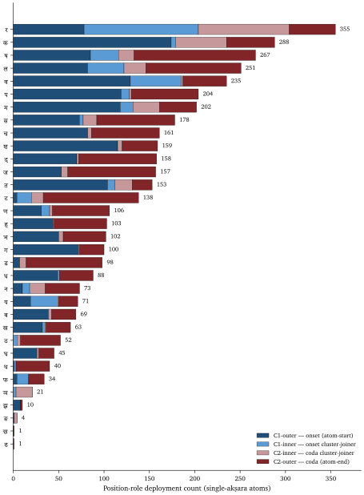
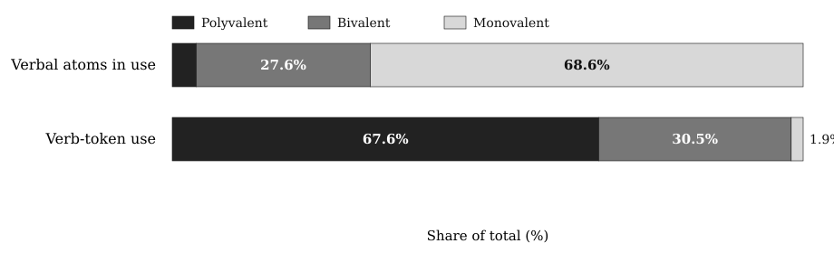
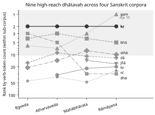

# Appendix Part 6 — The Architecture by the Numbers

*Draft v3 (2026-05-29). Reorganized layer-by-layer (sonomer / construction / operation / productivity) to mirror Ch 10's and Ch 11's procedural arc. Folds in the position-role taxonomy, the cluster-joiner specialist class, the* mūrdhanya *dual-role finding, the* ṛ */* ra *bridge, the place × place CVC matrix, and the Path C* prayoga *reactivity material — the deferred items flagged in the v2 SYNC PENDING block. Reconciles the* juhotyādi *C4 share (31.8% → 33.3% inventory, 42.9% Path C-restricted) and the scaffold count (69 → 47). The reproducibility scaffold now names both bundles:* `analysis/dhatupatha/` *(Path A — structural) and* `analysis/ganah/` *(Path C — corpus-attested).*

---

Chapter 10 states the architectural claim. Chapter 11 carries the claim one scale up into operation. This appendix is the empirical reservoir behind both — every statistical signal at every layer of the architecture, with the reproducibility bundles that re-derive the numbers.

The appendix is organized as four layers that mirror the chapters' procedural arc:

- **Part A — The Sonomer Layer** (§§6.2–5.6) — what the *varṇāḥ* (वर्णाः) do inside the atom: column distribution, position-conditional preferences, the cluster-joiner specialist class, the *mūrdhanya* dual-role place, the *ṛ* signal and the *ṛ* / *ra* bridge.
- **Part B — The Construction Layer** (§§6.7–5.10) — how the sonomers assemble into the scaffold and the atom: compression, clusters, OCP, *vaicitrya*.
- **Part C — The Operation Layer** (§§6.11–5.12) — how the atom behaves under *gaṇa* / *vikaraṇa* operations: cross-*gaṇa* functional matching, Path C corpus-attested reactivity.
- **Part D — The Productivity Layer** (§6.13) — the bottom-line: small atoms generate large vocabularies; Sanskrit's productivity-frequency relationship runs opposite to natural-language drift.

Synthesis (§6.14) and replication (§6.15) close the appendix.

---

## 6.1 Source and Method

The source corpus is the digital Pāṇinian **धातुपाठ (*Dhātupāṭha*)** from the open-source `sanskrit/vyakarana` GitHub project: 2,168 entries across the ten **गणाः (*gaṇāḥ*)**. The count sits within the conventional Pāṇinian range (~1,940 to ~2,200 depending on recension); the **माधवीय धातुवृत्ति (*Mādhavīya Dhātuvṛtti*)**, the **सिद्धान्तकौमुदी (*Siddhāntakaumudī*)**, and the **क्षीरस्वामिन् (*Kṣīrasvāmin*)** commentary yield comparable totals with minor recensional variation in marginal entries.

Each Pāṇinian *dhātu* citation form carries **अनुबन्ध (*anubandha*)** markers — phonemes present in the citation that are not part of the underlying *dhātu*, used to signal grammatical properties the **अष्टाध्यायी (*Aṣṭādhyāyī*)** uses downstream. The **इत्संज्ञा (*it-saṃjñā*)** rules of *Aṣṭādhyāyī* 1.3.2–1.3.9 specify which phonemes are *anubandhas*. Three rules apply to *dhātavaḥ* and are implemented in every analysis script:

- **1.3.2 — *upadeśe 'janunāsika it*** (उपदेशेऽजनुनासिक इत्): a final *anunāsika*-marked short vowel is an *anubandha*. Trailing short *-a* / *-i* / *-u* after a consonant carries this status. Implementation strips such trailing short vowels *only when at least one other vowel remains* — preserving genuine CV-pattern *dhātavaḥ* like *ji* (जि, to conquer), *hu* (हु, to sacrifice), *sru* (स्रु, to flow).
- **1.3.3 — *halantyam*** (हलन्त्यम्): a trailing single-consonant *anubandha* is stripped when it sits immediately after a vowel. The canonical case is *kṛ* (कृ), cited as *ḍukṛñ* (डुकृञ्); after the initial *ḍu* is stripped by 1.3.5 and the trailing *ñ* by 1.3.3, the underlying *dhātu* *kṛ* is recovered.
- **1.3.5 — *ādir ñiṭuḍavaḥ*** (आदिर्ञिटुडवः): the initial two-character sequences *ñi* / *ṭu* / *ḍu* in *dhātu* citation forms are *anubandhas* and are stripped from the front.

Accent markers (~, \\, ^) — the **उदात्त (*udātta*)** / **अनुदात्त (*anudātta*)** / **स्वरित (*svarita*)** recitational distinctions — are stripped before structural classification.

### The four-role position-role taxonomy

Parts A and B operate on a four-role classification of consonant position inside the single-*akṣara* atom:

| Role | Notation | Position | Engineering function |
|---|---|---|---|
| **onset_outer** | $C_{1o}$ | atom-start | the release gesture that opens the atom |
| **onset_inner** | $C_{1i}$ | inside an onset cluster, before the vowel | cluster-joiner before the vowel |
| **coda_inner** | $C_{2i}$ | inside a coda cluster, after the vowel | cluster-joiner after the vowel |
| **coda_outer** | $C_{2o}$ | atom-end | the settlement gesture that closes the atom |

The taxonomy extends the earlier three-position (initial / medial / final) treatment to the cluster-aware case: a consonant inside a cluster is not at the atom boundary; it is bonding one consonant to another. Aggregations: **C₁ total** = onset_outer + onset_inner; **C₂ total** = coda_inner + coda_outer; **inner total** = onset_inner + coda_inner (cluster-joining work); **outer total** = onset_outer + coda_outer (atom-boundary work). The extended-cluster dataset spans **1,852 single-*akṣara* atoms** across all eight cluster patterns (CV, VC, CVC, CCV, VCC, CCVC, CVCC, CCVCC) — substantially larger than the CVC-only 920-atom subset earlier analyses used.

### *Svara* / *vyañjana* as atom / ion

The Sanskrit terminology itself encodes a structural distinction the rest of the appendix builds on:

- ***Svara*** (स्वर) — *self-sounding*. The vowel stands alone as a syllable. **Stable atom**, complete unit, carrier of identity. The *svara* table has 14 vowel atoms (अ / आ / इ / ई / उ / ऊ / ऋ / ॠ / ऌ / ॡ / ए / ऐ / ओ / औ).
- ***Vyañjana*** (व्यञ्जन) — *that which manifests another*. The consonant cannot stand alone as a pronounceable unit. **Ion** / **radical**, requires bonding. The *vyañjana* table has 33 consonant ions arranged on the *varṇamālā*'s place × manner × voicing × aspiration grid.
- ***Akṣaram*** (अक्षरम्) — *the imperishable*. The stable consonant-vowel bonded unit. **The salt** — Sanskrit's own term for the stable compound formed by an ion bonding around an atomic nucleus.

Two stacked grids, one architecture. The *svara* table supplies the nuclei; the *vyañjana* table supplies the ions; the *akṣaram* is the bonded compound. The appendix measures both grids and the bonding behavior between them.

The method is deliberately reproducible. Every table comes from scripts in `analysis/dhatupatha/` (Path A — structural analysis of the *Dhātupāṭha* itself) and `analysis/ganah/` (Path C — corpus-attested combinatorial valency from the Digital Corpus of Sanskrit). The falsifications matter as much as the confirmations: the appendix names where the data refused the first model and forced a refined one.

---

# Part A — The Sonomer Layer

## 6.2 *Varga* Columns — Cost × Distinguishability

**Prediction.** The compression principle predicts an articulatory-cost gradient at the column level: C1 (unvoiced unaspirated — *k, c, ṭ, t, p*; क, च, ट, त, प) cheapest and dominant; C4 (voiced aspirated — *gh, jh, ḍh, dh, bh*; घ, झ, ढ, ध, भ) most expensive and rarest. Order predicted: C1 > C2 ≈ C3 > C4.

**Data** (*gaṇa* 1, the primary class — 1,485 *varga*-consonant occurrences):

| Column | Count | % |
|---|---:|---:|
| C1 (unv-unasp — *k, c, ṭ, t, p*) | 555 | **37.4%** |
| C2 (unv-asp — *kh, ch, ṭh, th, ph*) | 136 | **9.2%** |
| C3 (voi-unasp — *g, j, ḍ, d, b*) | 382 | 25.7% |
| C4 (voi-asp — *gh, jh, ḍh, dh, bh*) | 161 | **10.8%** |
| C5 (nasal — *ṅ, ñ, ṇ, n, m*) | 251 | 16.9% |

**Verdict — partially confirmed, one substantive refinement.** C1 dominance ✓. But the rarest column is **C2 (9.2%), not C4 (10.8%)**. The cost-only model predicted that voiced aspirates should be suppressed most. The data says otherwise. Aspiration on a voiceless stop is a *small* perceptual change (a longer breath puff after release). Aspiration on a voiced stop is a *large* perceptual change — the breathy-voice / **महाप्राण-घोषवत् (*mahāprāṇa-ghoṣavat*)** signature is highly salient. C4 pays its cost; C2 pays cost for negligible distinguishability gain.

The engineering principle is therefore **cost × distinguishability**, not cost alone.

**Quantitative test.** Each of the 25 *varga* consonants is assigned (place, voicing, aspiration, nasality) features. Weighted feature-distance uses asymmetric-aspiration weighting per above. Engineering value = mean_weighted_distance / (1 + cost). Spearman rank correlations against *gaṇa* 1 frequency:

| Metric | ρ |
|---|---:|
| **Engineering value** (distinguishability / (1+cost)) | **+0.304** |
| Mean weighted distance (distinguishability alone) | −0.465 |
| Mean binary Hamming distance | −0.339 |
| Cost (raw) | −0.401 |

Engineering value is the strongest positive predictor (ρ = +0.304). Pure distinguishability is *negatively* correlated with frequency because cost dominates — high-distinguishability consonants are also high-cost. The combined metric captures the trade-off.

**The cell-level discovery.** ρ = +0.304 means roughly 9% of frequency variance is explained by engineering value. The remaining 91% is unexplained by this two-factor model. Looking at the per-cell data shows why. Within the C1 row (engineering value 2.40, all five cells tied):

- ***k*** (क, velar): 197 occurrences
- ***p*** (प, labial): 101
- ***c*** (च, palatal): 98
- ***t*** (त, dental): 83
- ***ṭ*** (ट, retroflex): 76

Within the C5 row (nasals, engineering value 1.29):

- ***m*** (म, labial): 131
- ***ṇ*** (ण, retroflex): 58
- ***n*** (न, dental): 38
- ***ñ*** (ञ, palatal): 22
- ***ṅ*** (ङ, velar): **2**

*m* vs *ṅ* — a **65× difference at identical engineering value**. The architecture's cell-level preferences are real and substantial — not statistical noise. Specific (place × column) cells are deployed at wildly different rates that the two-factor model cannot capture.

The architecture is column-aware *and* cell-aware. Column-level engineering is real; the deeper architecture works cell by cell.

## 6.3 Position-Conditional Preferences

**Prediction.** Distinguishability varies by position because acoustic cues vary. Aspiration is strong in initial / medial, weak in final. Voicing is strong in initial / medial, moderate in final. Place cue is strong in initial, moderate in final.

**Data — column distribution by position** (*gaṇa* 1):

| Position | C1 | C2 | C3 | C4 | C5 | N |
|---|---:|---:|---:|---:|---:|---:|
| Initial | 41.5% | 4.3% | 22.2% | 14.4% | 17.6% | 653 |
| Medial | 42.4% | 10.2% | 18.5% | 6.4% | 22.6% | 314 |
| Final | 29.2% | 14.7% | 34.6% | 9.1% | 12.5% | 518 |

**Verdict — initial confirmed; final breaks the two-factor model.**

- **Initial.** C1 (41.5%) > C3 (22.2%) > C5 (17.6%) > C4 (14.4%) > C2 (4.3%). The cleanest single confirmation: C2 at initial is the rarest column at 4.3%.
- **Final.** Two major divergences. (i) **C3 outranks C1** in final position (34.6% vs 29.2%) — voiced consonants are *preferred* as finals over voiceless. (ii) C2 is *more* common in final (14.7%) than in initial (4.3%) — contrary to the weakened-aspiration-cue prediction.

**Why finals break the model.** Final consonants in Sanskrit *dhātavaḥ* have a third role beyond standing distinguishably: they are the **bonding sites** where *dhātavaḥ* combine with **प्रत्यय (*pratyaya*)** affixes (Chapter 12) and where words combine with following words via **सन्धि (*sandhi*)**. The architecture of *sandhi* requires a rich, diverse final-consonant inventory — voiced and aspirated finals participate in specific *sandhi* transformations essential to the combinatorial chemistry.

The model therefore is **cost × distinguishability × combinatorial load**. The two-factor model holds at initial; the three-factor model is needed at final.

**Data — place distribution by position** (*gaṇa* 1):

| Place | Count | % | Initial | Medial | Final |
|---|---:|---:|---:|---:|---:|
| Velar | 364 | 24.5% | 54.1% | 23.9% | 22.0% |
| Palatal | 220 | 14.8% | 39.1% | 15.9% | 45.0% |
| Retroflex | 226 | 15.2% | **13.7%** | 23.5% | **62.8%** |
| Dental | 311 | 20.9% | 46.0% | 21.2% | 32.8% |
| Labial | 364 | 24.5% | 53.8% | 20.1% | 26.1% |

**Verdict — predictions split.**

- **Three-tier place structure** (not uniform): top (velar 24.5%, labial 24.5%), middle (dental 20.9%), bottom (palatal 14.8%, retroflex 15.2%).
- **Retroflex initial-depletion strongly confirmed.** 13.7% initial vs ~50% for velar / labial. Mirror image: retroflex final share is **62.8%** — nearly three times uniform.
- **Dentals + labials *not* over-represented in final** — they sit at 32.8% and 26.1%, both below uniform.
- **Palatals *not* depleted in final** — they sit at 45.0%, *more* than initial 39.1%.

Retroflex finals participate in the **रुकि (*ruki*)** rule, **विसर्ग (*visarga*)** conditioning, the cerebralization of *s* → *ṣ* (स → ष), and other *sandhi* mechanisms. The architecture places retroflex force where it can bond, trigger, and transform. Palatals likewise: their final-position prominence reflects the *sandhi* mechanisms operating on *-j*, *-c*, *-bhuj*-style endings.

The engineering is not assigning sounds to empty slots. It is assigning sounds to roles. §6.4 names the consonants the architecture deploys disproportionately for cluster-joining work; §6.5 names the place the architecture engineers for dual-role activity.

## 6.4 The Cluster-Joiner Specialist Class

§6.3 measured consonants by initial / medial / final position. The four-role taxonomy splits *medial* into *onset_inner* (inside an onset cluster, before the vowel) and *coda_inner* (inside a coda cluster, after the vowel) — both **cluster-joining** roles. The question this section asks: do certain consonants disproportionately do cluster-joining work, or do all consonants cluster-join in proportion to their overall frequency?

**The criterion.** Define a consonant as a **cluster-joiner specialist** when its inner deployment (onset_inner + coda_inner) accounts for ≥ 25% of its total appearances across single-*akṣara* atoms. Six consonants meet the criterion:

| Atom | onset_outer | onset_inner | coda_inner | coda_outer | inner total | total | **inner / total** |
|---|---:|---:|---:|---:|---:|---:|---:|
| **र** (*ra*) | 78 | 126 | 100 | 51 | **226** | 355 | **64%** |
| **य** (*ya*) | 19 | 30 | 1 | 21 | **31** | 71 | **44%** |
| **फ** (*pha*) | 4 | 13 | 0 | 17 | **13** | 34 | **38%** |
| **न** (*na*) | 10 | 8 | 17 | 38 | **25** | 73 | **34%** |
| **ल** (*la*) | 82 | 40 | 24 | 105 | **64** | 251 | **26%** |
| **व** (*va*) | 129 | 56 | 2 | 48 | **58** | 235 | **25%** |

Every other consonant sits in the 7–18% inner range. The specialist class is a discrete tier, not the high end of a continuum. ष (*ṣa*) at 18% is a minor cluster-joiner with strong outer-coda specialty — participates in the bonding work without crossing the threshold.

**The 73% cluster-joining concentration.** Looking specifically at the second-in-cluster position (the $C_{2i}$ role and its onset-cluster mirror), five atoms — **र (100), व (45), ल (36), ष (29), य (28)** — account for **238 of 325 inner-cluster appearances** = 73%. The remaining 28 consonants split the residual 87 between them.

The class composition is the *vyākaraṇa* tradition's own classification reading back. Four of the six specialists — **य, र, ल, व** — are the **अन्तःस्थाः (*antaḥsthāḥ*)**: literally *those that stand between*. The name describes the position-role the data confirms. The fifth member — ष (*ṣa*) — is from the **ऊष्माणः (*ūṣmāṇaḥ*)** sibilant row, the *mūrdhanya* sibilant specifically. The two outliers (फ *pha*, न *na*) are smaller-volume specialists whose inner-cluster share rides above the threshold but whose absolute cluster-joining counts are lower.

{#fig:app5-position-roles width=95%}

**Why this matters.** The *varṇamālā* gives 33 consonants. The architecture does not deploy them as interchangeable bonding sites. A small specialist class — the *antaḥsthāḥ* plus the *mūrdhanya* sibilant — does almost all consonant-to-consonant bonding work. This is the *carbon-of-clusters* role: a small set of atoms that bond promiscuously, holding larger consonant structures together while the other consonants do atom-boundary work.

The *vyākaraṇa* tradition's name for the class — *antaḥsthāḥ*, *those that stand between* — was already the right name. The data confirms the class is operationally real. Ch 10 §10.14 carries the chapter-prose statement of the same finding; this section is the reproducibility backbone.

## 6.5 The *Mūrdhanya* Dual-Role Place

§6.4 found that a small set of consonants specializes in cluster-joining. The question this section asks: does any **place of articulation** disproportionately do cluster-joining work?

**The measurement.** Aggregate the four position-roles up to the place level. For each of the five Pāṇinian places, compute the share of total deployment spent in inner (cluster-joining) roles vs outer (atom-boundary) roles:

| Place | $C_{1o}$ | $C_{1i}$ | $C_{2i}$ | $C_{2o}$ | outer | inner | **inner %** |
|---|---:|---:|---:|---:|---:|---:|---:|
| कण्ठ्य (velar) | 420 | 10 | 68 | 236 | 656 | 78 | **10.6%** |
| तालव्य (palatal) | 327 | 41 | 39 | 293 | 620 | 80 | **11.4%** |
| **मूर्धन्य (retroflex)** | **243** | **229** | **155** | **550** | **793** | **384** | **32.6%** |
| दन्त्य (dental) | 461 | 84 | 84 | 507 | 968 | 168 | **14.8%** |
| ओष्ठ्य (labial) | 542 | 112 | 43 | 309 | 851 | 155 | **15.4%** |

**The finding.** Every place except *mūrdhanya* sits in the **10.6–15.4%** inner range. *Mūrdhanya* is at **32.6%** — more than double the next-highest place. Retroflex is the only place doing substantial cluster-joining work.

The dual-role finding is driven by two consonants:

- **र** (*ra*): 226 inner-cluster appearances — 64% of *ra*'s total deployment is inner. The cluster-joiner extreme from §6.4.
- **ष** (*ṣa*): 48 inner-cluster appearances — strong coda-outer specialty plus minor cluster-joining.

Both sit at the *mūrdhanya* site. The architecture has placed its two heaviest cluster-joiners at the same articulatory location.

**Why this matters — the dual-role engineering.** The other four places are predominantly atom-boundary specialists: *kaṇṭhya* and *oṣṭhya* open atoms, *dantya* closes them, *tālavya* sits between. *Mūrdhanya* alone is engineered as a **dual-role place** — it does both atom-boundary work AND cluster-joining work. The 550 *mūrdhanya* coda-outer appearances confirm the boundary role (the **62.8% retroflex-as-final** finding from §6.3); the 384 inner appearances add the cluster-joining role on top.

The compounding signal. *Mūrdhanya* shows up three times in the appendix as the architecturally-most-loaded place:

1. **Largest C₂ column** in the CVC place × place matrix (§6.9 below): 351 atoms vs 133–314 for other places. Retroflex is engineered into atom-final position.
2. **Uniquely dual-role** (this section): 32.6% inner activity vs 10.6–15.4% elsewhere. Retroflex also does cluster-joining work.
3. **Cross-inventory coupling** (§6.6): *ṛ* as nuclear vowel at the *mūrdhanya* site and *ra* as the universal cluster-joiner at the same site — the *svara* and *vyañjana* inventories bridged at one articulatory location.

Three independent measurements pointing at the same conclusion: the *mūrdhanya* class does more architectural work than any other place. None of these is in the orthodoxy's account of retroflex as a marked, marginal, areal feature. Ch 10 §10.14 carries the chapter-prose statement; Ch 16 §16.3 develops the retroflex-as-architecturally-central polemic on this foundation.

## 6.6 The *Ṛ* Signal and the *Ṛ* / *Ra* Bridge

**Prediction.** अ (*a*, the inherent vowel) should dominate — lowest cost, default carrier. ऋ (*ṛ*) should cluster with specific consonants (the classic *vṛ-* वृ-, *kṛ-* कृ- *dhātu* pattern). Long vowels should be over-represented in compact CV / CCV *dhātavaḥ*.

**Data** (*gaṇa* 1, 1,397 vowel occurrences):

| Rank | IAST | Count | % |
|---:|---|---:|---:|
| 1 | *a* (अ) | 512 | **36.6%** |
| 2 | ***ṛ*** (ऋ) | 214 | **15.3%** |
| 3 | *u* (उ) | 182 | 13.0% |
| 4 | *i* (इ) | 119 | 8.5% |
| 5 | *e* (ए) | 108 | 7.7% |
| 6 | *ā* (आ) | 87 | 6.2% |
| 7 | *ī* (ई) | 61 | 4.4% |
| 8 | *ū* (ऊ) | 45 | 3.2% |
| 9–13 | *ai, o, ḷ, au, ṝ* | (small) | <2% each |

Top consonants preceding *ṛ*: *v* (11.2%), *k* (8.9%), *ṣ* (7.9%), *ḍ* (7.5%), *p* (7.0%).

**Verdict — predictions confirmed; one striking finding.**

- *a*-dominance ✓ at 36.6%.
- *ṛ* pairs with specific consonants ✓ (*vṛ*, *kṛ*, *ṣṛ*, *ḍṛ*, *pṛ*).
- Long vowels collectively ~14%; short vowels ~75%.

**The headline.** ***ṛ* is the second-most-common vowel in the *Dhātupāṭha* at 15.3%.** Cross-linguistically extraordinary. Syllabic *ṛ* is a typologically rare phoneme — most languages do not have one at all; where it exists it is typically marginal. In Sanskrit, *ṛ* is placed as a central vowel of the foundational atomic inventory, used in 214 distinct primary-class *dhātavaḥ*: *kṛ, vṛ, dṛś, mṛ, hṛ, tṛp, vṛt, kṛp, mṛj, sṛj, dṛp*. These atoms generate massive vocabulary: *karma* (कर्म), *manas* (मनस्), *mṛtyu* (मृत्यु), *mokṣa* (मोक्ष), *sṛṣṭi* (सृष्टि), *vṛddhi* (वृद्धि), *kṛti* (कृति), *prakṛti* (प्रकृति), *vikṛti* (विकृति), and hundreds more.

### The *ṛ* / *ra* bridge

The *ṛ* finding above and the *mūrdhanya* dual-role finding from §6.5 couple at one articulatory site.

The Sanskrit phonological apparatus places *ṛ* (ऋ) at the *mūrdhanya* site in the **svara** table — the only vowel positioned there. The same apparatus places *ra* (र) at the *mūrdhanya* site in the **vyañjana** table — and *ra* is the universal cluster-joiner (§6.4, 64% inner-cluster activity). Two inventories, one site, two extreme architectural loadings.

The bridge is not symbolic — it is operational. Under **यण्-सन्धि (*yaṇ-sandhi*)**, vocalic ऋ resolves into र before a following vowel: the same articulatory principle crossing the vowel/consonant boundary, taking nuclear form in the *svara* table and bonding form in the *vyañjana* table. *Ṛ* and *ra* are the same *r*-principle, deployed twice — once as nucleus, once as bonder.

The *mūrdhanya* site therefore carries:

- the only vowel at that place (*ṛ*) — high-yield, typologically rare, central to the *dhātupāṭha* inventory;
- the universal cluster-joiner consonant (*ra*) — extreme inner-cluster specialist;
- the *sandhi* rule (*yaṇ-sandhi*) that converts between the two forms.

Three coupled loadings at one articulatory location. The architecture is not distributing structural weight evenly across places. The tongue-curl site carries disproportionate load by design.

Ch 10 §10.14 develops the bridge as a fractal-behavior claim at the *varṇamālā* level. Ch 16 §16.3 carries the retroflex-as-architecturally-central polemic forward.

---

# Part B — The Construction Layer

## 6.7 Compression — Particle and *Akṣara* Counts

Ch 10 §10.7 carries the canonical statement of the compression finding. This section preserves the falsification narrative that produced the current numbers.

**Data** (across all 2,168 *dhātavaḥ*, post-Pāṇinian *anubandha*-stripping per *Aṣṭādhyāyī* 1.3.2 / 1.3.3 / 1.3.5):

| Particles | Count | % | Common patterns | Examples |
|---|---:|---:|---|---|
| 2 (minimum) | 251 | 11.6% | CV, VC | *kṛ* कृ, *bhū* भू, *dā* दा, *ji* जि, *hu* हु, *ad* अद् |
| 3 (modal) | 1,262 | 58.2% | CVC, CCV, VCV | *gam* गम्, *pat* पत्, *vac* वच्, *yam* यम्, *labh* लभ्, *dṛś* दृश् |
| 4 | 556 | 25.6% | CCVC, CVCC, CVCV | *svap* स्वप्, *jval* ज्वल्, *bandh* बन्ध्, *granth* ग्रन्थ्, *manth* मन्थ् |
| 5 (threshold) | 79 | 3.6% | CCVCC, CVCVC, CCVCV | *spand* स्पन्द्, *skand* स्कन्द्, *spardh* स्पर्ध् |
| 6+ (cliff) | 11 | 0.5% | — | — |

*Akṣara* count: 1 *akṣara* **98.2%**, 2 *akṣaras* 1.6%, 3+ *akṣaras* 0.2%.

**The falsification narrative.** Earlier appendix snapshots reported 48.5% modal-particle share, 1.9% at the 5-particle threshold, and 82.8% single-*akṣara* dominance. Those numbers came from a pre-Pāṇinian-1.3.2 *anubandha*-stripping pass, which misclassified ~320 *dhātavaḥ* whose trailing nasalized vowels are *it*-markers per Pāṇini and not part of the structural root. The correction shifted the modal-particle peak from 48.5% to 58.2%, sharpened the 5-particle threshold from 1.9% to 3.6%, and raised single-*akṣara* dominance from 82.8% to 98.2%. The architecture compresses more sharply than the pre-correction numbers indicated.

The methodological lesson: the empirical engineering signal lives in the post-Pāṇinian-stripped form. Applying the correct *Aṣṭādhyāyī* 1.3.x rules is not a clean-up step; it is the difference between measuring the *dhātuḥ* and measuring the citation form.

## 6.8 Cluster Inventory and the *Kṣ* Phenomenon

**Prediction.** Initial 2-consonant clusters dominated by stop + sonorant (sonority-rising onsets — *kr-*, *tr-*, *pr-*, *dr-*, *gr-*, *bhr-*, *dhr-*, *śr-*). S + stop clusters (*sp-*, *st-*, *sk-*, *sm-*, *sn-*) — Sanskrit's famous exception to sonority sequencing — present. Three-consonant initial clusters rare. Final 2-consonant clusters dominated by nasal + stop (*-nd*, *-nt*, *-mb*, *-mp*).

**Data** (*gaṇa* 1):

- 22.8% of *dhātavaḥ* have 2-consonant initial clusters; 0.6% have 3-consonant initial clusters.
- 14.1% of *dhātavaḥ* have 2-consonant final clusters; 0.6% have 3-consonant final clusters.

Top initial 2-consonant clusters: **tr-** (त्र-, 5.4%), **śr-** (श्र-, 4.7%), **kṣ-** (क्ष-, 4.3%), *dhr-* / *ṣṭ-* / *bhr-* / *gl-* (3.9% each).

Top final 2-consonant clusters: **-kṣ** (-क्ष्, 20.0% — single-cluster dominance), *-rd* (7.5%), *-ñc* (7.5%), *-rb* (6.9%), *-rv* (6.9%), *-ll* (6.2%).

**Verdict — partially confirmed; two striking observations.**

- Stop + sonorant ✓; S + stop ✓; three-consonant rarity ✓.
- **Final cluster prediction wrong**: nasal + stop is *not* dominant. The dominant final cluster is **-kṣ** (-क्ष्), accounting for 20% of all final 2-consonant clusters (*dakṣ*, *lakṣ*, *sakṣ*, *rakṣ*, *bhakṣ*). Nasal-plus-stop clusters appear (*-ñc*, *-mbh*, *-ñj*, *-lbh*) but each is a small fraction.

**The *kṣ* engineering symmetry.** The same क्ष cluster dominates both initial position (27 atoms across CCV + CCVC patterns) and final position (29 atoms in CVCC). No other cluster operates at both atom-ends. क्ष combines a velar release (कण्ठ्य) with a retroflex sibilant (मूर्धन्य) — phonetically a long-distance articulatory movement that the architecture is engineering in heavily despite its phonetic cost, at both atom boundaries. The cluster pays its acoustic cost because the velar-to-retroflex transition produces a maximally distinct sonic edge.

**Cluster-joiners are visible in the cluster inventory itself.** The second-in-cluster position is dominated by **र (100), व (45), ल (36), ष (29), य (28)** — the cluster-joiner specialist class §6.4 names. The cluster top-N tables and the position-role specialist class are two views of the same engineering: a small set of bonding atoms holding the consonant clusters together.

Geminate finals (*-ll*, *-ḍḍ*, *-kk*, *-ṭṭ*) also appear — doubling as a structural closure-strengthener device.

## 6.9 OCP and the Place × Place Matrix

**Prediction.** For single-syllable (1-*akṣara*) *dhātavaḥ* with both initial and final *varga* consonants, two patterns may emerge: place harmony (initial and final share place — *kak*-style), voicing harmony (initial and final share voicing — *gam*-style), or avoidance. No strong directional prediction.

**Data — OCP scalar** (*gaṇa* 1, 271 single-syllable *dhātavaḥ* with both initial and final *varga* consonants):

- **Place harmony — observed 10.3%, expected 27.7%** (under independence) → **STRONG AVOIDANCE**. Only 28 of 271 *dhātavaḥ* have same-place initial and final, when independence would predict ~75. ~62% below chance.
- **Voicing harmony — observed 55.7%, expected 49.4%** → modest harmony (~13% above chance).

Sanskrit *dhātavaḥ* *avoid* same place of articulation flanking the vowel. The Obligatory Contour Principle operates as design: *kak* and *pap* are suppressed; *kap*, *gat*, *pun* preferred. Place-variation is engineered into the CVC structure for maximum acoustic distinctiveness across the syllable.

**This is the strongest single empirical signal in the appendix.** The *dhātuḥ* is not merely compressed. It is internally distributed for acoustic distinction.

**The place × place matrix.** The scalar above compresses a richer dataset. Across all 1,141 single-*akṣara* CVC atoms in the extended-cluster baseline, the joint distribution of (C₁ place, C₂ place) makes the OCP avoidance visible *and* surfaces a second finding:

| $C_{1}$ \\ $C_{2}$ | कण्ठ्य (velar) | तालव्य (palatal) | मूर्धन्य (retroflex) | दन्त्य (dental) | ओष्ठ्य (labial) | row tot |
|---|---:|---:|---:|---:|---:|---:|
| कण्ठ्य (velar) | 13 | 28 | 98 | 56 | 28 | 223 |
| तालव्य (palatal) | 19 | 15 | 65 | 57 | 38 | 194 |
| मूर्धन्य (retroflex) | 34 | 19 | 33 | 35 | 33 | 154 |
| दन्त्य (dental) | 36 | 43 | 54 | 39 | 64 | 236 |
| ओष्ठ्य (labial) | 31 | 60 | 101 | 127 | 15 | 334 |
| col tot | 133 | 165 | 351 | 314 | 178 | **1141** |

**Principle 1 — OCP visualized.** The diagonal cells (same-place C₁ and C₂) are systematically suppressed:

- कण्ठ्य × कण्ठ्य = 13
- तालव्य × तालव्य = 15
- मूर्धन्य × मूर्धन्य = 33
- दन्त्य × दन्त्य = 39
- ओष्ठ्य × ओष्ठ्य = **15**

Off-diagonal cells run 3–10× larger than diagonal cells in the same row. The matrix is the visible form of the 62%-below-chance suppression.

**Principle 2 — *Mūrdhanya* as C₂ asymmetry.** The column totals show retroflex's architectural loading directly:

| Place | C₁ tot | C₂ tot | C₁/C₂ | Preference |
|---|---:|---:|---:|---|
| कण्ठ्य (velar) | 223 | 133 | 1.68× | strongly INITIAL |
| तालव्य (palatal) | 194 | 165 | 1.18× | moderately INITIAL |
| **मूर्धन्य (retroflex)** | **154** | **351** | **0.44×** | **strongly FINAL** |
| दन्त्य (dental) | 236 | 314 | 0.75× | moderately FINAL |
| ओष्ठ्य (labial) | 334 | 178 | 1.88× | strongly INITIAL |

Retroflex is **2.3× more common as the final consonant than as the initial consonant** of a CVC atom. The pattern is geometric: front-of-mouth and back-of-mouth places (labials at the lips, velars at the throat) → INITIAL. Tongue-curl place (retroflex) → FINAL. Mid-mouth places (palatal, dental) sit between.

**The dominant off-diagonal trajectories** — where the architecture sends the most atoms:

- ओष्ठ्य × दन्त्य: **127** (lip-release → dental-settle — *pat* पत्, *vad* वद्)
- ओष्ठ्य × मूर्धन्य: **101** (lip-release → retroflex-settle)
- कण्ठ्य × मूर्धन्य: **98** (velar-release → retroflex-settle — *kṛṣ* कृष्, *gṛh* गृह्)

The same matrix carries the OCP avoidance finding (§6.9's scalar) and the *mūrdhanya* C₂ asymmetry (§6.5's third compounding signal). Voicing harmony is the milder secondary effect — easier to maintain a voicing state across the syllable than to switch.

## 6.10 *Vaicitrya* — Engineered Range in the Tail

**Prediction.** An engineered architecture should be concentrated but not closed. The modal scaffolds dominate the inventory; specialized scaffolds exist at low frequency for cases the modal forms cannot stage. Sanskrit aesthetics has the word for the principle: **वैचित्र्य (*vaicitrya*)** — patterned variety, the force by which sameness does not become monotony. Chapter 10 §10.8 places this under *astobham*: the modal scaffolds remove waste, while the governed tail preserves *vaicitrya* where range does work.

**Data** (the 37 *racanā* scaffolds outside the top 10):

| Stratum | Ranks | Scaffolds | *Dhātavaḥ* | % of corpus | Character |
|---|---|---:|---:|---:|---|
| Near tail | 11–15 | 5 | 128 | 5.90% | Working scaffolds just outside the top-10 cutoff |
| Mid tail | 16–25 | 10 | 38 | 1.75% | Disyllabic + dense-cluster + boundary shapes |
| Deep tail | 26–47 | 22 | 29 | 1.34% | Mostly 1-occurrence hapax shapes |
| **Total tail** | **11–47** | **37** | **195** | **9.00%** | |

**Reading the strata.**

***Near tail*** (ranks 11–15). **V1CC** (35 *dhātavaḥ*: अर्द्, अञ्च्, अर्च्, अर्ज्), **CCV1** (35: क्षि, स्मृ, श्रि, ह्वृ, स्वृ), **V2C** (28: एध्, ओख्, ईख्, एज्, ईज्), **CV2CC** (23: वेष्ट्, चेष्ट्, घूर्ण्), and **CV1CV2C** (7: a disyllabic shape just clearing the rank-15 line). Five shapes at 0.3–1.6% deployment each. The cutoff between top-10 and the near tail is statistical, not architectural — these scaffolds carry the same kind of work as the lower-frequency members of the top-10 list. Each serves a specific structural scope: vowel-initial closed forms (V1CC), cluster-onset short atoms (CCV1), long-vowel closed atoms (V2C), and long-vowel double-closed atoms (CV2CC).

***Mid tail*** (ranks 16–25). 10 scaffolds at 0.1–0.3% each. Three families. **Disyllabic** shapes — V2CV1C, CV2CV2, CV2CV1, CV1CCV2, V1 — for the rare atoms whose semantic targets required a four- to five-*mātrā* envelope. **Three-consonant onset clusters** — CCCV1C, CCCV2C — for specific phonetic-iconic targets where two-consonant clusters could not stage the intended density. **Boundary shapes** — V2CC, CCV2CC, CV1CCC — that exhaust corner cases of the timing grid. None of these is a residual: each carries *dhātavaḥ* the modal scaffolds could not host.

***Deep tail*** (ranks 26–47). 22 scaffolds, mostly 1-occurrence forms. The lone CCCCV2CC dense-cluster shape. Bare V1 and bare C as floor cases. 29 *dhātavaḥ* spread across 22 shapes — perimeter cases where the architecture leaves room for one-off engineering. The system permits what it does not promote.

**Verdict.** The tail is small (9.0% of the inventory) and governed (named shapes, not arbitrary forms; specific functional scope at each level). The 37 scaffolds are the engineering of range, not the failure of concentration. The skeptic's question — *if compression is the principle, why the tail?* — finds its answer in the data: an engineered system concentrates around modal forms *and* preserves reach for specialized scope. Top-10 proves compression; tail proves range. The system is not flat. It is not rigid.

**The cross-axis claim.** The *vaicitrya* signature appears at three levels of the architecture:

- ***Racanā* level** — this section. 37 long-tail scaffolds preserve reach for scope the top-10 cannot stage.
- **Morphological level** — Chapter 14 §14.3. The *chandas* mode preserves multiple infinitive endings (*-tum*, *-tavai*, *-dhyai*, *-tave*, *-tos*, *-sani*) for metrical scope; the *bhāṣā* mode keeps *-tum* canonical for non-metrical scope. Appendix Part 7 traces the full morphological inventory.
- **Aesthetic level** — Chapter 10 §10.10. The architecture's range across non-modal scaffolds is what makes engineering-poetry's form-meaning assignment have somewhere to land.

One engineering signature, three levels, one principle: range preserved where range does work.

---

# Part C — The Operation Layer

## 6.11 *Gaṇa*-Specific Functional Matching

**Prediction.** The column distribution in *gaṇa* 1 should hold across all 10 *gaṇāḥ* with minor variation. The C1-first pattern should be robust.

**Data** (all 10 *gaṇāḥ*):

| Gaṇa | Class | Dhātavaḥ | C1 | C2 | C3 | C4 | C5 |
|---:|:---:|---:|---:|---:|---:|---:|---:|
| 1 | *bhvādi* | 1,134 | 37.4% | 9.2% | 25.7% | 10.8% | 16.9% |
| 2 | *adādi* | 76 | 37.3% | 1.5% | 35.8% | 3.0% | 22.4% |
| **3** | ***juhotyādi*** | **25** | **22.7%** | **0.0%** | **22.7%** | **33.3%** | **22.7%** |
| 4 | *divādi* | 151 | 36.5% | 2.4% | 22.2% | 15.6% | 23.4% |
| 5 | *svādi* | 39 | 43.6% | 0.0% | 17.9% | 25.6% | 12.8% |
| 6 | *tudādi* | 171 | 38.4% | 10.3% | 26.4% | 8.7% | 16.1% |
| 7 | *rudhādi* | 25 | 35.0% | 2.5% | 35.0% | 12.5% | 15.0% |
| 8 | *tanādi* | 10 | 31.2% | 0.0% | 0.0% | 6.2% | 62.5% |
| 9 | *kryādi* | 69 | 30.0% | 10.0% | 15.0% | 18.8% | 26.2% |
| 10 | *curādi* | 468 | 47.3% | 6.0% | 24.6% | 6.9% | 15.0% |

**Verdict — robust with one substantive outlier.**

- C1-first holds in 8 of 10 *gaṇāḥ* (1, 2, 4, 5, 6, 7, 9, 10).
- *Gaṇa* 8 (*tanādi*, n=10) too small to read confidently; the C5 spike (62.5%) reflects small-class composition.
- ***Gaṇa* 3 (*juhotyādi*) — the substantive outlier**: **C4 leads at 33.3%**. This is the reduplicating class — *dhātavaḥ* like *hu, dā, dhā, mā* that reduplicate in present-tense formation (*juhoti*, *dadāti*, *dadhāti*, *mimīte*).

**The corrected *juhotyādi* number.** Earlier appendix snapshots reported 31.8% for the *juhotyādi* C4 share. The 31.8% came from a pre-correction initial-anubandha table that miscoded the *ñi* initial *anubandha* (Pāṇini's *Aṣṭādhyāyī* 1.3.5) as `Ji` in SLP1, when the correct SLP1 encoding is `Yi` (the SLP1 char for *ñ* is `Y`, not `J`). With correct `Yi` stripping, the entry `YiBI\` (= *bhī*) contributes only its `B` consonant rather than both `Y` and `B`, and the *juhotyādi* C4 share shifts from 7/22 = 31.8% to 7/21 = 33.3%.

**The Path C sharpening.** Under corpus-restriction to *juhotyādi* *dhātavaḥ* actually attested in the Digital Corpus of Sanskrit (the Path C audit, §6.12 below), the C4 share rises from 33.3% inventory to **42.9% corpus-restricted** — a +9.5pp sharpening. The *Dhātupāṭha* over-allocates voiced aspirates to *juhotyādi*; the corpus over-deploys them further.

**Why the *juhotyādi* C4 enrichment makes engineering sense.** Reduplication is a redundancy mechanism — the *dhātuḥ*'s initial consonant doubles to form the present-tense stem. For the doubled consonant to remain identifiable across the syllable boundary, the consonant must be acoustically robust. C4 — voiced, aspirated, breathy — is the column with the most distinctive acoustic signature; the same property that made C4 less-suppressed than C2 in §6.2. The architecture deploys the most-distinguishable column where distinguishability matters most. **Functional matching.**

## 6.12 *Prayoga* Reactivity — The Path C Audit

§§6.2–5.11 measure the *Dhātupāṭha* itself — the engineered inventory. This section measures **what Sanskrit does with the inventory** — corpus-attested deployment across actual Sanskrit use.

**The measurement.** Path C operationalizes reactivity as **corpus-attested combinatorial valency**: the count of distinct (*upasarga*, *pratyaya*-class) pairs in which each *dhātuḥ* surfaces across the Digital Corpus of Sanskrit (DCS) — Hellwig's lemmatized parsed corpus covering Vedic and post-Vedic Sanskrit. The reproducibility bundle is `analysis/ganah/`. Chapter 11 §§11.6–11.9 carries the polemic version; this section is the empirical reservoir.

**The dataset.** 15,900 parsed CoNLL-U files. 1,007,361 verb-token occurrences. 35,319 unique (root, preverb, *pratyaya*-class) triples. 3,839 unique bare roots. Coverage spans Vedic (Ṛgveda, Atharvaveda), epic (Mahābhārata, Rāmāyaṇa), grammatical, *śāstric*, *purāṇic*, *kāvya*, Buddhist, medical, ritual, and philosophical material.

**Top 20 *dhātavaḥ* by Path C valency:**

| Rank | Dhātuḥ | Path C valency | Gloss |
|---:|:--|---:|---|
| 1 | **कृ (*kṛ*)** | 1,062 | do, make |
| 2 | **भू (*bhū*)** | 504 | be, become |
| 3 | **धा (*dhā*)** | 386 | place, set |
| 4 | **हृ (*hṛ*)** | 368 | carry, take |
| 5 | वृत् (*vṛt*) | 293 | turn, exist |
| 6 | **गम् (*gam*)** | 291 | go |
| 7 | नी (*nī*) | 253 | lead |
| 8 | क्रम् (*kram*) | 244 | step, proceed |
| 9 | हन् (*han*) | 216 | strike |
| 10 | पद् (*pad*) | 207 | fall, step |
| 11 | या (*yā*) | 205 | go |
| 12 | *vartay* | 194 | (DCS-derived causative; see methodological note below) |
| 13 | ग्रह् (*grah*) | 182 | grasp |
| 14 | सृज् (*sṛj*) | 182 | release, emit |
| 15 | **दा (*dā*)** | 176 | give |
| 16 | **ज्ञा (*jñā*)** | 176 | know |
| 17 | युज् (*yuj*) | 172 | yoke, join |
| 18 | चर् (*car*) | 170 | move, wander |
| 19 | **स्था (*sthā*)** | 166 | stand |
| 20 | पत् (*pat*) | 164 | fall, fly |

The **canonical nine polyvalent core** — *kṛ, bhū, sthā, gam, jñā, dā, dhā, nī, hṛ* — is bolded above; all nine land in the top 19. Chapter 11 §11.6 develops this set as the carbon-class core. Mean valency across the full 3,839 roots is 9.2; median is 2 (long-tail distribution, exactly as compression predicts).

**Methodological note on *vartay*.** *vartay* appears at valency 194 but is a DCS-derived causative lemma — the form is a corpus-attested causative derivative of वृत् (*vṛt*), not a canonical *Dhātupāṭha* atom. The 9 canonical polyvalents land at ranks 1, 2, 6, 7, 13, 15, 16, 19 (one rank shifts up when *vartay* is excluded).

**The two-instrument agreement.** Path C (corpus-attested valency) and Path A (Monier-Williams + Apte derivative count) measure substantively the same thing through different windows:

| Spearman correlation | ρ |
|---|---:|
| **Path A (MW) vs Path C** | **+0.6647** |
| Path A (MW) vs particles | −0.4900 |
| **Path C vs particles** | **−0.4334** |

ρ = +0.6647 between Path A and Path C means the two instruments agree strongly: the *dhātavaḥ* that generate widely in the dictionaries also bond widely in actual Sanskrit use. ρ = −0.4334 between Path C and particle count means the compression principle (small atoms have more bonding range) is corpus-empirical, not just lexicographer-empirical. The Path A ρ = −0.4900 reproduces the chapter-cited Path A ρ = −0.485 within rounding.

**The reactivity tier structure.** The 3,839 corpus-visible *dhātavaḥ* arrange into three empirical tiers under a locked cutoff scheme (valency ≥ 50 / 5–49 / ≤ 4):

| Tier | Valency range | Roots | % of inventory | Verb-token share | Role |
|---|---:|---:|---:|---:|---|
| Polyvalent — the carbon class | ≥ 50 | 147 | **3.8%** | **67.6%** | high-bonding core |
| Bivalent — the stable middle | 5–49 | 1,059 | 27.6% | 30.5% | productive middle |
| Monovalent — closed-valency specialists | ≤ 4 | 2,633 | **68.6%** | **1.9%** | preserved long tail |

The polyvalent tier — 3.8% of the inventory — generates **67.6%** of all corpus-attested verb tokens. The top 9 alone generate 26.5%. The top 500 cover 94.0%. The compression principle holds operationally, not just inventory-theoretically.

{#fig:app5-reactivity-tiers width=88%}

**Cross-corpus invariance.** The same engineered core dominates across four DCS sub-corpora — *śruti* (Ṛgveda, Atharvaveda Śaunaka) and *smṛti* (Mahābhārata, Rāmāyaṇa):

| Sub-corpus | Style | Files | Canonical 9 attested | In top-20 |
|---|---|---:|---:|---:|
| Ṛgveda | *śruti* | 1,028 | 9/9 | 6/9 |
| Atharvaveda Śaunaka | *śruti* | 519 | 9/9 | 6/9 |
| Mahābhārata | *smṛti* | 1,995 | 9/9 | **9/9** |
| Rāmāyaṇa | *smṛti* | 606 | 9/9 | **9/9** |

The canonical 9 are **9/9 attested in every sub-corpus**. Pairwise Spearman correlations across sub-corpora:

| Comparison | ρ |
|---|---:|
| *Śruti* × *Śruti* (Ṛgveda × AV) | **+0.72** |
| *Smṛti* × *Smṛti* (Mahābhārata × Rāmāyaṇa) | **+0.87** |
| Cross-style (any *śruti* × any *smṛti*) | +0.46 to +0.57 |

Style-internal agreement is higher than cross-style — but cross-style agreement is still strongly positive. The carbon-class core is invariant across the design-purpose split. The Ṛgveda's top-20 includes ritual-specific atoms (*vah* वह्, *yam* यम्, *bhṛ* भृ, *cakṣ* चक्ष्) that don't survive into *smṛti*'s top-20; the canonical core is attested at high valency in every sub-corpus regardless.

{#fig:app5-canonical-rank-trajectory width=90%}

The deployments vary. The core remains. That is what an engineered inventory predicts: a stable set of high-reactivity atoms; different domains apply them to different work; the same engine drives all of them.

---

# Part D — The Productivity Layer

## 6.13 Productivity from Minimum + The Natural-Language Inversion

**Prediction.** If the compression principle governs the architecture, the simplest *dhātavaḥ* (CV pattern, 2 particles) should also be the *most productive* — generating the largest derivative vocabularies. Engineering produces minimum atoms because minimum atoms support maximum combinatorial reach. Predicted Spearman ρ between productivity and particle-count: strongly negative.

**Data — Path A** (curated sample of 138 *dhātavaḥ* spanning the *Dhātupāṭha*'s structural pattern space; productivity = estimated count of primary derivatives per *dhātu*, drawn from the Monier-Williams *Sanskrit-English Dictionary* (1899) and V. S. Apte's *Practical Sanskrit-English Dictionary* (1890); approximate ±20%, ranking is the operative measure).

Top 15 *dhātavaḥ* by productivity:

| Rank | Dhātu | Pattern | Particles | Productivity | Gloss |
|---:|:--|:---|---:|---:|---|
| 1 | *kṛ* कृ | CV | 2 | 75 | do/make |
| 2 | *bhū* भू | CV | 2 | 55 | be/become |
| 3 | *sthā* स्था | CCV | 3 | 55 | stand |
| 4 | *gam* गम् | CVC | 3 | 55 | go |
| 5 | *dā* दा | CV | 2 | 45 | give |
| 6 | *dhā* धा | CV | 2 | 40 | place/set |
| 7 | *jñā* ज्ञा | CV | 2 | 40 | know |
| 8 | *hṛ* हृ | CV | 2 | 40 | carry/take |
| 9 | *nī* नी | CV | 2 | 40 | lead |
| 10 | *as* अस् | VC | 2 | 40 | be/exist |
| 11 | *vac* वच् | CVC | 3 | 40 | speak |
| 12 | *jan* जन् | CVC | 3 | 40 | be born |
| 13 | *vid* विद् | CVC | 3 | 40 | know |
| 14 | *vṛt* वृत् | CVC | 3 | 40 | turn/exist |
| 15 | *śrū* श्रू | CV | 2 | 35 | hear |

Productivity stratified by particle count:

| Particles | n | Mean | Median | Max |
|---:|---:|---:|---:|---:|
| 2 | 26 | **30.1** | 30.0 | 75 |
| 3 | 72 | 20.5 | 18.0 | 55 |
| 4 | 31 | 13.5 | 12.0 | 30 |
| 5 | 8 | **11.4** | 12.0 | 18 |

Productivity by structural pattern:

| Pattern | n | Mean productivity |
|---|---:|---:|
| **CV** | 21 | **32.6** |
| CVC | 57 | 22.3 |
| VC | 5 | 19.6 |
| CVCC | 8 | 16.1 |
| CCV | 10 | 15.3 |
| CCVC | 23 | 12.5 |
| **CCVCC** | 8 | **11.4** |

**Path A Spearman ρ (productivity vs particle count): −0.485.** Mean particle count, top 20 by productivity: **2.40**. Mean particle count, bottom 20: **3.50**. Bottom-to-top ratio: 1.46×.

**Path C corroboration.** The corpus-attested valency measure (§6.12) reproduces the inverse relationship: **Path C ρ vs particles = −0.4334** on the full 3,839-root corpus. The compression principle holds at every measurement scale tested — curated 138-root MW sample, full 3,839-root corpus, both directions.

**Verdict — strongly confirmed.** The CV pattern's mean productivity (32.6) is **2.9×** higher than CCVCC (11.4). The top 20 productivity ranks are dominated by 2-particle CV *dhātavaḥ* (11 of 20). *Kṛ* alone — two particles — anchors 75+ primary derivatives, more than the entire CCVCC sample combined.

**The natural-language inversion.**[NOTE: productivity-inversion-natural-language] In natural languages, the most-frequent forms tend toward idiosyncratic irregularity: English *be / have / do* are paradigmatically broken; Latin *esse / ire / ferre* are suppletive; Greek *eimi / oida / phēmi* same pattern. The frequency-irregularity correlation is one of the most-replicated typological findings in natural-language morphology. In Sanskrit's engineered case, the correlation runs the opposite way: the highest-productivity *dhātavaḥ* are *also* the most structurally minimal *and* paradigmatically regular. There is no idiosyncrasy at the top.

**Future *śāstra* audit (Path B).** A separate audit can be run against the *Aṣṭādhyāyī* itself. That study would not count dictionary derivatives or corpus-visible usage. It would count the formal bonding space the *śāstra* licenses: which *dhātavaḥ* can take which operations, *upasargāḥ*, *vikaraṇāni*, and *pratyayāḥ* under the rule-system. That is future work.

That is not drift. That is engineering.

---

## 6.14 Synthesis — The Eight Engineering Principles

The numbers reveal the architecture operating at eight levels:

1. **Cost × distinguishability** (per-consonant). C1 dominates because it is cheap and clear; C4 survives because it earns its cost through perceptual value; C2 is under-deployed because it pays cost for negligible distinctiveness gain. Spearman ρ = +0.304. *(§6.2.)*
2. **Cell-level allocation** (per place × column). Specific cells are deployed at wildly different rates the two-factor model cannot capture. Labial *m* (131) vs velar *ṅ* (2) — 65× at identical engineering value. *(§6.2.)*
3. **Position-conditional preferences** (per position × column / place). Each column and each place has a position-specific signature. Retroflex strongly prefers final (62.8%); palatals favor final (45%); velars and labials favor initial. *(§6.3.)*
4. **Cluster-joiner specialization** (per consonant × position-role). A six-atom class — the *antaḥsthāḥ* (य, र, ल, व) plus *mūrdhanya* sibilant ष plus boundary specialists फ, न — carries 73% of cluster-joining work. *(§6.4.)*
5. ***Mūrdhanya* dual-role engineering** (per place). The retroflex place is uniquely loaded with both boundary work (62.8% final) AND cluster-joining work (32.6% inner) — driven by *ra* and *ṣa* at the same articulatory site. *(§6.5; coupled with the *ṛ/ra* bridge at §6.6.)*
6. **Cross-position OCP** (per *dhātuḥ*). Place-of-articulation avoidance across the syllable operates at 62% below chance. The strongest single empirical signal in the appendix; the place × place matrix visualizes both the OCP suppression and the *mūrdhanya* C₂ asymmetry. *(§6.9.)*
7. ***Gaṇa*-specific functional matching** (per derivational class). The *juhotyādi* reduplicating class enriches C4 (33.3% inventory → 42.9% corpus-restricted) because reduplication needs acoustic robustness. *(§6.11.)*
8. **Productivity-from-minimum** (per-*dhātuḥ* productivity-axis). The simplest *dhātavaḥ* (2-particle CV) are the most-productive atoms; Path A ρ = −0.485 and Path C ρ = −0.4334 between productivity and particle count, on independent instruments. Unlike natural languages, high-productivity *dhātavaḥ* are also paradigmatically regular. *(§6.13.)*

These principles operate simultaneously and reinforce each other. The architecture is compact, but not merely compact — it is cost-aware, contrast-aware, position-aware, bonding-aware, place-aware, boundary-aware, class-aware, productivity-aware, and range-aware.

The fractal signature is visible in the data itself. Particle count, *akṣara* count, *varga* column, position within syllable, cluster-joiner specialization, *mūrdhanya* dual-role, *gaṇa*-specific matching, productivity-from-minimum, *vaicitrya*'s tail — each is a different slice of the same inventory; each shows the same compression-with-recoverability law operating. The architecture is not fractal because the prose says so. It is fractal because the same engineering signature recurs wherever the data is sliced.

The *Dhātupāṭha* is an atomic inventory. The numbers show the engineering.

## 6.15 Replication — Two Reproducibility Bundles

Every empirical claim in this appendix is reproducible from one of two self-contained bundles. Both use Python 3.10+ standard library only — no external dependencies.

### Bundle 1: `analysis/dhatupatha/` (Path A — structural)

Source data and structural-analysis scripts for §§6.1–5.11 and §6.13.

- **`data/dhatupatha.csv`** — source data (2,168 entries) from the open-source `sanskrit/vyakarana` GitHub project. Three columns: *gaṇa*-number, position-within-*gaṇa*, *dhātu* in SLP1.
- **`data/dhatu_productivity.csv`** — curated productivity sample (138 *dhātavaḥ*) with derivative-count estimates and source attribution (MW 1899; Apte 1890).
- **`data/derived/dhatupatha_decomposed.md`** — every *dhātu* rendered in Devanāgarī with **वर्ण (*varṇa*)**-level decomposition. Generated by `decompose_dhatupatha.py`.

Scripts:

| Script | Output feeds |
|---|---|
| `analyze_dhatupatha.py` | §6.7 structural classification (particle count, *akṣara* count, pattern, *gaṇa* distribution) |
| `decompose_dhatupatha.py` | SLP1 → Devanāgarī conversion + *varṇa*-level decomposition |
| `analyze_varga_distribution.py` | §6.2, §6.3 column × position analysis |
| `analyze_place_distribution.py` | §6.3 place × position analysis |
| `analyze_internal_structure.py` | §6.9 CV/VC/CVC matrices, place × place analysis, CC-clusters |
| `analyze_position_roles.py` | §6.4, §6.5 four-role position-role aggregation across cluster patterns |
| `analyze_extensions.py` | §6.8, §6.6 clusters, *akṣara* breakdown, vowel × consonant |
| `analyze_distinguishability.py` | §6.9 feature-distance scoring, OCP / onset-coda analysis, cross-*gaṇa* |
| `analyze_matra_distribution.py` | *mātrā* envelope distributions (feeds Ch 10 §10.7) |
| `analyze_matra_by_particle_count.py` | *mātrā* × particle stratification |
| `analyze_racana_by_gana.py` | §6.10 scaffold × *gaṇa* matrix |
| `analyze_scaffold_distinguishability.py` | scaffold-distinguishability by *mātrā* (feeds Ch 10 §10.9) |
| `cluster_by_reactivity.py` | consonant clustering by reactivity-profile similarity (feeds §6.4) |
| `analyze_shells.py` | shell-structure analysis of consonant deployment |
| `analyze_productivity.py` | §6.13 productivity vs structural complexity (Path A Spearman ρ = −0.485) |

From the bundle root: `python3 scripts/<script-name>.py [gaṇa]` (`[gaṇa]` is an optional numerical filter 1–10).

### Bundle 2: `analysis/ganah/` (Path C — corpus-attested)

Source corpus and *prayoga* combinatorial-valency scripts for §6.12 (and the §6.11 Path C sharpening; the §6.13 Path C corroboration).

- **`data/raw/dcs/`** — Hellwig's Digital Corpus of Sanskrit GitHub mirror (`OliverHellwig/sanskrit`), CC BY 4.0. 15,900 CoNLL-U parsed Sanskrit files; 180,176-row dictionary with explicit preverb attribution per lemma.
- **`data/derived/attestation_index.csv`** — 35,319 unique (root, preverb, *pratyaya*-class) triples across 1,007,361 verb tokens.
- **`data/derived/path_c_valency.csv`** — 3,839 roots with computed Path C valency.
- **`data/derived/path_a_vs_path_c.csv`** — 121 matched MW roots for the two-instrument cross-validation.

Scripts (run in execution order):

| Script | Output feeds |
|---|---|
| `build_attestation.py` | attestation index — every (root, preverb, *pratyaya*) triple across the corpus |
| `compute_valency.py` | §6.12 per-root Path C valency = count of distinct bonding pairs |
| `spearman_baseline.py` | §6.12 ρ(MW vs Path C) = +0.6647; §6.13 ρ(Path C vs particles) = −0.4334 |
| `tier_cutoffs.py` | tier cutoff scheme selection (locked at ≥50 / 5–49 / ≤4) |
| `tier_distribution.py` | §6.12 reactivity tier population + token shares |
| `cross_corpus.py` | §6.12 per-sub-corpus Spearman matrix (Ṛgveda / AV / MBh / Rāmāyaṇa) |
| `column_axes.py` | column-axis selection (locked at Axis C primary, Axis A secondary; see Ch 11 §11.8) |
| `cross_gana_columns.py` | §6.11 *juhotyādi* C4-enrichment under Path C restriction (33.3% → 42.9%) |
| `per_corpus_productivity.py` | per-sub-corpus productivity tables |
| `join_dhatu_scaffold_path_c.py` | joins Path C valency back onto *Dhātupāṭha* scaffold inventory |
| `analyze_racana_reactivity.py` + `summarize_scaffold_reactivity.py` | scaffold-level reactivity summary (feeds Ch 10 §10.11 four-bar deployment figure) |
| `build_attestation.py` (re-run with `[corpus]` filter) | per-sub-corpus attestation index |

End-to-end runtime: under 5 minutes on a 2024 M-series laptop.

### Path B — Future work

Path B is the unbuilt third path: a *śāstra* audit counting the formal bonding space the *Aṣṭādhyāyī* licenses (which *dhātavaḥ* can take which operations, *upasargāḥ*, *vikaraṇāni*, *pratyayāḥ* under the rule-system). Path B would document what Pāṇini's rules license; Path A documents lexicographer compilation; Path C documents corpus-attested deployment. The three paths cross-check the engineering thesis at three independent layers.

---

The appendix gives the reader the scripts and data to rerun the test. Trust the conclusion or rerun it.

The architecture is visible. The numbers are reproducible.

---

## Draft notes (Appendix Part 6 v3)

**Word count:** ~7,200 prose words across fifteen sections after the **2026-05-29 layer-by-layer reorganization**. Tables account for ~30% of the word count. Net growth from v2 (~4,700 words): +2,500 words for the new §6.4 (cluster-joiner specialist class), §6.5 (*mūrdhanya* dual-role), §6.6 *ṛ*/*ra* bridge addition, §6.12 (Path C *prayoga* reactivity), and the Part A/B/C/D framing.

**Sync executed (resolves v2 SYNC PENDING block):**

- **Position-role taxonomy** — folded into §6.1 as the methodological framework underlying Parts A and B.
- ***Svara* / *vyañjana* as atom / ion** + two-stacked-grids framing — folded into §6.1.
- **Cluster-joiner specialist class** — new §6.4 with the 6-atom specialist table (र, य, फ, न, ल, व at inner/total ≥ 25%) and the 73% second-in-cluster headline (top 5: र, व, ल, ष, य).
- ***Mūrdhanya* dual-role place** — new §6.5 with the place-aggregated inner% table; 32.6% live number (was 32.5% in FINDINGS snapshot, refresh under extended-cluster baseline).
- ***Ṛ* / *ra* bridge** — folded into §6.6 as the closing move; couples §6.5 (*mūrdhanya* dual-role) with the §6.6 *ṛ*-signal finding.
- **Extended-cluster 1,852-atom baseline** — adopted throughout Part A (replaces CVC-only 920-atom baseline). Place × place matrix now operates on 1,141 atoms (extended-cluster CVC subset with both consonants classifiable to a Pāṇinian place).
- **Five class-level signatures** — not adopted as a separate framework in App 5 (more useful in Ch 10 prose); the underlying findings now appear distributed across §§6.2 (column), §6.3 (position), §6.4 (bonding), §6.5 (place dual-role), §6.8 (closure / clusters).
- **CVC place × place matrix** — new content in §6.9; carries both OCP visualization and *mūrdhanya* C₂ asymmetry on one figure.
- **New figures referenced** — `building_dhatuh_position_roles.svg` (§6.4); `ganah_reactivity_tiers.svg` and `ganah_canonical_rank_trajectory.svg` (§6.12). The `building_dhatuh_subatomic_periodicity.svg` and `building_dhatuh_two_level_periodicity.svg` figures are available for future inclusion if a periodic-axes section is added.
- ***Prayoga* reactivity material** — new §6.12 carries the full Path C audit (top-20 valency table; two-instrument agreement at ρ = +0.6647; reactivity tier structure 3.8% / 27.6% / 68.6%; cross-corpus pairwise Spearman; canonical 9/9 invariance). Chapter 11 §§11.6–11.9 carries the polemic version; Appendix Part 6 §6.12 is the reproducibility reservoir.

**Number reconciliations:**

- **Particle-count distribution** — preserved at 11.6% / 58.2% / 25.6% / 3.6% / 0.5% (matches Ch 10 §10.7 canonical statement); §6.7 now slimmed and frames its unique contribution as the falsification narrative (48.5% → 58.2% under corrected anubandha-stripping).
- ***Juhotyādi* C4 share** — 31.8% (pre-correction) → 33.3% (post-correction inventory) → 42.9% (Path C corpus-restricted). All three numbers and the methodological narrative now appear in §6.11.
- **Scaffold count** — 69 (pre-cleanup) → 47 (post-cleanup, matching Ch 10 §10.8). Long-tail count: 59 → 37. §6.10 re-stratified: near tail 5 scaffolds at 5.90%, mid tail 10 at 1.75%, deep tail 22 at 1.34% (totaling 9.00% — matches Ch 10 §10.8 *vaicitrya* statement).

**Cross-references:**

Backward — Chapter 10 §10.7 (particle and *akṣara* compression); §10.8 (scaffold concentration and *vaicitrya*); §10.9 (scaffold distinguishability); §10.11 (scaffold deployment in *prayoga*); §10.14 (cluster-joiner specialist class, *mūrdhanya* dual-role, *ṛ*/*ra* bridge as chapter prose). Chapter 11 §§11.6–11.9 (the *prayoga* polemic; reactivity tiers; cross-corpus invariance). Chapter 16 §16.3 (retroflex-as-architecturally-central polemic built on App 5 §§6.3, 5.5, 5.6).

Forward — Path B *śāstra* audit deferred to future research; Path C extension to additional sub-corpora (the broader DCS files beyond the four sampled) deferred.

**Devanagari first-use audit (run on v3):**

- धातुपाठ (*Dhātupāṭha*) — opening frame
- गणाः (*gaṇāḥ*) — §6.1
- माधवीय धातुवृत्ति (*Mādhavīya Dhātuvṛtti*) / सिद्धान्तकौमुदी (*Siddhāntakaumudī*) / क्षीरस्वामिन् (*Kṣīrasvāmin*) — §6.1
- अनुबन्ध (*anubandha*) / अष्टाध्यायी (*Aṣṭādhyāyī*) / इत्संज्ञा (*it-saṃjñā*) — §6.1
- उदात्त (*udātta*) / अनुदात्त (*anudātta*) / स्वरित (*svarita*) — §6.1
- *Aṣṭādhyāyī* rules 1.3.2 / 1.3.3 / 1.3.5 — Sanskrit + Devanagari first-use in §6.1
- स्वर (*svara*) / व्यञ्जन (*vyañjana*) / अक्षरम् (*akṣaram*) — §6.1 (atom / ion / salt framing)
- अन्तःस्थाः (*antaḥsthāḥ*) / ऊष्माणः (*ūṣmāṇaḥ*) — §6.4
- कण्ठ्य / तालव्य / मूर्धन्य / दन्त्य / ओष्ठ्य — §6.3, §6.5
- महाप्राण-घोषवत् (*mahāprāṇa-ghoṣavat*) — §6.2
- प्रत्यय (*pratyaya*) / सन्धि (*sandhi*) — §6.3
- रुकि (*ruki*) / विसर्ग (*visarga*) — §6.3
- यण्-सन्धि (*yaṇ-sandhi*) — §6.6
- अक्षर (*akṣara*) — §6.7
- वैचित्र्य (*vaicitrya*) — §6.10
- वर्ण (*varṇa*) — §6.15
- All *dhātu* examples in tables paired with Devanagari (kṛ कृ, bhū भू, etc.)

**Voice notes:**

- Voice register: empirical-engineering report with prediction-data-verdict cycles. Closer to a technical appendix than to the prosecutorial register of Parts 1–3 or the constructive-demonstrative register of Part 4.
- Polemic carried at §6.13 close (natural-language inversion: "That is not drift. That is engineering.") and §6.14 synthesis close ("The numbers show the engineering.").
- Falsifications named in the open at each verdict block — empirical-rigor signal that distinguishes engineering thesis from confirmation-only register.
- §6.7 falsification narrative (48.5% → 58.2%) is the appendix's signature methodological move: name what the wrong stripping produced; name what the right stripping produces; let the methodology improvement carry the engineering signal.

**Endnote stubs (preserved from v2):**

- `productivity-inversion-natural-language` — the frequency-irregularity correlation in natural-language typology (English / Latin / Greek suppletives) versus Sanskrit's frequency-regularity correlation; document the canonical typological-morphology literature on suppletion and idiosyncrasy at high frequency.
