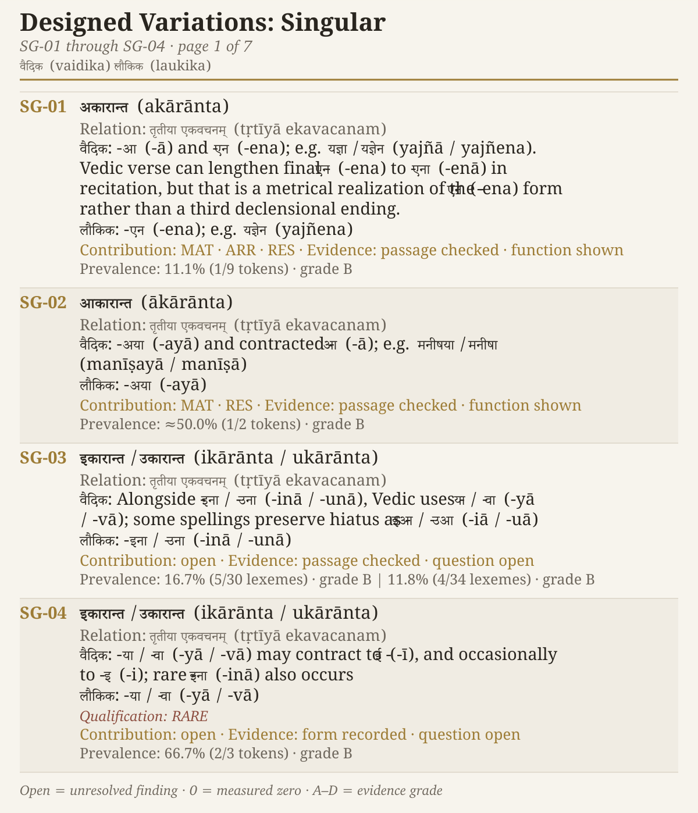
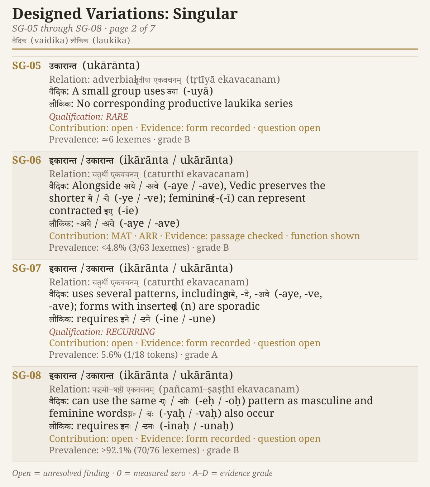
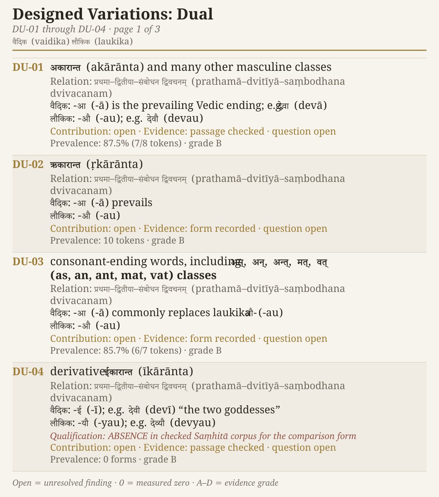
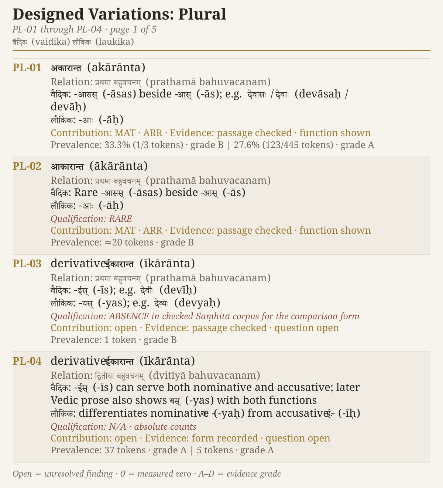
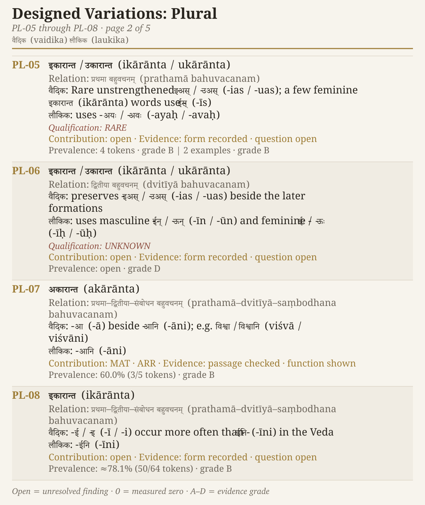
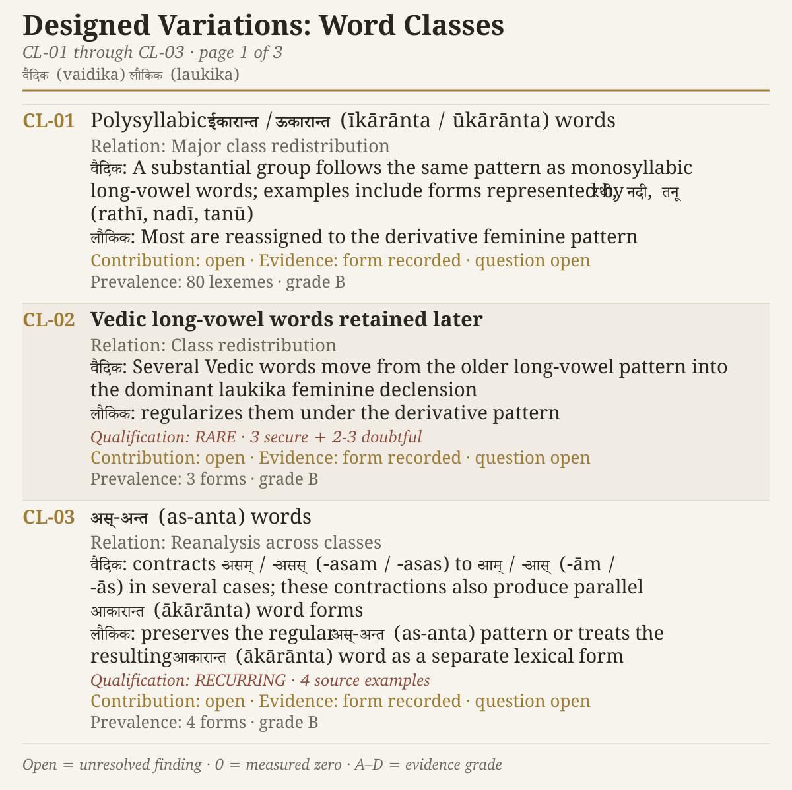
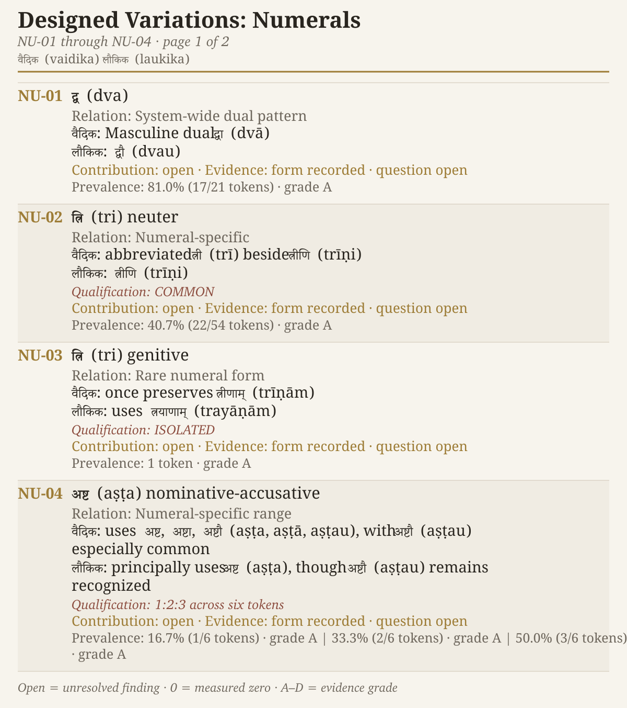
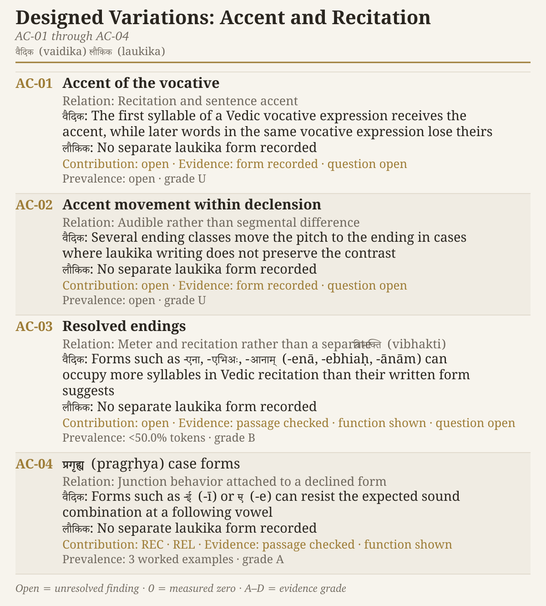

# Appendix Part 8 — Designed Variations Across the Two Domains

*The passages, forms, counts, and comparisons behind Chapter 16*

## 8.1 How to Read the Evidence

Chapter 16 explains why Sanskrit uses one architecture in two domains. The *vaidika* domain preserves received passages exactly, while the *laukika* domain allows speakers to create new expressions through the same language architecture. This appendix documents the differences between those domains.

The comparison begins with the form familiar to a student of *laukika* Sanskrit and then identifies the additional sound, ending, placement, pitch, or verbal form preserved in a Vedic passage. Chapter 16 defines the ten contributions used in this analysis. The next section assigns each contribution a short code for the figures and explains how the appendix records passages, local functions, prevalence, and open evidence.

As the book has repeatedly shown, the words *vaidika* and *laukika* identify domains of Sanskrit's use rather than periods in a botanical chronology. The Veda can preserve two alternate forms in adjacent verses, as **रुद्रैः (*rudraiḥ*)** and **रुद्रेभिः (*rudrebhiḥ*)** demonstrate below. Their coexistence requires an explanation based on function and setting rather than a story in which one form evolved into the other.

## 8.2 Evidence and PASS Method

Chapter 9 introduced the ***Principle of Architectural Selection and Scope (PASS)*** through the four tests for a sonomer. This appendix uses the same principle to examine the additional resources preserved in the Vedic domain. Each record follows four steps:

1. **Contribution:** What does the additional resource add to the passage?
2. **Load:** What duplication, collision, or variation accompanies it?
3. **Bounding support:** What contains that load — pitch, meter, fixed wording, inherited interpretation, a stated junction, or another part of the architecture?
4. **Scope:** Does the resource belong to reusable Sanskrit, operate only under a stated condition, belong to a stated Vedic scope, remain within a named Vedic lineage, or stay excluded from independent use?

The ten contributions defined in Chapter 16 supply the first step. The figures use the following short codes to keep that evidence visible:

| Code | Designed contribution |
|---|---|
| **SVR** | pitch architecture |
| **MAT** | syllable count, *mātrā*, or *laghu-guru* |
| **REC** | melodic or recitational function |
| **SON** | sonomeric selection and distinguishability |
| **RES** | sound pattern and resonance |
| **REL** | audible grammatical boundaries or recoverable relations |
| **SEM** | compact semantic distinctions |
| **ARR** | poetic or compositional arrangement |
| **FUN** | a function specific to a Veda, Vedic prose setting, or mode of use |
| **AUD** | error detection and overlapping audit checks |

A single form can receive more than one code. An extended ending may complete a metrical line, strengthen its resonance, make a grammatical boundary easier to hear, and give reciters another way to detect a change.

The contribution can be certain even when the architectural reason for the final scope remains an inference. For that reason, the appendix records the passage and its local function separately from the load, bounding support, and scope. It leaves any entry blank when the evidence has not yet established it.

The evidence column uses **P** when an exact passage has been checked and **FN** when the local function has been demonstrated. **OPEN** means that another part remains unresolved. A blank contribution cell means that the form has been documented but the reason for its selection in that passage has not yet been established.

The prevalence column uses four visual measures because the surviving evidence does not always support the same calculation:

1. A filled bar shows a percentage calculated from a known numerator and denominator.
2. A numbered dot shows an absolute count when no complete denominator is available.
3. An outlined bar shows an approximate value or a stated upper or lower bound.
4. A dashed open cell shows that no reliable numerical measure has yet been established. A measured zero uses a crossed box, so zero cannot be confused with missing evidence.

The letters **A–D** report the evidence grade, while the short unit labels distinguish tokens, lexemes, forms, passages, and examples. Where one grammatical category has several measurements, the figure shows the primary measure and marks the number of additional measurements retained in the underlying data.

## 8.3 Sounds, Accent, and Exact Recitation

### Sounds, Sonomers, and Domains

Chapter 16 introduces **ईळे (*īḷe*)** from the opening mantra of the Ṛgveda. The following analysis places its retroflex lateral **ळ [ɭ]** beside two other sounds that Sanskrit preserves under stated conditions without assigning them independent coordinates in the reusable sonomer grid.

Chapter 9 §9.10 explains the category behind this difference. A sound can occur in Sanskrit without becoming an independent sonomer. A sonomer must do more than record a sound that the mouth can produce: it must remain distinguishable from its neighbors, combine with the vowels to create reusable molecules, and help generate new words without introducing confusion into the grid.

Chapter 9 uses the [ɸ]-like sound to explain the same principle. In Ṛgveda 1.1.2, the ***विसर्ग (*visarga*)*** before **प** in **अग्निः पूर्वेभिर् (*agniḥ pūrvebhir*)** becomes the ***उपध्मानीय (*upadhmānīya*)***. The recited passage preserves [ɸ] at that specified junction, but the generative grid does not place another coordinate beside **फ** merely because the sound can be pronounced.

The corresponding junction before **क** or **ख** produces the ***जिह्वामूलीय (*jihvāmūlīya*)*** near the back of the mouth. The Taittirīya Saṃhitā preserves one such junction in **नमः कपर्दिने च (*namaḥ kapardine ca*)**. The final breath of **नमः** changes before the following **क**, just as it changes at the lips before **प**. Sanskrit has analyzed both sounds and preserves them wherever the junction calls for them. Neither sound needs an independent coordinate in the sonomer grid because each is generated by a stated relation between *visarga* and the sound that follows. These are Sanskrit-wide condition-generated junction operations rather than sounds confined to one Vedic lineage.[NOTE: vedic-jihvamuliya-upadhmaniya-pair]

The Ṛgvedic **ळ** applies the same principle within a narrower scope. The opening passage fixes the word, the position of the sound, and its relation to the sounds around it, while the Ṛgveda-Prātiśākhya specifies the recitational operation for that corpus. Reciters can therefore preserve **ळ** selectively without confusion. Promoting **ळ** to an independent sonomer in the *laukika* domain would make it reusable across newly generated words. It would also place another retroflex coordinate beside **ड**, even though the two sounds do not provide enough separation in this architecture to justify crowding the grid. The Ṛgvedic lineage preserves **ळ** wherever its received passages require it without making the sound available for unrestricted *laukika* generation.

The treatment of **ळ** demonstrates sonomeric selection and distinguishability. Exact transmission preserves **ळ** in the words that require it, while the generative grid avoids a coordinate whose unrestricted use would reduce the separation among neighboring sounds. The fixed sound also participates in error detection because a reciter trained in the passage will hear a substitution.

The complete selection-and-scope profiles separate sounds that are physically possible from sounds that need independent coordinates:

| Candidate or operation | Contribution | Load | Bounding support | Scope |
|---|---|---|---|---|
| **[ɰ]** as an independent sonomer | no recurring Sanskrit operation has been established | would add a coordinate without completing the *ik–yaṇ* relation | none established for independent reuse | **Excluded** |
| ***जिह्वामूलीय (*jihvāmūlīya*)*** | preserves the velar form of *visarga* before **क/ख** | adds a contextual sound outside the independent grid | the preceding *visarga* and following **क/ख** generate it | **Restricted** |
| **[ɸ]** as an independent sonomer | no independent recurring contrast has been established | would crowd the labial breath range beside **फ** | none established for independent reuse | **Excluded** |
| ***उपध्मानीय (*upadhmānīya*)*** | preserves the labial form of *visarga* before **प/फ** | adds a contextual sound outside the independent grid | the preceding *visarga* and following **प/फ** generate it | **Restricted** |
| Ṛgvedic **ळ [ɭ]** | preserves the exact sound of received Ṛgvedic words | unrestricted reuse would reduce separation beside **ड** | fixed passage, position, and Ṛgvedic recitational specification | **Lineage-Bounded** |

### Svara, Chandas, and Exact Recitation

Chapter 16 explains how *svara* and *chandas* contribute to grammar, memory, and error detection. The technical record also includes specified *vivṛtti*, or hiatus, and ***प्लुत (*pluta*)*** duration. Ṛgveda 10.129.5 preserves two *pluta* vowels:

> अधः स्विद् आसी३द् उपरि स्विद् आसी३त् ।
>
> *adhaḥ svid āsī3d upari svid āsī3t |*
>
> Was it below? Was it above?

The numeral **३** directs the reciter to extend the vowel to three ***मात्राः (*mātrāḥ*)***. The duration belongs to the act of weighing two alternatives: the voice audibly keeps each possibility open. Sanskrit also uses *pluta* under stated *laukika* conditions, including calling to someone at a distance and deliberating between alternatives. The difference lies in permission. A speaker applies the operation when the stated circumstance arises, while the Ṛgvedic lineage always preserves these two *pluta* vowels at these exact positions in the passage.[NOTE: vedic-pluta-rv-10-129-5]

These features change what a student must learn for exact recitation; they do not replace the shared grammar through which the sentence is understood. The opening mantra has no additional ***सुबन्तरूप (*subanta-rūpa*, nominal form)*** or ***तिङन्तरूप (*tiṅanta-rūpa*, finite verbal form)*** that a *laukika* student must learn.

Students learn these features through a ***शाखा (*śākhā*)***. Its teachers, reciters, *chandas*, *svara*, fixed sequence, and ***पाठ (*pāṭha*)*** methods create several independent checks on the received form.

The assigned *svara* and *chandas* satisfy four criteria directly: syllable count and weight, pitch architecture, recitational function, and error detection. *Svara* also contributes to interpretation. Together, pitch and meter make the received form easier to remember, preserve more of its meaning in sound, and give the recitational community more than one way to detect a change.

### Sentence Position, Svara (Accent), and a Tiṅ-pratyaya (Personal Ending)

Ṛgveda 1.1.7 allows the reader to see sentence-level ***स्वर (*svara*, accent)*** and an additional ***तिङ्-प्रत्यय (*tiṅ-pratyaya*, personal ending)*** in the same mantra:

> उप॑ त्वाग्ने दि॒वेदि॑वे॒ दोषा॑वस्तर्धि॒या व॒यम् ।
> नमो॒ भर॑न्त॒ एम॑सि ॥
>
> *upa tvāgne dive-dive doṣāvastar dhiyā vayam |*
> *namo bharanta emasi ||*
>
> We approach you, Agni, day by day, bearing reverence through thought.

The ***सम्बोधन (*sambodhana*, vocative)*** **अग्ने (*agne*)** occurs after **उप त्वा (*upa tvā*)**, so it does not receive the accent that it would receive at the beginning of a sentence or *pāda*. Compare the opening of Ṛgveda 3.25.1, where **अग्ने॑ (*ágne*)** begins the passage and receives the accent. The word and its grammatical role remain the same; its position inside the sentence changes the *svara*. The reciter must therefore preserve more than the dictionary form of the word.[NOTE: vedic-vocative-sentence-accent]

The last *pāda* contains another Vedic form:

> नमो भरन्त एमसि ।
>
> *namo bharanta emasi |*
>
> Bearing reverence, we approach.

The visible **एमसि (*emasi*)** resolves into **आ + इमसि (*ā + imasi*)**. Its first-person plural ending is **-मसि (*-masi*)**, which Pāṇini later documented in Aṣṭādhyāyī 7.1.46. The corresponding *laukika* form is **एमः (*emaḥ*)**, with the ending **-मस् (*-mas*)**.[NOTE: vedic-personal-ending-imasi]

The additional **इ (*i*)** gives the Vedic form three syllables: **इ-म-सि (*i-ma-si*)**. The complete *pāda* — **नमो भरन्त एमसि (*namo bharanta emasi*)** — has the eight syllables required by Gāyatrī. Replacing **एमसि** with **एमः** would remove one syllable. In this passage, the additional personal ending therefore contributes directly to *chandas*. It also creates another audible checkpoint: a reciter who shortens the ending disturbs both the verbal form and the meter.

## 8.4 Positional Freedom and Extended Forms

### Floating Upasargas

Chapter 16 uses Ṛgveda 1.16.1 to show the separated **आ ... वहन्तु (*ā ... vahantu*)** relation in verse. The Aitareya Brāhmaṇa supplies the technical control: Vedic prose can preserve the same positional freedom even when meter plays no role.

> आ द्विषतो वसु दत्ते, निर् एनम् एभ्यः सर्वेभ्यो लोकेभ्यो नुदते, य एवं वेद ।
>
> *ā dviṣato vasu datte, nir enam ebhyaḥ sarvebhyo lokebhyo nudate, ya evaṃ veda.*
>
> Whoever knows in this way takes wealth from the hostile one and drives him out from all these worlds.

**आ (*ā*)** belongs with **दत्ते (*datte*)**, although **द्विषतो वसु (*dviṣato vasu*)** comes between them. **निर् (*nir*)** likewise belongs with **नुदते (*nudate*)** across several intervening words. Meter does not govern this prose passage. The passage itself never changes, so **आ** always occurs in the same position relative to **दत्ते**, and **निर्** always remains bound in meaning to **नुदते**.

The prose passage establishes **REL**, recoverable grammatical relations under invariant sequence. It also establishes that meter cannot be the only reason Vedic Sanskrit permits a separated *upasarga*.[NOTE: aitareya-brahmana-separated-upasargas]

Its selection-and-scope profile is therefore specific. Separated *upasargas* contribute positional and compositional freedom. The load is a possible loss of the bond between an operator and its atom. A Vedic passage contains that load through fixed wording, fixed sequence, and inherited interpretation, which places this freedom in Vedic scope. Newly composed laukika prose does not possess the same boundary and therefore uses the tighter bond.

### Extended Vibhakti (Case) Forms

The *vaidika* domain offers another engineered variation. For the ***तृतीया बहुवचनम् (*tṛtīyā bahuvacanam*)*** of an ***अकारान्त (*akārānta*)*** word — a word ending in **अ** — the Vedic corpus preserves both **-aiḥ** and the extended **-ebhiḥ**. Thus ***देव (*deva*)*** can appear as ***देवैः (*devaiḥ*)*** or ***देवेभिः (*devebhiḥ*)***, and ***रुद्र (*rudra*)*** as ***रुद्रैः (*rudraiḥ*)*** or ***रुद्रेभिः (*rudrebhiḥ*)***.

The labels *vaidika form* and *laukika form* describe how Sanskrit deploys these forms. They do not arrange them in chronological order. In many cases, including this one, the Veda itself preserves both. The *laukika form* is the form that Sanskrit uses consistently when people create new compositions in the read-write domain.

Two adjacent verses in Ṛgveda 3.32 make the selection visible.[NOTE: vedic-akaranta-instrumental-plural-range]

> सजोषा रुद्रैस्तृपदा वृषस्व ।
> पिबा रुद्रेभिः सगणः सुशिप्र ॥
>
> *sajoṣā rudrais tṛpad ā vṛṣasva |*
> *pibā rudrebhiḥ sagaṇaḥ suśipra ||*
>
> In harmony with the Rudras, drink your fill and grow strong. Drink with the Rudras and your company, O fair-cheeked one.

The first *pāda* uses two-syllable **रुद्रैः (*rudraiḥ*)**. The next verse uses three-syllable **रुद्रेभिः (*rudrebhiḥ*)**. Both lines have the eleven syllables of Triṣṭubh. Replacing **रुद्रैः** with **रुद्रेभिः** in the first would produce twelve syllables; replacing **रुद्रेभिः** with **रुद्रैः** in the second would leave ten. The Veda preserves both endings and selects the form that completes each line without changing the *vibhakti*, number, or grammatical relation.

The pair therefore receives **MAT** for syllable count and **ARR** for poetic arrangement. **REL** remains open: the fuller ending may make the grammatical boundary easier to hear, but the present evidence has not demonstrated that contribution.

The selection-and-scope profile explains why the Vedic domain can retain both endings without giving the read-write domain two interchangeable forms for every akārānta word. Their demonstrated contribution is metrical and compositional choice. Their load is duplication: two endings express the same *vibhakti*, number, and grammatical relation. Fixed passages and meter contain that load in the Veda. Laukika Sanskrit uses **-aiḥ** as the reusable form for new composition.

### The Complete Range of Vibhakti-rūpāṇi (Declensional Forms)

Vedic ***विभक्तिरूपाणि (*vibhakti-rūpāṇi*, declensional forms)*** extend far beyond the **-ebhiḥ / -aiḥ** comparison. The figures below organize 83 categories across ***एकवचनम् (*ekavacanam*, singular), द्विवचनम् (*dvivacanam*, dual), बहुवचनम् (*bahuvacanam*, plural),*** word classes, numerals, accent, and recitational realization. Rare, doubtful, isolated, and still-unexplained forms remain visible alongside the better-understood patterns.

The **DV** column uses the contribution codes defined in §8.2. Blank and open cells preserve unresolved evidence rather than presenting it as zero.

{#fig:app8-designed-variations-ekavacanam-01 width=100%}

{#fig:app8-designed-variations-ekavacanam-02 width=100%}

{#fig:app8-designed-variations-dvivacanam width=100%}

{#fig:app8-designed-variations-bahuvacanam-01 width=100%}

{#fig:app8-designed-variations-bahuvacanam-02 width=100%}

{#fig:app8-designed-variations-word-classes width=100%}

{#fig:app8-designed-variations-numerals width=100%}

{#fig:app8-designed-variations-accent-recitation width=100%}

```{=latex}
\clearpage
```

The figures distinguish two outcomes. Some passages reveal what a variation contributes: a form adds or removes a syllable, preserves another grammatical relation, governs a junction, or supports a particular arrangement. Other passages establish that the Vedic form exists while leaving its local contribution open.

## 8.5 The *Leṭ–Loṭ* Collision Record

Chapter 16 introduces the collision through **ब्रवाणि (*bravāṇi*)** in Ṛgveda 6.16.16 and contrasts it with the non-colliding **तारिषत् (*tāriṣat*)** in Ṛgveda 10.186.1.[NOTE: vedic-let-bravani-tarisat] The technical comparison shows that the exact visible collisions cluster in the first person.

In the ***परस्मैपदम् (*parasmaipadam*)***, **भवानि, भवाव, भवाम (*bhavāni, bhavāva, bhavāma*)** can belong to either *leṭ* or *loṭ*. The corresponding first-person forms in the ***आत्मनेपदम् (*ātmanepadam*)*** collide in the same way. These are identical forms rather than approximate similarities.

Vedic *svara* adds grammatical information but does not assign every *leṭ* form a unique pitch identity. The complete passage must therefore supply the remaining distinction through its words, syntax, sequence, position, and inherited interpretation.

The formal collision occupies fewer coordinates than the broader functional overlap. *Leṭ* can express desire, intention, urging, or an action approaching realization, while *laukika* Sanskrit distributes much of that range across *loṭ, liṅ, āśīrliṅ,* and *lṛṭ*. The Source and Reference Companion compares all eighteen person-number-*pada* coordinates and records both the exact collisions and the wider semantic overlap.

Pāṇini documented the two paradigms after the Vedas had already preserved *leṭ*. Comparing those documented paradigms reveals the collision; the *Aṣṭādhyāyī* does not state the two-domain design rationale.

The same evidence places *leṭ* within Vedic scope:

| Contribution | Load | Bounding support | Scope |
|---|---|---|---|
| *Leṭ* gathers desire, intention, urging, and action approaching realization into one verbal resource. | Some forms collide visibly with *loṭ*, and much of the semantic range overlaps with *loṭ, liṅ, āśīrliṅ,* and *lṛṭ*. | Vedic pitch adds grammatical information; fixed wording, syntax, sequence, position, and inherited interpretation complete the boundary. | **Vaidika** |

## 8.6 Other Vedic Verbal Forms

### An Unaugmented लुङ् (*luṅ*) Form

Ṛgveda 1.32.1 preserves another verbal difference:

> इन्द्रस्य नु वीर्याणि प्र वोचं यानि चकार प्रथमाणि वज्री ।
>
> *indrasya nu vīryāṇi pra vocaṃ yāni cakāra prathamāni vajrī |*
>
> I now proclaim Indra's heroic deeds, the first that the wielder of the thunderbolt performed.

**The vaidika difference is वोचम् (*vocam*)**, which occurs without the ***अट्-आगम (*aṭ-āgama*, augment)*** **अ (*a*)**. The corresponding *laukika* ***लुङ् (*luṅ*, aorist)*** is **अवोचम् (*avocam*)**, *I said* or *I proclaimed*. Modern grammars call the unaugmented Vedic *luṅ* form the *injunctive*.[NOTE: vedic-injunctive-vocam]

The form must be read with the words around it. **नु (*nu*)** brings the declaration into the present moment, and **प्र वोचम् (*pra vocam*)** performs the act as the mantra begins: *I now proclaim*. The accent falls on **प्र (*pra*)**, while **वोचम्** remains unaccented. The absence of the *aṭ-āgama*, or augment, does more than shorten the line. It allows the *luṅ* form to receive its time and force from the immediate passage instead of marking an ordinary past statement. The same form also removes one syllable that **अवोचम्** would add. In this passage, **वोचम्** therefore contributes both a compact semantic distinction and the required syllable count.

### A Vedic क्त्वा (*ktvā*) Form — Gerund or Conjunctive Participle

Ṛgveda 3.40.7 uses **पीत्वी (*pītvī*)** where *laukika* Sanskrit uses **पीत्वा (*pītvā*)**:

> अ॒भि द्यु॒म्नानि॑ व॒निन॒ इन्द्रं॑ सचन्ते॒ अक्षि॑ता ।
> पी॒त्वी सोम॑स्य वावृधे ॥
>
> *abhi dyumnāni vanina indraṃ sacante akṣitā |*
> *pītvī somasya vāvṛdhe ||*
>
> Unfailing splendors gather around Indra; having drunk Soma, he has grown in strength.

**पीत्वी सोमस्य वावृधे (*pītvī somasya vāvṛdhe*)** says, *having drunk Soma, he grew*. **पीत्वी** is a Vedic form of the ***क्त्वा-प्रत्यय (*ktvā-pratyaya*)***, commonly called a gerund or conjunctive participle in English. Pāṇini later documented this Vedic **-त्वी (*-tvī*)** form under Aṣṭādhyāyī 7.1.49. A *laukika* composition would use **पीत्वा (*pītvā*)** for the same sequence of actions.[NOTE: vedic-gerund-pitvi]

Both forms occupy two syllables, so the change from **-त्वा** to **-त्वी** does not help the meter by adding or removing a syllable. The mantra confirms that the Vedic domain uses **पीत्वी**, but this passage does not tell us why **-त्वी** was selected instead of **-त्वा**. The figure therefore leaves the reason blank.

### Two Vedic तुमर्थक (*tumarthaka*) Forms — Infinitives

Ṛgveda 1.24.8 uses two ***तुमर्थक रूपाणि (*tumarthaka rūpāṇi*, infinitive forms)*** where a *laukika* student would expect **-तुम् (*-tum*)**:

> उ॒रुं हि राजा॒ वरु॑णश्च॒कार॒ सूर्या॑य॒ पन्था॒मन्वे॑त॒वा उ॑ ।
> अ॒पदे॒ पादा॒ प्रति॑धातवेऽकरु॒ताप॑व॒क्ता हृ॑दया॒विध॑श्चित् ॥
>
> *uruṃ hi rājā varuṇaś cakāra sūryāya panthām anvetavā u |*
> *apade pādā pratidhātave 'kar utāpavaktā hṛdayāvidhaś cit ||*
>
> King Varuṇa made a broad path for the Sun to follow. In the trackless space he made places for its feet to be set, and he turns away even what pierces the heart.

The *padapāṭha* separates the first *tumarthaka* form as **अनु-एतवै (*anu-etavai*)**, *to follow*. The mantra also uses **प्रतिधातवे (*pratidhātave*)**, *to set down*. A *laukika* composition would ordinarily use **अन्वेतुम् (*anvetum*)** and **प्रतिधातुम् (*pratidhātum*)**. Pāṇini later documented **-तवै (*-tavai*)**, **-तवे (*-tave*)**, and several other Vedic *tumarthaka* endings in Aṣṭādhyāyī 3.4.9.[NOTE: vedic-infinitives-rv-1-24-8]

Both *pādas* are transmitted in Triṣṭubh. The Vedic *tumarthaka* forms are longer than the corresponding **-तुम्** formations, so replacing them with **अन्वेतुम्** and **प्रतिधातुम्** would shorten the two *pādas*. In this mantra, the additional endings contribute to syllable count and poetic arrangement while preserving the same purpose relation.

### A Vedic क्वसु-कृदन्त (*kvasu-kṛdanta*) — Perfect Participle

Ṛgveda 3.25.1 addresses Agni as **चिकित्वः (*cikitvaḥ*)**, *O knowing one*. It is a ***क्वसु-कृदन्त (*kvasu-kṛdanta*, perfect participle)***. The corresponding *laukika* vocative, or *sambodhana*, is **चिकित्वन् (*cikitvan*)**. The Vedic form is well established in the passage, and its direct-address function is clear, but the local reason for selecting **-वः (*-vaḥ*)** instead of **-वन् (*-van*)** has not yet been demonstrated.[NOTE: vedic-participle-cikitvah]

The passage confirms the Vedic form and its function as a direct address. It does not tell us why the address ends in **-वः** rather than **-वन्**, so the figure leaves the reason blank.

## 8.7 The Differences at a Glance

### The Small Laukika-Only Extension

The Vedic extension contains enough additional sounds, endings, placements, pitch, and verbal forms to require a detailed catalogue. Four representative contrasts demonstrate the much smaller *laukika* extension. Most laukika generation uses the shared Sanskrit architecture. The rows below record forms that the grammatical tradition assigns specifically to *bhāṣā* alongside the corresponding forms in Vedic scope:

| Vedic scope | *Bhāṣā* scope | Grammatical record |
|---|---|---|
| **निषत्त (*niṣatta*)** and **सूर्त (*sūrta*)** | **निषण्ण (*niṣaṇṇa*)** and **सृता (*sṛtā*)** | *Aṣṭādhyāyī* 8.2.61 and the *Kāśikāvṛtti* contrast |
| **ससूव (*sasūva*)** | **सुषुवे (*suṣuve*)** | *Aṣṭādhyāyī* 7.4.74 and the *Kāśikāvṛtti* contrast |
| **साढ्वा (*sāḍhvā*)** | **सोढ्वा (*soḍhvā*)** | *Aṣṭādhyāyī* 6.3.113 and the *Kāśikāvṛtti* contrast |
| a wider Vedic use of the ***क्वसु (*kvasu*)*** formation | **उपसेदिवान् (*upasedivān*)**, from a restricted *bhāṣā* use of that formation | *Aṣṭādhyāyī* 3.2.107–108 |

The table records how the grammatical continuum assigns these forms to the two domains. Its *bhāṣā* column is small because the laukika domain receives most of its resources from the shared architecture and needs only a limited set of forms of its own.[NOTE: laukika-only-scope-examples]

### The Complete Comparison

The figures above give the complete inventory of *vibhakti-rūpāṇi*, or declensional forms. The following table adds sound, verbal forms, *upasarga* placement, composition, and recitation. Each row begins with the form or operation familiar to a *laukika* student and identifies the additional resource preserved in the *vaidika* domain.[NOTE: designed-variations-figure-sources]

| Area | Laukika baseline | Vaidika difference |
|---|---|---|
| **Syllable pitch — स्वर (*svara*)** | ordinary composition operates without the Vedic pitch layer | exact recitation preserves **उदात्त (*udātta*), अनुदात्त (*anudātta*),** and **स्वरित (*svarita*)** on the assigned syllables |
| **Duration — मात्रा (*mātrā*)** | ordinary words use reusable short-long vowel relations, with *pluta* under stated speech conditions | a passage preserves ***प्लुत (*pluta*)*** or another specified duration wherever required |
| **Lineage-preserved sounds outside the sonomer grid** | the generative grid assigns coordinates only to sounds that remain distinguishable and function as reusable sonomers | the Ṛgvedic lineage selectively preserves **ळ / ळ्ह** under its received phonetic specification |
| **Restricted junction sounds** | Sanskrit generates ***उपध्मानीय (*upadhmānīya*)*** and ***जिह्वामूलीय (*jihvāmūlīya*)*** from *visarga* under stated conditions | a received passage preserves the operation at its fixed junction |
| **Sound without direct lexical meaning** | poets use repetition, onomatopoeia, ***अनुप्रास (*anuprāsa*),*** and ***यमक (*yamaka*)*** for sound and poetic effect | Sāmavedic singing uses specified ***स्तोभ (*stobha*)*** syllables for melodic, acoustic, recitational, and contemplative purposes |
| **सन्धि and विवृत्ति (*sandhi* and *vivṛtti*, junction and hiatus)** | *sandhi* governs newly created sequences | a received passage can preserve *vivṛtti*, non-elision, or another operation assigned to Vedic scope |
| **विभक्तिरूपाणि (*vibhakti-rūpāṇi*, declensional forms)** | speakers principally use *vibhakti* paradigms that apply consistently in new composition | passages preserve additional instrumental, locative, vocative, dual, and plural forms |
| **सर्वनामरूपाणि (*sarvanāma-rūpāṇi*, pronoun forms)** | ordinary composition uses the *laukika sarvanāma* paradigms | passages preserve additional case distinctions and alternate forms |
| **अट्-आगम (*aṭ-āgama*, augment)** | the ordinary *luṅ*, or aorist, uses its expected augment | passages preserve *luṅ* forms without the augment in uses commonly called injunctive |
| **लकाराः (*lakārāḥ*, tense and mood categories)** | composition uses the *lakāra* system assigned to *laukika* scope | Vedic scope includes ***लेट् (*leṭ*)*** and additional modal forms |
| **तिङ्-प्रत्ययाः (*tiṅ-pratyayāḥ*, personal endings)** | laukika paradigms principally use **-mas, -tha, -ta,** and their counterparts | passages preserve endings such as **-masi, -thana, -tana,** and imperative **-tāt** |
| **कृदन्त and क्त्वा forms (*kṛdanta* participles and *ktvā* gerunds)** | speakers normally use **-tvā** and **-ya**, together with the *kṛdanta* system available for new words | passages preserve additional participles and forms such as **-tvī** and rare **-tvāya** |
| **तुमर्थक रूपाणि (*tumarthaka rūpāṇi*, infinitive forms)** | speakers normally use the **-tum** formation in new expressions | passages preserve formations including **-tum, -tave, -tavai, -dhyai,** and **-tos** |
| **उपसर्ग placement (*upasarga*, preverb)** | an *upasarga* ordinarily forms a head-bond directly with its atom | an *upasarga* may bond directly, follow, or remain separated from its atom |
| **Grammatical pitch — स्वर (*svara*)** | new expression must make its grammatical relations clear without Vedic pitch | the position and pitch of particles, vocatives, finite verbs, subordinate clauses, and separated operators help the listener interpret the sentence |
| **समास and प्रत्यय formation (*samāsa* compounds and *pratyaya* derivation)** | writers repeatedly apply compound and derivational operations to new uses | each passage preserves the compounds and Vedic-scope affixes selected for it |
| **Composition and style** | authors create prose, poetry, analysis, drama, story, and individual styles | the Vedas, Brāhmaṇas, Āraṇyakas, and Upaniṣads preserve several distinct styles |

## 8.8 Documented Stewardship Across Both Domains

Chapter 16 explains that the two domains divide responsibilities rather than populations. The historical record also shows scholars and regional lineages carrying both responsibilities.

The fourteenth-century Vijayanagara household associated with Sāyaṇa and Mādhava combined both responsibilities. Its scholars produced extensive explanations of the Vedas while also contributing to *vyākaraṇam*, philosophy, medicine, poetics, music, governance, and other laukika disciplines. Sāyaṇa and Mādhava deserve praise for this range: they preserved and explained the Vedic reference while applying Sanskrit throughout the laukika world.

Kerala's records show the same arrangement at the level of lineages. Named Nambudiri families preserved Ṛgvedic and Jaiminīya Sāmavedic recitation through demanding oral methods. The same regional Sanskrit society produced commentaries on Brāhmaṇas and *śikṣā* texts, a *Nirukta* analysis, Malayalam explanations of the Ṛgveda, and independent works on Vedic subjects. These records do not establish that every household performed every task. They show that exact Vedic preservation and wide-ranging Sanskrit explanation belonged to one living society rather than to two populations separated by language or chronology.[NOTE: vaidika-laukika-household-responsibility-cases]
