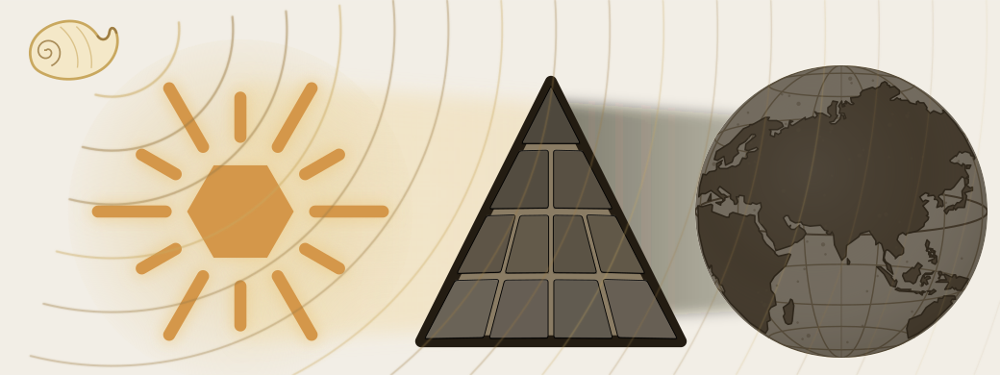

# Overture — The Śaṅkha

*The war is already underway.*

---

::: epigraph

> यो अग्रतो रोचनानां समुद्रादधि जज्ञिषे ।\
> शङ्खेन हत्वा रक्षांस्यत्त्रिणो वि षहामहे ॥
>
> *yó agrató rocanā́nāṃ samudrā́d ádhi jajñiṣé |*\
> *śaṅkhéna hatvā́ rákṣāṃsy attríṇo ví ṣahāmahe ||*
>
> You who were born at the head of the shining ones, up out of the sea — with the *śaṅkha*, having slain the *rākṣasas*, we overcome the devourers.
>
> `\hfill`{=latex}*— Atharvaveda 4.10.2*

:::

\bigskip

The Śaṅkha sounds inside a war already underway. Its note is not ceremony. It is summons: caretaking has become action.

The eclipse remains intact at this threshold. The conch does not break the plates; it sounds across the dark field and calls the caretakers into motion.

{#fig:eclipse-overture-shankha width=100%}

Sanskrit is the Sun. The asuric pyramid has drawn its shadow across the field. What should have been obvious went dark: a language held by seekers, caretakers, reciters, grammarians, mothers, teachers, students, and lineages across the depth of time.

Before the light returns, the parties must be visible. On one side stand the seekers and caretakers: the civilization trained to listen, correct, remember, and keep looking. On the other side stands the asuric pyramid, the finite order with the apex at its head. He wants the field to answer upward.

The Śaṅkha sounds while the field is still dark. Then the work narrows. The caretakers have been seen. The finite order has been seen. The next threshold is the shadow itself — how it was cast, and how it lifts.
