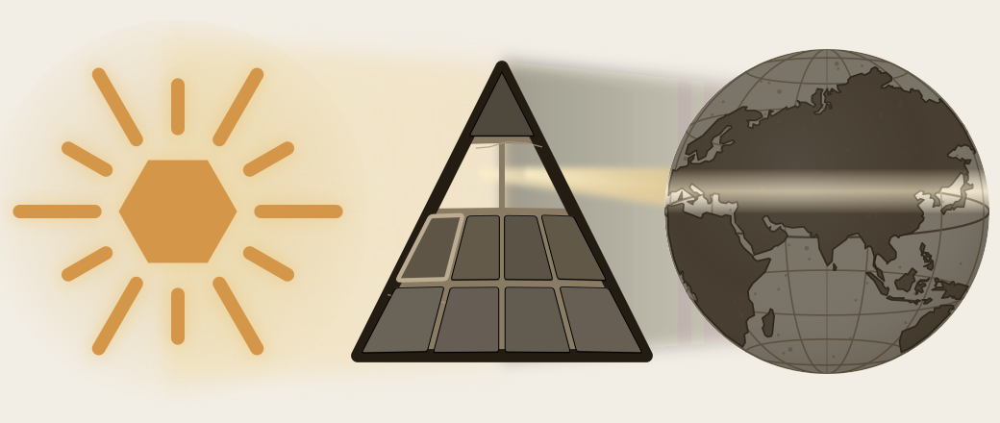

# Part III — The Sun's Sound-Body

*Sonomeric, not alphabetic.*

---

From the Sun's own account, the light descends into the body. Before the *dhātuḥ* can be measured as an atom, the sound-particles from which that atom is built have to become visible.

We have moved past two distortions: the plant-metaphor that forced *dhātuḥ* into a botanical category, and the codification-story that made Sanskrit depend on later stabilization. The next obstruction is alphabetic reduction: the pyramid flattening *varṇa* into letter. Descended stays cracked — the deepest descent-plate falls only when Rāhu is dispelled in Part VI.

{#fig:eclipse-part03-sound-body width=100%}

The movement is instrument, field, grid. First comes the body: breath, vocal cords, tongue, palate, teeth, lips, and the oral and nasal cavities create the possible field of sound. Next come the surrounding languages, which show which distinctions recur across the subcontinent. Sanskrit's engineering then selects and regularizes sounds from that field and assigns each sonomer a stable coordinate in the *varṇamālā*.

The result is a sonomeric inventory, the Sun's sound-body — the first visible grid of the linguistic fractal, ready to become atomic architecture.
