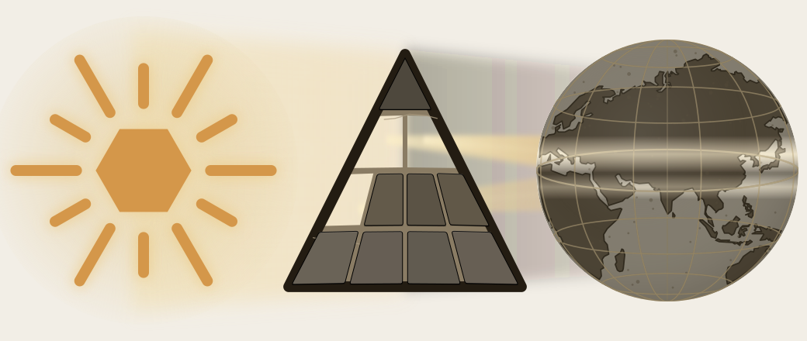

# Part IV — The Sun's Atoms

*Particle, atom, molecule, assembly.*

---

<!-- AISWEEP-OLD
The construction begins here. This is where the fractal claim becomes procedural. The earlier parts cleared the shadow's first plates, placed Sanskrit's self-description on the page, and made the sound-field visible. Now the architecture is built in sequence.
AISWEEP-END -->
The earlier parts cleared the shadow's first plates, placed Sanskrit's self-description on the page, and made the sound-field visible. Here the fractal claim becomes procedural: the architecture is built in sequence.

No new obstruction is removed in this movement. The already-opened light now shows what the earlier distortions had hidden: the atomic architecture beneath sound.

{#fig:eclipse-part04-sun-atoms width=100%}

The sequence is particle, atom, molecule, assembly. Sonomers enter measured scaffolds and become *dhātuḥ* atoms. Those atoms activate into *kriyāpada* molecules. Verbal and nominal molecules then enter larger assemblies until Sanskrit can build the *vākya*.

The word *atomic* therefore encodes a procedural claim: Sanskrit builds upward from measured particles into stable semantic atoms, then into molecules, then into assemblies, without losing visibility of the particle-level structure underneath. This is the linguistic fractal in construction form.
