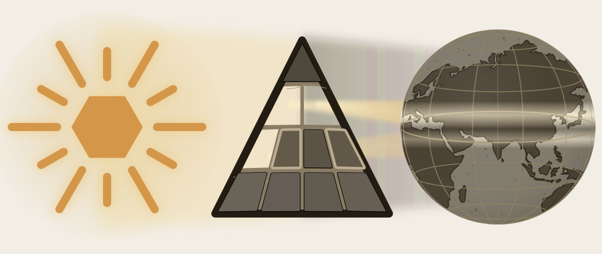

# Part V — The Sun Does Not Decay

*Calibration from within.*

---

The fractal architecture has now been built. Whether it survives is the next question.

The visible architecture now has to be shown as preserved architecture. Two reductions are targeted here: the claim that Indic writing must be filed under an external typological label, and the claim that the *Vedas* are mainly early literature, old texts useful for dating "Vedic Sanskrit."

{#fig:eclipse-part05-no-decay width=100%}

Calibration from within preserves Sanskrit without authority from above. Chapter 13 examines preservation as an engineering problem. Chapter 14 develops the calibration matrix: sound, meter, recitation, grammar, lineage, and disciplined use holding the standard in place. Chapter 15 follows that matrix into hearing, where Sanskrit's architecture remains audible and correctable across generations.

Anti-entropy becomes practice across the fractal. The Sun does not decay.
