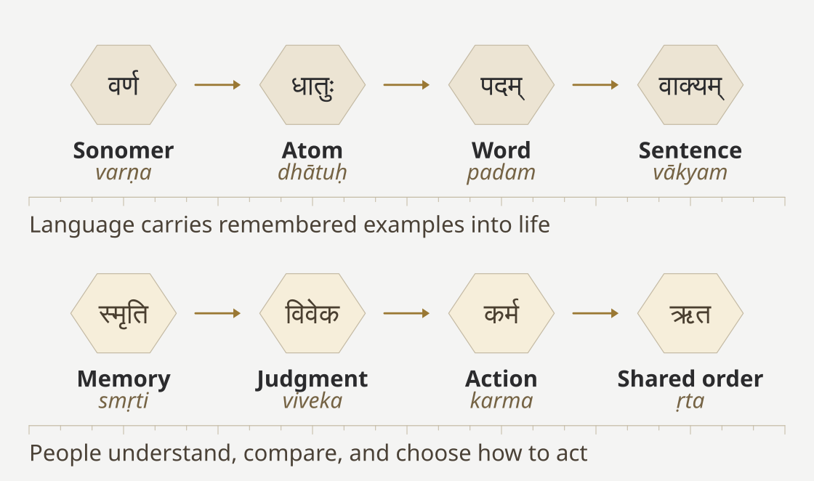
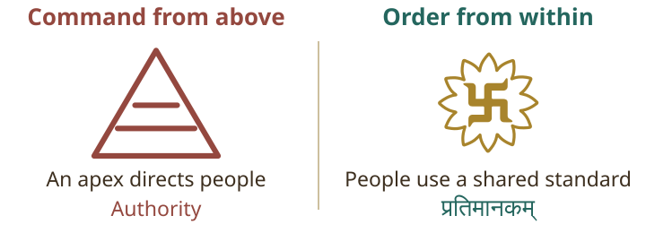
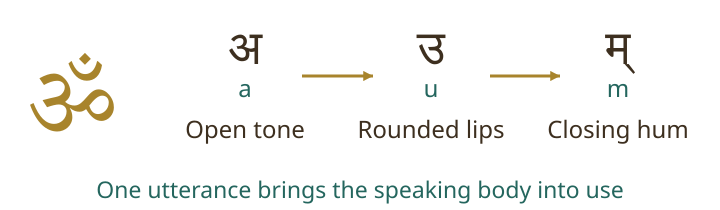
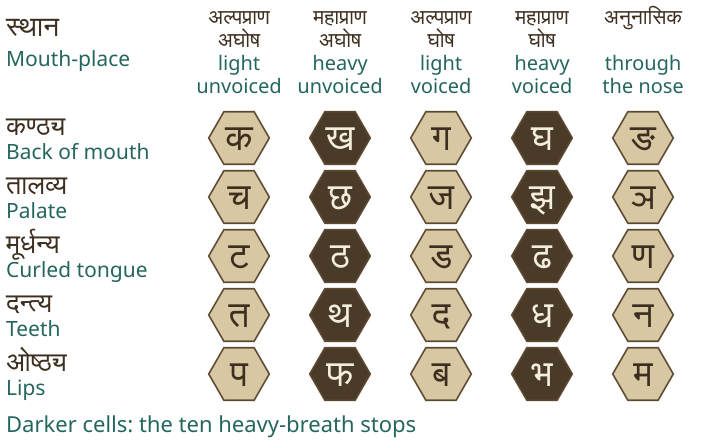
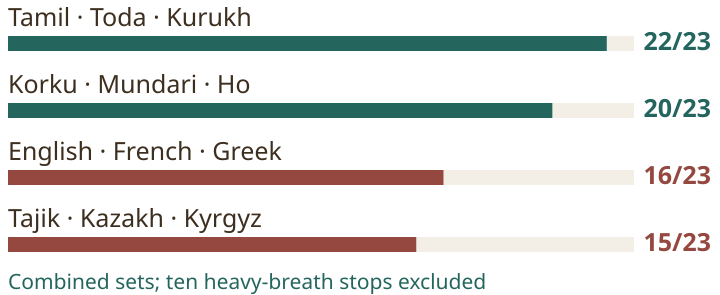
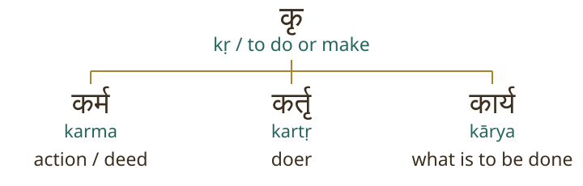
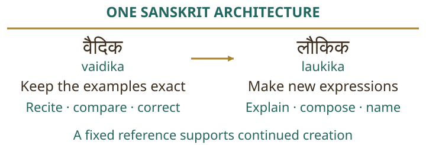
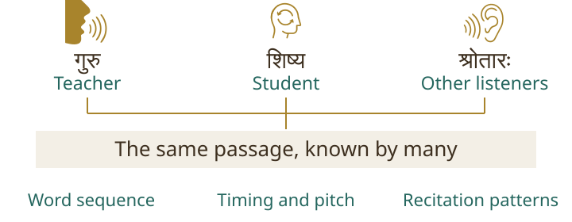
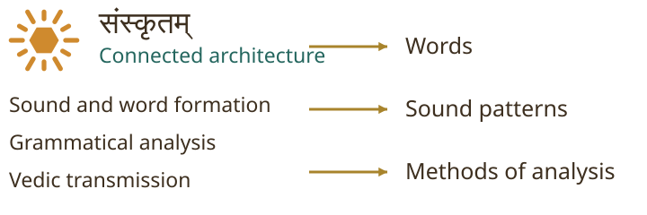

<!-- page: title -->
# Atomic Sanskrit

A Reader's Guide

From the order within sound to the order within a civilization

<!-- page: why -->
# Why I Wrote This Book

After writing *Tatya Tope's Operation Red Lotus*, I kept returning to what our ancestors had fought to protect. Political freedom mattered, but what kind of life was that freedom meant to make possible? What had survived when the institutions of Hindu polity were destroyed?

Hindu society has kept alive the knowledge through which one can seek शान्ति (*śānti*) within oneself. Yoga, meditation, and several other practices continue to thrive, giving people ways to understand their own minds and respond to anger, fear, or desire without being ruled by them. This is the first domain.

The second concerns how people live with one another and other living beings. Over the last millennium, Abrahamic rulers destroyed or displaced institutions through which Hindu society maintained order in this domain. They imposed commands from above, disrupting the transmission of knowledge that had guided public life. Much of that knowledge was lost, but parts of the earlier architecture remained alive in language, stories, teaching, and everyday practice.

*Second Shanti* is my attempt to reconstruct that architecture from first principles. I begin with what we can still examine: how people learn a shared standard, recognize mistakes, exercise restraint, and correct one another without giving an apex ownership of the standard.

What does a language have to do with the architecture of सनातन (*Sanātan*)? Sanskrit demonstrates these principles in daily teaching and practice. Learners develop the ability to check their pronunciation and word formation against examples that many others also know. A ruler need not authorize each correction.

How has Sanskrit remained unchanged for thousands of years without a central authority enforcing it?

Generations of teachers and students had maintained Sanskrit's sounds and word-forming methods through teaching and practice. They could compare what they said with examples that others also knew, recognize mistakes, and correct them. The Vedas kept those examples available for later generations to hear and learn.

*Atomic Sanskrit* argues that Sanskrit was engineered, that the Vedas keep it calibrated, and that this relationship demonstrates an inside-out architecture of सनातन (*Sanātan*). A society that maintains a language through shared knowledge offers a living example of order that no ruler owns. That possibility is why this series begins with Sanskrit.

The first part of this guide explains how those claims connect. You can read it without knowing Sanskrit. The second part offers invitations into every chapter, so you can follow a familiar word, an unexpected example, or an argument that interests you. The full book provides the evidence and sources behind the position explained here.

{{invite:F-1}}

<!-- page: route -->
# From Sound to Order

Sanskrit builds larger expressions from smaller parts. The book uses **sonomer** for वर्ण (*varṇa*), an individual sound unit within this architecture. Sonomers combine into small units that carry a basic meaning, such as गम् (*gam*), “to go.” These units form the basis of words, and words combine into sentences. The construction can also be followed backward: a learner can examine a completed word, identify its parts, and understand how they contribute to its meaning.

Words and sentences also allow people to pass on stories about how to live. Someone makes a choice, helps or harms others, and faces the consequences. Later generations can remember that story and consider it when deciding how to act.

The book describes this recurring design as **fractal**. It looks for the same requirements at different scales: a form must be clear, retain what is essential, and remain dependable when used again. An atom and a sentence meet those requirements in different ways, which the book examines through worked examples. The comparison then extends to shared ideas through which people judge and correct conduct. Simply putting small things inside larger things would not explain this recurrence.

People who remember a story must still decide what it means for their own actions. They must understand why a choice helped or harmed others and whether that lesson applies to the situation before them. In an inside-out order, people use shared examples to guide their decisions while remaining responsible for the choices they make.

Continue in the book: Chapters 10–12

<!-- page: directions -->
# Two Directions of Order

In a pyramid, decisions begin at the top and instructions travel downward. People may elect those above them or have no choice at all. They may place limits on official power. These differences matter, but the authority to direct and punish still stands above the people subject to it.

The Vedic encounters give these relationships concrete form. वृत्र (*Vṛtra*) blocks the waters, while स्वर्भानु (*Svarbhānu*) hides the Sun. Their opponents remove the obstructions and restore what others need. From these actions, the book identifies three recurring characteristics of असत् (*asat*): **containment, concealment, and control**. The pyramid repeats them when it withholds knowledge, hides alternatives, and makes people depend on its permission.

In an inside-out order, people learn from shared examples of how to act. Teachers explain the examples and discuss why a particular choice helped or harmed others. A person can use that understanding to recognize their own mistakes, and others who know the same examples can point out anything the person has missed. People throughout society can therefore take part in judging and correcting conduct.

The book calls that standard a **calibrant**: an example against which another form or action can be checked. Distributed calibration means that many people can make the comparison; they need not wait for one office to decide what everyone should think.

In an inside-out order, a government protects people and responds to wrongdoing. It serves the order and is judged by the same standard as everyone else. A king or government cannot claim ownership of that standard. Changing who occupies the apex leaves the pyramid intact; placing government under a standard it cannot rewrite changes its relationship with society.

The book judges these relationships through conduct. A teacher who keeps knowledge available acts differently from one who withholds it to secure obedience, whatever either person's ancestry. विवेक (*viveka*), discernment, requires examining that conduct. Sanskrit offers a precise example of knowledge that many people can use to check one another without surrendering the standard to an owner.

{{invite:C04-3}}

<!-- page: shanti -->
# The Three Shantis

Many readers know the closing words ॐ शान्तिः शान्तिः शान्तिः (*oṃ śāntiḥ śāntiḥ śāntiḥ*). Why do we say शान्तिः (*śāntiḥ*) three times? I understand the three repetitions as referring to three domains, from within a person to the wider world.

The first domain concerns the person: attention, understanding, and the ability to restrain oneself. Someone who cannot recognize their own anger, fear, or desire will struggle to act freely when those forces take hold.

The second concerns relationships among living beings: how people live together in families and communities, exchange goods, and govern themselves. Order in this domain depends on how people treat one another and other living beings, and on how they respond when trust is broken.

The third concerns natural and cosmic forces beyond direct human control that affect human beings and other life. People depend on the Sun's light and heat, for example, without being able to command them.

I interpret the three shantis as an order that begins within a person and extends through relationships into the wider world. Every volume of *Second Shanti* focuses on the second domain: how people live with one another and other living beings, and how they create and maintain order together. The first and third domains help explain the wider setting of that inquiry.

This first volume examines Sanskrit as an example of inside-out construction. Its words depend on smaller units of sound and meaning, and teachers and learners can check those units against a shared standard. Later volumes will examine other aspects of order within the same second domain, including government and economic life.

The word स्वस्ति (*svasti*) expresses well-being, and the swastika represents its outward extension in the book. The care people take with their actions should benefit those around them: their families, their neighbours, and the wider community. The purpose of an inside-out order is to let well-being spread through these relationships rather than concentrate privilege among those at the top.

{{invite:C03-3}}

<!-- page: challenge -->
# What This Book Challenges

Western philologists place Sanskrit beside Greek, Latin, and other languages in a family descended from **Proto-Indo-European**, usually shortened to **PIE**. They construct this proposed parent by comparing the recorded languages, then teach it as their ancestor. Through invasion and migration theories, they assign Sanskrit's formative ancestry to people arriving from outside India. The pyramid completes the story by crediting पाणिनि (*Pāṇini*) with stopping the language's drift through “codification.”

*Atomic Sanskrit* challenges that account at its foundation. I argue that Sanskrit was engineered within the Indian subcontinent, that the Vedas kept its architecture calibrated before and after पाणिनि (*Pāṇini*), and that words and methods traveled outward from Sanskrit. पाणिनि (*Pāṇini*) analyzed and documented an existing system. Calling him its codifier assigns him the achievement of the much larger architecture he explained.

The disagreement concerns more than which country deserves credit. The pyramid teaches that Sanskrit needed a commanding authority to become stable. Sanskrit's distributed calibration demonstrates an order that no apex owns. By teaching students to credit a codifier, Western philology directs their attention away from the people, practices, and Vedic examples that kept the language calibrated.

This book does not pretend neutrality. It accuses the Western philological establishment, and the Indian institutions that continued its methods, of replacing Sanskrit's own account of its architecture with a story of foreign ancestry and natural drift. The later pages explain that accusation through particular classifications, dictionaries, and institutional choices.

First, the reader needs to see what those classifications conceal. We can begin with sounds that anyone can try, then follow the construction from sound to word and sentence. After examining how the Vedas keep that construction available, we can test the ancestry that Western philologists have imposed upon it.

Continue in the book: Chapters 2, 18, and 19

<!-- page: mouth -->
# Begin with the Mouth

Say क (*ka*) and प (*pa*). The first begins toward the back of the mouth; the second brings the lips together. You have changed where the sound is formed. Now compare क (*ka*) with ख (*kha*). The place remains similar, but the second releases a stronger breath. The extra breath distinguishes the sounds.

Sanskrit arranges such differences systematically. Its familiar teaching sequence takes the learner through positions in the mouth and through changes in effort, breath, and voice. The order can be tested while speaking; it is more than a sequence of marks to memorize.

The written form क (*ka*) represents the consonant क् (*k*) joined to the vowel अ (*a*). The small mark beneath क् removes the built-in vowel from the written sign:

> क् + अ = क
>
> *k* + *a* = *ka*

The bare consonant can be harder to hear on its own. At the end of वाक् (*vāk*), speech, you can hear क् (*k*) without adding the following अ (*a*).

These examples distinguish the movement of the speaking body, the sound that movement produces, and the sign used to write the sound. When you say क (*ka*), your mouth produces a sound; when you write क, the mark represents that sound. The book begins with how the mouth produces sounds and how Sanskrit organizes them. It then examines how writing represents that arrangement.

{{invite:C07-3}}

<!-- page: om -->
# ॐ: One Breath, a Larger Order

Many readers know ॐ (*Oṃ*) through daily invocation, prayer, or recitation. Follow the sound as you pronounce it slowly. The breath becomes an open tone, the shape of the mouth changes, and the lips close while a hum continues through the nose. Several parts of the speaking body take part in one familiar utterance.

Chapter 7 begins with this physical experience. The sound brings the speaking instrument into use, from breath and voice to the mouth, lips, and nasal cavity. You can examine that movement without first learning a table of sounds.

The उपनिषदः (*Upaniṣadaḥ*) describe ॐ (*Oṃ*) on a much larger scale. The माण्डूक्य उपनिषद् (*Māṇḍūkya Upaniṣad*) identifies it with all this: what was, what is, what will be, and what lies beyond the three times. Chapter 10 connects that description with the book's argument about fractality. A compact sound can represent the larger architecture that unfolds through language and civilization.

Chapter 7 follows the breath and the movements of the mouth. Chapter 10 examines how that description allows one sound to represent an entire language and the civilizational order associated with it. The reader can begin with the physical experience of pronouncing ॐ (*Oṃ*) and then consider why the civilization understood it as much more than a sound.

{{invite:C10-4}}

<!-- page: grid -->
# An Ordered Field of Sound

The five rows below move from the back of the mouth toward the lips. Within each row, the sounds differ in breath and voice, following the same sequence of changes. The last sound in each row passes through the nose. The arrangement helps a learner understand how the mouth produces all twenty-five sounds.

Place a hand near the mouth while comparing क (*ka*) with ख (*kha*), or प (*pa*) with फ (*pha*). The second sound in each pair has the stronger release of breath. The same contrast occurs elsewhere in the grid.

The book uses **sonomer** for a sound unit specified within this architecture. It introduces new English terms because familiar labels such as “letter” describe the written sign without explaining the controlled sound behind it. The full inventory also includes vowels and other sounds beyond the five rows shown here.

Writing that represents this sound architecture is an **audiograph**. The arrangement of sounds can remain stable even when people use different written shapes to represent it. Chapters 9 and 13 explain this relationship between sound and script.

<!-- page: home-sound -->
# Sanskrit's Subcontinental Home

Where should we look for the sounds from which this architecture was built? Chapter 8 compares Sanskrit's consonantal positions with sets of Indian and external languages. Each set combines three languages; none is being presented as Sanskrit's single source.

The comparison first sets aside Sanskrit's ten heavy-breath stops, including ख (*kha*) and घ (*gha*). It then asks how many of the remaining twenty-three positions each set covers.

Tamil, Toda, and Kurukh form the southern comparison. Korku, Mundari, and Ho form the forest-belt comparison. Western linguists classify the first set as “Dravidian” and the second as “Austroasiatic.” They place both outside the “Indo-European” family to which they assign Sanskrit.

Yet those two Indian sets cover more of the chosen Sanskrit sound field than either external set. The pyramid places Sanskrit's ancestry abroad, but the Indian languages it excludes from Sanskrit's family share more of this sound field than the selected languages along its proposed migration route. The book argues that Sanskrit's designers organized a subcontinental range of sounds and developed the heavy-breath contrasts into a regular part of the grid. Their materials were already present in India's speaking mouths.

Chapter 8 specifies which sounds and languages enter each comparison. Chapters 17 and 18 examine how the sound evidence relates to Sanskrit's grammar and to the communities that have kept the language alive.

<!-- page: home-order -->
# A Shared Home for Knowledge

The book's case for Sanskrit's Indian origin goes beyond shared sounds. Chapters 17 and 18 also examine how people analyze language and how teachers and communities keep that knowledge available across generations.

Tamil helps explain how knowledge can circulate without central control. Its great grammar, the तोल्काप्पियम् (*Tolkāppiyam*), describes sounds, words, sentences, meaning, and poetic composition. Sanskrit's अष्टाध्यायी (*Aṣṭādhyāyī*) describes a different language through a different system. Both became subjects of teaching, explanation, debate, and continued study across many places.

No permanent central office owned either language or licensed every sentence. Knowledge circulated through teachers, commentators, families, and places of learning. Sanskrit and Tamil did not need identical grammars or identical histories to share that relationship between knowledge and society.

This relationship between knowledge and society is part of what the book means by a subcontinental architecture of order. A teacher's explanation can be examined against knowledge that others also hold. People can learn from the same grammar without placing themselves under one institution that owns it. The book considers this way of maintaining knowledge alongside the evidence of shared sounds.

Sanskrit adds a specialized preservation system to that shared relationship between knowledge and society. Teachers and students learn to recite Vedic passages exactly, keeping examples against which later speakers can check new expressions. The two-domain explanation later in this guide shows why Tamil's grammatical documentation and Sanskrit's Vedic calibration had different results.

The Indian-origin claim therefore concerns more than a collection of similar sounds. It concerns a connected architecture: the mouth that can produce them, the analysis that explains their use, and the communities that keep the complete system alive. The book argues that Sanskrit was engineered within this subcontinental home, not brought here as an unfinished foreign inheritance. A migration account must explain the construction and preservation of that system; identifying people who traveled cannot assign them its authorship.

{{invite:C17-4}}

<!-- page: sound-atom -->
# How Sounds Form an Atom

The small form गम् (*gam*) means to go. It joins three sounds: ग् (*g*), अ (*a*), and म् (*m*). The vowel provides the sustained center, while the consonants begin and close the form.

Sanskrit measures sound through मात्रा (*mātrā*), a unit of duration. In the convention used by the book's diagrams, each of these consonants occupies half a मात्रा (*mātrā*) and the short vowel occupies one. The widths of the tiles show those different measures. Consonants sit on the upper level; the vowel sits below them.

The arrangement is also easy to recognize in नम् (*nam*), to bow, पच् (*pac*), to cook, and वद् (*vad*), to speak. The sounds and meanings differ, but each has a consonant, a short vowel, and another consonant. Chapter 10 calls such a recurring arrangement a scaffold.

The book calls such a form an **atom** because it has a specified arrangement of sounds and a basic meaning from which words can be made. Learners can examine how the sounds fit together and how grammar turns the atom into a completed word. They can also begin with that word and trace the steps back to its atom.

The next page shows how one atom gives rise to a family of familiar words. It continues the same process: sounds form an atom, and the atom becomes the basis for words with related meanings.

{{invite:C10-1}}

<!-- page: atoms -->
# Small Forms, Large Families

Sanskrit builds many words from small forms called धातवः (*dhātavaḥ*). Each carries a basic meaning or a related range of meanings. The book calls one such form an **atom**, emphasizing how it combines and remains traceable within larger constructions.

Consider ⟪कृ⟫ (*kṛ*), to do or make. Some members of its wider family will already be familiar:

To form these words, Sanskrit changes sounds, adds sounds or endings before or after the atom, and sometimes combines several such steps. Learners can follow the construction rather than memorize each finished word separately.

The words also show how related ideas can be expressed through related constructions. कर्म (*karma*) names an action, कर्तृ (*kartṛ*) identifies the doer, and कार्य (*kārya*) expresses what ought to be done. All three belong to the family built from ⟪कृ⟫ (*kṛ*), but each adds something different to the basic idea of doing.

The learner can move in both directions: from the atom toward a new word, or from a completed word back through its construction. Chapter 10 tests the compactness, clarity, and stability of these forms across the inventory. Chapter 12 follows the operations that let them enter sentences.

{{invite:C10-3}}

<!-- page: reach -->
# More Than a List of Words

पतञ्जलि (*Patañjali*) tells a story in which बृहस्पति (*Bṛhaspati*) sets out to teach Indra every valid Sanskrit word. The teacher proceeds word by word. A thousand divine years pass, and he still has not reached the end. How could a human student complete the same task?

The story explains why learning the language cannot depend on finishing a list. A learner needs the smaller forms and the procedures through which words can be made and understood.

The analysis conducted for this book begins with **2,168 atoms**. Some carry more than one recorded meaning, so the starting inventory contains **2,634 meanings**. Additions before the atom and changes to verbal formation expand that inventory. Further operations create names for actions, people, instruments, qualities, states, and relationships.

For example, कर्तृ (*kartṛ*) identifies a doer, while कार्य (*kārya*) expresses what is to be done. Other procedures express possession, origin, descent, or absence. Words already formed can then combine to create further expressions.

Within the limits set for this calculation, the analysis reaches **12,846,458 word-meaning entries** before the separate expansion of grammatical forms. This is a generated inventory, not a claim that every entry already appears in a dictionary or in recorded speech.

The calculation counts a new word-meaning separately from grammatical changes to an existing word. “A doer” and “what ought to be done” express different ideas. Making “doer” plural changes how many people are meant; it does not add another kind of meaning to this count. Forms that place an action in the past are also counted separately. Sanskrit can therefore create a large vocabulary from a finite starting set before we count those additional grammatical forms.

{{invite:A05-1}}

<!-- page: verbs -->
# Completing an Action Word

The atom ⟪इ⟫ (*i*) means to go. On its own, it does not tell us whether the speaker goes, someone else goes, or several people go. Sanskrit prepares the atom and adds an ending to make a verb ready for a sentence.

In एति (*eti*), he, she, or it goes, the vowel इ (*i*) changes to ए (*e*) before ति (*ti*) completes the form:

> ⟪इ⟫ → ए + ति → एति
>
> *i* → *e* + *ti* → *eti*

The ऋग्वेद (*Ṛgveda*) uses this completed verb. Chapter 11 begins with it and then examines several other procedures already present in Vedic passages.

For example, ⟪भू⟫ (*bhū*), to be or become, gives भवति (*bhavati*), he, she, or it becomes. The learner needs to understand how भू became भव् before अ and the ending ति joined it. Chapter 11 explains the sound changes in sequence, allowing the learner to account for each part of भवति rather than simply memorize the finished word.

Other forms distinguish the speaker from the person addressed and from someone being described. They also distinguish one, two, and more than two. Sanskrit can express an action in the past or future, as a command, or as a possibility or wish. A learner does not need all the tables to recognize how much information a completed word can carry.

The verb tells us about the action and those involved in it. Other words can name who acted, identify what they used, or explain where something happened. The next page shows how word endings make these relationships clear within a sentence.

{{invite:C11-2}}

<!-- page: sentences -->
# Words Keep Their Roles

In English, “Ram sees Sita” differs from “Sita sees Ram” because position tells us who sees whom. Sanskrit places that information in the forms of the names. In रामः सीतां पश्यति (*rāmaḥ sītāṃ paśyati*), Ram sees Sita, the endings distinguish the person seeing from the person seen.

The same basic relation remains in सीतां रामः पश्यति (*sītāṃ rāmaḥ paśyati*). Moving Sita's name to the beginning can change emphasis, but it does not make Sita the person performing the action. The ending travels with the word.

This freedom helps explain how Sanskrit supports poetry and carefully measured recitation. A composer can arrange words for emphasis and sound while their endings continue to identify their roles. Context still matters, and freedom of arrangement does not make every arrangement equally clear.

The sentence also demonstrates what the book means by fractality. Specified sounds form an atom with a basic meaning. The atom becomes part of a word whose ending identifies its role in the sentence. At each level, a learner can examine the smaller parts and understand how they contribute to the whole.

Chapter 10 compares the construction of the atom with that of a सूत्र (*sūtra*), a compact statement of a rule. A rule must retain the information a learner needs, avoid unnecessary words, and remain clear enough to be applied again. The chapter examines whether similar requirements govern the much smaller atom. The comparison concerns how each form is made dependable and reusable, not its size alone.

This is why the book describes Sanskrit's construction as inside out. A larger expression depends on the sounds, atoms, and words within it, and a learner can understand the expression by examining how those parts combine.

{{invite:C17-2}}

<!-- page: panini -->
# What पाणिनि (*Pāṇini*) Contributed

The pyramid credits पाणिनि (*Pāṇini*) with “codifying” Sanskrit and stopping its drift. It presents his grammar as the authority that brought a changing language under control. This shifts attention away from the Vedas and gives पाणिनि (*Pāṇini*) credit for the invariance that Sanskrit's larger architecture maintained.

Tamil provides a comparison. The तोल्काप्पियम् (*Tolkāppiyam*) records extensive grammatical knowledge, yet Tamil continued changing across generations. The document allows later readers to study earlier forms. Its existence did not keep everyday speech fixed.

Quranic Arabic shows how a pyramidal system protects an approved form of language. According to *Sahih al-Bukhari*, Caliph Uthman commissioned official Quranic copies, distributed them to the provinces, and ordered competing written materials burned. The authority chose which copies would remain.

That control also takes legal form. Egypt's Quran-publication law requires institutional permission and provides prison sentences and fines for printing or circulating copies without it. Al-Azhar's approval has the force of state punishment behind it.

This is preservation through authority: religious and political institutions decide which copies and recitations to approve and enforce those decisions. Teaching and memorization pass on the approved forms, while the law controls publication. Meanwhile, the Arabic spoken in everyday life continued changing. The pyramid points to codification, but grammar alone did not enforce those boundaries. Chapter 2 names the authorities and examines their powers.

Sanskrit's Vedic examples already use the operations that पाणिनि (*Pāṇini*) explains. Earlier teachers had also studied the language and debated its construction. His अष्टाध्यायी (*Aṣṭādhyāyī*) gives learners extraordinarily precise procedures and conditions for analyzing a form and creating another valid expression. The book therefore describes him as an analyst, decoder, and documenter.

By crediting पाणिनि (*Pāṇini*) with stopping drift, the pyramid reduces the Vedas to remnants of a changing language and promotes its analyst into the authority who finally brought it under control. The book calls this **heroic erasure**. The pyramid praises one figure while removing the earlier architecture and its caretakers from the explanation.

The Tamil comparison exposes what remains unexplained. If a comprehensive grammar could stop change, Tamil should have remained fixed too. Sanskrit's generative methods also need protection against loss and alteration; their ability to create words does not by itself keep them invariant. The book locates that protection in the relationship between its two domains.

{{invite:C05-1}}

<!-- page: domains -->
# One Language, Two Domains

A language that allows new expression also faces change. Pronunciation can shift, endings can be forgotten, and a familiar form can take on a different meaning. How can speakers keep creating without losing the architecture that makes their creations intelligible?

The book explains Sanskrit through two domains with different purposes.

In the वैदिक (*vaidika*) domain, teachers pass on Vedic passages for students to recite exactly. Students learn the sounds, sequence of words, pitch, and timing of a passage. They pass these on in turn, rather than rewriting the passage for each generation. Later learners can therefore hear complete words and sentences that demonstrate how the language operates.

The लौकिक (*laukika*) domain allows new expression: explanations, poems, calculations, conversations, and names for things that did not previously exist. Speakers use the shared architecture to make them.

The two domains function together: one maintains a dependable reference while the other allows people to create. Western philologists recast this relationship as two successive stages: a changing “Vedic” Sanskrit followed by a fixed “Classical” Sanskrit. They turn a difference of purpose into a story of development through time. The book demonstrates one language whose Vedic domain maintains the examples against which people can check their new expressions.

{{invite:C16-3}}

<!-- page: calibrant -->
# What the Vedas Calibrate

A musician tunes an instrument by comparing its sound with a known note and adjusting it when necessary. Once tuned, the same instrument can play many different compositions. The known note helps the musician maintain the instrument without restricting what can be played on it.

A **calibrant** performs that kind of function. The book uses प्रतिमानकम् (*pratimānakam*) for the shared reference, and प्रतिमापनम् (*pratimāpanam*) for calibration: comparison followed by correction when needed.

The Vedas provide complete spoken examples of Sanskrit. A student can hear the forms of words, how they join, and how their syllables fit the meter. These examples demonstrate relationships that a list of rules or written signs cannot make audible.

Consider two adjacent lines in ऋग्वेद (*Ṛgveda*) 3.32. One uses रुद्रैः (*rudraiḥ*), with two syllables; the other uses रुद्रेभिः (*rudrebhiḥ*), with three. Both express the same grammatical relation, “with the Rudras,” but they occupy different positions in their respective lines. Each line has the eleven syllables required by its meter.

Replace the second form with the shorter first form, and that line loses a syllable. The difference can be heard. Chapter 16 shows the full lines and their timing, including the further requirements of the meter.

A grammar can describe those possibilities. An exact recitation demonstrates their use while keeping the sounds and their relationships available to another generation. That is why the Vedas occupy the center of the book's preservation argument.

{{invite:C14-4}}

<!-- page: checks -->
# Many People Can Check

A student learns a Vedic passage from a teacher, who listens and corrects mistakes. Other trained listeners know the same passage, and other lineages teach it. Because many people know the standard, they can check the recitation without waiting for one person or institution to approve it.

Recitation methods add further checks. One form gives the connected passage; another separates its words. More elaborate arrangements repeat and reorder portions in prescribed ways. A mistake that escapes attention in one arrangement can become easier to detect in another.

Teachers and students can check pitch, timing, the sequence of words, and grammatical relations. Each gives them another way to identify an error and correct the recitation.

The knowledge remains available across many communities, without one office owning the reference they all use. A teacher who makes a mistake can be corrected by other trained listeners. An institution that tries to replace the shared version faces people elsewhere who still know it. Distributed custody gives the standard a way to survive the failure or capture of one caretaker.

Designing the language gives people sounds, word-forming methods, and grammar. Keeping it calibrated across thousands of years requires a larger system: people who can teach it, several ways to detect mistakes, and a reference that cannot be seized by taking control of one institution. That is the greater engineering feat this book asks readers to examine.

{{invite:C15-1}}

<!-- page: memory -->
# Two Threats to Memory

An error does not need an enemy. A speaker can forget a distinction, a copyist can omit a word, and a student can learn a convenient shortcut. Small changes accumulate when nobody detects or corrects them. The book calls this unintended loss of order **entropy**.

Deliberate attack is different. A conqueror can destroy a place of learning, and a government can restrict what schools teach. A scholarly institution can replace a community's account of its inheritance while continuing to collect its words. The words remain available, but later generations learn to understand them through the institution's categories. The book calls conduct that conceals, captures, or destroys the shared inheritance **asuric**. The colonial and post-independence examples later in this guide show why the book treats replacement memory as an attack, too.

Writing helps people record and study language, but the record depends on something that can be damaged or withheld. Manuscripts need care; printed books must be produced and made available; digital records need devices and continuing maintenance. An owner can deny access to a collection. Once a copy is destroyed, readers can no longer consult it to check what they remember.

Written signs can also change pronunciation. English *fault* once lacked the l sound. Scholars inserted l into its spelling to display a Latin connection, and speakers eventually began pronouncing it. The page had changed the tongue. Chapter 13 examines this risk alongside writing's value as a record.

The preservation system therefore needs more than a durable object. It needs people who can recognize the pattern, teach it, and detect error even when an object or institution is lost. Sanskrit's written forms are brilliant ways of representing sound; the living checks protect what the marks represent.

The two-domain system lets new compositions continue while protecting the examples used to check them. Its caretakers must resist both accidental loss and deliberate attempts to take ownership of the standard. This is why language engineering alone is insufficient to explain Sanskrit's continuity.

The civilizational purpose is equally important. Destruction can succeed in a moment; rebuilding a dependable order requires memory of what made it dependable. The book connects that need with सत् (*sat*), what sustains truth and order, and असत् (*asat*), what conceals or destroys it. Later generations can reconstruct an order only if its principles remain available to them. Sanskrit and the Vedas kept those principles available even when institutions of Hindu polity were lost.

<!-- page: categories -->
# What a Label Can Conceal

The pyramid applies the same method to Sanskrit. It contains the language within its classifications, conceals the Vedas' role as calibrant, and controls which explanations students learn.

When translators reduce वर्ण (*varṇa*) to “letter,” they direct learners toward the written mark and away from the sound it represents. Knowing the shape of क does not explain why क and ख share a place in the mouth but differ in breath. The translation conceals the sound architecture even as it appears to explain the term.

Western philologists call धातुः (*dhātuḥ*) a “root,” inviting the reader to picture words growing from it. The book's term **atom** directs attention to how words are constructed. A learner can identify the atom's sounds and meaning, follow the permitted changes and additions, and explain how the completed word was made. The term names a part that can be examined and reused through specified operations.

The pyramid uses “codification” to conceal a similar difference. Writing down grammatical rules, enforcing accepted forms through an institution, and teaching many people to check speech against shared examples are different activities. By crediting the written rules with Sanskrit's invariance, the pyramid removes the people and practices that maintained the language from its explanation.

This is why *Atomic Sanskrit* challenges categories before arguing about dates. A date cannot repair a description that has already misidentified the thing being dated.

Through these classifications, the pyramid conceals an architecture that readers could examine and projects a different account in its place. It hides the Vedas' calibration function by teaching that पाणिनि (*Pāṇini*) imposed order on drifting speech. Readers learn to look for a commanding authority where they could have studied distributed calibration. The book calls this combination आसुरी माया (*āsurī māyā*): concealment and projection.

The book represents this concealment through the story of स्वर्भानु (*Svarbhānu*) obscuring the Sun. Sanskrit is the Sun in the metaphor; the pyramid's categories stand between the reader and its light. Removing a block represents examining an attribute of Sanskrit that the category concealed. The language itself provides the evidence for that examination.

The pyramid does the same with writing. It files Devanagari under *abugida*, a category based on the behavior of written signs, and leaves the engineering of Sanskrit's sounds unexplained. Appendix Part 3 distinguishes borrowing a written shape from creating the system it encodes. A history of marks cannot by itself establish who engineered the sounds.

Dictionary editors, university departments, and publishers keep these classifications in circulation and teach students to accept them. Chapters 3 and 4 examine why those institutions defend the pyramid's account even when Sanskrit's architecture requires a different explanation.

<!-- page: progress -->
# The Fourth Abrahamic Religion

Chapter 3 identifies three commitments behind the pyramid's account of Sanskrit: a theological history, a racial account of authorship, and a belief that humanity must advance from a less capable past. The old Biblical timetable can recede and the language of race can change while the assumption about progress continues to govern the story.

Chapter 4 calls this doctrine **progressivism**, the fourth Abrahamic religion. The term here names a belief about the direction of history, not a particular political party. People who disagree about elections or economics can still assume that modern institutions stand above the civilizations they study and are entitled to judge them through their own categories.

The comparison with religion concerns the power to define truth and punish departure from it. In Judaism, Christianity, and Islam, religious authorities guard doctrine and draw boundaries between those who belong and those who do not. The book argues that progressivism carries this pyramidal structure into secular institutions. Approved experts interpret the doctrine, institutions decide which accounts deserve recognition, and their defenders dismiss challenges as attachment to a backward past. The promise of a better future gives them a reason to discredit what the past already achieved.

Universities grant credentials, journals decide what they publish, and curriculum committees determine what students encounter as established knowledge. When those institutions use their powers to protect the pyramid's account from challenge, they enforce doctrine through the approval or rejection of scholarship. The book calls that institutional formation the **church of progress**.

Sanskrit creates a specific difficulty for this doctrine. Its living, distributed preservation system demonstrates that greater age need not mean inferior design. The pyramid makes Sanskrit fit its preferred history by teaching that the language drifted until a great authority stabilized it. In doing so, it denies the civilization credit for engineering the system that kept the language calibrated.

The criticism concerns this use of institutions and the choices it rewards. Scholars can inherit the categories in good faith, and people inside an institution can challenge them. The guide's next examples show how institutions acquired the power to define Sanskrit and how Indian institutions chose to continue that authority after independence.

Continue in the book: Chapter 3 §§3.1–3.4; Chapter 4 §§4.1–4.3

<!-- page: custody -->
# Who Took Charge of Sanskrit's Story

Oxford's Boden Chair of Sanskrit had an explicit conversion purpose. Its benefactor, Joseph Boden, directed that the Sanskrit learning it supported should assist the Christian conversion of Indians. The chair's holders helped produce English-language Sanskrit dictionaries through which later readers encountered the language. Appendix Part 1 follows this connection between the collection of knowledge and the power to explain it to others.

Indian teachers and manuscript collections gave European scholars access to Sanskrit's words and methods. Comparative philologists used that learning to construct a parent language and placed it above Sanskrit. The reconstructed genealogy then returned to India through education as the authorized account of Sanskrit's origins. Knowledge drawn from the civilization became the basis for an account that denied its authorship.

Political independence did not end that institutional relationship. In 1948, Deccan College began its Sanskrit dictionary project on historical principles modeled on the *Oxford English Dictionary*. The method collects uses, assigns dates, and arranges them as evidence of development through time. Appendix Part 2 calls the decision **The Betrayal of 1948**, because an Indian institution free to reconsider the colonial categories chose to continue them.

The dictionary's editors collected an immense body of evidence, then arranged it within an imported history of development. A longer Vedic ending can serve the meter; a scribe can make a copying error; a speaker can form a new word for a new purpose. These differences do not all describe the language drifting. When editors present them as stages in one story of change, they hide the distinct reasons for each form. The collection gives us evidence with which to challenge the explanation imposed on it.

Indian scholars also resisted the colonial program. Appendix Part 1 contrasts imperial rewards with the confiscation of Vedic publications by श्रीपाद दामोदर सातवळेकर (*Śrīpād Dāmodar Sātavaḷekar*) and his efforts to place that knowledge before a wider public. Institutions and scholars made choices; their Indian or European identity alone does not explain what they did.

The criticism is therefore directed at a method and the authority that keeps reproducing it. When an Indian institution teaches imported assumptions as the civilization's own history, political independence leaves intellectual custody untouched. Readers need to examine the assumptions as closely as the data collected under them.

Continue in the book: Appendix Part 1 §§1.1–1.4; Appendix Part 2 §§2.2–2.5

<!-- page: pie -->
# The Ancestor Above Sanskrit

European philologists compared related words and patterns in Sanskrit, Greek, Latin, and other languages, then constructed PIE from those comparisons. They placed their reconstruction above the recorded languages as their common ancestor. The book challenges that reversal: the analysts made the languages they studied descend from a parent they had constructed from them.

PIE forms are reconstructed by comparing recorded languages. An asterisk before a form identifies it as reconstructed rather than directly recorded. No recording or written passage gives us PIE in use. Its supporters argue that recurring patterns of sounds and word forms across languages point to a common source.

Consider the ancestry of English *king*. Chapter 19 compares older dictionary explanations involving Sanskrit जनक (*janaka*), father or begetter, with later entries in which editors place a starred reconstruction above the recorded words. The editors make Sanskrit one related language among several and give their reconstruction the position of a source. They teach ancestry through the words “from PIE,” while the star marks that source as hypothetical.

Chapter 19 calls this reversal a philological fraud. European analysts learned from Sanskrit's words and grammatical architecture, constructed forms from comparisons with other languages, and then placed their construction above Sanskrit as its ancestor. The pyramid conceals how much its reconstruction depends on the language it claims to explain. When readers challenge the ancestry, its defenders point to the star and insist that the form was only a reconstruction. They disclaim the certainty that their own arrangement encouraged readers to accept.

An earlier form can be proposed even when it has left no direct record. The objection here concerns what establishes it as the ancestor, rather than simply its absence from a manuscript. *Atomic Sanskrit* argues that the family-tree account also fails to explain Sanskrit's connected system of sounds, word formation, and Vedic calibration. Similarities between selected words cannot stand in for an explanation of that architecture.

The pyramid makes a related substitution through Aryan invasion and migration theories: it assigns Sanskrit's authorship through the ancestry of incoming people. The book calls that claim the **racial Arya thesis**. Archaeology and genetics can provide evidence about people and their movements; movement alone cannot identify who organized Sanskrit's sounds, built its word-forming operations, or established its Vedic preservation system.

Through these substitutions, the pyramid creates a replacement civilizational memory. It teaches Indians to regard Sanskrit as a foreign inheritance, the Vedas as early literature, and पाणिनि (*Pāṇini*) as the authority who imposed order on drifting speech. Indians can continue to revere all three while schools and reference books teach them to remember the relationship incorrectly. The pyramid erases the distributed architecture from that memory without needing to erase every Sanskrit word.

Chapter 18 brings the sound, grammatical, and civilizational evidence together before offering my personal speculation about how the engineers first created the system. That speculation is identified separately. Chapter 19 develops the alternative account of the relationships among Sanskrit and other languages: outward radiance from an engineered source.

<!-- page: radiance -->
# Knowledge Traveling Outward

**Radiance** is the book's name for knowledge traveling outward and enabling further creation. A community may take up words, sound patterns, or methods of analysis without taking up the entire system from which they came.

The book argues that Sanskrit's sound organization, word formation, grammatical analysis, Vedic examples, and disciplines of exact transmission remain connected. Other languages share particular features of Sanskrit without retaining that complete system.

The birth family gives a concrete example of the comparison. Sanskrit has ⟪जन्⟫ (*jan*), to be born or beget, and formations such as जन्म (*janma*), birth, and जनक (*janaka*), begetter. Chapter 19 places this family beside Latin *genus*, Greek *génos*, and English *kin* and *king*. It argues that the Sanskrit atom and its productive family explain the related forms as outward reflections. Western philologists instead place a reconstructed parent above all of them, giving their construction precedence over the Sanskrit architecture that readers can examine.

The proposed research method begins with the Sanskrit construction, follows the related forms, and examines how contact could have carried them into another language. The receiving speakers use their own sounds and habits, so the word begins a changing life among them while the Sanskrit example remains available. The book uses this contrast between a complete generative architecture and partial reflections to argue direction, rather than assuming that resemblance must mean descent from a lost parent.

Chapter 20 distinguishes words traveling through contact from methods traveling through study. Teachers and translators carried ways of arranging and analyzing sounds into other linguistic settings, where learners adapted them for their own languages. Some routes have records of those teachers or translations; others, including the wider word-family arguments, depend on comparison. The chapter references let readers inspect the evidence appropriate to each case.

When another community learns a method from Sanskrit and uses it to create something new, the Sanskrit example can remain available for others to study. Sharing the knowledge does not use it up. Nor does learning from it give one community the right to control everyone else's access. In the book's account, a calibrant supports this outward sharing because people can continue returning to a dependable example while creating expressions of their own.

<!-- page: return -->
# The Order Begins Within

A Hindu temple offers a familiar example of calibration beyond language. A person goes for दर्शन (*darśana*), beholding. The मूर्ति (*mūrti*) does not sermonize or demand attendance. Behind the form lies an inheritance of stories about choices, actions, and consequences.

Seekers consider those stories alongside their own actions. They must decide what the choices in a story teach them and what they need to change in their own lives. That judgment is विवेक (*viveka*), discernment. The book sees the temple as one familiar expression of calibration because the example remains available while the person must understand it and choose how to act.

Sanskrit students make a more precise kind of comparison. They can check the sounds they pronounce, examine the atom and additions within a word, and explain how the words in a sentence relate to one another. The Vedas maintain complete examples of the language for teachers and students to study. People in different places can compare their own recitation and understanding with those examples.

The subtitle's three words now describe connected achievements. **Fractal** names the recurrence of dependable construction at different scales. **Calibrant** names the examples through which people can check and correct what they create. **Radiant** names knowledge reaching others and enabling further creation without being used up. The same people who learn from the inheritance can help keep it available to others.

That responsibility requires a choice about containment. The Epilogue invites anyone to become आर्य (*ārya*) through conduct that keeps knowledge and well-being circulating. Someone inside a pyramid can accept that invitation, but must oppose the practices that let an apex hoard what others need. An institution cannot keep its power to withhold the shared standard and claim to serve distributed calibration at the same time.

Government has an active place in such an order. It protects people and responds when they harm one another, while remaining answerable to a standard it cannot privately redefine. The caretakers of knowledge have the same obligation. Keeping a calibrant alive does not entitle them to become its owners.

The three shantis extend this inquiry beyond language. People begin by examining their own thoughts and actions. The choices they make then affect their relationships with others, and those relationships exist within the wider world. The swastika represents the outward extension of स्वस्ति (*svasti*), well-being: care taken within each person should benefit others and the larger order they share.

*Atomic Sanskrit* presents the language and its preservation system as evidence that this alternative architecture exists. Later volumes of *Second Shanti* will reconstruct its implications for government, economic life, and other forms of collective order within the second domain. The task begins with knowledge that remains alive in people's mouths and memories, including the inheritance that the pyramid has taught them to misunderstand.

{{invite:E-1}}

<!-- page: terms -->
# A Few Terms to Keep

**Architecture:** the way parts are arranged and function together. In this book, the term applies to both a language and a form of order.

**Sonomer, वर्ण (*varṇa*):** the book's term for a specified sound unit within Sanskrit's sound architecture.

**Atom, धातुः (*dhātuḥ*):** a compact form carrying a basic meaning from which Sanskrit constructs words.

**Calibrant:** a dependable reference against which another form or action can be checked. Calibration includes correction when needed.

**Distributed:** held and used by many people and places, rather than controlled from one office.

**Two domains:** वैदिक (*vaidika*) for exact Vedic transmission; लौकिक (*laukika*) for new expression within the shared language architecture.

**Fractal:** the book's description of design principles recurring across smaller and larger forms.

**Radiance:** knowledge extending outward and supporting further creation.

**Pyramid:** an order that concentrates authority at an apex and sends commands downward.

**Inside out:** larger order built through the integrity, judgment, and responsibility of its participating parts.

## Evidence and Sources

This guide summarizes *Atomic Sanskrit*. Its chapter pointers lead to the detailed argument. The full book and its Source and Reference Companion provide sources, qualifications, data, and methods. Generated counts and comparative charts here retain the scope of the analyses they summarize.

[secondshanti.org/as](https://secondshanti.org/as/)
