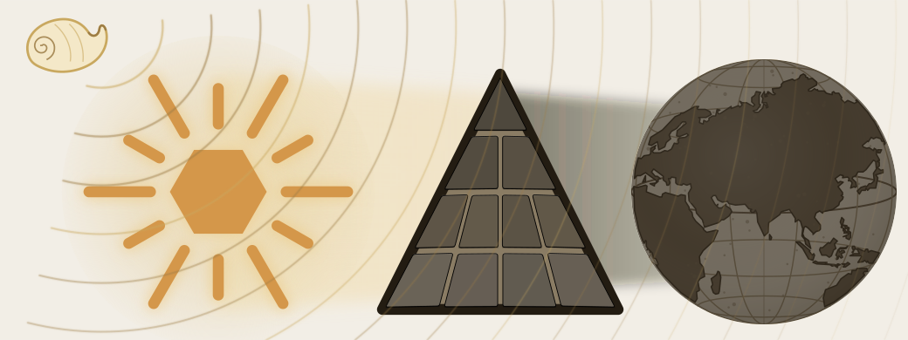

# Prologue — The Eclipse

::: epigraph

> यत्त्वा सूर्य स्वर्भानुस्तमसाविध्यदासुरः ।\
> अक्षेत्रविद्यथा मुग्धो भुवनान्यदीधयुः ॥
>
> *yat tvā sūrya svarbhānus tamasāvidhyad āsuraḥ |*\
> *akṣetravid yathā mugdho bhuvanāny adīdhayuḥ ||*
>
> When Svarbhānu, the *a-sura*, pierced you, O Sūrya, with darkness, the worlds looked about bewildered, like one who no longer knew the field.
>
> *— Ṛgveda 5.40.5*[NOTE: rigveda-5-40-5-svarbhanu-eclipse]

:::

Svarbhānu covers the Sun with darkness. The Sun remains, but the worlds can no longer find their bearings.

This book uses that eclipse as its central metaphor. Sanskrit is the Sun. Its radiance is the language's capacity to generate new expression, carry knowledge outward, and remain unchanged through a distributed system of correction. The **asuric pyramid** stands between Sanskrit and the observer, as Svarbhānu stands before the Sun. It teaches people to see a different language from the one they can still hear and examine.

{#fig:concise-eclipse-preface width=100%}

The eleven blocks represent eleven claims about Sanskrit. One places an imaginary ancestor above it. Another treats the language as a plant that grew through natural change. A third credits Pāṇini with imposing order on that supposed drift. Other blocks reduce the sound-grid to an alphabet or treat the Vedas as old literature rather than the calibrant that keeps Sanskrit exact.

The chapters examine these claims in turn. A block cracks when its examination begins and falls when the book has explained what it conceals. The Sun becomes visible as the obstructions are removed. It has been there throughout.

Hindus continued reciting and teaching Sanskrit, even while schools taught them to explain it through these imported categories. The injury reaches beyond a mistaken account of a language. People can inherit a precise system and lose the ability to recognize what they have inherited.

The pyramid also gives the two Sanskrit domains a false chronology. It calls the Vedic domain an early, changing language and the लौकिक (*laukika*) domain a later language fixed by Pāṇini. This book argues that the two domains serve different purposes within one architecture: exact Vedic transmission and new composition. Their purposes do not establish a sequence of origins.

## The शङ्ख (*Śaṅkha*) Sounds

::: epigraph

> यो अग्रतो रोचनानां समुद्रादधि जज्ञिषे ।\
> शङ्खेन हत्वा रक्षांस्यत्त्रिणो वि षहामहे ॥
>
> *yó agrató rocanā́nāṃ samudrā́d ádhi jajñiṣé |*\
> *śaṅkhéna hatvā́ rákṣāṃsy attríṇo ví ṣahāmahe ||*
>
> You who were born at the head of the shining ones, up out of the sea — with the शङ्ख (*śaṅkha*), having slain the *rākṣasas*, we overcome the devourers.
>
> *— Atharvaveda 4.10.2*

:::

The conch calls seekers and caretakers to defend what they inherited. It sounds while the eclipse still covers the Sun and all eleven blocks remain in place.

{#fig:concise-eclipse-shankha width=100%}

Chapter 0 introduces the seekers and the knowledge they kept alive. Chapter 1 introduces the pyramid and its methods. Part I begins examining the claims that cast the shadow.

*Further reading: the full Prologue develops the eclipse metaphor and its criticism of the pyramid's clock; full Chapter 3 §3.3 and Chapter 18 examine chronology in greater detail.*
