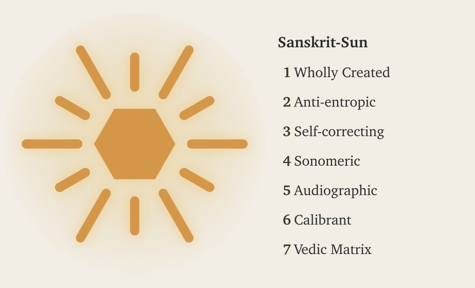
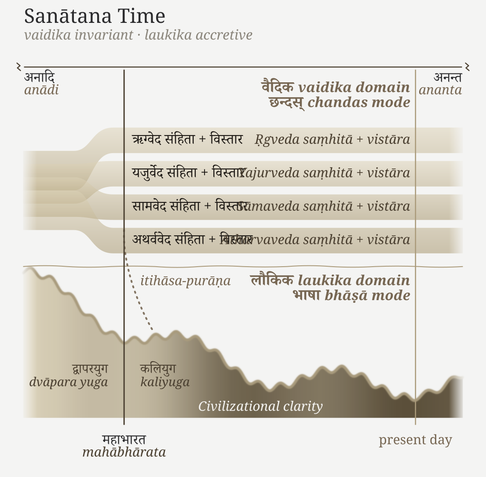

# Chapter 0 — Zero, Seekers, and the Infinite

::: epigraph

> ॐ पूर्णमदः पूर्णमिदं पूर्णात्पूर्णमुदच्यते ।\
> पूर्णस्य पूर्णमादाय पूर्णमेवावशिष्यते ॥\
> ॐ शान्तिः शान्तिः शान्तिः ॥
>
> *oṃ pūrṇam adaḥ pūrṇam idaṃ pūrṇam udacyate |*\
> *pūrṇasya pūrṇam ādāya pūrṇam evāvaśiṣyate ||*\
> *oṃ śāntiḥ śāntiḥ śāntiḥ ||*
>
> *— Īśopaniṣad invocation*[NOTE: ishopanishad-invocation]

:::

## 0.1 The Whole That Remains Whole

The opening invocation describes a puzzle. That is whole; this is whole. From the whole, the whole emerges. Take the whole from the whole, and the whole still remains.

**पूर्णम् (*pūrṇam*)** means whole or complete. The invocation speaks of **ब्रह्मन् (*Brahman*)**: the whole is not exhausted by what emerges from it. Its listeners are invited to think beyond an ordinary quantity that diminishes whenever something is taken away.[NOTE: ishopanishad-invocation]

Zero and infinity help us approach the puzzle. Take zero from zero, and zero remains. An infinite set can contain an infinite subset and still have an infinite remainder after that subset is removed. The invocation belongs to a civilization comfortable thinking beyond the limits of what someone can hold, count, or own.

{#fig:concise-eclipse-sanskrit-sun width=100%}

The Sanskrit word **जिज्ञासा (*jijñāsā*)** names the desire to know. Seekers pursue that desire through study, practice, and examination. The civilization remembers its great seekers as **ऋषयः (*ṛṣayaḥ*)** and **ऋषिकाः (*ṛṣikāḥ*)**, men and women who sought knowledge and passed it on.

A seeker chooses a path suited to their understanding, responsibilities, and circumstances. Different paths can coexist because nobody needs to place one human authority above every inquiry.

## 0.2 Words You Already Know

You may already know more Sanskrit than you think. **योग (*yoga*)**, **कर्म (*karma*)**, and **मन्त्र (*mantra*)** have become familiar far beyond India.[NOTE: english-sanskrit-loanwords] Within India, names, ceremonies, songs, and everyday speech keep Sanskrit close even to people who have never studied its grammar.

These words often describe something rather than simply label it. Arjuna is **कौन्तेय (*Kaunteya*)** because he is Kuntī's son. The name tells us a relationship. Sanskrit can build further names from other relationships, qualities, and actions.[NOTE: sanskrit-names-as-attributes]

**चन्द्रयान (*Candrayāna*)** joins **चन्द्र (*candra*)**, Moon, with **यान (*yāna*)**, vehicle. Ancient word-building procedures can name a modern spacecraft. Speakers do not have to redesign the language whenever the world changes.

## 0.3 One Language, Two Domains

The name **संस्कृतम् (*saṃskṛtam*)** describes something wholly formed. Beside it, **प्राकृत (*prākṛta*)** names the natural and changing. Everyday speech changes as people use it. Sanskrit's construction allows people to describe new circumstances while keeping the language's architecture unchanged.

Sanskrit has two domains. In the **वैदिक (*vaidika*)** domain, the Vedas remain exact: their words, sounds, pitch, and arrangement cannot be rewritten. In the **लौकिक (*laukika*)** domain, people use the same language to compose new poetry, arguments, mathematics, and stories. The language remains unchanged while the body of compositions grows.

{#fig:concise-sanatana-triad width=100%}

Calling the Vedas old does not make their language obsolete. Nor does it establish that every लौकिक (*laukika*) composition came later. The pyramid turns these two purposes into two historical periods, then credits Pāṇini with fixing the later language. Chapter 2 challenges that story; Chapter 16 examines the different forms permitted in the two domains.

### Sanātan Time

Sanātan time extends from **अनादि (*anādi*)**, without a beginning, to **अनन्त (*ananta*)**, without an end. That does not give us a date for the beginning of Vedic transmission. The Vedas enter human memory at an unknown point within that unbounded span.

{#fig:concise-sanatana-time width=100%}

The figure shows the one Veda arranged into four by Vyāsa at the time of the Mahābhārata. This is an act of arrangement and protection, not a claim that Vyāsa composed the Vedas. Each **संहिता (*saṃhitā*)**, collection, has its **विस्तार (*vistāra*)**, extensions. The **इतिहासपुराण (*itihāsa-purāṇa*)**, histories and Purāṇas, also called the fifth Veda, carry civilizational memory into the domain of new composition.[NOTE: veda-vyasa-division]

The two grammatical names in the figure identify these different purposes: **छन्दस् (*chandas*)** for Vedic usage and **भाषा (*bhāṣā*)** for new composition. The rising and falling line represents clarity gained and lost across the **युगाः (*yugāḥ*)**, ages. What a generation understands may change, while the Vedic calibrant remains available for another generation to learn from.

### A Language of Infinity

**Sanskrit does to language what zero does to counting.**

With ten numerical values and the rules of place value, we can express numbers of any size. We do not need to invent a new counting system whenever the quantity grows. The written circle is one way to represent zero; the capacity belongs to the system, not to that particular mark.

Sanskrit likewise builds new words from a limited collection of parts and rules. The reconstruction conducted for this book generates more than twelve million word-meanings within a bounded set of operations. That is only part of its reach. Sanskrit also permits a completed compound to become part of another compound. The same procedure can be applied again: this is recursion. The language can keep extending what it expresses without replacing its architecture.[NOTE: sanskrit-generative-wordspace]

Chapter 12 follows the calculation through familiar and unfamiliar words. Here, the scale matters: a language thousands of years old can still name circumstances its earlier speakers never encountered. Like the opening invocation's whole, the system is not exhausted by what emerges from it.

## 0.4 Why Memory Must Remain Understandable

The Vedas distinguish **सत् (*sat*)** from **असत् (*asat*)** and describe **ऋत (*ṛta*)**, the order with which conduct aligned with *sat* must agree. Their encounters give the listener concrete actions to judge. Vṛtra blocks the waters. Svarbhānu hides the Sun. The protagonists break the obstruction so that water and light can reach others.[NOTE: rv-1-32-vrtra][NOTE: rigveda-5-40-5-svarbhanu-eclipse]

This gives us three categories. **प्रकृति (*prakṛti*)** is nature, before the orders people deliberately create. **संस्कृति (*saṃskṛti*)** is created order directed toward *sat*: people learn to restrain themselves and protect the well-being of others. **विकृति (*vikṛti*)** is created order directed toward *asat*: intelligence and power are used to deform relationships, obstruct others, and control what they need. A carefully organized system can belong to either of the latter two categories. We must examine its purpose and actions.

Someone can try to dominate others without knowing the history of earlier domination. In that sense, *asat* needs no long memory to return. Those resisting it benefit from knowing how others recognized and defeated similar attacks. *Sat* needs that memory to remain understandable across generations.

Sanskrit's invariance serves this purpose. A student can learn the language today and examine accounts transmitted thousands of years ago, rather than surrender their meaning to someone who claims exclusive authority to interpret them. **विवेक (*viveka*)**, discernment, remains the listener's responsibility. The old account stays available; each generation must decide how its lesson applies.

The Vedas call the path of continuing well-being **स्वस्ति (*svasti*)**.[NOTE: rv-5-51-15-svasti-panthanam] This book uses the swastika to represent an inside-out order directed toward that well-being. People restrain harmful conduct, accept correction, and keep what sustains life in circulation. Indra's strength matters because he uses it to release the waters. Strength alone does not decide which side an actor serves.

Memory faces both accidental change and deliberate destruction. A written copy can decay, burn, or be altered; a ruler can capture a library. Scripts themselves change with writing tools and technologies. The Vedic system therefore entrusts its primary standard to exact sound and living memory distributed across society. Chapter 13 explains why writing can assist this system but cannot carry it alone.

## 0.5 Across India and Across Generations

Teachers train learners to listen, repeat, recognize errors, and correct them. A learner later teaches someone else. The procedure extends through generations while several lineages keep independent points of comparison.

Recitation has continued through teachers and lineages in Kerala, Tamil Nadu, Karnataka, Maharashtra, Banaras, Kashmir, Gujarat, and Rajasthan. Their traditions are not identical in every detail. Reciters can compare shared forms while recognizing differences belonging to particular **शाखाः (*śākhāḥ*)**, branches of Vedic transmission. No single region owns the standard.

Chapter 15 explains these checks in detail. The book also follows a recurring discipline through the smaller parts of Sanskrit: sounds remain distinguishable, words combine recognizable parts, and sentences retain relationships that a learner can examine. The same attention to parts, combination, and correction returns at different scales. That recurrence is the book's fractal argument.

The pyramid concentrates the right to judge at an apex. Sanskrit teaches people how to judge a form and pass that ability on. Chapter 1 examines why an order built around control would try to conceal such a system.

*Further reading: full Chapter 0 §0.3 gives more examples of names and water words; §0.5 examines Vedānta and the chronology imposed upon it; §0.6 gives the numerical totals behind the millions of word-meanings; §0.7 quotes the mantras on sat, asat, and ṛta.*
