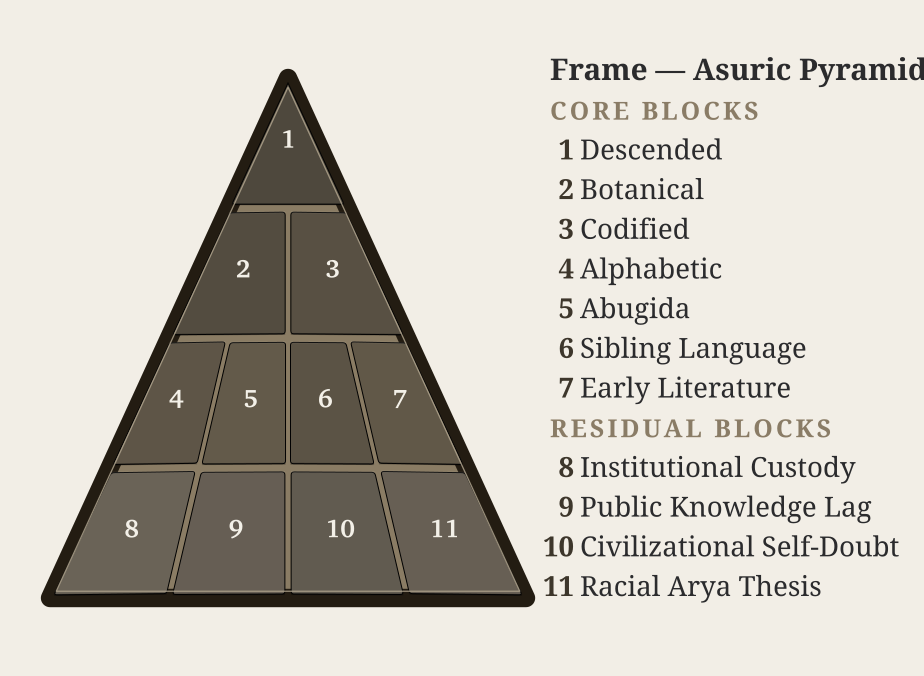

# Chapter 1 — One, the Apex, and the Finite

::: epigraph

> द्वौ भूतसर्गौ लोकेऽस्मिन् दैव आसुर एव च ।\
> दैवो विस्तरशः प्रोक्त आसुरं पार्थ मे शृणु ॥
>
> *dvau bhūtasargau loke'smin daiva āsura eva ca |*\
> *daivo vistaraśaḥ prokta āsuraṃ pārtha me śṛṇu ||*
>
> Two are the created orders in this world: the divine and the asuric. The divine has been described at length; hear from me, Pārtha, the asuric.
>
> *— Bhagavad Gītā 16.6*[NOTE: bhagavad-gita-16-6-daiva-asura]

:::

## 1.1 Who May Decide?

The Gītā names two created orders: **दैव (*daiva*)** and **आसुर (*āsura*)**. This chapter examines the asuric order. It places authority at a single apex and expects everyone below to obey. The apex may be a ruler, a religious office, or an institution that decides whose knowledge may be heard.

The seeker chooses a path. The pyramid claims the right to decide which paths are permitted. Its objection to independent judgment is practical: people who can test an instruction against a standard the apex does not own can also recognize when the apex is wrong.

{#fig:concise-eclipse-pyramid width=100%}

### The Finite Fragment and the Infinite Whole

The seeker approaches the unbounded through zero. The seeker does not place the self at the center or pretend that the human mind can contain infinity. Approaching the unbounded through zero requires humility before what exceeds the mind. It leaves the seeker open to the infinite while **जिज्ञासा (*jijñāsā*)**, the desire to know, disciplines the inquiry. The asuric pyramid moves in the opposite direction. It places one apex above the entire order. A person, fact, or idea receives recognition only when the apex authorizes it.

In the pyramidal architecture, apex, oppression, and finitism reinforce one another. The apex concentrates authority. Oppression forces everyone below to accept its boundaries. Finitism then treats those imposed boundaries as the boundaries of reality itself. The boundless threatens this arrangement because no apex can own it, and a seeker remains free to look beyond what authority permits. The certified intellectuals therefore project the limits of their own knowledge onto the universe and call those limits truth.

The most celebrated models of modern cosmology, such as the Big Bang, train the modern mind into both temporal and spatial finitism. They represent the opposite of **पूर्णमदः (*pūrṇam adaḥ*)**, the infinite whole. Modern cosmology declares, for instance, that the observable universe spans some 93 billion light-years across. To the mortal ear, the number sounds unfathomably large. Yet ask any student of basic mathematics: what fraction is 93, or 93 billion, or 93 quadrillion, of infinity?

**The answer is always zero.**

The finite is all they have seen. The finite is all they can model. The finite then becomes all they are permitted to admit. The modern Scientist sitting at the apex has observed a finite fragment, effectively zero beside infinity, yet presides as though that measurable fragment were the whole. This is structural finitism.

Genesis presents the same pattern in scriptural key: one birth, one life, one death, one Heaven, one Hell. A single beginning, a single command, a single authorized account of origin, and a single final judgment at the end of the line. The pyramid needs that first point. Once the beginning is owned, the sequence can be owned. Once the sequence is owned, the entire order can be judged from outside. In philology, PIE performs the same function. In chronology, the date performs the same function. Control the first point, and the rest can be made to follow.

Sanātan's **अनादि (*anādi*)**, without a beginning, and **अनन्त (*ananta*)**, without an end, deny an apex that final enclosure. The seeker can examine what is within reach without claiming to have enclosed the whole.

### A Standard the Apex Cannot Own

Sanskrit distributes the ability to judge a form. A trained ear can hear a misplaced sound. Meter can reveal a missing syllable. Grammar can expose a malformed word. Separate lineages can compare their recitations. Capturing one teacher does not give an institution control of all these checks.

An apex that wants complete control must therefore attack the knowledge, break the relationships that keep it alive, or teach people to dismiss it. Svarbhānu's eclipse describes the third method: the source remains, but people can no longer recognize what it illuminates.

## 1.2 Teaching Children to Laugh at Sanskrit

Prime Minister Jawaharlal Nehru attacked Raghu Vira's Sanskrit-based terminology in Parliament as “artificial, unreal, absurd, fantastic and laughable.” He presented that approach to naming as an obstacle to progress.[NOTE: anti-sanskrit-progress-parliament]

Raghu Vira had proposed **संयान (*saṃyāna*)** for a train and **संकेत (*saṃketa*)** for a signal. My brother's government-controlled school instead taught pupils that a train was **लौहपथगामिनी (*lauhapathagāminī*)**, followed by an even more cumbersome construction for a railway signal. Children were given the absurdity to remember, while the concise alternatives disappeared from the lesson.

The lesson trained them to laugh before they could examine Sanskrit's word-building procedures. A child who absorbed it could later dismiss Sanskrit as unsuitable for modern life without knowing what the language could actually generate.

The pyramid repeats this method at university. It teaches that Sanskrit descended from an imaginary parent language and that Pāṇini imposed rules on a language drifting through time. Students encounter those conclusions before examining the language's construction. The examples they later study are already classified for them.

It also files Sanskrit's writing architecture under *abugida*, a category named from the Ethiopian Geʿez letter sequence. The label groups scripts by visible features while leaving Sanskrit's underlying sound-grid unexplained. Calling a computer a typewriter because both have keys does something similar: the resemblance becomes the description, and the greater construction disappears. Appendix Part 3 examines the script classification and the architecture it conceals.

## 1.3 How Control Repeats

The full chapter identifies eight recurring methods in Hindu stories: install an apex, withhold what others need, steal the foundation, enter under a false identity, turn a gift against its giver, multiply copies, claim what cannot be owned, and mistake the surface for the substance.

These are methods, not the eleven blocks in the eclipse figures. The blocks name particular claims about Sanskrit. A method can help spread several claims.

For example, the claim that Sanskrit is a fragment of PIE can be repeated in dictionaries, classrooms, and websites. Later readers encounter it everywhere and mistake repeated publication for independent confirmation.[NOTE: pre-pie-dictionary-shift][NOTE: pie-cementing-recent-decades] A civilization may also keep its Vedas, stories, and names while being taught to regard them as evidence for someone else's account of its origins.

The attack can destroy memory directly by attacking its teachers and places of learning. It can also leave the material intact while replacing the explanation. The second method is especially effective when people continue to revere what they no longer understand.

The same arrangement recurs at different scales. A ruler controls subjects; a department controls admission; an authorized curriculum controls what a student must repeat to qualify. In each case, access depends on approval from above. This is the pyramid's opposing fractal: the recurring concentration of authority.

## 1.4 Containment, Concealment, and Control

The Vedic encounters let us judge the action without relying on an actor's title. Vṛtra withholds the waters. Svarbhānu conceals the Sun. The Paṇis hoard what should circulate.[NOTE: rv-1-32-vrtra][NOTE: rigveda-5-40-5-svarbhanu-eclipse][NOTE: aradhas-panis-hoarders]

From these actions, the book identifies three characteristics associated with **असत् (*asat*)**: **containment, concealment, and control**. Someone withholds what others need, hides what they should be able to recognize, and makes access depend on his power.

Power itself does not make an actor asuric. Indra uses power to release the waters. Nor does every tradition outside Vedic teaching become an enemy. People may follow different disciplines and live harmoniously together. The asuric formation attacks or captures a shared standard because that standard limits its command.[NOTE: compatibility-is-not-immunity]

Peaceful coexistence does not guarantee protection against capture. A community may live harmoniously with its neighbors yet lack the institutions and long defensive memory needed to recognize a recurring attack. Abrahamic empires and missions conquered and converted natural societies across large parts of the world, then reorganized their descendants under pyramidal institutions. A formation that had not been hostile to others could become an instrument of the power that captured it.[NOTE: compatibility-is-not-immunity]

This is why the book judges conduct rather than ancestry or membership. The danger lies in what a person or institution does with its power. Chapter 2 examines a particular act of concealment: the story that Sanskrit changed naturally until Pāṇini imposed order upon it.

*Further reading: full Chapter 1 §1.2 follows the recurring concentration of power through empire and the capture of chronology; §1.3 gives more examples of concealment; §1.4 pairs all eight methods with stories and institutional examples; §1.5 quotes the detailed Vedic evidence.*
