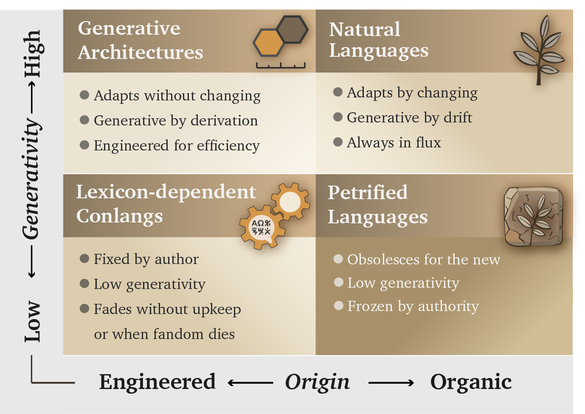
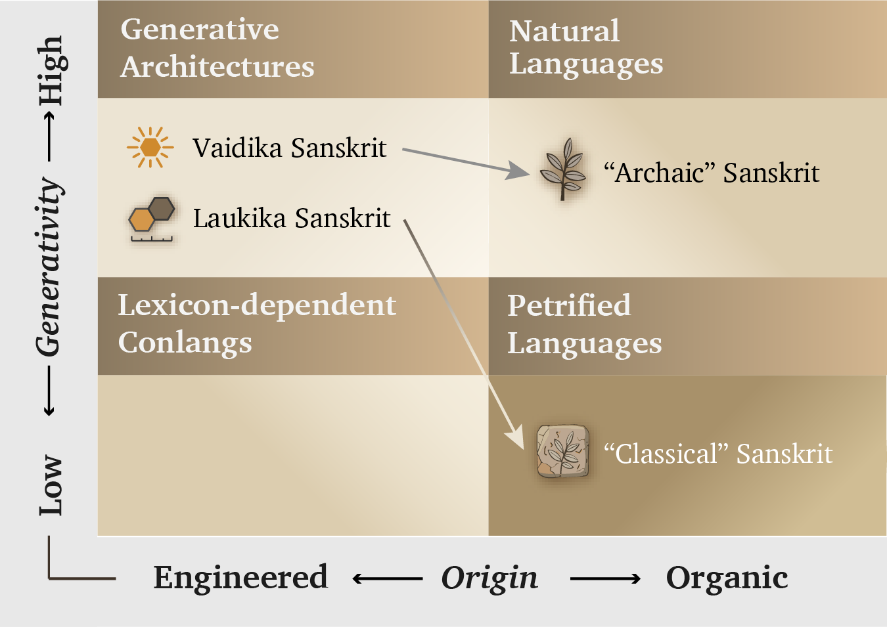

# Chapter 2 — Category Theft and आसुरी माया (*Āsurī Māyā*)

::: epigraph

> मायाभिरिन्द्र मायिनं त्वं शुष्णमवातिरः ।\
> विदुष्टे तस्य मेधिरास्तेषां श्रवांस्युत्तिर ॥
>
> *māyābhir indra māyinaṃ tvaṃ śuṣṇam avātiraḥ |*\
> *viduṣ ṭe tasya medhirās teṣāṃ śravāṃsy ut tira ||*
>
> With मायाः (*māyās*), O Indra, you struck down the मायिन् (*māyin*) Śuṣṇa. The wise know this deed of yours; raise their renown.
>
> *— Ṛgveda 1.11.7*[NOTE: rigveda-1-11-7-maya-mayin]

:::

## 2.1 A Grammar Cannot Keep a Language Unchanged

The pyramid tells a simple story about Sanskrit. The Vedas belong to an early period when the language was still changing. Pāṇini then wrote the **अष्टाध्यायी (*Aṣṭādhyāyī*)**, imposed rules upon that changing speech, and gave Sanskrit its stable form. His grammar supposedly stopped the drift.[NOTE: bakers-story-category-theft]

Tamil had a comprehensive grammar, but the language continued changing. The *Tolkāppiyam* describes its sounds, word formation, sentence construction, meaning, and poetry. A present-day speaker may recognize parts of a Sangam poem and still need commentary to understand it. People could consult the grammar to learn how earlier Tamil was used, while later generations continued changing their speech. Writing down the grammar had not stopped that change.[NOTE: tolkappiyam-grammar-and-tamil-change]

Religious and political authorities controlled which Quranic copies and recitations people could use. Arabic had a detailed grammar in Sībawayh's *Al-Kitāb*, but the authorities also enforced their decisions through powers that no grammar possesses.[NOTE: sibawayh-al-kitab][NOTE: arabic-religio-political-authority]

*Ṣaḥīḥ al-Bukhārī* records that Caliph ʿUthmān appointed a committee to prepare official Quranic copies, distributed them, and ordered competing written materials burned. Later authorities selected the recitations admitted to canonical status. In Egypt, institutional permission governs the printing and circulation of Quranic copies; enforcement includes confiscation and criminal penalties.[NOTE: arabic-religio-political-authority][NOTE: quranic-engineered-preservation]

The authorities could punish someone for circulating an unauthorized copy. That is how the pyramid protects its chosen forms: it chooses what people must repeat and can punish them for departing from it. Meanwhile, the Arabic spoken in homes continued changing. The grammar did not keep Quranic forms unchanged by itself; institutions guarded them.[NOTE: petrified-bounded-forms]

Schools taught Latin, and the Church continued using it for worship and learning even as everyday speech developed into the Romance languages. People could learn the older forms from teachers and books without using those forms in their daily conversation. Keeping a language in books and ceremonies did not keep ordinary speech unchanged.[NOTE: petrified-bounded-forms]

Sanskrit and Tamil placed grammatical knowledge within society. Teachers, commentators, families, temples, and places of learning carried it across generations. Neither language depended upon one continuing office that licensed every acceptable sentence.[NOTE: tamil-sanskrit-distributed-grammar]

Tamil continued changing despite its grammar and its teachers. Sanskrit retained its architecture. What kept Sanskrit unchanged when a comprehensive grammar had not done that for Tamil?

**The Vedas.**

The Vedas let each generation check its Sanskrit against the same body of sound. A grammar explains how to form words and sentences; the Vedas give teachers and learners an unchanged reference against which to check them.

## 2.2 Four Language Categories

People can develop a language through generations of use, or deliberately design one. Either way, its speakers need to say things that nobody has said before. They might have to add more words to an existing list, or they might build new words from parts and rules they already know. Figure 2.1 groups languages according to how they began and how they allow people to say new things.[NOTE: language-origin-standardization-form]

Engineered languages are on the left; languages that grow through use are on the right. The upper half contains languages whose speakers can readily build new expressions. The lower half contains constructed languages more dependent on a listed vocabulary, alongside older forms held apart from everyday change.

{#fig:concise-ch2-language-categories width=100%}

**Natural languages** develop through use. English, Tamil, Marathi, and Korku allow their speakers to say new things, while their sounds, vocabulary, and grammar change across generations.

**Petrified forms** are selected forms held apart from that ordinary change. Quranic Arabic, ecclesiastical Latin, and the Masoretic form of Biblical Hebrew illustrate this category. The term concerns the guarded form, not every language spoken by the people around it.

**Lexicon-dependent constructed languages** begin with a designed vocabulary and rules. Their creators must add further listed words when the existing material cannot express something new. The full chapter discusses examples created for fictional worlds.[NOTE: conlangs-tolkien-okrand]

**Generative architectures** let speakers build new words and sentences from a compact set of parts and rules. This book places Sanskrit here. Esperanto also began with a compact design intended for wide use. Both have a deliberate design, although Sanskrit has a much larger system for forming words and a different way of keeping the language unchanged.

Patañjali tells of Bṛhaspati trying to teach Indra every valid word, one at a time. A thousand divine years pass, and he still has not finished. If even this teacher and pupil cannot complete the list, how could a human learner do so?[NOTE: paspashahnika-brihaspati-indra-word-list]

Instead of memorizing every word, the learner studies how words are formed. A compact set of rules, including the exceptions, lets someone understand and create expressions that no dictionary could list exhaustively. A grammarian can explain those rules because the language already uses them.

## 2.3 Engineering the Language Is Only One Task

Esperanto was designed to let speakers build new expressions from the grammar set out in its *Fundamento*. Yet people using it began developing their own habits and preferences. Engineering a language had not prevented its speakers from introducing changes.[NOTE: esperanto-engineered-botanical-transition]

Esperanto appeared after Sanskrit had transformed European language study. Europeans had already encountered a language whose parts and grammatical procedures could be examined systematically. The later European project received recognition as deliberate language design, while Sanskrit's far more extensive architecture was assigned to natural growth. The category exists; it is withheld from Sanskrit.[NOTE: esperanto-engineered-botanical-transition]

Sanskrit also addresses a problem that a grammar cannot solve merely by being written. Someone must retain the correct forms, teach people to recognize them, and correct departures before another generation learns those departures as normal usage.

The Vedas keep a large body of Sanskrit available for that comparison. A learner hears sounds, vowel lengths, pitch, words, and complete sentences in passages that cannot be rewritten to follow changing habits. Teachers explain the forms and train students to reproduce them. Other trained listeners can hear and correct a departure from the same reference.

This is what a **calibrant** does. It remains available so that people can compare their own performance with it and correct an error. The standard does not become a teacher's personal property, and a teacher cannot change it merely by claiming authority.

Sanskrit serves these two needs through two domains. In the **वैदिक (*vaidika*)** domain, the Vedic passages remain exact. In the **लौकिक (*laukika*)** domain, people compose new poems, explanations, calculations, and arguments through the same language. Speakers can address a changing world without rewriting the reference by which they check their Sanskrit.

Creating the language was one engineering task. Keeping it calibrated for thousands of years was the greater one. That system had to resist both unintended change, or entropy, and deliberate attacks upon its teachers, memory, and access to knowledge. Its distribution across lineages and regions prevented one office from becoming the owner of the complete standard.

Chapters 13–16 examine those protections in detail. Pāṇini's grammar strengthens the system by explaining how forms are built and analyzed. The Vedas remain the calibrant.[NOTE: calibration-hierarchy]

Sanskrit carries **संस्कृति (*saṃskṛti*)**: knowledge and practices through which people learn to judge conduct and create order together. Its caretakers wanted later generations to understand that inheritance, so they protected the language in which it was taught. We can still hear people recite, see how they correct mistakes, and examine how the words are formed. That is why this volume begins with Sanskrit.

That purpose has inspired millions of people across thousands of years.

**I am one of them.**

## 2.4 Why an Atom Is Not a Root

A family tree makes natural linguistic change easy to picture. Words acquire new sounds and meanings; speech separates into regional forms; later languages grow from earlier ones. European philology extended that picture to Sanskrit and translated its basic constituent, **धातुः (*dhātuḥ*)**, as a *root*.[NOTE: schleicher-stammbaumtheorie][NOTE: dhatu-pre-panini-vedic]

Sanskrit already has **मूल (*mūla*)** for a root and **बीज (*bīja*)** for a seed. A धातुः (*dhātuḥ*) is a basic part from which something larger is made. In grammar, it carries a core meaning and combines with other parts to form words. This book calls it an **atom**. Chapter 10 examines how these atoms are built and why that name fits them.

The name **संस्कृतम् (*saṃskṛtam*)** itself describes something completely formed. **कृतम् (*kṛtam*)** comes from ⟪कृ⟫ (*kṛ*), to make, while **सम् (*sam-*)** contributes completion and integration.[NOTE: samskrtam-morphology]

Calling the constituent a root makes Sanskrit look like another plant on the family tree. The metaphor then appears to confirm what the classification assumed from the beginning. An engineered construction has been placed inside an account of natural growth. That is **category theft**.

## 2.5 Three Acts of Category Theft

The pyramid carries out that theft in three connected steps.

First, it calls the Vedic domain an early natural language. Its additional forms become irregularities left over from a less orderly past. The preservation architecture disappears behind the label “archaic.”

Second, it places an imaginary ancestor, **Proto-Indo-European**, or **PIE**, above Sanskrit. The **Racial Arya Thesis**, or **RAT**, assigns the language to incoming “Aryans.” Sanskrit becomes their inheritance rather than a language engineered within its subcontinental home. Chapters 17–19 examine that origin claim. People may move between civilizations; movement alone does not establish who created a language.

Third, it makes Pāṇini the authority who imposed order. The supposed natural language before him becomes fixed “Classical Sanskrit” afterward.

{#fig:concise-ch2-misclassification width=100%}

The arrows show what the pyramid's classification does to the two domains. It calls the Vedic domain a changing natural language and the लौकिक (*laukika*) domain a later, fixed language. What Sanskrit uses for two different purposes becomes, in this story, two periods of history.

A Vedic passage may use a choice of forms needed for its meter, sound, or expression. Someone composing a new लौकिक (*laukika*) sentence chooses from a more restricted set. Both use the same architecture. Pāṇini explains where particular forms apply; he does not rewrite the Vedas into a later language.[NOTE: chandasi-bhashayam-mode-markers]

Chapter 16 demonstrates the distinction with passages in which substituting the narrower लौकिक (*laukika*) form would break the Vedic meter.

## 2.6 Pāṇini Decoded the Architecture

The codification story praises Pāṇini for the wrong achievement. It makes his analysis responsible for creating the order it describes. I call this **heroic erasure**: praise the documenter so lavishly that the civilization's prior achievement disappears behind him.

Pāṇini explained an existing language with extraordinary precision. He showed learners how to build words, take completed forms apart, and understand how their parts combine. Earlier analysts had examined the language before him. Chapter 5 follows that lineage; Chapters 11 and 12 demonstrate the grammar already present in Vedic verbs and sentences.

***Sanskrit was engineered. Encoded in the Vedas. Decoded by many. Pāṇini's decoding is the finest. The Vedas remain the calibrant.***

## 2.7 Concealment and Projection

The opening mantra places Indra's **माया (*māyā*)** against the power of Śuṣṇa, himself a **मायिन् (*māyin*)**. The purpose served by that power determines whether the action aligns with **सत् (*sat*)** or **असत् (*asat*)**. The continuum distinguishes **दैवी माया (*daivī māyā*)**, which serves radiance and protection, from **आसुरी माया (*āsurī māyā*)**, which serves concealment and deformation.

The **वेदान्तसार (*Vedāntasāra*)** explains two powers of māyā: **आवरण (*āvaraṇa*)**, concealment, and **विक्षेप (*vikṣepa*)**, projection. A cloud hides the Sun without destroying it. A rope mistaken for a snake shows how something else can be projected where the real object remains.[NOTE: maya-concealment-projection]

The pyramid conceals the Vedas' role in keeping Sanskrit calibrated, then projects a different history in its place: a language drifting through time, an imaginary ancestor, and a codifier who supposedly imposed order. Sanskrit remains available for anyone to examine, but people are taught to explain it through that story.

This is **आसुरी माया (*āsurī māyā*)** applied to civilizational memory. Chapter 3 examines why the pyramid needs that concealment and why conduct matters more than the identity claimed by an actor.

*Further reading: full edition, Chapter 2 §§2.1–2.5 for the language comparisons; §§2.6–2.8 for the terminology and codification argument; §2.9 for the change in institutional attacks after 1857; and §2.10 for concealment and projection.*
