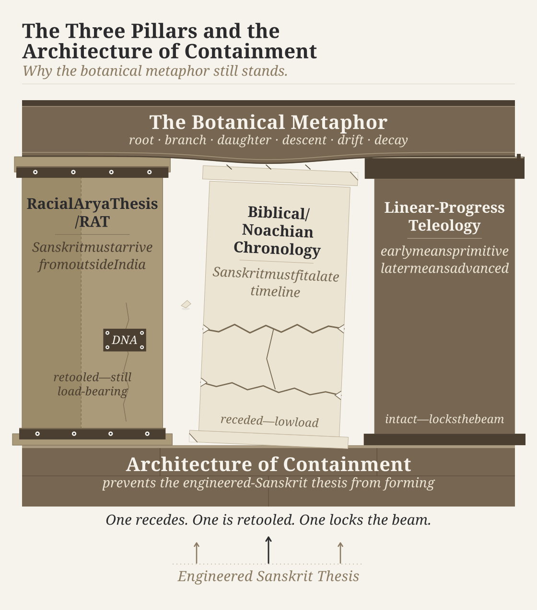
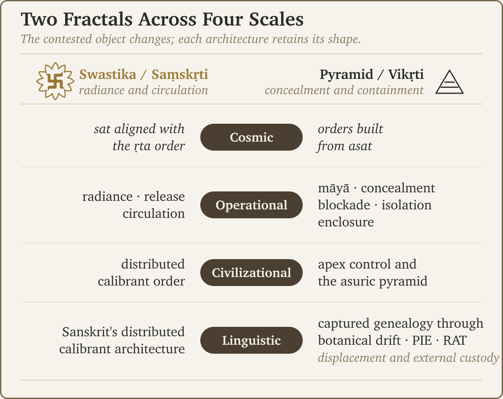

# Chapter 3 — The Pyramid's Motive and Method

::: epigraph

> वि तिष्ठध्वं मरुतो विक्ष्विच्छत गृभायत रक्षसः सं पिनष्टन ।\
> वयो ये भूत्वी पतयन्ति नक्तभिर्ये वा रिपो दधिरे देवे अध्वरे ॥
>
> *vi tiṣṭhadhvaṃ maruto vikṣv icchata gṛbhāyata rakṣasaḥ saṃ pinaṣṭana |*\
> *vayo ye bhūtvī patayanti naktabhir ye vā ripo dadhire deve adhvare ||*
>
> Spread among the people, O Maruts; seek them out. Seize the rākṣasas and crush them: those who fly by night in the form of birds, and those who bring hostility into the sacred ceremony.
>
> *— Ṛgveda 7.104.18*[NOTE: rigveda-7-104-18-rakshasas-night]

:::

The mantra calls for concealed hostility to be found and stopped. An outward appearance cannot settle whom to trust. The listener has to examine what the actor is doing. The same responsibility applies when a familiar account of Sanskrit hides the architecture it claims to explain.

## 3.1 What the Family Tree Protects

The pyramid teaches students to call Sanskrit's basic parts roots, place the language beneath PIE, and credit Pāṇini with stopping its drift. By the time students examine a Sanskrit word, they have already been taught what kind of object it must be: something inherited from an earlier language.

That classification protects three commitments. The first assigns Sanskrit's beginnings to incoming “Aryans.” The second fits its history into a restricted chronology. The third makes early civilization primitive and later civilization advanced. Together, they leave little room for an ancient Indian system whose engineering the present has not surpassed.

The **Racial Arya Thesis**, or **RAT**, converts **आर्य (*ārya*)** from a quality expressed through conduct into a people identified through ancestry. Invasion and migration then become different ways to bring that supposed people and its language into India. The vehicle changes while the external origin remains.

European invaders could project their own conduct into India's ancient past: another incoming people had supposedly conquered, subordinated, and civilized those already there. The imagined conquest made European conquest look like the repetition of an older achievement. Turning **आर्य (*ārya*)** and **दास (*dāsa*)** into ancestral populations helped create that story.

The institutions telling it came from traditions that had authorized slavery. Leviticus permits slaves to be inherited as property; Ephesians instructs slaves to obey their masters; Quranic passages recognize sexual access to those held in possession.[NOTE: leviticus-slavery-25-44-46][NOTE: ephesians-slavery-6-5][NOTE: quran-slavery-citations] Yet the pyramid projected a master–slave racial history onto India. In the **अस्सलायन सुत्त (*Assalāyana Sutta*)**, Buddha points to Yona, Kamboja, and other bordering countries when describing a master–slave division, including the possibility of changing from one status to the other.[NOTE: assalayana-sutta] That account does not make ancestry an unchanging human quality.

People certainly move between societies. Their movement does not establish that they created a language rather than learned it. If Sanskrit was engineered, its sounds, grammar, and system of preservation need an explanation. A route on a migration map cannot explain how those parts were designed to function together. Chapter 18 returns to this distinction between movement and authorship.

## 3.2 Who Owns the Beginning?

Early European accounts of civilization fitted human history around Biblical beginnings, the Flood, and Babel. Modern philology no longer needs to profess that chronology. Yet the family tree still places Sanskrit inside a history whose beginning belongs elsewhere.

The doctrine of progress gives that history another justification. It assumes that civilization advances as time passes. The older order must therefore be less developed than the later one. An ancient language with a system that has resisted both change and attack for thousands of years contradicts that expectation.

**कालचक्र (*kālacakra*)**, the wheel of time, allows clarity to be gained, lost, and gained again. A later society may have more artifacts and less understanding. Age alone cannot tell us whether an architecture is sophisticated or whether those inheriting it understand it.

The pyramid can praise India while keeping Greece at the beginning of intellectual history. It celebrates India's influence after the period it calls the “Greek miracle,” leaving India's earlier radiance outside the account. The praise grows, but Europe's claim to priority remains protected.

{#fig:concise-three-pillars width=100%}

The three pillars no longer carry equal weight, but the classification they defend still governs what students learn. Indian curricula reproduce it. Chapter 4 follows that teaching into named institutions.

The tactic changes when Hindus become more confident about their inheritance. Treating Sanskrit as dead becomes less convincing when people are learning it, using it, and asking why its architecture has been misrepresented. The pyramid then offers controlled recognition: Sanskrit may be admired, provided its creation remains assigned to people who brought it from elsewhere. Hindu confidence has forced a change in the tactic without ending the attempt to control the account.

## 3.3 Judge the Action

In Chapter 2's epigraph, Indra defeats the **मायिन् (*māyin*)** Śuṣṇa through his own **माया (*māyā*)**. Both possess power. What each does with that power determines whether the action serves **सत् (*sat*)** or **असत् (*asat*)**.[NOTE: rigveda-1-11-7-maya-mayin]

Sanskrit has two distinct words that share the sound-form **असुर (*asura*)**: *asu-ra*, bearer of **असु (*asu*)**, life's breath, and *a-sura*, with a privative *a-* before *sura*. The atom **⟪सुर्⟫ (*sur*)** includes shining among its meanings.[NOTE: sura-dhatu-dipti]

We cannot decisively assign every Rigvedic occurrence to one of these two words. A passage may oppose an actor called *asura*, while another praises an actor bearing the same sound-form. The inherited explanations do not resolve every assignment.[NOTE: yaska-asura-nirukta][NOTE: samaveda-padapatha-asurasya-split]

This book uses **a-sura** for an antagonist who turns power against radiance. It uses **asu-ra** when the life-breath analysis is intended. A quoted Vedic *asura* remains unassigned unless the source divides it.

### Thirty-Seven Pages, Thirty-Five Scholars

The pyramid has made this word carry histories of peoples, migrations, rival religions, and changes of belief. By 1986, one monograph spent thirty-seven pages examining the work of **thirty-five named scholars** before beginning its own analysis.[NOTE: asura-academic-industry]

**Thirty-five.**

Some served the pyramid's account; others inherited its categories and remained trapped within its debate. Either way, hours of examination went into a word that the pyramid had made critical to its history. What happened to the actions described in the mantras while everyone examined the label?

### A Word Does Not Need Prior Publication

The objection to *a-sura* relies on independent **सुर (*sura*)** not appearing in the Ṛgveda. But a generative language need not wait for a positive form to appear in a collection before using its negative. The Ṛgveda has forty-eight uses of **अदब्ध (*a-dabdha*)** without an independent **दब्ध (*dabdha*)**.[NOTE: asura-generativity-pie-double-standard][NOTE: rigveda-adeva-privative][NOTE: rigveda-privative-generativity]

The printed Kauthuma **पदपाठ (*Padapāṭha*)**, the word-by-word recitation, also divides *asura* as *a + sura*. That division does not settle a particular Rigvedic occurrence. It does defeat the attempt to rule out the formation merely because its positive form has not been independently recorded.[NOTE: samaveda-padapatha-asurasya-split]

The same philology accepts thousands of starred PIE forms that occur in no recorded sentence, yet disputes a word Sanskrit can generate and a Vedic Padapāṭha divides. Chapter 19 examines that double standard. Full §3.6 gives the individual mantras and the analyses attached to them.

### Return to the Action

What we can examine directly is conduct. Indra protects and strengthens his people. Varuṇa releases what has bound them. Svarbhānu conceals the Sun.[NOTE: rv-1-174-1-indra-asura][NOTE: rv-1-24-14-varuna-asura][NOTE: rigvedic-named-antagonist-asuras] The shared sound does not make these actions equivalent.

The pyramid instead makes labels such as *asura*, **आर्य (*ārya*)**, and **दास (*dāsa*)** carry histories of opposing peoples. A reader is invited to imagine factions competing for power rather than judge what the actors do with it.[NOTE: asura-factional-framing] That substitution diverts attention from **विवेक (*viveka*)**, the discernment the listener must exercise.

Remembering the actions lets another generation recognize the same conduct under a different name. Remembering only a faction's label cannot do that. The academy places the word under a floodlight and leaves the actions in shadow, concealing the very knowledge that makes these accounts useful across generations.

**Sanātan evaluates the action, not the faction.**

## 3.4 What the Protagonist Releases

Vṛtra dams the waters on the mountain. Indra strikes the enclosure with the **वज्र (*vajra*)**, and the rivers run toward the sea.[NOTE: rv-1-32-vrtra] The encounter distinguishes two uses of power: one captures what others need; the other releases it.

A boundary need not be destructive. Varuṇa establishes an ordered space in which life, water, and light can move.[NOTE: rv-8-42-1-varuna-measures] Vṛtra's enclosure stops the waters from reaching others. We must judge the purpose and consequence of the boundary, not condemn every act of construction.

Svarbhānu covers the Sun; Indra breaks his concealment and Atri restores Sūrya's eye.[NOTE: rigveda-5-40-atri-clearing] The Paṇis hoard cattle associated with light; the protagonists break that enclosure too.[NOTE: rv-vala-panis] Water, cattle, and sunlight differ, but the antagonists repeatedly seize what should circulate.

Destroying a library or suppressing a teaching lineage repeats this attack against memory. A community deciding which new compositions to teach does something different: its members exercise judgment about their own inheritance. An attacker takes that choice away.

## 3.5 The Same Conflict at Different Scales

{#fig:concise-two-fractals width=100%}

The figure names four scales. At the **cosmic** scale, it places order aligned with ṛta against orders built from asat. At the scale of **actions**, it contrasts release and circulation with concealment and enclosure. Vṛtra's dam and Indra's release of the waters show what that means. At the **civilizational** scale, it contrasts distributed correction with apex control. At the **linguistic** scale, it contrasts Sanskrit's Vedic calibrant with the genealogy the pyramid places above the language. The same opposition recurs as the objects and actors change.

The swastika represents the opposing, inside-out order. People keep knowledge available, learn how to check it, and teach others to do the same. They need protection against attack, but no protector acquires ownership of the standard. Chapter 4 asks what happens when institutions claim that ownership for themselves.

*Further reading: full Chapter 3 §§3.2–3.4 examine the racial, theological, and progress arguments in detail; §3.6 documents the asura analyses and academic debate; §3.7 gives the fuller Vedic encounters.*
