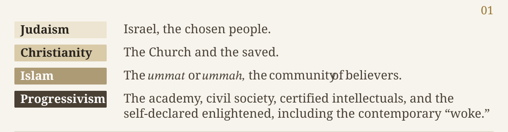
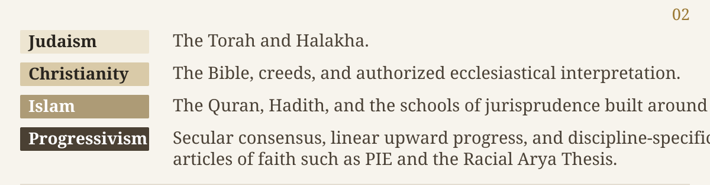
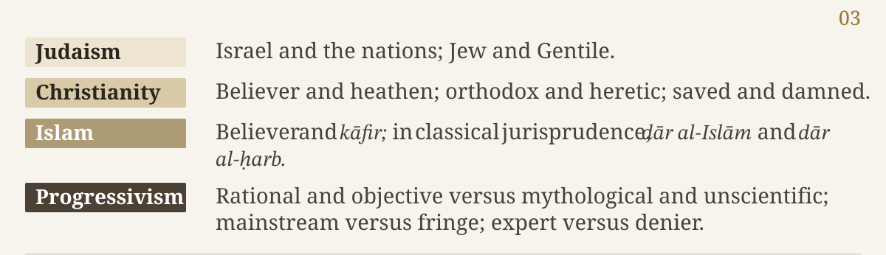
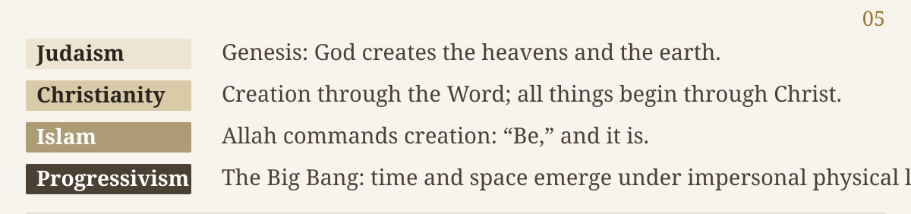
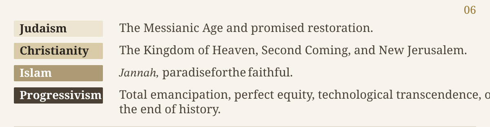
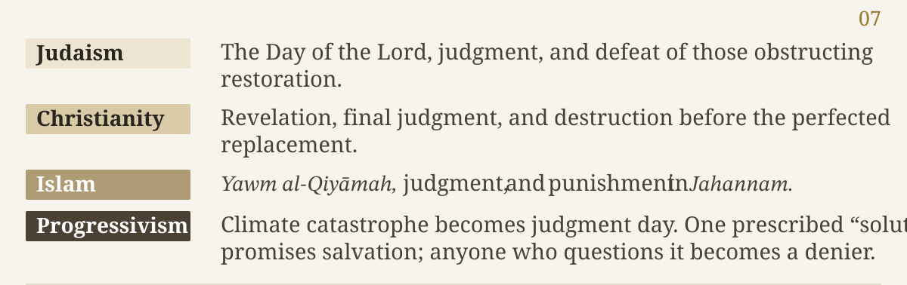
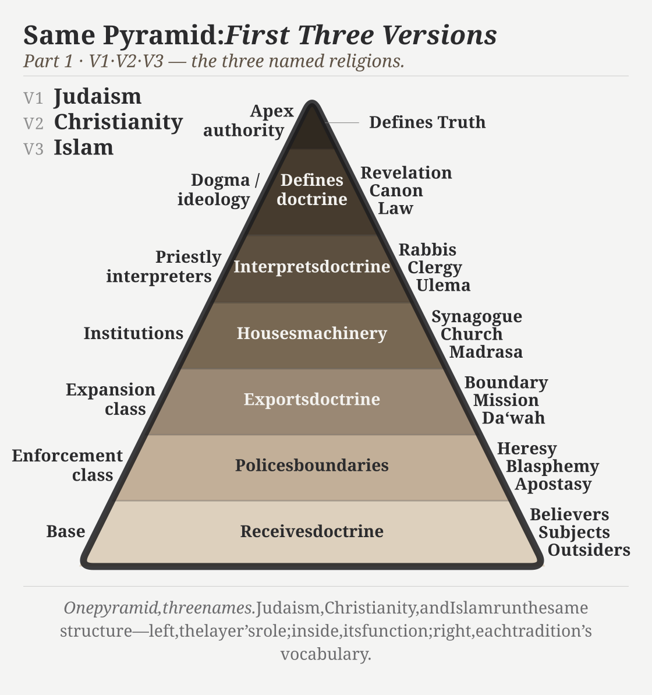
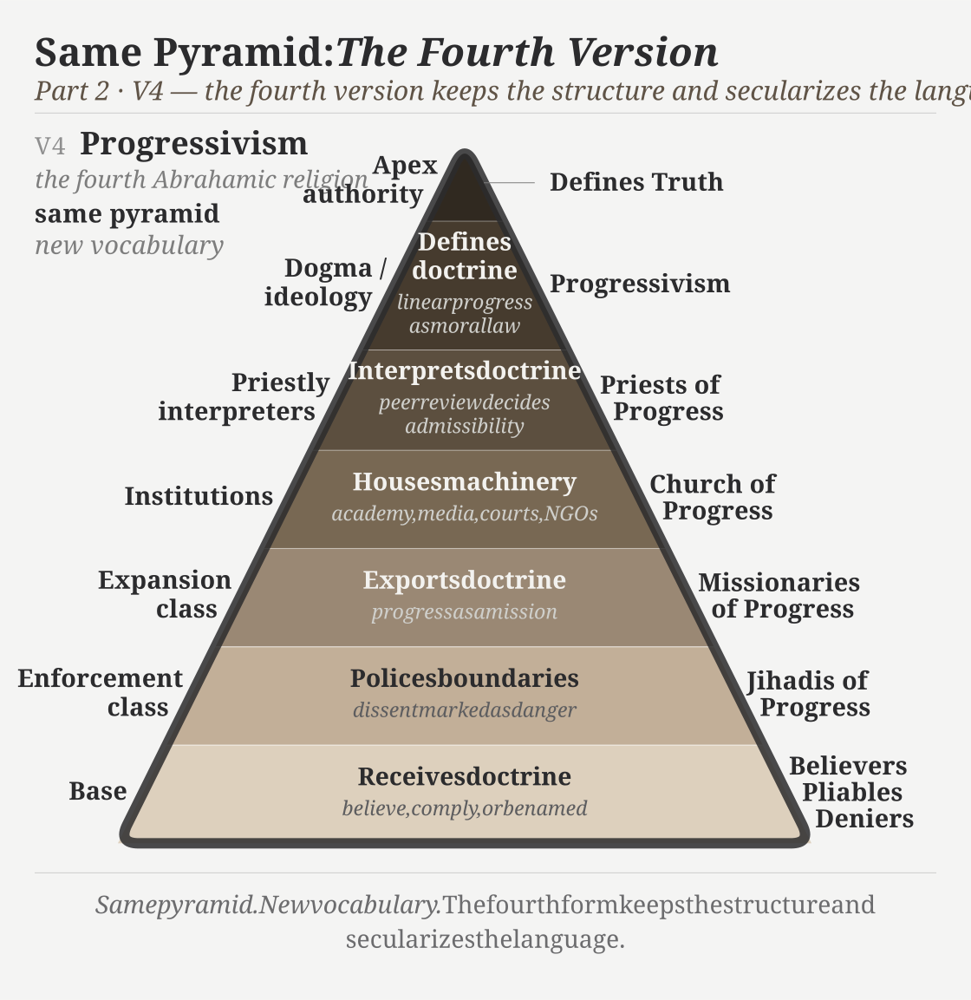
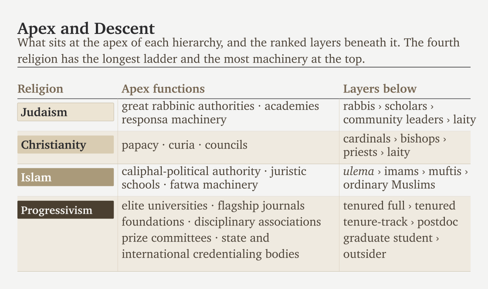
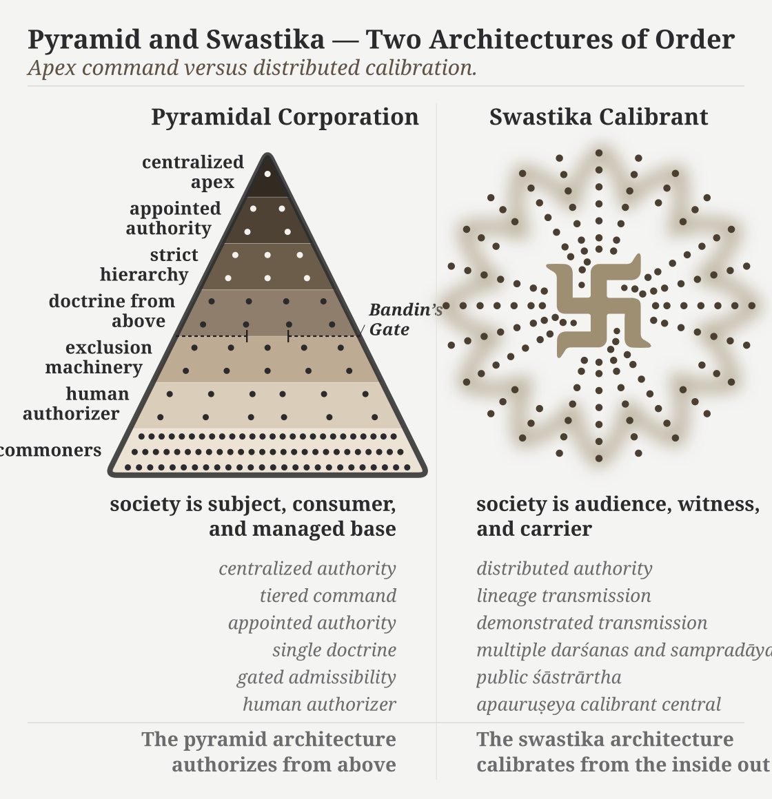

# Chapter 4 — The Fourth Abrahamic Religion

::: epigraph

> दासपत्नीरहिगोपा अतिष्ठन्निरुद्धा आपः पणिनेव गावः ।\
> अपां बिलमपिहितं यदासीद्वृत्रं जघन्वाँ अप तद्ववार ॥
>
> *dāsapatnīr ahigopā atiṣṭhan niruddhā āpaḥ paṇineva gāvaḥ |*\
> *apāṃ bilam apihitaṃ yad āsīd vṛtraṃ jaghanvām̐ apa tad vavāra ||*
>
> The waters stood obstructed, guarded by Ahi, like cows held by a Paṇi. When the opening of the waters had been covered, he struck Vṛtra and opened it.
>
> *— Ṛgveda 1.32.11*[NOTE: rv-1-32-vrtra]

:::

Vṛtra guards the waters and closes their outlet. Institutions can do the same to knowledge: hold it within their boundaries, appoint approved interpreters, and decide who may challenge their account. This chapter calls the modern institutional form the **church of progress**.

## 4.1 Same Structure, Four Vocabularies

Judaism, Christianity, and Islam use different doctrines but share features this book identifies as pyramidal: a chosen community, authorized teaching, a boundary between insiders and outsiders, and a promised future.[NOTE: four-iterations-architectural-mapping]

**The chosen community** identifies who belongs within the protected circle.

{width=100%}

**The authorized doctrine** identifies which teaching institutions may present as truth.

{width=100%}

**The boundary** gives insiders and outsiders different standing.

{width=100%}

Progressivism keeps these arrangements while replacing religious language with secular terms. It presents inherited civilization as something humanity must overcome on its way to a better future. The promised end may change, but the teaching still ranks societies by their place on a road toward it.[NOTE: heavenly-city-becker][NOTE: voegelin-gnosticism]

**The origin** tells them where the world began. In the fourth version, Genesis became the Big Bang. Stephen Hawking still invoked God repeatedly in *A Brief History of Time*, and his “mind of God” meant complete knowledge of physical law. The fourth religion converted divine creation into the emergence of time and space, then presented the substitution as “Science.”[NOTE: genesis-big-bang-god-as-law]

{width=100%}

Chapter 1 examined the claim to know the whole from a finite fragment. Here, the comparison concerns the story's structure: an authorized account of the beginning still governs how people are taught to understand everything that follows.

**The promised future** tells people what their present sacrifices are supposed to achieve. Heaven on earth becomes progress, salvation becomes development, and the elect become the enlightened. Those outside the chosen path become the backward people who must be brought forward.

{width=100%}

**The apocalypse** gives that promised future its urgency. The church of progress now presents climate catastrophe as its apocalypse. Most human beings genuinely want to care for the planet and leave it healthy for future generations. The church hijacks that desire and recasts it as an urgent judgment-day story: the world is about to end. It then announces a single “solution” that will prevent judgment day. Anyone who questions that solution is dismissed as a climate denier.[NOTE: fourth-abrahamic-eschatology-precedent]

{width=100%}

This is why I call progressivism the **fourth Abrahamic religion**. I mean a doctrine carried by institutions, not simply a person's wish to improve life. Those institutions decide who qualifies to interpret the past, which conclusions count as knowledge, and what students must learn to gain admission.[NOTE: secular-packaging-three-transformations]

### Who Stands Above the Flock?

The boundary decides who belongs; the pyramid decides who commands those inside it. At the apex of the first three stands a Father, jealous by His own testimony, who brooks no other before Him. As shepherd, He requires a flock that must remain dependent upon Him. The fourth secularizes Him into consensus and keeps the singular peak.

{#fig:concise-first-three-pyramids width=100%}

Read the figures from the apex down. Doctrine is authorized above, interpreters explain it, institutions spread it, and enforcement protects it. Those below may receive care and instruction, but they do not acquire the right to alter the standard. The next figure shows the fourth version of that arrangement.

Three roles keep this system in place. I call those who carry its categories into other societies **missionaries of progress**. Those who attack challengers through labels such as anti-science or regressive become **jihadis of progress**. Those who decide what may be published, cited, and taught become **priests of progress**. These names identify actions; one certified intellectual may perform more than one role.

{#fig:concise-fourth-pyramid width=100%}

## 4.2 What Students Must Accept

Two beliefs protect this history. The first makes recent civilization advanced and ancient civilization primitive. The second assigns civilization's foundational achievements to a corridor extending from the Near East into Europe. Sanskrit's ancient engineering challenges both.

The pyramid gives writing special importance because a physical record can be owned and controlled. A library needs material, copying, storage, and protection. A ruler can fund one collection and destroy another. Printing presses need capital and distribution; digital archives need servers and continued support. The person who controls the medium can decide what others are allowed to remember.

Writing remains useful, but this dependence makes it vulnerable. Exact sound distributed among living lineages is harder to capture in one place. Chapter 13 explains why the Sanskrit system could use writing without entrusting its calibrant to it alone.

The pyramid also uses written records to assign origins. It can date an inscription, then treat that date as the beginning of the knowledge recorded upon it. The age of the surviving object takes the place of the age of the idea.

## 4.3 Indian Institutions Teach the Imported Account

The church of progress gives its interpreters authority through degrees, appointments, journals, and reference works. A doctorate admits someone to the certified class; journal review decides which arguments may be published; reference works teach the next generation which conclusions to inherit. In this comparison, those procedures perform the roles of ordination, permission to publish, and doctrinal instruction.

{#fig:concise-apex-hierarchy width=100%}

The figure makes the dependency visible. Foundations and universities fund approved programs and hire the people who teach them. Rankings reward institutions that comply. Media select certified intellectuals as experts, while bureaucracies, NGOs, and treaty systems carry their conclusions into policy. Money, careers, and public standing make it costly to challenge the account on which the institution's authority rests.

### The Government Teaches the Doctrine

The Ministry of Education's e-PG Pathshala places reconstructed “Proto-Indo-Aryan” before “Vedic Sanskrit,” then presents “Classical Sanskrit” as a later stage with Pāṇini between them. The Indian government distributes the pyramid's genealogy as postgraduate teaching material.[NOTE: pie-indian-university-curricula]

Deccan College's 2025–27 MA Linguistics syllabus teaches reconstruction of earlier languages, genetic classification, and the family-tree model. Its Sanskrit and Lexicography syllabus places Vedic grammar within Indo-European linguistics. A Deccan College linguist also wrote the Ministry module that presents “Proto-Indo-Aryan” as Sanskrit's reconstructed predecessor.[NOTE: pie-indian-university-curricula]

Students could begin by examining Sanskrit's sound-grid, word-building procedures, recitation, and two domains. Instead, the syllabus first assigns the language an imaginary parent. Students are then expected to explain the forms they encounter as inherited from that parent. Indian institutions now teach and certify the imported account without requiring a European authority to impose it directly.

An institution can test an argument or exclude it because the speaker lacks standing. Those are different acts. A degree can show that someone completed a course of study; it cannot make an error correct or an outsider's demonstration false.

## 4.4 Aṣṭāvakra Challenges Bandin

The *Mahābhārata* tells of the young **अष्टावक्र (*Aṣṭāvakra*)** arriving at King Janaka's court to challenge **बन्दिन् (*Bandin*)**, who has defeated earlier learned challengers. A doorkeeper invokes Bandin's rule: learned elders may enter, but boys may not.[NOTE: ashtavakra-bandin-mahabharata]

Aṣṭāvakra first has to defeat the procedure keeping him outside. Age and grey hair, he explains, do not establish learning. Knowledge does. The doorkeeper tests him, recognizes his learning, and admits him. Aṣṭāvakra then defeats Bandin in public debate.

The Hindu continuum celebrates Aṣṭāvakra's victory. The hero is the challenger who demonstrates knowledge, not the gatekeeper whose rule tried to exclude him. **शास्त्रार्थ (*śāstrārtha*)** brings the argument before an audience that can hear the challenge and its answer.[NOTE: ashtavakra-bandin-mahabharata]

A modern Bandin sits on a review board or appointments committee whenever institutional standing decides which argument may be heard. Exclusion then becomes circular: the outsider lacks recognized publications because the recognized journals will not admit the argument; the absence of those publications is used to dismiss it.

Open-source software shows how correction can be judged differently. An outsider can inspect the code and demonstrate an error. Maintainers still decide what changes enter the repository, but the code, criticism, and response can remain public. The correction can be examined without first granting its author institutional rank.

## 4.5 Where the King Serves the Order

Hindu stories give the pyramid a recognizable personality. **हिरण्यकशिपु (*Hiraṇyakaśipu*)** demands recognition as the supreme power. He cannot tolerate **प्रह्लाद (*Prahlāda*)** turning toward Viṣṇu because that devotion acknowledges an order beyond his command. The objection is not that no order exists. It is that the order does not belong to him.

The pyramid repeats that narcissism, inferiority panic, and envy when it encounters an architecture it did not create, cannot equal, and cannot control. It must remain the ancestor, judge, or owner. If Sanskrit is too great to dismiss, it must be co-owned. If it cannot be co-owned, it must be demoted. This is **विकृति (*vikṛti*)**, the created capacity bent toward control that Chapter 0 distinguished from **संस्कृति (*saṃskṛti*)**.

Rāma and Rāvaṇa are both powerful. Durgā and **महिषासुर (*Mahiṣāsura*)** are both powerful. The continuum remembers what each does with that power and whose well-being the action serves. The distinction is not between a strong actor and a weak one. It is between the purposes and conduct that place them on opposing sides.

Sanātan distributes knowledge across teaching lineages, disciplines, communities, and public debate. A king protects this order without owning its standards. Even when royal protection disappears, several independent groups can continue teaching and checking what they know.

The Vedas demonstrate that possibility in sound. Teachers, reciters, grammarians, and separate lineages maintain checks no single office owns. The standard remains available even when a particular teacher makes a mistake or a ruler becomes hostile. Keeping that distributed reference alive protects society's ability to correct itself.

{#fig:concise-pyramid-swastika width=100%}

The swastika represents well-being extending through relationships. People learn restraint and discernment, teach others, and protect what allows life and knowledge to circulate. Government participates by protecting that order. It does not become the source of every obligation.

The pyramid cannot own this standard by capturing a throne or a department. It therefore teaches people to describe Sanskrit as something else: a natural language that drifted until an authority fixed it. The next chapters examine the language and its analytical disciplines directly, beginning with what Pāṇini actually did.

*Further reading: full Chapter 4 §4.1 adds the expansionary-form card and Ambedkar's closed-corporation analysis to these comparisons; §§4.3–4.4 document more named institutions and their methods; §4.5 develops the challenge to closed review; §4.6 explains why the Vedas' distribution defeats a claim to apex ownership.*
