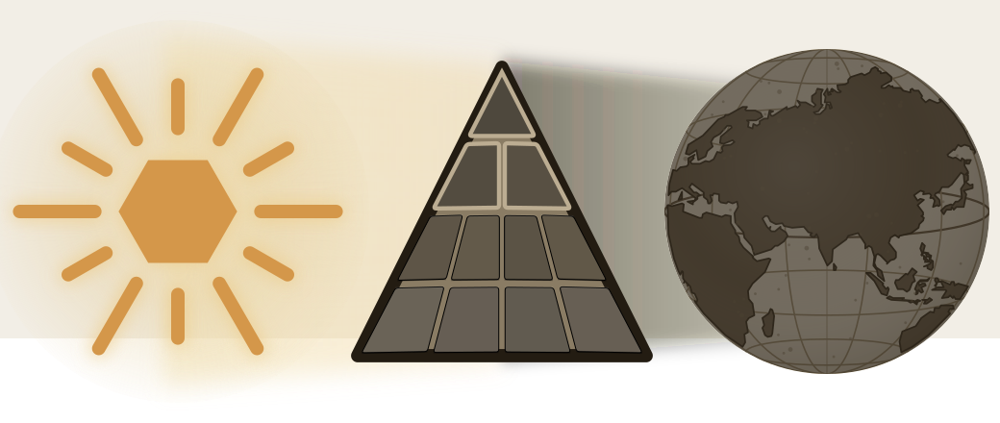

# Part I — How the Shadow Is Cast

::: epigraph

> सत्येन देवान् असृजत् अनृतेन असुरान् ।\
> ते देवाः सत्यम् अभवन् अनृतम् असुराः ॥
>
> *satyena devān asṛjat anṛtena asurān |*\
> *te devāḥ satyam abhavan anṛtam asurāḥ ||*
>
> By truth were created the radiant ones; by untruth, their opposites — the asuras. The radiant ones became truth; the asuras, untruth.
>
> *— Maitrāyaṇī Saṃhitā 1.9.3*[NOTE: maitrayani-samhita-1-9-3-satya-asura]

:::

Three blocks tell one story about Sanskrit. **Descended** places an imaginary parent above the language. **Botanical** describes Sanskrit as something that grew through natural change. **Codified** credits Pāṇini with stopping that change by imposing rules.

{#fig:concise-eclipse-part01 width=100%}

Together, the claims hide the Vedas' role as Sanskrit's distributed calibrant. Chapter 2 asks whether writing a grammar can keep a language unchanged. Chapter 3 explains why the pyramid needs the foreign ancestor and the story of progress. Chapter 4 examines the institutions that teach and enforce those conclusions.

The opening mantra distinguishes the two sides through truth and untruth. The reader must likewise examine what each account of Sanskrit explains, and what it conceals.
